# ZOZI Architecture Governance Audit Report

> **Generated:** 2026-08-04T03:32:30.794310+00:00  
> **Repo:** `D:\Projects\10- E-COMMERCE WEBSITE\zozi`  
> **Result:** 🔴 0 violations · 🟡 1590 advisories · 🟢 51 info  
> **Architecture Debt Score:** **32130**  

---

## 1. The Grid Line (Backend Circuit)

Every file in this project MUST sit inside exactly one of these layers.
Imports flow **downward only**. Any upward import is a violation.

```
HTTP Request
    │
    ▼
┌─────────────────────────────────────────────────────────┐
│ LAYER 0: ENTRY  (main.py, lifespan.py)                  │
│   Only: app creation, middleware registration,          │
│         router mounting                                 │
└─────────────────────────────────────────────────────────┘
    │
    ▼
┌─────────────────────────────────────────────────────────┐
│ LAYER 1: MIDDLEWARE + DEPENDENCIES  (flat, no subdirs)  │
│   Only: request preprocessing, auth, RLS context        │
│   FORBIDDEN: import from services/*, controllers/*      │
└─────────────────────────────────────────────────────────┘
    │
    ▼
┌─────────────────────────────────────────────────────────┐
│ LAYER 2: ROUTERS  — FLAT files                          │
│   filename: {surface}_{domain}_{operation}.py           │
│   Only: endpoint defs, request validation, call ctrl    │
│   FORBIDDEN: session.add/commit/delete, business logic  │
└─────────────────────────────────────────────────────────┘
    │
    ▼
┌─────────────────────────────────────────────────────────┐
│ LAYER 3: CONTROLLERS  — grouped by DOMAIN               │
│   finance/ orders/ catalog/ logistics/ communication/   │
│   Only: orchestrate services, compose responses         │
│   FORBIDDEN: session writes, raw SQL, import routers/   │
└─────────────────────────────────────────────────────────┘
    │
    ▼
┌─────────────────────────────────────────────────────────┐
│ LAYER 4: SERVICES  — grouped by DOMAIN                  │
│   Only: business rules, DB operations, call providers   │
│   FORBIDDEN: import from routers/, controllers/         │
└─────────────────────────────────────────────────────────┘
    │
    ▼
┌─────────────────────────────────────────────────────────┐
│ LAYER 5: PROVIDERS  — grouped by DOMAIN/ADAPTER         │
│   Only: external API adapters (AI, maps, email, pay)    │
│   FORBIDDEN: import from services/, controllers/        │
└─────────────────────────────────────────────────────────┘
    │
    ▼
┌─────────────────────────────────────────────────────────┐
│ LAYER 6: MODELS  — grouped by DOMAIN                    │
│   Only: SQLAlchemy ORM definitions, relationships       │
│   FORBIDDEN: import from ANY other layer                │
└─────────────────────────────────────────────────────────┘
    │
    ▼
┌─────────────────────────────────────────────────────────┐
│ LAYER 7: DB INFRASTRUCTURE  (db/, alembic/)             │
│   Only: engine, session factory, base classes           │
└─────────────────────────────────────────────────────────┘

CROSS-CUTTING:
  utils/     — pure helpers, no state, no DB
  events/    — domain events (grouped by domain)
  jobs/      — background tasks (grouped by domain)
  tests/     — test files (exempt from most rules)
  scripts/   — ops/maintenance scripts (exempt)
```

---

## 2. Current Backend Structure

```mermaid
graph TD
    ROOT["backend/"]
    _triage["_triage/"]
    ROOT --> _triage
    _triage_flat["1 flat .py files"]
    _triage --> _triage_flat
    alembic["alembic/"]
    ROOT --> alembic
    alembic_versions["versions/"]
    alembic --> alembic_versions
    alembic_flat["2 flat .py files"]
    alembic --> alembic_flat
    controllers["controllers/"]
    ROOT --> controllers
    controllers_ai["ai/"]
    controllers --> controllers_ai
    controllers_analytics["analytics/"]
    controllers --> controllers_analytics
    controllers_catalog["catalog/"]
    controllers --> controllers_catalog
    controllers_commerce["commerce/"]
    controllers --> controllers_commerce
    controllers_communication["communication/"]
    controllers --> controllers_communication
    controllers_core["core/"]
    controllers --> controllers_core
    controllers_country["country/"]
    controllers --> controllers_country
    controllers_finance["finance/"]
    controllers --> controllers_finance
    controllers_hr["hr/"]
    controllers --> controllers_hr
    controllers_logistics["logistics/"]
    controllers --> controllers_logistics
    controllers_orders["orders/"]
    controllers --> controllers_orders
    controllers_security["security/"]
    controllers --> controllers_security
    controllers_flat["22 flat .py files"]
    controllers --> controllers_flat
    data["data/"]
    ROOT --> data
    data_flat["76 flat .py files"]
    data --> data_flat
    db["db/"]
    ROOT --> db
    db_sql["sql/"]
    db --> db_sql
    db_flat["9 flat .py files"]
    db --> db_flat
    dependencies["dependencies/"]
    ROOT --> dependencies
    dependencies_flat["2 flat .py files"]
    dependencies --> dependencies_flat
    docs["docs/"]
    ROOT --> docs
    events["events/"]
    ROOT --> events
    events_payments["payments/"]
    events --> events_payments
    middleware["middleware/"]
    ROOT --> middleware
    middleware_flat["21 flat .py files"]
    middleware --> middleware_flat
    models["models/"]
    ROOT --> models
    models_ai["ai/"]
    models --> models_ai
    models_analytics["analytics/"]
    models --> models_analytics
    models_audit["audit/"]
    models --> models_audit
    models_catalog["catalog/"]
    models --> models_catalog
    models_communication["communication/"]
    models --> models_communication
    models_core["core/"]
    models --> models_core
    models_country["country/"]
    models --> models_country
    models_finance["finance/"]
    models --> models_finance
    models_hr["hr/"]
    models --> models_hr
    models_logistics["logistics/"]
    models --> models_logistics
    models_media["media/"]
    models --> models_media
    models_orders["orders/"]
    models --> models_orders
    models_flat["3 flat .py files"]
    models --> models_flat
    providers["providers/"]
    ROOT --> providers
    providers_ai["ai/"]
    providers --> providers_ai
    providers_analytics["analytics/"]
    providers --> providers_analytics
    providers_catalog["catalog/"]
    providers --> providers_catalog
    providers_configuration["configuration/"]
    providers --> providers_configuration
    providers_country["country/"]
    providers --> providers_country
    providers_finance["finance/"]
    providers --> providers_finance
    providers_hr["hr/"]
    providers --> providers_hr
    providers_legacy["legacy/"]
    providers --> providers_legacy
    providers_logistics["logistics/"]
    providers --> providers_logistics
    providers_media["media/"]
    providers --> providers_media
    providers_flat["7 flat .py files"]
    providers --> providers_flat
    routers["routers/"]
    ROOT --> routers
    routers_flat["143 flat .py files"]
    routers --> routers_flat
    services["services/"]
    ROOT --> services
    services_ai["ai/"]
    services --> services_ai
    services_analytics["analytics/"]
    services --> services_analytics
    services_audit["audit/"]
    services --> services_audit
    services_catalog["catalog/"]
    services --> services_catalog
    services_commerce["commerce/"]
    services --> services_commerce
    services_communication["communication/"]
    services --> services_communication
    services_core["core/"]
    services --> services_core
    services_country["country/"]
    services --> services_country
    services_customer["customer/"]
    services --> services_customer
    services_finance["finance/"]
    services --> services_finance
    services_hr["hr/"]
    services --> services_hr
    services_location["location/"]
    services --> services_location
    services_flat["10 flat .py files"]
    services --> services_flat
    tests["tests/"]
    ROOT --> tests
    tests_playwright["playwright/"]
    tests --> tests_playwright
    tests_scripts["scripts/"]
    tests --> tests_scripts
    tests_flat["56 flat .py files"]
    tests --> tests_flat
    utils["utils/"]
    ROOT --> utils
    utils_flat["69 flat .py files"]
    utils --> utils_flat
```



---

## 3. Suggested Backend Structure

```mermaid
graph TD
    ROOT["backend/ (suggested target)"]
    be_triage["_triage/"]
    ROOT --> be_triage
    be_alembic["alembic/"]
    ROOT --> be_alembic
    be_alembic_versions["versions/"]
    be_alembic --> be_alembic_versions
    be_controllers["controllers/"]
    ROOT --> be_controllers
    be_controllers_ai["ai/"]
    be_controllers --> be_controllers_ai
    be_controllers_analytics["analytics/"]
    be_controllers --> be_controllers_analytics
    be_controllers_audit["audit/ ✨"]
    be_controllers --> be_controllers_audit
    be_controllers_catalog["catalog/"]
    be_controllers --> be_controllers_catalog
    be_controllers_commerce["commerce/"]
    be_controllers --> be_controllers_commerce
    be_controllers_comms["comms/ ✨"]
    be_controllers --> be_controllers_comms
    be_controllers_communication["communication/"]
    be_controllers --> be_controllers_communication
    be_controllers_core["core/"]
    be_controllers --> be_controllers_core
    be_controllers_country["country/"]
    be_controllers --> be_controllers_country
    be_controllers_finance["finance/"]
    be_controllers --> be_controllers_finance
    be_controllers_geography["geography/ ✨"]
    be_controllers --> be_controllers_geography
    be_controllers_hr["hr/"]
    be_controllers --> be_controllers_hr
    be_controllers_logistics["logistics/"]
    be_controllers --> be_controllers_logistics
    be_controllers_orders["orders/"]
    be_controllers --> be_controllers_orders
    be_controllers_security["security/"]
    be_controllers --> be_controllers_security
    be_controllers_supplier["supplier/"]
    be_controllers --> be_controllers_supplier
    be_controllers_treasury["treasury/"]
    be_controllers --> be_controllers_treasury
    be_data["data/"]
    ROOT --> be_data
    be_db["db/"]
    ROOT --> be_db
    be_db_sql["sql/"]
    be_db --> be_db_sql
    be_dependencies["dependencies/"]
    ROOT --> be_dependencies
    be_docs["docs/"]
    ROOT --> be_docs
    be_events["events/"]
    ROOT --> be_events
    be_events_payments["payments/"]
    be_events --> be_events_payments
    be_middleware["middleware/"]
    ROOT --> be_middleware
    be_models["models/"]
    ROOT --> be_models
    be_models_ai["ai/"]
    be_models --> be_models_ai
    be_models_analytics["analytics/"]
    be_models --> be_models_analytics
    be_models_audit["audit/"]
    be_models --> be_models_audit
    be_models_catalog["catalog/"]
    be_models --> be_models_catalog
    be_models_comms["comms/ ✨"]
    be_models --> be_models_comms
    be_models_communication["communication/"]
    be_models --> be_models_communication
    be_models_core["core/"]
    be_models --> be_models_core
    be_models_country["country/"]
    be_models --> be_models_country
    be_models_finance["finance/"]
    be_models --> be_models_finance
    be_models_geography["geography/ ✨"]
    be_models --> be_models_geography
    be_models_hr["hr/"]
    be_models --> be_models_hr
    be_models_logistics["logistics/"]
    be_models --> be_models_logistics
    be_models_media["media/"]
    be_models --> be_models_media
    be_models_orders["orders/"]
    be_models --> be_models_orders
    be_models_security["security/"]
    be_models --> be_models_security
    be_models_supplier["supplier/"]
    be_models --> be_models_supplier
    be_models_treasury["treasury/"]
    be_models --> be_models_treasury
    be_providers["providers/"]
    ROOT --> be_providers
    be_providers_ai["ai/"]
    be_providers --> be_providers_ai
    be_providers_analytics["analytics/"]
    be_providers --> be_providers_analytics
    be_providers_catalog["catalog/"]
    be_providers --> be_providers_catalog
    be_providers_configuration["configuration/"]
    be_providers --> be_providers_configuration
    be_providers_country["country/"]
    be_providers --> be_providers_country
    be_providers_finance["finance/"]
    be_providers --> be_providers_finance
    be_providers_geography["geography/ ✨"]
    be_providers --> be_providers_geography
    be_providers_hr["hr/"]
    be_providers --> be_providers_hr
    be_providers_legacy["legacy/"]
    be_providers --> be_providers_legacy
    be_providers_logistics["logistics/"]
    be_providers --> be_providers_logistics
    be_providers_media["media/"]
    be_providers --> be_providers_media
    be_routers["routers/ (flat: surface_domain_operation.py)"]
    ROOT --> be_routers
    be_routers_accounting_py["accounting.py"]
    be_routers --> be_routers_accounting_py
    be_routers_addresses_py["addresses.py"]
    be_routers --> be_routers_addresses_py
    be_routers_admin_py["admin.py"]
    be_routers --> be_routers_admin_py
    be_routers_admin_analytics_py["admin_analytics.py"]
    be_routers --> be_routers_admin_analytics_py
    be_routers_admin_banners_py["admin_banners.py"]
    be_routers --> be_routers_admin_banners_py
    be_routers_admin_cash_py["admin_cash.py"]
    be_routers --> be_routers_admin_cash_py
    be_routers_admin_categories_py["admin_categories.py"]
    be_routers --> be_routers_admin_categories_py
    be_routers_admin_chat_py["admin_chat.py"]
    be_routers --> be_routers_admin_chat_py
    be_routers_admin_commission_py["admin_commission.py"]
    be_routers --> be_routers_admin_commission_py
    be_routers_admin_countries_py["admin_countries.py"]
    be_routers --> be_routers_admin_countries_py
    be_routers_admin_email_py["admin_email.py"]
    be_routers --> be_routers_admin_email_py
    be_routers_admin_fallback_py["admin_fallback.py"]
    be_routers --> be_routers_admin_fallback_py
    be_services["services/"]
    ROOT --> be_services
    be_services_ai["ai/"]
    be_services --> be_services_ai
    be_services_analytics["analytics/"]
    be_services --> be_services_analytics
    be_services_audit["audit/"]
    be_services --> be_services_audit
    be_services_catalog["catalog/"]
    be_services --> be_services_catalog
    be_services_commerce["commerce/"]
    be_services --> be_services_commerce
    be_services_comms["comms/ ✨"]
    be_services --> be_services_comms
    be_services_communication["communication/"]
    be_services --> be_services_communication
    be_services_core["core/"]
    be_services --> be_services_core
    be_services_country["country/"]
    be_services --> be_services_country
    be_services_customer["customer/"]
    be_services --> be_services_customer
    be_services_finance["finance/"]
    be_services --> be_services_finance
    be_services_geography["geography/ ✨"]
    be_services --> be_services_geography
    be_services_hr["hr/"]
    be_services --> be_services_hr
    be_services_location["location/"]
    be_services --> be_services_location
    be_services_logistics["logistics/"]
    be_services --> be_services_logistics
    be_services_media["media/"]
    be_services --> be_services_media
    be_services_orders["orders/"]
    be_services --> be_services_orders
    be_services_payments["payments/"]
    be_services --> be_services_payments
    be_services_security["security/"]
    be_services --> be_services_security
    be_services_supplier["supplier/"]
    be_services --> be_services_supplier
    be_tests["tests/"]
    ROOT --> be_tests
    be_tests_playwright["playwright/"]
    be_tests --> be_tests_playwright
    be_tests_scripts["scripts/"]
    be_tests --> be_tests_scripts
    be_utils["utils/"]
    ROOT --> be_utils
```



---

## 4. Current Frontend Structure

```mermaid
graph TD
    fe_frontend["frontend/"]
    fe_mobile_app["mobile_app/ (10 files)"]
    fe_frontend --> fe_mobile_app
    fe_mobile_app_android["android/"]
    fe_mobile_app --> fe_mobile_app_android
    fe_mobile_app_app["app/ (26 files)"]
    fe_mobile_app --> fe_mobile_app_app
    fe_mobile_app_app_auth["(auth)/ (6 files)"]
    fe_mobile_app_app --> fe_mobile_app_app_auth
    fe_mobile_app_app_tabs["(tabs)/ (3 files)"]
    fe_mobile_app_app --> fe_mobile_app_app_tabs
    fe_mobile_app_app_admin["admin/ (20 files)"]
    fe_mobile_app_app --> fe_mobile_app_app_admin
    fe_mobile_app_app_logistics_partner["logistics-partner/ (9 files)"]
    fe_mobile_app_app --> fe_mobile_app_app_logistics_partner
    fe_mobile_app_app_logistics_partners["logistics-partners/ (2 files)"]
    fe_mobile_app_app --> fe_mobile_app_app_logistics_partners
    fe_mobile_app_app_newsletter["newsletter/ (2 files)"]
    fe_mobile_app_app --> fe_mobile_app_app_newsletter
    fe_mobile_app_app_orders["orders/ (1 files)"]
    fe_mobile_app_app --> fe_mobile_app_app_orders
    fe_mobile_app_app_products["products/ (2 files)"]
    fe_mobile_app_app --> fe_mobile_app_app_products
    fe_mobile_app_app_r["r/ (1 files)"]
    fe_mobile_app_app --> fe_mobile_app_app_r
    fe_mobile_app_app_returns["returns/ (1 files)"]
    fe_mobile_app_app --> fe_mobile_app_app_returns
    fe_mobile_app_assets["assets/"]
    fe_mobile_app --> fe_mobile_app_assets
    fe_mobile_app_components["components/ (20 files)"]
    fe_mobile_app --> fe_mobile_app_components
    fe_mobile_app_components_ui["ui/ (36 files)"]
    fe_mobile_app_components --> fe_mobile_app_components_ui
    fe_mobile_app_lib["lib/ (49 files)"]
    fe_mobile_app --> fe_mobile_app_lib
    fe_mobile_app_mocks["mocks/ (1 files)"]
    fe_mobile_app --> fe_mobile_app_mocks
    fe_mobile_app_scripts["scripts/ (4 files)"]
    fe_mobile_app --> fe_mobile_app_scripts
    fe_mobile_app_theme["theme/ (2 files)"]
    fe_mobile_app --> fe_mobile_app_theme
    fe_shared["shared/ (2 files)"]
    fe_frontend --> fe_shared
    fe_shared_src["src/ (37 files)"]
    fe_shared --> fe_shared_src
    fe_shared_src_components["components/ (3 files)"]
    fe_shared_src --> fe_shared_src_components
    fe_shared_src_logo["logo/ (9 files)"]
    fe_shared_src --> fe_shared_src_logo
    fe_web_app["web_app/ (10 files)"]
    fe_frontend --> fe_web_app
    fe_web_app_e2e_screenshots["e2e-screenshots/"]
    fe_web_app --> fe_web_app_e2e_screenshots
    fe_web_app_public["public/"]
    fe_web_app --> fe_web_app_public
    fe_web_app_scripts["scripts/ (4 files)"]
    fe_web_app --> fe_web_app_scripts
    fe_web_app_src["src/"]
    fe_web_app --> fe_web_app_src
    fe_web_app_src_app["app/ (8 files)"]
    fe_web_app_src --> fe_web_app_src_app
    fe_web_app_src_components["components/ (72 files)"]
    fe_web_app_src --> fe_web_app_src_components
    fe_web_app_src_hooks["hooks/ (13 files)"]
    fe_web_app_src --> fe_web_app_src_hooks
    fe_web_app_src_lib["lib/ (53 files)"]
    fe_web_app_src --> fe_web_app_src_lib
    fe_web_app_src_logo["logo/ (6 files)"]
    fe_web_app_src --> fe_web_app_src_logo
    fe_web_app_src_services["services/ (3 files)"]
    fe_web_app_src --> fe_web_app_src_services
    fe_web_app_src_styles["styles/"]
    fe_web_app_src --> fe_web_app_src_styles
    fe_web_app_src_theme["theme/ (1 files)"]
    fe_web_app_src --> fe_web_app_src_theme
    fe_web_app_src_types["types/ (1 files)"]
    fe_web_app_src --> fe_web_app_src_types
    fe_web_app_src_utils["utils/ (1 files)"]
    fe_web_app_src --> fe_web_app_src_utils
    fe_web_app_test_assets["test-assets/"]
    fe_web_app --> fe_web_app_test_assets
```



---

## 5. Suggested Frontend Structure

```mermaid
graph TD
    ROOT["frontend/ (suggested)"]
    fe_mobile_app["mobile_app/ ✅"]
    ROOT --> fe_mobile_app
    fe_mobile_app_app["app/"]
    fe_mobile_app --> fe_mobile_app_app
    fe_mobile_app_components["components/"]
    fe_mobile_app --> fe_mobile_app_components
    fe_mobile_app_lib["lib/"]
    fe_mobile_app --> fe_mobile_app_lib
    fe_mobile_app_hooks["hooks/"]
    fe_mobile_app --> fe_mobile_app_hooks
    fe_mobile_app_features["features/"]
    fe_mobile_app --> fe_mobile_app_features
    fe_mobile_app_assets["assets/"]
    fe_mobile_app --> fe_mobile_app_assets
    fe_shared["shared/ ✅"]
    ROOT --> fe_shared
    fe_shared_src_components["src/components/"]
    fe_shared --> fe_shared_src_components
    fe_shared_src_lib["src/lib/"]
    fe_shared --> fe_shared_src_lib
    fe_shared_src_types["src/types/"]
    fe_shared --> fe_shared_src_types
    fe_shared_src_hooks["src/hooks/"]
    fe_shared --> fe_shared_src_hooks
    fe_web_app["web_app/ ✅"]
    ROOT --> fe_web_app
    fe_web_app_src_app["src/app/"]
    fe_web_app --> fe_web_app_src_app
    fe_web_app_src_components["src/components/"]
    fe_web_app --> fe_web_app_src_components
    fe_web_app_src_lib["src/lib/"]
    fe_web_app --> fe_web_app_src_lib
    fe_web_app_src_hooks["src/hooks/"]
    fe_web_app --> fe_web_app_src_hooks
    fe_web_app_src_features["src/features/"]
    fe_web_app --> fe_web_app_src_features
    fe_web_app_src_styles["src/styles/"]
    fe_web_app --> fe_web_app_src_styles
```



---

## 6. AI File Placement Contract

## AI File Placement Contract

**Rule for AI:** Before creating or moving any backend file, use this contract.

### Layer rules

| Layer | Structure | Correct examples |
|---|---|---|
| `backend/routers/` | **Flat file**: `{surface}_{domain}_{operation}.py` | `admin_orders_management.py`, `supplier_orders_fulfillment.py`, `customer_orders_tracking.py`, `public_catalog_product_browsing.py` |
| `backend/controllers/` | Domain folder + surface-prefixed controller file | `controllers/orders/admin_order_management_controller.py`, `controllers/catalog/supplier_product_management_controller.py` |
| `backend/services/` | Domain folder | `services/orders/order_management_service.py`, `services/finance/payment_processing_service.py` |
| `backend/models/` | Domain folder | `models/orders/order_entities.py` |
| `backend/providers/` | Domain/adapter folder | `providers/ai/image_analysis_provider.py` |
| `backend/events/` | Domain folder | `events/orders/order_events.py` |
| `backend/jobs/` | Domain folder | `jobs/finance/payout_batch_job.py` |

### Admin CRUD handling

Admin is a **surface**, not a domain.

Do not create:

```text
backend/services/admin/
backend/controllers/admin/
backend/routers/admin/
```

Use this instead:

```text
backend/routers/admin_orders_management.py
backend/controllers/orders/admin_order_management_controller.py
backend/services/orders/order_management_service.py
```

### Forbidden folders

```text
backend/routers/admin/
backend/routers/finance/
backend/routers/catalog/
backend/routers/orders/
backend/controllers/admin/
backend/services/admin/
backend/models/admin/
backend/providers/admin/
backend/events/admin/
backend/jobs/admin/
backend/services/write/
backend/services/common/
backend/services/legacy/
```

### Domain keyword routing

| Domain | Put files here | Keywords |
|---|---|---|
| `ai` | `backend/services/ai/`, `backend/models/ai/`, `backend/controllers/ai/` | ai, automation, bg, bg_removal, chatbot, embedding, embeddings, image_ai, ml, ocr, recommendation, removal, research, text |
| `analytics` | `backend/services/analytics/`, `backend/models/analytics/`, `backend/controllers/analytics/` | analytics, dashboard, insights, kpi, metrics, mv, report, reports, snapshot, snapshots |
| `audit` | `backend/services/audit/`, `backend/models/audit/`, `backend/controllers/audit/` | audit, audit_log, audit_trail, auditor, communication_audit, permission_audit, worm |
| `catalog` | `backend/services/catalog/`, `backend/models/catalog/`, `backend/controllers/catalog/` | advanced_filter, advanced_search, catalog, categories, category, filter, filters, inventory, moderation, product, product_moderation, product_verification, products, search |
| `commerce` | `backend/services/commerce/`, `backend/models/commerce/`, `backend/controllers/commerce/` | commerce, coupon, coupons, discount, discounts, flash_sale, loyalty, promotion, promotions, referral, reviews, wishlist |
| `comms` | `backend/services/comms/`, `backend/models/comms/`, `backend/controllers/comms/` | chat, comm, comms, communication, email, fix_chat, meeting, message, messages, notification, notifications, push, sms, ticket |
| `configuration` | `backend/services/configuration/`, `backend/models/configuration/`, `backend/controllers/configuration/` | config, configuration, feature, feature_flag, flag, rules, toggles |
| `core` | `backend/services/core/`, `backend/models/core/`, `backend/controllers/core/` | approval, approval_matrix, banner, banners, core, customer_health, device, identity, platform, preferences, role, roles, session, settings |
| `customer` | `backend/services/customer/`, `backend/models/customer/`, `backend/controllers/customer/` | address, addresses, customer, customers, point, points, profile |
| `finance` | `backend/services/finance/`, `backend/models/finance/`, `backend/controllers/finance/` | accounting, ap, ar, billing, commission, commission_write, credit_control, erp, finance, finance_automation, finance_erp, financial, financial_reporting, financial_reports |
| `geography` | `backend/services/geography/`, `backend/models/geography/`, `backend/controllers/geography/` | border, cities, city, countries, country, country_detection, country_research, cross, cross_border, cross_border_tracker, currency, economics, geography, localization |
| `hr` | `backend/services/hr/`, `backend/models/hr/`, `backend/controllers/hr/` | attendance, background, background_check, coi, dei, employee, employees, handover, hr, hse, leave, lms, offboarding, payroll |
| `logistics` | `backend/services/logistics/`, `backend/models/logistics/`, `backend/controllers/logistics/` | carrier, delivery, dispatch, fleet, geo, geo_fence, geofence, live_tracking, logistics, map, parcel, pod, route, routes |
| `media` | `backend/services/media/`, `backend/models/media/`, `backend/controllers/media/` | asset, assets, file, free_image, image, images, media, storage, upload, uploads |
| `orders` | `backend/services/orders/`, `backend/models/orders/`, `backend/controllers/orders/` | cart, checkout, dispute, disputes, fulfillment, ghost, order, orders, purchase, purchases, return, returns |
| `security` | `backend/services/security/`, `backend/models/security/`, `backend/controllers/security/` | auth, authentication, authorization, biometric, blacklist, csrf, device_binding, fraud, ghost, ghost_watchdog, iam, incident, mfa, otp |
| `supplier` | `backend/services/supplier/`, `backend/models/supplier/`, `backend/controllers/supplier/` | badge, kyc, onboarding, storefront, supplier, supplier_badge, supplier_health, supplier_inventory, supplier_onboarding, supplier_products, supplier_profile, suppliers, vendor, vendors |
| `treasury` | `backend/services/treasury/`, `backend/models/treasury/`, `backend/controllers/treasury/` | auto_payout, bank, cash, cash_flow, gateway_reconciliation, payment_engine, payment_orchestrator, payout, payout_batch, payouts, reconciliation, settlement, settlements, treasurer |

### If domain is unclear

If a file does not clearly belong to a domain:

```text
backend/_triage/<file>.py
```

Then ask for a domain decision before merging.


---

## 7. Scorecard

| Code | Count | Sev | Meaning |
|---|---:|---|---|
| A1 | 12 | 🟡 ADVISORY | architecture hotspot (high coupling / instability) |
| A2 | 150 | 🟡 ADVISORY | possibly dead/orphan module (no inbound imports; not an entrypoint) |
| API2 | 100 | 🟡 ADVISORY | internal symbol exposed outside its module boundary |
| BC1 | 17 | 🟡 ADVISORY | cross-domain import bypasses event/facade boundary |
| BC3 | 4 | 🟡 ADVISORY | bounded context leakage detected |
| CA1 | 9 | 🟡 ADVISORY | file name does not match file content (operations mismatch) |
| CA2 | 100 | 🟡 ADVISORY | file contains operations from multiple domains (split candidate) |
| CFG2 | 34 | 🟡 ADVISORY | unknown domain referenced in policy |
| CFG3 | 3 | 🟡 ADVISORY | malformed or contradictory policy rule |
| CFG4 | 4 | 🟡 ADVISORY | policy-level domain cycle |
| CFG5 | 1 | 🟡 ADVISORY | generated governance artifacts not gitignored |
| CIR2 | 104 | 🟡 ADVISORY | circuit bypass: import skips the preferred layer (migration warning) |
| D1 | 6 | 🟡 ADVISORY | duplicate module basename within backend (import-shadow) |
| D3 | 77 | 🟡 ADVISORY | duplicate class name across modules |
| DB1 | 3 | 🟡 ADVISORY | ORM model missing __table_args__ schema declaration |
| DG2 | 9 | 🟡 ADVISORY | circular dependency detected |
| DG4 | 2 | 🟡 ADVISORY | dynamic import edge detected |
| DG5 | 6 | 🟡 ADVISORY | dynamic execution obscures dependency graph |
| DOM2 | 16 | 🟡 ADVISORY | file is inside the wrong domain folder |
| DOM6 | 13 | 🟢 INFO | new domain candidate auto-detected |
| DOM7 | 21 | 🟡 ADVISORY | unknown or non-canonical domain folder |
| DOM8 | 1 | 🟢 INFO | correctly placed domain files |
| F4 | 5 | 🟡 ADVISORY | committed cache/build/artifact present (bloat) |
| F8 | 1 | 🟡 ADVISORY | non-document artifact at documents/ root |
| F9 | 7 | 🟡 ADVISORY | repo-root note outside allow-list / banned dir |
| FE3 | 3 | 🟡 ADVISORY | frontend flat folder scaling warning |
| FE6 | 48 | 🟡 ADVISORY | frontend console/debugger statement left in source |
| FE7 | 30 | 🟡 ADVISORY | frontend component in wrong feature folder |
| FT1 | 2 | 🟡 ADVISORY | flow-type violation: operation not allowed for this surface×domain flow |
| H1 | 9 | 🟡 ADVISORY | sys.path.insert/append (import-resolution footgun) |
| I1 | 1 | 🟢 INFO | structure summary |
| I2 | 1 | 🟢 INFO | rules source (yaml vs embedded fallback) |
| I3 | 1 | 🟢 INFO | architecture metric summary |
| I4 | 1 | 🟢 INFO | file move suggestions generated |
| L1 | 1 | 🟡 ADVISORY | multiple RLS enforcers (fail-open risk) |
| M1 | 1 | 🟡 ADVISORY | ORM model outside models/ package |
| MET1 | 1 | 🟢 INFO | architecture debt score |
| MET2 | 9 | 🟡 ADVISORY | module instability exceeds threshold |
| MET3 | 5 | 🟢 INFO | abstractness below threshold (no interfaces) |
| MV1 | 18 | 🟡 ADVISORY | flat layer file should be moved into its detected domain folder |
| MV2 | 2 | 🟡 ADVISORY | mis-housed / backend-root file should be relocated to canonical layer |
| MW2 | 1 | 🟡 ADVISORY | required middleware missing |
| NM | 7 | 🟢 INFO | node_modules present (confirm gitignored) |
| P1 | 2 | 🟡 ADVISORY | scratch script at backend root (delete / scripts/) |
| P2 | 2 | 🟡 ADVISORY | controller file outside controllers/ |
| P3 | 2 | 🟡 ADVISORY | module at backend root (belongs in a layer package) |
| P4 | 2 | 🟡 ADVISORY | missing expected backend package |
| P5 | 7 | 🟡 ADVISORY | python package missing __init__.py |
| PERF2 | 34 | 🟡 ADVISORY | possible DB query inside loop (N+1 risk) |
| PERF4 | 200 | 🟡 ADVISORY | unbounded query detected (no limit clause) |
| PF1 | 1 | 🟢 INFO | required project file missing |
| PF2 | 8 | 🟡 ADVISORY | required scope document missing |
| Q1 | 9 | 🟡 ADVISORY | controller/router reads via db.query (delegate) |
| QUAL1 | 41 | 🟡 ADVISORY | weak exception handling (bare except / swallowed exception) |
| QUAL2 | 5 | 🟡 ADVISORY | TODO/FIXME technical debt marker |
| QUAL3 | 56 | 🟡 ADVISORY | oversized file or function (scaling/maintainability risk) |
| QUAL4 | 12 | 🟡 ADVISORY | print/debug output in application code |
| REG1 | 13 | 🟢 INFO | domain missing from architecture registry |
| RN1 | 134 | 🟡 ADVISORY | flat router filename must be comprehensive: {surface}_{domain}_{operation}.py |
| S2 | 2 | 🟡 ADVISORY | overlapping service stems (ownership ambiguity) |
| SEC6 | 4 | 🟡 ADVISORY | potential SSRF risk |
| SEC7 | 2 | 🟡 ADVISORY | potential path traversal risk |
| SYM1 | 100 | 🟡 ADVISORY | symbol defined but never used (dead symbol) |
| SYM2 | 100 | 🟡 ADVISORY | duplicate symbol definition across modules |
| W4 | 59 | 🟡 ADVISORY | controller imports another controller (shared logic -> service/util) |

---

## 8. 🔥 Damage Hotlist (fix these first)

| Sev | Rule | Domain | Location | Problem | Fix |
|---|---|---|---|---|---|
| 🟡 | A1 | backend | `backend\data\db.py` | architecture hotspot: fan_in=181, fan_out=1, instability=0.01 | reduce coupling; split responsibilities or introduce an abstraction layer |
| 🟡 | A1 | backend | `backend\data\dependencies_auth.py` | architecture hotspot: fan_in=57, fan_out=1, instability=0.02 | reduce coupling; split responsibilities or introduce an abstraction layer |
| 🟡 | A1 | backend | `backend\data\models.py` | architecture hotspot: fan_in=314, fan_out=1, instability=0.00 | reduce coupling; split responsibilities or introduce an abstraction layer |
| 🟡 | A1 | backend | `backend\data\models_employee_models.py` | architecture hotspot: fan_in=47, fan_out=1, instability=0.02 | reduce coupling; split responsibilities or introduce an abstraction layer |
| 🟡 | A1 | backend | `backend\data\schemas.py` | architecture hotspot: fan_in=57, fan_out=1, instability=0.02 | reduce coupling; split responsibilities or introduce an abstraction layer |
| 🟡 | A1 | backend | `backend\data\services_write_helpers.py` | architecture hotspot: fan_in=34, fan_out=1, instability=0.03 | reduce coupling; split responsibilities or introduce an abstraction layer |
| 🟡 | A1 | backend | `backend\models\__init__.py` | architecture hotspot: fan_in=39, fan_out=34, instability=0.47 | reduce coupling; split responsibilities or introduce an abstraction layer |
| 🟡 | A1 | backend | `backend\services\__init__.py` | architecture hotspot: fan_in=120, fan_out=1, instability=0.01 | reduce coupling; split responsibilities or introduce an abstraction layer |
| 🟡 | A1 | backend | `backend\tests\conftest.py` | architecture hotspot: fan_in=0, fan_out=22, instability=1.00 | reduce coupling; split responsibilities or introduce an abstraction layer |
| 🟡 | A1 | backend | `backend\utils\config.py` | architecture hotspot: fan_in=57, fan_out=0, instability=0.00 | reduce coupling; split responsibilities or introduce an abstraction layer |
| 🟡 | A1 | backend | `backend\utils\datetime_utils.py` | architecture hotspot: fan_in=90, fan_out=0, instability=0.00 | reduce coupling; split responsibilities or introduce an abstraction layer |
| 🟡 | A1 | backend | `backend\utils\dependencies.py` | architecture hotspot: fan_in=60, fan_out=6, instability=0.09 | reduce coupling; split responsibilities or introduce an abstraction layer |
| 🟡 | A2 | backend | `backend\controllers\audit_controller.py` | module has no inbound imports and is not an obvious entrypoint | verify usage; delete if unused, or wire it through the correct layer |
| 🟡 | A2 | backend | `backend\controllers\catalog\admin_products_controller.py` | module has no inbound imports and is not an obvious entrypoint | verify usage; delete if unused, or wire it through the correct layer |
| 🟡 | A2 | backend | `backend\controllers\catalog\flash_sale_controller.py` | module has no inbound imports and is not an obvious entrypoint | verify usage; delete if unused, or wire it through the correct layer |
| 🟡 | A2 | backend | `backend\controllers\commerce\coupons_controller.py` | module has no inbound imports and is not an obvious entrypoint | verify usage; delete if unused, or wire it through the correct layer |
| 🟡 | A2 | backend | `backend\controllers\core\export_controller.py` | module has no inbound imports and is not an obvious entrypoint | verify usage; delete if unused, or wire it through the correct layer |
| 🟡 | A2 | backend | `backend\controllers\employees_controller.py` | module has no inbound imports and is not an obvious entrypoint | verify usage; delete if unused, or wire it through the correct layer |
| 🟡 | A2 | backend | `backend\controllers\finance\accounting_controller.py` | module has no inbound imports and is not an obvious entrypoint | verify usage; delete if unused, or wire it through the correct layer |
| 🟡 | A2 | backend | `backend\controllers\finance\commission_controller.py` | module has no inbound imports and is not an obvious entrypoint | verify usage; delete if unused, or wire it through the correct layer |
| 🟡 | A2 | backend | `backend\controllers\finance\payments_controller.py` | module has no inbound imports and is not an obvious entrypoint | verify usage; delete if unused, or wire it through the correct layer |
| 🟡 | A2 | backend | `backend\controllers\hr\command_center.py` | module has no inbound imports and is not an obvious entrypoint | verify usage; delete if unused, or wire it through the correct layer |
| 🟡 | A2 | backend | `backend\controllers\security\admin_auth_controller.py` | module has no inbound imports and is not an obvious entrypoint | verify usage; delete if unused, or wire it through the correct layer |
| 🟡 | A2 | backend | `backend\controllers\security\admin_permissions_controller.py` | module has no inbound imports and is not an obvious entrypoint | verify usage; delete if unused, or wire it through the correct layer |
| 🟡 | A2 | backend | `backend\controllers\supplier\supplier_document_controller.py` | module has no inbound imports and is not an obvious entrypoint | verify usage; delete if unused, or wire it through the correct layer |
| 🟡 | A2 | backend | `backend\controllers\treasury\cash_management_controller.py` | module has no inbound imports and is not an obvious entrypoint | verify usage; delete if unused, or wire it through the correct layer |
| 🟡 | A2 | backend | `backend\db\create_tables.py` | module has no inbound imports and is not an obvious entrypoint | verify usage; delete if unused, or wire it through the correct layer |
| 🟡 | A2 | backend | `backend\db\init_db.py` | module has no inbound imports and is not an obvious entrypoint | verify usage; delete if unused, or wire it through the correct layer |
| 🟡 | A2 | backend | `backend\db\models_country_enhancements.py` | module has no inbound imports and is not an obvious entrypoint | verify usage; delete if unused, or wire it through the correct layer |
| 🟡 | A2 | backend | `backend\models\marketing.py` | module has no inbound imports and is not an obvious entrypoint | verify usage; delete if unused, or wire it through the correct layer |
| 🟡 | A2 | backend | `backend\services\ai\ai_automation_service.py` | module has no inbound imports and is not an obvious entrypoint | verify usage; delete if unused, or wire it through the correct layer |
| 🟡 | A2 | backend | `backend\services\ai\ai_copy_jobs.py` | module has no inbound imports and is not an obvious entrypoint | verify usage; delete if unused, or wire it through the correct layer |
| 🟡 | A2 | backend | `backend\services\ai\ai_research_jobs.py` | module has no inbound imports and is not an obvious entrypoint | verify usage; delete if unused, or wire it through the correct layer |
| 🟡 | A2 | backend | `backend\services\ai\ai_service.py` | module has no inbound imports and is not an obvious entrypoint | verify usage; delete if unused, or wire it through the correct layer |
| 🟡 | A2 | backend | `backend\services\ai\ai_variant_config.py` | module has no inbound imports and is not an obvious entrypoint | verify usage; delete if unused, or wire it through the correct layer |
| 🟡 | A2 | backend | `backend\services\ai\automation_scheduler.py` | module has no inbound imports and is not an obvious entrypoint | verify usage; delete if unused, or wire it through the correct layer |
| 🟡 | A2 | backend | `backend\services\ai\bg_removal_presets.py` | module has no inbound imports and is not an obvious entrypoint | verify usage; delete if unused, or wire it through the correct layer |
| 🟡 | A2 | backend | `backend\services\ai\bg_removal_service.py` | module has no inbound imports and is not an obvious entrypoint | verify usage; delete if unused, or wire it through the correct layer |
| 🟡 | A2 | backend | `backend\services\ai\ocr_parser.py` | module has no inbound imports and is not an obvious entrypoint | verify usage; delete if unused, or wire it through the correct layer |
| 🟡 | A2 | backend | `backend\services\analytics\admin_analytics_service.py` | module has no inbound imports and is not an obvious entrypoint | verify usage; delete if unused, or wire it through the correct layer |
| 🟡 | A2 | backend | `backend\services\analytics\financial_reports_service.py` | module has no inbound imports and is not an obvious entrypoint | verify usage; delete if unused, or wire it through the correct layer |
| 🟡 | A2 | backend | `backend\services\audit\audit_service.py` | module has no inbound imports and is not an obvious entrypoint | verify usage; delete if unused, or wire it through the correct layer |
| 🟡 | A2 | backend | `backend\services\audit\audit_trail_service.py` | module has no inbound imports and is not an obvious entrypoint | verify usage; delete if unused, or wire it through the correct layer |
| 🟡 | A2 | backend | `backend\services\audit\worm_audit.py` | module has no inbound imports and is not an obvious entrypoint | verify usage; delete if unused, or wire it through the correct layer |
| 🟡 | A2 | backend | `backend\services\catalog\advanced_filter_service.py` | module has no inbound imports and is not an obvious entrypoint | verify usage; delete if unused, or wire it through the correct layer |
| 🟡 | A2 | backend | `backend\services\catalog\advanced_search_engine.py` | module has no inbound imports and is not an obvious entrypoint | verify usage; delete if unused, or wire it through the correct layer |
| 🟡 | A2 | backend | `backend\services\catalog\ai_search_service.py` | module has no inbound imports and is not an obvious entrypoint | verify usage; delete if unused, or wire it through the correct layer |
| 🟡 | A2 | backend | `backend\services\catalog\product_verification_service.py` | module has no inbound imports and is not an obvious entrypoint | verify usage; delete if unused, or wire it through the correct layer |
| 🟡 | A2 | backend | `backend\services\catalog\search_service.py` | module has no inbound imports and is not an obvious entrypoint | verify usage; delete if unused, or wire it through the correct layer |
| 🟡 | A2 | backend | `backend\services\catalog\variant_config_service.py` | module has no inbound imports and is not an obvious entrypoint | verify usage; delete if unused, or wire it through the correct layer |
| 🟡 | A2 | backend | `backend\services\catalog\wishlist_read_service.py` | module has no inbound imports and is not an obvious entrypoint | verify usage; delete if unused, or wire it through the correct layer |
| 🟡 | A2 | backend | `backend\services\commerce\admin_analytics_service.py` | module has no inbound imports and is not an obvious entrypoint | verify usage; delete if unused, or wire it through the correct layer |
| 🟡 | A2 | backend | `backend\services\commerce\banner_write_service.py` | module has no inbound imports and is not an obvious entrypoint | verify usage; delete if unused, or wire it through the correct layer |
| 🟡 | A2 | backend | `backend\services\commerce\coupon_service.py` | module has no inbound imports and is not an obvious entrypoint | verify usage; delete if unused, or wire it through the correct layer |
| 🟡 | A2 | backend | `backend\services\commerce\cross_border_tracker.py` | module has no inbound imports and is not an obvious entrypoint | verify usage; delete if unused, or wire it through the correct layer |
| 🟡 | A2 | backend | `backend\services\commerce\customer_health_engine.py` | module has no inbound imports and is not an obvious entrypoint | verify usage; delete if unused, or wire it through the correct layer |
| 🟡 | A2 | backend | `backend\services\commerce\disputes_write_service.py` | module has no inbound imports and is not an obvious entrypoint | verify usage; delete if unused, or wire it through the correct layer |
| 🟡 | A2 | backend | `backend\services\commerce\promotion_bogo_service.py` | module has no inbound imports and is not an obvious entrypoint | verify usage; delete if unused, or wire it through the correct layer |
| 🟡 | A2 | backend | `backend\services\commerce\promotion_points_service.py` | module has no inbound imports and is not an obvious entrypoint | verify usage; delete if unused, or wire it through the correct layer |
| 🟡 | A2 | backend | `backend\services\commerce\retention_service.py` | module has no inbound imports and is not an obvious entrypoint | verify usage; delete if unused, or wire it through the correct layer |
| 🟡 | A2 | backend | `backend\services\commerce\reviews_service.py` | module has no inbound imports and is not an obvious entrypoint | verify usage; delete if unused, or wire it through the correct layer |
| 🟡 | A2 | backend | `backend\services\communication\chat_admin_service.py` | module has no inbound imports and is not an obvious entrypoint | verify usage; delete if unused, or wire it through the correct layer |
| 🟡 | A2 | backend | `backend\services\communication\chat_enrichment.py` | module has no inbound imports and is not an obvious entrypoint | verify usage; delete if unused, or wire it through the correct layer |
| 🟡 | A2 | backend | `backend\services\communication\chat_read_service.py` | module has no inbound imports and is not an obvious entrypoint | verify usage; delete if unused, or wire it through the correct layer |
| 🟡 | A2 | backend | `backend\services\communication\communication_audit.py` | module has no inbound imports and is not an obvious entrypoint | verify usage; delete if unused, or wire it through the correct layer |
| 🟡 | A2 | backend | `backend\services\communication\content_service.py` | module has no inbound imports and is not an obvious entrypoint | verify usage; delete if unused, or wire it through the correct layer |
| 🟡 | A2 | backend | `backend\services\communication\email_enrichment.py` | module has no inbound imports and is not an obvious entrypoint | verify usage; delete if unused, or wire it through the correct layer |
| 🟡 | A2 | backend | `backend\services\communication\email_event_service.py` | module has no inbound imports and is not an obvious entrypoint | verify usage; delete if unused, or wire it through the correct layer |
| 🟡 | A2 | backend | `backend\services\communication\email_reputation.py` | module has no inbound imports and is not an obvious entrypoint | verify usage; delete if unused, or wire it through the correct layer |
| 🟡 | A2 | backend | `backend\services\communication\entity_messaging.py` | module has no inbound imports and is not an obvious entrypoint | verify usage; delete if unused, or wire it through the correct layer |
| 🟡 | A2 | backend | `backend\services\communication\escalation_sla.py` | module has no inbound imports and is not an obvious entrypoint | verify usage; delete if unused, or wire it through the correct layer |
| 🟡 | A2 | backend | `backend\services\communication\external_contact.py` | module has no inbound imports and is not an obvious entrypoint | verify usage; delete if unused, or wire it through the correct layer |
| 🟡 | A2 | backend | `backend\services\communication\internal_communication.py` | module has no inbound imports and is not an obvious entrypoint | verify usage; delete if unused, or wire it through the correct layer |
| 🟡 | A2 | backend | `backend\services\communication\notification_engine.py` | module has no inbound imports and is not an obvious entrypoint | verify usage; delete if unused, or wire it through the correct layer |
| 🟡 | A2 | backend | `backend\services\communication\notification_worker.py` | module has no inbound imports and is not an obvious entrypoint | verify usage; delete if unused, or wire it through the correct layer |
| 🟡 | A2 | backend | `backend\services\communication\payout_notification_service.py` | module has no inbound imports and is not an obvious entrypoint | verify usage; delete if unused, or wire it through the correct layer |
| 🟡 | A2 | backend | `backend\services\communication\translation_service.py` | module has no inbound imports and is not an obvious entrypoint | verify usage; delete if unused, or wire it through the correct layer |
| 🟡 | A2 | backend | `backend\services\communication\video_service.py` | module has no inbound imports and is not an obvious entrypoint | verify usage; delete if unused, or wire it through the correct layer |
| 🟡 | A2 | backend | `backend\services\communication\websocket_chat.py` | module has no inbound imports and is not an obvious entrypoint | verify usage; delete if unused, or wire it through the correct layer |
| 🟡 | A2 | backend | `backend\services\communication\websocket_manager.py` | module has no inbound imports and is not an obvious entrypoint | verify usage; delete if unused, or wire it through the correct layer |
| 🟡 | A2 | backend | `backend\services\core\approval_matrix_service.py` | module has no inbound imports and is not an obvious entrypoint | verify usage; delete if unused, or wire it through the correct layer |
| 🟡 | A2 | backend | `backend\services\core\chat_system.py` | module has no inbound imports and is not an obvious entrypoint | verify usage; delete if unused, or wire it through the correct layer |
| 🟡 | A2 | backend | `backend\services\core\command_center_service.py` | module has no inbound imports and is not an obvious entrypoint | verify usage; delete if unused, or wire it through the correct layer |
| 🟡 | A2 | backend | `backend\services\core\health_service.py` | module has no inbound imports and is not an obvious entrypoint | verify usage; delete if unused, or wire it through the correct layer |
| 🟡 | A2 | backend | `backend\services\core\misc_write_service.py` | module has no inbound imports and is not an obvious entrypoint | verify usage; delete if unused, or wire it through the correct layer |
| 🟡 | A2 | backend | `backend\services\core\rbac_service.py` | module has no inbound imports and is not an obvious entrypoint | verify usage; delete if unused, or wire it through the correct layer |
| 🟡 | A2 | backend | `backend\services\core\users_read_service.py` | module has no inbound imports and is not an obvious entrypoint | verify usage; delete if unused, or wire it through the correct layer |
| 🟡 | A2 | backend | `backend\services\core\workflow_engine.py` | module has no inbound imports and is not an obvious entrypoint | verify usage; delete if unused, or wire it through the correct layer |
| 🟡 | A2 | backend | `backend\services\country\confidence_scoring.py` | module has no inbound imports and is not an obvious entrypoint | verify usage; delete if unused, or wire it through the correct layer |
| 🟡 | A2 | backend | `backend\services\country\country_admin.py` | module has no inbound imports and is not an obvious entrypoint | verify usage; delete if unused, or wire it through the correct layer |
| 🟡 | A2 | backend | `backend\services\country\country_ai_research.py` | module has no inbound imports and is not an obvious entrypoint | verify usage; delete if unused, or wire it through the correct layer |
| 🟡 | A2 | backend | `backend\services\country\country_auto_populate.py` | module has no inbound imports and is not an obvious entrypoint | verify usage; delete if unused, or wire it through the correct layer |
| 🟡 | A2 | backend | `backend\services\country\country_communication_service.py` | module has no inbound imports and is not an obvious entrypoint | verify usage; delete if unused, or wire it through the correct layer |
| 🟡 | A2 | backend | `backend\services\country\country_data_orchestrator.py` | module has no inbound imports and is not an obvious entrypoint | verify usage; delete if unused, or wire it through the correct layer |
| 🟡 | A2 | backend | `backend\services\country\country_detection.py` | module has no inbound imports and is not an obvious entrypoint | verify usage; delete if unused, or wire it through the correct layer |
| 🟡 | A2 | backend | `backend\services\country\country_heuristic_engine.py` | module has no inbound imports and is not an obvious entrypoint | verify usage; delete if unused, or wire it through the correct layer |
| 🟡 | A2 | backend | `backend\services\country\country_read_service.py` | module has no inbound imports and is not an obvious entrypoint | verify usage; delete if unused, or wire it through the correct layer |
| 🟡 | A2 | backend | `backend\services\country\country_research.py` | module has no inbound imports and is not an obvious entrypoint | verify usage; delete if unused, or wire it through the correct layer |
| 🟡 | A2 | backend | `backend\services\country\country_rls_service.py` | module has no inbound imports and is not an obvious entrypoint | verify usage; delete if unused, or wire it through the correct layer |
| 🟡 | A2 | backend | `backend\services\country\cross_border_detection.py` | module has no inbound imports and is not an obvious entrypoint | verify usage; delete if unused, or wire it through the correct layer |
| 🟡 | A2 | backend | `backend\services\country\downstream_hooks.py` | module has no inbound imports and is not an obvious entrypoint | verify usage; delete if unused, or wire it through the correct layer |
| 🟡 | A2 | backend | `backend\services\country\localization_service.py` | module has no inbound imports and is not an obvious entrypoint | verify usage; delete if unused, or wire it through the correct layer |
| 🟡 | A2 | backend | `backend\services\country\map_service.py` | module has no inbound imports and is not an obvious entrypoint | verify usage; delete if unused, or wire it through the correct layer |
| 🟡 | A2 | backend | `backend\services\country\product_restrictions.py` | module has no inbound imports and is not an obvious entrypoint | verify usage; delete if unused, or wire it through the correct layer |
| 🟡 | A2 | backend | `backend\services\finance\commission_read_service.py` | module has no inbound imports and is not an obvious entrypoint | verify usage; delete if unused, or wire it through the correct layer |
| 🟡 | A2 | backend | `backend\services\finance\erp_finance_service.py` | module has no inbound imports and is not an obvious entrypoint | verify usage; delete if unused, or wire it through the correct layer |
| 🟡 | A2 | backend | `backend\services\finance\finance_transfer_service.py` | module has no inbound imports and is not an obvious entrypoint | verify usage; delete if unused, or wire it through the correct layer |
| 🟡 | A2 | backend | `backend\services\finance\financial_reporting.py` | module has no inbound imports and is not an obvious entrypoint | verify usage; delete if unused, or wire it through the correct layer |
| 🟡 | A2 | backend | `backend\services\finance\financial_reports_service.py` | module has no inbound imports and is not an obvious entrypoint | verify usage; delete if unused, or wire it through the correct layer |
| 🟡 | A2 | backend | `backend\services\finance\gateway_auto_enable.py` | module has no inbound imports and is not an obvious entrypoint | verify usage; delete if unused, or wire it through the correct layer |
| 🟡 | A2 | backend | `backend\services\finance\general_ledger_service.py` | module has no inbound imports and is not an obvious entrypoint | verify usage; delete if unused, or wire it through the correct layer |
| 🟡 | A2 | backend | `backend\services\finance\ghost_order_detector.py` | module has no inbound imports and is not an obvious entrypoint | verify usage; delete if unused, or wire it through the correct layer |
| 🟡 | A2 | backend | `backend\services\finance\invoice_service.py` | module has no inbound imports and is not an obvious entrypoint | verify usage; delete if unused, or wire it through the correct layer |
| 🟡 | A2 | backend | `backend\services\finance\invoice_write_service.py` | module has no inbound imports and is not an obvious entrypoint | verify usage; delete if unused, or wire it through the correct layer |
| 🟡 | A2 | backend | `backend\services\finance\je_reversal_service.py` | module has no inbound imports and is not an obvious entrypoint | verify usage; delete if unused, or wire it through the correct layer |
| 🟡 | A2 | backend | `backend\services\finance\orphan_detector_service.py` | module has no inbound imports and is not an obvious entrypoint | verify usage; delete if unused, or wire it through the correct layer |
| 🟡 | A2 | backend | `backend\services\finance\payment_orchestrator.py` | module has no inbound imports and is not an obvious entrypoint | verify usage; delete if unused, or wire it through the correct layer |
| 🟡 | A2 | backend | `backend\services\finance\payments_service.py` | module has no inbound imports and is not an obvious entrypoint | verify usage; delete if unused, or wire it through the correct layer |
| 🟡 | A2 | backend | `backend\services\finance\payouts_read_service.py` | module has no inbound imports and is not an obvious entrypoint | verify usage; delete if unused, or wire it through the correct layer |
| 🟡 | A2 | backend | `backend\services\finance\payouts_write_service.py` | module has no inbound imports and is not an obvious entrypoint | verify usage; delete if unused, or wire it through the correct layer |
| 🟡 | A2 | backend | `backend\services\finance\refund_posting_service.py` | module has no inbound imports and is not an obvious entrypoint | verify usage; delete if unused, or wire it through the correct layer |
| 🟡 | A2 | backend | `backend\services\finance\sub_ledger_service.py` | module has no inbound imports and is not an obvious entrypoint | verify usage; delete if unused, or wire it through the correct layer |
| 🟡 | A2 | backend | `backend\services\finance\tax_service.py` | module has no inbound imports and is not an obvious entrypoint | verify usage; delete if unused, or wire it through the correct layer |
| 🟡 | A2 | backend | `backend\services\hr\asset_tracking.py` | module has no inbound imports and is not an obvious entrypoint | verify usage; delete if unused, or wire it through the correct layer |
| 🟡 | A2 | backend | `backend\services\hr\attendance_service.py` | module has no inbound imports and is not an obvious entrypoint | verify usage; delete if unused, or wire it through the correct layer |
| 🟡 | A2 | backend | `backend\services\hr\background_check.py` | module has no inbound imports and is not an obvious entrypoint | verify usage; delete if unused, or wire it through the correct layer |
| 🟡 | A2 | backend | `backend\services\hr\coi_engine.py` | module has no inbound imports and is not an obvious entrypoint | verify usage; delete if unused, or wire it through the correct layer |
| 🟡 | A2 | backend | `backend\services\hr\compliance_engine.py` | module has no inbound imports and is not an obvious entrypoint | verify usage; delete if unused, or wire it through the correct layer |
| 🟡 | A2 | backend | `backend\services\hr\dei_auditor.py` | module has no inbound imports and is not an obvious entrypoint | verify usage; delete if unused, or wire it through the correct layer |
| 🟡 | A2 | backend | `backend\services\hr\employee_activity_logger.py` | module has no inbound imports and is not an obvious entrypoint | verify usage; delete if unused, or wire it through the correct layer |
| 🟡 | A2 | backend | `backend\services\hr\employee_lifecycle_service.py` | module has no inbound imports and is not an obvious entrypoint | verify usage; delete if unused, or wire it through the correct layer |
| 🟡 | A2 | backend | `backend\services\hr\expense_processing.py` | module has no inbound imports and is not an obvious entrypoint | verify usage; delete if unused, or wire it through the correct layer |
| 🟡 | A2 | backend | `backend\services\hr\expense_routing.py` | module has no inbound imports and is not an obvious entrypoint | verify usage; delete if unused, or wire it through the correct layer |
| 🟡 | A2 | backend | `backend\services\hr\hierarchy_service.py` | module has no inbound imports and is not an obvious entrypoint | verify usage; delete if unused, or wire it through the correct layer |
| 🟡 | A2 | backend | `backend\services\hr\hr_write_service.py` | module has no inbound imports and is not an obvious entrypoint | verify usage; delete if unused, or wire it through the correct layer |
| 🟡 | A2 | backend | `backend\services\hr\hse_manager.py` | module has no inbound imports and is not an obvious entrypoint | verify usage; delete if unused, or wire it through the correct layer |
| 🟡 | A2 | backend | `backend\services\hr\iam_service.py` | module has no inbound imports and is not an obvious entrypoint | verify usage; delete if unused, or wire it through the correct layer |
| 🟡 | A2 | backend | `backend\services\hr\leave_accrual.py` | module has no inbound imports and is not an obvious entrypoint | verify usage; delete if unused, or wire it through the correct layer |
| 🟡 | A2 | backend | `backend\services\hr\lms.py` | module has no inbound imports and is not an obvious entrypoint | verify usage; delete if unused, or wire it through the correct layer |
| 🟡 | A2 | backend | `backend\services\hr\lms_permission_lock.py` | module has no inbound imports and is not an obvious entrypoint | verify usage; delete if unused, or wire it through the correct layer |
| 🟡 | A2 | backend | `backend\services\hr\offboarding.py` | module has no inbound imports and is not an obvious entrypoint | verify usage; delete if unused, or wire it through the correct layer |
| 🟡 | A2 | backend | `backend\services\hr\okr_engine.py` | module has no inbound imports and is not an obvious entrypoint | verify usage; delete if unused, or wire it through the correct layer |
| 🟡 | A2 | backend | `backend\services\hr\payroll_engine.py` | module has no inbound imports and is not an obvious entrypoint | verify usage; delete if unused, or wire it through the correct layer |
| 🟡 | A2 | backend | `backend\services\hr\payroll_service.py` | module has no inbound imports and is not an obvious entrypoint | verify usage; delete if unused, or wire it through the correct layer |
| 🟡 | A2 | backend | `backend\services\hr\performance_service.py` | module has no inbound imports and is not an obvious entrypoint | verify usage; delete if unused, or wire it through the correct layer |
| 🟡 | A2 | backend | `backend\services\hr\shift_handover.py` | module has no inbound imports and is not an obvious entrypoint | verify usage; delete if unused, or wire it through the correct layer |
| 🟡 | A2 | backend | `backend\services\hr\shift_roster_service.py` | module has no inbound imports and is not an obvious entrypoint | verify usage; delete if unused, or wire it through the correct layer |
| 🟡 | A2 | backend | `backend\services\hr\shift_scheduling.py` | module has no inbound imports and is not an obvious entrypoint | verify usage; delete if unused, or wire it through the correct layer |
| 🟡 | A2 | backend | `backend\services\hr\succession_service.py` | module has no inbound imports and is not an obvious entrypoint | verify usage; delete if unused, or wire it through the correct layer |
| 🟡 | A2 | backend | `backend\services\hr\travel_detector.py` | module has no inbound imports and is not an obvious entrypoint | verify usage; delete if unused, or wire it through the correct layer |
| 🟡 | A2 | backend | `backend\services\hr\travel_service.py` | module has no inbound imports and is not an obvious entrypoint | verify usage; delete if unused, or wire it through the correct layer |
| 🟡 | A2 | backend | `backend\services\location\main.py` | module has no inbound imports and is not an obvious entrypoint | verify usage; delete if unused, or wire it through the correct layer |
| 🟡 | A2 | backend | `backend\services\logistics\geo_fence_service.py` | module has no inbound imports and is not an obvious entrypoint | verify usage; delete if unused, or wire it through the correct layer |
| 🟡 | A2 | backend | `backend\services\logistics\live_tracking_service.py` | module has no inbound imports and is not an obvious entrypoint | verify usage; delete if unused, or wire it through the correct layer |
| 🟡 | A2 | backend | `backend\services\logistics\logistics_engine.py` | module has no inbound imports and is not an obvious entrypoint | verify usage; delete if unused, or wire it through the correct layer |
| 🟡 | A2 | backend | `backend\services\logistics\logistics_health_engine.py` | module has no inbound imports and is not an obvious entrypoint | verify usage; delete if unused, or wire it through the correct layer |
| 🟡 | A2 | backend | `backend\services\logistics\logistics_read_service.py` | module has no inbound imports and is not an obvious entrypoint | verify usage; delete if unused, or wire it through the correct layer |
| 🟡 | A2 | backend | `backend\services\logistics\logistics_sla_service.py` | module has no inbound imports and is not an obvious entrypoint | verify usage; delete if unused, or wire it through the correct layer |
| 🟡 | A2 | backend | `backend\services\logistics\logistics_write_service.py` | module has no inbound imports and is not an obvious entrypoint | verify usage; delete if unused, or wire it through the correct layer |
| 🟡 | A2 | backend | `backend\services\logistics\shipping_tier.py` | module has no inbound imports and is not an obvious entrypoint | verify usage; delete if unused, or wire it through the correct layer |
| 🟡 | A2 | backend | `backend\services\media\free_image_tools.py` | module has no inbound imports and is not an obvious entrypoint | verify usage; delete if unused, or wire it through the correct layer |
| 🟡 | A2 | backend | `backend\services\media\image_ai_service.py` | module has no inbound imports and is not an obvious entrypoint | verify usage; delete if unused, or wire it through the correct layer |
| 🟡 | API2 | backend | `backend\controllers\export_controller.py:32` | private symbol '_ADMIN_ROLES' used in 2 external module(s) | make it public (remove _) or keep internal and refactor external usages |
| 🟡 | API2 | backend | `backend\services\communication\chat_enrichment.py:18` | private symbol '_ALLOWED_TABLES' used in 4 external module(s) | make it public (remove _) or keep internal and refactor external usages |
| 🟡 | API2 | backend | `backend\services\commerce\admin_analytics_service.py:19` | private symbol '_ANALYTICS_CACHE_TTL_SECONDS' used in 4 external module(s) | make it public (remove _) or keep internal and refactor external usages |
| 🟡 | API2 | backend | `backend\services\commerce\admin_analytics_service.py:18` | private symbol '_ANALYTICS_SNAPSHOT_TTL' used in 4 external module(s) | make it public (remove _) or keep internal and refactor external usages |
| 🟡 | API2 | backend | `backend\services\ai\ai_service.py:1143` | private symbol '_ANGLE_PROMPTS' used in 4 external module(s) | make it public (remove _) or keep internal and refactor external usages |
| 🟡 | API2 | backend | `backend\controllers\export_controller.py:162` | private symbol '_AUDIT_FIELDS' used in 2 external module(s) | make it public (remove _) or keep internal and refactor external usages |
| 🟡 | API2 | backend | `backend\utils\schema_audit.py:47` | private symbol '_BACKEND_ROOT' used in 10 external module(s) | make it public (remove _) or keep internal and refactor external usages |
| 🟡 | API2 | backend | `backend\services\ai\bg_removal_presets.py:130` | private symbol '_BG_SEMAPHORE' used in 3 external module(s) | make it public (remove _) or keep internal and refactor external usages |
| 🟡 | API2 | backend | `backend\services\ai\ai_variant_config.py:1348` | private symbol '_CONFIG' used in 2 external module(s) | make it public (remove _) or keep internal and refactor external usages |
| 🟡 | API2 | backend | `backend\controllers\export_controller.py:148` | private symbol '_COUPON_FIELDS' used in 2 external module(s) | make it public (remove _) or keep internal and refactor external usages |
| 🟡 | API2 | backend | `backend\services\ai\bg_removal_presets.py:133` | private symbol '_ConcurrencyGate' used in 2 external module(s) | make it public (remove _) or keep internal and refactor external usages |
| 🟡 | API2 | backend | `backend\controllers\export_controller.py:33` | private symbol '_EXPORTS_DIR' used in 3 external module(s) | make it public (remove _) or keep internal and refactor external usages |
| 🟡 | API2 | backend | `backend\services\media\free_image_tools.py:30` | private symbol '_HAS_CV2' used in 59 external module(s) | make it public (remove _) or keep internal and refactor external usages |
| 🟡 | API2 | backend | `backend\services\media\free_image_tools.py:31` | private symbol '_HAS_GUIDED_FILTER' used in 4 external module(s) | make it public (remove _) or keep internal and refactor external usages |
| 🟡 | API2 | backend | `backend\db\database.py:48` | private symbol '_IS_POSTGRES' used in 2 external module(s) | make it public (remove _) or keep internal and refactor external usages |
| 🟡 | API2 | backend | `backend\services\hr\dei_auditor.py:21` | private symbol '_LazyNumpy' used in 12 external module(s) | make it public (remove _) or keep internal and refactor external usages |
| 🟡 | API2 | backend | `backend\services\media\image_ai_service.py:33` | private symbol '_LazyPIL' used in 13 external module(s) | make it public (remove _) or keep internal and refactor external usages |
| 🟡 | API2 | backend | `backend\services\communication\content_service.py:21` | private symbol '_OLLAMA_BASE_URL' used in 2 external module(s) | make it public (remove _) or keep internal and refactor external usages |
| 🟡 | API2 | backend | `backend\services\communication\content_service.py:22` | private symbol '_OLLAMA_TEXT_MODEL' used in 7 external module(s) | make it public (remove _) or keep internal and refactor external usages |
| 🟡 | API2 | backend | `backend\services\ai\ai_variant_config.py:41` | private symbol '_OLLAMA_VISION_MODEL' used in 2 external module(s) | make it public (remove _) or keep internal and refactor external usages |
| 🟡 | API2 | backend | `backend\controllers\export_controller.py:114` | private symbol '_ORDER_FIELDS' used in 2 external module(s) | make it public (remove _) or keep internal and refactor external usages |
| 🟡 | API2 | backend | `backend\services\commerce\admin_analytics_service.py:20` | private symbol '_PERIOD_DAYS' used in 7 external module(s) | make it public (remove _) or keep internal and refactor external usages |
| 🟡 | API2 | backend | `backend\services\catalog\product_utils.py:19` | private symbol '_PRODUCT_CACHE_VERSION_KEY' used in 3 external module(s) | make it public (remove _) or keep internal and refactor external usages |
| 🟡 | API2 | backend | `backend\controllers\export_controller.py:132` | private symbol '_PRODUCT_FIELDS' used in 2 external module(s) | make it public (remove _) or keep internal and refactor external usages |
| 🟡 | API2 | backend | `backend\tests\conftest.py:114` | private symbol '_SCHEMA_TRANSLATE_MAP' used in 4 external module(s) | make it public (remove _) or keep internal and refactor external usages |
| 🟡 | API2 | backend | `backend\services\ai\bg_removal_presets.py:150` | private symbol '_SessionManager' used in 35 external module(s) | make it public (remove _) or keep internal and refactor external usages |
| 🟡 | API2 | backend | `backend\controllers\export_controller.py:100` | private symbol '_USER_FIELDS' used in 2 external module(s) | make it public (remove _) or keep internal and refactor external usages |
| 🟡 | API2 | backend | `backend\utils\backup.py:31` | private symbol '__init__' used in 9 external module(s) | make it public (remove _) or keep internal and refactor external usages |
| 🟡 | API2 | backend | `backend\routers\admin_banners.py:23` | private symbol '_admin_context' used in 4 external module(s) | make it public (remove _) or keep internal and refactor external usages |
| 🟡 | API2 | backend | `backend\services\finance\payments_gateway_service.py:561` | private symbol '_apply_stripe_runtime_key' used in 1 external module(s) | make it public (remove _) or keep internal and refactor external usages |
| 🟡 | API2 | backend | `backend\services\treasury\treasury_adapter.py:72` | private symbol '_audit' used in 5 external module(s) | make it public (remove _) or keep internal and refactor external usages |
| 🟡 | API2 | backend | `backend\services\ai\bg_removal_presets.py:112` | private symbol '_available_ram_mb' used in 3 external module(s) | make it public (remove _) or keep internal and refactor external usages |
| 🟡 | API2 | backend | `backend\utils\error_handler.py:80` | private symbol '_before_send' used in 2 external module(s) | make it public (remove _) or keep internal and refactor external usages |
| 🟡 | API2 | backend | `backend\services\country\country_ai_research.py:457` | private symbol '_build_ai_input' used in 4 external module(s) | make it public (remove _) or keep internal and refactor external usages |
| 🟡 | API2 | backend | `backend\controllers\export_controller.py:285` | private symbol '_build_audit_logs_export' used in 1 external module(s) | make it public (remove _) or keep internal and refactor external usages |
| 🟡 | API2 | backend | `backend\controllers\export_controller.py:261` | private symbol '_build_coupons_export' used in 1 external module(s) | make it public (remove _) or keep internal and refactor external usages |
| 🟡 | API2 | backend | `backend\controllers\export_controller.py:324` | private symbol '_build_export_payload' used in 2 external module(s) | make it public (remove _) or keep internal and refactor external usages |
| 🟡 | API2 | backend | `backend\controllers\orders\admin_orders_controller.py:22` | private symbol '_build_list_page_payload' used in 5 external module(s) | make it public (remove _) or keep internal and refactor external usages |
| 🟡 | API2 | backend | `backend\controllers\export_controller.py:202` | private symbol '_build_orders_export' used in 1 external module(s) | make it public (remove _) or keep internal and refactor external usages |
| 🟡 | API2 | backend | `backend\controllers\catalog\search_controller.py:119` | private symbol '_build_postgres_tsquery' used in 1 external module(s) | make it public (remove _) or keep internal and refactor external usages |
| 🟡 | API2 | backend | `backend\utils\error_handler.py:192` | private symbol '_build_problem_response' used in 1 external module(s) | make it public (remove _) or keep internal and refactor external usages |
| 🟡 | API2 | backend | `backend\services\catalog\product_utils.py:81` | private symbol '_build_product_cache_key' used in 1 external module(s) | make it public (remove _) or keep internal and refactor external usages |
| 🟡 | API2 | backend | `backend\controllers\export_controller.py:231` | private symbol '_build_products_export' used in 1 external module(s) | make it public (remove _) or keep internal and refactor external usages |
| 🟡 | API2 | backend | `backend\services\logistics\logistics_partner_pricing.py:439` | private symbol '_build_service_area_pricing_breakdown' used in 1 external module(s) | make it public (remove _) or keep internal and refactor external usages |
| 🟡 | API2 | backend | `backend\controllers\export_controller.py:177` | private symbol '_build_users_export' used in 1 external module(s) | make it public (remove _) or keep internal and refactor external usages |
| 🟡 | API2 | backend | `backend\services\catalog\product_utils.py:70` | private symbol '_bump_product_cache_version' used in 17 external module(s) | make it public (remove _) or keep internal and refactor external usages |
| 🟡 | API2 | backend | `backend\providers\bg_remover.py:87` | private symbol '_bytes_to_image' used in 15 external module(s) | make it public (remove _) or keep internal and refactor external usages |
| 🟡 | API2 | backend | `backend\services\ai\ai_research_jobs.py:28` | private symbol '_cache_get_json' used in 1 external module(s) | make it public (remove _) or keep internal and refactor external usages |
| 🟡 | API2 | backend | `backend\services\security\effective_permissions.py:150` | private symbol '_cache_key' used in 3 external module(s) | make it public (remove _) or keep internal and refactor external usages |
| 🟡 | API2 | backend | `backend\services\ai\ai_research_jobs.py:32` | private symbol '_cache_set_json' used in 1 external module(s) | make it public (remove _) or keep internal and refactor external usages |
| 🟡 | API2 | backend | `backend\services\supplier\supplier_health_engine.py:137` | private symbol '_calculate_dispute_rate' used in 1 external module(s) | make it public (remove _) or keep internal and refactor external usages |
| 🟡 | API2 | backend | `backend\providers\legacy\br_08.py:246` | private symbol '_check_model_availability' used in 2 external module(s) | make it public (remove _) or keep internal and refactor external usages |
| 🟡 | API2 | backend | `backend\services\location\main.py:57` | private symbol '_client_meta' used in 3 external module(s) | make it public (remove _) or keep internal and refactor external usages |
| 🟡 | API2 | backend | `backend\utils\migration_helpers.py:36` | private symbol '_column_names' used in 1 external module(s) | make it public (remove _) or keep internal and refactor external usages |
| 🟡 | API2 | backend | `backend\services\country\country_ai_research.py:492` | private symbol '_compact_evidence' used in 2 external module(s) | make it public (remove _) or keep internal and refactor external usages |
| 🟡 | API2 | backend | `backend\services\ai\bg_removal_presets.py:561` | private symbol '_compose_rgba' used in 2 external module(s) | make it public (remove _) or keep internal and refactor external usages |
| 🟡 | API2 | backend | `backend\services\commerce\admin_analytics_service.py:55` | private symbol '_compute_analytics_overview' used in 3 external module(s) | make it public (remove _) or keep internal and refactor external usages |
| 🟡 | API2 | backend | `backend\services\commerce\admin_analytics_service.py:69` | private symbol '_compute_analytics_timeseries_payload' used in 7 external module(s) | make it public (remove _) or keep internal and refactor external usages |
| 🟡 | API2 | backend | `backend\utils\background_jobs.py:155` | private symbol '_compute_idempotency_key' used in 2 external module(s) | make it public (remove _) or keep internal and refactor external usages |
| 🟡 | API2 | backend | `backend\services\commerce\admin_analytics_service.py:90` | private symbol '_compute_top_products_payload' used in 3 external module(s) | make it public (remove _) or keep internal and refactor external usages |
| 🟡 | API2 | backend | `backend\services\finance\financial_reports_service.py:355` | private symbol '_compute_total_for_type' used in 5 external module(s) | make it public (remove _) or keep internal and refactor external usages |
| 🟡 | API2 | backend | `backend\services\commerce\admin_analytics_service.py:111` | private symbol '_compute_user_growth_payload' used in 3 external module(s) | make it public (remove _) or keep internal and refactor external usages |
| 🟡 | API2 | backend | `backend\utils\migration_helpers.py:43` | private symbol '_constraint_names' used in 1 external module(s) | make it public (remove _) or keep internal and refactor external usages |
| 🟡 | API2 | backend | `backend\tests\test_ems_edge_cases.py:50` | private symbol '_create_test_employee' used in 4 external module(s) | make it public (remove _) or keep internal and refactor external usages |
| 🟡 | API2 | backend | `backend\tests\test_ems_edge_cases.py:33` | private symbol '_create_test_user' used in 8 external module(s) | make it public (remove _) or keep internal and refactor external usages |
| 🟡 | API2 | backend | `backend\controllers\export_controller.py:61` | private symbol '_csv_stream' used in 6 external module(s) | make it public (remove _) or keep internal and refactor external usages |
| 🟡 | API2 | backend | `backend\controllers\export_controller.py:53` | private symbol '_csv_streaming_response' used in 6 external module(s) | make it public (remove _) or keep internal and refactor external usages |
| 🟡 | API2 | backend | `backend\controllers\catalog\search_controller.py:110` | private symbol '_database_supports_postgres_fts' used in 1 external module(s) | make it public (remove _) or keep internal and refactor external usages |
| 🟡 | API2 | backend | `backend\services\analytics\admin_dashboard_service.py:47` | private symbol '_db_adminanalyticssnapshot_first_0' used in 1 external module(s) | make it public (remove _) or keep internal and refactor external usages |
| 🟡 | API2 | backend | `backend\services\analytics\admin_dashboard_service.py:52` | private symbol '_db_adminanalyticssnapshot_first_1' used in 1 external module(s) | make it public (remove _) or keep internal and refactor external usages |
| 🟡 | API2 | backend | `backend\services\core\export_read_service.py:102` | private symbol '_db_auditlog_query_4' used in 3 external module(s) | make it public (remove _) or keep internal and refactor external usages |
| 🟡 | API2 | backend | `backend\services\core\export_read_service.py:126` | private symbol '_db_auditlog_query_9' used in 2 external module(s) | make it public (remove _) or keep internal and refactor external usages |
| 🟡 | API2 | backend | `backend\services\analytics\admin_dashboard_service.py:57` | private symbol '_db_chatbotqueryevent_query_2' used in 1 external module(s) | make it public (remove _) or keep internal and refactor external usages |
| 🟡 | API2 | backend | `backend\services\core\export_read_service.py:97` | private symbol '_db_coupon_all_3' used in 2 external module(s) | make it public (remove _) or keep internal and refactor external usages |
| 🟡 | API2 | backend | `backend\services\core\export_read_service.py:121` | private symbol '_db_coupon_query_8' used in 2 external module(s) | make it public (remove _) or keep internal and refactor external usages |
| 🟡 | API2 | backend | `backend\services\hr\employee_read_service.py:213` | private symbol '_db_dynamicqrsession_first_13' used in 1 external module(s) | make it public (remove _) or keep internal and refactor external usages |
| 🟡 | API2 | backend | `backend\services\hr\employee_read_service.py:223` | private symbol '_db_dynamicqrsession_query_15' used in 1 external module(s) | make it public (remove _) or keep internal and refactor external usages |
| 🟡 | API2 | backend | `backend\services\hr\employee_read_service.py:228` | private symbol '_db_dynamicqrsession_query_16' used in 1 external module(s) | make it public (remove _) or keep internal and refactor external usages |
| 🟡 | API2 | backend | `backend\services\hr\employee_read_service.py:163` | private symbol '_db_employee_query_3' used in 1 external module(s) | make it public (remove _) or keep internal and refactor external usages |
| 🟡 | API2 | backend | `backend\services\hr\employee_read_service.py:183` | private symbol '_db_employeeattendance_first_7' used in 1 external module(s) | make it public (remove _) or keep internal and refactor external usages |
| 🟡 | API2 | backend | `backend\services\hr\employee_read_service.py:178` | private symbol '_db_employeeattendance_query_6' used in 1 external module(s) | make it public (remove _) or keep internal and refactor external usages |
| 🟡 | API2 | backend | `backend\services\hr\employee_read_service.py:168` | private symbol '_db_employeedocument_all_4' used in 1 external module(s) | make it public (remove _) or keep internal and refactor external usages |
| 🟡 | API2 | backend | `backend\services\hr\employee_read_service.py:173` | private symbol '_db_employeedocument_first_5' used in 1 external module(s) | make it public (remove _) or keep internal and refactor external usages |
| 🟡 | API2 | backend | `backend\services\hr\employee_read_service.py:193` | private symbol '_db_employeerelation_all_9' used in 1 external module(s) | make it public (remove _) or keep internal and refactor external usages |
| 🟡 | API2 | backend | `backend\services\hr\employee_read_service.py:198` | private symbol '_db_employeerelation_first_10' used in 1 external module(s) | make it public (remove _) or keep internal and refactor external usages |
| 🟡 | API2 | backend | `backend\services\hr\employee_read_service.py:218` | private symbol '_db_employeerole_all_14' used in 1 external module(s) | make it public (remove _) or keep internal and refactor external usages |
| 🟡 | API2 | backend | `backend\services\hr\employee_read_service.py:208` | private symbol '_db_employeeworklog_first_12' used in 1 external module(s) | make it public (remove _) or keep internal and refactor external usages |
| 🟡 | API2 | backend | `backend\services\hr\employee_read_service.py:203` | private symbol '_db_employeeworklog_query_11' used in 1 external module(s) | make it public (remove _) or keep internal and refactor external usages |
| 🟡 | API2 | backend | `backend\services\hr\employee_read_service.py:148` | private symbol '_db_office_all_0' used in 1 external module(s) | make it public (remove _) or keep internal and refactor external usages |
| 🟡 | API2 | backend | `backend\services\hr\employee_read_service.py:153` | private symbol '_db_office_first_1' used in 1 external module(s) | make it public (remove _) or keep internal and refactor external usages |
| 🟡 | API2 | backend | `backend\services\hr\employee_read_service.py:158` | private symbol '_db_office_first_2' used in 1 external module(s) | make it public (remove _) or keep internal and refactor external usages |
| 🟡 | API2 | backend | `backend\services\hr\employee_read_service.py:188` | private symbol '_db_office_first_8' used in 1 external module(s) | make it public (remove _) or keep internal and refactor external usages |
| 🟡 | API2 | backend | `backend\services\core\export_read_service.py:87` | private symbol '_db_order_all_1' used in 2 external module(s) | make it public (remove _) or keep internal and refactor external usages |
| 🟡 | API2 | backend | `backend\services\communication\tickets_write_service.py:220` | private symbol '_db_order_query_3' used in 1 external module(s) | make it public (remove _) or keep internal and refactor external usages |
| 🟡 | API2 | backend | `backend\services\core\export_read_service.py:111` | private symbol '_db_order_query_6' used in 2 external module(s) | make it public (remove _) or keep internal and refactor external usages |
| 🟡 | API2 | backend | `backend\services\core\export_read_service.py:92` | private symbol '_db_product_all_2' used in 2 external module(s) | make it public (remove _) or keep internal and refactor external usages |
| 🟡 | API2 | backend | `backend\services\ai\ai_service.py:1229` | private symbol '_db_product_query_0' used in 1 external module(s) | make it public (remove _) or keep internal and refactor external usages |
| 🟡 | API2 | backend | `backend\services\core\export_read_service.py:116` | private symbol '_db_product_query_7' used in 2 external module(s) | make it public (remove _) or keep internal and refactor external usages |
| 🟡 | API2 | backend | `backend\services\core\export_read_service.py:82` | private symbol '_db_user_all_0' used in 2 external module(s) | make it public (remove _) or keep internal and refactor external usages |
| 🟡 | API2 | backend | `backend\services\core\export_read_service.py:106` | private symbol '_db_user_query_5' used in 2 external module(s) | make it public (remove _) or keep internal and refactor external usages |
| 🟡 | BC1 | backend | `backend\models\analytics\analytics.py:13` | cross-domain import analytics → mixins bypasses event/facade boundary | route through events/ or a mixins service facade; declare in layer_rules.yaml if intentional |
| 🟡 | BC1 | backend | `backend\models\audit\platform.py:12` | cross-domain import audit → mixins bypasses event/facade boundary | route through events/ or a mixins service facade; declare in layer_rules.yaml if intentional |
| 🟡 | BC1 | backend | `backend\models\marketing.py:2` | cross-domain import marketing → communication bypasses event/facade boundary | route through events/ or a communication service facade; declare in layer_rules.yaml if intentional |
| 🟡 | BC1 | backend | `backend\models\media\media_models.py:7` | cross-domain import media → mixins bypasses event/facade boundary | route through events/ or a mixins service facade; declare in layer_rules.yaml if intentional |
| 🟡 | BC1 | backend | `backend\models\security\fraud.py:7` | cross-domain import security → mixins bypasses event/facade boundary | route through events/ or a mixins service facade; declare in layer_rules.yaml if intentional |
| 🟡 | BC1 | backend | `backend\models\security\permissions.py:7` | cross-domain import security → mixins bypasses event/facade boundary | route through events/ or a mixins service facade; declare in layer_rules.yaml if intentional |
| 🟡 | BC1 | backend | `backend\services\audit\ediscovery.py:15` | cross-domain import audit → treasury bypasses event/facade boundary | route through events/ or a treasury service facade; declare in layer_rules.yaml if intentional |
| 🟡 | BC1 | backend | `backend\services\country\country_heuristic_engine.py:226` | cross-domain import country → payments bypasses event/facade boundary | route through events/ or a payments service facade; declare in layer_rules.yaml if intentional |
| 🟡 | BC1 | backend | `backend\services\country\product_restrictions.py:24` | cross-domain import country → logistics bypasses event/facade boundary | route through events/ or a logistics service facade; declare in layer_rules.yaml if intentional |
| 🟡 | BC1 | backend | `backend\services\customer\customer_router_service.py:70` | cross-domain import customer → commerce bypasses event/facade boundary | route through events/ or a commerce service facade; declare in layer_rules.yaml if intentional |
| 🟡 | BC1 | backend | `backend\services\customer\customer_router_service.py:107` | cross-domain import customer → commerce bypasses event/facade boundary | route through events/ or a commerce service facade; declare in layer_rules.yaml if intentional |
| 🟡 | BC1 | backend | `backend\services\customer\customer_router_service.py:123` | cross-domain import customer → commerce bypasses event/facade boundary | route through events/ or a commerce service facade; declare in layer_rules.yaml if intentional |
| 🟡 | BC1 | backend | `backend\services\customer\customer_router_service.py:131` | cross-domain import customer → commerce bypasses event/facade boundary | route through events/ or a commerce service facade; declare in layer_rules.yaml if intentional |
| 🟡 | BC1 | backend | `backend\services\security\fraud_monitoring.py:10` | cross-domain import security → communication bypasses event/facade boundary | route through events/ or a communication service facade; declare in layer_rules.yaml if intentional |
| 🟡 | BC1 | backend | `backend\services\suppliers\suppliers_write_service.py:5` | cross-domain import suppliers → core bypasses event/facade boundary | route through events/ or a core service facade; declare in layer_rules.yaml if intentional |
| 🟡 | BC1 | backend | `backend\services\video_conferencing.py:7` | cross-domain import video_conferencing → communication bypasses event/facade boundary | route through events/ or a communication service facade; declare in layer_rules.yaml if intentional |
| 🟡 | BC1 | backend | `backend\services\write_helpers.py:1` | cross-domain import write_helpers → core bypasses event/facade boundary | route through events/ or a core service facade; declare in layer_rules.yaml if intentional |
| 🟡 | BC3 | backend | `backend\services\audit\ediscovery.py:15` | bounded context leakage: audit service directly imports treasury models | use treasury service API or events instead of direct model access |
| 🟡 | BC3 | backend | `backend\services\communication\payout_notification_service.py:315` | bounded context leakage: communication service directly imports logistics models | use logistics service API or events instead of direct model access |
| 🟡 | BC3 | backend | `backend\services\hr\employee_communication_service.py:389` | bounded context leakage: hr service directly imports communication models | use communication service API or events instead of direct model access |
| 🟡 | BC3 | backend | `backend\services\treasury\treasury_engine.py:367` | bounded context leakage: treasury service directly imports orders models | use orders service API or events instead of direct model access |
| 🟡 | CA1 | services | `backend\services\payments\events\payment_events.py` | file 'payment_events.py' content does not match its name (expected operations like: charge, pay, process_payment, refund) | rename the file to match its actual content, or move mismatched functions to appropriate files |
| 🟡 | CA1 | services | `backend\services\media\upload_job_service.py` | file 'upload_job_service.py' content does not match its name (expected operations like: persist, save, store, upload) | rename the file to match its actual content, or move mismatched functions to appropriate files |
| 🟡 | CA1 | services | `backend\services\logistics\parcel_tracking_service.py` | file 'parcel_tracking_service.py' content does not match its name (expected operations like: locate, monitor, status, timeline, track) | rename the file to match its actual content, or move mismatched functions to appropriate files |
| 🟡 | CA1 | services | `backend\services\finance\financial_reporting.py` | file 'financial_reporting.py' content does not match its name (expected operations like: aggregate, export, report, summarize) | rename the file to match its actual content, or move mismatched functions to appropriate files |
| 🟡 | CA1 | services | `backend\services\finance\payment_orchestrator.py` | file 'payment_orchestrator.py' content does not match its name (expected operations like: charge, pay, process_payment, refund) | rename the file to match its actual content, or move mismatched functions to appropriate files |
| 🟡 | CA1 | services | `backend\services\catalog\product_moderation_service.py` | file 'product_moderation_service.py' content does not match its name (expected operations like: approve, flag, moderate, reject, review) | rename the file to match its actual content, or move mismatched functions to appropriate files |
| 🟡 | CA1 | routers | `backend\routers\batch_upload.py` | file 'batch_upload.py' content does not match its name (expected operations like: persist, save, store, upload) | rename the file to match its actual content, or move mismatched functions to appropriate files |
| 🟡 | CA1 | routers | `backend\routers\cash_management.py` | file 'cash_management.py' content does not match its name (expected operations like: create, crud, delete, get, list) | rename the file to match its actual content, or move mismatched functions to appropriate files |
| 🟡 | CA1 | routers | `backend\routers\parcel_tracking.py` | file 'parcel_tracking.py' content does not match its name (expected operations like: locate, monitor, status, timeline, track) | rename the file to match its actual content, or move mismatched functions to appropriate files |
| 🟡 | CA2 | services | `backend\services\auto_payout_scheduler.py` | file contains signals for 2 domains: hr(5), treasury(4) — split candidate | split this file into domain-specific modules; each file should serve one domain |
| 🟡 | CA2 | services | `backend\services\cash_management_service.py` | file contains signals for 7 domains: finance(22), treasury(16), logistics(12), supplier(10), core(3), audit(2), orders(2) — split candidate | split this file into domain-specific modules; each file should serve one domain |
| 🟡 | CA2 | services | `backend\services\commission_write_service.py` | file contains signals for 3 domains: finance(16), catalog(5), supplier(2) — split candidate | split this file into domain-specific modules; each file should serve one domain |
| 🟡 | CA2 | services | `backend\services\video_conferencing.py` | file contains signals for 2 domains: comms(5), geography(2) — split candidate | split this file into domain-specific modules; each file should serve one domain |
| 🟡 | CA2 | services | `backend\services\treasury\payout_admin_service.py` | file contains signals for 2 domains: treasury(7), geography(2) — split candidate | split this file into domain-specific modules; each file should serve one domain |
| 🟡 | CA2 | services | `backend\services\treasury\payout_engine.py` | file contains signals for 3 domains: treasury(8), geography(2), catalog(2) — split candidate | split this file into domain-specific modules; each file should serve one domain |
| 🟡 | CA2 | services | `backend\services\treasury\treasurer.py` | file contains signals for 2 domains: treasury(3), finance(2) — split candidate | split this file into domain-specific modules; each file should serve one domain |
| 🟡 | CA2 | services | `backend\services\treasury\treasury_router_service.py` | file contains signals for 2 domains: treasury(5), logistics(2) — split candidate | split this file into domain-specific modules; each file should serve one domain |
| 🟡 | CA2 | services | `backend\services\treasury\treasury_service.py` | file contains signals for 2 domains: treasury(4), finance(2) — split candidate | split this file into domain-specific modules; each file should serve one domain |
| 🟡 | CA2 | services | `backend\services\suppliers\suppliers_read_service.py` | file contains signals for 2 domains: supplier(5), catalog(2) — split candidate | split this file into domain-specific modules; each file should serve one domain |
| 🟡 | CA2 | services | `backend\services\suppliers\suppliers_write_service.py` | file contains signals for 3 domains: supplier(8), customer(5), core(2) — split candidate | split this file into domain-specific modules; each file should serve one domain |
| 🟡 | CA2 | services | `backend\services\supplier\onboarding_pipeline.py` | file contains signals for 2 domains: ai(2), supplier(2) — split candidate | split this file into domain-specific modules; each file should serve one domain |
| 🟡 | CA2 | services | `backend\services\supplier\suppliers_write_service.py` | file contains signals for 6 domains: supplier(13), treasury(10), logistics(6), customer(3), core(3), comms(2) — split candidate | split this file into domain-specific modules; each file should serve one domain |
| 🟡 | CA2 | services | `backend\services\supplier\supplier_badge_service.py` | file contains signals for 3 domains: supplier(24), finance(8), analytics(2) — split candidate | split this file into domain-specific modules; each file should serve one domain |
| 🟡 | CA2 | services | `backend\services\supplier\supplier_countries_service.py` | file contains signals for 10 domains: geography(38), configuration(14), finance(11), treasury(8), logistics(5), catalog(4), core(3), hr(2), supplier(2), comms(2) — split candidate | split this file into domain-specific modules; each file should serve one domain |
| 🟡 | CA2 | services | `backend\services\supplier\supplier_finance_service.py` | file contains signals for 2 domains: treasury(5), orders(2) — split candidate | split this file into domain-specific modules; each file should serve one domain |
| 🟡 | CA2 | services | `backend\services\supplier\supplier_health_engine.py` | file contains signals for 2 domains: orders(4), supplier(2) — split candidate | split this file into domain-specific modules; each file should serve one domain |
| 🟡 | CA2 | services | `backend\services\supplier\supplier_onboarding_service.py` | file contains signals for 2 domains: supplier(7), core(2) — split candidate | split this file into domain-specific modules; each file should serve one domain |
| 🟡 | CA2 | services | `backend\services\supplier\supplier_orders_service.py` | file contains signals for 4 domains: orders(7), supplier(6), logistics(4), core(3) — split candidate | split this file into domain-specific modules; each file should serve one domain |
| 🟡 | CA2 | services | `backend\services\supplier\supplier_profile_service.py` | file contains signals for 2 domains: customer(3), supplier(3) — split candidate | split this file into domain-specific modules; each file should serve one domain |
| 🟡 | CA2 | services | `backend\services\security\auth_service.py` | file contains signals for 2 domains: security(10), core(4) — split candidate | split this file into domain-specific modules; each file should serve one domain |
| 🟡 | CA2 | services | `backend\services\security\auth_write_service.py` | file contains signals for 5 domains: core(20), comms(5), customer(5), catalog(4), commerce(4) — split candidate | split this file into domain-specific modules; each file should serve one domain |
| 🟡 | CA2 | services | `backend\services\security\effective_permissions.py` | file contains signals for 2 domains: security(14), core(4) — split candidate | split this file into domain-specific modules; each file should serve one domain |
| 🟡 | CA2 | services | `backend\services\security\fraud_detection.py` | file contains signals for 2 domains: security(3), hr(3) — split candidate | split this file into domain-specific modules; each file should serve one domain |
| 🟡 | CA2 | services | `backend\services\security\fraud_detection_service.py` | file contains signals for 5 domains: security(7), core(5), logistics(2), treasury(2), orders(2) — split candidate | split this file into domain-specific modules; each file should serve one domain |
| 🟡 | CA2 | services | `backend\services\security\iam_write_service.py` | file contains signals for 2 domains: security(2), hr(2) — split candidate | split this file into domain-specific modules; each file should serve one domain |
| 🟡 | CA2 | services | `backend\services\security\permissions_write_service.py` | file contains signals for 2 domains: core(4), security(3) — split candidate | split this file into domain-specific modules; each file should serve one domain |
| 🟡 | CA2 | services | `backend\services\security\permission_service.py` | file contains signals for 3 domains: security(10), core(5), catalog(4) — split candidate | split this file into domain-specific modules; each file should serve one domain |
| 🟡 | CA2 | services | `backend\services\security\risk_service.py` | file contains signals for 2 domains: security(3), hr(2) — split candidate | split this file into domain-specific modules; each file should serve one domain |
| 🟡 | CA2 | services | `backend\services\security\security_router_service.py` | file contains signals for 3 domains: security(20), core(7), hr(2) — split candidate | split this file into domain-specific modules; each file should serve one domain |
| 🟡 | CA2 | services | `backend\services\payments\payment_engine.py` | file contains signals for 2 domains: finance(4), geography(2) — split candidate | split this file into domain-specific modules; each file should serve one domain |
| 🟡 | CA2 | services | `backend\services\orders\cart_shipping_service.py` | file contains signals for 3 domains: logistics(6), orders(2), supplier(2) — split candidate | split this file into domain-specific modules; each file should serve one domain |
| 🟡 | CA2 | services | `backend\services\orders\order_tracking_service.py` | file contains signals for 3 domains: orders(11), logistics(10), supplier(2) — split candidate | split this file into domain-specific modules; each file should serve one domain |
| 🟡 | CA2 | services | `backend\services\orders\trading_service.py` | file contains signals for 3 domains: orders(14), catalog(4), finance(3) — split candidate | split this file into domain-specific modules; each file should serve one domain |
| 🟡 | CA2 | services | `backend\services\media\media_router_service.py` | file contains signals for 2 domains: media(7), ai(5) — split candidate | split this file into domain-specific modules; each file should serve one domain |
| 🟡 | CA2 | services | `backend\services\media\media_service.py` | file contains signals for 2 domains: media(6), catalog(2) — split candidate | split this file into domain-specific modules; each file should serve one domain |
| 🟡 | CA2 | services | `backend\services\media\media_storage.py` | file contains signals for 2 domains: media(4), core(2) — split candidate | split this file into domain-specific modules; each file should serve one domain |
| 🟡 | CA2 | services | `backend\services\media\upload_job_service.py` | file contains signals for 2 domains: comms(2), ai(2) — split candidate | split this file into domain-specific modules; each file should serve one domain |
| 🟡 | CA2 | services | `backend\services\logistics\logistics_partner_pricing.py` | file contains signals for 5 domains: logistics(6), geography(5), customer(3), catalog(3), configuration(2) — split candidate | split this file into domain-specific modules; each file should serve one domain |
| 🟡 | CA2 | services | `backend\services\logistics\logistics_partner_write_service.py` | file contains signals for 9 domains: logistics(33), treasury(10), comms(6), customer(4), orders(3), geography(3), finance(2), catalog(2), core(2) — split candidate | split this file into domain-specific modules; each file should serve one domain |
| 🟡 | CA2 | services | `backend\services\logistics\logistics_write_service.py` | file contains signals for 2 domains: logistics(15), comms(3) — split candidate | split this file into domain-specific modules; each file should serve one domain |
| 🟡 | CA2 | services | `backend\services\hr\coi_engine.py` | file contains signals for 3 domains: hr(5), analytics(3), core(2) — split candidate | split this file into domain-specific modules; each file should serve one domain |
| 🟡 | CA2 | services | `backend\services\hr\coi_service.py` | file contains signals for 2 domains: core(2), hr(2) — split candidate | split this file into domain-specific modules; each file should serve one domain |
| 🟡 | CA2 | services | `backend\services\hr\employee_lifecycle_service.py` | file contains signals for 2 domains: hr(8), supplier(3) — split candidate | split this file into domain-specific modules; each file should serve one domain |
| 🟡 | CA2 | services | `backend\services\hr\employee_write_service.py` | file contains signals for 2 domains: hr(25), core(4) — split candidate | split this file into domain-specific modules; each file should serve one domain |
| 🟡 | CA2 | services | `backend\services\hr\iam_service.py` | file contains signals for 3 domains: logistics(3), core(3), hr(2) — split candidate | split this file into domain-specific modules; each file should serve one domain |
| 🟡 | CA2 | services | `backend\services\hr\payroll_engine.py` | file contains signals for 2 domains: hr(8), treasury(5) — split candidate | split this file into domain-specific modules; each file should serve one domain |
| 🟡 | CA2 | services | `backend\services\hr\performance_service.py` | file contains signals for 2 domains: hr(5), analytics(4) — split candidate | split this file into domain-specific modules; each file should serve one domain |
| 🟡 | CA2 | services | `backend\services\hr\travel_service.py` | file contains signals for 2 domains: hr(3), geography(2) — split candidate | split this file into domain-specific modules; each file should serve one domain |
| 🟡 | CA2 | services | `backend\services\finance\automation_read_service.py` | file contains signals for 2 domains: ai(5), configuration(2) — split candidate | split this file into domain-specific modules; each file should serve one domain |
| 🟡 | CA2 | services | `backend\services\finance\erp_read_service.py` | file contains signals for 2 domains: finance(11), analytics(3) — split candidate | split this file into domain-specific modules; each file should serve one domain |
| 🟡 | CA2 | services | `backend\services\finance\finance_automation.py` | file contains signals for 2 domains: treasury(2), ai(2) — split candidate | split this file into domain-specific modules; each file should serve one domain |
| 🟡 | CA2 | services | `backend\services\finance\finance_transfer_service.py` | file contains signals for 4 domains: treasury(10), logistics(5), core(3), supplier(2) — split candidate | split this file into domain-specific modules; each file should serve one domain |
| 🟡 | CA2 | services | `backend\services\finance\general_ledger_service.py` | file contains signals for 4 domains: finance(15), logistics(2), treasury(2), supplier(2) — split candidate | split this file into domain-specific modules; each file should serve one domain |
| 🟡 | CA2 | services | `backend\services\finance\invoice_service.py` | file contains signals for 2 domains: finance(5), comms(2) — split candidate | split this file into domain-specific modules; each file should serve one domain |
| 🟡 | CA2 | services | `backend\services\finance\payments_gateway_service.py` | file contains signals for 8 domains: finance(30), orders(22), geography(6), customer(6), configuration(4), core(4), catalog(3), logistics(3) — split candidate | split this file into domain-specific modules; each file should serve one domain |
| 🟡 | CA2 | services | `backend\services\finance\payments_write_service.py` | file contains signals for 5 domains: finance(15), configuration(5), orders(4), comms(3), commerce(3) — split candidate | split this file into domain-specific modules; each file should serve one domain |
| 🟡 | CA2 | services | `backend\services\finance\tax_service.py` | file contains signals for 2 domains: configuration(2), finance(2) — split candidate | split this file into domain-specific modules; each file should serve one domain |
| 🟡 | CA2 | services | `backend\services\customer\customer_router_service.py` | file contains signals for 2 domains: customer(8), commerce(4) — split candidate | split this file into domain-specific modules; each file should serve one domain |
| 🟡 | CA2 | services | `backend\services\country\country_auto_populate.py` | file contains signals for 3 domains: geography(6), configuration(2), finance(2) — split candidate | split this file into domain-specific modules; each file should serve one domain |
| 🟡 | CA2 | services | `backend\services\country\country_communication_service.py` | file contains signals for 2 domains: geography(3), comms(2) — split candidate | split this file into domain-specific modules; each file should serve one domain |
| 🟡 | CA2 | services | `backend\services\country\country_heuristic_engine.py` | file contains signals for 3 domains: finance(2), logistics(2), security(2) — split candidate | split this file into domain-specific modules; each file should serve one domain |
| 🟡 | CA2 | services | `backend\services\country\country_maps_service.py` | file contains signals for 2 domains: geography(9), logistics(2) — split candidate | split this file into domain-specific modules; each file should serve one domain |
| 🟡 | CA2 | services | `backend\services\country\country_rls_service.py` | file contains signals for 4 domains: configuration(2), geography(2), finance(2), core(2) — split candidate | split this file into domain-specific modules; each file should serve one domain |
| 🟡 | CA2 | services | `backend\services\country\country_router_service.py` | file contains signals for 2 domains: treasury(6), catalog(6) — split candidate | split this file into domain-specific modules; each file should serve one domain |
| 🟡 | CA2 | services | `backend\services\country\country_tax_service.py` | file contains signals for 3 domains: finance(4), catalog(4), geography(2) — split candidate | split this file into domain-specific modules; each file should serve one domain |
| 🟡 | CA2 | services | `backend\services\country\country_write_service.py` | file contains signals for 6 domains: geography(37), configuration(17), comms(8), finance(5), supplier(4), logistics(3) — split candidate | split this file into domain-specific modules; each file should serve one domain |
| 🟡 | CA2 | services | `backend\services\country\map_service.py` | file contains signals for 2 domains: logistics(5), geography(2) — split candidate | split this file into domain-specific modules; each file should serve one domain |
| 🟡 | CA2 | services | `backend\services\core\admin_dashboard_service.py` | file contains signals for 4 domains: treasury(4), finance(4), logistics(3), catalog(2) — split candidate | split this file into domain-specific modules; each file should serve one domain |
| 🟡 | CA2 | services | `backend\services\core\admin_router_service.py` | file contains signals for 6 domains: catalog(6), core(5), treasury(4), orders(4), geography(3), logistics(2) — split candidate | split this file into domain-specific modules; each file should serve one domain |
| 🟡 | CA2 | services | `backend\services\core\command_center_service.py` | file contains signals for 7 domains: analytics(5), security(4), core(4), geography(3), finance(3), treasury(3), logistics(2) — split candidate | split this file into domain-specific modules; each file should serve one domain |
| 🟡 | CA2 | services | `backend\services\core\export_read_service.py` | file contains signals for 4 domains: core(4), orders(4), catalog(4), commerce(4) — split candidate | split this file into domain-specific modules; each file should serve one domain |
| 🟡 | CA2 | services | `backend\services\core\rbac_service.py` | file contains signals for 2 domains: core(6), security(4) — split candidate | split this file into domain-specific modules; each file should serve one domain |
| 🟡 | CA2 | services | `backend\services\core\users_write_service.py` | file contains signals for 3 domains: core(7), comms(2), commerce(2) — split candidate | split this file into domain-specific modules; each file should serve one domain |
| 🟡 | CA2 | services | `backend\services\communication\communication_audit.py` | file contains signals for 2 domains: comms(2), audit(2) — split candidate | split this file into domain-specific modules; each file should serve one domain |
| 🟡 | CA2 | services | `backend\services\communication\email_gateway.py` | file contains signals for 2 domains: comms(10), core(2) — split candidate | split this file into domain-specific modules; each file should serve one domain |
| 🟡 | CA2 | services | `backend\services\communication\email_management_service.py` | file contains signals for 2 domains: comms(6), configuration(2) — split candidate | split this file into domain-specific modules; each file should serve one domain |
| 🟡 | CA2 | services | `backend\services\communication\email_write_service.py` | file contains signals for 3 domains: comms(8), core(6), hr(3) — split candidate | split this file into domain-specific modules; each file should serve one domain |
| 🟡 | CA2 | services | `backend\services\communication\entity_messaging.py` | file contains signals for 2 domains: comms(2), hr(2) — split candidate | split this file into domain-specific modules; each file should serve one domain |
| 🟡 | CA2 | services | `backend\services\communication\notification_service.py` | file contains signals for 2 domains: comms(3), orders(2) — split candidate | split this file into domain-specific modules; each file should serve one domain |
| 🟡 | CA2 | services | `backend\services\communication\payout_notification_service.py` | file contains signals for 4 domains: treasury(4), comms(3), logistics(3), supplier(2) — split candidate | split this file into domain-specific modules; each file should serve one domain |
| 🟡 | CA2 | services | `backend\services\communication\proxy_communication.py` | file contains signals for 2 domains: core(3), comms(2) — split candidate | split this file into domain-specific modules; each file should serve one domain |
| 🟡 | CA2 | services | `backend\services\communication\tickets_write_service.py` | file contains signals for 3 domains: comms(13), finance(9), orders(4) — split candidate | split this file into domain-specific modules; each file should serve one domain |
| 🟡 | CA2 | services | `backend\services\communication\transactional_email_service.py` | file contains signals for 7 domains: comms(27), orders(10), finance(7), logistics(3), catalog(2), core(2), supplier(2) — split candidate | split this file into domain-specific modules; each file should serve one domain |
| 🟡 | CA2 | services | `backend\services\commerce\cart_write_service.py` | file contains signals for 2 domains: orders(11), catalog(5) — split candidate | split this file into domain-specific modules; each file should serve one domain |
| 🟡 | CA2 | services | `backend\services\commerce\commerce_write_service.py` | file contains signals for 2 domains: customer(5), commerce(3) — split candidate | split this file into domain-specific modules; each file should serve one domain |
| 🟡 | CA2 | services | `backend\services\commerce\cross_border_tracker.py` | file contains signals for 2 domains: geography(5), core(3) — split candidate | split this file into domain-specific modules; each file should serve one domain |
| 🟡 | CA2 | services | `backend\services\commerce\customer_health_engine.py` | file contains signals for 2 domains: orders(3), security(2) — split candidate | split this file into domain-specific modules; each file should serve one domain |
| 🟡 | CA2 | services | `backend\services\commerce\disputes_write_service.py` | file contains signals for 3 domains: orders(5), supplier(4), comms(4) — split candidate | split this file into domain-specific modules; each file should serve one domain |
| 🟡 | CA2 | services | `backend\services\commerce\promotions_write_service.py` | file contains signals for 3 domains: commerce(7), core(6), configuration(2) — split candidate | split this file into domain-specific modules; each file should serve one domain |
| 🟡 | CA2 | services | `backend\services\commerce\promotion_points_service.py` | file contains signals for 2 domains: customer(6), commerce(3) — split candidate | split this file into domain-specific modules; each file should serve one domain |
| 🟡 | CA2 | services | `backend\services\catalog\products_write_service.py` | file contains signals for 3 domains: catalog(34), commerce(15), media(2) — split candidate | split this file into domain-specific modules; each file should serve one domain |
| 🟡 | CA2 | services | `backend\services\ai\ai_automation_service.py` | file contains signals for 4 domains: ai(5), finance(3), treasury(2), comms(2) — split candidate | split this file into domain-specific modules; each file should serve one domain |
| 🟡 | CA2 | services | `backend\services\ai\ai_service.py` | file contains signals for 2 domains: catalog(13), media(4) — split candidate | split this file into domain-specific modules; each file should serve one domain |
| 🟡 | CA2 | services | `backend\services\ai\ai_variant_config.py` | file contains signals for 3 domains: catalog(12), ai(5), configuration(4) — split candidate | split this file into domain-specific modules; each file should serve one domain |
| 🟡 | CA2 | services | `backend\services\ai\bg_removal_service.py` | file contains signals for 2 domains: hr(4), catalog(3) — split candidate | split this file into domain-specific modules; each file should serve one domain |
| 🟡 | CA2 | providers | `backend\providers\bg_remover.py` | file contains signals for 2 domains: hr(4), media(3) — split candidate | split this file into domain-specific modules; each file should serve one domain |
| 🟡 | CA2 | providers | `backend\providers\__init__.py` | file contains signals for 6 domains: ai(9), logistics(4), catalog(3), geography(2), analytics(2), media(2) — split candidate | split this file into domain-specific modules; each file should serve one domain |
| 🟡 | CA2 | providers | `backend\providers\hr\bg_remover.py` | file contains signals for 5 domains: core(6), media(5), hr(5), catalog(3), configuration(2) — split candidate | split this file into domain-specific modules; each file should serve one domain |
| 🟡 | CA2 | providers | `backend\providers\catalog\parcel_verification.py` | file contains signals for 3 domains: ai(3), configuration(2), logistics(2) — split candidate | split this file into domain-specific modules; each file should serve one domain |
| 🟡 | CFG2 | docs | `layer_rules.yaml` | domain 'core' may_import references undefined domain 'mixins' | define 'mixins' in layer_rules.yaml domains |
| 🟡 | CFG2 | docs | `layer_rules.yaml` | domain 'auth' may_import references undefined domain 'mixins' | define 'mixins' in layer_rules.yaml domains |
| 🟡 | CFG2 | docs | `layer_rules.yaml` | domain 'users' may_import references undefined domain 'mixins' | define 'mixins' in layer_rules.yaml domains |
| 🟡 | CFG2 | docs | `layer_rules.yaml` | domain 'catalog' may_import references undefined domain 'mixins' | define 'mixins' in layer_rules.yaml domains |
| 🟡 | CFG2 | docs | `layer_rules.yaml` | domain 'supplier' may_import references undefined domain 'mixins' | define 'mixins' in layer_rules.yaml domains |
| 🟡 | CFG2 | docs | `layer_rules.yaml` | domain 'logistics' may_import references undefined domain 'cash_management_service' | define 'cash_management_service' in layer_rules.yaml domains |
| 🟡 | CFG2 | docs | `layer_rules.yaml` | domain 'logistics' may_import references undefined domain 'mixins' | define 'mixins' in layer_rules.yaml domains |
| 🟡 | CFG2 | docs | `layer_rules.yaml` | domain 'finance' may_import references undefined domain 'cash_management_service' | define 'cash_management_service' in layer_rules.yaml domains |
| 🟡 | CFG2 | docs | `layer_rules.yaml` | domain 'finance' may_import references undefined domain 'mixins' | define 'mixins' in layer_rules.yaml domains |
| 🟡 | CFG2 | docs | `layer_rules.yaml` | domain 'payments' may_import references undefined domain 'mixins' | define 'mixins' in layer_rules.yaml domains |
| 🟡 | CFG2 | docs | `layer_rules.yaml` | domain 'treasury' may_import references undefined domain 'mixins' | define 'mixins' in layer_rules.yaml domains |
| 🟡 | CFG2 | docs | `layer_rules.yaml` | domain 'orders' may_import references undefined domain 'mixins' | define 'mixins' in layer_rules.yaml domains |
| 🟡 | CFG2 | docs | `layer_rules.yaml` | domain 'communication' may_import references undefined domain 'mixins' | define 'mixins' in layer_rules.yaml domains |
| 🟡 | CFG2 | docs | `layer_rules.yaml` | domain 'hr' may_import references undefined domain 'mixins' | define 'mixins' in layer_rules.yaml domains |
| 🟡 | CFG2 | docs | `layer_rules.yaml` | domain 'ai' may_import references undefined domain 'mixins' | define 'mixins' in layer_rules.yaml domains |
| 🟡 | CFG2 | docs | `layer_rules.yaml` | domain 'gateways' may_import references undefined domain 'mixins' | define 'mixins' in layer_rules.yaml domains |
| 🟡 | CFG2 | docs | `layer_rules.yaml` | domain 'fraud' may_import references undefined domain 'mixins' | define 'mixins' in layer_rules.yaml domains |
| 🟡 | CFG2 | repo | `layer_rules.yaml` | domain 'core' may_import references unknown domain 'mixins' | define the missing domain or fix the typo |
| 🟡 | CFG2 | repo | `layer_rules.yaml` | domain 'auth' may_import references unknown domain 'mixins' | define the missing domain or fix the typo |
| 🟡 | CFG2 | repo | `layer_rules.yaml` | domain 'users' may_import references unknown domain 'mixins' | define the missing domain or fix the typo |
| 🟡 | CFG2 | repo | `layer_rules.yaml` | domain 'catalog' may_import references unknown domain 'mixins' | define the missing domain or fix the typo |
| 🟡 | CFG2 | repo | `layer_rules.yaml` | domain 'supplier' may_import references unknown domain 'mixins' | define the missing domain or fix the typo |
| 🟡 | CFG2 | repo | `layer_rules.yaml` | domain 'logistics' may_import references unknown domain 'cash_management_service' | define the missing domain or fix the typo |
| 🟡 | CFG2 | repo | `layer_rules.yaml` | domain 'logistics' may_import references unknown domain 'mixins' | define the missing domain or fix the typo |
| 🟡 | CFG2 | repo | `layer_rules.yaml` | domain 'finance' may_import references unknown domain 'cash_management_service' | define the missing domain or fix the typo |
| 🟡 | CFG2 | repo | `layer_rules.yaml` | domain 'finance' may_import references unknown domain 'mixins' | define the missing domain or fix the typo |
| 🟡 | CFG2 | repo | `layer_rules.yaml` | domain 'payments' may_import references unknown domain 'mixins' | define the missing domain or fix the typo |
| 🟡 | CFG2 | repo | `layer_rules.yaml` | domain 'treasury' may_import references unknown domain 'mixins' | define the missing domain or fix the typo |
| 🟡 | CFG2 | repo | `layer_rules.yaml` | domain 'orders' may_import references unknown domain 'mixins' | define the missing domain or fix the typo |
| 🟡 | CFG2 | repo | `layer_rules.yaml` | domain 'communication' may_import references unknown domain 'mixins' | define the missing domain or fix the typo |
| 🟡 | CFG2 | repo | `layer_rules.yaml` | domain 'hr' may_import references unknown domain 'mixins' | define the missing domain or fix the typo |
| 🟡 | CFG2 | repo | `layer_rules.yaml` | domain 'ai' may_import references unknown domain 'mixins' | define the missing domain or fix the typo |
| 🟡 | CFG2 | repo | `layer_rules.yaml` | domain 'gateways' may_import references unknown domain 'mixins' | define the missing domain or fix the typo |
| 🟡 | CFG2 | repo | `layer_rules.yaml` | domain 'fraud' may_import references unknown domain 'mixins' | define the missing domain or fix the typo |
| 🟡 | CFG3 | repo | `governance.yaml` | graph_exempt_layers references unknown backend folder 'monitoring' | remove it or create the expected backend package |
| 🟡 | CFG3 | repo | `governance.yaml` | dead_exempt_layers references unknown backend folder 'monitoring' | remove it or create the expected backend package |
| 🟡 | CFG3 | repo | `governance.yaml` | no_init_dirs references unknown backend folder 'monitoring' | remove it or create the expected backend package |
| 🟡 | CFG4 | repo | `layer_rules.yaml` | explicit domain policy contains a cycle: communication -> orders -> communication | bounded-context rules should be acyclic; introduce explicit contracts/events |
| 🟡 | CFG4 | repo | `layer_rules.yaml` | explicit domain policy contains a cycle: orders -> supplier -> treasury -> orders | bounded-context rules should be acyclic; introduce explicit contracts/events |
| 🟡 | CFG4 | repo | `layer_rules.yaml` | explicit domain policy contains a cycle: communication -> orders -> supplier -> treasury -> finance -> communication | bounded-context rules should be acyclic; introduce explicit contracts/events |
| 🟡 | CFG4 | repo | `layer_rules.yaml` | explicit domain policy contains a cycle: finance -> payments -> finance | bounded-context rules should be acyclic; introduce explicit contracts/events |
| 🟡 | CFG5 | repo | `.gitignore` | generated governance artifacts not ignored: .governance/architecture_trend.json, .governance/zozi_auto_policy.json | ignore generated local outputs; keep canonical governance files if desired |
| 🟡 | CIR2 | backend | `backend\controllers\catalog\products_controller.py:509` | circuit bypass: controllers -> models (models.country.countries) | controllers should use services for model access; direct model usage is a migration bypass |
| 🟡 | CIR2 | backend | `backend\controllers\catalog\search_controller.py:13` | circuit bypass: controllers -> models (models.products) | controllers should use services for model access; direct model usage is a migration bypass |
| 🟡 | CIR2 | backend | `backend\controllers\export_controller.py:24` | circuit bypass: controllers -> models (models) | controllers should use services for model access; direct model usage is a migration bypass |
| 🟡 | CIR2 | backend | `backend\routers\accounting.py:14` | circuit bypass: routers -> services (services.financial_reporting) | routers should call controllers; direct router -> service usage skips the orchestration layer |
| 🟡 | CIR2 | backend | `backend\routers\addresses.py:7` | circuit bypass: routers -> services (services.customer.customer_router_service) | routers should call controllers; direct router -> service usage skips the orchestration layer |
| 🟡 | CIR2 | backend | `backend\routers\admin.py:17` | circuit bypass: routers -> services (services.core.admin_router_service) | routers should call controllers; direct router -> service usage skips the orchestration layer |
| 🟡 | CIR2 | backend | `backend\routers\admin_cash.py:10` | circuit bypass: routers -> services (services.cash_management_write_service) | routers should call controllers; direct router -> service usage skips the orchestration layer |
| 🟡 | CIR2 | backend | `backend\routers\admin_categories.py:14` | circuit bypass: routers -> services (services.catalog.category_service) | routers should call controllers; direct router -> service usage skips the orchestration layer |
| 🟡 | CIR2 | backend | `backend\routers\admin_chat.py:10` | circuit bypass: routers -> services (services.chat_system) | routers should call controllers; direct router -> service usage skips the orchestration layer |
| 🟡 | CIR2 | backend | `backend\routers\admin_commission.py:12` | circuit bypass: routers -> services (services.commission_write_service) | routers should call controllers; direct router -> service usage skips the orchestration layer |
| 🟡 | CIR2 | backend | `backend\routers\admin_countries.py:17` | circuit bypass: routers -> services (services.legal_contract_service) | routers should call controllers; direct router -> service usage skips the orchestration layer |
| 🟡 | CIR2 | backend | `backend\routers\admin_email.py:13` | circuit bypass: routers -> services (services.communication.email_management_service) | routers should call controllers; direct router -> service usage skips the orchestration layer |
| 🟡 | CIR2 | backend | `backend\routers\admin_fallback.py:25` | circuit bypass: routers -> services (services.core.admin_dashboard_service) | routers should call controllers; direct router -> service usage skips the orchestration layer |
| 🟡 | CIR2 | backend | `backend\routers\admin_logistics.py:12` | circuit bypass: routers -> services (services.core.admin_operations_service) | routers should call controllers; direct router -> service usage skips the orchestration layer |
| 🟡 | CIR2 | backend | `backend\routers\admin_orders.py:9` | circuit bypass: routers -> services (services.core.admin_operations_service) | routers should call controllers; direct router -> service usage skips the orchestration layer |
| 🟡 | CIR2 | backend | `backend\routers\admin_payouts.py:14` | circuit bypass: routers -> services (services.auto_payout_scheduler) | routers should call controllers; direct router -> service usage skips the orchestration layer |
| 🟡 | CIR2 | backend | `backend\routers\admin_products.py:11` | circuit bypass: routers -> services (services.core.admin_router_service) | routers should call controllers; direct router -> service usage skips the orchestration layer |
| 🟡 | CIR2 | backend | `backend\routers\admin_promotions.py:12` | circuit bypass: routers -> services (services.commerce.promotion_engine_service) | routers should call controllers; direct router -> service usage skips the orchestration layer |
| 🟡 | CIR2 | backend | `backend\routers\admin_suppliers.py:20` | circuit bypass: routers -> services (services.suppliers.suppliers_write_service) | routers should call controllers; direct router -> service usage skips the orchestration layer |
| 🟡 | CIR2 | backend | `backend\routers\admin_treasury.py:29` | circuit bypass: routers -> services (services.treasury.treasury_router_service) | routers should call controllers; direct router -> service usage skips the orchestration layer |
| 🟡 | CIR2 | backend | `backend\routers\admin_users.py:9` | circuit bypass: routers -> services (services.core.admin_operations_service) | routers should call controllers; direct router -> service usage skips the orchestration layer |
| 🟡 | CIR2 | backend | `backend\routers\admin_video.py:11` | circuit bypass: routers -> services (services.video_conferencing) | routers should call controllers; direct router -> service usage skips the orchestration layer |
| 🟡 | CIR2 | backend | `backend\routers\ai_research.py:10` | circuit bypass: routers -> services (services.ai_research_jobs) | routers should call controllers; direct router -> service usage skips the orchestration layer |
| 🟡 | CIR2 | backend | `backend\routers\ai_upload.py:39` | circuit bypass: routers -> services (services.media.media_router_service) | routers should call controllers; direct router -> service usage skips the orchestration layer |
| 🟡 | CIR2 | backend | `backend\routers\audit.py:9` | circuit bypass: routers -> services (services.communication_audit) | routers should call controllers; direct router -> service usage skips the orchestration layer |
| 🟡 | CIR2 | backend | `backend\routers\auth.py:34` | circuit bypass: routers -> services (services.core.users_write_service) | routers should call controllers; direct router -> service usage skips the orchestration layer |
| 🟡 | CIR2 | backend | `backend\routers\automation.py:13` | circuit bypass: routers -> services (services) | routers should call controllers; direct router -> service usage skips the orchestration layer |
| 🟡 | CIR2 | backend | `backend\routers\batch_upload.py:34` | circuit bypass: routers -> services (services.storage) | routers should call controllers; direct router -> service usage skips the orchestration layer |
| 🟡 | CIR2 | backend | `backend\routers\cart.py:8` | circuit bypass: routers -> services (services.orders.orders_router_service) | routers should call controllers; direct router -> service usage skips the orchestration layer |
| 🟡 | CIR2 | backend | `backend\routers\cash_management.py:30` | circuit bypass: routers -> services (services.treasury.treasury_router_service) | routers should call controllers; direct router -> service usage skips the orchestration layer |
| 🟡 | CIR2 | backend | `backend\routers\categories.py:14` | circuit bypass: routers -> services (services.catalog.products_write_service) | routers should call controllers; direct router -> service usage skips the orchestration layer |
| 🟡 | CIR2 | backend | `backend\routers\chat.py:11` | circuit bypass: routers -> services (services.chat_system) | routers should call controllers; direct router -> service usage skips the orchestration layer |
| 🟡 | CIR2 | backend | `backend\routers\chat_enrichment.py:13` | circuit bypass: routers -> services (services.chat_enrichment) | routers should call controllers; direct router -> service usage skips the orchestration layer |
| 🟡 | CIR2 | backend | `backend\routers\command_center.py:22` | circuit bypass: routers -> services (services.command_center_service) | routers should call controllers; direct router -> service usage skips the orchestration layer |
| 🟡 | CIR2 | backend | `backend\routers\commission.py:302` | circuit bypass: routers -> services (services.commission_engine) | routers should call controllers; direct router -> service usage skips the orchestration layer |
| 🟡 | CIR2 | backend | `backend\routers\comms_unified.py:14` | circuit bypass: routers -> services (services.communication.communication_read_service) | routers should call controllers; direct router -> service usage skips the orchestration layer |
| 🟡 | CIR2 | backend | `backend\routers\countries.py:16` | circuit bypass: routers -> services (services.supplier.supplier_countries_service) | routers should call controllers; direct router -> service usage skips the orchestration layer |
| 🟡 | CIR2 | backend | `backend\routers\country_admin.py:17` | circuit bypass: routers -> services (services.legal_contract_service) | routers should call controllers; direct router -> service usage skips the orchestration layer |
| 🟡 | CIR2 | backend | `backend\routers\country_auto_populate.py:16` | circuit bypass: routers -> services (services.country_auto_populate) | routers should call controllers; direct router -> service usage skips the orchestration layer |
| 🟡 | CIR2 | backend | `backend\routers\country_payouts.py:11` | circuit bypass: routers -> services (services.country.country_router_service) | routers should call controllers; direct router -> service usage skips the orchestration layer |
| 🟡 | CIR2 | backend | `backend\routers\country_research.py:11` | circuit bypass: routers -> services (services.country_auto_populate) | routers should call controllers; direct router -> service usage skips the orchestration layer |
| 🟡 | CIR2 | backend | `backend\routers\coupons.py:9` | circuit bypass: routers -> services (services.commerce.coupons_read_service) | routers should call controllers; direct router -> service usage skips the orchestration layer |
| 🟡 | CIR2 | backend | `backend\routers\cross_border.py:11` | circuit bypass: routers -> services (services.country.cross_border_service) | routers should call controllers; direct router -> service usage skips the orchestration layer |
| 🟡 | CIR2 | backend | `backend\routers\ediscovery.py:8` | circuit bypass: routers -> services (services.audit.ediscovery) | routers should call controllers; direct router -> service usage skips the orchestration layer |
| 🟡 | CIR2 | backend | `backend\routers\email.py:17` | circuit bypass: routers -> services (services.communication.email_gateway) | routers should call controllers; direct router -> service usage skips the orchestration layer |
| 🟡 | CIR2 | backend | `backend\routers\email_controller.py:14` | circuit bypass: routers -> services (services.communication.email_write_service) | routers should call controllers; direct router -> service usage skips the orchestration layer |
| 🟡 | CIR2 | backend | `backend\routers\email_enrichment.py:13` | circuit bypass: routers -> services (services.email_enrichment) | routers should call controllers; direct router -> service usage skips the orchestration layer |
| 🟡 | CIR2 | backend | `backend\routers\employees.py:16` | circuit bypass: routers -> services (services.hr.employee_write_service) | routers should call controllers; direct router -> service usage skips the orchestration layer |
| 🟡 | CIR2 | backend | `backend\routers\entity_chat.py:7` | circuit bypass: routers -> services (services.communication.entity_chat_service) | routers should call controllers; direct router -> service usage skips the orchestration layer |
| 🟡 | CIR2 | backend | `backend\routers\entity_communication.py:10` | circuit bypass: routers -> services (services.communication.entity_chat_service) | routers should call controllers; direct router -> service usage skips the orchestration layer |
| 🟡 | CIR2 | backend | `backend\routers\escalation.py:10` | circuit bypass: routers -> services (services.escalation_sla) | routers should call controllers; direct router -> service usage skips the orchestration layer |
| 🟡 | CIR2 | backend | `backend\routers\ess.py:11` | circuit bypass: routers -> services (services.hr.ess_service) | routers should call controllers; direct router -> service usage skips the orchestration layer |
| 🟡 | CIR2 | backend | `backend\routers\export.py:11` | circuit bypass: routers -> services (services.core.internal_router_service) | routers should call controllers; direct router -> service usage skips the orchestration layer |
| 🟡 | CIR2 | backend | `backend\routers\finance.py:14` | circuit bypass: routers -> services (services.financial_reporting) | routers should call controllers; direct router -> service usage skips the orchestration layer |
| 🟡 | CIR2 | backend | `backend\routers\finance_automation.py:18` | circuit bypass: routers -> services (services.finance.automation_read_service) | routers should call controllers; direct router -> service usage skips the orchestration layer |
| 🟡 | CIR2 | backend | `backend\routers\finance_erp.py:21` | circuit bypass: routers -> services (services.finance.erp_read_service) | routers should call controllers; direct router -> service usage skips the orchestration layer |
| 🟡 | CIR2 | backend | `backend\routers\fraud_detection.py:17` | circuit bypass: routers -> services (services.security.fraud_detection_service) | routers should call controllers; direct router -> service usage skips the orchestration layer |
| 🟡 | CIR2 | backend | `backend\routers\hr.py:16` | circuit bypass: routers -> services (services.hr.employee_write_service) | routers should call controllers; direct router -> service usage skips the orchestration layer |
| 🟡 | CIR2 | backend | `backend\routers\hr_dashboard.py:17` | circuit bypass: routers -> services (services.core.internal_router_service) | routers should call controllers; direct router -> service usage skips the orchestration layer |
| 🟡 | CIR2 | backend | `backend\routers\hr_governance.py:18` | circuit bypass: routers -> services (services.asset_tracking) | routers should call controllers; direct router -> service usage skips the orchestration layer |
| 🟡 | CIR2 | backend | `backend\routers\imports.py:13` | circuit bypass: routers -> services (services) | routers should call controllers; direct router -> service usage skips the orchestration layer |
| 🟡 | CIR2 | backend | `backend\routers\incident.py:10` | circuit bypass: routers -> services (services.security.security_router_service) | routers should call controllers; direct router -> service usage skips the orchestration layer |
| 🟡 | CIR2 | backend | `backend\routers\internal_channels.py:8` | circuit bypass: routers -> services (services.internal_communication) | routers should call controllers; direct router -> service usage skips the orchestration layer |
| 🟡 | CIR2 | backend | `backend\routers\location_api.py:17` | circuit bypass: routers -> services (services.location.geo_resolver) | routers should call controllers; direct router -> service usage skips the orchestration layer |
| 🟡 | CIR2 | backend | `backend\routers\logistics.py:12` | circuit bypass: routers -> services (services.logistics.logistics_router_service) | routers should call controllers; direct router -> service usage skips the orchestration layer |
| 🟡 | CIR2 | backend | `backend\routers\logistics_orders.py:7` | circuit bypass: routers -> services (services.logistics.logistics_partner_write_service) | routers should call controllers; direct router -> service usage skips the orchestration layer |
| 🟡 | CIR2 | backend | `backend\routers\logistics_orders_v2.py:16` | circuit bypass: routers -> services (services.orders.order_tracking_service) | routers should call controllers; direct router -> service usage skips the orchestration layer |
| 🟡 | CIR2 | backend | `backend\routers\notifications.py:9` | circuit bypass: routers -> services (services.notification_engine) | routers should call controllers; direct router -> service usage skips the orchestration layer |
| 🟡 | CIR2 | backend | `backend\routers\okr.py:9` | circuit bypass: routers -> services (services.okr_engine) | routers should call controllers; direct router -> service usage skips the orchestration layer |
| 🟡 | CIR2 | backend | `backend\routers\payments.py:7` | circuit bypass: routers -> services (services.finance.payments_gateway_service) | routers should call controllers; direct router -> service usage skips the orchestration layer |
| 🟡 | CIR2 | backend | `backend\routers\payments.py:55` | circuit bypass: routers -> models (models.payments) | routers should not read models directly; use controllers/services |
| 🟡 | CIR2 | backend | `backend\routers\payout_approval.py:29` | circuit bypass: routers -> services (services.treasury.treasury_router_service) | routers should call controllers; direct router -> service usage skips the orchestration layer |
| 🟡 | CIR2 | backend | `backend\routers\payroll.py:13` | circuit bypass: routers -> services (services.finance.payroll_read_service) | routers should call controllers; direct router -> service usage skips the orchestration layer |
| 🟡 | CIR2 | backend | `backend\routers\performance.py:84` | circuit bypass: routers -> services (services.performance_service) | routers should call controllers; direct router -> service usage skips the orchestration layer |
| 🟡 | CIR2 | backend | `backend\routers\permissions.py:16` | circuit bypass: routers -> services (services) | routers should call controllers; direct router -> service usage skips the orchestration layer |
| 🟡 | CIR2 | backend | `backend\routers\product_videos.py:10` | circuit bypass: routers -> services (services.video_service) | routers should call controllers; direct router -> service usage skips the orchestration layer |
| 🟡 | CIR2 | backend | `backend\routers\products.py:8` | circuit bypass: routers -> services (services.catalog.products_read_service) | routers should call controllers; direct router -> service usage skips the orchestration layer |
| 🟡 | CIR2 | backend | `backend\routers\proxy_communication.py:9` | circuit bypass: routers -> services (services.communication.proxy_communication) | routers should call controllers; direct router -> service usage skips the orchestration layer |
| 🟡 | CIR2 | backend | `backend\routers\referrals.py:8` | circuit bypass: routers -> services (services.core.users_write_service) | routers should call controllers; direct router -> service usage skips the orchestration layer |
| 🟡 | CIR2 | backend | `backend\routers\returns.py:19` | circuit bypass: routers -> services (services.orders.orders_router_service) | routers should call controllers; direct router -> service usage skips the orchestration layer |
| 🟡 | CIR2 | backend | `backend\routers\reviews.py:8` | circuit bypass: routers -> services (services.reviews_service) | routers should call controllers; direct router -> service usage skips the orchestration layer |
| 🟡 | CIR2 | backend | `backend\routers\risk.py:11` | circuit bypass: routers -> services (services.security.risk_service) | routers should call controllers; direct router -> service usage skips the orchestration layer |
| 🟡 | CIR2 | backend | `backend\routers\search.py:13` | circuit bypass: routers -> services (services.advanced_filter_service) | routers should call controllers; direct router -> service usage skips the orchestration layer |
| 🟡 | CIR2 | backend | `backend\routers\shift_handover.py:10` | circuit bypass: routers -> services (services.shift_handover) | routers should call controllers; direct router -> service usage skips the orchestration layer |
| 🟡 | CIR2 | backend | `backend\routers\succession.py:9` | circuit bypass: routers -> services (services.succession_service) | routers should call controllers; direct router -> service usage skips the orchestration layer |
| 🟡 | CIR2 | backend | `backend\routers\supplier.py:302` | circuit bypass: routers -> services (services.storage) | routers should call controllers; direct router -> service usage skips the orchestration layer |
| 🟡 | CIR2 | backend | `backend\routers\supplier_analytics.py:7` | circuit bypass: routers -> services (services.supplier.supplier_read_service) | routers should call controllers; direct router -> service usage skips the orchestration layer |
| 🟡 | CIR2 | backend | `backend\routers\supplier_bg_ab_test.py:150` | circuit bypass: routers -> services (services.storage) | routers should call controllers; direct router -> service usage skips the orchestration layer |
| 🟡 | CIR2 | backend | `backend\routers\supplier_finance.py:29` | circuit bypass: routers -> services (services.supplier.supplier_finance_service) | routers should call controllers; direct router -> service usage skips the orchestration layer |
| 🟡 | CIR2 | backend | `backend\routers\supplier_orders.py:23` | circuit bypass: routers -> services (services.supplier.supplier_orders_service) | routers should call controllers; direct router -> service usage skips the orchestration layer |
| 🟡 | CIR2 | backend | `backend\routers\supplier_payouts.py:13` | circuit bypass: routers -> services (services.supplier.supplier_payouts_service) | routers should call controllers; direct router -> service usage skips the orchestration layer |
| 🟡 | CIR2 | backend | `backend\routers\supplier_products.py:15` | circuit bypass: routers -> services (services.storage) | routers should call controllers; direct router -> service usage skips the orchestration layer |
| 🟡 | CIR2 | backend | `backend\routers\supplier_profile.py:8` | circuit bypass: routers -> services (services.supplier.supplier_profile_service) | routers should call controllers; direct router -> service usage skips the orchestration layer |
| 🟡 | CIR2 | backend | `backend\routers\tickets.py:10` | circuit bypass: routers -> services (services.communication.tickets_write_service) | routers should call controllers; direct router -> service usage skips the orchestration layer |
| 🟡 | CIR2 | backend | `backend\routers\trading.py:13` | circuit bypass: routers -> services (services) | routers should call controllers; direct router -> service usage skips the orchestration layer |
| 🟡 | CIR2 | backend | `backend\routers\travel.py:9` | circuit bypass: routers -> services (services.travel_service) | routers should call controllers; direct router -> service usage skips the orchestration layer |
| 🟡 | CIR2 | backend | `backend\routers\treasury.py:4` | circuit bypass: routers -> services (services.treasury_service) | routers should call controllers; direct router -> service usage skips the orchestration layer |
| 🟡 | CIR2 | backend | `backend\routers\upload.py:10` | circuit bypass: routers -> services (services.storage) | routers should call controllers; direct router -> service usage skips the orchestration layer |
| 🟡 | CIR2 | backend | `backend\routers\upload_jobs.py:19` | circuit bypass: routers -> services (services.upload_job_service) | routers should call controllers; direct router -> service usage skips the orchestration layer |
| 🟡 | CIR2 | backend | `backend\routers\users.py:10` | circuit bypass: routers -> services (services.core.users_write_service) | routers should call controllers; direct router -> service usage skips the orchestration layer |
| 🟡 | CIR2 | backend | `backend\routers\video.py:11` | circuit bypass: routers -> services (services.video_conferencing) | routers should call controllers; direct router -> service usage skips the orchestration layer |
| 🟡 | CIR2 | backend | `backend\routers\video_controller.py:9` | circuit bypass: routers -> services (services.video_conferencing) | routers should call controllers; direct router -> service usage skips the orchestration layer |
| 🟡 | CIR2 | backend | `backend\routers\wishlist.py:12` | circuit bypass: routers -> services (services.catalog.products_write_service) | routers should call controllers; direct router -> service usage skips the orchestration layer |
| 🟡 | CIR2 | backend | `backend\routers\workflows.py:9` | circuit bypass: routers -> services (services.workflow_engine) | routers should call controllers; direct router -> service usage skips the orchestration layer |
| 🟡 | D1 | backend | `main.py` | sensitive module name in 2 dirs (import-shadow): backend\main.py, backend\services\location\main.py | keep the canonical copy (one canonical package); delete the shadows |
| 🟡 | D1 | backend | `auth.py` | sensitive module name in 4 dirs (import-shadow): backend\utils\auth.py, backend\routers\auth.py, backend\dependencies\auth.py, backend\controllers\security\auth.py | keep the canonical copy (utils/auth.py); delete the shadows |
| 🟡 | D1 | backend | `config.py` | sensitive module name in 2 dirs (import-shadow): backend\utils\config.py, backend\providers\hr\config.py | keep the canonical copy (utils/config.py); delete the shadows |
| 🟡 | D1 | backend | `database.py` | sensitive module name in 2 dirs (import-shadow): backend\services\database.py, backend\db\database.py | keep the canonical copy (db/database.py); delete the shadows |
| 🟡 | D1 | backend | `base.py` | sensitive module name in 3 dirs (import-shadow): backend\services\payments\base.py, backend\db\base.py, backend\data\base.py | keep the canonical copy (one canonical package); delete the shadows |
| 🟡 | D1 | backend | `schemas.py` | sensitive module name in 2 dirs (import-shadow): backend\db\schemas.py, backend\data\schemas.py | keep the canonical copy (db/schemas.py); delete the shadows |
| 🟡 | D3 | backend | `providers.hr.bg_remover, providers.legacy.br_11, providers.legacy.br_12, providers.legacy.br_13:74` | class name 'AISegmenter' is defined in 4 modules | rename or consolidate; duplicate class names create import/confusion drift |
| 🟡 | D3 | backend | `routers.accounting, routers.finance:529` | class name 'APPayableBody' is defined in 2 modules | rename or consolidate; duplicate class names create import/confusion drift |
| 🟡 | D3 | backend | `routers.accounting, routers.finance:549` | class name 'APPaymentBody' is defined in 2 modules | rename or consolidate; duplicate class names create import/confusion drift |
| 🟡 | D3 | backend | `routers.accounting, routers.finance:458` | class name 'ARInvoiceBody' is defined in 2 modules | rename or consolidate; duplicate class names create import/confusion drift |
| 🟡 | D3 | backend | `routers.accounting, routers.finance:478` | class name 'ARPaymentBody' is defined in 2 modules | rename or consolidate; duplicate class names create import/confusion drift |
| 🟡 | D3 | backend | `routers.admin_treasury, routers.cash_management, routers.payout_approval:41` | class name 'ActionRequest' is defined in 3 modules | rename or consolidate; duplicate class names create import/confusion drift |
| 🟡 | D3 | backend | `providers.catalog.search, services.catalog.advanced_search_engine:17` | class name 'AdvancedSearchEngine' is defined in 2 modules | rename or consolidate; duplicate class names create import/confusion drift |
| 🟡 | D3 | backend | `models.hr.employee_models, services.hr.succession_service:152` | class name 'AlumniNetwork' is defined in 2 modules | rename or consolidate; duplicate class names create import/confusion drift |
| 🟡 | D3 | backend | `providers.bg_remover, providers.hr.bg_remover, providers.legacy.br_11, services.ai.bg_removal_service:736` | class name 'ArtifactIsolator' is defined in 4 modules | rename or consolidate; duplicate class names create import/confusion drift |
| 🟡 | D3 | backend | `utils.audit, utils.audit_log:19` | class name 'AuditAction' is defined in 2 modules | rename or consolidate; duplicate class names create import/confusion drift |
| 🟡 | D3 | backend | `db.mixins, models.mixins:12` | class name 'AuditMixin' is defined in 2 modules | rename or consolidate; duplicate class names create import/confusion drift |
| 🟡 | D3 | backend | `providers.hr.bg_remover, providers.legacy.br_05, providers.legacy.br_06:167` | class name 'BackgroundRemover' is defined in 3 modules | rename or consolidate; duplicate class names create import/confusion drift |
| 🟡 | D3 | backend | `services.analytics.financial_reports_service, services.finance.financial_reports_service:95` | class name 'BalanceSheetLine' is defined in 2 modules | rename or consolidate; duplicate class names create import/confusion drift |
| 🟡 | D3 | backend | `services.analytics.financial_reports_service, services.finance.financial_reports_service:103` | class name 'BalanceSheetReport' is defined in 2 modules | rename or consolidate; duplicate class names create import/confusion drift |
| 🟡 | D3 | backend | `providers.bg_remover, providers.hr.bg_remover, providers.legacy.br_12, providers.legacy.br_13, services.ai.bg_removal_presets:501` | class name 'BottomTextEraser' is defined in 6 modules | rename or consolidate; duplicate class names create import/confusion drift |
| 🟡 | D3 | backend | `services.analytics.financial_reports_service, services.finance.financial_reports_service:168` | class name 'CashFlowLine' is defined in 2 modules | rename or consolidate; duplicate class names create import/confusion drift |
| 🟡 | D3 | backend | `services.analytics.financial_reports_service, services.finance.financial_reports_service:175` | class name 'CashFlowSection' is defined in 2 modules | rename or consolidate; duplicate class names create import/confusion drift |
| 🟡 | D3 | backend | `services.analytics.financial_reports_service, services.finance.financial_reports_service:181` | class name 'CashFlowStatementReport' is defined in 2 modules | rename or consolidate; duplicate class names create import/confusion drift |
| 🟡 | D3 | backend | `db.schemas, routers.permissions:22` | class name 'CategoryCreate' is defined in 2 modules | rename or consolidate; duplicate class names create import/confusion drift |
| 🟡 | D3 | backend | `db.schemas, routers.permissions:30` | class name 'CategoryUpdate' is defined in 2 modules | rename or consolidate; duplicate class names create import/confusion drift |
| 🟡 | D3 | backend | `providers.bg_remover, providers.hr.bg_remover, providers.legacy.br_05, services.ai.bg_removal_presets, services.ai.bg_removal_service:55` | class name 'CleanEdgeRefiner' is defined in 6 modules | rename or consolidate; duplicate class names create import/confusion drift |
| 🟡 | D3 | backend | `routers.accounting, routers.finance:271` | class name 'ClosePeriodBody' is defined in 2 modules | rename or consolidate; duplicate class names create import/confusion drift |
| 🟡 | D3 | backend | `providers.hr.bg_remover, providers.legacy.br_08:115` | class name 'ColorSpaceUtils' is defined in 2 modules | rename or consolidate; duplicate class names create import/confusion drift |
| 🟡 | D3 | backend | `providers.legacy.br_05, providers.legacy.br_06:47` | class name 'ColoredFormatter' is defined in 2 modules | rename or consolidate; duplicate class names create import/confusion drift |
| 🟡 | D3 | backend | `controllers.communication.email_controller, routers.email_controller:135` | class name 'CreateFolderPayload' is defined in 2 modules | rename or consolidate; duplicate class names create import/confusion drift |
| 🟡 | D3 | backend | `db.schemas, utils.pagination:80` | class name 'CursorPage' is defined in 2 modules | rename or consolidate; duplicate class names create import/confusion drift |
| 🟡 | D3 | backend | `services.audit.audit_trail_service, services.security.data_residency, services.security.data_residency_service:16` | class name 'DataResidencyService' is defined in 3 modules | rename or consolidate; duplicate class names create import/confusion drift |
| 🟡 | D3 | backend | `providers.legacy.br_05, providers.legacy.br_06:70` | class name 'Deps' is defined in 2 modules | rename or consolidate; duplicate class names create import/confusion drift |
| 🟡 | D3 | backend | `services.hr.iam_service, services.security.triple_auth:68` | class name 'DeviceFingerprinter' is defined in 2 modules | rename or consolidate; duplicate class names create import/confusion drift |
| 🟡 | D3 | backend | `providers.bg_remover, providers.hr.bg_remover, providers.legacy.br_06:11` | class name 'EdgeRefiner' is defined in 3 modules | rename or consolidate; duplicate class names create import/confusion drift |
| 🟡 | D3 | backend | `providers.bg_remover, providers.hr.bg_remover, providers.legacy.br_11, providers.legacy.br_12, providers.legacy.br_13:377` | class name 'EdgeShaver' is defined in 7 modules | rename or consolidate; duplicate class names create import/confusion drift |
| 🟡 | D3 | backend | `providers.hr.bg_remover, providers.legacy.br_08, providers.legacy.br_11, providers.legacy.br_12, providers.legacy.br_13:477` | class name 'Exporter' is defined in 5 modules | rename or consolidate; duplicate class names create import/confusion drift |
| 🟡 | D3 | backend | `providers.bg_remover, providers.hr.bg_remover, providers.legacy.br_12, providers.legacy.br_13, services.ai.bg_removal_presets:467` | class name 'FloatingArtifactRemover' is defined in 6 modules | rename or consolidate; duplicate class names create import/confusion drift |
| 🟡 | D3 | backend | `services.hr.iam_service, services.security.triple_auth:20` | class name 'GeoFenceValidator' is defined in 2 modules | rename or consolidate; duplicate class names create import/confusion drift |
| 🟡 | D3 | backend | `providers.bg_remover, providers.hr.bg_remover, providers.legacy.br_11, providers.legacy.br_12, providers.legacy.br_13:389` | class name 'GlobalBackgroundBleeder' is defined in 7 modules | rename or consolidate; duplicate class names create import/confusion drift |
| 🟡 | D3 | backend | `providers.bg_remover, providers.hr.bg_remover, providers.legacy.br_06, services.ai.bg_removal_presets, services.ai.bg_removal_service:303` | class name 'HandRemover' is defined in 5 modules | rename or consolidate; duplicate class names create import/confusion drift |
| 🟡 | D3 | backend | `providers.bg_remover, providers.hr.bg_remover, providers.legacy.br_06, providers.legacy.br_08, services.ai.bg_removal_presets:332` | class name 'HoleFiller' is defined in 6 modules | rename or consolidate; duplicate class names create import/confusion drift |
| 🟡 | D3 | backend | `providers.bg_remover, providers.hr.bg_remover, providers.legacy.br_06, services.ai.bg_removal_presets, services.ai.bg_removal_service:363` | class name 'HumanPreserver' is defined in 5 modules | rename or consolidate; duplicate class names create import/confusion drift |
| 🟡 | D3 | backend | `providers.hr.bg_remover, providers.legacy.br_08:142` | class name 'ImageLoader' is defined in 2 modules | rename or consolidate; duplicate class names create import/confusion drift |
| 🟡 | D3 | backend | `middleware.behavioral_analytics, services.hr.travel_detector:18` | class name 'ImpossibleTravelDetector' is defined in 2 modules | rename or consolidate; duplicate class names create import/confusion drift |
| 🟡 | D3 | backend | `services.analytics.financial_reports_service, services.finance.financial_reports_service:32` | class name 'IncomeStatementLine' is defined in 2 modules | rename or consolidate; duplicate class names create import/confusion drift |
| 🟡 | D3 | backend | `services.analytics.financial_reports_service, services.finance.financial_reports_service:40` | class name 'IncomeStatementReport' is defined in 2 modules | rename or consolidate; duplicate class names create import/confusion drift |
| 🟡 | D3 | backend | `db.schemas, services.treasury.treasury_service:19` | class name 'JournalEntryCreate' is defined in 2 modules | rename or consolidate; duplicate class names create import/confusion drift |
| 🟡 | D3 | backend | `db.schemas, routers.auth:40` | class name 'LoginRequest' is defined in 2 modules | rename or consolidate; duplicate class names create import/confusion drift |
| 🟡 | D3 | backend | `models.security.fraud, services.communication.video_conferencing:19` | class name 'MeetingTranscript' is defined in 2 modules | rename or consolidate; duplicate class names create import/confusion drift |
| 🟡 | D3 | backend | `providers.hr.bg_remover, providers.legacy.br_08, providers.legacy.br_11, providers.legacy.br_12, providers.legacy.br_13:288` | class name 'MemoryManager' is defined in 6 modules | rename or consolidate; duplicate class names create import/confusion drift |
| 🟡 | D3 | backend | `providers.hr.bg_remover, providers.legacy.br_08:205` | class name 'ModelSelector' is defined in 2 modules | rename or consolidate; duplicate class names create import/confusion drift |
| 🟡 | D3 | backend | `controllers.communication.email_controller, routers.email_controller:139` | class name 'MoveEmailPayload' is defined in 2 modules | rename or consolidate; duplicate class names create import/confusion drift |
| 🟡 | D3 | backend | `providers.hr.bg_remover, providers.legacy.br_08:229` | class name 'MultiModelSegmenter' is defined in 2 modules | rename or consolidate; duplicate class names create import/confusion drift |
| 🟡 | D3 | backend | `routers.okr, routers.performance:16` | class name 'ObjectiveCreate' is defined in 2 modules | rename or consolidate; duplicate class names create import/confusion drift |
| 🟡 | D3 | backend | `providers.bg_remover, providers.hr.bg_remover, providers.legacy.br_08, providers.legacy.br_11, providers.legacy.br_12:95` | class name 'ProcessingConfig' is defined in 6 modules | rename or consolidate; duplicate class names create import/confusion drift |
| 🟡 | D3 | backend | `providers.hr.bg_remover, providers.legacy.br_08:160` | class name 'QualityAnalyzer' is defined in 2 modules | rename or consolidate; duplicate class names create import/confusion drift |
| 🟡 | D3 | backend | `db.schemas, routers.auth:200` | class name 'RefreshRequest' is defined in 2 modules | rename or consolidate; duplicate class names create import/confusion drift |
| 🟡 | D3 | backend | `controllers.communication.email_controller, routers.email_controller:142` | class name 'RenameFolderPayload' is defined in 2 modules | rename or consolidate; duplicate class names create import/confusion drift |
| 🟡 | D3 | backend | `routers.accounting, routers.finance:38` | class name 'ReportPeriod' is defined in 2 modules | rename or consolidate; duplicate class names create import/confusion drift |
| 🟡 | D3 | backend | `routers.location_api, services.location.main:53` | class name 'ResolveRequest' is defined in 2 modules | rename or consolidate; duplicate class names create import/confusion drift |
| 🟡 | D3 | backend | `routers.accounting, routers.finance:381` | class name 'ReversalBody' is defined in 2 modules | rename or consolidate; duplicate class names create import/confusion drift |
| 🟡 | D3 | backend | `routers.location_api, services.location.main:48` | class name 'ReverseRequest' is defined in 2 modules | rename or consolidate; duplicate class names create import/confusion drift |
| 🟡 | D3 | backend | `providers.bg_remover, providers.hr.bg_remover, providers.legacy.br_06, services.ai.bg_removal_presets, services.ai.bg_removal_service:294` | class name 'SceneAnalyzer' is defined in 5 modules | rename or consolidate; duplicate class names create import/confusion drift |
| 🟡 | D3 | backend | `controllers.communication.email_controller, routers.email_controller:41` | class name 'SendInternalEmailByEmailPayload' is defined in 2 modules | rename or consolidate; duplicate class names create import/confusion drift |
| 🟡 | D3 | backend | `controllers.communication.email_controller, routers.email_controller:35` | class name 'SendInternalEmailPayload' is defined in 2 modules | rename or consolidate; duplicate class names create import/confusion drift |
| 🟡 | D3 | backend | `db.schemas, routers.imports:34` | class name 'ShipmentCreate' is defined in 2 modules | rename or consolidate; duplicate class names create import/confusion drift |
| 🟡 | D3 | backend | `db.mixins, models.mixins:24` | class name 'SoftDeleteMixin' is defined in 2 modules | rename or consolidate; duplicate class names create import/confusion drift |
| 🟡 | D3 | backend | `providers.hr.bg_remover, providers.legacy.br_08:104` | class name 'SubjectCategory' is defined in 2 modules | rename or consolidate; duplicate class names create import/confusion drift |
| 🟡 | D3 | backend | `providers.hr.bg_remover, providers.legacy.br_08:171` | class name 'SubjectDetector' is defined in 2 modules | rename or consolidate; duplicate class names create import/confusion drift |
| 🟡 | D3 | backend | `db.mixins, models.mixins:48` | class name 'TenantMixin' is defined in 2 modules | rename or consolidate; duplicate class names create import/confusion drift |
| 🟡 | D3 | backend | `tests.test_country_ai_research, tests.test_free_country_research:74` | class name 'TestBuildAIInput' is defined in 2 modules | rename or consolidate; duplicate class names create import/confusion drift |
| 🟡 | D3 | backend | `tests.test_country_ai_research, tests.test_free_country_research:134` | class name 'TestCompactEvidence' is defined in 2 modules | rename or consolidate; duplicate class names create import/confusion drift |
| 🟡 | D3 | backend | `tests.test_ai_research_jobs, tests.test_background_jobs:37` | class name 'TestEnqueueJob' is defined in 2 modules | rename or consolidate; duplicate class names create import/confusion drift |
| 🟡 | D3 | backend | `tests.test_country_ai_research, tests.test_free_country_research:168` | class name 'TestParseJsonText' is defined in 2 modules | rename or consolidate; duplicate class names create import/confusion drift |
| 🟡 | D3 | backend | `providers.bg_remover, providers.hr.bg_remover, providers.legacy.br_06, services.ai.bg_removal_presets, services.ai.bg_removal_service:349` | class name 'ThinPartHandler' is defined in 5 modules | rename or consolidate; duplicate class names create import/confusion drift |
| 🟡 | D3 | backend | `models.hr.employee_models, services.hr.travel_service:69` | class name 'TravelRequest' is defined in 2 modules | rename or consolidate; duplicate class names create import/confusion drift |
| 🟡 | D3 | backend | `providers.ai.vision, services.ai.ai_variant_config:306` | class name 'VariantConfig' is defined in 2 modules | rename or consolidate; duplicate class names create import/confusion drift |
| 🟡 | D3 | backend | `services.core.command_center_service, utils.websocket_manager:19` | class name 'WebSocketManager' is defined in 2 modules | rename or consolidate; duplicate class names create import/confusion drift |
| 🟡 | D3 | backend | `providers.bg_remover, providers.hr.bg_remover, providers.legacy.br_08, services.ai.bg_removal_presets, services.ai.bg_removal_service:425` | class name 'WoodBackgroundRemover' is defined in 5 modules | rename or consolidate; duplicate class names create import/confusion drift |
| 🟡 | D3 | backend | `providers.hr.bg_remover, providers.legacy.br_08:507` | class name 'ZoziBackgroundRemover' is defined in 2 modules | rename or consolidate; duplicate class names create import/confusion drift |
| 🟡 | D3 | backend | `providers.ai.chatbot, providers.ai.ocr, providers.ai.text, providers.ai.vision, providers.ai.voice_to_text:16` | class name 'settings' is defined in 11 modules | rename or consolidate; duplicate class names create import/confusion drift |
| 🟡 | DB1 | database | `backend\models\hr\employee_models.py:431` | model 'TrainingModule' has __tablename__ but no __table_args__ | declare schema ownership with __table_args__={'schema': '<domain>'} |
| 🟡 | DB1 | database | `backend\models\hr\employee_models.py:446` | model 'EmployeeTraining' has __tablename__ but no __table_args__ | declare schema ownership with __table_args__={'schema': '<domain>'} |
| 🟡 | DB1 | database | `backend\models\communication\core.py:164` | model 'UserSession' has __tablename__ but no __table_args__ | declare schema ownership with __table_args__={'schema': '<domain>'} |
| 🟡 | DG2 | backend | `backend\controllers\communication\__init__.py` | circular module dependency: controllers.communication -> controllers.communication.notifications_controller -> controllers.communication | break the cycle by extracting shared logic into a lower layer (utils/service interface) |
| 🟡 | DG2 | backend | `backend\models\__init__.py` | circular module dependency: models -> models.communication.core -> models.communication -> models | break the cycle by extracting shared logic into a lower layer (utils/service interface) |
| 🟡 | DG2 | backend | `backend\models\__init__.py` | circular module dependency: models -> models.ai.ai_models -> models | break the cycle by extracting shared logic into a lower layer (utils/service interface) |
| 🟡 | DG2 | backend | `backend\models\__init__.py` | circular module dependency: models -> models.communication.communication -> models.communication -> models | break the cycle by extracting shared logic into a lower layer (utils/service interface) |
| 🟡 | DG2 | backend | `backend\models\__init__.py` | circular module dependency: models -> models.mixins -> models | break the cycle by extracting shared logic into a lower layer (utils/service interface) |
| 🟡 | DG2 | backend | `backend\models\__init__.py` | circular module dependency: models -> models.communication.suppliers -> models.communication -> models | break the cycle by extracting shared logic into a lower layer (utils/service interface) |
| 🟡 | DG2 | backend | `backend\models\__init__.py` | circular module dependency: models -> models.communication.marketing -> models.communication -> models | break the cycle by extracting shared logic into a lower layer (utils/service interface) |
| 🟡 | DG2 | backend | `backend\models\__init__.py` | circular module dependency: models -> models.events -> models | break the cycle by extracting shared logic into a lower layer (utils/service interface) |
| 🟡 | DG2 | backend | `backend\providers\hr\bg_remover.py` | circular module dependency: providers.hr.bg_remover -> providers.hr.config -> providers.hr.bg_remover | break the cycle by extracting shared logic into a lower layer (utils/service interface) |
| 🟡 | DG4 | backend | `backend\main.py:380` | dynamic import resolves to 'routers.logistics_partner' (hidden dependency) | prefer explicit static imports for auditable architecture |
| 🟡 | DG4 | backend | `backend\main.py:390` | dynamic import resolves to 'routers.countries' (hidden dependency) | prefer explicit static imports for auditable architecture |
| 🟡 | DG5 | backend | `backend\main.py:347` | dynamic execution/import obscures dependency graph (import_module:None) | avoid eval/exec/dynamic import_module for layer-critical code paths |
| 🟡 | DG5 | backend | `backend\main.py:350` | dynamic execution/import obscures dependency graph (import_module:None) | avoid eval/exec/dynamic import_module for layer-critical code paths |
| 🟡 | DG5 | backend | `backend\_triage\test_imports.py:16` | dynamic execution/import obscures dependency graph (import_module:None) | avoid eval/exec/dynamic import_module for layer-critical code paths |
| 🟡 | DG5 | backend | `backend\_triage\test_imports.py:20` | dynamic execution/import obscures dependency graph (import_module:None) | avoid eval/exec/dynamic import_module for layer-critical code paths |
| 🟡 | DG5 | backend | `backend\services\cash_management_service.py:528` | dynamic execution/import obscures dependency graph (import_module:None) | avoid eval/exec/dynamic import_module for layer-critical code paths |
| 🟡 | DG5 | backend | `backend\services\__init__.py:73` | dynamic execution/import obscures dependency graph (import_module:None) | avoid eval/exec/dynamic import_module for layer-critical code paths |
| 🟡 | DOM2 | controllers | `backend/controllers/` | 1 file(s) are in the wrong backend/controllers/ sub-folder; detected domain: 'finance' | mkdir -p backend/controllers/finance; move: backend\controllers\communication\invoice_controller.py (detected from invoice) |
| 🟡 | DOM2 | controllers | `backend/controllers/` | 1 file(s) are in the wrong backend/controllers/ sub-folder; detected domain: 'treasury' | mkdir -p backend/controllers/treasury; move: backend\controllers\supplier\payouts.py (detected from payouts, treasury) |
| 🟡 | DOM2 | providers | `backend/providers/` | 1 file(s) are in the wrong backend/providers/ sub-folder; detected domain: 'ai' | mkdir -p backend/providers/ai; move: backend\providers\catalog\text.py (detected from text) |
| 🟡 | DOM2 | providers | `backend/providers/` | 1 file(s) are in the wrong backend/providers/ sub-folder; detected domain: 'configuration' | mkdir -p backend/providers/configuration; move: backend\providers\hr\config.py (detected from config) |
| 🟡 | DOM2 | services | `backend/services/` | 1 file(s) are in the wrong backend/services/ sub-folder; detected domain: 'ai' | mkdir -p backend/services/ai; move: backend\services\finance\automation_read_service.py (detected from automation) |
| 🟡 | DOM2 | services | `backend/services/` | 1 file(s) are in the wrong backend/services/ sub-folder; detected domain: 'analytics' | mkdir -p backend/services/analytics; move: backend\services\commerce\admin_analytics_service.py (detected from analytics) |
| 🟡 | DOM2 | services | `backend/services/` | 2 file(s) are in the wrong backend/services/ sub-folder; detected domain: 'commerce' | mkdir -p backend/services/commerce; move: backend\services\catalog\wishlist_read_service.py, backend\services\customer\customer_router_service.py (detected from wishlist) |
| 🟡 | DOM2 | services | `backend/services/` | 3 file(s) are in the wrong backend/services/ sub-folder; detected domain: 'comms' | mkdir -p backend/services/comms; move: backend\services\finance\invoice_service.py, backend\services\support\tickets_read_service.py, backend\services\support\tickets_write_service.py (detected from communication, email) |
| 🟡 | DOM2 | services | `backend/services/` | 1 file(s) are in the wrong backend/services/ sub-folder; detected domain: 'core' | mkdir -p backend/services/core; move: backend\services\commerce\banner_write_service.py (detected from banner) |
| 🟡 | DOM2 | services | `backend/services/` | 1 file(s) are in the wrong backend/services/ sub-folder; detected domain: 'customer' | mkdir -p backend/services/customer; move: backend\services\supplier\supplier_profile_service.py (detected from profile) |
| 🟡 | DOM2 | services | `backend/services/` | 2 file(s) are in the wrong backend/services/ sub-folder; detected domain: 'finance' | mkdir -p backend/services/finance; move: backend\services\orders\order_payment_functions.py, backend\services\supplier\supplier_finance_service.py (detected from finance, payment, payments) |
| 🟡 | DOM2 | services | `backend/services/` | 1 file(s) are in the wrong backend/services/ sub-folder; detected domain: 'geography' | mkdir -p backend/services/geography; move: backend\services\commerce\cross_border_tracker.py (detected from border, cross) |
| 🟡 | DOM2 | services | `backend/services/` | 1 file(s) are in the wrong backend/services/ sub-folder; detected domain: 'hr' | mkdir -p backend/services/hr; move: backend\services\finance\payroll_read_service.py (detected from payroll) |
| 🟡 | DOM2 | services | `backend/services/` | 2 file(s) are in the wrong backend/services/ sub-folder; detected domain: 'logistics' | mkdir -p backend/services/logistics; move: backend\services\location\main.py, backend\services\orders\cart_shipping_service.py (detected from geo) |
| 🟡 | DOM2 | services | `backend/services/` | 2 file(s) are in the wrong backend/services/ sub-folder; detected domain: 'orders' | mkdir -p backend/services/orders; move: backend\services\commerce\cart_write_service.py, backend\services\commerce\disputes_write_service.py (detected from cart) |
| 🟡 | DOM2 | services | `backend/services/` | 3 file(s) are in the wrong backend/services/ sub-folder; detected domain: 'treasury' | mkdir -p backend/services/treasury; move: backend\services\finance\payouts_read_service.py, backend\services\finance\payouts_write_service.py, backend\services\supplier\supplier_payouts_service.py (detected from payouts) |
| 🟢 | DOM6 | backend | `backend/services|models/badge` | new domain candidate auto-detected: 'badge' | create backend/<layer>/badge/ and group related files; or merge into nearest existing domain if this is not a real bounded context. Examples: backend\controllers\supplier\badge.py, backend\services\supplier\supplier_badge_service.py |
| 🟢 | DOM6 | backend | `backend/services|models/cash` | new domain candidate auto-detected: 'cash' | create backend/<layer>/cash/ and group related files; or merge into nearest existing domain if this is not a real bounded context. Examples: backend\services\cash_management_service.py, backend\services\cash_management_write_service.py |
| 🟢 | DOM6 | backend | `backend/services|models/commission` | new domain candidate auto-detected: 'commission' | create backend/<layer>/commission/ and group related files; or merge into nearest existing domain if this is not a real bounded context. Examples: backend\services\commission_engine.py, backend\services\commission_write_service.py |
| 🟢 | DOM6 | backend | `backend/services|models/controller` | new domain candidate auto-detected: 'controller' | create backend/<layer>/controller/ and group related files; or merge into nearest existing domain if this is not a real bounded context. Examples: backend\controllers\admin_controller.py, backend\controllers\ai_controller.py, backend\controllers\audit_controller.py, backend\controllers\banner_controller.py, backend\controllers\cart_controller.py, backend\controllers\chatbot_controller.py, backend\controllers\comm_controller.py, backend\controllers\compliance_controller.py |
| 🟢 | DOM6 | backend | `backend/services|models/engine` | new domain candidate auto-detected: 'engine' | create backend/<layer>/engine/ and group related files; or merge into nearest existing domain if this is not a real bounded context. Examples: backend\services\commission_engine.py, backend\services\supplier\supplier_health_engine.py |
| 🟢 | DOM6 | backend | `backend/services|models/health` | new domain candidate auto-detected: 'health' | create backend/<layer>/health/ and group related files; or merge into nearest existing domain if this is not a real bounded context. Examples: backend\services\customer\customer_health_service.py, backend\services\supplier\supplier_health_engine.py, backend\services\supplier\supplier_health_service.py |
| 🟢 | DOM6 | backend | `backend/services|models/management` | new domain candidate auto-detected: 'management' | create backend/<layer>/management/ and group related files; or merge into nearest existing domain if this is not a real bounded context. Examples: backend\services\cash_management_service.py, backend\services\cash_management_write_service.py |
| 🟢 | DOM6 | backend | `backend/services|models/onboarding` | new domain candidate auto-detected: 'onboarding' | create backend/<layer>/onboarding/ and group related files; or merge into nearest existing domain if this is not a real bounded context. Examples: backend\models\supplier\onboarding.py, backend\services\supplier\onboarding_pipeline.py, backend\services\supplier\supplier_onboarding_service.py |
| 🟢 | DOM6 | backend | `backend/services|models/payouts` | new domain candidate auto-detected: 'payouts' | create backend/<layer>/payouts/ and group related files; or merge into nearest existing domain if this is not a real bounded context. Examples: backend\controllers\supplier\payouts.py, backend\services\supplier\supplier_payouts_service.py |
| 🟢 | DOM6 | backend | `backend/services|models/products` | new domain candidate auto-detected: 'products' | create backend/<layer>/products/ and group related files; or merge into nearest existing domain if this is not a real bounded context. Examples: backend\controllers\products_controller.py, backend\controllers\supplier\products.py |
| 🟢 | DOM6 | backend | `backend/services|models/profile` | new domain candidate auto-detected: 'profile' | create backend/<layer>/profile/ and group related files; or merge into nearest existing domain if this is not a real bounded context. Examples: backend\controllers\supplier\profile.py, backend\services\supplier\supplier_profile_service.py |
| 🟢 | DOM6 | backend | `backend/services|models/service` | new domain candidate auto-detected: 'service' | create backend/<layer>/service/ and group related files; or merge into nearest existing domain if this is not a real bounded context. Examples: backend\services\cash_management_service.py, backend\services\cash_management_write_service.py, backend\services\commission_write_service.py, backend\services\credit_control_service.py, backend\services\customer\customer_health_service.py, backend\services\customer\customer_router_service.py, backend\services\supplier\supplier_badge_service.py, backend\services\supplier\supplier_countries_service.py |
| 🟢 | DOM6 | backend | `backend/services|models/write` | new domain candidate auto-detected: 'write' | create backend/<layer>/write/ and group related files; or merge into nearest existing domain if this is not a real bounded context. Examples: backend\services\cash_management_write_service.py, backend\services\commission_write_service.py, backend\services\supplier\suppliers_write_service.py, backend\services\write_helpers.py |
| 🟡 | DOM7 | controllers | `backend/controllers/communication/` | non-canonical domain folder 'communication/' should be renamed to 'comms/' | git mv backend/controllers/communication backend/controllers/comms |
| 🟡 | DOM7 | controllers | `backend/controllers/country/` | non-canonical domain folder 'country/' should be renamed to 'geography/' | git mv backend/controllers/country backend/controllers/geography |
| 🟡 | DOM7 | models | `backend/models/communication/` | non-canonical domain folder 'communication/' should be renamed to 'comms/' | git mv backend/models/communication backend/models/comms |
| 🟡 | DOM7 | models | `backend/models/country/` | non-canonical domain folder 'country/' should be renamed to 'geography/' | git mv backend/models/country backend/models/geography |
| 🟡 | DOM7 | providers | `backend/providers/country/` | non-canonical domain folder 'country/' should be renamed to 'geography/' | git mv backend/providers/country backend/providers/geography |
| 🟡 | DOM7 | services | `backend/services/communication/` | non-canonical domain folder 'communication/' should be renamed to 'comms/' | git mv backend/services/communication backend/services/comms |
| 🟡 | DOM7 | services | `backend/services/country/` | non-canonical domain folder 'country/' should be renamed to 'geography/' | git mv backend/services/country backend/services/geography |
| 🟡 | DOM7 | services | `backend/services/payments/` | non-canonical domain folder 'payments/' should be renamed to 'finance/' | git mv backend/services/payments backend/services/finance |
| 🟡 | DOM7 | services | `backend/services/suppliers/` | non-canonical domain folder 'suppliers/' should be renamed to 'supplier/' | git mv backend/services/suppliers backend/services/supplier |
| 🟡 | DOM7 | services | `backend\services\communication` | non-canonical domain folder 'communication/' should be 'comms/' | git mv backend/services/communication backend/services/comms |
| 🟡 | DOM7 | services | `backend\services\country` | non-canonical domain folder 'country/' should be 'geography/' | git mv backend/services/country backend/services/geography |
| 🟡 | DOM7 | services | `backend\services\payments` | non-canonical domain folder 'payments/' should be 'finance/' | git mv backend/services/payments backend/services/finance |
| 🟡 | DOM7 | services | `backend\services\suppliers` | non-canonical domain folder 'suppliers/' should be 'supplier/' | git mv backend/services/suppliers backend/services/supplier |
| 🟡 | DOM7 | services | `backend\services\uploads` | non-canonical domain folder 'uploads/' should be 'media/' | git mv backend/services/uploads backend/services/media |
| 🟡 | DOM7 | models | `backend\models\communication` | non-canonical domain folder 'communication/' should be 'comms/' | git mv backend/models/communication backend/models/comms |
| 🟡 | DOM7 | models | `backend\models\country` | non-canonical domain folder 'country/' should be 'geography/' | git mv backend/models/country backend/models/geography |
| 🟡 | DOM7 | controllers | `backend\controllers\communication` | non-canonical domain folder 'communication/' should be 'comms/' | git mv backend/controllers/communication backend/controllers/comms |
| 🟡 | DOM7 | controllers | `backend\controllers\country` | non-canonical domain folder 'country/' should be 'geography/' | git mv backend/controllers/country backend/controllers/geography |
| 🟡 | DOM7 | providers | `backend\providers\country` | non-canonical domain folder 'country/' should be 'geography/' | git mv backend/providers/country backend/providers/geography |
| 🟡 | DOM7 | providers | `backend\providers\legacy` | generic folder 'legacy/' is not a valid domain folder | move its files into a real domain folder (finance/orders/catalog/supplier/logistics/communication/...) |
| 🟡 | DOM7 | events | `backend\events\payments` | non-canonical domain folder 'payments/' should be 'finance/' | git mv backend/events/payments backend/events/finance |
| 🟡 | F4 | repo | `.pytest_cache` | cache/build dir '.pytest_cache' present in tree (bloats repo & context) | delete + ensure in .gitignore |
| 🟡 | F4 | repo | `.ruff_cache` | cache/build dir '.ruff_cache' present in tree (bloats repo & context) | delete + ensure in .gitignore |
| 🟡 | F4 | backend | `backend\cross_schema_fk_analysis.json` | must not sit at backend (damages structure/scale) | relocate per scope/repo_structure.yaml or delete |
| 🟡 | F4 | backend | `backend\fresh_audit.txt` | must not sit at backend (damages structure/scale) | relocate per scope/repo_structure.yaml or delete |
| 🟡 | F4 | backend | `backend\requirements.txt` | must not sit at backend (damages structure/scale) | relocate per scope/repo_structure.yaml or delete |
| 🟡 | F8 | docs | `documents\backend_server.log` | non-document artifact at documents/ root (documents/ is the doc home; this is not a doc) | move this artifact out of documents/ (e.g. archive/ or delete); .md/.txt docs are fine here |
| 🟡 | F9 | repo | `ARCHITECTURE_AUDIT_REPORT.md` | doc at repo root outside the allow-list | move to documents/ (the doc home) or documents/archive/ |
| 🟡 | F9 | repo | `DATABASE_AUDIT_REPORT.md` | doc at repo root outside the allow-list | move to documents/ (the doc home) or documents/archive/ |
| 🟡 | F9 | repo | `DESIGN_AUDIT_REPORT.md` | doc at repo root outside the allow-list | move to documents/ (the doc home) or documents/archive/ |
| 🟡 | F9 | repo | `FEATURES_LIST.md` | doc at repo root outside the allow-list | move to documents/ (the doc home) or documents/archive/ |
| 🟡 | F9 | repo | `HEALTH_AUDIT_REPORT.md` | doc at repo root outside the allow-list | move to documents/ (the doc home) or documents/archive/ |
| 🟡 | F9 | repo | `progress.md` | doc at repo root outside the allow-list | move to documents/ (the doc home) or documents/archive/ |
| 🟡 | F9 | repo | `PROJECT_SCAFFOLDING.md` | doc at repo root outside the allow-list | move to documents/ (the doc home) or documents/archive/ |
| 🟡 | FE3 | frontend | `frontend\web_app\src\components` | frontend folder is flat (72 direct source files) | group by feature/domain (e.g. orders/, finance/, supplier/, ui/) |
| 🟡 | FE3 | frontend | `frontend\web_app\src\lib` | frontend folder is flat (53 direct source files) | group by feature/domain (e.g. orders/, finance/, supplier/, ui/) |
| 🟡 | FE3 | frontend | `frontend\mobile_app\lib` | frontend folder is flat (49 direct source files) | group by feature/domain (e.g. orders/, finance/, supplier/, ui/) |
| 🟡 | FE6 | frontend | `frontend\web_app\src\lib\crossBorderService.ts` | frontend debug statements present (4 console/debugger) | remove console/debugger before merge; use proper logging/error reporting |
| 🟡 | FE6 | frontend | `frontend\web_app\src\lib\logger.ts` | frontend debug statements present (4 console/debugger) | remove console/debugger before merge; use proper logging/error reporting |
| 🟡 | FE6 | frontend | `frontend\web_app\src\lib\useAuth.tsx` | frontend debug statements present (1 console/debugger) | remove console/debugger before merge; use proper logging/error reporting |
| 🟡 | FE6 | frontend | `frontend\web_app\src\lib\api\client.ts` | frontend debug statements present (1 console/debugger) | remove console/debugger before merge; use proper logging/error reporting |
| 🟡 | FE6 | frontend | `frontend\web_app\src\lib\api\country.ts` | frontend debug statements present (1 console/debugger) | remove console/debugger before merge; use proper logging/error reporting |
| 🟡 | FE6 | frontend | `frontend\web_app\src\lib\api\errors.ts` | frontend debug statements present (1 console/debugger) | remove console/debugger before merge; use proper logging/error reporting |
| 🟡 | FE6 | frontend | `frontend\web_app\src\components\supplier\ParcelAuditWidget.tsx` | frontend debug statements present (3 console/debugger) | remove console/debugger before merge; use proper logging/error reporting |
| 🟡 | FE6 | frontend | `frontend\web_app\src\components\supplier\UploadProgressDashboard.tsx` | frontend debug statements present (1 console/debugger) | remove console/debugger before merge; use proper logging/error reporting |
| 🟡 | FE6 | frontend | `frontend\web_app\src\components\comms\Rail\EmailFolderTree.tsx` | frontend debug statements present (4 console/debugger) | remove console/debugger before merge; use proper logging/error reporting |
| 🟡 | FE6 | frontend | `frontend\web_app\src\components\admin\CreateCampaignForm.tsx` | frontend debug statements present (2 console/debugger) | remove console/debugger before merge; use proper logging/error reporting |
| 🟡 | FE6 | frontend | `frontend\web_app\src\components\admin\EmailTemplateManager.tsx` | frontend debug statements present (3 console/debugger) | remove console/debugger before merge; use proper logging/error reporting |
| 🟡 | FE6 | frontend | `frontend\web_app\src\app\global-error.tsx` | frontend debug statements present (1 console/debugger) | remove console/debugger before merge; use proper logging/error reporting |
| 🟡 | FE6 | frontend | `frontend\web_app\src\app\supplier\products\[id]\page.tsx` | frontend debug statements present (5 console/debugger) | remove console/debugger before merge; use proper logging/error reporting |
| 🟡 | FE6 | frontend | `frontend\web_app\src\app\supplier\orders\[id]\page.tsx` | frontend debug statements present (4 console/debugger) | remove console/debugger before merge; use proper logging/error reporting |
| 🟡 | FE6 | frontend | `frontend\web_app\src\app\products\page.tsx` | frontend debug statements present (2 console/debugger) | remove console/debugger before merge; use proper logging/error reporting |
| 🟡 | FE6 | frontend | `frontend\web_app\src\app\newsletter\unsubscribe\page.tsx` | frontend debug statements present (1 console/debugger) | remove console/debugger before merge; use proper logging/error reporting |
| 🟡 | FE6 | frontend | `frontend\web_app\src\app\newsletter\preferences\page.tsx` | frontend debug statements present (3 console/debugger) | remove console/debugger before merge; use proper logging/error reporting |
| 🟡 | FE6 | frontend | `frontend\web_app\src\app\api\z-rmbg\route.ts` | frontend debug statements present (1 console/debugger) | remove console/debugger before merge; use proper logging/error reporting |
| 🟡 | FE6 | frontend | `frontend\web_app\src\app\admin\treasury\_components\treasury-content.tsx` | frontend debug statements present (2 console/debugger) | remove console/debugger before merge; use proper logging/error reporting |
| 🟡 | FE6 | frontend | `frontend\web_app\src\app\admin\invoices\page.tsx` | frontend debug statements present (1 console/debugger) | remove console/debugger before merge; use proper logging/error reporting |
| 🟡 | FE6 | frontend | `frontend\web_app\src\app\admin\inventory-alerts\page.tsx` | frontend debug statements present (1 console/debugger) | remove console/debugger before merge; use proper logging/error reporting |
| 🟡 | FE6 | frontend | `frontend\web_app\src\app\admin\finance\_components\BankAccountsPanel.tsx` | frontend debug statements present (1 console/debugger) | remove console/debugger before merge; use proper logging/error reporting |
| 🟡 | FE6 | frontend | `frontend\web_app\src\app\admin\finance\_components\CashFlowCycleTab.tsx` | frontend debug statements present (1 console/debugger) | remove console/debugger before merge; use proper logging/error reporting |
| 🟡 | FE6 | frontend | `frontend\web_app\src\app\admin\dashboard\_tabs\FinanceTab.tsx` | frontend debug statements present (1 console/debugger) | remove console/debugger before merge; use proper logging/error reporting |
| 🟡 | FE6 | frontend | `frontend\web_app\src\app\admin\countries\CountryLedgerTable.tsx` | frontend debug statements present (1 console/debugger) | remove console/debugger before merge; use proper logging/error reporting |
| 🟡 | FE6 | frontend | `frontend\web_app\src\app\admin\commission\page.tsx` | frontend debug statements present (1 console/debugger) | remove console/debugger before merge; use proper logging/error reporting |
| 🟡 | FE6 | frontend | `frontend\web_app\src\app\admin\command-center\page.tsx` | frontend debug statements present (2 console/debugger) | remove console/debugger before merge; use proper logging/error reporting |
| 🟡 | FE6 | frontend | `frontend\web_app\src\app\admin\audit-logs\page.tsx` | frontend debug statements present (1 console/debugger) | remove console/debugger before merge; use proper logging/error reporting |
| 🟡 | FE6 | frontend | `frontend\web_app\scripts\e2e_payment_gateway.cjs` | frontend debug statements present (10 console/debugger) | remove console/debugger before merge; use proper logging/error reporting |
| 🟡 | FE6 | frontend | `frontend\web_app\scripts\e2e_storefront_checkout.cjs` | frontend debug statements present (11 console/debugger) | remove console/debugger before merge; use proper logging/error reporting |
| 🟡 | FE6 | frontend | `frontend\web_app\scripts\gen_variant_config.js` | frontend debug statements present (3 console/debugger) | remove console/debugger before merge; use proper logging/error reporting |
| 🟡 | FE6 | frontend | `frontend\web_app\scripts\start-dev.js` | frontend debug statements present (4 console/debugger) | remove console/debugger before merge; use proper logging/error reporting |
| 🟡 | FE6 | frontend | `frontend\shared\src\components\ui\ErrorBoundary.tsx` | frontend debug statements present (1 console/debugger) | remove console/debugger before merge; use proper logging/error reporting |
| 🟡 | FE6 | frontend | `frontend\mobile_app\patch-logbox.js` | frontend debug statements present (6 console/debugger) | remove console/debugger before merge; use proper logging/error reporting |
| 🟡 | FE6 | frontend | `frontend\mobile_app\scripts\pw-smoke-prod.js` | frontend debug statements present (13 console/debugger) | remove console/debugger before merge; use proper logging/error reporting |
| 🟡 | FE6 | frontend | `frontend\mobile_app\scripts\pw-smoke.js` | frontend debug statements present (13 console/debugger) | remove console/debugger before merge; use proper logging/error reporting |
| 🟡 | FE6 | frontend | `frontend\mobile_app\scripts\simple-server.js` | frontend debug statements present (1 console/debugger) | remove console/debugger before merge; use proper logging/error reporting |
| 🟡 | FE6 | frontend | `frontend\mobile_app\scripts\static-server.js` | frontend debug statements present (1 console/debugger) | remove console/debugger before merge; use proper logging/error reporting |
| 🟡 | FE6 | frontend | `frontend\mobile_app\lib\api.ts` | frontend debug statements present (7 console/debugger) | remove console/debugger before merge; use proper logging/error reporting |
| 🟡 | FE6 | frontend | `frontend\mobile_app\lib\clipboard.ts` | frontend debug statements present (1 console/debugger) | remove console/debugger before merge; use proper logging/error reporting |
| 🟡 | FE6 | frontend | `frontend\mobile_app\lib\invoiceService.ts` | frontend debug statements present (1 console/debugger) | remove console/debugger before merge; use proper logging/error reporting |
| 🟡 | FE6 | frontend | `frontend\mobile_app\lib\logger.ts` | frontend debug statements present (4 console/debugger) | remove console/debugger before merge; use proper logging/error reporting |
| 🟡 | FE6 | frontend | `frontend\mobile_app\lib\paymentService.ts` | frontend debug statements present (1 console/debugger) | remove console/debugger before merge; use proper logging/error reporting |
| 🟡 | FE6 | frontend | `frontend\mobile_app\lib\sharing.js` | frontend debug statements present (1 console/debugger) | remove console/debugger before merge; use proper logging/error reporting |
| 🟡 | FE6 | frontend | `frontend\mobile_app\lib\sharing.ts` | frontend debug statements present (1 console/debugger) | remove console/debugger before merge; use proper logging/error reporting |
| 🟡 | FE6 | frontend | `frontend\mobile_app\components\ui\ErrorBoundary.tsx` | frontend debug statements present (1 console/debugger) | remove console/debugger before merge; use proper logging/error reporting |
| 🟡 | FE6 | frontend | `frontend\mobile_app\app\notification-preferences.tsx` | frontend debug statements present (2 console/debugger) | remove console/debugger before merge; use proper logging/error reporting |
| 🟡 | FE6 | frontend | `frontend\mobile_app\app\notifications.tsx` | frontend debug statements present (3 console/debugger) | remove console/debugger before merge; use proper logging/error reporting |
| 🟡 | FE7 | frontend | `frontend\web_app\src\components\AdvancedFilterPanel.tsx` | component in 'advancedfilterpanel.tsx/' imports from 'ui/' | extract shared component to shared/ or ui/ folder |
| 🟡 | FE7 | frontend | `frontend\web_app\src\components\Chatbot.tsx` | component in 'chatbot.tsx/' imports from 'ui/' | extract shared component to shared/ or ui/ folder |
| 🟡 | FE7 | frontend | `frontend\web_app\src\components\FilterSearchBar.tsx` | component in 'filtersearchbar.tsx/' imports from 'ui/' | extract shared component to shared/ or ui/ folder |
| 🟡 | FE7 | frontend | `frontend\web_app\src\components\FraudDetectionDashboard.tsx` | component in 'frauddetectiondashboard.tsx/' imports from 'ui/' | extract shared component to shared/ or ui/ folder |
| 🟡 | FE7 | frontend | `frontend\web_app\src\components\Header.tsx` | component in 'header.tsx/' imports from 'ui/' | extract shared component to shared/ or ui/ folder |
| 🟡 | FE7 | frontend | `frontend\web_app\src\components\PanelShell.tsx` | component in 'panelshell.tsx/' imports from 'ui/' | extract shared component to shared/ or ui/ folder |
| 🟡 | FE7 | frontend | `frontend\web_app\src\components\supplier\PhotoEditorModal.tsx` | component in 'supplier/' imports from 'ui/' | extract shared component to shared/ or ui/ folder |
| 🟡 | FE7 | frontend | `frontend\web_app\src\components\supplier\ProductImageCanvas.tsx` | component in 'supplier/' imports from 'ui/' | extract shared component to shared/ or ui/ folder |
| 🟡 | FE7 | frontend | `frontend\web_app\src\components\supplier\SmartPricingPanel.tsx` | component in 'supplier/' imports from 'ui/' | extract shared component to shared/ or ui/ folder |
| 🟡 | FE7 | frontend | `frontend\web_app\src\components\supplier\SmartVariantMatrix.tsx` | component in 'supplier/' imports from 'ui/' | extract shared component to shared/ or ui/ folder |
| 🟡 | FE7 | frontend | `frontend\web_app\src\components\supplier\VoiceProductInput.tsx` | component in 'supplier/' imports from 'ui/' | extract shared component to shared/ or ui/ folder |
| 🟡 | FE7 | frontend | `frontend\web_app\src\components\ems\ChatEnrichment.tsx` | component in 'ems/' imports from 'ui/' | extract shared component to shared/ or ui/ folder |
| 🟡 | FE7 | frontend | `frontend\web_app\src\components\ems\OrgChartTree.tsx` | component in 'ems/' imports from 'ui/' | extract shared component to shared/ or ui/ folder |
| 🟡 | FE7 | frontend | `frontend\web_app\src\components\ems\PayrollWorkflow.tsx` | component in 'ems/' imports from 'ui/' | extract shared component to shared/ or ui/ folder |
| 🟡 | FE7 | frontend | `frontend\web_app\src\components\country\CountryMapView.tsx` | component in 'country/' imports from 'ui/' | extract shared component to shared/ or ui/ folder |
| 🟡 | FE7 | frontend | `frontend\web_app\src\components\country\CountryStaffAssignmentModal.tsx` | component in 'country/' imports from 'ui/' | extract shared component to shared/ or ui/ folder |
| 🟡 | FE7 | frontend | `frontend\web_app\src\components\country\GhostRowForm.tsx` | component in 'country/' imports from 'ui/' | extract shared component to shared/ or ui/ folder |
| 🟡 | FE7 | frontend | `frontend\web_app\src\components\country\InternalCommunicationsSystem.tsx` | component in 'country/' imports from 'ui/' | extract shared component to shared/ or ui/ folder |
| 🟡 | FE7 | frontend | `frontend\web_app\src\components\country\LegalContractGenerator.tsx` | component in 'country/' imports from 'ui/' | extract shared component to shared/ or ui/ folder |
| 🟡 | FE7 | frontend | `frontend\web_app\src\components\country\ParcelTracker.tsx` | component in 'country/' imports from 'ui/' | extract shared component to shared/ or ui/ folder |
| 🟡 | FE7 | frontend | `frontend\web_app\src\components\country\ShiftHandoverModal.tsx` | component in 'country/' imports from 'ui/' | extract shared component to shared/ or ui/ folder |
| 🟡 | FE7 | frontend | `frontend\web_app\src\components\country\tabs\OverviewTab.tsx` | component in 'country/' imports from 'ui/' | extract shared component to shared/ or ui/ folder |
| 🟡 | FE7 | frontend | `frontend\web_app\src\components\admin\AdminChatPanel.tsx` | component in 'admin/' imports from 'country/' | extract shared component to shared/ or ui/ folder |
| 🟡 | FE7 | frontend | `frontend\web_app\src\components\admin\AdminChatPanel.tsx` | component in 'admin/' imports from 'chat/' | extract shared component to shared/ or ui/ folder |
| 🟡 | FE7 | frontend | `frontend\web_app\src\components\admin\AdminChatPanel.tsx` | component in 'admin/' imports from 'ems/' | extract shared component to shared/ or ui/ folder |
| 🟡 | FE7 | frontend | `frontend\web_app\src\components\admin\AdminChatPanel.tsx` | component in 'admin/' imports from 'ui/' | extract shared component to shared/ or ui/ folder |
| 🟡 | FE7 | frontend | `frontend\web_app\src\components\admin\AdminEmailPanel.tsx` | component in 'admin/' imports from 'ui/' | extract shared component to shared/ or ui/ folder |
| 🟡 | FE7 | frontend | `frontend\web_app\src\components\admin\AdminVideoPanel.tsx` | component in 'admin/' imports from 'ui/' | extract shared component to shared/ or ui/ folder |
| 🟡 | FE7 | frontend | `frontend\web_app\src\components\admin\EmailCampaignManager.tsx` | component in 'admin/' imports from 'ui/' | extract shared component to shared/ or ui/ folder |
| 🟡 | FE7 | frontend | `frontend\web_app\src\components\admin\EmailTemplateManager.tsx` | component in 'admin/' imports from 'ui/' | extract shared component to shared/ or ui/ folder |
| 🟡 | FT1 | routers | `backend\routers\supplier.py:906` | oversight operation 'moderate_text' in non-admin surface 'supplier' | oversight operations belong in admin surface |
| 🟡 | FT1 | routers | `backend\routers\supplier.py:1143` | oversight operation 'run_reports_ai_audit' in non-admin surface 'supplier' | oversight operations belong in admin surface |
| 🟡 | H1 | backend | `backend\main.py:12` | sys.path manipulation detected | remove sys.path.insert/append; fix package structure and use proper imports |
| 🟡 | H1 | backend | `backend\run_server.py:5` | sys.path manipulation detected | remove sys.path.insert/append; fix package structure and use proper imports |
| 🟡 | H1 | backend | `backend\utils\analyze_fks.py:3` | sys.path manipulation detected | remove sys.path.insert/append; fix package structure and use proper imports |
| 🟡 | H1 | backend | `backend\utils\ml_worker.py:28` | sys.path manipulation detected | remove sys.path.insert/append; fix package structure and use proper imports |
| 🟡 | H1 | backend | `backend\services\communication\notification_worker.py:26` | sys.path manipulation detected | remove sys.path.insert/append; fix package structure and use proper imports |
| 🟡 | H1 | backend | `backend\providers\ai\mcp_client_example.py:20` | sys.path manipulation detected | remove sys.path.insert/append; fix package structure and use proper imports |
| 🟡 | H1 | backend | `backend\providers\ai\mcp_server.py:26` | sys.path manipulation detected | remove sys.path.insert/append; fix package structure and use proper imports |
| 🟡 | H1 | backend | `backend\db\create_tables.py:5` | sys.path manipulation detected | remove sys.path.insert/append; fix package structure and use proper imports |
| 🟡 | H1 | backend | `backend\db\init_db.py:8` | sys.path manipulation detected | remove sys.path.insert/append; fix package structure and use proper imports |
| 🟡 | L1 | security | `middleware/ + dependencies/` | 5 RLS modules -> two enforcers = fail-open risk | pick ONE canonical enforcer (ADR); alias/delete rest: backend\utils\country_rls.py, backend\utils\rls_context.py, backend\utils\rls_interceptor.py, backend\utils\rls_middleware.py, backend\middleware\rls_dependency.py |
| 🟡 | M1 | database | `backend\models\hr\employee_models.py` | forbidden under backend | relocate per scope/repo_structure.yaml |
| 🟢 | MET1 | repo | `architecture-debt` | architecture debt score = 32130 | track this number down over time; lower is healthier |
| 🟡 | MET2 | backend | `backend\controllers\admin_controller.py` | high instability: I=0.93 (Ca=1, Ce=14) | module is very fragile; add abstractions or reduce outgoing dependencies |
| 🟡 | MET2 | backend | `backend\controllers\catalog\products_controller.py` | high instability: I=0.93 (Ca=1, Ce=14) | module is very fragile; add abstractions or reduce outgoing dependencies |
| 🟡 | MET2 | backend | `backend\controllers\orders\admin_orders_controller.py` | high instability: I=0.92 (Ca=1, Ce=11) | module is very fragile; add abstractions or reduce outgoing dependencies |
| 🟡 | MET2 | backend | `backend\lifespan.py` | high instability: I=0.92 (Ca=1, Ce=11) | module is very fragile; add abstractions or reduce outgoing dependencies |
| 🟡 | MET2 | backend | `backend\main.py` | high instability: I=0.90 (Ca=2, Ce=19) | module is very fragile; add abstractions or reduce outgoing dependencies |
| 🟡 | MET2 | backend | `backend\routers\admin.py` | high instability: I=1.00 (Ca=0, Ce=19) | module is very fragile; add abstractions or reduce outgoing dependencies |
| 🟡 | MET2 | backend | `backend\routers\admin_suppliers.py` | high instability: I=1.00 (Ca=0, Ce=11) | module is very fragile; add abstractions or reduce outgoing dependencies |
| 🟡 | MET2 | backend | `backend\routers\supplier.py` | high instability: I=1.00 (Ca=0, Ce=13) | module is very fragile; add abstractions or reduce outgoing dependencies |
| 🟡 | MET2 | backend | `backend\tests\conftest.py` | high instability: I=1.00 (Ca=0, Ce=22) | module is very fragile; add abstractions or reduce outgoing dependencies |
| 🟢 | MET3 | utils | `backend/utils/` | no abstract classes in utils/ (A=0.00, 39 classes) | consider adding interfaces/ABCs for dependency inversion |
| 🟢 | MET3 | tests | `backend/tests/` | no abstract classes in tests/ (A=0.00, 142 classes) | consider adding interfaces/ABCs for dependency inversion |
| 🟢 | MET3 | routers | `backend/routers/` | no abstract classes in routers/ (A=0.00, 173 classes) | consider adding interfaces/ABCs for dependency inversion |
| 🟢 | MET3 | models | `backend/models/` | no abstract classes in models/ (A=0.00, 350 classes) | consider adding interfaces/ABCs for dependency inversion |
| 🟢 | MET3 | middleware | `backend/middleware/` | no abstract classes in middleware/ (A=0.00, 41 classes) | consider adding interfaces/ABCs for dependency inversion |
| 🟡 | MV1 | controllers | `backend/controllers/` | 1 'ai' domain file(s) at backend/controllers/ root should be moved to backend/controllers/ai/ | mkdir -p backend/controllers/ai; move: backend\controllers\chatbot_controller.py (detected from chatbot) |
| 🟡 | MV1 | controllers | `backend/controllers/` | 1 'audit' domain file(s) at backend/controllers/ root should be moved to backend/controllers/audit/ | mkdir -p backend/controllers/audit; move: backend\controllers\audit_controller.py (detected from audit) |
| 🟡 | MV1 | controllers | `backend/controllers/` | 3 'catalog' domain file(s) at backend/controllers/ root should be moved to backend/controllers/catalog/ | mkdir -p backend/controllers/catalog; move: backend\controllers\product_verification_controller.py, backend\controllers\products_controller.py, backend\controllers\search_controller.py (detected from catalog, product, verification) |
| 🟡 | MV1 | controllers | `backend/controllers/` | 1 'commerce' domain file(s) at backend/controllers/ root should be moved to backend/controllers/commerce/ | mkdir -p backend/controllers/commerce; move: backend\controllers\promotion_controller.py (detected from commerce, promotion) |
| 🟡 | MV1 | controllers | `backend/controllers/` | 1 'comms' domain file(s) at backend/controllers/ root should be moved to backend/controllers/comms/ | mkdir -p backend/controllers/comms; move: backend\controllers\comm_controller.py (detected from comm, communication) |
| 🟡 | MV1 | controllers | `backend/controllers/` | 1 'core' domain file(s) at backend/controllers/ root should be moved to backend/controllers/core/ | mkdir -p backend/controllers/core; move: backend\controllers\banner_controller.py (detected from banner, core) |
| 🟡 | MV1 | controllers | `backend/controllers/` | 1 'finance' domain file(s) at backend/controllers/ root should be moved to backend/controllers/finance/ | mkdir -p backend/controllers/finance; move: backend\controllers\sub_ledger_controller.py (detected from finance, ledger) |
| 🟡 | MV1 | controllers | `backend/controllers/` | 1 'hr' domain file(s) at backend/controllers/ root should be moved to backend/controllers/hr/ | mkdir -p backend/controllers/hr; move: backend\controllers\employees_controller.py (detected from employees) |
| 🟡 | MV1 | controllers | `backend/controllers/` | 1 'logistics' domain file(s) at backend/controllers/ root should be moved to backend/controllers/logistics/ | mkdir -p backend/controllers/logistics; move: backend\controllers\logistics_partner_controller.py (detected from logistics) |
| 🟡 | MV1 | controllers | `backend/controllers/` | 3 'orders' domain file(s) at backend/controllers/ root should be moved to backend/controllers/orders/ | mkdir -p backend/controllers/orders; move: backend\controllers\cart_controller.py, backend\controllers\disputes_controller.py, backend\controllers\returns_controller.py (detected from cart, orders) |
| 🟡 | MV1 | controllers | `backend/controllers/` | 3 'security' domain file(s) at backend/controllers/ root should be moved to backend/controllers/security/ | mkdir -p backend/controllers/security; move: backend\controllers\admin_controller.py, backend\controllers\iam_controller.py, backend\controllers\risk_controller.py (detected from auth, permissions, security) |
| 🟡 | MV1 | providers | `backend/providers/` | 3 'ai' domain file(s) at backend/providers/ root should be moved to backend/providers/ai/ | mkdir -p backend/providers/ai; move: backend\providers\ocr.py, backend\providers\vision.py, backend\providers\voice_to_text.py (detected from ocr) |
| 🟡 | MV1 | providers | `backend/providers/` | 1 'hr' domain file(s) at backend/providers/ root should be moved to backend/providers/hr/ | mkdir -p backend/providers/hr; move: backend\providers\bg_remover.py (detected from background) |
| 🟡 | MV1 | providers | `backend/providers/` | 1 'media' domain file(s) at backend/providers/ root should be moved to backend/providers/media/ | mkdir -p backend/providers/media; move: backend\providers\image.py (detected from image, media) |
| 🟡 | MV1 | services | `backend/services/` | 1 'comms' domain file(s) at backend/services/ root should be moved to backend/services/comms/ | mkdir -p backend/services/comms; move: backend\services\video_conferencing.py (detected from communication, video) |
| 🟡 | MV1 | services | `backend/services/` | 2 'finance' domain file(s) at backend/services/ root should be moved to backend/services/finance/ | mkdir -p backend/services/finance; move: backend\services\commission_engine.py, backend\services\commission_write_service.py (detected from commission) |
| 🟡 | MV1 | services | `backend/services/` | 1 'hr' domain file(s) at backend/services/ root should be moved to backend/services/hr/ | mkdir -p backend/services/hr; move: backend\services\command_center_background.py (detected from background) |
| 🟡 | MV1 | services | `backend/services/` | 3 'treasury' domain file(s) at backend/services/ root should be moved to backend/services/treasury/ | mkdir -p backend/services/treasury; move: backend\services\auto_payout_scheduler.py, backend\services\cash_management_service.py, backend\services\cash_management_write_service.py (detected from payout) |
| 🟡 | MV2 | backend | `backend/` | 1 backend-root file(s) should be moved to backend/services/security/ | mkdir -p backend/services/security; move: backend\check_auth_head.py (detected from auth) |
| 🟡 | MV2 | backend | `backend/` | 3 backend-root file(s) should be moved to backend/utils/ | mkdir -p backend/utils; move: backend\_fix_syntax.py, backend\check_app.py, backend\events.py (detected from name/content signals) |
| 🟡 | MW2 | backend | `backend/middleware/` | required middleware 'cors' not found | add cors middleware to backend/middleware/ |
| 🟢 | NM | frontend | `frontend\node_modules` | node_modules present (local-only is fine) | CONFIRM gitignored; a COMMITTED node_modules is the #1 bloat source |
| 🟢 | NM | frontend | `frontend\web_app\node_modules` | node_modules present (local-only is fine) | CONFIRM gitignored; a COMMITTED node_modules is the #1 bloat source |
| 🟢 | NM | frontend | `frontend\shared\node_modules` | node_modules present (local-only is fine) | CONFIRM gitignored; a COMMITTED node_modules is the #1 bloat source |
| 🟢 | NM | frontend | `frontend\mobile_app\node_modules` | node_modules present (local-only is fine) | CONFIRM gitignored; a COMMITTED node_modules is the #1 bloat source |
| 🟢 | NM | docs | `documents\archive\snap\Logo\zozi-logo-app\node_modules` | node_modules present (local-only is fine) | CONFIRM gitignored; a COMMITTED node_modules is the #1 bloat source |
| 🟢 | NM | backend | `backend\tests\playwright\node_modules` | node_modules present (local-only is fine) | CONFIRM gitignored; a COMMITTED node_modules is the #1 bloat source |
| 🟢 | NM | repo | `.kilocode\node_modules` | node_modules present (local-only is fine) | CONFIRM gitignored; a COMMITTED node_modules is the #1 bloat source |
| 🟡 | P1 | backend | `backend\check_app.py` | scratch/one-off script at backend root | delete, or move to scripts/ (ops) / tests/ |
| 🟡 | P1 | backend | `backend\check_auth_head.py` | scratch/one-off script at backend root | delete, or move to scripts/ (ops) / tests/ |
| 🟡 | P2 | backend | `backend\routers\email_controller.py` | controller-named file 'email_controller.py' outside controllers/ | if it contains business logic, rename to *_service.py; if it is truly a controller, move to controllers/<domain>/ |
| 🟡 | P2 | backend | `backend\routers\video_controller.py` | controller-named file 'video_controller.py' outside controllers/ | if it contains business logic, rename to *_service.py; if it is truly a controller, move to controllers/<domain>/ |
| 🟡 | P3 | backend | `backend\_fix_syntax.py` | module at backend root (shadows the canonical home or is mis-placed) | move to a layer package (routers/controllers/services/utils/db); backend/ root holds only main/lifespan/run_server |
| 🟡 | P3 | backend | `backend\events.py` | module at backend root (shadows the canonical home or is mis-placed) | move to a layer package (routers/controllers/services/utils/db); backend/ root holds only main/lifespan/run_server |
| 🟡 | P4 | backend | `backend\scripts` | expected backend package 'scripts' is missing | create the package if this layer is part of the target architecture |
| 🟡 | P4 | backend | `backend\jobs` | expected backend package 'jobs' is missing | create the package if this layer is part of the target architecture |
| 🟡 | P5 | backend | `backend\events` | expected package 'events' has no __init__.py | add __init__.py so imports/package boundaries are explicit |
| 🟡 | P5 | backend | `backend\_triage` | folder contains Python files but no __init__.py | make it an explicit package or move the script to scripts/tests |
| 🟡 | P5 | backend | `backend\services\support` | folder contains Python files but no __init__.py | make it an explicit package or move the script to scripts/tests |
| 🟡 | P5 | backend | `backend\services\suppliers` | folder contains Python files but no __init__.py | make it an explicit package or move the script to scripts/tests |
| 🟡 | P5 | backend | `backend\services\location` | folder contains Python files but no __init__.py | make it an explicit package or move the script to scripts/tests |
| 🟡 | P5 | backend | `backend\services\customer` | folder contains Python files but no __init__.py | make it an explicit package or move the script to scripts/tests |
| 🟡 | P5 | backend | `backend\controllers\analytics` | folder contains Python files but no __init__.py | make it an explicit package or move the script to scripts/tests |
| 🟡 | PERF2 | backend | `backend\utils\key_rotation.py` | 1 possible DB query inside loop (N+1 risk) in this file; batch queries / use joins / preload relationships (lines: 92) | batch the query / use joins / preload relationships instead of querying per item |
| 🟡 | PERF2 | backend | `backend\utils\rls_interceptor.py` | 2 possible DB query inside loop (N+1 risk) in this file; batch queries / use joins / preload relationships (lines: 423, 426) | batch the query / use joins / preload relationships instead of querying per item |
| 🟡 | PERF2 | backend | `backend\utils\rls_middleware.py` | 1 possible DB query inside loop (N+1 risk) in this file; batch queries / use joins / preload relationships (lines: 114) | batch the query / use joins / preload relationships instead of querying per item |
| 🟡 | PERF2 | backend | `backend\utils\schema_audit.py` | 1 possible DB query inside loop (N+1 risk) in this file; batch queries / use joins / preload relationships (lines: 970) | batch the query / use joins / preload relationships instead of querying per item |
| 🟡 | PERF2 | backend | `backend\services\treasury\treasury_engine.py` | 1 possible DB query inside loop (N+1 risk) in this file; batch queries / use joins / preload relationships (lines: 184) | batch the query / use joins / preload relationships instead of querying per item |
| 🟡 | PERF2 | backend | `backend\services\treasury\treasury_seeder_service.py` | 4 possible DB query inside loop (N+1 risk) in this file; batch queries / use joins / preload relationships (lines: 114, 118, 130, 140) | batch the query / use joins / preload relationships instead of querying per item |
| 🟡 | PERF2 | backend | `backend\services\supplier\supplier_countries_service.py` | 1 possible DB query inside loop (N+1 risk) in this file; batch queries / use joins / preload relationships (lines: 1878) | batch the query / use joins / preload relationships instead of querying per item |
| 🟡 | PERF2 | backend | `backend\services\security\effective_permissions.py` | 1 possible DB query inside loop (N+1 risk) in this file; batch queries / use joins / preload relationships (lines: 277) | batch the query / use joins / preload relationships instead of querying per item |
| 🟡 | PERF2 | backend | `backend\services\security\fraud_detection.py` | 2 possible DB query inside loop (N+1 risk) in this file; batch queries / use joins / preload relationships (lines: 87, 97) | batch the query / use joins / preload relationships instead of querying per item |
| 🟡 | PERF2 | backend | `backend\services\security\ghost_watchdog.py` | 1 possible DB query inside loop (N+1 risk) in this file; batch queries / use joins / preload relationships (lines: 43) | batch the query / use joins / preload relationships instead of querying per item |
| 🟡 | PERF2 | backend | `backend\services\security\permission_service.py` | 1 possible DB query inside loop (N+1 risk) in this file; batch queries / use joins / preload relationships (lines: 152) | batch the query / use joins / preload relationships instead of querying per item |
| 🟡 | PERF2 | backend | `backend\services\orders\import_service.py` | 1 possible DB query inside loop (N+1 risk) in this file; batch queries / use joins / preload relationships (lines: 471) | batch the query / use joins / preload relationships instead of querying per item |
| 🟡 | PERF2 | backend | `backend\services\orders\order_tracking_service.py` | 1 possible DB query inside loop (N+1 risk) in this file; batch queries / use joins / preload relationships (lines: 689) | batch the query / use joins / preload relationships instead of querying per item |
| 🟡 | PERF2 | backend | `backend\services\orders\trading_service.py` | 5 possible DB query inside loop (N+1 risk) in this file; batch queries / use joins / preload relationships (lines: 680, 687, 730, 740, 741) | batch the query / use joins / preload relationships instead of querying per item |
| 🟡 | PERF2 | backend | `backend\services\logistics\logistics_health_service.py` | 1 possible DB query inside loop (N+1 risk) in this file; batch queries / use joins / preload relationships (lines: 28) | batch the query / use joins / preload relationships instead of querying per item |
| 🟡 | PERF2 | backend | `backend\services\hr\coi_engine.py` | 1 possible DB query inside loop (N+1 risk) in this file; batch queries / use joins / preload relationships (lines: 41) | batch the query / use joins / preload relationships instead of querying per item |
| 🟡 | PERF2 | backend | `backend\services\hr\dei_auditor.py` | 1 possible DB query inside loop (N+1 risk) in this file; batch queries / use joins / preload relationships (lines: 145) | batch the query / use joins / preload relationships instead of querying per item |
| 🟡 | PERF2 | backend | `backend\services\hr\employee_communication_service.py` | 4 possible DB query inside loop (N+1 risk) in this file; batch queries / use joins / preload relationships (lines: 424, 431, 435, 481) | batch the query / use joins / preload relationships instead of querying per item |
| 🟡 | PERF2 | backend | `backend\services\hr\employee_lifecycle_service.py` | 1 possible DB query inside loop (N+1 risk) in this file; batch queries / use joins / preload relationships (lines: 119) | batch the query / use joins / preload relationships instead of querying per item |
| 🟡 | PERF2 | backend | `backend\services\hr\employee_read_service.py` | 12 possible DB query inside loop (N+1 risk) in this file; batch queries / use joins / preload relationships (lines: 48, 59, 70, 81, 88, 99, 110, 117, 124, 131 +2 more) | batch the query / use joins / preload relationships instead of querying per item |
| 🟡 | PERF2 | backend | `backend\services\hr\hierarchy_service.py` | 11 possible DB query inside loop (N+1 risk) in this file; batch queries / use joins / preload relationships (lines: 80, 104, 172, 212, 416, 452, 565, 589, 619, 647 +1 more) | batch the query / use joins / preload relationships instead of querying per item |
| 🟡 | PERF2 | backend | `backend\services\hr\payroll_engine.py` | 1 possible DB query inside loop (N+1 risk) in this file; batch queries / use joins / preload relationships (lines: 271) | batch the query / use joins / preload relationships instead of querying per item |
| 🟡 | PERF2 | backend | `backend\services\hr\performance_service.py` | 3 possible DB query inside loop (N+1 risk) in this file; batch queries / use joins / preload relationships (lines: 108, 175, 322) | batch the query / use joins / preload relationships instead of querying per item |
| 🟡 | PERF2 | backend | `backend\services\hr\shift_handover.py` | 1 possible DB query inside loop (N+1 risk) in this file; batch queries / use joins / preload relationships (lines: 112) | batch the query / use joins / preload relationships instead of querying per item |
| 🟡 | PERF2 | backend | `backend\services\hr\shift_roster_service.py` | 1 possible DB query inside loop (N+1 risk) in this file; batch queries / use joins / preload relationships (lines: 82) | batch the query / use joins / preload relationships instead of querying per item |
| 🟡 | PERF2 | backend | `backend\services\finance\erp_finance_service.py` | 2 possible DB query inside loop (N+1 risk) in this file; batch queries / use joins / preload relationships (lines: 318, 321) | batch the query / use joins / preload relationships instead of querying per item |
| 🟡 | PERF2 | backend | `backend\services\finance\finance_transfer_service.py` | 2 possible DB query inside loop (N+1 risk) in this file; batch queries / use joins / preload relationships (lines: 937, 965) | batch the query / use joins / preload relationships instead of querying per item |
| 🟡 | PERF2 | backend | `backend\services\finance\financial_reports_service.py` | 2 possible DB query inside loop (N+1 risk) in this file; batch queries / use joins / preload relationships (lines: 564, 569) | batch the query / use joins / preload relationships instead of querying per item |
| 🟡 | PERF2 | backend | `backend\services\finance\gateway_auto_enable.py` | 1 possible DB query inside loop (N+1 risk) in this file; batch queries / use joins / preload relationships (lines: 112) | batch the query / use joins / preload relationships instead of querying per item |
| 🟡 | PERF2 | backend | `backend\services\finance\general_ledger_service.py` | 2 possible DB query inside loop (N+1 risk) in this file; batch queries / use joins / preload relationships (lines: 193, 223) | batch the query / use joins / preload relationships instead of querying per item |
| 🟡 | PERF2 | backend | `backend\services\finance\ghost_order_detector.py` | 1 possible DB query inside loop (N+1 risk) in this file; batch queries / use joins / preload relationships (lines: 41) | batch the query / use joins / preload relationships instead of querying per item |
| 🟡 | PERF2 | backend | `backend\services\finance\payment_orchestrator.py` | 1 possible DB query inside loop (N+1 risk) in this file; batch queries / use joins / preload relationships (lines: 61) | batch the query / use joins / preload relationships instead of querying per item |
| 🟡 | PERF2 | backend | `backend\services\core\admin_router_service.py` | 2 possible DB query inside loop (N+1 risk) in this file; batch queries / use joins / preload relationships (lines: 106, 348) | batch the query / use joins / preload relationships instead of querying per item |
| 🟡 | PERF2 | backend | `backend\services\core\command_center_service.py` | 2 possible DB query inside loop (N+1 risk) in this file; batch queries / use joins / preload relationships (lines: 229, 277) | batch the query / use joins / preload relationships instead of querying per item |
| 🟡 | PERF4 | services | `backend\services\auto_payout_scheduler.py:120` | unbounded query: .all() without .limit() | add .limit() to prevent loading entire tables into memory |
| 🟡 | PERF4 | services | `backend\services\auto_payout_scheduler.py:144` | unbounded query: .all() without .limit() | add .limit() to prevent loading entire tables into memory |
| 🟡 | PERF4 | services | `backend\services\auto_payout_scheduler.py:398` | unbounded query: .all() without .limit() | add .limit() to prevent loading entire tables into memory |
| 🟡 | PERF4 | services | `backend\services\auto_payout_scheduler.py:422` | unbounded query: .all() without .limit() | add .limit() to prevent loading entire tables into memory |
| 🟡 | PERF4 | services | `backend\services\cash_management_service.py:210` | unbounded query: .all() without .limit() | add .limit() to prevent loading entire tables into memory |
| 🟡 | PERF4 | services | `backend\services\cash_management_service.py:237` | unbounded query: .all() without .limit() | add .limit() to prevent loading entire tables into memory |
| 🟡 | PERF4 | services | `backend\services\cash_management_service.py:259` | unbounded query: .all() without .limit() | add .limit() to prevent loading entire tables into memory |
| 🟡 | PERF4 | services | `backend\services\cash_management_service.py:469` | unbounded query: .all() without .limit() | add .limit() to prevent loading entire tables into memory |
| 🟡 | PERF4 | services | `backend\services\cash_management_service.py:474` | unbounded query: .all() without .limit() | add .limit() to prevent loading entire tables into memory |
| 🟡 | PERF4 | services | `backend\services\cash_management_service.py:478` | unbounded query: .all() without .limit() | add .limit() to prevent loading entire tables into memory |
| 🟡 | PERF4 | services | `backend\services\cash_management_service.py:1114` | unbounded query: .all() without .limit() | add .limit() to prevent loading entire tables into memory |
| 🟡 | PERF4 | services | `backend\services\treasury\gateway_reconciliation_service.py:113` | unbounded query: .all() without .limit() | add .limit() to prevent loading entire tables into memory |
| 🟡 | PERF4 | services | `backend\services\treasury\gateway_reconciliation_service.py:203` | unbounded query: .all() without .limit() | add .limit() to prevent loading entire tables into memory |
| 🟡 | PERF4 | services | `backend\services\treasury\gateway_reconciliation_service.py:235` | unbounded query: .all() without .limit() | add .limit() to prevent loading entire tables into memory |
| 🟡 | PERF4 | services | `backend\services\treasury\period_close_service.py:162` | unbounded query: .all() without .limit() | add .limit() to prevent loading entire tables into memory |
| 🟡 | PERF4 | services | `backend\services\treasury\period_close_service.py:168` | unbounded query: .all() without .limit() | add .limit() to prevent loading entire tables into memory |
| 🟡 | PERF4 | services | `backend\services\treasury\treasury_engine.py:83` | unbounded query: .all() without .limit() | add .limit() to prevent loading entire tables into memory |
| 🟡 | PERF4 | services | `backend\services\treasury\treasury_engine.py:105` | unbounded query: .all() without .limit() | add .limit() to prevent loading entire tables into memory |
| 🟡 | PERF4 | services | `backend\services\treasury\treasury_engine.py:180` | unbounded query: .all() without .limit() | add .limit() to prevent loading entire tables into memory |
| 🟡 | PERF4 | services | `backend\services\treasury\treasury_engine.py:189` | unbounded query: .all() without .limit() | add .limit() to prevent loading entire tables into memory |
| 🟡 | PERF4 | services | `backend\services\treasury\treasury_engine.py:345` | unbounded query: .all() without .limit() | add .limit() to prevent loading entire tables into memory |
| 🟡 | PERF4 | services | `backend\services\treasury\treasury_engine.py:382` | unbounded query: .all() without .limit() | add .limit() to prevent loading entire tables into memory |
| 🟡 | PERF4 | services | `backend\services\treasury\treasury_engine.py:404` | unbounded query: .all() without .limit() | add .limit() to prevent loading entire tables into memory |
| 🟡 | PERF4 | services | `backend\services\treasury\treasury_router_service.py:33` | unbounded query: .all() without .limit() | add .limit() to prevent loading entire tables into memory |
| 🟡 | PERF4 | services | `backend\services\treasury\treasury_router_service.py:41` | unbounded query: .all() without .limit() | add .limit() to prevent loading entire tables into memory |
| 🟡 | PERF4 | services | `backend\services\treasury\treasury_seeder_service.py:130` | unbounded query: .all() without .limit() | add .limit() to prevent loading entire tables into memory |
| 🟡 | PERF4 | services | `backend\services\support\tickets_read_service.py:30` | unbounded query: .all() without .limit() | add .limit() to prevent loading entire tables into memory |
| 🟡 | PERF4 | services | `backend\services\suppliers\suppliers_write_service.py:15` | unbounded query: .all() without .limit() | add .limit() to prevent loading entire tables into memory |
| 🟡 | PERF4 | services | `backend\services\suppliers\suppliers_write_service.py:22` | unbounded query: .all() without .limit() | add .limit() to prevent loading entire tables into memory |
| 🟡 | PERF4 | services | `backend\services\supplier\supplier_badge_service.py:94` | unbounded query: .all() without .limit() | add .limit() to prevent loading entire tables into memory |
| 🟡 | PERF4 | services | `backend\services\supplier\supplier_badge_service.py:106` | unbounded query: .all() without .limit() | add .limit() to prevent loading entire tables into memory |
| 🟡 | PERF4 | services | `backend\services\supplier\supplier_badge_service.py:680` | unbounded query: .all() without .limit() | add .limit() to prevent loading entire tables into memory |
| 🟡 | PERF4 | services | `backend\services\supplier\supplier_countries_service.py:110` | unbounded query: .all() without .limit() | add .limit() to prevent loading entire tables into memory |
| 🟡 | PERF4 | services | `backend\services\supplier\supplier_countries_service.py:993` | unbounded query: .all() without .limit() | add .limit() to prevent loading entire tables into memory |
| 🟡 | PERF4 | services | `backend\services\supplier\supplier_countries_service.py:1095` | unbounded query: .all() without .limit() | add .limit() to prevent loading entire tables into memory |
| 🟡 | PERF4 | services | `backend\services\supplier\supplier_countries_service.py:1122` | unbounded query: .all() without .limit() | add .limit() to prevent loading entire tables into memory |
| 🟡 | PERF4 | services | `backend\services\supplier\supplier_countries_service.py:1148` | unbounded query: .all() without .limit() | add .limit() to prevent loading entire tables into memory |
| 🟡 | PERF4 | services | `backend\services\supplier\supplier_countries_service.py:1270` | unbounded query: .all() without .limit() | add .limit() to prevent loading entire tables into memory |
| 🟡 | PERF4 | services | `backend\services\supplier\supplier_countries_service.py:1308` | unbounded query: .all() without .limit() | add .limit() to prevent loading entire tables into memory |
| 🟡 | PERF4 | services | `backend\services\supplier\supplier_countries_service.py:1329` | unbounded query: .all() without .limit() | add .limit() to prevent loading entire tables into memory |
| 🟡 | PERF4 | services | `backend\services\supplier\supplier_countries_service.py:1391` | unbounded query: .all() without .limit() | add .limit() to prevent loading entire tables into memory |
| 🟡 | PERF4 | services | `backend\services\supplier\supplier_countries_service.py:1393` | unbounded query: .all() without .limit() | add .limit() to prevent loading entire tables into memory |
| 🟡 | PERF4 | services | `backend\services\supplier\supplier_countries_service.py:1580` | unbounded query: .all() without .limit() | add .limit() to prevent loading entire tables into memory |
| 🟡 | PERF4 | services | `backend\services\supplier\supplier_countries_service.py:1679` | unbounded query: .all() without .limit() | add .limit() to prevent loading entire tables into memory |
| 🟡 | PERF4 | services | `backend\services\supplier\supplier_countries_service.py:1698` | unbounded query: .all() without .limit() | add .limit() to prevent loading entire tables into memory |
| 🟡 | PERF4 | services | `backend\services\supplier\supplier_countries_service.py:1908` | unbounded query: .all() without .limit() | add .limit() to prevent loading entire tables into memory |
| 🟡 | PERF4 | services | `backend\services\supplier\supplier_finance_service.py:222` | unbounded query: .all() without .limit() | add .limit() to prevent loading entire tables into memory |
| 🟡 | PERF4 | services | `backend\services\supplier\supplier_finance_service.py:229` | unbounded query: .all() without .limit() | add .limit() to prevent loading entire tables into memory |
| 🟡 | PERF4 | services | `backend\services\supplier\supplier_health_engine.py:77` | unbounded query: .all() without .limit() | add .limit() to prevent loading entire tables into memory |
| 🟡 | PERF4 | services | `backend\services\supplier\supplier_health_engine.py:88` | unbounded query: .all() without .limit() | add .limit() to prevent loading entire tables into memory |
| 🟡 | PERF4 | services | `backend\services\supplier\supplier_health_engine.py:95` | unbounded query: .all() without .limit() | add .limit() to prevent loading entire tables into memory |
| 🟡 | PERF4 | services | `backend\services\supplier\supplier_orders_service.py:156` | unbounded query: .all() without .limit() | add .limit() to prevent loading entire tables into memory |
| 🟡 | PERF4 | services | `backend\services\supplier\supplier_orders_service.py:281` | unbounded query: .all() without .limit() | add .limit() to prevent loading entire tables into memory |
| 🟡 | PERF4 | services | `backend\services\supplier\supplier_orders_service.py:295` | unbounded query: .all() without .limit() | add .limit() to prevent loading entire tables into memory |
| 🟡 | PERF4 | services | `backend\services\security\effective_permissions.py:200` | unbounded query: .all() without .limit() | add .limit() to prevent loading entire tables into memory |
| 🟡 | PERF4 | services | `backend\services\security\effective_permissions.py:272` | unbounded query: .all() without .limit() | add .limit() to prevent loading entire tables into memory |
| 🟡 | PERF4 | services | `backend\services\security\fraud_detection.py:84` | unbounded query: .all() without .limit() | add .limit() to prevent loading entire tables into memory |
| 🟡 | PERF4 | services | `backend\services\security\fraud_detection.py:141` | unbounded query: .all() without .limit() | add .limit() to prevent loading entire tables into memory |
| 🟡 | PERF4 | services | `backend\services\security\fraud_detection_service.py:289` | unbounded query: .all() without .limit() | add .limit() to prevent loading entire tables into memory |
| 🟡 | PERF4 | services | `backend\services\security\fraud_detection_service.py:1052` | unbounded query: .all() without .limit() | add .limit() to prevent loading entire tables into memory |
| 🟡 | PERF4 | services | `backend\services\security\fraud_detection_service.py:1083` | unbounded query: .all() without .limit() | add .limit() to prevent loading entire tables into memory |
| 🟡 | PERF4 | services | `backend\services\security\fraud_service.py:66` | unbounded query: .all() without .limit() | add .limit() to prevent loading entire tables into memory |
| 🟡 | PERF4 | services | `backend\services\security\ghost_watchdog.py:39` | unbounded query: .all() without .limit() | add .limit() to prevent loading entire tables into memory |
| 🟡 | PERF4 | services | `backend\services\security\permissions_write_service.py:12` | unbounded query: .all() without .limit() | add .limit() to prevent loading entire tables into memory |
| 🟡 | PERF4 | services | `backend\services\security\permission_service.py:24` | unbounded query: .all() without .limit() | add .limit() to prevent loading entire tables into memory |
| 🟡 | PERF4 | services | `backend\services\security\permission_service.py:98` | unbounded query: .all() without .limit() | add .limit() to prevent loading entire tables into memory |
| 🟡 | PERF4 | services | `backend\services\security\permission_service.py:149` | unbounded query: .all() without .limit() | add .limit() to prevent loading entire tables into memory |
| 🟡 | PERF4 | services | `backend\services\security\permission_service.py:253` | unbounded query: .all() without .limit() | add .limit() to prevent loading entire tables into memory |
| 🟡 | PERF4 | services | `backend\services\orders\cart_shipping_service.py:36` | unbounded query: .all() without .limit() | add .limit() to prevent loading entire tables into memory |
| 🟡 | PERF4 | services | `backend\services\orders\cart_shipping_service.py:133` | unbounded query: .all() without .limit() | add .limit() to prevent loading entire tables into memory |
| 🟡 | PERF4 | services | `backend\services\orders\cart_shipping_service.py:180` | unbounded query: .all() without .limit() | add .limit() to prevent loading entire tables into memory |
| 🟡 | PERF4 | services | `backend\services\orders\import_service.py:34` | unbounded query: .all() without .limit() | add .limit() to prevent loading entire tables into memory |
| 🟡 | PERF4 | services | `backend\services\orders\import_service.py:35` | unbounded query: .all() without .limit() | add .limit() to prevent loading entire tables into memory |
| 🟡 | PERF4 | services | `backend\services\orders\import_service.py:521` | unbounded query: .all() without .limit() | add .limit() to prevent loading entire tables into memory |
| 🟡 | PERF4 | services | `backend\services\orders\import_service.py:646` | unbounded query: .all() without .limit() | add .limit() to prevent loading entire tables into memory |
| 🟡 | PERF4 | services | `backend\services\orders\order_tracking_service.py:519` | unbounded query: .all() without .limit() | add .limit() to prevent loading entire tables into memory |
| 🟡 | PERF4 | services | `backend\services\orders\order_tracking_service.py:572` | unbounded query: .all() without .limit() | add .limit() to prevent loading entire tables into memory |
| 🟡 | PERF4 | services | `backend\services\orders\order_tracking_service.py:685` | unbounded query: .all() without .limit() | add .limit() to prevent loading entire tables into memory |
| 🟡 | PERF4 | services | `backend\services\orders\order_tracking_service.py:713` | unbounded query: .all() without .limit() | add .limit() to prevent loading entire tables into memory |
| 🟡 | PERF4 | services | `backend\services\orders\trading_service.py:491` | unbounded query: .all() without .limit() | add .limit() to prevent loading entire tables into memory |
| 🟡 | PERF4 | services | `backend\services\orders\trading_service.py:580` | unbounded query: .all() without .limit() | add .limit() to prevent loading entire tables into memory |
| 🟡 | PERF4 | services | `backend\services\orders\trading_service.py:610` | unbounded query: .all() without .limit() | add .limit() to prevent loading entire tables into memory |
| 🟡 | PERF4 | services | `backend\services\orders\trading_service.py:675` | unbounded query: .all() without .limit() | add .limit() to prevent loading entire tables into memory |
| 🟡 | PERF4 | services | `backend\services\orders\trading_service.py:728` | unbounded query: .all() without .limit() | add .limit() to prevent loading entire tables into memory |
| 🟡 | PERF4 | services | `backend\services\media\media_router_service.py:163` | unbounded query: .all() without .limit() | add .limit() to prevent loading entire tables into memory |
| 🟡 | PERF4 | services | `backend\services\media\media_router_service.py:209` | unbounded query: .all() without .limit() | add .limit() to prevent loading entire tables into memory |
| 🟡 | PERF4 | services | `backend\services\media\upload_job_service.py:188` | unbounded query: .all() without .limit() | add .limit() to prevent loading entire tables into memory |
| 🟡 | PERF4 | services | `backend\services\logistics\live_tracking_service.py:36` | unbounded query: .all() without .limit() | add .limit() to prevent loading entire tables into memory |
| 🟡 | PERF4 | services | `backend\services\logistics\live_tracking_service.py:95` | unbounded query: .all() without .limit() | add .limit() to prevent loading entire tables into memory |
| 🟡 | PERF4 | services | `backend\services\logistics\live_tracking_service.py:119` | unbounded query: .all() without .limit() | add .limit() to prevent loading entire tables into memory |
| 🟡 | PERF4 | services | `backend\services\logistics\live_tracking_service.py:144` | unbounded query: .all() without .limit() | add .limit() to prevent loading entire tables into memory |
| 🟡 | PERF4 | services | `backend\services\logistics\logistics_health_engine.py:77` | unbounded query: .all() without .limit() | add .limit() to prevent loading entire tables into memory |
| 🟡 | PERF4 | services | `backend\services\logistics\logistics_partner_pricing.py:63` | unbounded query: .all() without .limit() | add .limit() to prevent loading entire tables into memory |
| 🟡 | PERF4 | services | `backend\services\logistics\logistics_partner_pricing.py:309` | unbounded query: .all() without .limit() | add .limit() to prevent loading entire tables into memory |
| 🟡 | PERF4 | services | `backend\services\logistics\logistics_partner_pricing.py:358` | unbounded query: .all() without .limit() | add .limit() to prevent loading entire tables into memory |
| 🟡 | PERF4 | services | `backend\services\logistics\logistics_partner_pricing.py:401` | unbounded query: .all() without .limit() | add .limit() to prevent loading entire tables into memory |
| 🟡 | PERF4 | services | `backend\services\logistics\logistics_partner_pricing.py:904` | unbounded query: .all() without .limit() | add .limit() to prevent loading entire tables into memory |
| 🟡 | PERF4 | services | `backend\services\logistics\logistics_partner_write_service.py:546` | unbounded query: .all() without .limit() | add .limit() to prevent loading entire tables into memory |
| 🟡 | PERF4 | services | `backend\services\logistics\logistics_sla_service.py:127` | unbounded query: .all() without .limit() | add .limit() to prevent loading entire tables into memory |
| 🟡 | PERF4 | services | `backend\services\hr\asset_tracking.py:81` | unbounded query: .all() without .limit() | add .limit() to prevent loading entire tables into memory |
| 🟡 | PERF4 | services | `backend\services\hr\attendance_service.py:91` | unbounded query: .all() without .limit() | add .limit() to prevent loading entire tables into memory |
| 🟡 | PERF4 | services | `backend\services\hr\attendance_service.py:102` | unbounded query: .all() without .limit() | add .limit() to prevent loading entire tables into memory |
| 🟡 | PERF4 | services | `backend\services\hr\coi_engine.py:46` | unbounded query: .all() without .limit() | add .limit() to prevent loading entire tables into memory |
| 🟡 | PERF4 | services | `backend\services\hr\coi_engine.py:92` | unbounded query: .all() without .limit() | add .limit() to prevent loading entire tables into memory |
| 🟡 | PERF4 | services | `backend\services\hr\coi_service.py:26` | unbounded query: .all() without .limit() | add .limit() to prevent loading entire tables into memory |
| 🟡 | PERF4 | services | `backend\services\hr\compliance_engine.py:52` | unbounded query: .all() without .limit() | add .limit() to prevent loading entire tables into memory |
| 🟡 | PERF4 | services | `backend\services\hr\compliance_engine.py:85` | unbounded query: .all() without .limit() | add .limit() to prevent loading entire tables into memory |
| 🟡 | PERF4 | services | `backend\services\hr\dei_auditor.py:110` | unbounded query: .all() without .limit() | add .limit() to prevent loading entire tables into memory |
| 🟡 | PERF4 | services | `backend\services\hr\dei_auditor.py:134` | unbounded query: .all() without .limit() | add .limit() to prevent loading entire tables into memory |
| 🟡 | PERF4 | services | `backend\services\hr\dei_auditor.py:145` | unbounded query: .all() without .limit() | add .limit() to prevent loading entire tables into memory |
| 🟡 | PERF4 | services | `backend\services\hr\employee_activity_logger.py:225` | unbounded query: .all() without .limit() | add .limit() to prevent loading entire tables into memory |
| 🟡 | PERF4 | services | `backend\services\hr\employee_activity_logger.py:232` | unbounded query: .all() without .limit() | add .limit() to prevent loading entire tables into memory |
| 🟡 | PERF4 | services | `backend\services\hr\employee_activity_logger.py:277` | unbounded query: .all() without .limit() | add .limit() to prevent loading entire tables into memory |
| 🟡 | PERF4 | services | `backend\services\hr\employee_communication_service.py:179` | unbounded query: .all() without .limit() | add .limit() to prevent loading entire tables into memory |
| 🟡 | PERF4 | services | `backend\services\hr\employee_communication_service.py:352` | unbounded query: .all() without .limit() | add .limit() to prevent loading entire tables into memory |
| 🟡 | PERF4 | services | `backend\services\hr\employee_communication_service.py:477` | unbounded query: .all() without .limit() | add .limit() to prevent loading entire tables into memory |
| 🟡 | PERF4 | services | `backend\services\hr\employee_communication_service.py:527` | unbounded query: .all() without .limit() | add .limit() to prevent loading entire tables into memory |
| 🟡 | PERF4 | services | `backend\services\hr\employee_communication_service.py:586` | unbounded query: .all() without .limit() | add .limit() to prevent loading entire tables into memory |
| 🟡 | PERF4 | services | `backend\services\hr\employee_communication_service.py:606` | unbounded query: .all() without .limit() | add .limit() to prevent loading entire tables into memory |
| 🟡 | PERF4 | services | `backend\services\hr\employee_lifecycle_service.py:267` | unbounded query: .all() without .limit() | add .limit() to prevent loading entire tables into memory |
| 🟡 | PERF4 | services | `backend\services\hr\employee_lifecycle_service.py:296` | unbounded query: .all() without .limit() | add .limit() to prevent loading entire tables into memory |
| 🟡 | PERF4 | services | `backend\services\hr\employee_read_service.py:42` | unbounded query: .all() without .limit() | add .limit() to prevent loading entire tables into memory |
| 🟡 | PERF4 | services | `backend\services\hr\employee_read_service.py:149` | unbounded query: .all() without .limit() | add .limit() to prevent loading entire tables into memory |
| 🟡 | PERF4 | services | `backend\services\hr\employee_read_service.py:169` | unbounded query: .all() without .limit() | add .limit() to prevent loading entire tables into memory |
| 🟡 | PERF4 | services | `backend\services\hr\employee_read_service.py:194` | unbounded query: .all() without .limit() | add .limit() to prevent loading entire tables into memory |
| 🟡 | PERF4 | services | `backend\services\hr\employee_read_service.py:219` | unbounded query: .all() without .limit() | add .limit() to prevent loading entire tables into memory |
| 🟡 | PERF4 | services | `backend\services\hr\employee_read_service.py:234` | unbounded query: .all() without .limit() | add .limit() to prevent loading entire tables into memory |
| 🟡 | PERF4 | services | `backend\services\hr\employee_read_service.py:239` | unbounded query: .all() without .limit() | add .limit() to prevent loading entire tables into memory |
| 🟡 | PERF4 | services | `backend\services\hr\employee_read_service.py:244` | unbounded query: .all() without .limit() | add .limit() to prevent loading entire tables into memory |
| 🟡 | PERF4 | services | `backend\services\hr\employee_read_service.py:249` | unbounded query: .all() without .limit() | add .limit() to prevent loading entire tables into memory |
| 🟡 | PERF4 | services | `backend\services\hr\ess_service.py:20` | unbounded query: .all() without .limit() | add .limit() to prevent loading entire tables into memory |
| 🟡 | PERF4 | services | `backend\services\hr\hierarchy_service.py:106` | unbounded query: .all() without .limit() | add .limit() to prevent loading entire tables into memory |
| 🟡 | PERF4 | services | `backend\services\hr\hierarchy_service.py:137` | unbounded query: .all() without .limit() | add .limit() to prevent loading entire tables into memory |
| 🟡 | PERF4 | services | `backend\services\hr\hierarchy_service.py:234` | unbounded query: .all() without .limit() | add .limit() to prevent loading entire tables into memory |
| 🟡 | PERF4 | services | `backend\services\hr\hierarchy_service.py:317` | unbounded query: .all() without .limit() | add .limit() to prevent loading entire tables into memory |
| 🟡 | PERF4 | services | `backend\services\hr\hierarchy_service.py:350` | unbounded query: .all() without .limit() | add .limit() to prevent loading entire tables into memory |
| 🟡 | PERF4 | services | `backend\services\hr\hierarchy_service.py:360` | unbounded query: .all() without .limit() | add .limit() to prevent loading entire tables into memory |
| 🟡 | PERF4 | services | `backend\services\hr\hierarchy_service.py:387` | unbounded query: .all() without .limit() | add .limit() to prevent loading entire tables into memory |
| 🟡 | PERF4 | services | `backend\services\hr\hierarchy_service.py:419` | unbounded query: .all() without .limit() | add .limit() to prevent loading entire tables into memory |
| 🟡 | PERF4 | services | `backend\services\hr\hierarchy_service.py:468` | unbounded query: .all() without .limit() | add .limit() to prevent loading entire tables into memory |
| 🟡 | PERF4 | services | `backend\services\hr\hierarchy_service.py:561` | unbounded query: .all() without .limit() | add .limit() to prevent loading entire tables into memory |
| 🟡 | PERF4 | services | `backend\services\hr\hierarchy_service.py:585` | unbounded query: .all() without .limit() | add .limit() to prevent loading entire tables into memory |
| 🟡 | PERF4 | services | `backend\services\hr\hierarchy_service.py:672` | unbounded query: .all() without .limit() | add .limit() to prevent loading entire tables into memory |
| 🟡 | PERF4 | services | `backend\services\hr\leave_accrual.py:56` | unbounded query: .all() without .limit() | add .limit() to prevent loading entire tables into memory |
| 🟡 | PERF4 | services | `backend\services\hr\leave_accrual.py:82` | unbounded query: .all() without .limit() | add .limit() to prevent loading entire tables into memory |
| 🟡 | PERF4 | services | `backend\services\hr\lms_permission_lock.py:89` | unbounded query: .all() without .limit() | add .limit() to prevent loading entire tables into memory |
| 🟡 | PERF4 | services | `backend\services\hr\lms_read_service.py:53` | unbounded query: .all() without .limit() | add .limit() to prevent loading entire tables into memory |
| 🟡 | PERF4 | services | `backend\services\hr\offboarding.py:71` | unbounded query: .all() without .limit() | add .limit() to prevent loading entire tables into memory |
| 🟡 | PERF4 | services | `backend\services\hr\offboarding.py:84` | unbounded query: .all() without .limit() | add .limit() to prevent loading entire tables into memory |
| 🟡 | PERF4 | services | `backend\services\hr\payroll_engine.py:249` | unbounded query: .all() without .limit() | add .limit() to prevent loading entire tables into memory |
| 🟡 | PERF4 | services | `backend\services\hr\payroll_engine.py:347` | unbounded query: .all() without .limit() | add .limit() to prevent loading entire tables into memory |
| 🟡 | PERF4 | services | `backend\services\hr\payroll_service.py:48` | unbounded query: .all() without .limit() | add .limit() to prevent loading entire tables into memory |
| 🟡 | PERF4 | services | `backend\services\hr\payroll_service.py:79` | unbounded query: .all() without .limit() | add .limit() to prevent loading entire tables into memory |
| 🟡 | PERF4 | services | `backend\services\hr\performance_service.py:168` | unbounded query: .all() without .limit() | add .limit() to prevent loading entire tables into memory |
| 🟡 | PERF4 | services | `backend\services\hr\performance_service.py:197` | unbounded query: .all() without .limit() | add .limit() to prevent loading entire tables into memory |
| 🟡 | PERF4 | services | `backend\services\hr\performance_service.py:318` | unbounded query: .all() without .limit() | add .limit() to prevent loading entire tables into memory |
| 🟡 | PERF4 | services | `backend\services\hr\performance_service.py:330` | unbounded query: .all() without .limit() | add .limit() to prevent loading entire tables into memory |
| 🟡 | PERF4 | services | `backend\services\hr\performance_service.py:437` | unbounded query: .all() without .limit() | add .limit() to prevent loading entire tables into memory |
| 🟡 | PERF4 | services | `backend\services\hr\performance_service.py:517` | unbounded query: .all() without .limit() | add .limit() to prevent loading entire tables into memory |
| 🟡 | PERF4 | services | `backend\services\hr\performance_service.py:547` | unbounded query: .all() without .limit() | add .limit() to prevent loading entire tables into memory |
| 🟡 | PERF4 | services | `backend\services\hr\shift_handover.py:109` | unbounded query: .all() without .limit() | add .limit() to prevent loading entire tables into memory |
| 🟡 | PERF4 | services | `backend\services\hr\shift_handover.py:115` | unbounded query: .all() without .limit() | add .limit() to prevent loading entire tables into memory |
| 🟡 | PERF4 | services | `backend\services\hr\shift_roster_service.py:59` | unbounded query: .all() without .limit() | add .limit() to prevent loading entire tables into memory |
| 🟡 | PERF4 | services | `backend\services\hr\shift_roster_service.py:151` | unbounded query: .all() without .limit() | add .limit() to prevent loading entire tables into memory |
| 🟡 | PERF4 | services | `backend\services\hr\shift_scheduling.py:69` | unbounded query: .all() without .limit() | add .limit() to prevent loading entire tables into memory |
| 🟡 | PERF4 | services | `backend\services\hr\succession_service.py:74` | unbounded query: .all() without .limit() | add .limit() to prevent loading entire tables into memory |
| 🟡 | PERF4 | services | `backend\services\hr\travel_detector.py:45` | unbounded query: .all() without .limit() | add .limit() to prevent loading entire tables into memory |
| 🟡 | PERF4 | services | `backend\services\hr\travel_detector.py:91` | unbounded query: .all() without .limit() | add .limit() to prevent loading entire tables into memory |
| 🟡 | PERF4 | services | `backend\services\finance\erp_finance_service.py:107` | unbounded query: .all() without .limit() | add .limit() to prevent loading entire tables into memory |
| 🟡 | PERF4 | services | `backend\services\finance\erp_finance_service.py:195` | unbounded query: .all() without .limit() | add .limit() to prevent loading entire tables into memory |
| 🟡 | PERF4 | services | `backend\services\finance\erp_finance_service.py:272` | unbounded query: .all() without .limit() | add .limit() to prevent loading entire tables into memory |
| 🟡 | PERF4 | services | `backend\services\finance\erp_finance_service.py:317` | unbounded query: .all() without .limit() | add .limit() to prevent loading entire tables into memory |
| 🟡 | PERF4 | services | `backend\services\finance\erp_read_service.py:84` | unbounded query: .all() without .limit() | add .limit() to prevent loading entire tables into memory |
| 🟡 | PERF4 | services | `backend\services\finance\erp_read_service.py:229` | unbounded query: .all() without .limit() | add .limit() to prevent loading entire tables into memory |
| 🟡 | PERF4 | services | `backend\services\finance\erp_read_service.py:269` | unbounded query: .all() without .limit() | add .limit() to prevent loading entire tables into memory |
| 🟡 | PERF4 | services | `backend\services\finance\finance_automation.py:168` | unbounded query: .all() without .limit() | add .limit() to prevent loading entire tables into memory |
| 🟡 | PERF4 | services | `backend\services\finance\finance_automation.py:240` | unbounded query: .all() without .limit() | add .limit() to prevent loading entire tables into memory |
| 🟡 | PERF4 | services | `backend\services\finance\finance_automation.py:283` | unbounded query: .all() without .limit() | add .limit() to prevent loading entire tables into memory |
| 🟡 | PERF4 | services | `backend\services\finance\finance_automation.py:493` | unbounded query: .all() without .limit() | add .limit() to prevent loading entire tables into memory |
| 🟡 | PERF4 | services | `backend\services\finance\finance_transfer_service.py:259` | unbounded query: .all() without .limit() | add .limit() to prevent loading entire tables into memory |
| 🟡 | PERF4 | services | `backend\services\finance\finance_transfer_service.py:273` | unbounded query: .all() without .limit() | add .limit() to prevent loading entire tables into memory |
| 🟡 | PERF4 | services | `backend\services\finance\finance_transfer_service.py:362` | unbounded query: .all() without .limit() | add .limit() to prevent loading entire tables into memory |
| 🟡 | PERF4 | services | `backend\services\finance\finance_transfer_service.py:375` | unbounded query: .all() without .limit() | add .limit() to prevent loading entire tables into memory |
| 🟡 | PERF4 | services | `backend\services\finance\finance_transfer_service.py:465` | unbounded query: .all() without .limit() | add .limit() to prevent loading entire tables into memory |
| 🟡 | PERF4 | services | `backend\services\finance\finance_transfer_service.py:727` | unbounded query: .all() without .limit() | add .limit() to prevent loading entire tables into memory |
| 🟡 | PERF4 | services | `backend\services\finance\finance_transfer_service.py:729` | unbounded query: .all() without .limit() | add .limit() to prevent loading entire tables into memory |
| 🟡 | PERF4 | services | `backend\services\finance\finance_transfer_service.py:921` | unbounded query: .all() without .limit() | add .limit() to prevent loading entire tables into memory |
| 🟡 | PERF4 | services | `backend\services\finance\financial_reporting.py:61` | unbounded query: .all() without .limit() | add .limit() to prevent loading entire tables into memory |
| 🟡 | PERF4 | services | `backend\services\finance\financial_reporting.py:84` | unbounded query: .all() without .limit() | add .limit() to prevent loading entire tables into memory |
| 🟡 | PERF4 | services | `backend\services\finance\financial_reports_service.py:292` | unbounded query: .all() without .limit() | add .limit() to prevent loading entire tables into memory |
| 🟡 | PERF4 | services | `backend\services\finance\gateway_auto_enable.py:141` | unbounded query: .all() without .limit() | add .limit() to prevent loading entire tables into memory |
| 🟡 | PERF4 | services | `backend\services\finance\general_ledger_service.py:49` | unbounded query: .all() without .limit() | add .limit() to prevent loading entire tables into memory |
| 🟡 | PERF4 | services | `backend\services\finance\general_ledger_service.py:50` | unbounded query: .all() without .limit() | add .limit() to prevent loading entire tables into memory |
| 🟡 | PERF4 | services | `backend\services\finance\general_ledger_service.py:148` | unbounded query: .all() without .limit() | add .limit() to prevent loading entire tables into memory |
| 🟡 | PERF4 | services | `backend\services\finance\general_ledger_service.py:175` | unbounded query: .all() without .limit() | add .limit() to prevent loading entire tables into memory |
| 🟡 | PERF4 | services | `backend\services\finance\general_ledger_service.py:250` | unbounded query: .all() without .limit() | add .limit() to prevent loading entire tables into memory |
| 🟡 | PERF4 | services | `backend\services\finance\general_ledger_service.py:418` | unbounded query: .all() without .limit() | add .limit() to prevent loading entire tables into memory |
| 🟡 | PERF4 | services | `backend\services\finance\general_ledger_service.py:476` | unbounded query: .all() without .limit() | add .limit() to prevent loading entire tables into memory |
| 🟡 | PERF4 | services | `backend\services\finance\general_ledger_service.py:1035` | unbounded query: .all() without .limit() | add .limit() to prevent loading entire tables into memory |
| 🟡 | PERF4 | services | `backend\services\finance\general_ledger_service.py:1046` | unbounded query: .all() without .limit() | add .limit() to prevent loading entire tables into memory |
| 🟢 | PF1 | repo | `.aiignore` | recommended file '.aiignore' missing (AI tool ignore rules) | consider adding .aiignore |
| 🟡 | PF2 | docs | `documents/scope/00_SCOPE_BINDING.md` | REQUIRED scope document missing: '00_SCOPE_BINDING.md' (scope binding document — defines what this project IS) | create documents/scope/00_SCOPE_BINDING.md |
| 🟡 | PF2 | docs | `documents/scope/00_REPO_STRUCTURE.md` | REQUIRED scope document missing: '00_REPO_STRUCTURE.md' (repository structure spec — target folder layout) | create documents/scope/00_REPO_STRUCTURE.md |
| 🟢 | PF2 | docs | `documents/scope/02_SEARCH.md` | recommended scope document missing: '02_SEARCH.md' (search specification — indexing, queries) | consider adding documents/scope/02_SEARCH.md |
| 🟢 | PF2 | docs | `documents/scope/03_COMMS.md` | recommended scope document missing: '03_COMMS.md' (communication specification — chat, email, SMS) | consider adding documents/scope/03_COMMS.md |
| 🟢 | PF2 | docs | `documents/scope/04_FINANCE.md` | recommended scope document missing: '04_FINANCE.md' (finance specification — ledger, payments, payouts) | consider adding documents/scope/04_FINANCE.md |
| 🟢 | PF2 | docs | `documents/scope/05_ORDERS.md` | recommended scope document missing: '05_ORDERS.md' (orders specification — lifecycle, fulfillment) | consider adding documents/scope/05_ORDERS.md |
| 🟢 | PF2 | docs | `documents/scope/06_LOGISTICS.md` | recommended scope document missing: '06_LOGISTICS.md' (logistics specification — delivery, tracking) | consider adding documents/scope/06_LOGISTICS.md |
| 🟢 | PF2 | docs | `documents/scope/07_SECURITY.md` | recommended scope document missing: '07_SECURITY.md' (security specification — auth, permissions, RLS) | consider adding documents/scope/07_SECURITY.md |
| 🟡 | Q1 | backend | `backend\controllers\export_controller.py` | 5 DB read(s) via .query() in this file; delegate reads to a service (lines: 349, 368, 387, 406, 430) | service layer |
| 🟡 | Q1 | backend | `backend\controllers\orders\admin_orders_controller.py` | 1 DB read(s) via .query() in this file; delegate reads to a service (lines: 235) | service layer |
| 🟡 | Q1 | backend | `backend\controllers\core\admin_operations_controller.py` | 1 DB read(s) via .query() in this file; delegate reads to a service (lines: 195) | service layer |
| 🟡 | Q1 | backend | `backend\controllers\core\export_controller.py` | 5 DB read(s) via .query() in this file; delegate reads to a service (lines: 349, 368, 387, 406, 430) | service layer |
| 🟡 | Q1 | backend | `backend\controllers\commerce\admin_coupons_controller.py` | 1 DB read(s) via .query() in this file; delegate reads to a service (lines: 113) | service layer |
| 🟡 | Q1 | backend | `backend\controllers\commerce\package.py` | 1 DB read(s) via .query() in this file; delegate reads to a service (lines: 112) | service layer |
| 🟡 | Q1 | backend | `backend\controllers\catalog\products_controller.py` | 2 DB read(s) via .query() in this file; delegate reads to a service (lines: 916, 923) | service layer |
| 🟡 | Q1 | backend | `backend\controllers\catalog\search_controller.py` | 8 DB read(s) via .query() in this file; delegate reads to a service (lines: 219, 665, 685, 709, 718, 730, 752, 776) | service layer |
| 🟡 | Q1 | backend | `backend\controllers\analytics\admin_analytics_controller.py` | 10 DB read(s) via .query() in this file; delegate reads to a service (lines: 140, 165, 292, 346, 347, 348, 349, 363, 382, 405) | service layer |
| 🟡 | QUAL1 | backend | `backend\main.py` | 1 weak exception handling location(s) in this file; log or re-raise instead of swallowing exceptions (lines: 188) | log or re-raise; silent swallowing hides bugs |
| 🟡 | QUAL1 | backend | `backend\utils\audit_log.py` | 1 weak exception handling location(s) in this file; log or re-raise instead of swallowing exceptions (lines: 172) | log or re-raise; silent swallowing hides bugs |
| 🟡 | QUAL1 | backend | `backend\utils\auth.py` | 9 weak exception handling location(s) in this file; log or re-raise instead of swallowing exceptions (lines: 92, 110, 131, 154, 175, 225, 236, 254, 265) | log or re-raise; silent swallowing hides bugs |
| 🟡 | QUAL1 | backend | `backend\utils\background_jobs.py` | 5 weak exception handling location(s) in this file; log or re-raise instead of swallowing exceptions (lines: 114, 133, 177, 196, 205) | log or re-raise; silent swallowing hides bugs |
| 🟡 | QUAL1 | backend | `backend\utils\cache.py` | 4 weak exception handling location(s) in this file; log or re-raise instead of swallowing exceptions (lines: 47, 74, 110, 126) | log or re-raise; silent swallowing hides bugs |
| 🟡 | QUAL1 | backend | `backend\utils\db_backup.py` | 1 weak exception handling location(s) in this file; log or re-raise instead of swallowing exceptions (lines: 31) | log or re-raise; silent swallowing hides bugs |
| 🟡 | QUAL1 | backend | `backend\utils\migration_helpers.py` | 3 weak exception handling location(s) in this file; log or re-raise instead of swallowing exceptions (lines: 48, 53, 58) | log or re-raise; silent swallowing hides bugs |
| 🟡 | QUAL1 | backend | `backend\utils\realtime.py` | 2 weak exception handling location(s) in this file; log or re-raise instead of swallowing exceptions (lines: 124, 128) | log or re-raise; silent swallowing hides bugs |
| 🟡 | QUAL1 | backend | `backend\utils\schema_audit.py` | 5 weak exception handling location(s) in this file; log or re-raise instead of swallowing exceptions (lines: 55, 335, 346, 525, 532) | log or re-raise; silent swallowing hides bugs |
| 🟡 | QUAL1 | backend | `backend\services\supplier\supplier_orders_service.py` | 1 weak exception handling location(s) in this file; log or re-raise instead of swallowing exceptions (lines: 35) | log or re-raise; silent swallowing hides bugs |
| 🟡 | QUAL1 | backend | `backend\services\security\effective_permissions.py` | 4 weak exception handling location(s) in this file; log or re-raise instead of swallowing exceptions (lines: 162, 173, 189, 205) | log or re-raise; silent swallowing hides bugs |
| 🟡 | QUAL1 | backend | `backend\services\security\fraud_detection_service.py` | 1 weak exception handling location(s) in this file; log or re-raise instead of swallowing exceptions (lines: 753) | log or re-raise; silent swallowing hides bugs |
| 🟡 | QUAL1 | backend | `backend\services\security\security_router_service.py` | 1 weak exception handling location(s) in this file; log or re-raise instead of swallowing exceptions (lines: 426) | log or re-raise; silent swallowing hides bugs |
| 🟡 | QUAL1 | backend | `backend\services\media\free_image_tools.py` | 1 weak exception handling location(s) in this file; log or re-raise instead of swallowing exceptions (lines: 96) | log or re-raise; silent swallowing hides bugs |
| 🟡 | QUAL1 | backend | `backend\services\hr\performance_service.py` | 2 weak exception handling location(s) in this file; log or re-raise instead of swallowing exceptions (lines: 141, 414) | log or re-raise; silent swallowing hides bugs |
| 🟡 | QUAL1 | backend | `backend\services\finance\finance_automation.py` | 1 weak exception handling location(s) in this file; log or re-raise instead of swallowing exceptions (lines: 437) | log or re-raise; silent swallowing hides bugs |
| 🟡 | QUAL1 | backend | `backend\services\country\country_ai_research.py` | 1 weak exception handling location(s) in this file; log or re-raise instead of swallowing exceptions (lines: 469) | log or re-raise; silent swallowing hides bugs |
| 🟡 | QUAL1 | backend | `backend\services\country\country_detection.py` | 3 weak exception handling location(s) in this file; log or re-raise instead of swallowing exceptions (lines: 99, 124, 143) | log or re-raise; silent swallowing hides bugs |
| 🟡 | QUAL1 | backend | `backend\services\core\misc_write_service.py` | 1 weak exception handling location(s) in this file; log or re-raise instead of swallowing exceptions (lines: 85) | log or re-raise; silent swallowing hides bugs |
| 🟡 | QUAL1 | backend | `backend\services\communication\translation_service.py` | 1 weak exception handling location(s) in this file; log or re-raise instead of swallowing exceptions (lines: 60) | catch specific exceptions and handle/log them explicitly |
| 🟡 | QUAL1 | backend | `backend\services\catalog\product_utils.py` | 1 weak exception handling location(s) in this file; log or re-raise instead of swallowing exceptions (lines: 77) | log or re-raise; silent swallowing hides bugs |
| 🟡 | QUAL1 | backend | `backend\services\ai\bg_removal_presets.py` | 1 weak exception handling location(s) in this file; log or re-raise instead of swallowing exceptions (lines: 545) | log or re-raise; silent swallowing hides bugs |
| 🟡 | QUAL1 | backend | `backend\services\ai\bg_removal_service.py` | 3 weak exception handling location(s) in this file; log or re-raise instead of swallowing exceptions (lines: 250, 311, 602) | log or re-raise; silent swallowing hides bugs |
| 🟡 | QUAL1 | backend | `backend\routers\ai_research.py` | 3 weak exception handling location(s) in this file; log or re-raise instead of swallowing exceptions (lines: 57, 101, 123) | log or re-raise; silent swallowing hides bugs |
| 🟡 | QUAL1 | backend | `backend\routers\auth.py` | 1 weak exception handling location(s) in this file; log or re-raise instead of swallowing exceptions (lines: 291) | log or re-raise; silent swallowing hides bugs |
| 🟡 | QUAL1 | backend | `backend\routers\command_center.py` | 1 weak exception handling location(s) in this file; log or re-raise instead of swallowing exceptions (lines: 460) | log or re-raise; silent swallowing hides bugs |
| 🟡 | QUAL1 | backend | `backend\routers\comms_unified.py` | 1 weak exception handling location(s) in this file; log or re-raise instead of swallowing exceptions (lines: 129) | log or re-raise; silent swallowing hides bugs |
| 🟡 | QUAL1 | backend | `backend\routers\contact.py` | 1 weak exception handling location(s) in this file; log or re-raise instead of swallowing exceptions (lines: 42) | log or re-raise; silent swallowing hides bugs |
| 🟡 | QUAL1 | backend | `backend\routers\email.py` | 1 weak exception handling location(s) in this file; log or re-raise instead of swallowing exceptions (lines: 282) | log or re-raise; silent swallowing hides bugs |
| 🟡 | QUAL1 | backend | `backend\providers\logistics\geo.py` | 1 weak exception handling location(s) in this file; log or re-raise instead of swallowing exceptions (lines: 103) | log or re-raise; silent swallowing hides bugs |
| 🟡 | QUAL1 | backend | `backend\providers\legacy\br_05.py` | 1 weak exception handling location(s) in this file; log or re-raise instead of swallowing exceptions (lines: 92) | catch specific exceptions and handle/log them explicitly |
| 🟡 | QUAL1 | backend | `backend\providers\legacy\br_05.py` | 1 weak exception handling location(s) in this file; log or re-raise instead of swallowing exceptions (lines: 150) | log or re-raise; silent swallowing hides bugs |
| 🟡 | QUAL1 | backend | `backend\providers\legacy\br_06.py` | 1 weak exception handling location(s) in this file; log or re-raise instead of swallowing exceptions (lines: 87) | catch specific exceptions and handle/log them explicitly |
| 🟡 | QUAL1 | backend | `backend\providers\hr\bg_remover.py` | 3 weak exception handling location(s) in this file; log or re-raise instead of swallowing exceptions (lines: 312, 1280, 1313) | log or re-raise; silent swallowing hides bugs |
| 🟡 | QUAL1 | backend | `backend\middleware\country_context.py` | 3 weak exception handling location(s) in this file; log or re-raise instead of swallowing exceptions (lines: 197, 359, 367) | log or re-raise; silent swallowing hides bugs |
| 🟡 | QUAL1 | backend | `backend\middleware\country_detection.py` | 1 weak exception handling location(s) in this file; log or re-raise instead of swallowing exceptions (lines: 45) | log or re-raise; silent swallowing hides bugs |
| 🟡 | QUAL1 | backend | `backend\middleware\impossible_travel_middleware.py` | 6 weak exception handling location(s) in this file; log or re-raise instead of swallowing exceptions (lines: 108, 121, 133, 141, 148, 164) | log or re-raise; silent swallowing hides bugs |
| 🟡 | QUAL1 | backend | `backend\middleware\rate_limit_middleware.py` | 1 weak exception handling location(s) in this file; log or re-raise instead of swallowing exceptions (lines: 161) | log or re-raise; silent swallowing hides bugs |
| 🟡 | QUAL1 | backend | `backend\middleware\webhook_verification.py` | 2 weak exception handling location(s) in this file; log or re-raise instead of swallowing exceptions (lines: 167, 178) | log or re-raise; silent swallowing hides bugs |
| 🟡 | QUAL1 | backend | `backend\db\transaction.py` | 1 weak exception handling location(s) in this file; log or re-raise instead of swallowing exceptions (lines: 68) | log or re-raise; silent swallowing hides bugs |
| 🟡 | QUAL1 | backend | `backend\controllers\catalog\products_controller.py` | 3 weak exception handling location(s) in this file; log or re-raise instead of swallowing exceptions (lines: 170, 519, 1032) | log or re-raise; silent swallowing hides bugs |
| 🟡 | QUAL2 | backend | `backend\services\credit_control_service.py` | technical debt markers present (1 TODO/FIXME/XXX/HACK) | convert important markers into tasks/ADRs; delete stale ones |
| 🟡 | QUAL2 | backend | `backend\services\security\auth_service.py` | technical debt markers present (3 TODO/FIXME/XXX/HACK) | convert important markers into tasks/ADRs; delete stale ones |
| 🟡 | QUAL2 | backend | `backend\services\commerce\promotion_bogo_service.py` | technical debt markers present (1 TODO/FIXME/XXX/HACK) | convert important markers into tasks/ADRs; delete stale ones |
| 🟡 | QUAL2 | backend | `backend\routers\countries.py` | technical debt markers present (1 TODO/FIXME/XXX/HACK) | convert important markers into tasks/ADRs; delete stale ones |
| 🟡 | QUAL2 | backend | `backend\providers\media\image.py` | technical debt markers present (1 TODO/FIXME/XXX/HACK) | convert important markers into tasks/ADRs; delete stale ones |
| 🟡 | QUAL3 | backend | `backend\main.py:194` | oversized function '_load_routers' (201 lines) | extract smaller functions / service methods; long functions hide side effects |
| 🟡 | QUAL3 | backend | `backend\utils\order_tracking.py:573` | oversized function 'build_tracking_timeline' (138 lines) | extract smaller functions / service methods; long functions hide side effects |
| 🟡 | QUAL3 | backend | `backend\utils\realtime.py:472` | oversized function '_collect_realtime_events' (188 lines) | extract smaller functions / service methods; long functions hide side effects |
| 🟡 | QUAL3 | backend | `backend\utils\schema_audit.py:410` | oversized function 'audit_schema' (410 lines) | extract smaller functions / service methods; long functions hide side effects |
| 🟡 | QUAL3 | backend | `backend\services\auto_payout_scheduler.py:71` | oversized function 'run_auto_payout_sweep' (270 lines) | extract smaller functions / service methods; long functions hide side effects |
| 🟡 | QUAL3 | backend | `backend\services\auto_payout_scheduler.py:346` | oversized function 'run_auto_logistics_payout_sweep' (269 lines) | extract smaller functions / service methods; long functions hide side effects |
| 🟡 | QUAL3 | backend | `backend\services\cash_management_service.py` | oversized file (1244 lines) | split by domain/responsibility; large files become change bottlenecks |
| 🟡 | QUAL3 | backend | `backend\services\supplier\supplier_countries_service.py` | oversized file (1909 lines) | split by domain/responsibility; large files become change bottlenecks |
| 🟡 | QUAL3 | backend | `backend\services\supplier\supplier_countries_service.py:250` | oversized function 'create_admin_country' (159 lines) | extract smaller functions / service methods; long functions hide side effects |
| 🟡 | QUAL3 | backend | `backend\services\supplier\supplier_countries_service.py:1068` | oversized function '_apply_version_payload' (153 lines) | extract smaller functions / service methods; long functions hide side effects |
| 🟡 | QUAL3 | backend | `backend\services\security\auth_service.py:657` | oversized function 'authenticate_kiosk_qr' (132 lines) | extract smaller functions / service methods; long functions hide side effects |
| 🟡 | QUAL3 | backend | `backend\services\security\fraud_detection_service.py:430` | oversized function 'calculate_score' (149 lines) | extract smaller functions / service methods; long functions hide side effects |
| 🟡 | QUAL3 | backend | `backend\services\orders\cart_shipping_service.py:156` | oversized function '_quote_supplier_groups' (195 lines) | extract smaller functions / service methods; long functions hide side effects |
| 🟡 | QUAL3 | backend | `backend\services\media\media_router_service.py:248` | oversized function 'process_ai_upload_job' (142 lines) | extract smaller functions / service methods; long functions hide side effects |
| 🟡 | QUAL3 | backend | `backend\services\media\media_router_service.py:392` | oversized function 'batch_publish_products' (206 lines) | extract smaller functions / service methods; long functions hide side effects |
| 🟡 | QUAL3 | backend | `backend\services\logistics\logistics_partner_pricing.py:439` | oversized function '_build_service_area_pricing_breakdown' (191 lines) | extract smaller functions / service methods; long functions hide side effects |
| 🟡 | QUAL3 | backend | `backend\services\hr\employee_lifecycle_service.py:483` | oversized function '_handle_background_check_step' (147 lines) | extract smaller functions / service methods; long functions hide side effects |
| 🟡 | QUAL3 | backend | `backend\services\finance\finance_transfer_service.py:896` | oversized function 'execute_transfer_batch' (154 lines) | extract smaller functions / service methods; long functions hide side effects |
| 🟡 | QUAL3 | backend | `backend\services\finance\general_ledger_service.py:42` | oversized function 'seed_chart_of_accounts' (134 lines) | extract smaller functions / service methods; long functions hide side effects |
| 🟡 | QUAL3 | backend | `backend\services\finance\payments_gateway_service.py` | oversized file (4470 lines) | split by domain/responsibility; large files become change bottlenecks |
| 🟡 | QUAL3 | backend | `backend\services\finance\payments_gateway_service.py:1106` | oversized function '_built_in_gateway_defaults' (214 lines) | extract smaller functions / service methods; long functions hide side effects |
| 🟡 | QUAL3 | backend | `backend\services\finance\payments_gateway_service.py:2387` | oversized function 'confirm_card_payment' (121 lines) | extract smaller functions / service methods; long functions hide side effects |
| 🟡 | QUAL3 | backend | `backend\services\finance\payments_gateway_service.py:2512` | oversized function 'handle_stripe_webhook' (191 lines) | extract smaller functions / service methods; long functions hide side effects |
| 🟡 | QUAL3 | backend | `backend\services\finance\payments_gateway_service.py:3451` | oversized function 'handle_paypal_webhook' (145 lines) | extract smaller functions / service methods; long functions hide side effects |
| 🟡 | QUAL3 | backend | `backend\services\finance\payments_gateway_service.py:3681` | oversized function 'handle_thawani_webhook' (128 lines) | extract smaller functions / service methods; long functions hide side effects |
| 🟡 | QUAL3 | backend | `backend\services\finance\refund_posting_service.py:41` | oversized function 'post_refund_automatically' (159 lines) | extract smaller functions / service methods; long functions hide side effects |
| 🟡 | QUAL3 | backend | `backend\services\country\country_auto_populate.py:459` | oversized function 'auto_populate_country' (268 lines) | extract smaller functions / service methods; long functions hide side effects |
| 🟡 | QUAL3 | backend | `backend\services\country\country_research.py:287` | oversized function 'build_country_research' (186 lines) | extract smaller functions / service methods; long functions hide side effects |
| 🟡 | QUAL3 | backend | `backend\services\core\internal_router_service.py:93` | oversized function 'get_hr_dashboard_data' (177 lines) | extract smaller functions / service methods; long functions hide side effects |
| 🟡 | QUAL3 | backend | `backend\services\catalog\search_service.py:257` | oversized function 'smart_search_from_parsed' (176 lines) | extract smaller functions / service methods; long functions hide side effects |
| 🟡 | QUAL3 | backend | `backend\services\ai\ai_automation_service.py:316` | oversized function 'process_mobile_scan' (123 lines) | extract smaller functions / service methods; long functions hide side effects |
| 🟡 | QUAL3 | backend | `backend\services\ai\ai_service.py` | oversized file (1232 lines) | split by domain/responsibility; large files become change bottlenecks |
| 🟡 | QUAL3 | backend | `backend\services\ai\ai_variant_config.py` | oversized file (1349 lines) | split by domain/responsibility; large files become change bottlenecks |
| 🟡 | QUAL3 | backend | `backend\services\ai\ai_variant_config.py:1006` | oversized function 'analyze_product_image' (264 lines) | extract smaller functions / service methods; long functions hide side effects |
| 🟡 | QUAL3 | backend | `backend\routers\admin.py` | oversized file (1941 lines) | split by domain/responsibility; large files become change bottlenecks |
| 🟡 | QUAL3 | backend | `backend\routers\batch_upload.py:134` | oversized function 'batch_analyze_products' (127 lines) | extract smaller functions / service methods; long functions hide side effects |
| 🟡 | QUAL3 | backend | `backend\routers\command_center.py:483` | oversized function 'get_comprehensive_dashboard' (343 lines) | extract smaller functions / service methods; long functions hide side effects |
| 🟡 | QUAL3 | backend | `backend\routers\comms_unified.py:92` | oversized function 'unified_inbox' (160 lines) | extract smaller functions / service methods; long functions hide side effects |
| 🟡 | QUAL3 | backend | `backend\routers\supplier.py` | oversized file (1393 lines) | split by domain/responsibility; large files become change bottlenecks |
| 🟡 | QUAL3 | backend | `backend\routers\supplier.py:431` | oversized function 'create_product' (142 lines) | extract smaller functions / service methods; long functions hide side effects |
| 🟡 | QUAL3 | backend | `backend\providers\hr\bg_remover.py` | oversized file (2490 lines) | split by domain/responsibility; large files become change bottlenecks |
| 🟡 | QUAL3 | backend | `backend\providers\catalog\parcel_verification.py:234` | oversized function '_engine_feature_match_homography' (218 lines) | extract smaller functions / service methods; long functions hide side effects |
| 🟡 | QUAL3 | backend | `backend\providers\catalog\parcel_verification.py:558` | oversized function 'verify_parcel_photo' (138 lines) | extract smaller functions / service methods; long functions hide side effects |
| 🟡 | QUAL3 | backend | `backend\db\schemas.py` | oversized file (2463 lines) | split by domain/responsibility; large files become change bottlenecks |
| 🟡 | QUAL3 | backend | `backend\db\seed.py` | oversized file (1271 lines) | split by domain/responsibility; large files become change bottlenecks |
| 🟡 | QUAL3 | backend | `backend\db\seed.py:320` | oversized function '_ensure_demo_pickup_ready_shipment' (226 lines) | extract smaller functions / service methods; long functions hide side effects |
| 🟡 | QUAL3 | backend | `backend\db\seed.py:547` | oversized function 'seed_data' (581 lines) | extract smaller functions / service methods; long functions hide side effects |
| 🟡 | QUAL3 | backend | `backend\controllers\ai_controller.py:83` | oversized function '_generate_ai_suggestions' (162 lines) | extract smaller functions / service methods; long functions hide side effects |
| 🟡 | QUAL3 | backend | `backend\controllers\supplier\supplier_controller.py` | oversized file (4614 lines) | split by domain/responsibility; large files become change bottlenecks |
| 🟡 | QUAL3 | backend | `backend\controllers\security\auth_controller.py` | oversized file (1969 lines) | split by domain/responsibility; large files become change bottlenecks |
| 🟡 | QUAL3 | backend | `backend\controllers\orders\orders_controller.py` | oversized file (1563 lines) | split by domain/responsibility; large files become change bottlenecks |
| 🟡 | QUAL3 | backend | `backend\controllers\logistics\logistics_partner_controller.py` | oversized file (3764 lines) | split by domain/responsibility; large files become change bottlenecks |
| 🟡 | QUAL3 | backend | `backend\controllers\country\country_controller.py` | oversized file (1755 lines) | split by domain/responsibility; large files become change bottlenecks |
| 🟡 | QUAL3 | backend | `backend\controllers\catalog\products_controller.py:335` | oversized function '_list_products_cached' (194 lines) | extract smaller functions / service methods; long functions hide side effects |
| 🟡 | QUAL3 | backend | `backend\controllers\catalog\search_controller.py:609` | oversized function 'get_recommendations' (213 lines) | extract smaller functions / service methods; long functions hide side effects |
| 🟡 | QUAL3 | backend | `backend\controllers\catalog\search_controller.py:663` | oversized function '_compute_payload' (152 lines) | extract smaller functions / service methods; long functions hide side effects |
| 🟡 | QUAL4 | backend | `backend\utils\analyze_fks.py` | 4 print/debug output location(s) in this file; use structured logging instead of print() (lines: 23, 59, 69, 70) | use structured logging instead of print() |
| 🟡 | QUAL4 | backend | `backend\utils\analyze_fk_detailed.py` | 17 print/debug output location(s) in this file; use structured logging instead of print() (lines: 67, 68, 69, 77, 79, 80, 88, 90, 91, 96 +7 more) | use structured logging instead of print() |
| 🟡 | QUAL4 | backend | `backend\utils\analyze_fk_refs.py` | 7 print/debug output location(s) in this file; use structured logging instead of print() (lines: 64, 65, 68, 70, 72, 73, 82) | use structured logging instead of print() |
| 🟡 | QUAL4 | backend | `backend\utils\schema_audit.py` | 23 print/debug output location(s) in this file; use structured logging instead of print() (lines: 925, 929, 930, 931, 933, 934, 935, 947, 949, 950 +13 more) | use structured logging instead of print() |
| 🟡 | QUAL4 | backend | `backend\providers\legacy\br_05.py` | 10 print/debug output location(s) in this file; use structured logging instead of print() (lines: 294, 300, 302, 303, 304, 305, 306, 307, 308, 315) | use structured logging instead of print() |
| 🟡 | QUAL4 | backend | `backend\providers\legacy\br_06.py` | 10 print/debug output location(s) in this file; use structured logging instead of print() (lines: 433, 439, 441, 442, 443, 444, 445, 446, 447, 454) | use structured logging instead of print() |
| 🟡 | QUAL4 | backend | `backend\providers\legacy\br_08.py` | 13 print/debug output location(s) in this file; use structured logging instead of print() (lines: 636, 639, 640, 641, 647, 648, 657, 667, 668, 672 +3 more) | use structured logging instead of print() |
| 🟡 | QUAL4 | backend | `backend\providers\legacy\br_11.py` | 6 print/debug output location(s) in this file; use structured logging instead of print() (lines: 296, 299, 303, 311, 314, 319) | use structured logging instead of print() |
| 🟡 | QUAL4 | backend | `backend\providers\legacy\br_12.py` | 7 print/debug output location(s) in this file; use structured logging instead of print() (lines: 357, 360, 361, 365, 373, 376, 381) | use structured logging instead of print() |
| 🟡 | QUAL4 | backend | `backend\providers\legacy\br_13.py` | 7 print/debug output location(s) in this file; use structured logging instead of print() (lines: 321, 324, 325, 329, 337, 340, 345) | use structured logging instead of print() |
| 🟡 | QUAL4 | backend | `backend\providers\legacy\check_BiRefNet.py` | 4 print/debug output location(s) in this file; use structured logging instead of print() (lines: 9, 11, 12, 16) | use structured logging instead of print() |
| 🟡 | QUAL4 | backend | `backend\providers\ai\mcp_client_example.py` | 14 print/debug output location(s) in this file; use structured logging instead of print() (lines: 49, 54, 55, 56, 58, 59, 61, 75, 76, 79 +4 more) | use structured logging instead of print() |
| 🟢 | REG1 | backend | `domain:auto_payout_scheduler` | domain 'auto_payout_scheduler' exists in code but not in architecture registry | add 'auto_payout_scheduler' to domains.yaml registry |
| 🟢 | REG1 | backend | `domain:cash_management_service` | domain 'cash_management_service' exists in code but not in architecture registry | add 'cash_management_service' to domains.yaml registry |
| 🟢 | REG1 | backend | `domain:cash_management_write_service` | domain 'cash_management_write_service' exists in code but not in architecture registry | add 'cash_management_write_service' to domains.yaml registry |
| 🟢 | REG1 | backend | `domain:command_center_background` | domain 'command_center_background' exists in code but not in architecture registry | add 'command_center_background' to domains.yaml registry |
| 🟢 | REG1 | backend | `domain:commission_engine` | domain 'commission_engine' exists in code but not in architecture registry | add 'commission_engine' to domains.yaml registry |
| 🟢 | REG1 | backend | `domain:commission_write_service` | domain 'commission_write_service' exists in code but not in architecture registry | add 'commission_write_service' to domains.yaml registry |
| 🟢 | REG1 | backend | `domain:credit_control_service` | domain 'credit_control_service' exists in code but not in architecture registry | add 'credit_control_service' to domains.yaml registry |
| 🟢 | REG1 | backend | `domain:database` | domain 'database' exists in code but not in architecture registry | add 'database' to domains.yaml registry |
| 🟢 | REG1 | backend | `domain:events` | domain 'events' exists in code but not in architecture registry | add 'events' to domains.yaml registry |
| 🟢 | REG1 | backend | `domain:marketing` | domain 'marketing' exists in code but not in architecture registry | add 'marketing' to domains.yaml registry |
| 🟢 | REG1 | backend | `domain:mixins` | domain 'mixins' exists in code but not in architecture registry | add 'mixins' to domains.yaml registry |
| 🟢 | REG1 | backend | `domain:video_conferencing` | domain 'video_conferencing' exists in code but not in architecture registry | add 'video_conferencing' to domains.yaml registry |
| 🟢 | REG1 | backend | `domain:write_helpers` | domain 'write_helpers' exists in code but not in architecture registry | add 'write_helpers' to domains.yaml registry |
| 🟡 | RN1 | routers | `backend\routers\accounting.py` | flat router filename 'accounting.py' is not comprehensive; missing surface, operation | rename to {surface}_{domain}_{operation}.py, e.g. admin_orders_management.py, supplier_orders_fulfillment.py, customer_orders_tracking.py |
| 🟡 | RN1 | routers | `backend\routers\addresses.py` | flat router filename 'addresses.py' is not comprehensive; missing surface, operation | rename to {surface}_{domain}_{operation}.py, e.g. admin_orders_management.py, supplier_orders_fulfillment.py, customer_orders_tracking.py |
| 🟡 | RN1 | routers | `backend\routers\admin.py` | flat router filename 'admin.py' is not comprehensive; missing domain, operation | rename to {surface}_{domain}_{operation}.py, e.g. admin_orders_management.py, supplier_orders_fulfillment.py, customer_orders_tracking.py |
| 🟡 | RN1 | routers | `backend\routers\admin_analytics.py` | flat router filename 'admin_analytics.py' is not comprehensive; missing operation | rename to {surface}_{domain}_{operation}.py, e.g. admin_orders_management.py, supplier_orders_fulfillment.py, customer_orders_tracking.py |
| 🟡 | RN1 | routers | `backend\routers\admin_banners.py` | flat router filename 'admin_banners.py' is not comprehensive; missing operation | rename to {surface}_{domain}_{operation}.py, e.g. admin_orders_management.py, supplier_orders_fulfillment.py, customer_orders_tracking.py |
| 🟡 | RN1 | routers | `backend\routers\admin_cash.py` | flat router filename 'admin_cash.py' is not comprehensive; missing operation | rename to {surface}_{domain}_{operation}.py, e.g. admin_orders_management.py, supplier_orders_fulfillment.py, customer_orders_tracking.py |
| 🟡 | RN1 | routers | `backend\routers\admin_categories.py` | flat router filename 'admin_categories.py' is not comprehensive; missing operation | rename to {surface}_{domain}_{operation}.py, e.g. admin_orders_management.py, supplier_orders_fulfillment.py, customer_orders_tracking.py |
| 🟡 | RN1 | routers | `backend\routers\admin_chat.py` | flat router filename 'admin_chat.py' is not comprehensive; missing operation | rename to {surface}_{domain}_{operation}.py, e.g. admin_orders_management.py, supplier_orders_fulfillment.py, customer_orders_tracking.py |
| 🟡 | RN1 | routers | `backend\routers\admin_commission.py` | flat router filename 'admin_commission.py' is not comprehensive; missing operation | rename to {surface}_{domain}_{operation}.py, e.g. admin_orders_management.py, supplier_orders_fulfillment.py, customer_orders_tracking.py |
| 🟡 | RN1 | routers | `backend\routers\admin_countries.py` | flat router filename 'admin_countries.py' is not comprehensive; missing operation | rename to {surface}_{domain}_{operation}.py, e.g. admin_orders_management.py, supplier_orders_fulfillment.py, customer_orders_tracking.py |
| 🟡 | RN1 | routers | `backend\routers\admin_email.py` | flat router filename 'admin_email.py' is not comprehensive; missing operation | rename to {surface}_{domain}_{operation}.py, e.g. admin_orders_management.py, supplier_orders_fulfillment.py, customer_orders_tracking.py |
| 🟡 | RN1 | routers | `backend\routers\admin_fallback.py` | flat router filename 'admin_fallback.py' is not comprehensive; missing domain | rename to {surface}_{domain}_{operation}.py, e.g. admin_orders_management.py, supplier_orders_fulfillment.py, customer_orders_tracking.py |
| 🟡 | RN1 | routers | `backend\routers\admin_logistics.py` | flat router filename 'admin_logistics.py' is not comprehensive; missing operation | rename to {surface}_{domain}_{operation}.py, e.g. admin_orders_management.py, supplier_orders_fulfillment.py, customer_orders_tracking.py |
| 🟡 | RN1 | routers | `backend\routers\admin_orders.py` | flat router filename 'admin_orders.py' is not comprehensive; missing operation | rename to {surface}_{domain}_{operation}.py, e.g. admin_orders_management.py, supplier_orders_fulfillment.py, customer_orders_tracking.py |
| 🟡 | RN1 | routers | `backend\routers\admin_payouts.py` | flat router filename 'admin_payouts.py' is not comprehensive; missing operation | rename to {surface}_{domain}_{operation}.py, e.g. admin_orders_management.py, supplier_orders_fulfillment.py, customer_orders_tracking.py |
| 🟡 | RN1 | routers | `backend\routers\admin_products.py` | flat router filename 'admin_products.py' is not comprehensive; missing operation | rename to {surface}_{domain}_{operation}.py, e.g. admin_orders_management.py, supplier_orders_fulfillment.py, customer_orders_tracking.py |
| 🟡 | RN1 | routers | `backend\routers\admin_promotions.py` | flat router filename 'admin_promotions.py' is not comprehensive; missing operation | rename to {surface}_{domain}_{operation}.py, e.g. admin_orders_management.py, supplier_orders_fulfillment.py, customer_orders_tracking.py |
| 🟡 | RN1 | routers | `backend\routers\admin_settings.py` | flat router filename 'admin_settings.py' is not comprehensive; missing operation | rename to {surface}_{domain}_{operation}.py, e.g. admin_orders_management.py, supplier_orders_fulfillment.py, customer_orders_tracking.py |
| 🟡 | RN1 | routers | `backend\routers\admin_suppliers.py` | flat router filename 'admin_suppliers.py' is not comprehensive; missing operation | rename to {surface}_{domain}_{operation}.py, e.g. admin_orders_management.py, supplier_orders_fulfillment.py, customer_orders_tracking.py |
| 🟡 | RN1 | routers | `backend\routers\admin_treasury.py` | flat router filename 'admin_treasury.py' is not comprehensive; missing operation | rename to {surface}_{domain}_{operation}.py, e.g. admin_orders_management.py, supplier_orders_fulfillment.py, customer_orders_tracking.py |
| 🟡 | RN1 | routers | `backend\routers\admin_users.py` | flat router filename 'admin_users.py' is not comprehensive; missing operation | rename to {surface}_{domain}_{operation}.py, e.g. admin_orders_management.py, supplier_orders_fulfillment.py, customer_orders_tracking.py |
| 🟡 | RN1 | routers | `backend\routers\admin_video.py` | flat router filename 'admin_video.py' is not comprehensive; missing operation | rename to {surface}_{domain}_{operation}.py, e.g. admin_orders_management.py, supplier_orders_fulfillment.py, customer_orders_tracking.py |
| 🟡 | RN1 | routers | `backend\routers\ai.py` | flat router filename 'ai.py' is not comprehensive; missing surface, operation | rename to {surface}_{domain}_{operation}.py, e.g. admin_orders_management.py, supplier_orders_fulfillment.py, customer_orders_tracking.py |
| 🟡 | RN1 | routers | `backend\routers\ai_image.py` | flat router filename 'ai_image.py' is not comprehensive; missing surface | rename to {surface}_{domain}_{operation}.py, e.g. admin_orders_management.py, supplier_orders_fulfillment.py, customer_orders_tracking.py |
| 🟡 | RN1 | routers | `backend\routers\ai_research.py` | flat router filename 'ai_research.py' is not comprehensive; missing surface, operation | rename to {surface}_{domain}_{operation}.py, e.g. admin_orders_management.py, supplier_orders_fulfillment.py, customer_orders_tracking.py |
| 🟡 | RN1 | routers | `backend\routers\ai_upload.py` | flat router filename 'ai_upload.py' is not comprehensive; missing surface | rename to {surface}_{domain}_{operation}.py, e.g. admin_orders_management.py, supplier_orders_fulfillment.py, customer_orders_tracking.py |
| 🟡 | RN1 | routers | `backend\routers\audit.py` | flat router filename 'audit.py' is not comprehensive; missing surface, operation | rename to {surface}_{domain}_{operation}.py, e.g. admin_orders_management.py, supplier_orders_fulfillment.py, customer_orders_tracking.py |
| 🟡 | RN1 | routers | `backend\routers\auth.py` | flat router filename 'auth.py' is not comprehensive; missing surface, operation | rename to {surface}_{domain}_{operation}.py, e.g. admin_orders_management.py, supplier_orders_fulfillment.py, customer_orders_tracking.py |
| 🟡 | RN1 | routers | `backend\routers\automation.py` | flat router filename 'automation.py' is not comprehensive; missing surface, operation | rename to {surface}_{domain}_{operation}.py, e.g. admin_orders_management.py, supplier_orders_fulfillment.py, customer_orders_tracking.py |
| 🟡 | RN1 | routers | `backend\routers\banners.py` | flat router filename 'banners.py' is not comprehensive; missing surface, operation | rename to {surface}_{domain}_{operation}.py, e.g. admin_orders_management.py, supplier_orders_fulfillment.py, customer_orders_tracking.py |
| 🟡 | RN1 | routers | `backend\routers\batch_upload.py` | flat router filename 'batch_upload.py' is not comprehensive; missing surface | rename to {surface}_{domain}_{operation}.py, e.g. admin_orders_management.py, supplier_orders_fulfillment.py, customer_orders_tracking.py |
| 🟡 | RN1 | routers | `backend\routers\cart.py` | flat router filename 'cart.py' is not comprehensive; missing surface, operation | rename to {surface}_{domain}_{operation}.py, e.g. admin_orders_management.py, supplier_orders_fulfillment.py, customer_orders_tracking.py |
| 🟡 | RN1 | routers | `backend\routers\cash_management.py` | flat router filename 'cash_management.py' is not comprehensive; missing surface, operation | rename to {surface}_{domain}_{operation}.py, e.g. admin_orders_management.py, supplier_orders_fulfillment.py, customer_orders_tracking.py |
| 🟡 | RN1 | routers | `backend\routers\categories.py` | flat router filename 'categories.py' is not comprehensive; missing surface, operation | rename to {surface}_{domain}_{operation}.py, e.g. admin_orders_management.py, supplier_orders_fulfillment.py, customer_orders_tracking.py |
| 🟡 | RN1 | routers | `backend\routers\chat.py` | flat router filename 'chat.py' is not comprehensive; missing surface, operation | rename to {surface}_{domain}_{operation}.py, e.g. admin_orders_management.py, supplier_orders_fulfillment.py, customer_orders_tracking.py |
| 🟡 | RN1 | routers | `backend\routers\chat_enrichment.py` | flat router filename 'chat_enrichment.py' is not comprehensive; missing surface | rename to {surface}_{domain}_{operation}.py, e.g. admin_orders_management.py, supplier_orders_fulfillment.py, customer_orders_tracking.py |
| 🟡 | RN1 | routers | `backend\routers\chatbot.py` | flat router filename 'chatbot.py' is not comprehensive; missing surface, operation | rename to {surface}_{domain}_{operation}.py, e.g. admin_orders_management.py, supplier_orders_fulfillment.py, customer_orders_tracking.py |
| 🟡 | RN1 | routers | `backend\routers\comm.py` | flat router filename 'comm.py' is not comprehensive; missing surface, operation | rename to {surface}_{domain}_{operation}.py, e.g. admin_orders_management.py, supplier_orders_fulfillment.py, customer_orders_tracking.py |
| 🟡 | RN1 | routers | `backend\routers\command_center.py` | flat router filename 'command_center.py' is not comprehensive; missing surface, domain | rename to {surface}_{domain}_{operation}.py, e.g. admin_orders_management.py, supplier_orders_fulfillment.py, customer_orders_tracking.py |
| 🟡 | RN1 | routers | `backend\routers\commission.py` | flat router filename 'commission.py' is not comprehensive; missing surface, operation | rename to {surface}_{domain}_{operation}.py, e.g. admin_orders_management.py, supplier_orders_fulfillment.py, customer_orders_tracking.py |
| 🟡 | RN1 | routers | `backend\routers\comms_unified.py` | flat router filename 'comms_unified.py' is not comprehensive; missing surface | rename to {surface}_{domain}_{operation}.py, e.g. admin_orders_management.py, supplier_orders_fulfillment.py, customer_orders_tracking.py |
| 🟡 | RN1 | routers | `backend\routers\compliance.py` | flat router filename 'compliance.py' is not comprehensive; missing surface, domain | rename to {surface}_{domain}_{operation}.py, e.g. admin_orders_management.py, supplier_orders_fulfillment.py, customer_orders_tracking.py |
| 🟡 | RN1 | routers | `backend\routers\contact.py` | flat router filename 'contact.py' is not comprehensive; missing surface, domain | rename to {surface}_{domain}_{operation}.py, e.g. admin_orders_management.py, supplier_orders_fulfillment.py, customer_orders_tracking.py |
| 🟡 | RN1 | routers | `backend\routers\countries.py` | flat router filename 'countries.py' is not comprehensive; missing surface, operation | rename to {surface}_{domain}_{operation}.py, e.g. admin_orders_management.py, supplier_orders_fulfillment.py, customer_orders_tracking.py |
| 🟡 | RN1 | routers | `backend\routers\country_admin.py` | flat router filename 'country_admin.py' is not comprehensive; missing operation | rename to {surface}_{domain}_{operation}.py, e.g. admin_orders_management.py, supplier_orders_fulfillment.py, customer_orders_tracking.py |
| 🟡 | RN1 | routers | `backend\routers\country_auto_populate.py` | flat router filename 'country_auto_populate.py' is not comprehensive; missing surface | rename to {surface}_{domain}_{operation}.py, e.g. admin_orders_management.py, supplier_orders_fulfillment.py, customer_orders_tracking.py |
| 🟡 | RN1 | routers | `backend\routers\country_dropdown.py` | flat router filename 'country_dropdown.py' is not comprehensive; missing surface | rename to {surface}_{domain}_{operation}.py, e.g. admin_orders_management.py, supplier_orders_fulfillment.py, customer_orders_tracking.py |
| 🟡 | RN1 | routers | `backend\routers\country_maps.py` | flat router filename 'country_maps.py' is not comprehensive; missing surface | rename to {surface}_{domain}_{operation}.py, e.g. admin_orders_management.py, supplier_orders_fulfillment.py, customer_orders_tracking.py |
| 🟡 | RN1 | routers | `backend\routers\country_payouts.py` | flat router filename 'country_payouts.py' is not comprehensive; missing surface | rename to {surface}_{domain}_{operation}.py, e.g. admin_orders_management.py, supplier_orders_fulfillment.py, customer_orders_tracking.py |
| 🟡 | RN1 | routers | `backend\routers\country_research.py` | flat router filename 'country_research.py' is not comprehensive; missing surface | rename to {surface}_{domain}_{operation}.py, e.g. admin_orders_management.py, supplier_orders_fulfillment.py, customer_orders_tracking.py |
| 🟡 | RN1 | routers | `backend\routers\country_staff.py` | flat router filename 'country_staff.py' is not comprehensive; missing surface | rename to {surface}_{domain}_{operation}.py, e.g. admin_orders_management.py, supplier_orders_fulfillment.py, customer_orders_tracking.py |
| 🟡 | RN1 | routers | `backend\routers\country_versioning.py` | flat router filename 'country_versioning.py' is not comprehensive; missing surface | rename to {surface}_{domain}_{operation}.py, e.g. admin_orders_management.py, supplier_orders_fulfillment.py, customer_orders_tracking.py |
| 🟡 | RN1 | routers | `backend\routers\coupons.py` | flat router filename 'coupons.py' is not comprehensive; missing surface, operation | rename to {surface}_{domain}_{operation}.py, e.g. admin_orders_management.py, supplier_orders_fulfillment.py, customer_orders_tracking.py |
| 🟡 | RN1 | routers | `backend\routers\cross_border.py` | flat router filename 'cross_border.py' is not comprehensive; missing surface, operation | rename to {surface}_{domain}_{operation}.py, e.g. admin_orders_management.py, supplier_orders_fulfillment.py, customer_orders_tracking.py |
| 🟡 | RN1 | routers | `backend\routers\csp_reporting.py` | flat router filename 'csp_reporting.py' is not comprehensive; missing surface, domain | rename to {surface}_{domain}_{operation}.py, e.g. admin_orders_management.py, supplier_orders_fulfillment.py, customer_orders_tracking.py |
| 🟡 | RN1 | routers | `backend\routers\currency.py` | flat router filename 'currency.py' is not comprehensive; missing surface, operation | rename to {surface}_{domain}_{operation}.py, e.g. admin_orders_management.py, supplier_orders_fulfillment.py, customer_orders_tracking.py |
| 🟡 | RN1 | routers | `backend\routers\ediscovery.py` | flat router filename 'ediscovery.py' is not comprehensive; missing surface, domain | rename to {surface}_{domain}_{operation}.py, e.g. admin_orders_management.py, supplier_orders_fulfillment.py, customer_orders_tracking.py |
| 🟡 | RN1 | routers | `backend\routers\email.py` | flat router filename 'email.py' is not comprehensive; missing surface, operation | rename to {surface}_{domain}_{operation}.py, e.g. admin_orders_management.py, supplier_orders_fulfillment.py, customer_orders_tracking.py |
| 🟡 | RN1 | routers | `backend\routers\email_controller.py` | flat router filename 'email_controller.py' is not comprehensive; missing surface, operation | rename to {surface}_{domain}_{operation}.py, e.g. admin_orders_management.py, supplier_orders_fulfillment.py, customer_orders_tracking.py |
| 🟡 | RN1 | routers | `backend\routers\email_enrichment.py` | flat router filename 'email_enrichment.py' is not comprehensive; missing surface | rename to {surface}_{domain}_{operation}.py, e.g. admin_orders_management.py, supplier_orders_fulfillment.py, customer_orders_tracking.py |
| 🟡 | RN1 | routers | `backend\routers\employees.py` | flat router filename 'employees.py' is not comprehensive; missing surface, operation | rename to {surface}_{domain}_{operation}.py, e.g. admin_orders_management.py, supplier_orders_fulfillment.py, customer_orders_tracking.py |
| 🟡 | RN1 | routers | `backend\routers\entity_chat.py` | flat router filename 'entity_chat.py' is not comprehensive; missing surface | rename to {surface}_{domain}_{operation}.py, e.g. admin_orders_management.py, supplier_orders_fulfillment.py, customer_orders_tracking.py |
| 🟡 | RN1 | routers | `backend\routers\entity_communication.py` | flat router filename 'entity_communication.py' is not comprehensive; missing surface | rename to {surface}_{domain}_{operation}.py, e.g. admin_orders_management.py, supplier_orders_fulfillment.py, customer_orders_tracking.py |
| 🟡 | RN1 | routers | `backend\routers\escalation.py` | flat router filename 'escalation.py' is not comprehensive; missing surface, domain | rename to {surface}_{domain}_{operation}.py, e.g. admin_orders_management.py, supplier_orders_fulfillment.py, customer_orders_tracking.py |
| 🟡 | RN1 | routers | `backend\routers\ess.py` | flat router filename 'ess.py' is not comprehensive; missing surface, domain | rename to {surface}_{domain}_{operation}.py, e.g. admin_orders_management.py, supplier_orders_fulfillment.py, customer_orders_tracking.py |
| 🟡 | RN1 | routers | `backend\routers\expenses.py` | flat router filename 'expenses.py' is not comprehensive; missing surface, domain | rename to {surface}_{domain}_{operation}.py, e.g. admin_orders_management.py, supplier_orders_fulfillment.py, customer_orders_tracking.py |
| 🟡 | RN1 | routers | `backend\routers\export.py` | flat router filename 'export.py' is not comprehensive; missing surface, domain | rename to {surface}_{domain}_{operation}.py, e.g. admin_orders_management.py, supplier_orders_fulfillment.py, customer_orders_tracking.py |
| 🟡 | RN1 | routers | `backend\routers\finance.py` | flat router filename 'finance.py' is not comprehensive; missing surface, operation | rename to {surface}_{domain}_{operation}.py, e.g. admin_orders_management.py, supplier_orders_fulfillment.py, customer_orders_tracking.py |
| 🟡 | RN1 | routers | `backend\routers\finance_automation.py` | flat router filename 'finance_automation.py' is not comprehensive; missing surface | rename to {surface}_{domain}_{operation}.py, e.g. admin_orders_management.py, supplier_orders_fulfillment.py, customer_orders_tracking.py |
| 🟡 | RN1 | routers | `backend\routers\finance_erp.py` | flat router filename 'finance_erp.py' is not comprehensive; missing surface, operation | rename to {surface}_{domain}_{operation}.py, e.g. admin_orders_management.py, supplier_orders_fulfillment.py, customer_orders_tracking.py |
| 🟡 | RN1 | routers | `backend\routers\flash_sales.py` | flat router filename 'flash_sales.py' is not comprehensive; missing surface, domain | rename to {surface}_{domain}_{operation}.py, e.g. admin_orders_management.py, supplier_orders_fulfillment.py, customer_orders_tracking.py |
| 🟡 | RN1 | routers | `backend\routers\fraud_detection.py` | flat router filename 'fraud_detection.py' is not comprehensive; missing surface | rename to {surface}_{domain}_{operation}.py, e.g. admin_orders_management.py, supplier_orders_fulfillment.py, customer_orders_tracking.py |
| 🟡 | RN1 | routers | `backend\routers\frontend_errors.py` | flat router filename 'frontend_errors.py' is not comprehensive; missing surface, domain, operation | rename to {surface}_{domain}_{operation}.py, e.g. admin_orders_management.py, supplier_orders_fulfillment.py, customer_orders_tracking.py |
| 🟡 | RN1 | routers | `backend\routers\geo.py` | flat router filename 'geo.py' is not comprehensive; missing surface, operation | rename to {surface}_{domain}_{operation}.py, e.g. admin_orders_management.py, supplier_orders_fulfillment.py, customer_orders_tracking.py |
| 🟡 | RN1 | routers | `backend\routers\hierarchy.py` | flat router filename 'hierarchy.py' is not comprehensive; missing surface, domain | rename to {surface}_{domain}_{operation}.py, e.g. admin_orders_management.py, supplier_orders_fulfillment.py, customer_orders_tracking.py |
| 🟡 | RN1 | routers | `backend\routers\hr.py` | flat router filename 'hr.py' is not comprehensive; missing surface, operation | rename to {surface}_{domain}_{operation}.py, e.g. admin_orders_management.py, supplier_orders_fulfillment.py, customer_orders_tracking.py |
| 🟡 | RN1 | routers | `backend\routers\hr_dashboard.py` | flat router filename 'hr_dashboard.py' is not comprehensive; missing surface | rename to {surface}_{domain}_{operation}.py, e.g. admin_orders_management.py, supplier_orders_fulfillment.py, customer_orders_tracking.py |
| 🟡 | RN1 | routers | `backend\routers\hr_governance.py` | flat router filename 'hr_governance.py' is not comprehensive; missing surface | rename to {surface}_{domain}_{operation}.py, e.g. admin_orders_management.py, supplier_orders_fulfillment.py, customer_orders_tracking.py |
| 🟡 | RN1 | routers | `backend\routers\iam.py` | flat router filename 'iam.py' is not comprehensive; missing surface, operation | rename to {surface}_{domain}_{operation}.py, e.g. admin_orders_management.py, supplier_orders_fulfillment.py, customer_orders_tracking.py |
| 🟡 | RN1 | routers | `backend\routers\imports.py` | flat router filename 'imports.py' is not comprehensive; missing surface, domain | rename to {surface}_{domain}_{operation}.py, e.g. admin_orders_management.py, supplier_orders_fulfillment.py, customer_orders_tracking.py |
| 🟡 | RN1 | routers | `backend\routers\incident.py` | flat router filename 'incident.py' is not comprehensive; missing surface, operation | rename to {surface}_{domain}_{operation}.py, e.g. admin_orders_management.py, supplier_orders_fulfillment.py, customer_orders_tracking.py |
| 🟡 | RN1 | routers | `backend\routers\internal_channels.py` | flat router filename 'internal_channels.py' is not comprehensive; missing domain | rename to {surface}_{domain}_{operation}.py, e.g. admin_orders_management.py, supplier_orders_fulfillment.py, customer_orders_tracking.py |
| 🟡 | RN1 | routers | `backend\routers\invoices.py` | flat router filename 'invoices.py' is not comprehensive; missing surface, operation | rename to {surface}_{domain}_{operation}.py, e.g. admin_orders_management.py, supplier_orders_fulfillment.py, customer_orders_tracking.py |
| 🟡 | RN1 | routers | `backend\routers\jobs.py` | flat router filename 'jobs.py' is not comprehensive; missing surface, domain, operation | rename to {surface}_{domain}_{operation}.py, e.g. admin_orders_management.py, supplier_orders_fulfillment.py, customer_orders_tracking.py |
| 🟡 | RN1 | routers | `backend\routers\lms.py` | flat router filename 'lms.py' is not comprehensive; missing surface, operation | rename to {surface}_{domain}_{operation}.py, e.g. admin_orders_management.py, supplier_orders_fulfillment.py, customer_orders_tracking.py |
| 🟡 | RN1 | routers | `backend\routers\location_api.py` | flat router filename 'location_api.py' is not comprehensive; missing domain | rename to {surface}_{domain}_{operation}.py, e.g. admin_orders_management.py, supplier_orders_fulfillment.py, customer_orders_tracking.py |
| 🟡 | RN1 | routers | `backend\routers\logistics.py` | flat router filename 'logistics.py' is not comprehensive; missing surface, operation | rename to {surface}_{domain}_{operation}.py, e.g. admin_orders_management.py, supplier_orders_fulfillment.py, customer_orders_tracking.py |
| 🟡 | RN1 | routers | `backend\routers\logistics_health.py` | flat router filename 'logistics_health.py' is not comprehensive; missing surface | rename to {surface}_{domain}_{operation}.py, e.g. admin_orders_management.py, supplier_orders_fulfillment.py, customer_orders_tracking.py |
| 🟡 | RN1 | routers | `backend\routers\logistics_locations.py` | flat router filename 'logistics_locations.py' is not comprehensive; missing surface | rename to {surface}_{domain}_{operation}.py, e.g. admin_orders_management.py, supplier_orders_fulfillment.py, customer_orders_tracking.py |
| 🟡 | RN1 | routers | `backend\routers\logistics_orders.py` | flat router filename 'logistics_orders.py' is not comprehensive; missing surface | rename to {surface}_{domain}_{operation}.py, e.g. admin_orders_management.py, supplier_orders_fulfillment.py, customer_orders_tracking.py |
| 🟡 | RN1 | routers | `backend\routers\logistics_orders_v2.py` | flat router filename 'logistics_orders_v2.py' is not comprehensive; missing surface | rename to {surface}_{domain}_{operation}.py, e.g. admin_orders_management.py, supplier_orders_fulfillment.py, customer_orders_tracking.py |
| 🟡 | RN1 | routers | `backend\routers\logistics_partner.py` | flat router filename 'logistics_partner.py' is not comprehensive; missing surface | rename to {surface}_{domain}_{operation}.py, e.g. admin_orders_management.py, supplier_orders_fulfillment.py, customer_orders_tracking.py |
| 🟡 | RN1 | routers | `backend\routers\messaging.py` | flat router filename 'messaging.py' is not comprehensive; missing surface, domain | rename to {surface}_{domain}_{operation}.py, e.g. admin_orders_management.py, supplier_orders_fulfillment.py, customer_orders_tracking.py |
| 🟡 | RN1 | routers | `backend\routers\notifications.py` | flat router filename 'notifications.py' is not comprehensive; missing surface, operation | rename to {surface}_{domain}_{operation}.py, e.g. admin_orders_management.py, supplier_orders_fulfillment.py, customer_orders_tracking.py |
| 🟡 | RN1 | routers | `backend\routers\okr.py` | flat router filename 'okr.py' is not comprehensive; missing surface, domain | rename to {surface}_{domain}_{operation}.py, e.g. admin_orders_management.py, supplier_orders_fulfillment.py, customer_orders_tracking.py |
| 🟡 | RN1 | routers | `backend\routers\onboarding.py` | flat router filename 'onboarding.py' is not comprehensive; missing surface, operation | rename to {surface}_{domain}_{operation}.py, e.g. admin_orders_management.py, supplier_orders_fulfillment.py, customer_orders_tracking.py |
| 🟡 | RN1 | routers | `backend\routers\orders.py` | flat router filename 'orders.py' is not comprehensive; missing surface, operation | rename to {surface}_{domain}_{operation}.py, e.g. admin_orders_management.py, supplier_orders_fulfillment.py, customer_orders_tracking.py |
| 🟡 | RN1 | routers | `backend\routers\parcel_tracking.py` | flat router filename 'parcel_tracking.py' is not comprehensive; missing surface, operation | rename to {surface}_{domain}_{operation}.py, e.g. admin_orders_management.py, supplier_orders_fulfillment.py, customer_orders_tracking.py |
| 🟡 | RN1 | routers | `backend\routers\payments.py` | flat router filename 'payments.py' is not comprehensive; missing surface, operation | rename to {surface}_{domain}_{operation}.py, e.g. admin_orders_management.py, supplier_orders_fulfillment.py, customer_orders_tracking.py |
| 🟡 | RN1 | routers | `backend\routers\payout_approval.py` | flat router filename 'payout_approval.py' is not comprehensive; missing surface | rename to {surface}_{domain}_{operation}.py, e.g. admin_orders_management.py, supplier_orders_fulfillment.py, customer_orders_tracking.py |
| 🟡 | RN1 | routers | `backend\routers\payroll.py` | flat router filename 'payroll.py' is not comprehensive; missing surface, operation | rename to {surface}_{domain}_{operation}.py, e.g. admin_orders_management.py, supplier_orders_fulfillment.py, customer_orders_tracking.py |
| 🟡 | RN1 | routers | `backend\routers\performance.py` | flat router filename 'performance.py' is not comprehensive; missing surface, operation | rename to {surface}_{domain}_{operation}.py, e.g. admin_orders_management.py, supplier_orders_fulfillment.py, customer_orders_tracking.py |
| 🟡 | RN1 | routers | `backend\routers\permissions.py` | flat router filename 'permissions.py' is not comprehensive; missing surface, operation | rename to {surface}_{domain}_{operation}.py, e.g. admin_orders_management.py, supplier_orders_fulfillment.py, customer_orders_tracking.py |
| 🟡 | RN1 | routers | `backend\routers\product_moderation.py` | flat router filename 'product_moderation.py' is not comprehensive; missing surface, operation | rename to {surface}_{domain}_{operation}.py, e.g. admin_orders_management.py, supplier_orders_fulfillment.py, customer_orders_tracking.py |
| 🟡 | RN1 | routers | `backend\routers\product_verification.py` | flat router filename 'product_verification.py' is not comprehensive; missing surface, operation | rename to {surface}_{domain}_{operation}.py, e.g. admin_orders_management.py, supplier_orders_fulfillment.py, customer_orders_tracking.py |
| 🟡 | RN1 | routers | `backend\routers\product_videos.py` | flat router filename 'product_videos.py' is not comprehensive; missing surface | rename to {surface}_{domain}_{operation}.py, e.g. admin_orders_management.py, supplier_orders_fulfillment.py, customer_orders_tracking.py |
| 🟡 | RN1 | routers | `backend\routers\products.py` | flat router filename 'products.py' is not comprehensive; missing surface, operation | rename to {surface}_{domain}_{operation}.py, e.g. admin_orders_management.py, supplier_orders_fulfillment.py, customer_orders_tracking.py |
| 🟡 | RN1 | routers | `backend\routers\proxy_communication.py` | flat router filename 'proxy_communication.py' is not comprehensive; missing surface | rename to {surface}_{domain}_{operation}.py, e.g. admin_orders_management.py, supplier_orders_fulfillment.py, customer_orders_tracking.py |
| 🟡 | RN1 | routers | `backend\routers\public_suppliers.py` | flat router filename 'public_suppliers.py' is not comprehensive; missing operation | rename to {surface}_{domain}_{operation}.py, e.g. admin_orders_management.py, supplier_orders_fulfillment.py, customer_orders_tracking.py |
| 🟡 | RN1 | routers | `backend\routers\push_notifications.py` | flat router filename 'push_notifications.py' is not comprehensive; missing surface, operation | rename to {surface}_{domain}_{operation}.py, e.g. admin_orders_management.py, supplier_orders_fulfillment.py, customer_orders_tracking.py |
| 🟡 | RN1 | routers | `backend\routers\referrals.py` | flat router filename 'referrals.py' is not comprehensive; missing surface, domain | rename to {surface}_{domain}_{operation}.py, e.g. admin_orders_management.py, supplier_orders_fulfillment.py, customer_orders_tracking.py |
| 🟡 | RN1 | routers | `backend\routers\returns.py` | flat router filename 'returns.py' is not comprehensive; missing surface, operation | rename to {surface}_{domain}_{operation}.py, e.g. admin_orders_management.py, supplier_orders_fulfillment.py, customer_orders_tracking.py |
| 🟡 | RN1 | routers | `backend\routers\reviews.py` | flat router filename 'reviews.py' is not comprehensive; missing surface, operation | rename to {surface}_{domain}_{operation}.py, e.g. admin_orders_management.py, supplier_orders_fulfillment.py, customer_orders_tracking.py |
| 🟡 | RN1 | routers | `backend\routers\risk.py` | flat router filename 'risk.py' is not comprehensive; missing surface, operation | rename to {surface}_{domain}_{operation}.py, e.g. admin_orders_management.py, supplier_orders_fulfillment.py, customer_orders_tracking.py |
| 🟡 | RN1 | routers | `backend\routers\search.py` | flat router filename 'search.py' is not comprehensive; missing surface, operation | rename to {surface}_{domain}_{operation}.py, e.g. admin_orders_management.py, supplier_orders_fulfillment.py, customer_orders_tracking.py |
| 🟡 | RN1 | routers | `backend\routers\shift_handover.py` | flat router filename 'shift_handover.py' is not comprehensive; missing surface, operation | rename to {surface}_{domain}_{operation}.py, e.g. admin_orders_management.py, supplier_orders_fulfillment.py, customer_orders_tracking.py |
| 🟡 | RN1 | routers | `backend\routers\shipments.py` | flat router filename 'shipments.py' is not comprehensive; missing surface, operation | rename to {surface}_{domain}_{operation}.py, e.g. admin_orders_management.py, supplier_orders_fulfillment.py, customer_orders_tracking.py |
| 🟡 | RN1 | routers | `backend\routers\shop_locations.py` | flat router filename 'shop_locations.py' is not comprehensive; missing surface, domain | rename to {surface}_{domain}_{operation}.py, e.g. admin_orders_management.py, supplier_orders_fulfillment.py, customer_orders_tracking.py |
| 🟡 | RN1 | routers | `backend\routers\succession.py` | flat router filename 'succession.py' is not comprehensive; missing surface, operation | rename to {surface}_{domain}_{operation}.py, e.g. admin_orders_management.py, supplier_orders_fulfillment.py, customer_orders_tracking.py |
| 🟡 | RN1 | routers | `backend\routers\supplier.py` | flat router filename 'supplier.py' is not comprehensive; missing operation | rename to {surface}_{domain}_{operation}.py, e.g. admin_orders_management.py, supplier_orders_fulfillment.py, customer_orders_tracking.py |
| 🟡 | RN1 | routers | `backend\routers\supplier_bg_ab_test.py` | flat router filename 'supplier_bg_ab_test.py' is not comprehensive; missing operation | rename to {surface}_{domain}_{operation}.py, e.g. admin_orders_management.py, supplier_orders_fulfillment.py, customer_orders_tracking.py |
| 🟡 | RN1 | routers | `backend\routers\tickets.py` | flat router filename 'tickets.py' is not comprehensive; missing surface, operation | rename to {surface}_{domain}_{operation}.py, e.g. admin_orders_management.py, supplier_orders_fulfillment.py, customer_orders_tracking.py |
| 🟡 | RN1 | routers | `backend\routers\trading.py` | flat router filename 'trading.py' is not comprehensive; missing surface, domain | rename to {surface}_{domain}_{operation}.py, e.g. admin_orders_management.py, supplier_orders_fulfillment.py, customer_orders_tracking.py |
| 🟡 | RN1 | routers | `backend\routers\translate.py` | flat router filename 'translate.py' is not comprehensive; missing surface, domain | rename to {surface}_{domain}_{operation}.py, e.g. admin_orders_management.py, supplier_orders_fulfillment.py, customer_orders_tracking.py |
| 🟡 | RN1 | routers | `backend\routers\travel.py` | flat router filename 'travel.py' is not comprehensive; missing surface, operation | rename to {surface}_{domain}_{operation}.py, e.g. admin_orders_management.py, supplier_orders_fulfillment.py, customer_orders_tracking.py |
| 🟡 | RN1 | routers | `backend\routers\treasury.py` | flat router filename 'treasury.py' is not comprehensive; missing surface, operation | rename to {surface}_{domain}_{operation}.py, e.g. admin_orders_management.py, supplier_orders_fulfillment.py, customer_orders_tracking.py |
| 🟡 | RN1 | routers | `backend\routers\upload.py` | flat router filename 'upload.py' is not comprehensive; missing surface, operation | rename to {surface}_{domain}_{operation}.py, e.g. admin_orders_management.py, supplier_orders_fulfillment.py, customer_orders_tracking.py |
| 🟡 | RN1 | routers | `backend\routers\upload_jobs.py` | flat router filename 'upload_jobs.py' is not comprehensive; missing surface, operation | rename to {surface}_{domain}_{operation}.py, e.g. admin_orders_management.py, supplier_orders_fulfillment.py, customer_orders_tracking.py |
| 🟡 | RN1 | routers | `backend\routers\users.py` | flat router filename 'users.py' is not comprehensive; missing surface, operation | rename to {surface}_{domain}_{operation}.py, e.g. admin_orders_management.py, supplier_orders_fulfillment.py, customer_orders_tracking.py |
| 🟡 | RN1 | routers | `backend\routers\video.py` | flat router filename 'video.py' is not comprehensive; missing surface, operation | rename to {surface}_{domain}_{operation}.py, e.g. admin_orders_management.py, supplier_orders_fulfillment.py, customer_orders_tracking.py |
| 🟡 | RN1 | routers | `backend\routers\video_controller.py` | flat router filename 'video_controller.py' is not comprehensive; missing surface, operation | rename to {surface}_{domain}_{operation}.py, e.g. admin_orders_management.py, supplier_orders_fulfillment.py, customer_orders_tracking.py |
| 🟡 | RN1 | routers | `backend\routers\wishlist.py` | flat router filename 'wishlist.py' is not comprehensive; missing surface, operation | rename to {surface}_{domain}_{operation}.py, e.g. admin_orders_management.py, supplier_orders_fulfillment.py, customer_orders_tracking.py |
| 🟡 | RN1 | routers | `backend\routers\workflows.py` | flat router filename 'workflows.py' is not comprehensive; missing surface, domain | rename to {surface}_{domain}_{operation}.py, e.g. admin_orders_management.py, supplier_orders_fulfillment.py, customer_orders_tracking.py |
| 🟡 | RN1 | routers | `backend\routers\ws_chat.py` | flat router filename 'ws_chat.py' is not comprehensive; missing surface, operation | rename to {surface}_{domain}_{operation}.py, e.g. admin_orders_management.py, supplier_orders_fulfillment.py, customer_orders_tracking.py |
| 🟡 | S2 | backend | `backend\services` | overlapping service stems 'cash_m*' (2) -> ambiguous ownership | merge or document each role in an ADR: cash_management_service, cash_management_write_service |
| 🟡 | S2 | backend | `backend\services` | overlapping service stems 'commis*' (2) -> ambiguous ownership | merge or document each role in an ADR: commission_engine, commission_write_service |
| 🟡 | SEC6 | services | `backend\services\security\fraud_detection_service.py:925` | potential SSRF: URL from variable used in HTTP request | validate/whitelist URLs before making requests; restrict to known domains |
| 🟡 | SEC6 | services | `backend\services\security\threat_feed_updater.py:28` | potential SSRF: URL from variable used in HTTP request | validate/whitelist URLs before making requests; restrict to known domains |
| 🟡 | SEC6 | services | `backend\services\location\geo_resolver.py:194` | potential SSRF: URL from variable used in HTTP request | validate/whitelist URLs before making requests; restrict to known domains |
| 🟡 | SEC6 | services | `backend\services\finance\payments_gateway_service.py:1554` | potential SSRF: URL from variable used in HTTP request | validate/whitelist URLs before making requests; restrict to known domains |
| 🟡 | SEC7 | utils | `backend\utils\analyze_fk_detailed.py:15` | potential path traversal: user-controlled path component | sanitize file paths; use allowlist; resolve and validate against base directory |
| 🟡 | SEC7 | utils | `backend\utils\analyze_fk_refs.py:18` | potential path traversal: user-controlled path component | sanitize file paths; use allowlist; resolve and validate against base directory |
| 🟡 | SYM1 | routers | `backend\routers\ai_image.py:15` | symbol 'AIImageAnalysisRequest' (class) defined but never referenced outside its module | verify usage; delete if dead code |
| 🟡 | SYM1 | routers | `backend\routers\ai_image.py:19` | symbol 'AIImageAnalysisResponse' (class) defined but never referenced outside its module | verify usage; delete if dead code |
| 🟡 | SYM1 | routers | `backend\routers\ai_research.py:27` | symbol 'AIResearchRequest' (class) defined but never referenced outside its module | verify usage; delete if dead code |
| 🟡 | SYM1 | routers | `backend\routers\ai_research.py:36` | symbol 'AIResearchResponse' (class) defined but never referenced outside its module | verify usage; delete if dead code |
| 🟡 | SYM1 | services | `backend\services\supplier\onboarding_pipeline.py:96` | symbol 'AIVerifier' (class) defined but never referenced outside its module | verify usage; delete if dead code |
| 🟡 | SYM1 | routers | `backend\routers\finance_erp.py:173` | symbol 'APBillCreate' (class) defined but never referenced outside its module | verify usage; delete if dead code |
| 🟡 | SYM1 | routers | `backend\routers\finance_erp.py:185` | symbol 'APPayment' (class) defined but never referenced outside its module | verify usage; delete if dead code |
| 🟡 | SYM1 | routers | `backend\routers\finance_erp.py:114` | symbol 'ARInvoiceCreate' (class) defined but never referenced outside its module | verify usage; delete if dead code |
| 🟡 | SYM1 | routers | `backend\routers\finance_erp.py:126` | symbol 'ARReceipt' (class) defined but never referenced outside its module | verify usage; delete if dead code |
| 🟡 | SYM1 | routers | `backend\routers\finance_automation.py:69` | symbol 'AccountCreate' (class) defined but never referenced outside its module | verify usage; delete if dead code |
| 🟡 | SYM1 | routers | `backend\routers\finance_erp.py:63` | symbol 'AccountUpdate' (class) defined but never referenced outside its module | verify usage; delete if dead code |
| 🟡 | SYM1 | routers | `backend\routers\finance_automation.py:290` | symbol 'AccrualCreate' (class) defined but never referenced outside its module | verify usage; delete if dead code |
| 🟡 | SYM1 | routers | `backend\routers\admin.py:997` | symbol 'AdminDisputeBulkActionBody' (class) defined but never referenced outside its module | verify usage; delete if dead code |
| 🟡 | SYM1 | utils | `backend\utils\schema_audit.py:128` | symbol 'AlembicInfo' (class) defined but never referenced outside its module | verify usage; delete if dead code |
| 🟡 | SYM1 | routers | `backend\routers\command_center.py:119` | symbol 'AlertResponse' (class) defined but never referenced outside its module | verify usage; delete if dead code |
| 🟡 | SYM1 | middleware | `backend\middleware\behavioral_analytics.py:36` | symbol 'AnomalyDetector' (class) defined but never referenced outside its module | verify usage; delete if dead code |
| 🟡 | SYM1 | routers | `backend\routers\countries.py:714` | symbol 'ArchivePayload' (class) defined but never referenced outside its module | verify usage; delete if dead code |
| 🟡 | SYM1 | services | `backend\services\hr\offboarding.py:20` | symbol 'AssetRecoveryTask' (class) defined but never referenced outside its module | verify usage; delete if dead code |
| 🟡 | SYM1 | routers | `backend\routers\countries.py:608` | symbol 'AssignStaffBody' (class) defined but never referenced outside its module | verify usage; delete if dead code |
| 🟡 | SYM1 | services | `backend\services\hr\attendance_service.py:15` | symbol 'AttendanceService' (class) defined but never referenced outside its module | verify usage; delete if dead code |
| 🟡 | SYM1 | utils | `backend\utils\schema_audit.py:165` | symbol 'AuditReport' (class) defined but never referenced outside its module | verify usage; delete if dead code |
| 🟡 | SYM1 | services | `backend\services\audit\audit_service.py:12` | symbol 'AuditService' (class) defined but never referenced outside its module | verify usage; delete if dead code |
| 🟡 | SYM1 | routers | `backend\routers\imports.py:89` | symbol 'AutoAllocateInput' (class) defined but never referenced outside its module | verify usage; delete if dead code |
| 🟡 | SYM1 | routers | `backend\routers\countries.py:526` | symbol 'AutoPopulateBody' (class) defined but never referenced outside its module | verify usage; delete if dead code |
| 🟡 | SYM1 | utils | `backend\utils\backup.py:28` | symbol 'BackupManager' (class) defined but never referenced outside its module | verify usage; delete if dead code |
| 🟡 | SYM1 | routers | `backend\routers\commission.py:43` | symbol 'BadgeTierBody' (class) defined but never referenced outside its module | verify usage; delete if dead code |
| 🟡 | SYM1 | providers | `backend\providers\_base.py:39` | symbol 'BaseAIProvider' (class) defined but never referenced outside its module | verify usage; delete if dead code |
| 🟡 | SYM1 | providers | `backend\providers\_base.py:16` | symbol 'BaseProvider' (class) defined but never referenced outside its module | verify usage; delete if dead code |
| 🟡 | SYM1 | services | `backend\services\media\free_image_tools.py:729` | symbol 'BatchResult' (class) defined but never referenced outside its module | verify usage; delete if dead code |
| 🟡 | SYM1 | middleware | `backend\middleware\behavioral_analytics.py:24` | symbol 'BehaviorProfile' (class) defined but never referenced outside its module | verify usage; delete if dead code |
| 🟡 | SYM1 | middleware | `backend\middleware\behavioral_analytics.py:140` | symbol 'BehavioralAnalyzer' (class) defined but never referenced outside its module | verify usage; delete if dead code |
| 🟡 | SYM1 | services | `backend\services\hr\succession_service.py:18` | symbol 'BenchStrengthScore' (class) defined but never referenced outside its module | verify usage; delete if dead code |
| 🟡 | SYM1 | services | `backend\services\security\triple_auth.py:78` | symbol 'BiometricValidator' (class) defined but never referenced outside its module | verify usage; delete if dead code |
| 🟡 | SYM1 | routers | `backend\routers\finance_erp.py:334` | symbol 'BudgetSet' (class) defined but never referenced outside its module | verify usage; delete if dead code |
| 🟡 | SYM1 | routers | `backend\routers\admin.py:194` | symbol 'BulkDeleteUsersBody' (class) defined but never referenced outside its module | verify usage; delete if dead code |
| 🟡 | SYM1 | routers | `backend\routers\countries.py:718` | symbol 'BulkIdsPayload' (class) defined but never referenced outside its module | verify usage; delete if dead code |
| 🟡 | SYM1 | routers | `backend\routers\admin.py:398` | symbol 'BulkOrderDeleteBody' (class) defined but never referenced outside its module | verify usage; delete if dead code |
| 🟡 | SYM1 | routers | `backend\routers\admin.py:376` | symbol 'BulkOrderStatusBody' (class) defined but never referenced outside its module | verify usage; delete if dead code |
| 🟡 | SYM1 | routers | `backend\routers\logistics_partner.py:349` | symbol 'BulkPartnerAdminActionRequest' (class) defined but never referenced outside its module | verify usage; delete if dead code |
| 🟡 | SYM1 | routers | `backend\routers\admin.py:474` | symbol 'BulkProductDeleteBody' (class) defined but never referenced outside its module | verify usage; delete if dead code |
| 🟡 | SYM1 | routers | `backend\routers\admin.py:504` | symbol 'BulkProductModerationBody' (class) defined but never referenced outside its module | verify usage; delete if dead code |
| 🟡 | SYM1 | routers | `backend\routers\returns.py:29` | symbol 'BulkReturnStatusUpdateBody' (class) defined but never referenced outside its module | verify usage; delete if dead code |
| 🟡 | SYM1 | routers | `backend\routers\logistics_partner.py:485` | symbol 'BulkShipmentStatusRequest' (class) defined but never referenced outside its module | verify usage; delete if dead code |
| 🟡 | SYM1 | routers | `backend\routers\admin.py:550` | symbol 'BulkSupplierLifecycleBody' (class) defined but never referenced outside its module | verify usage; delete if dead code |
| 🟡 | SYM1 | routers | `backend\routers\admin.py:527` | symbol 'BulkSupplierVerifyBody' (class) defined but never referenced outside its module | verify usage; delete if dead code |
| 🟡 | SYM1 | routers | `backend\routers\admin.py:215` | symbol 'BulkToggleActiveBody' (class) defined but never referenced outside its module | verify usage; delete if dead code |
| 🟡 | SYM1 | routers | `backend\routers\admin.py:237` | symbol 'BulkUserRoleBody' (class) defined but never referenced outside its module | verify usage; delete if dead code |
| 🟡 | SYM1 | routers | `backend\routers\product_verification.py:51` | symbol 'BulkVerificationUpdateBody' (class) defined but never referenced outside its module | verify usage; delete if dead code |
| 🟡 | SYM1 | services | `backend\services\hr\coi_engine.py:26` | symbol 'COIEngine' (class) defined but never referenced outside its module | verify usage; delete if dead code |
| 🟡 | SYM1 | routers | `backend\routers\csp_reporting.py:21` | symbol 'CSPReport' (class) defined but never referenced outside its module | verify usage; delete if dead code |
| 🟡 | SYM1 | routers | `backend\routers\logistics_orders_v2.py:47` | symbol 'CancelPickupRequest' (class) defined but never referenced outside its module | verify usage; delete if dead code |
| 🟡 | SYM1 | controllers | `backend\controllers\orders\cart_controller.py:34` | symbol 'CartItemIn' (class) defined but never referenced outside its module | verify usage; delete if dead code |
| 🟡 | SYM1 | routers | `backend\routers\cart.py:22` | symbol 'CartItemUpdate' (class) defined but never referenced outside its module | verify usage; delete if dead code |
| 🟡 | SYM1 | routers | `backend\routers\commission.py:36` | symbol 'CategoryRateBody' (class) defined but never referenced outside its module | verify usage; delete if dead code |
| 🟡 | SYM1 | routers | `backend\routers\country_dropdown.py:35` | symbol 'CategoryResponse' (class) defined but never referenced outside its module | verify usage; delete if dead code |
| 🟡 | SYM1 | services | `backend\services\communication\internal_communication.py:21` | symbol 'ChannelMember' (class) defined but never referenced outside its module | verify usage; delete if dead code |
| 🟡 | SYM1 | routers | `backend\routers\chatbot.py:18` | symbol 'ChatRequest' (class) defined but never referenced outside its module | verify usage; delete if dead code |
| 🟡 | SYM1 | services | `backend\services\core\chat_system.py:18` | symbol 'ChatThread' (class) defined but never referenced outside its module | verify usage; delete if dead code |
| 🟡 | SYM1 | services | `backend\services\communication\translation_service.py:64` | symbol 'ChatTranslationMiddleware' (class) defined but never referenced outside its module | verify usage; delete if dead code |
| 🟡 | SYM1 | utils | `backend\utils\circuit_breaker.py:27` | symbol 'CircuitStats' (class) defined but never referenced outside its module | verify usage; delete if dead code |
| 🟡 | SYM1 | routers | `backend\routers\country_dropdown.py:18` | symbol 'CityResponse' (class) defined but never referenced outside its module | verify usage; delete if dead code |
| 🟡 | SYM1 | routers | `backend\routers\command_center.py:91` | symbol 'CommandCenterDashboardResponse' (class) defined but never referenced outside its module | verify usage; delete if dead code |
| 🟡 | SYM1 | routers | `backend\routers\countries.py:151` | symbol 'CommissionDraftBody' (class) defined but never referenced outside its module | verify usage; delete if dead code |
| 🟡 | SYM1 | routers | `backend\routers\commission.py:22` | symbol 'CommissionRateBody' (class) defined but never referenced outside its module | verify usage; delete if dead code |
| 🟡 | SYM1 | routers | `backend\routers\countries.py:232` | symbol 'CommissionTierItem' (class) defined but never referenced outside its module | verify usage; delete if dead code |
| 🟡 | SYM1 | routers | `backend\routers\countries.py:251` | symbol 'CommissionTierItem' (class) defined but never referenced outside its module | verify usage; delete if dead code |
| 🟡 | SYM1 | routers | `backend\routers\countries.py:239` | symbol 'CommissionTiersDraftBody' (class) defined but never referenced outside its module | verify usage; delete if dead code |
| 🟡 | SYM1 | routers | `backend\routers\countries.py:258` | symbol 'CommissionTiersDraftBody' (class) defined but never referenced outside its module | verify usage; delete if dead code |
| 🟡 | SYM1 | services | `backend\services\communication\communication_audit.py:12` | symbol 'CommunicationAuditService' (class) defined but never referenced outside its module | verify usage; delete if dead code |
| 🟡 | SYM1 | providers | `backend\providers\ai\async_workers.py:393` | symbol 'ConcurrencyManager' (class) defined but never referenced outside its module | verify usage; delete if dead code |
| 🟡 | SYM1 | services | `backend\services\country\confidence_scoring.py:8` | symbol 'ConfidenceScoringEngine' (class) defined but never referenced outside its module | verify usage; delete if dead code |
| 🟡 | SYM1 | services | `backend\services\finance\finance_transfer_service.py:743` | symbol 'ConfiguredBankApiTransferProvider' (class) defined but never referenced outside its module | verify usage; delete if dead code |
| 🟡 | SYM1 | routers | `backend\routers\command_center.py:422` | symbol 'ConnectionManager' (class) defined but never referenced outside its module | verify usage; delete if dead code |
| 🟡 | SYM1 | routers | `backend\routers\imports.py:53` | symbol 'CostAllocateInput' (class) defined but never referenced outside its module | verify usage; delete if dead code |
| 🟡 | SYM1 | middleware | `backend\middleware\country_context.py:414` | symbol 'CountryAccessScope' (class) defined but never referenced outside its module | verify usage; delete if dead code |
| 🟡 | SYM1 | routers | `backend\routers\countries.py:764` | symbol 'CountryCommissionRateItem' (class) defined but never referenced outside its module | verify usage; delete if dead code |
| 🟡 | SYM1 | routers | `backend\routers\countries.py:46` | symbol 'CountryCreateBody' (class) defined but never referenced outside its module | verify usage; delete if dead code |
| 🟡 | SYM1 | middleware | `backend\middleware\country_detection.py:17` | symbol 'CountryDetectionMiddleware' (class) defined but never referenced outside its module | verify usage; delete if dead code |
| 🟡 | SYM1 | routers | `backend\routers\country_dropdown.py:27` | symbol 'CountryDropdownResponse' (class) defined but never referenced outside its module | verify usage; delete if dead code |
| 🟡 | SYM1 | routers | `backend\routers\countries.py:130` | symbol 'CountryIdentityUpdateBody' (class) defined but never referenced outside its module | verify usage; delete if dead code |
| 🟡 | SYM1 | services | `backend\services\country\country_rls_service.py:13` | symbol 'CountryRLSService' (class) defined but never referenced outside its module | verify usage; delete if dead code |
| 🟡 | SYM1 | utils | `backend\utils\rls_middleware.py:85` | symbol 'CountryScopedRepository' (class) defined but never referenced outside its module | verify usage; delete if dead code |
| 🟡 | SYM1 | services | `backend\services\country\cross_border_detection.py:10` | symbol 'CrossBorderDetectionMiddleware' (class) defined but never referenced outside its module | verify usage; delete if dead code |
| 🟡 | SYM1 | services | `backend\services\commerce\cross_border_tracker.py:15` | symbol 'CrossBorderTracker' (class) defined but never referenced outside its module | verify usage; delete if dead code |
| 🟡 | SYM1 | services | `backend\services\commerce\customer_health_engine.py:13` | symbol 'CustomerHealthEngine' (class) defined but never referenced outside its module | verify usage; delete if dead code |
| 🟡 | SYM1 | routers | `backend\routers\imports.py:63` | symbol 'CustomsInput' (class) defined but never referenced outside its module | verify usage; delete if dead code |
| 🟡 | SYM1 | services | `backend\services\hr\dei_auditor.py:101` | symbol 'DEIAuditor' (class) defined but never referenced outside its module | verify usage; delete if dead code |
| 🟡 | SYM1 | services | `backend\services\communication\email_gateway.py:25` | symbol 'DLPScanner' (class) defined but never referenced outside its module | verify usage; delete if dead code |
| 🟡 | SYM1 | services | `backend\services\security\data_residency.py:10` | symbol 'DataResidencyTier' (class) defined but never referenced outside its module | verify usage; delete if dead code |
| 🟡 | SYM1 | middleware | `backend\middleware\database_security.py:153` | symbol 'DatabaseSecurityManager' (class) defined but never referenced outside its module | verify usage; delete if dead code |
| 🟡 | SYM1 | routers | `backend\routers\logistics_orders_v2.py:42` | symbol 'DeliverRequest' (class) defined but never referenced outside its module | verify usage; delete if dead code |
| 🟡 | SYM1 | middleware | `backend\middleware\device_binding_middleware.py:53` | symbol 'DeviceFingerprintMiddleware' (class) defined but never referenced outside its module | verify usage; delete if dead code |
| 🟡 | SYM1 | services | `backend\services\security\fraud_detection_service.py:158` | symbol 'DeviceFingerprintService' (class) defined but never referenced outside its module | verify usage; delete if dead code |
| 🟡 | SYM1 | routers | `backend\routers\trading.py:133` | symbol 'DispatchInput' (class) defined but never referenced outside its module | verify usage; delete if dead code |
| 🟡 | SYM1 | services | `backend\services\security\triple_auth.py:96` | symbol 'DynamicQRService' (class) defined but never referenced outside its module | verify usage; delete if dead code |
| 🟡 | SYM1 | services | `backend\services\audit\ediscovery.py:21` | symbol 'EDiscoveryService' (class) defined but never referenced outside its module | verify usage; delete if dead code |
| 🟡 | SYM1 | utils | `backend\utils\email_service.py:54` | symbol 'EmailDeliveryDisabledError' (class) defined but never referenced outside its module | verify usage; delete if dead code |
| 🟡 | SYM1 | services | `backend\services\security\kms_encryption.py:123` | symbol 'EncryptedField' (class) defined but never referenced outside its module | verify usage; delete if dead code |
| 🟡 | SYM1 | middleware | `backend\middleware\database_security.py:77` | symbol 'EncryptionHelper' (class) defined but never referenced outside its module | verify usage; delete if dead code |
| 🟡 | SYM1 | middleware | `backend\middleware\country_context.py:314` | symbol 'EnhancedGeoBlockingMiddleware' (class) defined but never referenced outside its module | verify usage; delete if dead code |
| 🟡 | SYM2 | backend | `providers.legacy.br_11:74, providers.legacy.br_12:68, providers.legacy.br_13:67, providers.hr.bg_remover:2077` | class 'AISegmenter' defined in 4 modules | consolidate into one canonical definition |
| 🟡 | SYM2 | backend | `routers.accounting:529, routers.finance:529` | class 'APPayableBody' defined in 2 modules | consolidate into one canonical definition |
| 🟡 | SYM2 | backend | `routers.accounting:549, routers.finance:549` | class 'APPaymentBody' defined in 2 modules | consolidate into one canonical definition |
| 🟡 | SYM2 | backend | `routers.accounting:458, routers.finance:458` | class 'ARInvoiceBody' defined in 2 modules | consolidate into one canonical definition |
| 🟡 | SYM2 | backend | `routers.accounting:478, routers.finance:478` | class 'ARPaymentBody' defined in 2 modules | consolidate into one canonical definition |
| 🟡 | SYM2 | backend | `routers.admin_treasury:41, routers.cash_management:42, routers.payout_approval:41` | class 'ActionRequest' defined in 3 modules | consolidate into one canonical definition |
| 🟡 | SYM2 | backend | `services.catalog.advanced_search_engine:17, providers.catalog.search:44` | class 'AdvancedSearchEngine' defined in 2 modules | consolidate into one canonical definition |
| 🟡 | SYM2 | backend | `services.hr.succession_service:152, models.hr.employee_models:388` | class 'AlumniNetwork' defined in 2 modules | consolidate into one canonical definition |
| 🟡 | SYM2 | backend | `services.ai.bg_removal_service:736, providers.bg_remover:43, providers.legacy.br_11:212, providers.hr.bg_remover:2282` | class 'ArtifactIsolator' defined in 4 modules | consolidate into one canonical definition |
| 🟡 | SYM2 | backend | `utils.audit:19, utils.audit_log:22` | class 'AuditAction' defined in 2 modules | consolidate into one canonical definition |
| 🟡 | SYM2 | backend | `models.mixins:12, db.mixins:11` | class 'AuditMixin' defined in 2 modules | consolidate into one canonical definition |
| 🟡 | SYM2 | backend | `providers.legacy.br_05:167, providers.legacy.br_06:295, providers.hr.bg_remover:1294` | class 'BackgroundRemover' defined in 3 modules | consolidate into one canonical definition |
| 🟡 | SYM2 | backend | `services.finance.financial_reports_service:95, services.analytics.financial_reports_service:95` | class 'BalanceSheetLine' defined in 2 modules | consolidate into one canonical definition |
| 🟡 | SYM2 | backend | `services.finance.financial_reports_service:103, services.analytics.financial_reports_service:103` | class 'BalanceSheetReport' defined in 2 modules | consolidate into one canonical definition |
| 🟡 | SYM2 | backend | `services.ai.bg_removal_presets:501, services.ai.bg_removal_service:780, providers.bg_remover:51, providers.legacy.br_12:210, providers.legacy.br_13:230` | class 'BottomTextEraser' defined in 6 modules | consolidate into one canonical definition |
| 🟡 | SYM2 | backend | `services.finance.financial_reports_service:168, services.analytics.financial_reports_service:168` | class 'CashFlowLine' defined in 2 modules | consolidate into one canonical definition |
| 🟡 | SYM2 | backend | `services.finance.financial_reports_service:175, services.analytics.financial_reports_service:175` | class 'CashFlowSection' defined in 2 modules | consolidate into one canonical definition |
| 🟡 | SYM2 | backend | `services.finance.financial_reports_service:181, services.analytics.financial_reports_service:181` | class 'CashFlowStatementReport' defined in 2 modules | consolidate into one canonical definition |
| 🟡 | SYM2 | backend | `routers.permissions:22, db.schemas:267` | class 'CategoryCreate' defined in 2 modules | consolidate into one canonical definition |
| 🟡 | SYM2 | backend | `routers.permissions:30, db.schemas:281` | class 'CategoryUpdate' defined in 2 modules | consolidate into one canonical definition |
| 🟡 | SYM2 | backend | `services.media.free_image_tools:55, services.ai.bg_removal_presets:525, services.ai.bg_removal_service:583, providers.bg_remover:7, providers.legacy.br_05:119` | class 'CleanEdgeRefiner' defined in 6 modules | consolidate into one canonical definition |
| 🟡 | SYM2 | backend | `routers.accounting:271, routers.finance:271` | class 'ClosePeriodBody' defined in 2 modules | consolidate into one canonical definition |
| 🟡 | SYM2 | backend | `providers.legacy.br_08:115, providers.hr.bg_remover:1642` | class 'ColorSpaceUtils' defined in 2 modules | consolidate into one canonical definition |
| 🟡 | SYM2 | backend | `providers.legacy.br_05:47, providers.legacy.br_06:47` | class 'ColoredFormatter' defined in 2 modules | consolidate into one canonical definition |
| 🟡 | SYM2 | backend | `routers.countries:232, routers.countries:251` | class 'CommissionTierItem' defined in 2 modules | consolidate into one canonical definition |
| 🟡 | SYM2 | backend | `routers.countries:239, routers.countries:258` | class 'CommissionTiersDraftBody' defined in 2 modules | consolidate into one canonical definition |
| 🟡 | SYM2 | backend | `services.finance.payments_service:97, providers.legacy.br_05:110, providers.legacy.br_06:104` | class 'Config' defined in 3 modules | consolidate into one canonical definition |
| 🟡 | SYM2 | backend | `routers.email_controller:135, controllers.communication.email_controller:123` | class 'CreateFolderPayload' defined in 2 modules | consolidate into one canonical definition |
| 🟡 | SYM2 | backend | `utils.pagination:80, db.schemas:1715` | class 'CursorPage' defined in 2 modules | consolidate into one canonical definition |
| 🟡 | SYM2 | backend | `services.security.data_residency:16, services.security.data_residency_service:16, services.audit.audit_trail_service:118` | class 'DataResidencyService' defined in 3 modules | consolidate into one canonical definition |
| 🟡 | SYM2 | backend | `providers.legacy.br_05:70, providers.legacy.br_06:67` | class 'Deps' defined in 2 modules | consolidate into one canonical definition |
| 🟡 | SYM2 | backend | `services.security.triple_auth:68, services.hr.iam_service:55` | class 'DeviceFingerprinter' defined in 2 modules | consolidate into one canonical definition |
| 🟡 | SYM2 | backend | `providers.bg_remover:11, providers.legacy.br_06:257, providers.hr.bg_remover:1605` | class 'EdgeRefiner' defined in 3 modules | consolidate into one canonical definition |
| 🟡 | SYM2 | backend | `services.ai.bg_removal_presets:377, services.ai.bg_removal_service:693, providers.bg_remover:35, providers.legacy.br_11:146, providers.legacy.br_12:252` | class 'EdgeShaver' defined in 7 modules | consolidate into one canonical definition |
| 🟡 | SYM2 | backend | `providers.legacy.br_08:477, providers.legacy.br_11:232, providers.legacy.br_12:291, providers.legacy.br_13:255, providers.hr.bg_remover:2428` | class 'Exporter' defined in 5 modules | consolidate into one canonical definition |
| 🟡 | SYM2 | backend | `services.ai.bg_removal_presets:467, services.ai.bg_removal_service:754, providers.bg_remover:47, providers.legacy.br_12:154, providers.legacy.br_13:190` | class 'FloatingArtifactRemover' defined in 6 modules | consolidate into one canonical definition |
| 🟡 | SYM2 | backend | `services.security.triple_auth:20, services.hr.iam_service:19` | class 'GeoFenceValidator' defined in 2 modules | consolidate into one canonical definition |
| 🟡 | SYM2 | backend | `services.ai.bg_removal_presets:389, services.ai.bg_removal_service:705, providers.bg_remover:39, providers.legacy.br_11:166, providers.legacy.br_12:262` | class 'GlobalBackgroundBleeder' defined in 7 modules | consolidate into one canonical definition |
| 🟡 | SYM2 | backend | `services.ai.bg_removal_presets:303, services.ai.bg_removal_service:620, providers.bg_remover:19, providers.legacy.br_06:124, providers.hr.bg_remover:1448` | class 'HandRemover' defined in 5 modules | consolidate into one canonical definition |
| 🟡 | SYM2 | backend | `services.ai.bg_removal_presets:332, services.ai.bg_removal_service:649, providers.bg_remover:23, providers.legacy.br_06:167, providers.legacy.br_08:398` | class 'HoleFiller' defined in 6 modules | consolidate into one canonical definition |
| 🟡 | SYM2 | backend | `services.ai.bg_removal_presets:363, services.ai.bg_removal_service:679, providers.bg_remover:31, providers.legacy.br_06:233, providers.hr.bg_remover:1583` | class 'HumanPreserver' defined in 5 modules | consolidate into one canonical definition |
| 🟡 | SYM2 | backend | `providers.legacy.br_08:142, providers.hr.bg_remover:1677` | class 'ImageLoader' defined in 2 modules | consolidate into one canonical definition |
| 🟡 | SYM2 | backend | `services.hr.travel_detector:18, middleware.behavioral_analytics:226` | class 'ImpossibleTravelDetector' defined in 2 modules | consolidate into one canonical definition |
| 🟡 | SYM2 | backend | `services.finance.financial_reports_service:32, services.analytics.financial_reports_service:32` | class 'IncomeStatementLine' defined in 2 modules | consolidate into one canonical definition |
| 🟡 | SYM2 | backend | `services.finance.financial_reports_service:40, services.analytics.financial_reports_service:40` | class 'IncomeStatementReport' defined in 2 modules | consolidate into one canonical definition |
| 🟡 | SYM2 | backend | `services.treasury.treasury_service:19, db.schemas:1212` | class 'JournalEntryCreate' defined in 2 modules | consolidate into one canonical definition |
| 🟡 | SYM2 | backend | `routers.auth:40, db.schemas:82` | class 'LoginRequest' defined in 2 modules | consolidate into one canonical definition |
| 🟡 | SYM2 | backend | `services.communication.video_conferencing:19, models.security.fraud:289` | class 'MeetingTranscript' defined in 2 modules | consolidate into one canonical definition |
| 🟡 | SYM2 | backend | `services.ai.bg_removal_presets:288, providers.legacy.br_08:46, providers.legacy.br_11:68, providers.legacy.br_12:62, providers.legacy.br_13:61` | class 'MemoryManager' defined in 6 modules | consolidate into one canonical definition |
| 🟡 | SYM2 | backend | `providers.legacy.br_08:205, providers.hr.bg_remover:1746` | class 'ModelSelector' defined in 2 modules | consolidate into one canonical definition |
| 🟡 | SYM2 | backend | `routers.email_controller:139, controllers.communication.email_controller:127` | class 'MoveEmailPayload' defined in 2 modules | consolidate into one canonical definition |
| 🟡 | SYM2 | backend | `providers.legacy.br_08:229, providers.hr.bg_remover:1773` | class 'MultiModelSegmenter' defined in 2 modules | consolidate into one canonical definition |
| 🟡 | SYM2 | backend | `routers.okr:16, routers.performance:27` | class 'ObjectiveCreate' defined in 2 modules | consolidate into one canonical definition |
| 🟡 | SYM2 | backend | `routers.countries:224, routers.countries:243` | class 'PayoutSettingsDraftBody' defined in 2 modules | consolidate into one canonical definition |
| 🟡 | SYM2 | backend | `providers.bg_remover:95, providers.legacy.br_08:88, providers.legacy.br_11:61, providers.legacy.br_12:55, providers.legacy.br_13:54` | class 'ProcessingConfig' defined in 6 modules | consolidate into one canonical definition |
| 🟡 | SYM2 | backend | `providers.legacy.br_08:160, providers.hr.bg_remover:1698` | class 'QualityAnalyzer' defined in 2 modules | consolidate into one canonical definition |
| 🟡 | SYM2 | backend | `routers.auth:200, db.schemas:108` | class 'RefreshRequest' defined in 2 modules | consolidate into one canonical definition |
| 🟡 | SYM2 | backend | `routers.email_controller:142, controllers.communication.email_controller:130` | class 'RenameFolderPayload' defined in 2 modules | consolidate into one canonical definition |
| 🟡 | SYM2 | backend | `routers.accounting:38, routers.finance:38` | class 'ReportPeriod' defined in 2 modules | consolidate into one canonical definition |
| 🟡 | SYM2 | backend | `services.location.main:53, routers.location_api:27` | class 'ResolveRequest' defined in 2 modules | consolidate into one canonical definition |
| 🟡 | SYM2 | backend | `routers.accounting:381, routers.finance:381` | class 'ReversalBody' defined in 2 modules | consolidate into one canonical definition |
| 🟡 | SYM2 | backend | `services.location.main:48, routers.location_api:22` | class 'ReverseRequest' defined in 2 modules | consolidate into one canonical definition |
| 🟡 | SYM2 | backend | `services.ai.bg_removal_presets:294, services.ai.bg_removal_service:612, providers.bg_remover:15, providers.legacy.br_06:112, providers.hr.bg_remover:1402` | class 'SceneAnalyzer' defined in 5 modules | consolidate into one canonical definition |
| 🟡 | SYM2 | backend | `routers.email_controller:41, controllers.communication.email_controller:36` | class 'SendInternalEmailByEmailPayload' defined in 2 modules | consolidate into one canonical definition |
| 🟡 | SYM2 | backend | `routers.email_controller:35, controllers.communication.email_controller:30` | class 'SendInternalEmailPayload' defined in 2 modules | consolidate into one canonical definition |
| 🟡 | SYM2 | backend | `routers.imports:34, db.schemas:749` | class 'ShipmentCreate' defined in 2 modules | consolidate into one canonical definition |
| 🟡 | SYM2 | backend | `models.mixins:24, db.mixins:42` | class 'SoftDeleteMixin' defined in 2 modules | consolidate into one canonical definition |
| 🟡 | SYM2 | backend | `providers.legacy.br_08:104, providers.hr.bg_remover:123` | class 'SubjectCategory' defined in 2 modules | consolidate into one canonical definition |
| 🟡 | SYM2 | backend | `providers.legacy.br_08:171, providers.hr.bg_remover:1711` | class 'SubjectDetector' defined in 2 modules | consolidate into one canonical definition |
| 🟡 | SYM2 | backend | `models.mixins:48, db.mixins:78` | class 'TenantMixin' defined in 2 modules | consolidate into one canonical definition |
| 🟡 | SYM2 | backend | `tests.test_country_ai_research:74, tests.test_free_country_research:213` | class 'TestBuildAIInput' defined in 2 modules | consolidate into one canonical definition |
| 🟡 | SYM2 | backend | `tests.test_country_ai_research:134, tests.test_free_country_research:183` | class 'TestCompactEvidence' defined in 2 modules | consolidate into one canonical definition |
| 🟡 | SYM2 | backend | `tests.test_ai_research_jobs:37, tests.test_background_jobs:33` | class 'TestEnqueueJob' defined in 2 modules | consolidate into one canonical definition |
| 🟡 | SYM2 | backend | `tests.test_country_ai_research:168, tests.test_free_country_research:55` | class 'TestParseJsonText' defined in 2 modules | consolidate into one canonical definition |
| 🟡 | SYM2 | backend | `services.ai.bg_removal_presets:349, services.ai.bg_removal_service:666, providers.bg_remover:27, providers.legacy.br_06:208, providers.hr.bg_remover:1547` | class 'ThinPartHandler' defined in 5 modules | consolidate into one canonical definition |
| 🟡 | SYM2 | backend | `db.schemas:1014, db.schemas:2449` | class 'TicketCreate' defined in 2 modules | consolidate into one canonical definition |
| 🟡 | SYM2 | backend | `services.hr.travel_service:69, models.hr.employee_models:369` | class 'TravelRequest' defined in 2 modules | consolidate into one canonical definition |
| 🟡 | SYM2 | backend | `services.ai.ai_variant_config:306, providers.ai.vision:44` | class 'VariantConfig' defined in 2 modules | consolidate into one canonical definition |
| 🟡 | SYM2 | backend | `utils.websocket_manager:19, services.core.command_center_service:27` | class 'WebSocketManager' defined in 2 modules | consolidate into one canonical definition |
| 🟡 | SYM2 | backend | `services.ai.bg_removal_presets:425, services.ai.bg_removal_service:800, providers.bg_remover:55, providers.legacy.br_08:422, providers.hr.bg_remover:1949` | class 'WoodBackgroundRemover' defined in 5 modules | consolidate into one canonical definition |
| 🟡 | SYM2 | backend | `providers.legacy.br_08:507, providers.hr.bg_remover:2002` | class 'ZoziBackgroundRemover' defined in 2 modules | consolidate into one canonical definition |
| 🟡 | SYM2 | backend | `services.ai.bg_removal_presets:133, services.ai.bg_removal_service:302` | class '_ConcurrencyGate' defined in 2 modules | consolidate into one canonical definition |
| 🟡 | SYM2 | backend | `services.hr.dei_auditor:21, services.ai.bg_removal_presets:26, services.ai.bg_removal_service:45, routers.supplier_bg_ab_test:30, providers.media.image:16` | class '_LazyNumpy' defined in 13 modules | consolidate into one canonical definition |
| 🟡 | SYM2 | backend | `services.media.image_ai_service:33, services.ai.ai_service:32, services.ai.bg_removal_presets:33, services.ai.bg_removal_service:52, routers.supplier_bg_ab_test:37` | class '_LazyPIL' defined in 14 modules | consolidate into one canonical definition |
| 🟡 | SYM2 | backend | `services.ai.bg_removal_presets:150, services.ai.bg_removal_service:385, providers.hr.bg_remover:206` | class '_SessionManager' defined in 3 modules | consolidate into one canonical definition |
| 🟡 | SYM2 | backend | `routers.employees:26, routers.hr:26` | public function 'add_address' defined in 2 modules | consolidate or rename to avoid confusion |
| 🟡 | SYM2 | backend | `services.supplier.suppliers_write_service:172, services.orders.orders_write_service:14, services.logistics.logistics_write_service:120, services.core.write_helpers:14` | public function 'add_and_flush' defined in 4 modules | consolidate or rename to avoid confusion |
| 🟡 | SYM2 | backend | `routers.admin_countries:234, routers.country_admin:239` | public function 'add_city' defined in 2 modules | consolidate or rename to avoid confusion |
| 🟡 | SYM2 | backend | `services.country.country_write_service:410, routers.countries:557` | public function 'add_country_city' defined in 2 modules | consolidate or rename to avoid confusion |
| 🟡 | SYM2 | backend | `routers.employees:31, routers.hr:31` | public function 'add_dependent' defined in 2 modules | consolidate or rename to avoid confusion |
| 🟡 | SYM2 | backend | `routers.employees:60, routers.hr:60` | public function 'add_disciplinary' defined in 2 modules | consolidate or rename to avoid confusion |
| 🟡 | SYM2 | backend | `services.supplier.suppliers_write_service:177, services.finance.payments_write_service:218` | public function 'add_notification' defined in 2 modules | consolidate or rename to avoid confusion |
| 🟡 | SYM2 | backend | `routers.employees:73, routers.hr:73` | public function 'add_offboarding' defined in 2 modules | consolidate or rename to avoid confusion |
| 🟡 | SYM2 | backend | `services.supplier.suppliers_write_service:185, services.finance.payments_write_service:203, services.country.country_write_service:414` | public function 'add_to_session' defined in 3 modules | consolidate or rename to avoid confusion |
| 🟡 | SYM2 | backend | `services.catalog.wishlist_read_service:35, routers.wishlist:50, controllers.commerce.package:33` | public function 'add_to_wishlist' defined in 3 modules | consolidate or rename to avoid confusion |
| 🟡 | SYM2 | backend | `tests.test_admin:8, tests.test_banners:9, tests.test_categories:9, tests.test_coupons:10, tests.test_internal_communication:15` | public function 'admin_headers' defined in 9 modules | consolidate or rename to avoid confusion |
| 🟡 | SYM2 | backend | `tests.conftest:547, tests.test_internal_communication:32` | public function 'admin_token' defined in 2 modules | consolidate or rename to avoid confusion |
| 🟡 | SYM2 | backend | `services.ai.ai_variant_config:1006, providers.ai.vision:199` | public function 'analyze_product_image' defined in 2 modules | consolidate or rename to avoid confusion |
| 🟡 | SYM2 | backend | `services.finance.erp_finance_service:188, routers.finance_erp:194` | public function 'ap_aging' defined in 2 modules | consolidate or rename to avoid confusion |
| 🟡 | SYM2 | backend | `tests.conftest:422, tests.test_error_handling:23` | public function 'app' defined in 2 modules | consolidate or rename to avoid confusion |
| 🟡 | W4 | backend | `backend\controllers\__init__.py:8` | controller imports another controller ('controllers.country') | extract shared logic into a service or util; controllers stay thin |
| 🟡 | W4 | backend | `backend\controllers\__init__.py:9` | controller imports another controller ('controllers.finance') | extract shared logic into a service or util; controllers stay thin |
| 🟡 | W4 | backend | `backend\controllers\__init__.py:10` | controller imports another controller ('controllers.orders') | extract shared logic into a service or util; controllers stay thin |
| 🟡 | W4 | backend | `backend\controllers\__init__.py:11` | controller imports another controller ('controllers.security') | extract shared logic into a service or util; controllers stay thin |
| 🟡 | W4 | backend | `backend\controllers\__init__.py:12` | controller imports another controller ('controllers.supplier') | extract shared logic into a service or util; controllers stay thin |
| 🟡 | W4 | backend | `backend\controllers\__init__.py:13` | controller imports another controller ('controllers.communication') | extract shared logic into a service or util; controllers stay thin |
| 🟡 | W4 | backend | `backend\controllers\admin_controller.py:13` | controller imports another controller ('controllers.security.auth') | extract shared logic into a service or util; controllers stay thin |
| 🟡 | W4 | backend | `backend\controllers\admin_controller.py:22` | controller imports another controller ('controllers.security.auth_controller') | extract shared logic into a service or util; controllers stay thin |
| 🟡 | W4 | backend | `backend\controllers\admin_controller.py:23` | controller imports another controller ('controllers.security.permissions') | extract shared logic into a service or util; controllers stay thin |
| 🟡 | W4 | backend | `backend\controllers\admin_controller.py:31` | controller imports another controller ('controllers.analytics.admin_analytics_controller') | extract shared logic into a service or util; controllers stay thin |
| 🟡 | W4 | backend | `backend\controllers\admin_controller.py:40` | controller imports another controller ('controllers.supplier.admin_suppliers_controller') | extract shared logic into a service or util; controllers stay thin |
| 🟡 | W4 | backend | `backend\controllers\admin_controller.py:43` | controller imports another controller ('controllers.orders.admin_orders_controller') | extract shared logic into a service or util; controllers stay thin |
| 🟡 | W4 | backend | `backend\controllers\admin_controller.py:54` | controller imports another controller ('controllers.catalog.products') | extract shared logic into a service or util; controllers stay thin |
| 🟡 | W4 | backend | `backend\controllers\admin_controller.py:65` | controller imports another controller ('controllers.core.admin_bulk_ops_controller') | extract shared logic into a service or util; controllers stay thin |
| 🟡 | W4 | backend | `backend\controllers\admin_controller.py:82` | controller imports another controller ('controllers.commerce.admin_coupons_controller') | extract shared logic into a service or util; controllers stay thin |
| 🟡 | W4 | backend | `backend\controllers\admin_controller.py:90` | controller imports another controller ('controllers.communication.admin_tickets_controller') | extract shared logic into a service or util; controllers stay thin |
| 🟡 | W4 | backend | `backend\controllers\admin_controller.py:98` | controller imports another controller ('controllers.treasury.admin_payouts_controller') | extract shared logic into a service or util; controllers stay thin |
| 🟡 | W4 | backend | `backend\controllers\admin_controller.py:104` | controller imports another controller ('controllers.core.admin_operations_controller') | extract shared logic into a service or util; controllers stay thin |
| 🟡 | W4 | backend | `backend\controllers\admin_controller.py:114` | controller imports another controller ('controllers.core.admin_users_controller') | extract shared logic into a service or util; controllers stay thin |
| 🟡 | W4 | backend | `backend\controllers\admin_controller.py:132` | controller imports another controller ('controllers.core.admin_database_controller') | extract shared logic into a service or util; controllers stay thin |
| 🟡 | W4 | backend | `backend\controllers\banner_controller.py:1` | controller imports another controller ('controllers.core.banner_controller') | extract shared logic into a service or util; controllers stay thin |
| 🟡 | W4 | backend | `backend\controllers\cart_controller.py:2` | controller imports another controller ('controllers.orders.cart_controller') | extract shared logic into a service or util; controllers stay thin |
| 🟡 | W4 | backend | `backend\controllers\catalog\admin_products_controller.py:7` | controller imports another controller ('controllers.catalog.products') | extract shared logic into a service or util; controllers stay thin |
| 🟡 | W4 | backend | `backend\controllers\catalog\products.py:379` | controller imports another controller ('controllers.country_controller') | extract shared logic into a service or util; controllers stay thin |
| 🟡 | W4 | backend | `backend\controllers\chatbot_controller.py:1` | controller imports another controller ('controllers.ai.chatbot_controller') | extract shared logic into a service or util; controllers stay thin |
| 🟡 | W4 | backend | `backend\controllers\comm_controller.py:1` | controller imports another controller ('controllers.communication.comm_controller') | extract shared logic into a service or util; controllers stay thin |
| 🟡 | W4 | backend | `backend\controllers\commerce\__init__.py:1` | controller imports another controller ('controllers.commerce.package') | extract shared logic into a service or util; controllers stay thin |
| 🟡 | W4 | backend | `backend\controllers\communication\__init__.py:1` | controller imports another controller ('controllers.communication.email_controller') | extract shared logic into a service or util; controllers stay thin |
| 🟡 | W4 | backend | `backend\controllers\communication\__init__.py:2` | controller imports another controller ('controllers.communication.notifications_controller') | extract shared logic into a service or util; controllers stay thin |
| 🟡 | W4 | backend | `backend\controllers\communication\__init__.py:3` | controller imports another controller ('controllers.communication.video_controller') | extract shared logic into a service or util; controllers stay thin |
| 🟡 | W4 | backend | `backend\controllers\communication\__init__.py:4` | controller imports another controller ('controllers.communication.comm_controller') | extract shared logic into a service or util; controllers stay thin |
| 🟡 | W4 | backend | `backend\controllers\communication\__init__.py:5` | controller imports another controller ('controllers.communication.invoice_controller') | extract shared logic into a service or util; controllers stay thin |
| 🟡 | W4 | backend | `backend\controllers\communication\notifications_controller.py:5` | controller imports another controller ('controllers.communication') | extract shared logic into a service or util; controllers stay thin |
| 🟡 | W4 | backend | `backend\controllers\disputes_controller.py:7` | controller imports another controller ('controllers.orders.disputes_controller') | extract shared logic into a service or util; controllers stay thin |
| 🟡 | W4 | backend | `backend\controllers\employees_controller.py:2` | controller imports another controller ('controllers.hr.employees_controller') | extract shared logic into a service or util; controllers stay thin |
| 🟡 | W4 | backend | `backend\controllers\iam_controller.py:1` | controller imports another controller ('controllers.security.iam_controller') | extract shared logic into a service or util; controllers stay thin |
| 🟡 | W4 | backend | `backend\controllers\logistics_partner_controller.py:2` | controller imports another controller ('controllers.logistics.logistics_partner_controller') | extract shared logic into a service or util; controllers stay thin |
| 🟡 | W4 | backend | `backend\controllers\product_verification_controller.py:1` | controller imports another controller ('controllers.catalog.product_verification_controller') | extract shared logic into a service or util; controllers stay thin |
| 🟡 | W4 | backend | `backend\controllers\products_controller.py:5` | controller imports another controller ('controllers.catalog.products_controller') | extract shared logic into a service or util; controllers stay thin |
| 🟡 | W4 | backend | `backend\controllers\promotion_controller.py:1` | controller imports another controller ('controllers.commerce.promotion_controller') | extract shared logic into a service or util; controllers stay thin |
| 🟡 | W4 | backend | `backend\controllers\returns_controller.py:1` | controller imports another controller ('controllers.orders.returns_controller') | extract shared logic into a service or util; controllers stay thin |
| 🟡 | W4 | backend | `backend\controllers\risk_controller.py:1` | controller imports another controller ('controllers.security.risk_controller') | extract shared logic into a service or util; controllers stay thin |
| 🟡 | W4 | backend | `backend\controllers\search_controller.py:1` | controller imports another controller ('controllers.catalog.search_controller') | extract shared logic into a service or util; controllers stay thin |
| 🟡 | W4 | backend | `backend\controllers\security\admin_auth_controller.py:7` | controller imports another controller ('controllers.security.auth') | extract shared logic into a service or util; controllers stay thin |
| 🟡 | W4 | backend | `backend\controllers\security\admin_auth_controller.py:16` | controller imports another controller ('controllers.security.auth_controller') | extract shared logic into a service or util; controllers stay thin |
| 🟡 | W4 | backend | `backend\controllers\security\admin_permissions_controller.py:7` | controller imports another controller ('controllers.security.permissions') | extract shared logic into a service or util; controllers stay thin |
| 🟡 | W4 | backend | `backend\controllers\security\analytics.py:5` | controller imports another controller ('controllers.analytics.admin_analytics_controller') | extract shared logic into a service or util; controllers stay thin |
| 🟡 | W4 | backend | `backend\controllers\security\permissions.py:16` | controller imports another controller ('controllers.security.analytics') | extract shared logic into a service or util; controllers stay thin |
| 🟡 | W4 | backend | `backend\controllers\sub_ledger_controller.py:2` | controller imports another controller ('controllers.finance.sub_ledger_controller') | extract shared logic into a service or util; controllers stay thin |
| 🟡 | W4 | backend | `backend\controllers\supplier\__init__.py:5` | controller imports another controller ('controllers.supplier.supplier_controller') | extract shared logic into a service or util; controllers stay thin |
| 🟡 | W4 | backend | `backend\controllers\supplier\analytics.py:2` | controller imports another controller ('controllers.supplier_controller') | extract shared logic into a service or util; controllers stay thin |
| 🟡 | W4 | backend | `backend\controllers\supplier\badge.py:2` | controller imports another controller ('controllers.supplier_controller') | extract shared logic into a service or util; controllers stay thin |
| 🟡 | W4 | backend | `backend\controllers\supplier\inventory.py:2` | controller imports another controller ('controllers.supplier_controller') | extract shared logic into a service or util; controllers stay thin |
| 🟡 | W4 | backend | `backend\controllers\supplier\orders.py:2` | controller imports another controller ('controllers.supplier_controller') | extract shared logic into a service or util; controllers stay thin |
| 🟡 | W4 | backend | `backend\controllers\supplier\payouts.py:7` | controller imports another controller ('controllers.treasury.payouts') | extract shared logic into a service or util; controllers stay thin |
| 🟡 | W4 | backend | `backend\controllers\supplier\products.py:6` | controller imports another controller ('controllers.supplier_controller') | extract shared logic into a service or util; controllers stay thin |
| 🟡 | W4 | backend | `backend\controllers\supplier\profile.py:2` | controller imports another controller ('controllers.supplier_controller') | extract shared logic into a service or util; controllers stay thin |
| 🟡 | W4 | backend | `backend\controllers\supplier_controller.py:2` | controller imports another controller ('controllers.supplier.supplier_controller') | extract shared logic into a service or util; controllers stay thin |
| 🟡 | W4 | backend | `backend\controllers\treasury\payouts.py:2` | controller imports another controller ('controllers.supplier_controller') | extract shared logic into a service or util; controllers stay thin |

---

## 9. All Findings by Domain

### REPO (41 findings)

- 🟢 **I4** `move-map` — 66 file move suggestions generated → *see 'File Move Suggestions' section in this report*
- 🟡 **F4** `.pytest_cache` — cache/build dir '.pytest_cache' present in tree (bloats repo & context) → *delete + ensure in .gitignore*
- 🟡 **F4** `.ruff_cache` — cache/build dir '.ruff_cache' present in tree (bloats repo & context) → *delete + ensure in .gitignore*
- 🟢 **NM** `.kilocode\node_modules` — node_modules present (local-only is fine) → *CONFIRM gitignored; a COMMITTED node_modules is the #1 bloat source*
- 🟡 **F9** `ARCHITECTURE_AUDIT_REPORT.md` — doc at repo root outside the allow-list → *move to documents/ (the doc home) or documents/archive/*
- 🟡 **F9** `DATABASE_AUDIT_REPORT.md` — doc at repo root outside the allow-list → *move to documents/ (the doc home) or documents/archive/*
- 🟡 **F9** `DESIGN_AUDIT_REPORT.md` — doc at repo root outside the allow-list → *move to documents/ (the doc home) or documents/archive/*
- 🟡 **F9** `FEATURES_LIST.md` — doc at repo root outside the allow-list → *move to documents/ (the doc home) or documents/archive/*
- 🟡 **F9** `HEALTH_AUDIT_REPORT.md` — doc at repo root outside the allow-list → *move to documents/ (the doc home) or documents/archive/*
- 🟡 **F9** `progress.md` — doc at repo root outside the allow-list → *move to documents/ (the doc home) or documents/archive/*
- 🟡 **F9** `PROJECT_SCAFFOLDING.md` — doc at repo root outside the allow-list → *move to documents/ (the doc home) or documents/archive/*
- 🟢 **PF1** `.aiignore` — recommended file '.aiignore' missing (AI tool ignore rules) → *consider adding .aiignore*
- 🟡 **CFG3** `governance.yaml` — graph_exempt_layers references unknown backend folder 'monitoring' → *remove it or create the expected backend package*
- 🟡 **CFG3** `governance.yaml` — dead_exempt_layers references unknown backend folder 'monitoring' → *remove it or create the expected backend package*
- 🟡 **CFG3** `governance.yaml` — no_init_dirs references unknown backend folder 'monitoring' → *remove it or create the expected backend package*
- 🟡 **CFG2** `layer_rules.yaml` — domain 'core' may_import references unknown domain 'mixins' → *define the missing domain or fix the typo*
- 🟡 **CFG2** `layer_rules.yaml` — domain 'auth' may_import references unknown domain 'mixins' → *define the missing domain or fix the typo*
- 🟡 **CFG2** `layer_rules.yaml` — domain 'users' may_import references unknown domain 'mixins' → *define the missing domain or fix the typo*
- 🟡 **CFG2** `layer_rules.yaml` — domain 'catalog' may_import references unknown domain 'mixins' → *define the missing domain or fix the typo*
- 🟡 **CFG2** `layer_rules.yaml` — domain 'supplier' may_import references unknown domain 'mixins' → *define the missing domain or fix the typo*
- 🟡 **CFG2** `layer_rules.yaml` — domain 'logistics' may_import references unknown domain 'cash_management_service' → *define the missing domain or fix the typo*
- 🟡 **CFG2** `layer_rules.yaml` — domain 'logistics' may_import references unknown domain 'mixins' → *define the missing domain or fix the typo*
- 🟡 **CFG2** `layer_rules.yaml` — domain 'finance' may_import references unknown domain 'cash_management_service' → *define the missing domain or fix the typo*
- 🟡 **CFG2** `layer_rules.yaml` — domain 'finance' may_import references unknown domain 'mixins' → *define the missing domain or fix the typo*
- 🟡 **CFG2** `layer_rules.yaml` — domain 'payments' may_import references unknown domain 'mixins' → *define the missing domain or fix the typo*
- 🟡 **CFG2** `layer_rules.yaml` — domain 'treasury' may_import references unknown domain 'mixins' → *define the missing domain or fix the typo*
- 🟡 **CFG2** `layer_rules.yaml` — domain 'orders' may_import references unknown domain 'mixins' → *define the missing domain or fix the typo*
- 🟡 **CFG2** `layer_rules.yaml` — domain 'communication' may_import references unknown domain 'mixins' → *define the missing domain or fix the typo*
- 🟡 **CFG2** `layer_rules.yaml` — domain 'hr' may_import references unknown domain 'mixins' → *define the missing domain or fix the typo*
- 🟡 **CFG2** `layer_rules.yaml` — domain 'ai' may_import references unknown domain 'mixins' → *define the missing domain or fix the typo*
- 🟡 **CFG2** `layer_rules.yaml` — domain 'gateways' may_import references unknown domain 'mixins' → *define the missing domain or fix the typo*
- 🟡 **CFG2** `layer_rules.yaml` — domain 'fraud' may_import references unknown domain 'mixins' → *define the missing domain or fix the typo*
- 🟡 **CFG4** `layer_rules.yaml` — explicit domain policy contains a cycle: communication -> orders -> communication → *bounded-context rules should be acyclic; introduce explicit contracts/events*
- 🟡 **CFG4** `layer_rules.yaml` — explicit domain policy contains a cycle: orders -> supplier -> treasury -> orders → *bounded-context rules should be acyclic; introduce explicit contracts/events*
- 🟡 **CFG4** `layer_rules.yaml` — explicit domain policy contains a cycle: communication -> orders -> supplier -> treasury -> finance -> communication → *bounded-context rules should be acyclic; introduce explicit contracts/events*
- 🟡 **CFG4** `layer_rules.yaml` — explicit domain policy contains a cycle: finance -> payments -> finance → *bounded-context rules should be acyclic; introduce explicit contracts/events*
- 🟡 **CFG5** `.gitignore` — generated governance artifacts not ignored: .governance/architecture_trend.json, .governance/zozi_auto_policy.json → *ignore generated local outputs; keep canonical governance files if desired*
- 🟢 **I1** `.` — backend models=50 routers=144 controllers=97 services=305 middleware=22
- 🟢 **I2** `documents/scope/` — rules loaded from: YAML policy (documents/scope/ or governance/)
- 🟢 **I3** `backend/` — module graph: modules=935, edges=2076, classes=1149
- 🟢 **MET1** `architecture-debt` — architecture debt score = 32130 → *track this number down over time; lower is healthier*

### BACKEND (872 findings)

- 🟡 **MV2** `backend/` — 1 backend-root file(s) should be moved to backend/services/security/ → *mkdir -p backend/services/security; move: backend\check_auth_head.py (detected from auth)*
- 🟡 **MV2** `backend/` — 3 backend-root file(s) should be moved to backend/utils/ → *mkdir -p backend/utils; move: backend\_fix_syntax.py, backend\check_app.py, backend\events.py (detected from name/content signals)*
- 🟢 **DOM8** `backend/` — 228 scanned file(s) are already in the correct domain folder → *keep these placements; do not move them*
- 🟢 **DOM6** `backend/services|models/badge` — new domain candidate auto-detected: 'badge' → *create backend/<layer>/badge/ and group related files; or merge into nearest existing domain if this is not a real bounded context. Examples: backend\controllers\supplier\badge.py, backend\services\supplier\supplier_badge_service.py*
- 🟢 **DOM6** `backend/services|models/cash` — new domain candidate auto-detected: 'cash' → *create backend/<layer>/cash/ and group related files; or merge into nearest existing domain if this is not a real bounded context. Examples: backend\services\cash_management_service.py, backend\services\cash_management_write_service.py*
- 🟢 **DOM6** `backend/services|models/commission` — new domain candidate auto-detected: 'commission' → *create backend/<layer>/commission/ and group related files; or merge into nearest existing domain if this is not a real bounded context. Examples: backend\services\commission_engine.py, backend\services\commission_write_service.py*
- 🟢 **DOM6** `backend/services|models/controller` — new domain candidate auto-detected: 'controller' → *create backend/<layer>/controller/ and group related files; or merge into nearest existing domain if this is not a real bounded context. Examples: backend\controllers\admin_controller.py, backend\controllers\ai_controller.py, backend\controllers\audit_controller.py, backend\controllers\banner_controller.py, backend\controllers\cart_controller.py, backend\controllers\chatbot_controller.py, backend\controllers\comm_controller.py, backend\controllers\compliance_controller.py*
- 🟢 **DOM6** `backend/services|models/engine` — new domain candidate auto-detected: 'engine' → *create backend/<layer>/engine/ and group related files; or merge into nearest existing domain if this is not a real bounded context. Examples: backend\services\commission_engine.py, backend\services\supplier\supplier_health_engine.py*
- 🟢 **DOM6** `backend/services|models/health` — new domain candidate auto-detected: 'health' → *create backend/<layer>/health/ and group related files; or merge into nearest existing domain if this is not a real bounded context. Examples: backend\services\customer\customer_health_service.py, backend\services\supplier\supplier_health_engine.py, backend\services\supplier\supplier_health_service.py*
- 🟢 **DOM6** `backend/services|models/management` — new domain candidate auto-detected: 'management' → *create backend/<layer>/management/ and group related files; or merge into nearest existing domain if this is not a real bounded context. Examples: backend\services\cash_management_service.py, backend\services\cash_management_write_service.py*
- 🟢 **DOM6** `backend/services|models/onboarding` — new domain candidate auto-detected: 'onboarding' → *create backend/<layer>/onboarding/ and group related files; or merge into nearest existing domain if this is not a real bounded context. Examples: backend\models\supplier\onboarding.py, backend\services\supplier\onboarding_pipeline.py, backend\services\supplier\supplier_onboarding_service.py*
- 🟢 **DOM6** `backend/services|models/payouts` — new domain candidate auto-detected: 'payouts' → *create backend/<layer>/payouts/ and group related files; or merge into nearest existing domain if this is not a real bounded context. Examples: backend\controllers\supplier\payouts.py, backend\services\supplier\supplier_payouts_service.py*
- 🟢 **DOM6** `backend/services|models/products` — new domain candidate auto-detected: 'products' → *create backend/<layer>/products/ and group related files; or merge into nearest existing domain if this is not a real bounded context. Examples: backend\controllers\products_controller.py, backend\controllers\supplier\products.py*
- 🟢 **DOM6** `backend/services|models/profile` — new domain candidate auto-detected: 'profile' → *create backend/<layer>/profile/ and group related files; or merge into nearest existing domain if this is not a real bounded context. Examples: backend\controllers\supplier\profile.py, backend\services\supplier\supplier_profile_service.py*
- 🟢 **DOM6** `backend/services|models/service` — new domain candidate auto-detected: 'service' → *create backend/<layer>/service/ and group related files; or merge into nearest existing domain if this is not a real bounded context. Examples: backend\services\cash_management_service.py, backend\services\cash_management_write_service.py, backend\services\commission_write_service.py, backend\services\credit_control_service.py, backend\services\customer\customer_health_service.py, backend\services\customer\customer_router_service.py, backend\services\supplier\supplier_badge_service.py, backend\services\supplier\supplier_countries_service.py*
- 🟢 **DOM6** `backend/services|models/write` — new domain candidate auto-detected: 'write' → *create backend/<layer>/write/ and group related files; or merge into nearest existing domain if this is not a real bounded context. Examples: backend\services\cash_management_write_service.py, backend\services\commission_write_service.py, backend\services\supplier\suppliers_write_service.py, backend\services\write_helpers.py*
- 🟢 **NM** `backend\tests\playwright\node_modules` — node_modules present (local-only is fine) → *CONFIRM gitignored; a COMMITTED node_modules is the #1 bloat source*
- 🟡 **D1** `main.py` — sensitive module name in 2 dirs (import-shadow): backend\main.py, backend\services\location\main.py → *keep the canonical copy (one canonical package); delete the shadows*
- 🟡 **D1** `auth.py` — sensitive module name in 4 dirs (import-shadow): backend\utils\auth.py, backend\routers\auth.py, backend\dependencies\auth.py, backend\controllers\security\auth.py → *keep the canonical copy (utils/auth.py); delete the shadows*
- 🟡 **D1** `config.py` — sensitive module name in 2 dirs (import-shadow): backend\utils\config.py, backend\providers\hr\config.py → *keep the canonical copy (utils/config.py); delete the shadows*
- 🟡 **D1** `database.py` — sensitive module name in 2 dirs (import-shadow): backend\services\database.py, backend\db\database.py → *keep the canonical copy (db/database.py); delete the shadows*
- 🟡 **D1** `base.py` — sensitive module name in 3 dirs (import-shadow): backend\services\payments\base.py, backend\db\base.py, backend\data\base.py → *keep the canonical copy (one canonical package); delete the shadows*
- 🟡 **D1** `schemas.py` — sensitive module name in 2 dirs (import-shadow): backend\db\schemas.py, backend\data\schemas.py → *keep the canonical copy (db/schemas.py); delete the shadows*
- 🟡 **F4** `backend\cross_schema_fk_analysis.json` — must not sit at backend (damages structure/scale) → *relocate per scope/repo_structure.yaml or delete*
- 🟡 **F4** `backend\fresh_audit.txt` — must not sit at backend (damages structure/scale) → *relocate per scope/repo_structure.yaml or delete*
- 🟡 **F4** `backend\requirements.txt` — must not sit at backend (damages structure/scale) → *relocate per scope/repo_structure.yaml or delete*
- 🟡 **P3** `backend\_fix_syntax.py` — module at backend root (shadows the canonical home or is mis-placed) → *move to a layer package (routers/controllers/services/utils/db); backend/ root holds only main/lifespan/run_server*
- 🟡 **P1** `backend\check_app.py` — scratch/one-off script at backend root → *delete, or move to scripts/ (ops) / tests/*
- 🟡 **P1** `backend\check_auth_head.py` — scratch/one-off script at backend root → *delete, or move to scripts/ (ops) / tests/*
- 🟡 **P3** `backend\events.py` — module at backend root (shadows the canonical home or is mis-placed) → *move to a layer package (routers/controllers/services/utils/db); backend/ root holds only main/lifespan/run_server*
- 🟡 **P4** `backend\scripts` — expected backend package 'scripts' is missing → *create the package if this layer is part of the target architecture*
- 🟡 **P5** `backend\events` — expected package 'events' has no __init__.py → *add __init__.py so imports/package boundaries are explicit*
- 🟡 **P4** `backend\jobs` — expected backend package 'jobs' is missing → *create the package if this layer is part of the target architecture*
- 🟡 **P5** `backend\_triage` — folder contains Python files but no __init__.py → *make it an explicit package or move the script to scripts/tests*
- 🟡 **P5** `backend\services\support` — folder contains Python files but no __init__.py → *make it an explicit package or move the script to scripts/tests*
- 🟡 **P5** `backend\services\suppliers` — folder contains Python files but no __init__.py → *make it an explicit package or move the script to scripts/tests*
- 🟡 **P5** `backend\services\location` — folder contains Python files but no __init__.py → *make it an explicit package or move the script to scripts/tests*
- 🟡 **P5** `backend\services\customer` — folder contains Python files but no __init__.py → *make it an explicit package or move the script to scripts/tests*
- 🟡 **P5** `backend\controllers\analytics` — folder contains Python files but no __init__.py → *make it an explicit package or move the script to scripts/tests*
- 🟡 **S2** `backend\services` — overlapping service stems 'cash_m*' (2) -> ambiguous ownership → *merge or document each role in an ADR: cash_management_service, cash_management_write_service*
- 🟡 **S2** `backend\services` — overlapping service stems 'commis*' (2) -> ambiguous ownership → *merge or document each role in an ADR: commission_engine, commission_write_service*
- 🟡 **MW2** `backend/middleware/` — required middleware 'cors' not found → *add cors middleware to backend/middleware/*
- 🟡 **W4** `backend\controllers\__init__.py:8` — controller imports another controller ('controllers.country') → *extract shared logic into a service or util; controllers stay thin*
- 🟡 **W4** `backend\controllers\__init__.py:9` — controller imports another controller ('controllers.finance') → *extract shared logic into a service or util; controllers stay thin*
- 🟡 **W4** `backend\controllers\__init__.py:10` — controller imports another controller ('controllers.orders') → *extract shared logic into a service or util; controllers stay thin*
- 🟡 **W4** `backend\controllers\__init__.py:11` — controller imports another controller ('controllers.security') → *extract shared logic into a service or util; controllers stay thin*
- 🟡 **W4** `backend\controllers\__init__.py:12` — controller imports another controller ('controllers.supplier') → *extract shared logic into a service or util; controllers stay thin*
- 🟡 **W4** `backend\controllers\__init__.py:13` — controller imports another controller ('controllers.communication') → *extract shared logic into a service or util; controllers stay thin*
- 🟡 **W4** `backend\controllers\admin_controller.py:13` — controller imports another controller ('controllers.security.auth') → *extract shared logic into a service or util; controllers stay thin*
- 🟡 **W4** `backend\controllers\admin_controller.py:22` — controller imports another controller ('controllers.security.auth_controller') → *extract shared logic into a service or util; controllers stay thin*
- 🟡 **W4** `backend\controllers\admin_controller.py:23` — controller imports another controller ('controllers.security.permissions') → *extract shared logic into a service or util; controllers stay thin*
- 🟡 **W4** `backend\controllers\admin_controller.py:31` — controller imports another controller ('controllers.analytics.admin_analytics_controller') → *extract shared logic into a service or util; controllers stay thin*
- 🟡 **W4** `backend\controllers\admin_controller.py:40` — controller imports another controller ('controllers.supplier.admin_suppliers_controller') → *extract shared logic into a service or util; controllers stay thin*
- 🟡 **W4** `backend\controllers\admin_controller.py:43` — controller imports another controller ('controllers.orders.admin_orders_controller') → *extract shared logic into a service or util; controllers stay thin*
- 🟡 **W4** `backend\controllers\admin_controller.py:54` — controller imports another controller ('controllers.catalog.products') → *extract shared logic into a service or util; controllers stay thin*
- 🟡 **W4** `backend\controllers\admin_controller.py:65` — controller imports another controller ('controllers.core.admin_bulk_ops_controller') → *extract shared logic into a service or util; controllers stay thin*
- 🟡 **W4** `backend\controllers\admin_controller.py:82` — controller imports another controller ('controllers.commerce.admin_coupons_controller') → *extract shared logic into a service or util; controllers stay thin*
- 🟡 **W4** `backend\controllers\admin_controller.py:90` — controller imports another controller ('controllers.communication.admin_tickets_controller') → *extract shared logic into a service or util; controllers stay thin*
- 🟡 **W4** `backend\controllers\admin_controller.py:98` — controller imports another controller ('controllers.treasury.admin_payouts_controller') → *extract shared logic into a service or util; controllers stay thin*
- 🟡 **W4** `backend\controllers\admin_controller.py:104` — controller imports another controller ('controllers.core.admin_operations_controller') → *extract shared logic into a service or util; controllers stay thin*
- 🟡 **W4** `backend\controllers\admin_controller.py:114` — controller imports another controller ('controllers.core.admin_users_controller') → *extract shared logic into a service or util; controllers stay thin*
- 🟡 **W4** `backend\controllers\admin_controller.py:132` — controller imports another controller ('controllers.core.admin_database_controller') → *extract shared logic into a service or util; controllers stay thin*
- 🟡 **W4** `backend\controllers\banner_controller.py:1` — controller imports another controller ('controllers.core.banner_controller') → *extract shared logic into a service or util; controllers stay thin*
- 🟡 **W4** `backend\controllers\cart_controller.py:2` — controller imports another controller ('controllers.orders.cart_controller') → *extract shared logic into a service or util; controllers stay thin*
- 🟡 **W4** `backend\controllers\catalog\admin_products_controller.py:7` — controller imports another controller ('controllers.catalog.products') → *extract shared logic into a service or util; controllers stay thin*
- 🟡 **W4** `backend\controllers\catalog\products.py:379` — controller imports another controller ('controllers.country_controller') → *extract shared logic into a service or util; controllers stay thin*
- 🟡 **W4** `backend\controllers\chatbot_controller.py:1` — controller imports another controller ('controllers.ai.chatbot_controller') → *extract shared logic into a service or util; controllers stay thin*
- 🟡 **W4** `backend\controllers\comm_controller.py:1` — controller imports another controller ('controllers.communication.comm_controller') → *extract shared logic into a service or util; controllers stay thin*
- 🟡 **W4** `backend\controllers\commerce\__init__.py:1` — controller imports another controller ('controllers.commerce.package') → *extract shared logic into a service or util; controllers stay thin*
- 🟡 **W4** `backend\controllers\communication\__init__.py:1` — controller imports another controller ('controllers.communication.email_controller') → *extract shared logic into a service or util; controllers stay thin*
- 🟡 **W4** `backend\controllers\communication\__init__.py:2` — controller imports another controller ('controllers.communication.notifications_controller') → *extract shared logic into a service or util; controllers stay thin*
- 🟡 **W4** `backend\controllers\communication\__init__.py:3` — controller imports another controller ('controllers.communication.video_controller') → *extract shared logic into a service or util; controllers stay thin*
- 🟡 **W4** `backend\controllers\communication\__init__.py:4` — controller imports another controller ('controllers.communication.comm_controller') → *extract shared logic into a service or util; controllers stay thin*
- 🟡 **W4** `backend\controllers\communication\__init__.py:5` — controller imports another controller ('controllers.communication.invoice_controller') → *extract shared logic into a service or util; controllers stay thin*
- 🟡 **W4** `backend\controllers\communication\notifications_controller.py:5` — controller imports another controller ('controllers.communication') → *extract shared logic into a service or util; controllers stay thin*
- 🟡 **W4** `backend\controllers\disputes_controller.py:7` — controller imports another controller ('controllers.orders.disputes_controller') → *extract shared logic into a service or util; controllers stay thin*
- 🟡 **W4** `backend\controllers\employees_controller.py:2` — controller imports another controller ('controllers.hr.employees_controller') → *extract shared logic into a service or util; controllers stay thin*
- 🟡 **W4** `backend\controllers\iam_controller.py:1` — controller imports another controller ('controllers.security.iam_controller') → *extract shared logic into a service or util; controllers stay thin*
- 🟡 **W4** `backend\controllers\logistics_partner_controller.py:2` — controller imports another controller ('controllers.logistics.logistics_partner_controller') → *extract shared logic into a service or util; controllers stay thin*
- 🟡 **W4** `backend\controllers\product_verification_controller.py:1` — controller imports another controller ('controllers.catalog.product_verification_controller') → *extract shared logic into a service or util; controllers stay thin*
- 🟡 **W4** `backend\controllers\products_controller.py:5` — controller imports another controller ('controllers.catalog.products_controller') → *extract shared logic into a service or util; controllers stay thin*
- 🟡 **W4** `backend\controllers\promotion_controller.py:1` — controller imports another controller ('controllers.commerce.promotion_controller') → *extract shared logic into a service or util; controllers stay thin*
- 🟡 **W4** `backend\controllers\returns_controller.py:1` — controller imports another controller ('controllers.orders.returns_controller') → *extract shared logic into a service or util; controllers stay thin*
- 🟡 **W4** `backend\controllers\risk_controller.py:1` — controller imports another controller ('controllers.security.risk_controller') → *extract shared logic into a service or util; controllers stay thin*
- 🟡 **W4** `backend\controllers\search_controller.py:1` — controller imports another controller ('controllers.catalog.search_controller') → *extract shared logic into a service or util; controllers stay thin*
- 🟡 **W4** `backend\controllers\security\admin_auth_controller.py:7` — controller imports another controller ('controllers.security.auth') → *extract shared logic into a service or util; controllers stay thin*
- 🟡 **W4** `backend\controllers\security\admin_auth_controller.py:16` — controller imports another controller ('controllers.security.auth_controller') → *extract shared logic into a service or util; controllers stay thin*
- 🟡 **W4** `backend\controllers\security\admin_permissions_controller.py:7` — controller imports another controller ('controllers.security.permissions') → *extract shared logic into a service or util; controllers stay thin*
- 🟡 **W4** `backend\controllers\security\analytics.py:5` — controller imports another controller ('controllers.analytics.admin_analytics_controller') → *extract shared logic into a service or util; controllers stay thin*
- 🟡 **W4** `backend\controllers\security\permissions.py:16` — controller imports another controller ('controllers.security.analytics') → *extract shared logic into a service or util; controllers stay thin*
- 🟡 **W4** `backend\controllers\sub_ledger_controller.py:2` — controller imports another controller ('controllers.finance.sub_ledger_controller') → *extract shared logic into a service or util; controllers stay thin*
- 🟡 **W4** `backend\controllers\supplier\__init__.py:5` — controller imports another controller ('controllers.supplier.supplier_controller') → *extract shared logic into a service or util; controllers stay thin*
- 🟡 **W4** `backend\controllers\supplier\analytics.py:2` — controller imports another controller ('controllers.supplier_controller') → *extract shared logic into a service or util; controllers stay thin*
- 🟡 **W4** `backend\controllers\supplier\badge.py:2` — controller imports another controller ('controllers.supplier_controller') → *extract shared logic into a service or util; controllers stay thin*
- 🟡 **W4** `backend\controllers\supplier\inventory.py:2` — controller imports another controller ('controllers.supplier_controller') → *extract shared logic into a service or util; controllers stay thin*
- 🟡 **W4** `backend\controllers\supplier\orders.py:2` — controller imports another controller ('controllers.supplier_controller') → *extract shared logic into a service or util; controllers stay thin*
- 🟡 **W4** `backend\controllers\supplier\payouts.py:7` — controller imports another controller ('controllers.treasury.payouts') → *extract shared logic into a service or util; controllers stay thin*
- 🟡 **W4** `backend\controllers\supplier\products.py:6` — controller imports another controller ('controllers.supplier_controller') → *extract shared logic into a service or util; controllers stay thin*
- 🟡 **W4** `backend\controllers\supplier\profile.py:2` — controller imports another controller ('controllers.supplier_controller') → *extract shared logic into a service or util; controllers stay thin*
- 🟡 **W4** `backend\controllers\supplier_controller.py:2` — controller imports another controller ('controllers.supplier.supplier_controller') → *extract shared logic into a service or util; controllers stay thin*
- 🟡 **W4** `backend\controllers\treasury\payouts.py:2` — controller imports another controller ('controllers.supplier_controller') → *extract shared logic into a service or util; controllers stay thin*
- 🟡 **CIR2** `backend\controllers\catalog\products_controller.py:509` — circuit bypass: controllers -> models (models.country.countries) → *controllers should use services for model access; direct model usage is a migration bypass*
- 🟡 **CIR2** `backend\controllers\catalog\search_controller.py:13` — circuit bypass: controllers -> models (models.products) → *controllers should use services for model access; direct model usage is a migration bypass*
- 🟡 **CIR2** `backend\controllers\export_controller.py:24` — circuit bypass: controllers -> models (models) → *controllers should use services for model access; direct model usage is a migration bypass*
- 🟡 **CIR2** `backend\routers\accounting.py:14` — circuit bypass: routers -> services (services.financial_reporting) → *routers should call controllers; direct router -> service usage skips the orchestration layer*
- 🟡 **CIR2** `backend\routers\addresses.py:7` — circuit bypass: routers -> services (services.customer.customer_router_service) → *routers should call controllers; direct router -> service usage skips the orchestration layer*
- 🟡 **CIR2** `backend\routers\admin.py:17` — circuit bypass: routers -> services (services.core.admin_router_service) → *routers should call controllers; direct router -> service usage skips the orchestration layer*
- 🟡 **CIR2** `backend\routers\admin_cash.py:10` — circuit bypass: routers -> services (services.cash_management_write_service) → *routers should call controllers; direct router -> service usage skips the orchestration layer*
- 🟡 **CIR2** `backend\routers\admin_categories.py:14` — circuit bypass: routers -> services (services.catalog.category_service) → *routers should call controllers; direct router -> service usage skips the orchestration layer*
- 🟡 **CIR2** `backend\routers\admin_chat.py:10` — circuit bypass: routers -> services (services.chat_system) → *routers should call controllers; direct router -> service usage skips the orchestration layer*
- 🟡 **CIR2** `backend\routers\admin_commission.py:12` — circuit bypass: routers -> services (services.commission_write_service) → *routers should call controllers; direct router -> service usage skips the orchestration layer*
- 🟡 **CIR2** `backend\routers\admin_countries.py:17` — circuit bypass: routers -> services (services.legal_contract_service) → *routers should call controllers; direct router -> service usage skips the orchestration layer*
- 🟡 **CIR2** `backend\routers\admin_email.py:13` — circuit bypass: routers -> services (services.communication.email_management_service) → *routers should call controllers; direct router -> service usage skips the orchestration layer*
- 🟡 **CIR2** `backend\routers\admin_fallback.py:25` — circuit bypass: routers -> services (services.core.admin_dashboard_service) → *routers should call controllers; direct router -> service usage skips the orchestration layer*
- 🟡 **CIR2** `backend\routers\admin_logistics.py:12` — circuit bypass: routers -> services (services.core.admin_operations_service) → *routers should call controllers; direct router -> service usage skips the orchestration layer*
- 🟡 **CIR2** `backend\routers\admin_orders.py:9` — circuit bypass: routers -> services (services.core.admin_operations_service) → *routers should call controllers; direct router -> service usage skips the orchestration layer*
- 🟡 **CIR2** `backend\routers\admin_payouts.py:14` — circuit bypass: routers -> services (services.auto_payout_scheduler) → *routers should call controllers; direct router -> service usage skips the orchestration layer*
- 🟡 **CIR2** `backend\routers\admin_products.py:11` — circuit bypass: routers -> services (services.core.admin_router_service) → *routers should call controllers; direct router -> service usage skips the orchestration layer*
- 🟡 **CIR2** `backend\routers\admin_promotions.py:12` — circuit bypass: routers -> services (services.commerce.promotion_engine_service) → *routers should call controllers; direct router -> service usage skips the orchestration layer*
- 🟡 **CIR2** `backend\routers\admin_suppliers.py:20` — circuit bypass: routers -> services (services.suppliers.suppliers_write_service) → *routers should call controllers; direct router -> service usage skips the orchestration layer*
- 🟡 **CIR2** `backend\routers\admin_treasury.py:29` — circuit bypass: routers -> services (services.treasury.treasury_router_service) → *routers should call controllers; direct router -> service usage skips the orchestration layer*
- 🟡 **CIR2** `backend\routers\admin_users.py:9` — circuit bypass: routers -> services (services.core.admin_operations_service) → *routers should call controllers; direct router -> service usage skips the orchestration layer*
- 🟡 **CIR2** `backend\routers\admin_video.py:11` — circuit bypass: routers -> services (services.video_conferencing) → *routers should call controllers; direct router -> service usage skips the orchestration layer*
- 🟡 **CIR2** `backend\routers\ai_research.py:10` — circuit bypass: routers -> services (services.ai_research_jobs) → *routers should call controllers; direct router -> service usage skips the orchestration layer*
- 🟡 **CIR2** `backend\routers\ai_upload.py:39` — circuit bypass: routers -> services (services.media.media_router_service) → *routers should call controllers; direct router -> service usage skips the orchestration layer*
- 🟡 **CIR2** `backend\routers\audit.py:9` — circuit bypass: routers -> services (services.communication_audit) → *routers should call controllers; direct router -> service usage skips the orchestration layer*
- 🟡 **CIR2** `backend\routers\auth.py:34` — circuit bypass: routers -> services (services.core.users_write_service) → *routers should call controllers; direct router -> service usage skips the orchestration layer*
- 🟡 **CIR2** `backend\routers\automation.py:13` — circuit bypass: routers -> services (services) → *routers should call controllers; direct router -> service usage skips the orchestration layer*
- 🟡 **CIR2** `backend\routers\batch_upload.py:34` — circuit bypass: routers -> services (services.storage) → *routers should call controllers; direct router -> service usage skips the orchestration layer*
- 🟡 **CIR2** `backend\routers\cart.py:8` — circuit bypass: routers -> services (services.orders.orders_router_service) → *routers should call controllers; direct router -> service usage skips the orchestration layer*
- 🟡 **CIR2** `backend\routers\cash_management.py:30` — circuit bypass: routers -> services (services.treasury.treasury_router_service) → *routers should call controllers; direct router -> service usage skips the orchestration layer*
- 🟡 **CIR2** `backend\routers\categories.py:14` — circuit bypass: routers -> services (services.catalog.products_write_service) → *routers should call controllers; direct router -> service usage skips the orchestration layer*
- 🟡 **CIR2** `backend\routers\chat.py:11` — circuit bypass: routers -> services (services.chat_system) → *routers should call controllers; direct router -> service usage skips the orchestration layer*
- 🟡 **CIR2** `backend\routers\chat_enrichment.py:13` — circuit bypass: routers -> services (services.chat_enrichment) → *routers should call controllers; direct router -> service usage skips the orchestration layer*
- 🟡 **CIR2** `backend\routers\command_center.py:22` — circuit bypass: routers -> services (services.command_center_service) → *routers should call controllers; direct router -> service usage skips the orchestration layer*
- 🟡 **CIR2** `backend\routers\commission.py:302` — circuit bypass: routers -> services (services.commission_engine) → *routers should call controllers; direct router -> service usage skips the orchestration layer*
- 🟡 **CIR2** `backend\routers\comms_unified.py:14` — circuit bypass: routers -> services (services.communication.communication_read_service) → *routers should call controllers; direct router -> service usage skips the orchestration layer*
- 🟡 **CIR2** `backend\routers\countries.py:16` — circuit bypass: routers -> services (services.supplier.supplier_countries_service) → *routers should call controllers; direct router -> service usage skips the orchestration layer*
- 🟡 **CIR2** `backend\routers\country_admin.py:17` — circuit bypass: routers -> services (services.legal_contract_service) → *routers should call controllers; direct router -> service usage skips the orchestration layer*
- 🟡 **CIR2** `backend\routers\country_auto_populate.py:16` — circuit bypass: routers -> services (services.country_auto_populate) → *routers should call controllers; direct router -> service usage skips the orchestration layer*
- 🟡 **CIR2** `backend\routers\country_payouts.py:11` — circuit bypass: routers -> services (services.country.country_router_service) → *routers should call controllers; direct router -> service usage skips the orchestration layer*
- 🟡 **CIR2** `backend\routers\country_research.py:11` — circuit bypass: routers -> services (services.country_auto_populate) → *routers should call controllers; direct router -> service usage skips the orchestration layer*
- 🟡 **CIR2** `backend\routers\coupons.py:9` — circuit bypass: routers -> services (services.commerce.coupons_read_service) → *routers should call controllers; direct router -> service usage skips the orchestration layer*
- 🟡 **CIR2** `backend\routers\cross_border.py:11` — circuit bypass: routers -> services (services.country.cross_border_service) → *routers should call controllers; direct router -> service usage skips the orchestration layer*
- 🟡 **CIR2** `backend\routers\ediscovery.py:8` — circuit bypass: routers -> services (services.audit.ediscovery) → *routers should call controllers; direct router -> service usage skips the orchestration layer*
- 🟡 **CIR2** `backend\routers\email.py:17` — circuit bypass: routers -> services (services.communication.email_gateway) → *routers should call controllers; direct router -> service usage skips the orchestration layer*
- 🟡 **CIR2** `backend\routers\email_controller.py:14` — circuit bypass: routers -> services (services.communication.email_write_service) → *routers should call controllers; direct router -> service usage skips the orchestration layer*
- 🟡 **CIR2** `backend\routers\email_enrichment.py:13` — circuit bypass: routers -> services (services.email_enrichment) → *routers should call controllers; direct router -> service usage skips the orchestration layer*
- 🟡 **CIR2** `backend\routers\employees.py:16` — circuit bypass: routers -> services (services.hr.employee_write_service) → *routers should call controllers; direct router -> service usage skips the orchestration layer*
- 🟡 **CIR2** `backend\routers\entity_chat.py:7` — circuit bypass: routers -> services (services.communication.entity_chat_service) → *routers should call controllers; direct router -> service usage skips the orchestration layer*
- 🟡 **CIR2** `backend\routers\entity_communication.py:10` — circuit bypass: routers -> services (services.communication.entity_chat_service) → *routers should call controllers; direct router -> service usage skips the orchestration layer*
- 🟡 **CIR2** `backend\routers\escalation.py:10` — circuit bypass: routers -> services (services.escalation_sla) → *routers should call controllers; direct router -> service usage skips the orchestration layer*
- 🟡 **CIR2** `backend\routers\ess.py:11` — circuit bypass: routers -> services (services.hr.ess_service) → *routers should call controllers; direct router -> service usage skips the orchestration layer*
- 🟡 **CIR2** `backend\routers\export.py:11` — circuit bypass: routers -> services (services.core.internal_router_service) → *routers should call controllers; direct router -> service usage skips the orchestration layer*
- 🟡 **CIR2** `backend\routers\finance.py:14` — circuit bypass: routers -> services (services.financial_reporting) → *routers should call controllers; direct router -> service usage skips the orchestration layer*
- 🟡 **CIR2** `backend\routers\finance_automation.py:18` — circuit bypass: routers -> services (services.finance.automation_read_service) → *routers should call controllers; direct router -> service usage skips the orchestration layer*
- 🟡 **CIR2** `backend\routers\finance_erp.py:21` — circuit bypass: routers -> services (services.finance.erp_read_service) → *routers should call controllers; direct router -> service usage skips the orchestration layer*
- 🟡 **CIR2** `backend\routers\fraud_detection.py:17` — circuit bypass: routers -> services (services.security.fraud_detection_service) → *routers should call controllers; direct router -> service usage skips the orchestration layer*
- 🟡 **CIR2** `backend\routers\hr.py:16` — circuit bypass: routers -> services (services.hr.employee_write_service) → *routers should call controllers; direct router -> service usage skips the orchestration layer*
- 🟡 **CIR2** `backend\routers\hr_dashboard.py:17` — circuit bypass: routers -> services (services.core.internal_router_service) → *routers should call controllers; direct router -> service usage skips the orchestration layer*
- 🟡 **CIR2** `backend\routers\hr_governance.py:18` — circuit bypass: routers -> services (services.asset_tracking) → *routers should call controllers; direct router -> service usage skips the orchestration layer*
- 🟡 **CIR2** `backend\routers\imports.py:13` — circuit bypass: routers -> services (services) → *routers should call controllers; direct router -> service usage skips the orchestration layer*
- 🟡 **CIR2** `backend\routers\incident.py:10` — circuit bypass: routers -> services (services.security.security_router_service) → *routers should call controllers; direct router -> service usage skips the orchestration layer*
- 🟡 **CIR2** `backend\routers\internal_channels.py:8` — circuit bypass: routers -> services (services.internal_communication) → *routers should call controllers; direct router -> service usage skips the orchestration layer*
- 🟡 **CIR2** `backend\routers\location_api.py:17` — circuit bypass: routers -> services (services.location.geo_resolver) → *routers should call controllers; direct router -> service usage skips the orchestration layer*
- 🟡 **CIR2** `backend\routers\logistics.py:12` — circuit bypass: routers -> services (services.logistics.logistics_router_service) → *routers should call controllers; direct router -> service usage skips the orchestration layer*
- 🟡 **CIR2** `backend\routers\logistics_orders.py:7` — circuit bypass: routers -> services (services.logistics.logistics_partner_write_service) → *routers should call controllers; direct router -> service usage skips the orchestration layer*
- 🟡 **CIR2** `backend\routers\logistics_orders_v2.py:16` — circuit bypass: routers -> services (services.orders.order_tracking_service) → *routers should call controllers; direct router -> service usage skips the orchestration layer*
- 🟡 **CIR2** `backend\routers\notifications.py:9` — circuit bypass: routers -> services (services.notification_engine) → *routers should call controllers; direct router -> service usage skips the orchestration layer*
- 🟡 **CIR2** `backend\routers\okr.py:9` — circuit bypass: routers -> services (services.okr_engine) → *routers should call controllers; direct router -> service usage skips the orchestration layer*
- 🟡 **CIR2** `backend\routers\payments.py:7` — circuit bypass: routers -> services (services.finance.payments_gateway_service) → *routers should call controllers; direct router -> service usage skips the orchestration layer*
- 🟡 **CIR2** `backend\routers\payments.py:55` — circuit bypass: routers -> models (models.payments) → *routers should not read models directly; use controllers/services*
- 🟡 **CIR2** `backend\routers\payout_approval.py:29` — circuit bypass: routers -> services (services.treasury.treasury_router_service) → *routers should call controllers; direct router -> service usage skips the orchestration layer*
- 🟡 **CIR2** `backend\routers\payroll.py:13` — circuit bypass: routers -> services (services.finance.payroll_read_service) → *routers should call controllers; direct router -> service usage skips the orchestration layer*
- 🟡 **CIR2** `backend\routers\performance.py:84` — circuit bypass: routers -> services (services.performance_service) → *routers should call controllers; direct router -> service usage skips the orchestration layer*
- 🟡 **CIR2** `backend\routers\permissions.py:16` — circuit bypass: routers -> services (services) → *routers should call controllers; direct router -> service usage skips the orchestration layer*
- 🟡 **CIR2** `backend\routers\product_videos.py:10` — circuit bypass: routers -> services (services.video_service) → *routers should call controllers; direct router -> service usage skips the orchestration layer*
- 🟡 **CIR2** `backend\routers\products.py:8` — circuit bypass: routers -> services (services.catalog.products_read_service) → *routers should call controllers; direct router -> service usage skips the orchestration layer*
- 🟡 **CIR2** `backend\routers\proxy_communication.py:9` — circuit bypass: routers -> services (services.communication.proxy_communication) → *routers should call controllers; direct router -> service usage skips the orchestration layer*
- 🟡 **CIR2** `backend\routers\referrals.py:8` — circuit bypass: routers -> services (services.core.users_write_service) → *routers should call controllers; direct router -> service usage skips the orchestration layer*
- 🟡 **CIR2** `backend\routers\returns.py:19` — circuit bypass: routers -> services (services.orders.orders_router_service) → *routers should call controllers; direct router -> service usage skips the orchestration layer*
- 🟡 **CIR2** `backend\routers\reviews.py:8` — circuit bypass: routers -> services (services.reviews_service) → *routers should call controllers; direct router -> service usage skips the orchestration layer*
- 🟡 **CIR2** `backend\routers\risk.py:11` — circuit bypass: routers -> services (services.security.risk_service) → *routers should call controllers; direct router -> service usage skips the orchestration layer*
- 🟡 **CIR2** `backend\routers\search.py:13` — circuit bypass: routers -> services (services.advanced_filter_service) → *routers should call controllers; direct router -> service usage skips the orchestration layer*
- 🟡 **CIR2** `backend\routers\shift_handover.py:10` — circuit bypass: routers -> services (services.shift_handover) → *routers should call controllers; direct router -> service usage skips the orchestration layer*
- 🟡 **CIR2** `backend\routers\succession.py:9` — circuit bypass: routers -> services (services.succession_service) → *routers should call controllers; direct router -> service usage skips the orchestration layer*
- 🟡 **CIR2** `backend\routers\supplier.py:302` — circuit bypass: routers -> services (services.storage) → *routers should call controllers; direct router -> service usage skips the orchestration layer*
- 🟡 **CIR2** `backend\routers\supplier_analytics.py:7` — circuit bypass: routers -> services (services.supplier.supplier_read_service) → *routers should call controllers; direct router -> service usage skips the orchestration layer*
- 🟡 **CIR2** `backend\routers\supplier_bg_ab_test.py:150` — circuit bypass: routers -> services (services.storage) → *routers should call controllers; direct router -> service usage skips the orchestration layer*
- 🟡 **CIR2** `backend\routers\supplier_finance.py:29` — circuit bypass: routers -> services (services.supplier.supplier_finance_service) → *routers should call controllers; direct router -> service usage skips the orchestration layer*
- 🟡 **CIR2** `backend\routers\supplier_orders.py:23` — circuit bypass: routers -> services (services.supplier.supplier_orders_service) → *routers should call controllers; direct router -> service usage skips the orchestration layer*
- 🟡 **CIR2** `backend\routers\supplier_payouts.py:13` — circuit bypass: routers -> services (services.supplier.supplier_payouts_service) → *routers should call controllers; direct router -> service usage skips the orchestration layer*
- 🟡 **CIR2** `backend\routers\supplier_products.py:15` — circuit bypass: routers -> services (services.storage) → *routers should call controllers; direct router -> service usage skips the orchestration layer*
- 🟡 **CIR2** `backend\routers\supplier_profile.py:8` — circuit bypass: routers -> services (services.supplier.supplier_profile_service) → *routers should call controllers; direct router -> service usage skips the orchestration layer*
- 🟡 **CIR2** `backend\routers\tickets.py:10` — circuit bypass: routers -> services (services.communication.tickets_write_service) → *routers should call controllers; direct router -> service usage skips the orchestration layer*
- 🟡 **CIR2** `backend\routers\trading.py:13` — circuit bypass: routers -> services (services) → *routers should call controllers; direct router -> service usage skips the orchestration layer*
- 🟡 **CIR2** `backend\routers\travel.py:9` — circuit bypass: routers -> services (services.travel_service) → *routers should call controllers; direct router -> service usage skips the orchestration layer*
- 🟡 **CIR2** `backend\routers\treasury.py:4` — circuit bypass: routers -> services (services.treasury_service) → *routers should call controllers; direct router -> service usage skips the orchestration layer*
- 🟡 **CIR2** `backend\routers\upload.py:10` — circuit bypass: routers -> services (services.storage) → *routers should call controllers; direct router -> service usage skips the orchestration layer*
- 🟡 **CIR2** `backend\routers\upload_jobs.py:19` — circuit bypass: routers -> services (services.upload_job_service) → *routers should call controllers; direct router -> service usage skips the orchestration layer*
- 🟡 **CIR2** `backend\routers\users.py:10` — circuit bypass: routers -> services (services.core.users_write_service) → *routers should call controllers; direct router -> service usage skips the orchestration layer*
- 🟡 **CIR2** `backend\routers\video.py:11` — circuit bypass: routers -> services (services.video_conferencing) → *routers should call controllers; direct router -> service usage skips the orchestration layer*
- 🟡 **CIR2** `backend\routers\video_controller.py:9` — circuit bypass: routers -> services (services.video_conferencing) → *routers should call controllers; direct router -> service usage skips the orchestration layer*
- 🟡 **CIR2** `backend\routers\wishlist.py:12` — circuit bypass: routers -> services (services.catalog.products_write_service) → *routers should call controllers; direct router -> service usage skips the orchestration layer*
- 🟡 **CIR2** `backend\routers\workflows.py:9` — circuit bypass: routers -> services (services.workflow_engine) → *routers should call controllers; direct router -> service usage skips the orchestration layer*
- 🟡 **DG2** `backend\controllers\communication\__init__.py` — circular module dependency: controllers.communication -> controllers.communication.notifications_controller -> controllers.communication → *break the cycle by extracting shared logic into a lower layer (utils/service interface)*
- 🟡 **DG2** `backend\models\__init__.py` — circular module dependency: models -> models.communication.core -> models.communication -> models → *break the cycle by extracting shared logic into a lower layer (utils/service interface)*
- 🟡 **DG2** `backend\models\__init__.py` — circular module dependency: models -> models.ai.ai_models -> models → *break the cycle by extracting shared logic into a lower layer (utils/service interface)*
- 🟡 **DG2** `backend\models\__init__.py` — circular module dependency: models -> models.communication.communication -> models.communication -> models → *break the cycle by extracting shared logic into a lower layer (utils/service interface)*
- 🟡 **DG2** `backend\models\__init__.py` — circular module dependency: models -> models.mixins -> models → *break the cycle by extracting shared logic into a lower layer (utils/service interface)*
- 🟡 **DG2** `backend\models\__init__.py` — circular module dependency: models -> models.communication.suppliers -> models.communication -> models → *break the cycle by extracting shared logic into a lower layer (utils/service interface)*
- 🟡 **DG2** `backend\models\__init__.py` — circular module dependency: models -> models.communication.marketing -> models.communication -> models → *break the cycle by extracting shared logic into a lower layer (utils/service interface)*
- 🟡 **DG2** `backend\models\__init__.py` — circular module dependency: models -> models.events -> models → *break the cycle by extracting shared logic into a lower layer (utils/service interface)*
- 🟡 **DG2** `backend\providers\hr\bg_remover.py` — circular module dependency: providers.hr.bg_remover -> providers.hr.config -> providers.hr.bg_remover → *break the cycle by extracting shared logic into a lower layer (utils/service interface)*
- 🟡 **A2** `backend\controllers\audit_controller.py` — module has no inbound imports and is not an obvious entrypoint → *verify usage; delete if unused, or wire it through the correct layer*
- 🟡 **A2** `backend\controllers\catalog\admin_products_controller.py` — module has no inbound imports and is not an obvious entrypoint → *verify usage; delete if unused, or wire it through the correct layer*
- 🟡 **A2** `backend\controllers\catalog\flash_sale_controller.py` — module has no inbound imports and is not an obvious entrypoint → *verify usage; delete if unused, or wire it through the correct layer*
- 🟡 **A2** `backend\controllers\commerce\coupons_controller.py` — module has no inbound imports and is not an obvious entrypoint → *verify usage; delete if unused, or wire it through the correct layer*
- 🟡 **A2** `backend\controllers\core\export_controller.py` — module has no inbound imports and is not an obvious entrypoint → *verify usage; delete if unused, or wire it through the correct layer*
- 🟡 **A2** `backend\controllers\employees_controller.py` — module has no inbound imports and is not an obvious entrypoint → *verify usage; delete if unused, or wire it through the correct layer*
- 🟡 **A2** `backend\controllers\finance\accounting_controller.py` — module has no inbound imports and is not an obvious entrypoint → *verify usage; delete if unused, or wire it through the correct layer*
- 🟡 **A2** `backend\controllers\finance\commission_controller.py` — module has no inbound imports and is not an obvious entrypoint → *verify usage; delete if unused, or wire it through the correct layer*
- 🟡 **A2** `backend\controllers\finance\payments_controller.py` — module has no inbound imports and is not an obvious entrypoint → *verify usage; delete if unused, or wire it through the correct layer*
- 🟡 **A2** `backend\controllers\hr\command_center.py` — module has no inbound imports and is not an obvious entrypoint → *verify usage; delete if unused, or wire it through the correct layer*
- 🟡 **A2** `backend\controllers\security\admin_auth_controller.py` — module has no inbound imports and is not an obvious entrypoint → *verify usage; delete if unused, or wire it through the correct layer*
- 🟡 **A2** `backend\controllers\security\admin_permissions_controller.py` — module has no inbound imports and is not an obvious entrypoint → *verify usage; delete if unused, or wire it through the correct layer*
- 🟡 **A2** `backend\controllers\supplier\supplier_document_controller.py` — module has no inbound imports and is not an obvious entrypoint → *verify usage; delete if unused, or wire it through the correct layer*
- 🟡 **A2** `backend\controllers\treasury\cash_management_controller.py` — module has no inbound imports and is not an obvious entrypoint → *verify usage; delete if unused, or wire it through the correct layer*
- 🟡 **A2** `backend\db\create_tables.py` — module has no inbound imports and is not an obvious entrypoint → *verify usage; delete if unused, or wire it through the correct layer*
- 🟡 **A2** `backend\db\init_db.py` — module has no inbound imports and is not an obvious entrypoint → *verify usage; delete if unused, or wire it through the correct layer*
- 🟡 **A2** `backend\db\models_country_enhancements.py` — module has no inbound imports and is not an obvious entrypoint → *verify usage; delete if unused, or wire it through the correct layer*
- 🟡 **A2** `backend\models\marketing.py` — module has no inbound imports and is not an obvious entrypoint → *verify usage; delete if unused, or wire it through the correct layer*
- 🟡 **A2** `backend\services\ai\ai_automation_service.py` — module has no inbound imports and is not an obvious entrypoint → *verify usage; delete if unused, or wire it through the correct layer*
- 🟡 **A2** `backend\services\ai\ai_copy_jobs.py` — module has no inbound imports and is not an obvious entrypoint → *verify usage; delete if unused, or wire it through the correct layer*
- 🟡 **A2** `backend\services\ai\ai_research_jobs.py` — module has no inbound imports and is not an obvious entrypoint → *verify usage; delete if unused, or wire it through the correct layer*
- 🟡 **A2** `backend\services\ai\ai_service.py` — module has no inbound imports and is not an obvious entrypoint → *verify usage; delete if unused, or wire it through the correct layer*
- 🟡 **A2** `backend\services\ai\ai_variant_config.py` — module has no inbound imports and is not an obvious entrypoint → *verify usage; delete if unused, or wire it through the correct layer*
- 🟡 **A2** `backend\services\ai\automation_scheduler.py` — module has no inbound imports and is not an obvious entrypoint → *verify usage; delete if unused, or wire it through the correct layer*
- 🟡 **A2** `backend\services\ai\bg_removal_presets.py` — module has no inbound imports and is not an obvious entrypoint → *verify usage; delete if unused, or wire it through the correct layer*
- 🟡 **A2** `backend\services\ai\bg_removal_service.py` — module has no inbound imports and is not an obvious entrypoint → *verify usage; delete if unused, or wire it through the correct layer*
- 🟡 **A2** `backend\services\ai\ocr_parser.py` — module has no inbound imports and is not an obvious entrypoint → *verify usage; delete if unused, or wire it through the correct layer*
- 🟡 **A2** `backend\services\analytics\admin_analytics_service.py` — module has no inbound imports and is not an obvious entrypoint → *verify usage; delete if unused, or wire it through the correct layer*
- 🟡 **A2** `backend\services\analytics\financial_reports_service.py` — module has no inbound imports and is not an obvious entrypoint → *verify usage; delete if unused, or wire it through the correct layer*
- 🟡 **A2** `backend\services\audit\audit_service.py` — module has no inbound imports and is not an obvious entrypoint → *verify usage; delete if unused, or wire it through the correct layer*
- 🟡 **A2** `backend\services\audit\audit_trail_service.py` — module has no inbound imports and is not an obvious entrypoint → *verify usage; delete if unused, or wire it through the correct layer*
- 🟡 **A2** `backend\services\audit\worm_audit.py` — module has no inbound imports and is not an obvious entrypoint → *verify usage; delete if unused, or wire it through the correct layer*
- 🟡 **A2** `backend\services\catalog\advanced_filter_service.py` — module has no inbound imports and is not an obvious entrypoint → *verify usage; delete if unused, or wire it through the correct layer*
- 🟡 **A2** `backend\services\catalog\advanced_search_engine.py` — module has no inbound imports and is not an obvious entrypoint → *verify usage; delete if unused, or wire it through the correct layer*
- 🟡 **A2** `backend\services\catalog\ai_search_service.py` — module has no inbound imports and is not an obvious entrypoint → *verify usage; delete if unused, or wire it through the correct layer*
- 🟡 **A2** `backend\services\catalog\product_verification_service.py` — module has no inbound imports and is not an obvious entrypoint → *verify usage; delete if unused, or wire it through the correct layer*
- 🟡 **A2** `backend\services\catalog\search_service.py` — module has no inbound imports and is not an obvious entrypoint → *verify usage; delete if unused, or wire it through the correct layer*
- 🟡 **A2** `backend\services\catalog\variant_config_service.py` — module has no inbound imports and is not an obvious entrypoint → *verify usage; delete if unused, or wire it through the correct layer*
- 🟡 **A2** `backend\services\catalog\wishlist_read_service.py` — module has no inbound imports and is not an obvious entrypoint → *verify usage; delete if unused, or wire it through the correct layer*
- 🟡 **A2** `backend\services\commerce\admin_analytics_service.py` — module has no inbound imports and is not an obvious entrypoint → *verify usage; delete if unused, or wire it through the correct layer*
- 🟡 **A2** `backend\services\commerce\banner_write_service.py` — module has no inbound imports and is not an obvious entrypoint → *verify usage; delete if unused, or wire it through the correct layer*
- 🟡 **A2** `backend\services\commerce\coupon_service.py` — module has no inbound imports and is not an obvious entrypoint → *verify usage; delete if unused, or wire it through the correct layer*
- 🟡 **A2** `backend\services\commerce\cross_border_tracker.py` — module has no inbound imports and is not an obvious entrypoint → *verify usage; delete if unused, or wire it through the correct layer*
- 🟡 **A2** `backend\services\commerce\customer_health_engine.py` — module has no inbound imports and is not an obvious entrypoint → *verify usage; delete if unused, or wire it through the correct layer*
- 🟡 **A2** `backend\services\commerce\disputes_write_service.py` — module has no inbound imports and is not an obvious entrypoint → *verify usage; delete if unused, or wire it through the correct layer*
- 🟡 **A2** `backend\services\commerce\promotion_bogo_service.py` — module has no inbound imports and is not an obvious entrypoint → *verify usage; delete if unused, or wire it through the correct layer*
- 🟡 **A2** `backend\services\commerce\promotion_points_service.py` — module has no inbound imports and is not an obvious entrypoint → *verify usage; delete if unused, or wire it through the correct layer*
- 🟡 **A2** `backend\services\commerce\retention_service.py` — module has no inbound imports and is not an obvious entrypoint → *verify usage; delete if unused, or wire it through the correct layer*
- 🟡 **A2** `backend\services\commerce\reviews_service.py` — module has no inbound imports and is not an obvious entrypoint → *verify usage; delete if unused, or wire it through the correct layer*
- 🟡 **A2** `backend\services\communication\chat_admin_service.py` — module has no inbound imports and is not an obvious entrypoint → *verify usage; delete if unused, or wire it through the correct layer*
- 🟡 **A2** `backend\services\communication\chat_enrichment.py` — module has no inbound imports and is not an obvious entrypoint → *verify usage; delete if unused, or wire it through the correct layer*
- 🟡 **A2** `backend\services\communication\chat_read_service.py` — module has no inbound imports and is not an obvious entrypoint → *verify usage; delete if unused, or wire it through the correct layer*
- 🟡 **A2** `backend\services\communication\communication_audit.py` — module has no inbound imports and is not an obvious entrypoint → *verify usage; delete if unused, or wire it through the correct layer*
- 🟡 **A2** `backend\services\communication\content_service.py` — module has no inbound imports and is not an obvious entrypoint → *verify usage; delete if unused, or wire it through the correct layer*
- 🟡 **A2** `backend\services\communication\email_enrichment.py` — module has no inbound imports and is not an obvious entrypoint → *verify usage; delete if unused, or wire it through the correct layer*
- 🟡 **A2** `backend\services\communication\email_event_service.py` — module has no inbound imports and is not an obvious entrypoint → *verify usage; delete if unused, or wire it through the correct layer*
- 🟡 **A2** `backend\services\communication\email_reputation.py` — module has no inbound imports and is not an obvious entrypoint → *verify usage; delete if unused, or wire it through the correct layer*
- 🟡 **A2** `backend\services\communication\entity_messaging.py` — module has no inbound imports and is not an obvious entrypoint → *verify usage; delete if unused, or wire it through the correct layer*
- 🟡 **A2** `backend\services\communication\escalation_sla.py` — module has no inbound imports and is not an obvious entrypoint → *verify usage; delete if unused, or wire it through the correct layer*
- 🟡 **A2** `backend\services\communication\external_contact.py` — module has no inbound imports and is not an obvious entrypoint → *verify usage; delete if unused, or wire it through the correct layer*
- 🟡 **A2** `backend\services\communication\internal_communication.py` — module has no inbound imports and is not an obvious entrypoint → *verify usage; delete if unused, or wire it through the correct layer*
- 🟡 **A2** `backend\services\communication\notification_engine.py` — module has no inbound imports and is not an obvious entrypoint → *verify usage; delete if unused, or wire it through the correct layer*
- 🟡 **A2** `backend\services\communication\notification_worker.py` — module has no inbound imports and is not an obvious entrypoint → *verify usage; delete if unused, or wire it through the correct layer*
- 🟡 **A2** `backend\services\communication\payout_notification_service.py` — module has no inbound imports and is not an obvious entrypoint → *verify usage; delete if unused, or wire it through the correct layer*
- 🟡 **A2** `backend\services\communication\translation_service.py` — module has no inbound imports and is not an obvious entrypoint → *verify usage; delete if unused, or wire it through the correct layer*
- 🟡 **A2** `backend\services\communication\video_service.py` — module has no inbound imports and is not an obvious entrypoint → *verify usage; delete if unused, or wire it through the correct layer*
- 🟡 **A2** `backend\services\communication\websocket_chat.py` — module has no inbound imports and is not an obvious entrypoint → *verify usage; delete if unused, or wire it through the correct layer*
- 🟡 **A2** `backend\services\communication\websocket_manager.py` — module has no inbound imports and is not an obvious entrypoint → *verify usage; delete if unused, or wire it through the correct layer*
- 🟡 **A2** `backend\services\core\approval_matrix_service.py` — module has no inbound imports and is not an obvious entrypoint → *verify usage; delete if unused, or wire it through the correct layer*
- 🟡 **A2** `backend\services\core\chat_system.py` — module has no inbound imports and is not an obvious entrypoint → *verify usage; delete if unused, or wire it through the correct layer*
- 🟡 **A2** `backend\services\core\command_center_service.py` — module has no inbound imports and is not an obvious entrypoint → *verify usage; delete if unused, or wire it through the correct layer*
- 🟡 **A2** `backend\services\core\health_service.py` — module has no inbound imports and is not an obvious entrypoint → *verify usage; delete if unused, or wire it through the correct layer*
- 🟡 **A2** `backend\services\core\misc_write_service.py` — module has no inbound imports and is not an obvious entrypoint → *verify usage; delete if unused, or wire it through the correct layer*
- 🟡 **A2** `backend\services\core\rbac_service.py` — module has no inbound imports and is not an obvious entrypoint → *verify usage; delete if unused, or wire it through the correct layer*
- 🟡 **A2** `backend\services\core\users_read_service.py` — module has no inbound imports and is not an obvious entrypoint → *verify usage; delete if unused, or wire it through the correct layer*
- 🟡 **A2** `backend\services\core\workflow_engine.py` — module has no inbound imports and is not an obvious entrypoint → *verify usage; delete if unused, or wire it through the correct layer*
- 🟡 **A2** `backend\services\country\confidence_scoring.py` — module has no inbound imports and is not an obvious entrypoint → *verify usage; delete if unused, or wire it through the correct layer*
- 🟡 **A2** `backend\services\country\country_admin.py` — module has no inbound imports and is not an obvious entrypoint → *verify usage; delete if unused, or wire it through the correct layer*
- 🟡 **A2** `backend\services\country\country_ai_research.py` — module has no inbound imports and is not an obvious entrypoint → *verify usage; delete if unused, or wire it through the correct layer*
- 🟡 **A2** `backend\services\country\country_auto_populate.py` — module has no inbound imports and is not an obvious entrypoint → *verify usage; delete if unused, or wire it through the correct layer*
- 🟡 **A2** `backend\services\country\country_communication_service.py` — module has no inbound imports and is not an obvious entrypoint → *verify usage; delete if unused, or wire it through the correct layer*
- 🟡 **A2** `backend\services\country\country_data_orchestrator.py` — module has no inbound imports and is not an obvious entrypoint → *verify usage; delete if unused, or wire it through the correct layer*
- 🟡 **A2** `backend\services\country\country_detection.py` — module has no inbound imports and is not an obvious entrypoint → *verify usage; delete if unused, or wire it through the correct layer*
- 🟡 **A2** `backend\services\country\country_heuristic_engine.py` — module has no inbound imports and is not an obvious entrypoint → *verify usage; delete if unused, or wire it through the correct layer*
- 🟡 **A2** `backend\services\country\country_read_service.py` — module has no inbound imports and is not an obvious entrypoint → *verify usage; delete if unused, or wire it through the correct layer*
- 🟡 **A2** `backend\services\country\country_research.py` — module has no inbound imports and is not an obvious entrypoint → *verify usage; delete if unused, or wire it through the correct layer*
- 🟡 **A2** `backend\services\country\country_rls_service.py` — module has no inbound imports and is not an obvious entrypoint → *verify usage; delete if unused, or wire it through the correct layer*
- 🟡 **A2** `backend\services\country\cross_border_detection.py` — module has no inbound imports and is not an obvious entrypoint → *verify usage; delete if unused, or wire it through the correct layer*
- 🟡 **A2** `backend\services\country\downstream_hooks.py` — module has no inbound imports and is not an obvious entrypoint → *verify usage; delete if unused, or wire it through the correct layer*
- 🟡 **A2** `backend\services\country\localization_service.py` — module has no inbound imports and is not an obvious entrypoint → *verify usage; delete if unused, or wire it through the correct layer*
- 🟡 **A2** `backend\services\country\map_service.py` — module has no inbound imports and is not an obvious entrypoint → *verify usage; delete if unused, or wire it through the correct layer*
- 🟡 **A2** `backend\services\country\product_restrictions.py` — module has no inbound imports and is not an obvious entrypoint → *verify usage; delete if unused, or wire it through the correct layer*
- 🟡 **A2** `backend\services\finance\commission_read_service.py` — module has no inbound imports and is not an obvious entrypoint → *verify usage; delete if unused, or wire it through the correct layer*
- 🟡 **A2** `backend\services\finance\erp_finance_service.py` — module has no inbound imports and is not an obvious entrypoint → *verify usage; delete if unused, or wire it through the correct layer*
- 🟡 **A2** `backend\services\finance\finance_transfer_service.py` — module has no inbound imports and is not an obvious entrypoint → *verify usage; delete if unused, or wire it through the correct layer*
- 🟡 **A2** `backend\services\finance\financial_reporting.py` — module has no inbound imports and is not an obvious entrypoint → *verify usage; delete if unused, or wire it through the correct layer*
- 🟡 **A2** `backend\services\finance\financial_reports_service.py` — module has no inbound imports and is not an obvious entrypoint → *verify usage; delete if unused, or wire it through the correct layer*
- 🟡 **A2** `backend\services\finance\gateway_auto_enable.py` — module has no inbound imports and is not an obvious entrypoint → *verify usage; delete if unused, or wire it through the correct layer*
- 🟡 **A2** `backend\services\finance\general_ledger_service.py` — module has no inbound imports and is not an obvious entrypoint → *verify usage; delete if unused, or wire it through the correct layer*
- 🟡 **A2** `backend\services\finance\ghost_order_detector.py` — module has no inbound imports and is not an obvious entrypoint → *verify usage; delete if unused, or wire it through the correct layer*
- 🟡 **A2** `backend\services\finance\invoice_service.py` — module has no inbound imports and is not an obvious entrypoint → *verify usage; delete if unused, or wire it through the correct layer*
- 🟡 **A2** `backend\services\finance\invoice_write_service.py` — module has no inbound imports and is not an obvious entrypoint → *verify usage; delete if unused, or wire it through the correct layer*
- 🟡 **A2** `backend\services\finance\je_reversal_service.py` — module has no inbound imports and is not an obvious entrypoint → *verify usage; delete if unused, or wire it through the correct layer*
- 🟡 **A2** `backend\services\finance\orphan_detector_service.py` — module has no inbound imports and is not an obvious entrypoint → *verify usage; delete if unused, or wire it through the correct layer*
- 🟡 **A2** `backend\services\finance\payment_orchestrator.py` — module has no inbound imports and is not an obvious entrypoint → *verify usage; delete if unused, or wire it through the correct layer*
- 🟡 **A2** `backend\services\finance\payments_service.py` — module has no inbound imports and is not an obvious entrypoint → *verify usage; delete if unused, or wire it through the correct layer*
- 🟡 **A2** `backend\services\finance\payouts_read_service.py` — module has no inbound imports and is not an obvious entrypoint → *verify usage; delete if unused, or wire it through the correct layer*
- 🟡 **A2** `backend\services\finance\payouts_write_service.py` — module has no inbound imports and is not an obvious entrypoint → *verify usage; delete if unused, or wire it through the correct layer*
- 🟡 **A2** `backend\services\finance\refund_posting_service.py` — module has no inbound imports and is not an obvious entrypoint → *verify usage; delete if unused, or wire it through the correct layer*
- 🟡 **A2** `backend\services\finance\sub_ledger_service.py` — module has no inbound imports and is not an obvious entrypoint → *verify usage; delete if unused, or wire it through the correct layer*
- 🟡 **A2** `backend\services\finance\tax_service.py` — module has no inbound imports and is not an obvious entrypoint → *verify usage; delete if unused, or wire it through the correct layer*
- 🟡 **A2** `backend\services\hr\asset_tracking.py` — module has no inbound imports and is not an obvious entrypoint → *verify usage; delete if unused, or wire it through the correct layer*
- 🟡 **A2** `backend\services\hr\attendance_service.py` — module has no inbound imports and is not an obvious entrypoint → *verify usage; delete if unused, or wire it through the correct layer*
- 🟡 **A2** `backend\services\hr\background_check.py` — module has no inbound imports and is not an obvious entrypoint → *verify usage; delete if unused, or wire it through the correct layer*
- 🟡 **A2** `backend\services\hr\coi_engine.py` — module has no inbound imports and is not an obvious entrypoint → *verify usage; delete if unused, or wire it through the correct layer*
- 🟡 **A2** `backend\services\hr\compliance_engine.py` — module has no inbound imports and is not an obvious entrypoint → *verify usage; delete if unused, or wire it through the correct layer*
- 🟡 **A2** `backend\services\hr\dei_auditor.py` — module has no inbound imports and is not an obvious entrypoint → *verify usage; delete if unused, or wire it through the correct layer*
- 🟡 **A2** `backend\services\hr\employee_activity_logger.py` — module has no inbound imports and is not an obvious entrypoint → *verify usage; delete if unused, or wire it through the correct layer*
- 🟡 **A2** `backend\services\hr\employee_lifecycle_service.py` — module has no inbound imports and is not an obvious entrypoint → *verify usage; delete if unused, or wire it through the correct layer*
- 🟡 **A2** `backend\services\hr\expense_processing.py` — module has no inbound imports and is not an obvious entrypoint → *verify usage; delete if unused, or wire it through the correct layer*
- 🟡 **A2** `backend\services\hr\expense_routing.py` — module has no inbound imports and is not an obvious entrypoint → *verify usage; delete if unused, or wire it through the correct layer*
- 🟡 **A2** `backend\services\hr\hierarchy_service.py` — module has no inbound imports and is not an obvious entrypoint → *verify usage; delete if unused, or wire it through the correct layer*
- 🟡 **A2** `backend\services\hr\hr_write_service.py` — module has no inbound imports and is not an obvious entrypoint → *verify usage; delete if unused, or wire it through the correct layer*
- 🟡 **A2** `backend\services\hr\hse_manager.py` — module has no inbound imports and is not an obvious entrypoint → *verify usage; delete if unused, or wire it through the correct layer*
- 🟡 **A2** `backend\services\hr\iam_service.py` — module has no inbound imports and is not an obvious entrypoint → *verify usage; delete if unused, or wire it through the correct layer*
- 🟡 **A2** `backend\services\hr\leave_accrual.py` — module has no inbound imports and is not an obvious entrypoint → *verify usage; delete if unused, or wire it through the correct layer*
- 🟡 **A2** `backend\services\hr\lms.py` — module has no inbound imports and is not an obvious entrypoint → *verify usage; delete if unused, or wire it through the correct layer*
- 🟡 **A2** `backend\services\hr\lms_permission_lock.py` — module has no inbound imports and is not an obvious entrypoint → *verify usage; delete if unused, or wire it through the correct layer*
- 🟡 **A2** `backend\services\hr\offboarding.py` — module has no inbound imports and is not an obvious entrypoint → *verify usage; delete if unused, or wire it through the correct layer*
- 🟡 **A2** `backend\services\hr\okr_engine.py` — module has no inbound imports and is not an obvious entrypoint → *verify usage; delete if unused, or wire it through the correct layer*
- 🟡 **A2** `backend\services\hr\payroll_engine.py` — module has no inbound imports and is not an obvious entrypoint → *verify usage; delete if unused, or wire it through the correct layer*
- 🟡 **A2** `backend\services\hr\payroll_service.py` — module has no inbound imports and is not an obvious entrypoint → *verify usage; delete if unused, or wire it through the correct layer*
- 🟡 **A2** `backend\services\hr\performance_service.py` — module has no inbound imports and is not an obvious entrypoint → *verify usage; delete if unused, or wire it through the correct layer*
- 🟡 **A2** `backend\services\hr\shift_handover.py` — module has no inbound imports and is not an obvious entrypoint → *verify usage; delete if unused, or wire it through the correct layer*
- 🟡 **A2** `backend\services\hr\shift_roster_service.py` — module has no inbound imports and is not an obvious entrypoint → *verify usage; delete if unused, or wire it through the correct layer*
- 🟡 **A2** `backend\services\hr\shift_scheduling.py` — module has no inbound imports and is not an obvious entrypoint → *verify usage; delete if unused, or wire it through the correct layer*
- 🟡 **A2** `backend\services\hr\succession_service.py` — module has no inbound imports and is not an obvious entrypoint → *verify usage; delete if unused, or wire it through the correct layer*
- 🟡 **A2** `backend\services\hr\travel_detector.py` — module has no inbound imports and is not an obvious entrypoint → *verify usage; delete if unused, or wire it through the correct layer*
- 🟡 **A2** `backend\services\hr\travel_service.py` — module has no inbound imports and is not an obvious entrypoint → *verify usage; delete if unused, or wire it through the correct layer*
- 🟡 **A2** `backend\services\location\main.py` — module has no inbound imports and is not an obvious entrypoint → *verify usage; delete if unused, or wire it through the correct layer*
- 🟡 **A2** `backend\services\logistics\geo_fence_service.py` — module has no inbound imports and is not an obvious entrypoint → *verify usage; delete if unused, or wire it through the correct layer*
- 🟡 **A2** `backend\services\logistics\live_tracking_service.py` — module has no inbound imports and is not an obvious entrypoint → *verify usage; delete if unused, or wire it through the correct layer*
- 🟡 **A2** `backend\services\logistics\logistics_engine.py` — module has no inbound imports and is not an obvious entrypoint → *verify usage; delete if unused, or wire it through the correct layer*
- 🟡 **A2** `backend\services\logistics\logistics_health_engine.py` — module has no inbound imports and is not an obvious entrypoint → *verify usage; delete if unused, or wire it through the correct layer*
- 🟡 **A2** `backend\services\logistics\logistics_read_service.py` — module has no inbound imports and is not an obvious entrypoint → *verify usage; delete if unused, or wire it through the correct layer*
- 🟡 **A2** `backend\services\logistics\logistics_sla_service.py` — module has no inbound imports and is not an obvious entrypoint → *verify usage; delete if unused, or wire it through the correct layer*
- 🟡 **A2** `backend\services\logistics\logistics_write_service.py` — module has no inbound imports and is not an obvious entrypoint → *verify usage; delete if unused, or wire it through the correct layer*
- 🟡 **A2** `backend\services\logistics\shipping_tier.py` — module has no inbound imports and is not an obvious entrypoint → *verify usage; delete if unused, or wire it through the correct layer*
- 🟡 **A2** `backend\services\media\free_image_tools.py` — module has no inbound imports and is not an obvious entrypoint → *verify usage; delete if unused, or wire it through the correct layer*
- 🟡 **A2** `backend\services\media\image_ai_service.py` — module has no inbound imports and is not an obvious entrypoint → *verify usage; delete if unused, or wire it through the correct layer*
- 🟡 **A1** `backend\data\db.py` — architecture hotspot: fan_in=181, fan_out=1, instability=0.01 → *reduce coupling; split responsibilities or introduce an abstraction layer*
- 🟡 **A1** `backend\data\dependencies_auth.py` — architecture hotspot: fan_in=57, fan_out=1, instability=0.02 → *reduce coupling; split responsibilities or introduce an abstraction layer*
- 🟡 **A1** `backend\data\models.py` — architecture hotspot: fan_in=314, fan_out=1, instability=0.00 → *reduce coupling; split responsibilities or introduce an abstraction layer*
- 🟡 **A1** `backend\data\models_employee_models.py` — architecture hotspot: fan_in=47, fan_out=1, instability=0.02 → *reduce coupling; split responsibilities or introduce an abstraction layer*
- 🟡 **A1** `backend\data\schemas.py` — architecture hotspot: fan_in=57, fan_out=1, instability=0.02 → *reduce coupling; split responsibilities or introduce an abstraction layer*
- 🟡 **A1** `backend\data\services_write_helpers.py` — architecture hotspot: fan_in=34, fan_out=1, instability=0.03 → *reduce coupling; split responsibilities or introduce an abstraction layer*
- 🟡 **A1** `backend\models\__init__.py` — architecture hotspot: fan_in=39, fan_out=34, instability=0.47 → *reduce coupling; split responsibilities or introduce an abstraction layer*
- 🟡 **A1** `backend\services\__init__.py` — architecture hotspot: fan_in=120, fan_out=1, instability=0.01 → *reduce coupling; split responsibilities or introduce an abstraction layer*
- 🟡 **A1** `backend\tests\conftest.py` — architecture hotspot: fan_in=0, fan_out=22, instability=1.00 → *reduce coupling; split responsibilities or introduce an abstraction layer*
- 🟡 **A1** `backend\utils\config.py` — architecture hotspot: fan_in=57, fan_out=0, instability=0.00 → *reduce coupling; split responsibilities or introduce an abstraction layer*
- 🟡 **A1** `backend\utils\datetime_utils.py` — architecture hotspot: fan_in=90, fan_out=0, instability=0.00 → *reduce coupling; split responsibilities or introduce an abstraction layer*
- 🟡 **A1** `backend\utils\dependencies.py` — architecture hotspot: fan_in=60, fan_out=6, instability=0.09 → *reduce coupling; split responsibilities or introduce an abstraction layer*
- 🟡 **D3** `providers.hr.bg_remover, providers.legacy.br_11, providers.legacy.br_12, providers.legacy.br_13:74` — class name 'AISegmenter' is defined in 4 modules → *rename or consolidate; duplicate class names create import/confusion drift*
- 🟡 **D3** `routers.accounting, routers.finance:529` — class name 'APPayableBody' is defined in 2 modules → *rename or consolidate; duplicate class names create import/confusion drift*
- 🟡 **D3** `routers.accounting, routers.finance:549` — class name 'APPaymentBody' is defined in 2 modules → *rename or consolidate; duplicate class names create import/confusion drift*
- 🟡 **D3** `routers.accounting, routers.finance:458` — class name 'ARInvoiceBody' is defined in 2 modules → *rename or consolidate; duplicate class names create import/confusion drift*
- 🟡 **D3** `routers.accounting, routers.finance:478` — class name 'ARPaymentBody' is defined in 2 modules → *rename or consolidate; duplicate class names create import/confusion drift*
- 🟡 **D3** `routers.admin_treasury, routers.cash_management, routers.payout_approval:41` — class name 'ActionRequest' is defined in 3 modules → *rename or consolidate; duplicate class names create import/confusion drift*
- 🟡 **D3** `providers.catalog.search, services.catalog.advanced_search_engine:17` — class name 'AdvancedSearchEngine' is defined in 2 modules → *rename or consolidate; duplicate class names create import/confusion drift*
- 🟡 **D3** `models.hr.employee_models, services.hr.succession_service:152` — class name 'AlumniNetwork' is defined in 2 modules → *rename or consolidate; duplicate class names create import/confusion drift*
- 🟡 **D3** `providers.bg_remover, providers.hr.bg_remover, providers.legacy.br_11, services.ai.bg_removal_service:736` — class name 'ArtifactIsolator' is defined in 4 modules → *rename or consolidate; duplicate class names create import/confusion drift*
- 🟡 **D3** `utils.audit, utils.audit_log:19` — class name 'AuditAction' is defined in 2 modules → *rename or consolidate; duplicate class names create import/confusion drift*
- 🟡 **D3** `db.mixins, models.mixins:12` — class name 'AuditMixin' is defined in 2 modules → *rename or consolidate; duplicate class names create import/confusion drift*
- 🟡 **D3** `providers.hr.bg_remover, providers.legacy.br_05, providers.legacy.br_06:167` — class name 'BackgroundRemover' is defined in 3 modules → *rename or consolidate; duplicate class names create import/confusion drift*
- 🟡 **D3** `services.analytics.financial_reports_service, services.finance.financial_reports_service:95` — class name 'BalanceSheetLine' is defined in 2 modules → *rename or consolidate; duplicate class names create import/confusion drift*
- 🟡 **D3** `services.analytics.financial_reports_service, services.finance.financial_reports_service:103` — class name 'BalanceSheetReport' is defined in 2 modules → *rename or consolidate; duplicate class names create import/confusion drift*
- 🟡 **D3** `providers.bg_remover, providers.hr.bg_remover, providers.legacy.br_12, providers.legacy.br_13, services.ai.bg_removal_presets:501` — class name 'BottomTextEraser' is defined in 6 modules → *rename or consolidate; duplicate class names create import/confusion drift*
- 🟡 **D3** `services.analytics.financial_reports_service, services.finance.financial_reports_service:168` — class name 'CashFlowLine' is defined in 2 modules → *rename or consolidate; duplicate class names create import/confusion drift*
- 🟡 **D3** `services.analytics.financial_reports_service, services.finance.financial_reports_service:175` — class name 'CashFlowSection' is defined in 2 modules → *rename or consolidate; duplicate class names create import/confusion drift*
- 🟡 **D3** `services.analytics.financial_reports_service, services.finance.financial_reports_service:181` — class name 'CashFlowStatementReport' is defined in 2 modules → *rename or consolidate; duplicate class names create import/confusion drift*
- 🟡 **D3** `db.schemas, routers.permissions:22` — class name 'CategoryCreate' is defined in 2 modules → *rename or consolidate; duplicate class names create import/confusion drift*
- 🟡 **D3** `db.schemas, routers.permissions:30` — class name 'CategoryUpdate' is defined in 2 modules → *rename or consolidate; duplicate class names create import/confusion drift*
- 🟡 **D3** `providers.bg_remover, providers.hr.bg_remover, providers.legacy.br_05, services.ai.bg_removal_presets, services.ai.bg_removal_service:55` — class name 'CleanEdgeRefiner' is defined in 6 modules → *rename or consolidate; duplicate class names create import/confusion drift*
- 🟡 **D3** `routers.accounting, routers.finance:271` — class name 'ClosePeriodBody' is defined in 2 modules → *rename or consolidate; duplicate class names create import/confusion drift*
- 🟡 **D3** `providers.hr.bg_remover, providers.legacy.br_08:115` — class name 'ColorSpaceUtils' is defined in 2 modules → *rename or consolidate; duplicate class names create import/confusion drift*
- 🟡 **D3** `providers.legacy.br_05, providers.legacy.br_06:47` — class name 'ColoredFormatter' is defined in 2 modules → *rename or consolidate; duplicate class names create import/confusion drift*
- 🟡 **D3** `controllers.communication.email_controller, routers.email_controller:135` — class name 'CreateFolderPayload' is defined in 2 modules → *rename or consolidate; duplicate class names create import/confusion drift*
- 🟡 **D3** `db.schemas, utils.pagination:80` — class name 'CursorPage' is defined in 2 modules → *rename or consolidate; duplicate class names create import/confusion drift*
- 🟡 **D3** `services.audit.audit_trail_service, services.security.data_residency, services.security.data_residency_service:16` — class name 'DataResidencyService' is defined in 3 modules → *rename or consolidate; duplicate class names create import/confusion drift*
- 🟡 **D3** `providers.legacy.br_05, providers.legacy.br_06:70` — class name 'Deps' is defined in 2 modules → *rename or consolidate; duplicate class names create import/confusion drift*
- 🟡 **D3** `services.hr.iam_service, services.security.triple_auth:68` — class name 'DeviceFingerprinter' is defined in 2 modules → *rename or consolidate; duplicate class names create import/confusion drift*
- 🟡 **D3** `providers.bg_remover, providers.hr.bg_remover, providers.legacy.br_06:11` — class name 'EdgeRefiner' is defined in 3 modules → *rename or consolidate; duplicate class names create import/confusion drift*
- 🟡 **D3** `providers.bg_remover, providers.hr.bg_remover, providers.legacy.br_11, providers.legacy.br_12, providers.legacy.br_13:377` — class name 'EdgeShaver' is defined in 7 modules → *rename or consolidate; duplicate class names create import/confusion drift*
- 🟡 **D3** `providers.hr.bg_remover, providers.legacy.br_08, providers.legacy.br_11, providers.legacy.br_12, providers.legacy.br_13:477` — class name 'Exporter' is defined in 5 modules → *rename or consolidate; duplicate class names create import/confusion drift*
- 🟡 **D3** `providers.bg_remover, providers.hr.bg_remover, providers.legacy.br_12, providers.legacy.br_13, services.ai.bg_removal_presets:467` — class name 'FloatingArtifactRemover' is defined in 6 modules → *rename or consolidate; duplicate class names create import/confusion drift*
- 🟡 **D3** `services.hr.iam_service, services.security.triple_auth:20` — class name 'GeoFenceValidator' is defined in 2 modules → *rename or consolidate; duplicate class names create import/confusion drift*
- 🟡 **D3** `providers.bg_remover, providers.hr.bg_remover, providers.legacy.br_11, providers.legacy.br_12, providers.legacy.br_13:389` — class name 'GlobalBackgroundBleeder' is defined in 7 modules → *rename or consolidate; duplicate class names create import/confusion drift*
- 🟡 **D3** `providers.bg_remover, providers.hr.bg_remover, providers.legacy.br_06, services.ai.bg_removal_presets, services.ai.bg_removal_service:303` — class name 'HandRemover' is defined in 5 modules → *rename or consolidate; duplicate class names create import/confusion drift*
- 🟡 **D3** `providers.bg_remover, providers.hr.bg_remover, providers.legacy.br_06, providers.legacy.br_08, services.ai.bg_removal_presets:332` — class name 'HoleFiller' is defined in 6 modules → *rename or consolidate; duplicate class names create import/confusion drift*
- 🟡 **D3** `providers.bg_remover, providers.hr.bg_remover, providers.legacy.br_06, services.ai.bg_removal_presets, services.ai.bg_removal_service:363` — class name 'HumanPreserver' is defined in 5 modules → *rename or consolidate; duplicate class names create import/confusion drift*
- 🟡 **D3** `providers.hr.bg_remover, providers.legacy.br_08:142` — class name 'ImageLoader' is defined in 2 modules → *rename or consolidate; duplicate class names create import/confusion drift*
- 🟡 **D3** `middleware.behavioral_analytics, services.hr.travel_detector:18` — class name 'ImpossibleTravelDetector' is defined in 2 modules → *rename or consolidate; duplicate class names create import/confusion drift*
- 🟡 **D3** `services.analytics.financial_reports_service, services.finance.financial_reports_service:32` — class name 'IncomeStatementLine' is defined in 2 modules → *rename or consolidate; duplicate class names create import/confusion drift*
- 🟡 **D3** `services.analytics.financial_reports_service, services.finance.financial_reports_service:40` — class name 'IncomeStatementReport' is defined in 2 modules → *rename or consolidate; duplicate class names create import/confusion drift*
- 🟡 **D3** `db.schemas, services.treasury.treasury_service:19` — class name 'JournalEntryCreate' is defined in 2 modules → *rename or consolidate; duplicate class names create import/confusion drift*
- 🟡 **D3** `db.schemas, routers.auth:40` — class name 'LoginRequest' is defined in 2 modules → *rename or consolidate; duplicate class names create import/confusion drift*
- 🟡 **D3** `models.security.fraud, services.communication.video_conferencing:19` — class name 'MeetingTranscript' is defined in 2 modules → *rename or consolidate; duplicate class names create import/confusion drift*
- 🟡 **D3** `providers.hr.bg_remover, providers.legacy.br_08, providers.legacy.br_11, providers.legacy.br_12, providers.legacy.br_13:288` — class name 'MemoryManager' is defined in 6 modules → *rename or consolidate; duplicate class names create import/confusion drift*
- 🟡 **D3** `providers.hr.bg_remover, providers.legacy.br_08:205` — class name 'ModelSelector' is defined in 2 modules → *rename or consolidate; duplicate class names create import/confusion drift*
- 🟡 **D3** `controllers.communication.email_controller, routers.email_controller:139` — class name 'MoveEmailPayload' is defined in 2 modules → *rename or consolidate; duplicate class names create import/confusion drift*
- 🟡 **D3** `providers.hr.bg_remover, providers.legacy.br_08:229` — class name 'MultiModelSegmenter' is defined in 2 modules → *rename or consolidate; duplicate class names create import/confusion drift*
- 🟡 **D3** `routers.okr, routers.performance:16` — class name 'ObjectiveCreate' is defined in 2 modules → *rename or consolidate; duplicate class names create import/confusion drift*
- 🟡 **D3** `providers.bg_remover, providers.hr.bg_remover, providers.legacy.br_08, providers.legacy.br_11, providers.legacy.br_12:95` — class name 'ProcessingConfig' is defined in 6 modules → *rename or consolidate; duplicate class names create import/confusion drift*
- 🟡 **D3** `providers.hr.bg_remover, providers.legacy.br_08:160` — class name 'QualityAnalyzer' is defined in 2 modules → *rename or consolidate; duplicate class names create import/confusion drift*
- 🟡 **D3** `db.schemas, routers.auth:200` — class name 'RefreshRequest' is defined in 2 modules → *rename or consolidate; duplicate class names create import/confusion drift*
- 🟡 **D3** `controllers.communication.email_controller, routers.email_controller:142` — class name 'RenameFolderPayload' is defined in 2 modules → *rename or consolidate; duplicate class names create import/confusion drift*
- 🟡 **D3** `routers.accounting, routers.finance:38` — class name 'ReportPeriod' is defined in 2 modules → *rename or consolidate; duplicate class names create import/confusion drift*
- 🟡 **D3** `routers.location_api, services.location.main:53` — class name 'ResolveRequest' is defined in 2 modules → *rename or consolidate; duplicate class names create import/confusion drift*
- 🟡 **D3** `routers.accounting, routers.finance:381` — class name 'ReversalBody' is defined in 2 modules → *rename or consolidate; duplicate class names create import/confusion drift*
- 🟡 **D3** `routers.location_api, services.location.main:48` — class name 'ReverseRequest' is defined in 2 modules → *rename or consolidate; duplicate class names create import/confusion drift*
- 🟡 **D3** `providers.bg_remover, providers.hr.bg_remover, providers.legacy.br_06, services.ai.bg_removal_presets, services.ai.bg_removal_service:294` — class name 'SceneAnalyzer' is defined in 5 modules → *rename or consolidate; duplicate class names create import/confusion drift*
- 🟡 **D3** `controllers.communication.email_controller, routers.email_controller:41` — class name 'SendInternalEmailByEmailPayload' is defined in 2 modules → *rename or consolidate; duplicate class names create import/confusion drift*
- 🟡 **D3** `controllers.communication.email_controller, routers.email_controller:35` — class name 'SendInternalEmailPayload' is defined in 2 modules → *rename or consolidate; duplicate class names create import/confusion drift*
- 🟡 **D3** `db.schemas, routers.imports:34` — class name 'ShipmentCreate' is defined in 2 modules → *rename or consolidate; duplicate class names create import/confusion drift*
- 🟡 **D3** `db.mixins, models.mixins:24` — class name 'SoftDeleteMixin' is defined in 2 modules → *rename or consolidate; duplicate class names create import/confusion drift*
- 🟡 **D3** `providers.hr.bg_remover, providers.legacy.br_08:104` — class name 'SubjectCategory' is defined in 2 modules → *rename or consolidate; duplicate class names create import/confusion drift*
- 🟡 **D3** `providers.hr.bg_remover, providers.legacy.br_08:171` — class name 'SubjectDetector' is defined in 2 modules → *rename or consolidate; duplicate class names create import/confusion drift*
- 🟡 **D3** `db.mixins, models.mixins:48` — class name 'TenantMixin' is defined in 2 modules → *rename or consolidate; duplicate class names create import/confusion drift*
- 🟡 **D3** `tests.test_country_ai_research, tests.test_free_country_research:74` — class name 'TestBuildAIInput' is defined in 2 modules → *rename or consolidate; duplicate class names create import/confusion drift*
- 🟡 **D3** `tests.test_country_ai_research, tests.test_free_country_research:134` — class name 'TestCompactEvidence' is defined in 2 modules → *rename or consolidate; duplicate class names create import/confusion drift*
- 🟡 **D3** `tests.test_ai_research_jobs, tests.test_background_jobs:37` — class name 'TestEnqueueJob' is defined in 2 modules → *rename or consolidate; duplicate class names create import/confusion drift*
- 🟡 **D3** `tests.test_country_ai_research, tests.test_free_country_research:168` — class name 'TestParseJsonText' is defined in 2 modules → *rename or consolidate; duplicate class names create import/confusion drift*
- 🟡 **D3** `providers.bg_remover, providers.hr.bg_remover, providers.legacy.br_06, services.ai.bg_removal_presets, services.ai.bg_removal_service:349` — class name 'ThinPartHandler' is defined in 5 modules → *rename or consolidate; duplicate class names create import/confusion drift*
- 🟡 **D3** `models.hr.employee_models, services.hr.travel_service:69` — class name 'TravelRequest' is defined in 2 modules → *rename or consolidate; duplicate class names create import/confusion drift*
- 🟡 **D3** `providers.ai.vision, services.ai.ai_variant_config:306` — class name 'VariantConfig' is defined in 2 modules → *rename or consolidate; duplicate class names create import/confusion drift*
- 🟡 **D3** `services.core.command_center_service, utils.websocket_manager:19` — class name 'WebSocketManager' is defined in 2 modules → *rename or consolidate; duplicate class names create import/confusion drift*
- 🟡 **D3** `providers.bg_remover, providers.hr.bg_remover, providers.legacy.br_08, services.ai.bg_removal_presets, services.ai.bg_removal_service:425` — class name 'WoodBackgroundRemover' is defined in 5 modules → *rename or consolidate; duplicate class names create import/confusion drift*
- 🟡 **D3** `providers.hr.bg_remover, providers.legacy.br_08:507` — class name 'ZoziBackgroundRemover' is defined in 2 modules → *rename or consolidate; duplicate class names create import/confusion drift*
- 🟡 **D3** `providers.ai.chatbot, providers.ai.ocr, providers.ai.text, providers.ai.vision, providers.ai.voice_to_text:16` — class name 'settings' is defined in 11 modules → *rename or consolidate; duplicate class names create import/confusion drift*
- 🟡 **H1** `backend\main.py:12` — sys.path manipulation detected → *remove sys.path.insert/append; fix package structure and use proper imports*
- 🟡 **H1** `backend\run_server.py:5` — sys.path manipulation detected → *remove sys.path.insert/append; fix package structure and use proper imports*
- 🟡 **H1** `backend\utils\analyze_fks.py:3` — sys.path manipulation detected → *remove sys.path.insert/append; fix package structure and use proper imports*
- 🟡 **H1** `backend\utils\ml_worker.py:28` — sys.path manipulation detected → *remove sys.path.insert/append; fix package structure and use proper imports*
- 🟡 **H1** `backend\services\communication\notification_worker.py:26` — sys.path manipulation detected → *remove sys.path.insert/append; fix package structure and use proper imports*
- 🟡 **H1** `backend\providers\ai\mcp_client_example.py:20` — sys.path manipulation detected → *remove sys.path.insert/append; fix package structure and use proper imports*
- 🟡 **H1** `backend\providers\ai\mcp_server.py:26` — sys.path manipulation detected → *remove sys.path.insert/append; fix package structure and use proper imports*
- 🟡 **H1** `backend\db\create_tables.py:5` — sys.path manipulation detected → *remove sys.path.insert/append; fix package structure and use proper imports*
- 🟡 **H1** `backend\db\init_db.py:8` — sys.path manipulation detected → *remove sys.path.insert/append; fix package structure and use proper imports*
- 🟡 **P2** `backend\routers\email_controller.py` — controller-named file 'email_controller.py' outside controllers/ → *if it contains business logic, rename to *_service.py; if it is truly a controller, move to controllers/<domain>/*
- 🟡 **P2** `backend\routers\video_controller.py` — controller-named file 'video_controller.py' outside controllers/ → *if it contains business logic, rename to *_service.py; if it is truly a controller, move to controllers/<domain>/*
- 🟡 **SYM2** `providers.legacy.br_11:74, providers.legacy.br_12:68, providers.legacy.br_13:67, providers.hr.bg_remover:2077` — class 'AISegmenter' defined in 4 modules → *consolidate into one canonical definition*
- 🟡 **SYM2** `routers.accounting:529, routers.finance:529` — class 'APPayableBody' defined in 2 modules → *consolidate into one canonical definition*
- 🟡 **SYM2** `routers.accounting:549, routers.finance:549` — class 'APPaymentBody' defined in 2 modules → *consolidate into one canonical definition*
- 🟡 **SYM2** `routers.accounting:458, routers.finance:458` — class 'ARInvoiceBody' defined in 2 modules → *consolidate into one canonical definition*
- 🟡 **SYM2** `routers.accounting:478, routers.finance:478` — class 'ARPaymentBody' defined in 2 modules → *consolidate into one canonical definition*
- 🟡 **SYM2** `routers.admin_treasury:41, routers.cash_management:42, routers.payout_approval:41` — class 'ActionRequest' defined in 3 modules → *consolidate into one canonical definition*
- 🟡 **SYM2** `services.catalog.advanced_search_engine:17, providers.catalog.search:44` — class 'AdvancedSearchEngine' defined in 2 modules → *consolidate into one canonical definition*
- 🟡 **SYM2** `services.hr.succession_service:152, models.hr.employee_models:388` — class 'AlumniNetwork' defined in 2 modules → *consolidate into one canonical definition*
- 🟡 **SYM2** `services.ai.bg_removal_service:736, providers.bg_remover:43, providers.legacy.br_11:212, providers.hr.bg_remover:2282` — class 'ArtifactIsolator' defined in 4 modules → *consolidate into one canonical definition*
- 🟡 **SYM2** `utils.audit:19, utils.audit_log:22` — class 'AuditAction' defined in 2 modules → *consolidate into one canonical definition*
- 🟡 **SYM2** `models.mixins:12, db.mixins:11` — class 'AuditMixin' defined in 2 modules → *consolidate into one canonical definition*
- 🟡 **SYM2** `providers.legacy.br_05:167, providers.legacy.br_06:295, providers.hr.bg_remover:1294` — class 'BackgroundRemover' defined in 3 modules → *consolidate into one canonical definition*
- 🟡 **SYM2** `services.finance.financial_reports_service:95, services.analytics.financial_reports_service:95` — class 'BalanceSheetLine' defined in 2 modules → *consolidate into one canonical definition*
- 🟡 **SYM2** `services.finance.financial_reports_service:103, services.analytics.financial_reports_service:103` — class 'BalanceSheetReport' defined in 2 modules → *consolidate into one canonical definition*
- 🟡 **SYM2** `services.ai.bg_removal_presets:501, services.ai.bg_removal_service:780, providers.bg_remover:51, providers.legacy.br_12:210, providers.legacy.br_13:230` — class 'BottomTextEraser' defined in 6 modules → *consolidate into one canonical definition*
- 🟡 **SYM2** `services.finance.financial_reports_service:168, services.analytics.financial_reports_service:168` — class 'CashFlowLine' defined in 2 modules → *consolidate into one canonical definition*
- 🟡 **SYM2** `services.finance.financial_reports_service:175, services.analytics.financial_reports_service:175` — class 'CashFlowSection' defined in 2 modules → *consolidate into one canonical definition*
- 🟡 **SYM2** `services.finance.financial_reports_service:181, services.analytics.financial_reports_service:181` — class 'CashFlowStatementReport' defined in 2 modules → *consolidate into one canonical definition*
- 🟡 **SYM2** `routers.permissions:22, db.schemas:267` — class 'CategoryCreate' defined in 2 modules → *consolidate into one canonical definition*
- 🟡 **SYM2** `routers.permissions:30, db.schemas:281` — class 'CategoryUpdate' defined in 2 modules → *consolidate into one canonical definition*
- 🟡 **SYM2** `services.media.free_image_tools:55, services.ai.bg_removal_presets:525, services.ai.bg_removal_service:583, providers.bg_remover:7, providers.legacy.br_05:119` — class 'CleanEdgeRefiner' defined in 6 modules → *consolidate into one canonical definition*
- 🟡 **SYM2** `routers.accounting:271, routers.finance:271` — class 'ClosePeriodBody' defined in 2 modules → *consolidate into one canonical definition*
- 🟡 **SYM2** `providers.legacy.br_08:115, providers.hr.bg_remover:1642` — class 'ColorSpaceUtils' defined in 2 modules → *consolidate into one canonical definition*
- 🟡 **SYM2** `providers.legacy.br_05:47, providers.legacy.br_06:47` — class 'ColoredFormatter' defined in 2 modules → *consolidate into one canonical definition*
- 🟡 **SYM2** `routers.countries:232, routers.countries:251` — class 'CommissionTierItem' defined in 2 modules → *consolidate into one canonical definition*
- 🟡 **SYM2** `routers.countries:239, routers.countries:258` — class 'CommissionTiersDraftBody' defined in 2 modules → *consolidate into one canonical definition*
- 🟡 **SYM2** `services.finance.payments_service:97, providers.legacy.br_05:110, providers.legacy.br_06:104` — class 'Config' defined in 3 modules → *consolidate into one canonical definition*
- 🟡 **SYM2** `routers.email_controller:135, controllers.communication.email_controller:123` — class 'CreateFolderPayload' defined in 2 modules → *consolidate into one canonical definition*
- 🟡 **SYM2** `utils.pagination:80, db.schemas:1715` — class 'CursorPage' defined in 2 modules → *consolidate into one canonical definition*
- 🟡 **SYM2** `services.security.data_residency:16, services.security.data_residency_service:16, services.audit.audit_trail_service:118` — class 'DataResidencyService' defined in 3 modules → *consolidate into one canonical definition*
- 🟡 **SYM2** `providers.legacy.br_05:70, providers.legacy.br_06:67` — class 'Deps' defined in 2 modules → *consolidate into one canonical definition*
- 🟡 **SYM2** `services.security.triple_auth:68, services.hr.iam_service:55` — class 'DeviceFingerprinter' defined in 2 modules → *consolidate into one canonical definition*
- 🟡 **SYM2** `providers.bg_remover:11, providers.legacy.br_06:257, providers.hr.bg_remover:1605` — class 'EdgeRefiner' defined in 3 modules → *consolidate into one canonical definition*
- 🟡 **SYM2** `services.ai.bg_removal_presets:377, services.ai.bg_removal_service:693, providers.bg_remover:35, providers.legacy.br_11:146, providers.legacy.br_12:252` — class 'EdgeShaver' defined in 7 modules → *consolidate into one canonical definition*
- 🟡 **SYM2** `providers.legacy.br_08:477, providers.legacy.br_11:232, providers.legacy.br_12:291, providers.legacy.br_13:255, providers.hr.bg_remover:2428` — class 'Exporter' defined in 5 modules → *consolidate into one canonical definition*
- 🟡 **SYM2** `services.ai.bg_removal_presets:467, services.ai.bg_removal_service:754, providers.bg_remover:47, providers.legacy.br_12:154, providers.legacy.br_13:190` — class 'FloatingArtifactRemover' defined in 6 modules → *consolidate into one canonical definition*
- 🟡 **SYM2** `services.security.triple_auth:20, services.hr.iam_service:19` — class 'GeoFenceValidator' defined in 2 modules → *consolidate into one canonical definition*
- 🟡 **SYM2** `services.ai.bg_removal_presets:389, services.ai.bg_removal_service:705, providers.bg_remover:39, providers.legacy.br_11:166, providers.legacy.br_12:262` — class 'GlobalBackgroundBleeder' defined in 7 modules → *consolidate into one canonical definition*
- 🟡 **SYM2** `services.ai.bg_removal_presets:303, services.ai.bg_removal_service:620, providers.bg_remover:19, providers.legacy.br_06:124, providers.hr.bg_remover:1448` — class 'HandRemover' defined in 5 modules → *consolidate into one canonical definition*
- 🟡 **SYM2** `services.ai.bg_removal_presets:332, services.ai.bg_removal_service:649, providers.bg_remover:23, providers.legacy.br_06:167, providers.legacy.br_08:398` — class 'HoleFiller' defined in 6 modules → *consolidate into one canonical definition*
- 🟡 **SYM2** `services.ai.bg_removal_presets:363, services.ai.bg_removal_service:679, providers.bg_remover:31, providers.legacy.br_06:233, providers.hr.bg_remover:1583` — class 'HumanPreserver' defined in 5 modules → *consolidate into one canonical definition*
- 🟡 **SYM2** `providers.legacy.br_08:142, providers.hr.bg_remover:1677` — class 'ImageLoader' defined in 2 modules → *consolidate into one canonical definition*
- 🟡 **SYM2** `services.hr.travel_detector:18, middleware.behavioral_analytics:226` — class 'ImpossibleTravelDetector' defined in 2 modules → *consolidate into one canonical definition*
- 🟡 **SYM2** `services.finance.financial_reports_service:32, services.analytics.financial_reports_service:32` — class 'IncomeStatementLine' defined in 2 modules → *consolidate into one canonical definition*
- 🟡 **SYM2** `services.finance.financial_reports_service:40, services.analytics.financial_reports_service:40` — class 'IncomeStatementReport' defined in 2 modules → *consolidate into one canonical definition*
- 🟡 **SYM2** `services.treasury.treasury_service:19, db.schemas:1212` — class 'JournalEntryCreate' defined in 2 modules → *consolidate into one canonical definition*
- 🟡 **SYM2** `routers.auth:40, db.schemas:82` — class 'LoginRequest' defined in 2 modules → *consolidate into one canonical definition*
- 🟡 **SYM2** `services.communication.video_conferencing:19, models.security.fraud:289` — class 'MeetingTranscript' defined in 2 modules → *consolidate into one canonical definition*
- 🟡 **SYM2** `services.ai.bg_removal_presets:288, providers.legacy.br_08:46, providers.legacy.br_11:68, providers.legacy.br_12:62, providers.legacy.br_13:61` — class 'MemoryManager' defined in 6 modules → *consolidate into one canonical definition*
- 🟡 **SYM2** `providers.legacy.br_08:205, providers.hr.bg_remover:1746` — class 'ModelSelector' defined in 2 modules → *consolidate into one canonical definition*
- 🟡 **SYM2** `routers.email_controller:139, controllers.communication.email_controller:127` — class 'MoveEmailPayload' defined in 2 modules → *consolidate into one canonical definition*
- 🟡 **SYM2** `providers.legacy.br_08:229, providers.hr.bg_remover:1773` — class 'MultiModelSegmenter' defined in 2 modules → *consolidate into one canonical definition*
- 🟡 **SYM2** `routers.okr:16, routers.performance:27` — class 'ObjectiveCreate' defined in 2 modules → *consolidate into one canonical definition*
- 🟡 **SYM2** `routers.countries:224, routers.countries:243` — class 'PayoutSettingsDraftBody' defined in 2 modules → *consolidate into one canonical definition*
- 🟡 **SYM2** `providers.bg_remover:95, providers.legacy.br_08:88, providers.legacy.br_11:61, providers.legacy.br_12:55, providers.legacy.br_13:54` — class 'ProcessingConfig' defined in 6 modules → *consolidate into one canonical definition*
- 🟡 **SYM2** `providers.legacy.br_08:160, providers.hr.bg_remover:1698` — class 'QualityAnalyzer' defined in 2 modules → *consolidate into one canonical definition*
- 🟡 **SYM2** `routers.auth:200, db.schemas:108` — class 'RefreshRequest' defined in 2 modules → *consolidate into one canonical definition*
- 🟡 **SYM2** `routers.email_controller:142, controllers.communication.email_controller:130` — class 'RenameFolderPayload' defined in 2 modules → *consolidate into one canonical definition*
- 🟡 **SYM2** `routers.accounting:38, routers.finance:38` — class 'ReportPeriod' defined in 2 modules → *consolidate into one canonical definition*
- 🟡 **SYM2** `services.location.main:53, routers.location_api:27` — class 'ResolveRequest' defined in 2 modules → *consolidate into one canonical definition*
- 🟡 **SYM2** `routers.accounting:381, routers.finance:381` — class 'ReversalBody' defined in 2 modules → *consolidate into one canonical definition*
- 🟡 **SYM2** `services.location.main:48, routers.location_api:22` — class 'ReverseRequest' defined in 2 modules → *consolidate into one canonical definition*
- 🟡 **SYM2** `services.ai.bg_removal_presets:294, services.ai.bg_removal_service:612, providers.bg_remover:15, providers.legacy.br_06:112, providers.hr.bg_remover:1402` — class 'SceneAnalyzer' defined in 5 modules → *consolidate into one canonical definition*
- 🟡 **SYM2** `routers.email_controller:41, controllers.communication.email_controller:36` — class 'SendInternalEmailByEmailPayload' defined in 2 modules → *consolidate into one canonical definition*
- 🟡 **SYM2** `routers.email_controller:35, controllers.communication.email_controller:30` — class 'SendInternalEmailPayload' defined in 2 modules → *consolidate into one canonical definition*
- 🟡 **SYM2** `routers.imports:34, db.schemas:749` — class 'ShipmentCreate' defined in 2 modules → *consolidate into one canonical definition*
- 🟡 **SYM2** `models.mixins:24, db.mixins:42` — class 'SoftDeleteMixin' defined in 2 modules → *consolidate into one canonical definition*
- 🟡 **SYM2** `providers.legacy.br_08:104, providers.hr.bg_remover:123` — class 'SubjectCategory' defined in 2 modules → *consolidate into one canonical definition*
- 🟡 **SYM2** `providers.legacy.br_08:171, providers.hr.bg_remover:1711` — class 'SubjectDetector' defined in 2 modules → *consolidate into one canonical definition*
- 🟡 **SYM2** `models.mixins:48, db.mixins:78` — class 'TenantMixin' defined in 2 modules → *consolidate into one canonical definition*
- 🟡 **SYM2** `tests.test_country_ai_research:74, tests.test_free_country_research:213` — class 'TestBuildAIInput' defined in 2 modules → *consolidate into one canonical definition*
- 🟡 **SYM2** `tests.test_country_ai_research:134, tests.test_free_country_research:183` — class 'TestCompactEvidence' defined in 2 modules → *consolidate into one canonical definition*
- 🟡 **SYM2** `tests.test_ai_research_jobs:37, tests.test_background_jobs:33` — class 'TestEnqueueJob' defined in 2 modules → *consolidate into one canonical definition*
- 🟡 **SYM2** `tests.test_country_ai_research:168, tests.test_free_country_research:55` — class 'TestParseJsonText' defined in 2 modules → *consolidate into one canonical definition*
- 🟡 **SYM2** `services.ai.bg_removal_presets:349, services.ai.bg_removal_service:666, providers.bg_remover:27, providers.legacy.br_06:208, providers.hr.bg_remover:1547` — class 'ThinPartHandler' defined in 5 modules → *consolidate into one canonical definition*
- 🟡 **SYM2** `db.schemas:1014, db.schemas:2449` — class 'TicketCreate' defined in 2 modules → *consolidate into one canonical definition*
- 🟡 **SYM2** `services.hr.travel_service:69, models.hr.employee_models:369` — class 'TravelRequest' defined in 2 modules → *consolidate into one canonical definition*
- 🟡 **SYM2** `services.ai.ai_variant_config:306, providers.ai.vision:44` — class 'VariantConfig' defined in 2 modules → *consolidate into one canonical definition*
- 🟡 **SYM2** `utils.websocket_manager:19, services.core.command_center_service:27` — class 'WebSocketManager' defined in 2 modules → *consolidate into one canonical definition*
- 🟡 **SYM2** `services.ai.bg_removal_presets:425, services.ai.bg_removal_service:800, providers.bg_remover:55, providers.legacy.br_08:422, providers.hr.bg_remover:1949` — class 'WoodBackgroundRemover' defined in 5 modules → *consolidate into one canonical definition*
- 🟡 **SYM2** `providers.legacy.br_08:507, providers.hr.bg_remover:2002` — class 'ZoziBackgroundRemover' defined in 2 modules → *consolidate into one canonical definition*
- 🟡 **SYM2** `services.ai.bg_removal_presets:133, services.ai.bg_removal_service:302` — class '_ConcurrencyGate' defined in 2 modules → *consolidate into one canonical definition*
- 🟡 **SYM2** `services.hr.dei_auditor:21, services.ai.bg_removal_presets:26, services.ai.bg_removal_service:45, routers.supplier_bg_ab_test:30, providers.media.image:16` — class '_LazyNumpy' defined in 13 modules → *consolidate into one canonical definition*
- 🟡 **SYM2** `services.media.image_ai_service:33, services.ai.ai_service:32, services.ai.bg_removal_presets:33, services.ai.bg_removal_service:52, routers.supplier_bg_ab_test:37` — class '_LazyPIL' defined in 14 modules → *consolidate into one canonical definition*
- 🟡 **SYM2** `services.ai.bg_removal_presets:150, services.ai.bg_removal_service:385, providers.hr.bg_remover:206` — class '_SessionManager' defined in 3 modules → *consolidate into one canonical definition*
- 🟡 **SYM2** `routers.employees:26, routers.hr:26` — public function 'add_address' defined in 2 modules → *consolidate or rename to avoid confusion*
- 🟡 **SYM2** `services.supplier.suppliers_write_service:172, services.orders.orders_write_service:14, services.logistics.logistics_write_service:120, services.core.write_helpers:14` — public function 'add_and_flush' defined in 4 modules → *consolidate or rename to avoid confusion*
- 🟡 **SYM2** `routers.admin_countries:234, routers.country_admin:239` — public function 'add_city' defined in 2 modules → *consolidate or rename to avoid confusion*
- 🟡 **SYM2** `services.country.country_write_service:410, routers.countries:557` — public function 'add_country_city' defined in 2 modules → *consolidate or rename to avoid confusion*
- 🟡 **SYM2** `routers.employees:31, routers.hr:31` — public function 'add_dependent' defined in 2 modules → *consolidate or rename to avoid confusion*
- 🟡 **SYM2** `routers.employees:60, routers.hr:60` — public function 'add_disciplinary' defined in 2 modules → *consolidate or rename to avoid confusion*
- 🟡 **SYM2** `services.supplier.suppliers_write_service:177, services.finance.payments_write_service:218` — public function 'add_notification' defined in 2 modules → *consolidate or rename to avoid confusion*
- 🟡 **SYM2** `routers.employees:73, routers.hr:73` — public function 'add_offboarding' defined in 2 modules → *consolidate or rename to avoid confusion*
- 🟡 **SYM2** `services.supplier.suppliers_write_service:185, services.finance.payments_write_service:203, services.country.country_write_service:414` — public function 'add_to_session' defined in 3 modules → *consolidate or rename to avoid confusion*
- 🟡 **SYM2** `services.catalog.wishlist_read_service:35, routers.wishlist:50, controllers.commerce.package:33` — public function 'add_to_wishlist' defined in 3 modules → *consolidate or rename to avoid confusion*
- 🟡 **SYM2** `tests.test_admin:8, tests.test_banners:9, tests.test_categories:9, tests.test_coupons:10, tests.test_internal_communication:15` — public function 'admin_headers' defined in 9 modules → *consolidate or rename to avoid confusion*
- 🟡 **SYM2** `tests.conftest:547, tests.test_internal_communication:32` — public function 'admin_token' defined in 2 modules → *consolidate or rename to avoid confusion*
- 🟡 **SYM2** `services.ai.ai_variant_config:1006, providers.ai.vision:199` — public function 'analyze_product_image' defined in 2 modules → *consolidate or rename to avoid confusion*
- 🟡 **SYM2** `services.finance.erp_finance_service:188, routers.finance_erp:194` — public function 'ap_aging' defined in 2 modules → *consolidate or rename to avoid confusion*
- 🟡 **SYM2** `tests.conftest:422, tests.test_error_handling:23` — public function 'app' defined in 2 modules → *consolidate or rename to avoid confusion*
- 🟡 **API2** `backend\controllers\export_controller.py:32` — private symbol '_ADMIN_ROLES' used in 2 external module(s) → *make it public (remove _) or keep internal and refactor external usages*
- 🟡 **API2** `backend\services\communication\chat_enrichment.py:18` — private symbol '_ALLOWED_TABLES' used in 4 external module(s) → *make it public (remove _) or keep internal and refactor external usages*
- 🟡 **API2** `backend\services\commerce\admin_analytics_service.py:19` — private symbol '_ANALYTICS_CACHE_TTL_SECONDS' used in 4 external module(s) → *make it public (remove _) or keep internal and refactor external usages*
- 🟡 **API2** `backend\services\commerce\admin_analytics_service.py:18` — private symbol '_ANALYTICS_SNAPSHOT_TTL' used in 4 external module(s) → *make it public (remove _) or keep internal and refactor external usages*
- 🟡 **API2** `backend\services\ai\ai_service.py:1143` — private symbol '_ANGLE_PROMPTS' used in 4 external module(s) → *make it public (remove _) or keep internal and refactor external usages*
- 🟡 **API2** `backend\controllers\export_controller.py:162` — private symbol '_AUDIT_FIELDS' used in 2 external module(s) → *make it public (remove _) or keep internal and refactor external usages*
- 🟡 **API2** `backend\utils\schema_audit.py:47` — private symbol '_BACKEND_ROOT' used in 10 external module(s) → *make it public (remove _) or keep internal and refactor external usages*
- 🟡 **API2** `backend\services\ai\bg_removal_presets.py:130` — private symbol '_BG_SEMAPHORE' used in 3 external module(s) → *make it public (remove _) or keep internal and refactor external usages*
- 🟡 **API2** `backend\services\ai\ai_variant_config.py:1348` — private symbol '_CONFIG' used in 2 external module(s) → *make it public (remove _) or keep internal and refactor external usages*
- 🟡 **API2** `backend\controllers\export_controller.py:148` — private symbol '_COUPON_FIELDS' used in 2 external module(s) → *make it public (remove _) or keep internal and refactor external usages*
- 🟡 **API2** `backend\services\ai\bg_removal_presets.py:133` — private symbol '_ConcurrencyGate' used in 2 external module(s) → *make it public (remove _) or keep internal and refactor external usages*
- 🟡 **API2** `backend\controllers\export_controller.py:33` — private symbol '_EXPORTS_DIR' used in 3 external module(s) → *make it public (remove _) or keep internal and refactor external usages*
- 🟡 **API2** `backend\services\media\free_image_tools.py:30` — private symbol '_HAS_CV2' used in 59 external module(s) → *make it public (remove _) or keep internal and refactor external usages*
- 🟡 **API2** `backend\services\media\free_image_tools.py:31` — private symbol '_HAS_GUIDED_FILTER' used in 4 external module(s) → *make it public (remove _) or keep internal and refactor external usages*
- 🟡 **API2** `backend\db\database.py:48` — private symbol '_IS_POSTGRES' used in 2 external module(s) → *make it public (remove _) or keep internal and refactor external usages*
- 🟡 **API2** `backend\services\hr\dei_auditor.py:21` — private symbol '_LazyNumpy' used in 12 external module(s) → *make it public (remove _) or keep internal and refactor external usages*
- 🟡 **API2** `backend\services\media\image_ai_service.py:33` — private symbol '_LazyPIL' used in 13 external module(s) → *make it public (remove _) or keep internal and refactor external usages*
- 🟡 **API2** `backend\services\communication\content_service.py:21` — private symbol '_OLLAMA_BASE_URL' used in 2 external module(s) → *make it public (remove _) or keep internal and refactor external usages*
- 🟡 **API2** `backend\services\communication\content_service.py:22` — private symbol '_OLLAMA_TEXT_MODEL' used in 7 external module(s) → *make it public (remove _) or keep internal and refactor external usages*
- 🟡 **API2** `backend\services\ai\ai_variant_config.py:41` — private symbol '_OLLAMA_VISION_MODEL' used in 2 external module(s) → *make it public (remove _) or keep internal and refactor external usages*
- 🟡 **API2** `backend\controllers\export_controller.py:114` — private symbol '_ORDER_FIELDS' used in 2 external module(s) → *make it public (remove _) or keep internal and refactor external usages*
- 🟡 **API2** `backend\services\commerce\admin_analytics_service.py:20` — private symbol '_PERIOD_DAYS' used in 7 external module(s) → *make it public (remove _) or keep internal and refactor external usages*
- 🟡 **API2** `backend\services\catalog\product_utils.py:19` — private symbol '_PRODUCT_CACHE_VERSION_KEY' used in 3 external module(s) → *make it public (remove _) or keep internal and refactor external usages*
- 🟡 **API2** `backend\controllers\export_controller.py:132` — private symbol '_PRODUCT_FIELDS' used in 2 external module(s) → *make it public (remove _) or keep internal and refactor external usages*
- 🟡 **API2** `backend\tests\conftest.py:114` — private symbol '_SCHEMA_TRANSLATE_MAP' used in 4 external module(s) → *make it public (remove _) or keep internal and refactor external usages*
- 🟡 **API2** `backend\services\ai\bg_removal_presets.py:150` — private symbol '_SessionManager' used in 35 external module(s) → *make it public (remove _) or keep internal and refactor external usages*
- 🟡 **API2** `backend\controllers\export_controller.py:100` — private symbol '_USER_FIELDS' used in 2 external module(s) → *make it public (remove _) or keep internal and refactor external usages*
- 🟡 **API2** `backend\utils\backup.py:31` — private symbol '__init__' used in 9 external module(s) → *make it public (remove _) or keep internal and refactor external usages*
- 🟡 **API2** `backend\routers\admin_banners.py:23` — private symbol '_admin_context' used in 4 external module(s) → *make it public (remove _) or keep internal and refactor external usages*
- 🟡 **API2** `backend\services\finance\payments_gateway_service.py:561` — private symbol '_apply_stripe_runtime_key' used in 1 external module(s) → *make it public (remove _) or keep internal and refactor external usages*
- 🟡 **API2** `backend\services\treasury\treasury_adapter.py:72` — private symbol '_audit' used in 5 external module(s) → *make it public (remove _) or keep internal and refactor external usages*
- 🟡 **API2** `backend\services\ai\bg_removal_presets.py:112` — private symbol '_available_ram_mb' used in 3 external module(s) → *make it public (remove _) or keep internal and refactor external usages*
- 🟡 **API2** `backend\utils\error_handler.py:80` — private symbol '_before_send' used in 2 external module(s) → *make it public (remove _) or keep internal and refactor external usages*
- 🟡 **API2** `backend\services\country\country_ai_research.py:457` — private symbol '_build_ai_input' used in 4 external module(s) → *make it public (remove _) or keep internal and refactor external usages*
- 🟡 **API2** `backend\controllers\export_controller.py:285` — private symbol '_build_audit_logs_export' used in 1 external module(s) → *make it public (remove _) or keep internal and refactor external usages*
- 🟡 **API2** `backend\controllers\export_controller.py:261` — private symbol '_build_coupons_export' used in 1 external module(s) → *make it public (remove _) or keep internal and refactor external usages*
- 🟡 **API2** `backend\controllers\export_controller.py:324` — private symbol '_build_export_payload' used in 2 external module(s) → *make it public (remove _) or keep internal and refactor external usages*
- 🟡 **API2** `backend\controllers\orders\admin_orders_controller.py:22` — private symbol '_build_list_page_payload' used in 5 external module(s) → *make it public (remove _) or keep internal and refactor external usages*
- 🟡 **API2** `backend\controllers\export_controller.py:202` — private symbol '_build_orders_export' used in 1 external module(s) → *make it public (remove _) or keep internal and refactor external usages*
- 🟡 **API2** `backend\controllers\catalog\search_controller.py:119` — private symbol '_build_postgres_tsquery' used in 1 external module(s) → *make it public (remove _) or keep internal and refactor external usages*
- 🟡 **API2** `backend\utils\error_handler.py:192` — private symbol '_build_problem_response' used in 1 external module(s) → *make it public (remove _) or keep internal and refactor external usages*
- 🟡 **API2** `backend\services\catalog\product_utils.py:81` — private symbol '_build_product_cache_key' used in 1 external module(s) → *make it public (remove _) or keep internal and refactor external usages*
- 🟡 **API2** `backend\controllers\export_controller.py:231` — private symbol '_build_products_export' used in 1 external module(s) → *make it public (remove _) or keep internal and refactor external usages*
- 🟡 **API2** `backend\services\logistics\logistics_partner_pricing.py:439` — private symbol '_build_service_area_pricing_breakdown' used in 1 external module(s) → *make it public (remove _) or keep internal and refactor external usages*
- 🟡 **API2** `backend\controllers\export_controller.py:177` — private symbol '_build_users_export' used in 1 external module(s) → *make it public (remove _) or keep internal and refactor external usages*
- 🟡 **API2** `backend\services\catalog\product_utils.py:70` — private symbol '_bump_product_cache_version' used in 17 external module(s) → *make it public (remove _) or keep internal and refactor external usages*
- 🟡 **API2** `backend\providers\bg_remover.py:87` — private symbol '_bytes_to_image' used in 15 external module(s) → *make it public (remove _) or keep internal and refactor external usages*
- 🟡 **API2** `backend\services\ai\ai_research_jobs.py:28` — private symbol '_cache_get_json' used in 1 external module(s) → *make it public (remove _) or keep internal and refactor external usages*
- 🟡 **API2** `backend\services\security\effective_permissions.py:150` — private symbol '_cache_key' used in 3 external module(s) → *make it public (remove _) or keep internal and refactor external usages*
- 🟡 **API2** `backend\services\ai\ai_research_jobs.py:32` — private symbol '_cache_set_json' used in 1 external module(s) → *make it public (remove _) or keep internal and refactor external usages*
- 🟡 **API2** `backend\services\supplier\supplier_health_engine.py:137` — private symbol '_calculate_dispute_rate' used in 1 external module(s) → *make it public (remove _) or keep internal and refactor external usages*
- 🟡 **API2** `backend\providers\legacy\br_08.py:246` — private symbol '_check_model_availability' used in 2 external module(s) → *make it public (remove _) or keep internal and refactor external usages*
- 🟡 **API2** `backend\services\location\main.py:57` — private symbol '_client_meta' used in 3 external module(s) → *make it public (remove _) or keep internal and refactor external usages*
- 🟡 **API2** `backend\utils\migration_helpers.py:36` — private symbol '_column_names' used in 1 external module(s) → *make it public (remove _) or keep internal and refactor external usages*
- 🟡 **API2** `backend\services\country\country_ai_research.py:492` — private symbol '_compact_evidence' used in 2 external module(s) → *make it public (remove _) or keep internal and refactor external usages*
- 🟡 **API2** `backend\services\ai\bg_removal_presets.py:561` — private symbol '_compose_rgba' used in 2 external module(s) → *make it public (remove _) or keep internal and refactor external usages*
- 🟡 **API2** `backend\services\commerce\admin_analytics_service.py:55` — private symbol '_compute_analytics_overview' used in 3 external module(s) → *make it public (remove _) or keep internal and refactor external usages*
- 🟡 **API2** `backend\services\commerce\admin_analytics_service.py:69` — private symbol '_compute_analytics_timeseries_payload' used in 7 external module(s) → *make it public (remove _) or keep internal and refactor external usages*
- 🟡 **API2** `backend\utils\background_jobs.py:155` — private symbol '_compute_idempotency_key' used in 2 external module(s) → *make it public (remove _) or keep internal and refactor external usages*
- 🟡 **API2** `backend\services\commerce\admin_analytics_service.py:90` — private symbol '_compute_top_products_payload' used in 3 external module(s) → *make it public (remove _) or keep internal and refactor external usages*
- 🟡 **API2** `backend\services\finance\financial_reports_service.py:355` — private symbol '_compute_total_for_type' used in 5 external module(s) → *make it public (remove _) or keep internal and refactor external usages*
- 🟡 **API2** `backend\services\commerce\admin_analytics_service.py:111` — private symbol '_compute_user_growth_payload' used in 3 external module(s) → *make it public (remove _) or keep internal and refactor external usages*
- 🟡 **API2** `backend\utils\migration_helpers.py:43` — private symbol '_constraint_names' used in 1 external module(s) → *make it public (remove _) or keep internal and refactor external usages*
- 🟡 **API2** `backend\tests\test_ems_edge_cases.py:50` — private symbol '_create_test_employee' used in 4 external module(s) → *make it public (remove _) or keep internal and refactor external usages*
- 🟡 **API2** `backend\tests\test_ems_edge_cases.py:33` — private symbol '_create_test_user' used in 8 external module(s) → *make it public (remove _) or keep internal and refactor external usages*
- 🟡 **API2** `backend\controllers\export_controller.py:61` — private symbol '_csv_stream' used in 6 external module(s) → *make it public (remove _) or keep internal and refactor external usages*
- 🟡 **API2** `backend\controllers\export_controller.py:53` — private symbol '_csv_streaming_response' used in 6 external module(s) → *make it public (remove _) or keep internal and refactor external usages*
- 🟡 **API2** `backend\controllers\catalog\search_controller.py:110` — private symbol '_database_supports_postgres_fts' used in 1 external module(s) → *make it public (remove _) or keep internal and refactor external usages*
- 🟡 **API2** `backend\services\analytics\admin_dashboard_service.py:47` — private symbol '_db_adminanalyticssnapshot_first_0' used in 1 external module(s) → *make it public (remove _) or keep internal and refactor external usages*
- 🟡 **API2** `backend\services\analytics\admin_dashboard_service.py:52` — private symbol '_db_adminanalyticssnapshot_first_1' used in 1 external module(s) → *make it public (remove _) or keep internal and refactor external usages*
- 🟡 **API2** `backend\services\core\export_read_service.py:102` — private symbol '_db_auditlog_query_4' used in 3 external module(s) → *make it public (remove _) or keep internal and refactor external usages*
- 🟡 **API2** `backend\services\core\export_read_service.py:126` — private symbol '_db_auditlog_query_9' used in 2 external module(s) → *make it public (remove _) or keep internal and refactor external usages*
- 🟡 **API2** `backend\services\analytics\admin_dashboard_service.py:57` — private symbol '_db_chatbotqueryevent_query_2' used in 1 external module(s) → *make it public (remove _) or keep internal and refactor external usages*
- 🟡 **API2** `backend\services\core\export_read_service.py:97` — private symbol '_db_coupon_all_3' used in 2 external module(s) → *make it public (remove _) or keep internal and refactor external usages*
- 🟡 **API2** `backend\services\core\export_read_service.py:121` — private symbol '_db_coupon_query_8' used in 2 external module(s) → *make it public (remove _) or keep internal and refactor external usages*
- 🟡 **API2** `backend\services\hr\employee_read_service.py:213` — private symbol '_db_dynamicqrsession_first_13' used in 1 external module(s) → *make it public (remove _) or keep internal and refactor external usages*
- 🟡 **API2** `backend\services\hr\employee_read_service.py:223` — private symbol '_db_dynamicqrsession_query_15' used in 1 external module(s) → *make it public (remove _) or keep internal and refactor external usages*
- 🟡 **API2** `backend\services\hr\employee_read_service.py:228` — private symbol '_db_dynamicqrsession_query_16' used in 1 external module(s) → *make it public (remove _) or keep internal and refactor external usages*
- 🟡 **API2** `backend\services\hr\employee_read_service.py:163` — private symbol '_db_employee_query_3' used in 1 external module(s) → *make it public (remove _) or keep internal and refactor external usages*
- 🟡 **API2** `backend\services\hr\employee_read_service.py:183` — private symbol '_db_employeeattendance_first_7' used in 1 external module(s) → *make it public (remove _) or keep internal and refactor external usages*
- 🟡 **API2** `backend\services\hr\employee_read_service.py:178` — private symbol '_db_employeeattendance_query_6' used in 1 external module(s) → *make it public (remove _) or keep internal and refactor external usages*
- 🟡 **API2** `backend\services\hr\employee_read_service.py:168` — private symbol '_db_employeedocument_all_4' used in 1 external module(s) → *make it public (remove _) or keep internal and refactor external usages*
- 🟡 **API2** `backend\services\hr\employee_read_service.py:173` — private symbol '_db_employeedocument_first_5' used in 1 external module(s) → *make it public (remove _) or keep internal and refactor external usages*
- 🟡 **API2** `backend\services\hr\employee_read_service.py:193` — private symbol '_db_employeerelation_all_9' used in 1 external module(s) → *make it public (remove _) or keep internal and refactor external usages*
- 🟡 **API2** `backend\services\hr\employee_read_service.py:198` — private symbol '_db_employeerelation_first_10' used in 1 external module(s) → *make it public (remove _) or keep internal and refactor external usages*
- 🟡 **API2** `backend\services\hr\employee_read_service.py:218` — private symbol '_db_employeerole_all_14' used in 1 external module(s) → *make it public (remove _) or keep internal and refactor external usages*
- 🟡 **API2** `backend\services\hr\employee_read_service.py:208` — private symbol '_db_employeeworklog_first_12' used in 1 external module(s) → *make it public (remove _) or keep internal and refactor external usages*
- 🟡 **API2** `backend\services\hr\employee_read_service.py:203` — private symbol '_db_employeeworklog_query_11' used in 1 external module(s) → *make it public (remove _) or keep internal and refactor external usages*
- 🟡 **API2** `backend\services\hr\employee_read_service.py:148` — private symbol '_db_office_all_0' used in 1 external module(s) → *make it public (remove _) or keep internal and refactor external usages*
- 🟡 **API2** `backend\services\hr\employee_read_service.py:153` — private symbol '_db_office_first_1' used in 1 external module(s) → *make it public (remove _) or keep internal and refactor external usages*
- 🟡 **API2** `backend\services\hr\employee_read_service.py:158` — private symbol '_db_office_first_2' used in 1 external module(s) → *make it public (remove _) or keep internal and refactor external usages*
- 🟡 **API2** `backend\services\hr\employee_read_service.py:188` — private symbol '_db_office_first_8' used in 1 external module(s) → *make it public (remove _) or keep internal and refactor external usages*
- 🟡 **API2** `backend\services\core\export_read_service.py:87` — private symbol '_db_order_all_1' used in 2 external module(s) → *make it public (remove _) or keep internal and refactor external usages*
- 🟡 **API2** `backend\services\communication\tickets_write_service.py:220` — private symbol '_db_order_query_3' used in 1 external module(s) → *make it public (remove _) or keep internal and refactor external usages*
- 🟡 **API2** `backend\services\core\export_read_service.py:111` — private symbol '_db_order_query_6' used in 2 external module(s) → *make it public (remove _) or keep internal and refactor external usages*
- 🟡 **API2** `backend\services\core\export_read_service.py:92` — private symbol '_db_product_all_2' used in 2 external module(s) → *make it public (remove _) or keep internal and refactor external usages*
- 🟡 **API2** `backend\services\ai\ai_service.py:1229` — private symbol '_db_product_query_0' used in 1 external module(s) → *make it public (remove _) or keep internal and refactor external usages*
- 🟡 **API2** `backend\services\core\export_read_service.py:116` — private symbol '_db_product_query_7' used in 2 external module(s) → *make it public (remove _) or keep internal and refactor external usages*
- 🟡 **API2** `backend\services\core\export_read_service.py:82` — private symbol '_db_user_all_0' used in 2 external module(s) → *make it public (remove _) or keep internal and refactor external usages*
- 🟡 **API2** `backend\services\core\export_read_service.py:106` — private symbol '_db_user_query_5' used in 2 external module(s) → *make it public (remove _) or keep internal and refactor external usages*
- 🟡 **DG4** `backend\main.py:380` — dynamic import resolves to 'routers.logistics_partner' (hidden dependency) → *prefer explicit static imports for auditable architecture*
- 🟡 **DG4** `backend\main.py:390` — dynamic import resolves to 'routers.countries' (hidden dependency) → *prefer explicit static imports for auditable architecture*
- 🟡 **DG5** `backend\main.py:347` — dynamic execution/import obscures dependency graph (import_module:None) → *avoid eval/exec/dynamic import_module for layer-critical code paths*
- 🟡 **DG5** `backend\main.py:350` — dynamic execution/import obscures dependency graph (import_module:None) → *avoid eval/exec/dynamic import_module for layer-critical code paths*
- 🟡 **DG5** `backend\_triage\test_imports.py:16` — dynamic execution/import obscures dependency graph (import_module:None) → *avoid eval/exec/dynamic import_module for layer-critical code paths*
- 🟡 **DG5** `backend\_triage\test_imports.py:20` — dynamic execution/import obscures dependency graph (import_module:None) → *avoid eval/exec/dynamic import_module for layer-critical code paths*
- 🟡 **DG5** `backend\services\cash_management_service.py:528` — dynamic execution/import obscures dependency graph (import_module:None) → *avoid eval/exec/dynamic import_module for layer-critical code paths*
- 🟡 **DG5** `backend\services\__init__.py:73` — dynamic execution/import obscures dependency graph (import_module:None) → *avoid eval/exec/dynamic import_module for layer-critical code paths*
- 🟡 **QUAL2** `backend\services\credit_control_service.py` — technical debt markers present (1 TODO/FIXME/XXX/HACK) → *convert important markers into tasks/ADRs; delete stale ones*
- 🟡 **QUAL2** `backend\services\security\auth_service.py` — technical debt markers present (3 TODO/FIXME/XXX/HACK) → *convert important markers into tasks/ADRs; delete stale ones*
- 🟡 **QUAL2** `backend\services\commerce\promotion_bogo_service.py` — technical debt markers present (1 TODO/FIXME/XXX/HACK) → *convert important markers into tasks/ADRs; delete stale ones*
- 🟡 **QUAL2** `backend\routers\countries.py` — technical debt markers present (1 TODO/FIXME/XXX/HACK) → *convert important markers into tasks/ADRs; delete stale ones*
- 🟡 **QUAL2** `backend\providers\media\image.py` — technical debt markers present (1 TODO/FIXME/XXX/HACK) → *convert important markers into tasks/ADRs; delete stale ones*
- 🟡 **QUAL3** `backend\main.py:194` — oversized function '_load_routers' (201 lines) → *extract smaller functions / service methods; long functions hide side effects*
- 🟡 **QUAL3** `backend\utils\order_tracking.py:573` — oversized function 'build_tracking_timeline' (138 lines) → *extract smaller functions / service methods; long functions hide side effects*
- 🟡 **QUAL3** `backend\utils\realtime.py:472` — oversized function '_collect_realtime_events' (188 lines) → *extract smaller functions / service methods; long functions hide side effects*
- 🟡 **QUAL3** `backend\utils\schema_audit.py:410` — oversized function 'audit_schema' (410 lines) → *extract smaller functions / service methods; long functions hide side effects*
- 🟡 **QUAL3** `backend\services\auto_payout_scheduler.py:71` — oversized function 'run_auto_payout_sweep' (270 lines) → *extract smaller functions / service methods; long functions hide side effects*
- 🟡 **QUAL3** `backend\services\auto_payout_scheduler.py:346` — oversized function 'run_auto_logistics_payout_sweep' (269 lines) → *extract smaller functions / service methods; long functions hide side effects*
- 🟡 **QUAL3** `backend\services\cash_management_service.py` — oversized file (1244 lines) → *split by domain/responsibility; large files become change bottlenecks*
- 🟡 **QUAL3** `backend\services\supplier\supplier_countries_service.py` — oversized file (1909 lines) → *split by domain/responsibility; large files become change bottlenecks*
- 🟡 **QUAL3** `backend\services\supplier\supplier_countries_service.py:250` — oversized function 'create_admin_country' (159 lines) → *extract smaller functions / service methods; long functions hide side effects*
- 🟡 **QUAL3** `backend\services\supplier\supplier_countries_service.py:1068` — oversized function '_apply_version_payload' (153 lines) → *extract smaller functions / service methods; long functions hide side effects*
- 🟡 **QUAL3** `backend\services\security\auth_service.py:657` — oversized function 'authenticate_kiosk_qr' (132 lines) → *extract smaller functions / service methods; long functions hide side effects*
- 🟡 **QUAL3** `backend\services\security\fraud_detection_service.py:430` — oversized function 'calculate_score' (149 lines) → *extract smaller functions / service methods; long functions hide side effects*
- 🟡 **QUAL3** `backend\services\orders\cart_shipping_service.py:156` — oversized function '_quote_supplier_groups' (195 lines) → *extract smaller functions / service methods; long functions hide side effects*
- 🟡 **QUAL3** `backend\services\media\media_router_service.py:248` — oversized function 'process_ai_upload_job' (142 lines) → *extract smaller functions / service methods; long functions hide side effects*
- 🟡 **QUAL3** `backend\services\media\media_router_service.py:392` — oversized function 'batch_publish_products' (206 lines) → *extract smaller functions / service methods; long functions hide side effects*
- 🟡 **QUAL3** `backend\services\logistics\logistics_partner_pricing.py:439` — oversized function '_build_service_area_pricing_breakdown' (191 lines) → *extract smaller functions / service methods; long functions hide side effects*
- 🟡 **QUAL3** `backend\services\hr\employee_lifecycle_service.py:483` — oversized function '_handle_background_check_step' (147 lines) → *extract smaller functions / service methods; long functions hide side effects*
- 🟡 **QUAL3** `backend\services\finance\finance_transfer_service.py:896` — oversized function 'execute_transfer_batch' (154 lines) → *extract smaller functions / service methods; long functions hide side effects*
- 🟡 **QUAL3** `backend\services\finance\general_ledger_service.py:42` — oversized function 'seed_chart_of_accounts' (134 lines) → *extract smaller functions / service methods; long functions hide side effects*
- 🟡 **QUAL3** `backend\services\finance\payments_gateway_service.py` — oversized file (4470 lines) → *split by domain/responsibility; large files become change bottlenecks*
- 🟡 **QUAL3** `backend\services\finance\payments_gateway_service.py:1106` — oversized function '_built_in_gateway_defaults' (214 lines) → *extract smaller functions / service methods; long functions hide side effects*
- 🟡 **QUAL3** `backend\services\finance\payments_gateway_service.py:2387` — oversized function 'confirm_card_payment' (121 lines) → *extract smaller functions / service methods; long functions hide side effects*
- 🟡 **QUAL3** `backend\services\finance\payments_gateway_service.py:2512` — oversized function 'handle_stripe_webhook' (191 lines) → *extract smaller functions / service methods; long functions hide side effects*
- 🟡 **QUAL3** `backend\services\finance\payments_gateway_service.py:3451` — oversized function 'handle_paypal_webhook' (145 lines) → *extract smaller functions / service methods; long functions hide side effects*
- 🟡 **QUAL3** `backend\services\finance\payments_gateway_service.py:3681` — oversized function 'handle_thawani_webhook' (128 lines) → *extract smaller functions / service methods; long functions hide side effects*
- 🟡 **QUAL3** `backend\services\finance\refund_posting_service.py:41` — oversized function 'post_refund_automatically' (159 lines) → *extract smaller functions / service methods; long functions hide side effects*
- 🟡 **QUAL3** `backend\services\country\country_auto_populate.py:459` — oversized function 'auto_populate_country' (268 lines) → *extract smaller functions / service methods; long functions hide side effects*
- 🟡 **QUAL3** `backend\services\country\country_research.py:287` — oversized function 'build_country_research' (186 lines) → *extract smaller functions / service methods; long functions hide side effects*
- 🟡 **QUAL3** `backend\services\core\internal_router_service.py:93` — oversized function 'get_hr_dashboard_data' (177 lines) → *extract smaller functions / service methods; long functions hide side effects*
- 🟡 **QUAL3** `backend\services\catalog\search_service.py:257` — oversized function 'smart_search_from_parsed' (176 lines) → *extract smaller functions / service methods; long functions hide side effects*
- 🟡 **QUAL3** `backend\services\ai\ai_automation_service.py:316` — oversized function 'process_mobile_scan' (123 lines) → *extract smaller functions / service methods; long functions hide side effects*
- 🟡 **QUAL3** `backend\services\ai\ai_service.py` — oversized file (1232 lines) → *split by domain/responsibility; large files become change bottlenecks*
- 🟡 **QUAL3** `backend\services\ai\ai_variant_config.py` — oversized file (1349 lines) → *split by domain/responsibility; large files become change bottlenecks*
- 🟡 **QUAL3** `backend\services\ai\ai_variant_config.py:1006` — oversized function 'analyze_product_image' (264 lines) → *extract smaller functions / service methods; long functions hide side effects*
- 🟡 **QUAL3** `backend\routers\admin.py` — oversized file (1941 lines) → *split by domain/responsibility; large files become change bottlenecks*
- 🟡 **QUAL3** `backend\routers\batch_upload.py:134` — oversized function 'batch_analyze_products' (127 lines) → *extract smaller functions / service methods; long functions hide side effects*
- 🟡 **QUAL3** `backend\routers\command_center.py:483` — oversized function 'get_comprehensive_dashboard' (343 lines) → *extract smaller functions / service methods; long functions hide side effects*
- 🟡 **QUAL3** `backend\routers\comms_unified.py:92` — oversized function 'unified_inbox' (160 lines) → *extract smaller functions / service methods; long functions hide side effects*
- 🟡 **QUAL3** `backend\routers\supplier.py` — oversized file (1393 lines) → *split by domain/responsibility; large files become change bottlenecks*
- 🟡 **QUAL3** `backend\routers\supplier.py:431` — oversized function 'create_product' (142 lines) → *extract smaller functions / service methods; long functions hide side effects*
- 🟡 **QUAL3** `backend\providers\hr\bg_remover.py` — oversized file (2490 lines) → *split by domain/responsibility; large files become change bottlenecks*
- 🟡 **QUAL3** `backend\providers\catalog\parcel_verification.py:234` — oversized function '_engine_feature_match_homography' (218 lines) → *extract smaller functions / service methods; long functions hide side effects*
- 🟡 **QUAL3** `backend\providers\catalog\parcel_verification.py:558` — oversized function 'verify_parcel_photo' (138 lines) → *extract smaller functions / service methods; long functions hide side effects*
- 🟡 **QUAL3** `backend\db\schemas.py` — oversized file (2463 lines) → *split by domain/responsibility; large files become change bottlenecks*
- 🟡 **QUAL3** `backend\db\seed.py` — oversized file (1271 lines) → *split by domain/responsibility; large files become change bottlenecks*
- 🟡 **QUAL3** `backend\db\seed.py:320` — oversized function '_ensure_demo_pickup_ready_shipment' (226 lines) → *extract smaller functions / service methods; long functions hide side effects*
- 🟡 **QUAL3** `backend\db\seed.py:547` — oversized function 'seed_data' (581 lines) → *extract smaller functions / service methods; long functions hide side effects*
- 🟡 **QUAL3** `backend\controllers\ai_controller.py:83` — oversized function '_generate_ai_suggestions' (162 lines) → *extract smaller functions / service methods; long functions hide side effects*
- 🟡 **QUAL3** `backend\controllers\supplier\supplier_controller.py` — oversized file (4614 lines) → *split by domain/responsibility; large files become change bottlenecks*
- 🟡 **QUAL3** `backend\controllers\security\auth_controller.py` — oversized file (1969 lines) → *split by domain/responsibility; large files become change bottlenecks*
- 🟡 **QUAL3** `backend\controllers\orders\orders_controller.py` — oversized file (1563 lines) → *split by domain/responsibility; large files become change bottlenecks*
- 🟡 **QUAL3** `backend\controllers\logistics\logistics_partner_controller.py` — oversized file (3764 lines) → *split by domain/responsibility; large files become change bottlenecks*
- 🟡 **QUAL3** `backend\controllers\country\country_controller.py` — oversized file (1755 lines) → *split by domain/responsibility; large files become change bottlenecks*
- 🟡 **QUAL3** `backend\controllers\catalog\products_controller.py:335` — oversized function '_list_products_cached' (194 lines) → *extract smaller functions / service methods; long functions hide side effects*
- 🟡 **QUAL3** `backend\controllers\catalog\search_controller.py:609` — oversized function 'get_recommendations' (213 lines) → *extract smaller functions / service methods; long functions hide side effects*
- 🟡 **QUAL3** `backend\controllers\catalog\search_controller.py:663` — oversized function '_compute_payload' (152 lines) → *extract smaller functions / service methods; long functions hide side effects*
- 🟡 **MET2** `backend\controllers\admin_controller.py` — high instability: I=0.93 (Ca=1, Ce=14) → *module is very fragile; add abstractions or reduce outgoing dependencies*
- 🟡 **MET2** `backend\controllers\catalog\products_controller.py` — high instability: I=0.93 (Ca=1, Ce=14) → *module is very fragile; add abstractions or reduce outgoing dependencies*
- 🟡 **MET2** `backend\controllers\orders\admin_orders_controller.py` — high instability: I=0.92 (Ca=1, Ce=11) → *module is very fragile; add abstractions or reduce outgoing dependencies*
- 🟡 **MET2** `backend\lifespan.py` — high instability: I=0.92 (Ca=1, Ce=11) → *module is very fragile; add abstractions or reduce outgoing dependencies*
- 🟡 **MET2** `backend\main.py` — high instability: I=0.90 (Ca=2, Ce=19) → *module is very fragile; add abstractions or reduce outgoing dependencies*
- 🟡 **MET2** `backend\routers\admin.py` — high instability: I=1.00 (Ca=0, Ce=19) → *module is very fragile; add abstractions or reduce outgoing dependencies*
- 🟡 **MET2** `backend\routers\admin_suppliers.py` — high instability: I=1.00 (Ca=0, Ce=11) → *module is very fragile; add abstractions or reduce outgoing dependencies*
- 🟡 **MET2** `backend\routers\supplier.py` — high instability: I=1.00 (Ca=0, Ce=13) → *module is very fragile; add abstractions or reduce outgoing dependencies*
- 🟡 **MET2** `backend\tests\conftest.py` — high instability: I=1.00 (Ca=0, Ce=22) → *module is very fragile; add abstractions or reduce outgoing dependencies*
- 🟡 **BC1** `backend\models\analytics\analytics.py:13` — cross-domain import analytics → mixins bypasses event/facade boundary → *route through events/ or a mixins service facade; declare in layer_rules.yaml if intentional*
- 🟡 **BC1** `backend\models\audit\platform.py:12` — cross-domain import audit → mixins bypasses event/facade boundary → *route through events/ or a mixins service facade; declare in layer_rules.yaml if intentional*
- 🟡 **BC1** `backend\models\marketing.py:2` — cross-domain import marketing → communication bypasses event/facade boundary → *route through events/ or a communication service facade; declare in layer_rules.yaml if intentional*
- 🟡 **BC1** `backend\models\media\media_models.py:7` — cross-domain import media → mixins bypasses event/facade boundary → *route through events/ or a mixins service facade; declare in layer_rules.yaml if intentional*
- 🟡 **BC1** `backend\models\security\fraud.py:7` — cross-domain import security → mixins bypasses event/facade boundary → *route through events/ or a mixins service facade; declare in layer_rules.yaml if intentional*
- 🟡 **BC1** `backend\models\security\permissions.py:7` — cross-domain import security → mixins bypasses event/facade boundary → *route through events/ or a mixins service facade; declare in layer_rules.yaml if intentional*
- 🟡 **BC1** `backend\services\audit\ediscovery.py:15` — cross-domain import audit → treasury bypasses event/facade boundary → *route through events/ or a treasury service facade; declare in layer_rules.yaml if intentional*
- 🟡 **BC1** `backend\services\country\country_heuristic_engine.py:226` — cross-domain import country → payments bypasses event/facade boundary → *route through events/ or a payments service facade; declare in layer_rules.yaml if intentional*
- 🟡 **BC1** `backend\services\country\product_restrictions.py:24` — cross-domain import country → logistics bypasses event/facade boundary → *route through events/ or a logistics service facade; declare in layer_rules.yaml if intentional*
- 🟡 **BC1** `backend\services\customer\customer_router_service.py:70` — cross-domain import customer → commerce bypasses event/facade boundary → *route through events/ or a commerce service facade; declare in layer_rules.yaml if intentional*
- 🟡 **BC1** `backend\services\customer\customer_router_service.py:107` — cross-domain import customer → commerce bypasses event/facade boundary → *route through events/ or a commerce service facade; declare in layer_rules.yaml if intentional*
- 🟡 **BC1** `backend\services\customer\customer_router_service.py:123` — cross-domain import customer → commerce bypasses event/facade boundary → *route through events/ or a commerce service facade; declare in layer_rules.yaml if intentional*
- 🟡 **BC1** `backend\services\customer\customer_router_service.py:131` — cross-domain import customer → commerce bypasses event/facade boundary → *route through events/ or a commerce service facade; declare in layer_rules.yaml if intentional*
- 🟡 **BC1** `backend\services\security\fraud_monitoring.py:10` — cross-domain import security → communication bypasses event/facade boundary → *route through events/ or a communication service facade; declare in layer_rules.yaml if intentional*
- 🟡 **BC1** `backend\services\suppliers\suppliers_write_service.py:5` — cross-domain import suppliers → core bypasses event/facade boundary → *route through events/ or a core service facade; declare in layer_rules.yaml if intentional*
- 🟡 **BC1** `backend\services\video_conferencing.py:7` — cross-domain import video_conferencing → communication bypasses event/facade boundary → *route through events/ or a communication service facade; declare in layer_rules.yaml if intentional*
- 🟡 **BC1** `backend\services\write_helpers.py:1` — cross-domain import write_helpers → core bypasses event/facade boundary → *route through events/ or a core service facade; declare in layer_rules.yaml if intentional*
- 🟡 **BC3** `backend\services\audit\ediscovery.py:15` — bounded context leakage: audit service directly imports treasury models → *use treasury service API or events instead of direct model access*
- 🟡 **BC3** `backend\services\communication\payout_notification_service.py:315` — bounded context leakage: communication service directly imports logistics models → *use logistics service API or events instead of direct model access*
- 🟡 **BC3** `backend\services\hr\employee_communication_service.py:389` — bounded context leakage: hr service directly imports communication models → *use communication service API or events instead of direct model access*
- 🟡 **BC3** `backend\services\treasury\treasury_engine.py:367` — bounded context leakage: treasury service directly imports orders models → *use orders service API or events instead of direct model access*
- 🟢 **REG1** `domain:auto_payout_scheduler` — domain 'auto_payout_scheduler' exists in code but not in architecture registry → *add 'auto_payout_scheduler' to domains.yaml registry*
- 🟢 **REG1** `domain:cash_management_service` — domain 'cash_management_service' exists in code but not in architecture registry → *add 'cash_management_service' to domains.yaml registry*
- 🟢 **REG1** `domain:cash_management_write_service` — domain 'cash_management_write_service' exists in code but not in architecture registry → *add 'cash_management_write_service' to domains.yaml registry*
- 🟢 **REG1** `domain:command_center_background` — domain 'command_center_background' exists in code but not in architecture registry → *add 'command_center_background' to domains.yaml registry*
- 🟢 **REG1** `domain:commission_engine` — domain 'commission_engine' exists in code but not in architecture registry → *add 'commission_engine' to domains.yaml registry*
- 🟢 **REG1** `domain:commission_write_service` — domain 'commission_write_service' exists in code but not in architecture registry → *add 'commission_write_service' to domains.yaml registry*
- 🟢 **REG1** `domain:credit_control_service` — domain 'credit_control_service' exists in code but not in architecture registry → *add 'credit_control_service' to domains.yaml registry*
- 🟢 **REG1** `domain:database` — domain 'database' exists in code but not in architecture registry → *add 'database' to domains.yaml registry*
- 🟢 **REG1** `domain:events` — domain 'events' exists in code but not in architecture registry → *add 'events' to domains.yaml registry*
- 🟢 **REG1** `domain:marketing` — domain 'marketing' exists in code but not in architecture registry → *add 'marketing' to domains.yaml registry*
- 🟢 **REG1** `domain:mixins` — domain 'mixins' exists in code but not in architecture registry → *add 'mixins' to domains.yaml registry*
- 🟢 **REG1** `domain:video_conferencing` — domain 'video_conferencing' exists in code but not in architecture registry → *add 'video_conferencing' to domains.yaml registry*
- 🟢 **REG1** `domain:write_helpers` — domain 'write_helpers' exists in code but not in architecture registry → *add 'write_helpers' to domains.yaml registry*
- 🟡 **Q1** `backend\controllers\export_controller.py` — 5 DB read(s) via .query() in this file; delegate reads to a service (lines: 349, 368, 387, 406, 430) → *service layer*
- 🟡 **Q1** `backend\controllers\orders\admin_orders_controller.py` — 1 DB read(s) via .query() in this file; delegate reads to a service (lines: 235) → *service layer*
- 🟡 **Q1** `backend\controllers\core\admin_operations_controller.py` — 1 DB read(s) via .query() in this file; delegate reads to a service (lines: 195) → *service layer*
- 🟡 **Q1** `backend\controllers\core\export_controller.py` — 5 DB read(s) via .query() in this file; delegate reads to a service (lines: 349, 368, 387, 406, 430) → *service layer*
- 🟡 **Q1** `backend\controllers\commerce\admin_coupons_controller.py` — 1 DB read(s) via .query() in this file; delegate reads to a service (lines: 113) → *service layer*
- 🟡 **Q1** `backend\controllers\commerce\package.py` — 1 DB read(s) via .query() in this file; delegate reads to a service (lines: 112) → *service layer*
- 🟡 **Q1** `backend\controllers\catalog\products_controller.py` — 2 DB read(s) via .query() in this file; delegate reads to a service (lines: 916, 923) → *service layer*
- 🟡 **Q1** `backend\controllers\catalog\search_controller.py` — 8 DB read(s) via .query() in this file; delegate reads to a service (lines: 219, 665, 685, 709, 718, 730, 752, 776) → *service layer*
- 🟡 **Q1** `backend\controllers\analytics\admin_analytics_controller.py` — 10 DB read(s) via .query() in this file; delegate reads to a service (lines: 140, 165, 292, 346, 347, 348, 349, 363, 382, 405) → *service layer*
- 🟡 **PERF2** `backend\utils\key_rotation.py` — 1 possible DB query inside loop (N+1 risk) in this file; batch queries / use joins / preload relationships (lines: 92) → *batch the query / use joins / preload relationships instead of querying per item*
- 🟡 **PERF2** `backend\utils\rls_interceptor.py` — 2 possible DB query inside loop (N+1 risk) in this file; batch queries / use joins / preload relationships (lines: 423, 426) → *batch the query / use joins / preload relationships instead of querying per item*
- 🟡 **PERF2** `backend\utils\rls_middleware.py` — 1 possible DB query inside loop (N+1 risk) in this file; batch queries / use joins / preload relationships (lines: 114) → *batch the query / use joins / preload relationships instead of querying per item*
- 🟡 **PERF2** `backend\utils\schema_audit.py` — 1 possible DB query inside loop (N+1 risk) in this file; batch queries / use joins / preload relationships (lines: 970) → *batch the query / use joins / preload relationships instead of querying per item*
- 🟡 **PERF2** `backend\services\treasury\treasury_engine.py` — 1 possible DB query inside loop (N+1 risk) in this file; batch queries / use joins / preload relationships (lines: 184) → *batch the query / use joins / preload relationships instead of querying per item*
- 🟡 **PERF2** `backend\services\treasury\treasury_seeder_service.py` — 4 possible DB query inside loop (N+1 risk) in this file; batch queries / use joins / preload relationships (lines: 114, 118, 130, 140) → *batch the query / use joins / preload relationships instead of querying per item*
- 🟡 **PERF2** `backend\services\supplier\supplier_countries_service.py` — 1 possible DB query inside loop (N+1 risk) in this file; batch queries / use joins / preload relationships (lines: 1878) → *batch the query / use joins / preload relationships instead of querying per item*
- 🟡 **PERF2** `backend\services\security\effective_permissions.py` — 1 possible DB query inside loop (N+1 risk) in this file; batch queries / use joins / preload relationships (lines: 277) → *batch the query / use joins / preload relationships instead of querying per item*
- 🟡 **PERF2** `backend\services\security\fraud_detection.py` — 2 possible DB query inside loop (N+1 risk) in this file; batch queries / use joins / preload relationships (lines: 87, 97) → *batch the query / use joins / preload relationships instead of querying per item*
- 🟡 **PERF2** `backend\services\security\ghost_watchdog.py` — 1 possible DB query inside loop (N+1 risk) in this file; batch queries / use joins / preload relationships (lines: 43) → *batch the query / use joins / preload relationships instead of querying per item*
- 🟡 **PERF2** `backend\services\security\permission_service.py` — 1 possible DB query inside loop (N+1 risk) in this file; batch queries / use joins / preload relationships (lines: 152) → *batch the query / use joins / preload relationships instead of querying per item*
- 🟡 **PERF2** `backend\services\orders\import_service.py` — 1 possible DB query inside loop (N+1 risk) in this file; batch queries / use joins / preload relationships (lines: 471) → *batch the query / use joins / preload relationships instead of querying per item*
- 🟡 **PERF2** `backend\services\orders\order_tracking_service.py` — 1 possible DB query inside loop (N+1 risk) in this file; batch queries / use joins / preload relationships (lines: 689) → *batch the query / use joins / preload relationships instead of querying per item*
- 🟡 **PERF2** `backend\services\orders\trading_service.py` — 5 possible DB query inside loop (N+1 risk) in this file; batch queries / use joins / preload relationships (lines: 680, 687, 730, 740, 741) → *batch the query / use joins / preload relationships instead of querying per item*
- 🟡 **PERF2** `backend\services\logistics\logistics_health_service.py` — 1 possible DB query inside loop (N+1 risk) in this file; batch queries / use joins / preload relationships (lines: 28) → *batch the query / use joins / preload relationships instead of querying per item*
- 🟡 **PERF2** `backend\services\hr\coi_engine.py` — 1 possible DB query inside loop (N+1 risk) in this file; batch queries / use joins / preload relationships (lines: 41) → *batch the query / use joins / preload relationships instead of querying per item*
- 🟡 **PERF2** `backend\services\hr\dei_auditor.py` — 1 possible DB query inside loop (N+1 risk) in this file; batch queries / use joins / preload relationships (lines: 145) → *batch the query / use joins / preload relationships instead of querying per item*
- 🟡 **PERF2** `backend\services\hr\employee_communication_service.py` — 4 possible DB query inside loop (N+1 risk) in this file; batch queries / use joins / preload relationships (lines: 424, 431, 435, 481) → *batch the query / use joins / preload relationships instead of querying per item*
- 🟡 **PERF2** `backend\services\hr\employee_lifecycle_service.py` — 1 possible DB query inside loop (N+1 risk) in this file; batch queries / use joins / preload relationships (lines: 119) → *batch the query / use joins / preload relationships instead of querying per item*
- 🟡 **PERF2** `backend\services\hr\employee_read_service.py` — 12 possible DB query inside loop (N+1 risk) in this file; batch queries / use joins / preload relationships (lines: 48, 59, 70, 81, 88, 99, 110, 117, 124, 131 +2 more) → *batch the query / use joins / preload relationships instead of querying per item*
- 🟡 **PERF2** `backend\services\hr\hierarchy_service.py` — 11 possible DB query inside loop (N+1 risk) in this file; batch queries / use joins / preload relationships (lines: 80, 104, 172, 212, 416, 452, 565, 589, 619, 647 +1 more) → *batch the query / use joins / preload relationships instead of querying per item*
- 🟡 **PERF2** `backend\services\hr\payroll_engine.py` — 1 possible DB query inside loop (N+1 risk) in this file; batch queries / use joins / preload relationships (lines: 271) → *batch the query / use joins / preload relationships instead of querying per item*
- 🟡 **PERF2** `backend\services\hr\performance_service.py` — 3 possible DB query inside loop (N+1 risk) in this file; batch queries / use joins / preload relationships (lines: 108, 175, 322) → *batch the query / use joins / preload relationships instead of querying per item*
- 🟡 **PERF2** `backend\services\hr\shift_handover.py` — 1 possible DB query inside loop (N+1 risk) in this file; batch queries / use joins / preload relationships (lines: 112) → *batch the query / use joins / preload relationships instead of querying per item*
- 🟡 **PERF2** `backend\services\hr\shift_roster_service.py` — 1 possible DB query inside loop (N+1 risk) in this file; batch queries / use joins / preload relationships (lines: 82) → *batch the query / use joins / preload relationships instead of querying per item*
- 🟡 **PERF2** `backend\services\finance\erp_finance_service.py` — 2 possible DB query inside loop (N+1 risk) in this file; batch queries / use joins / preload relationships (lines: 318, 321) → *batch the query / use joins / preload relationships instead of querying per item*
- 🟡 **PERF2** `backend\services\finance\finance_transfer_service.py` — 2 possible DB query inside loop (N+1 risk) in this file; batch queries / use joins / preload relationships (lines: 937, 965) → *batch the query / use joins / preload relationships instead of querying per item*
- 🟡 **PERF2** `backend\services\finance\financial_reports_service.py` — 2 possible DB query inside loop (N+1 risk) in this file; batch queries / use joins / preload relationships (lines: 564, 569) → *batch the query / use joins / preload relationships instead of querying per item*
- 🟡 **PERF2** `backend\services\finance\gateway_auto_enable.py` — 1 possible DB query inside loop (N+1 risk) in this file; batch queries / use joins / preload relationships (lines: 112) → *batch the query / use joins / preload relationships instead of querying per item*
- 🟡 **PERF2** `backend\services\finance\general_ledger_service.py` — 2 possible DB query inside loop (N+1 risk) in this file; batch queries / use joins / preload relationships (lines: 193, 223) → *batch the query / use joins / preload relationships instead of querying per item*
- 🟡 **PERF2** `backend\services\finance\ghost_order_detector.py` — 1 possible DB query inside loop (N+1 risk) in this file; batch queries / use joins / preload relationships (lines: 41) → *batch the query / use joins / preload relationships instead of querying per item*
- 🟡 **PERF2** `backend\services\finance\payment_orchestrator.py` — 1 possible DB query inside loop (N+1 risk) in this file; batch queries / use joins / preload relationships (lines: 61) → *batch the query / use joins / preload relationships instead of querying per item*
- 🟡 **PERF2** `backend\services\core\admin_router_service.py` — 2 possible DB query inside loop (N+1 risk) in this file; batch queries / use joins / preload relationships (lines: 106, 348) → *batch the query / use joins / preload relationships instead of querying per item*
- 🟡 **PERF2** `backend\services\core\command_center_service.py` — 2 possible DB query inside loop (N+1 risk) in this file; batch queries / use joins / preload relationships (lines: 229, 277) → *batch the query / use joins / preload relationships instead of querying per item*
- 🟡 **QUAL1** `backend\main.py` — 1 weak exception handling location(s) in this file; log or re-raise instead of swallowing exceptions (lines: 188) → *log or re-raise; silent swallowing hides bugs*
- 🟡 **QUAL1** `backend\utils\audit_log.py` — 1 weak exception handling location(s) in this file; log or re-raise instead of swallowing exceptions (lines: 172) → *log or re-raise; silent swallowing hides bugs*
- 🟡 **QUAL1** `backend\utils\auth.py` — 9 weak exception handling location(s) in this file; log or re-raise instead of swallowing exceptions (lines: 92, 110, 131, 154, 175, 225, 236, 254, 265) → *log or re-raise; silent swallowing hides bugs*
- 🟡 **QUAL1** `backend\utils\background_jobs.py` — 5 weak exception handling location(s) in this file; log or re-raise instead of swallowing exceptions (lines: 114, 133, 177, 196, 205) → *log or re-raise; silent swallowing hides bugs*
- 🟡 **QUAL1** `backend\utils\cache.py` — 4 weak exception handling location(s) in this file; log or re-raise instead of swallowing exceptions (lines: 47, 74, 110, 126) → *log or re-raise; silent swallowing hides bugs*
- 🟡 **QUAL1** `backend\utils\db_backup.py` — 1 weak exception handling location(s) in this file; log or re-raise instead of swallowing exceptions (lines: 31) → *log or re-raise; silent swallowing hides bugs*
- 🟡 **QUAL1** `backend\utils\migration_helpers.py` — 3 weak exception handling location(s) in this file; log or re-raise instead of swallowing exceptions (lines: 48, 53, 58) → *log or re-raise; silent swallowing hides bugs*
- 🟡 **QUAL1** `backend\utils\realtime.py` — 2 weak exception handling location(s) in this file; log or re-raise instead of swallowing exceptions (lines: 124, 128) → *log or re-raise; silent swallowing hides bugs*
- 🟡 **QUAL1** `backend\utils\schema_audit.py` — 5 weak exception handling location(s) in this file; log or re-raise instead of swallowing exceptions (lines: 55, 335, 346, 525, 532) → *log or re-raise; silent swallowing hides bugs*
- 🟡 **QUAL1** `backend\services\supplier\supplier_orders_service.py` — 1 weak exception handling location(s) in this file; log or re-raise instead of swallowing exceptions (lines: 35) → *log or re-raise; silent swallowing hides bugs*
- 🟡 **QUAL1** `backend\services\security\effective_permissions.py` — 4 weak exception handling location(s) in this file; log or re-raise instead of swallowing exceptions (lines: 162, 173, 189, 205) → *log or re-raise; silent swallowing hides bugs*
- 🟡 **QUAL1** `backend\services\security\fraud_detection_service.py` — 1 weak exception handling location(s) in this file; log or re-raise instead of swallowing exceptions (lines: 753) → *log or re-raise; silent swallowing hides bugs*
- 🟡 **QUAL1** `backend\services\security\security_router_service.py` — 1 weak exception handling location(s) in this file; log or re-raise instead of swallowing exceptions (lines: 426) → *log or re-raise; silent swallowing hides bugs*
- 🟡 **QUAL1** `backend\services\media\free_image_tools.py` — 1 weak exception handling location(s) in this file; log or re-raise instead of swallowing exceptions (lines: 96) → *log or re-raise; silent swallowing hides bugs*
- 🟡 **QUAL1** `backend\services\hr\performance_service.py` — 2 weak exception handling location(s) in this file; log or re-raise instead of swallowing exceptions (lines: 141, 414) → *log or re-raise; silent swallowing hides bugs*
- 🟡 **QUAL1** `backend\services\finance\finance_automation.py` — 1 weak exception handling location(s) in this file; log or re-raise instead of swallowing exceptions (lines: 437) → *log or re-raise; silent swallowing hides bugs*
- 🟡 **QUAL1** `backend\services\country\country_ai_research.py` — 1 weak exception handling location(s) in this file; log or re-raise instead of swallowing exceptions (lines: 469) → *log or re-raise; silent swallowing hides bugs*
- 🟡 **QUAL1** `backend\services\country\country_detection.py` — 3 weak exception handling location(s) in this file; log or re-raise instead of swallowing exceptions (lines: 99, 124, 143) → *log or re-raise; silent swallowing hides bugs*
- 🟡 **QUAL1** `backend\services\core\misc_write_service.py` — 1 weak exception handling location(s) in this file; log or re-raise instead of swallowing exceptions (lines: 85) → *log or re-raise; silent swallowing hides bugs*
- 🟡 **QUAL1** `backend\services\communication\translation_service.py` — 1 weak exception handling location(s) in this file; log or re-raise instead of swallowing exceptions (lines: 60) → *catch specific exceptions and handle/log them explicitly*
- 🟡 **QUAL1** `backend\services\catalog\product_utils.py` — 1 weak exception handling location(s) in this file; log or re-raise instead of swallowing exceptions (lines: 77) → *log or re-raise; silent swallowing hides bugs*
- 🟡 **QUAL1** `backend\services\ai\bg_removal_presets.py` — 1 weak exception handling location(s) in this file; log or re-raise instead of swallowing exceptions (lines: 545) → *log or re-raise; silent swallowing hides bugs*
- 🟡 **QUAL1** `backend\services\ai\bg_removal_service.py` — 3 weak exception handling location(s) in this file; log or re-raise instead of swallowing exceptions (lines: 250, 311, 602) → *log or re-raise; silent swallowing hides bugs*
- 🟡 **QUAL1** `backend\routers\ai_research.py` — 3 weak exception handling location(s) in this file; log or re-raise instead of swallowing exceptions (lines: 57, 101, 123) → *log or re-raise; silent swallowing hides bugs*
- 🟡 **QUAL1** `backend\routers\auth.py` — 1 weak exception handling location(s) in this file; log or re-raise instead of swallowing exceptions (lines: 291) → *log or re-raise; silent swallowing hides bugs*
- 🟡 **QUAL1** `backend\routers\command_center.py` — 1 weak exception handling location(s) in this file; log or re-raise instead of swallowing exceptions (lines: 460) → *log or re-raise; silent swallowing hides bugs*
- 🟡 **QUAL1** `backend\routers\comms_unified.py` — 1 weak exception handling location(s) in this file; log or re-raise instead of swallowing exceptions (lines: 129) → *log or re-raise; silent swallowing hides bugs*
- 🟡 **QUAL1** `backend\routers\contact.py` — 1 weak exception handling location(s) in this file; log or re-raise instead of swallowing exceptions (lines: 42) → *log or re-raise; silent swallowing hides bugs*
- 🟡 **QUAL1** `backend\routers\email.py` — 1 weak exception handling location(s) in this file; log or re-raise instead of swallowing exceptions (lines: 282) → *log or re-raise; silent swallowing hides bugs*
- 🟡 **QUAL1** `backend\providers\logistics\geo.py` — 1 weak exception handling location(s) in this file; log or re-raise instead of swallowing exceptions (lines: 103) → *log or re-raise; silent swallowing hides bugs*
- 🟡 **QUAL1** `backend\providers\legacy\br_05.py` — 1 weak exception handling location(s) in this file; log or re-raise instead of swallowing exceptions (lines: 92) → *catch specific exceptions and handle/log them explicitly*
- 🟡 **QUAL1** `backend\providers\legacy\br_05.py` — 1 weak exception handling location(s) in this file; log or re-raise instead of swallowing exceptions (lines: 150) → *log or re-raise; silent swallowing hides bugs*
- 🟡 **QUAL1** `backend\providers\legacy\br_06.py` — 1 weak exception handling location(s) in this file; log or re-raise instead of swallowing exceptions (lines: 87) → *catch specific exceptions and handle/log them explicitly*
- 🟡 **QUAL1** `backend\providers\hr\bg_remover.py` — 3 weak exception handling location(s) in this file; log or re-raise instead of swallowing exceptions (lines: 312, 1280, 1313) → *log or re-raise; silent swallowing hides bugs*
- 🟡 **QUAL1** `backend\middleware\country_context.py` — 3 weak exception handling location(s) in this file; log or re-raise instead of swallowing exceptions (lines: 197, 359, 367) → *log or re-raise; silent swallowing hides bugs*
- 🟡 **QUAL1** `backend\middleware\country_detection.py` — 1 weak exception handling location(s) in this file; log or re-raise instead of swallowing exceptions (lines: 45) → *log or re-raise; silent swallowing hides bugs*
- 🟡 **QUAL1** `backend\middleware\impossible_travel_middleware.py` — 6 weak exception handling location(s) in this file; log or re-raise instead of swallowing exceptions (lines: 108, 121, 133, 141, 148, 164) → *log or re-raise; silent swallowing hides bugs*
- 🟡 **QUAL1** `backend\middleware\rate_limit_middleware.py` — 1 weak exception handling location(s) in this file; log or re-raise instead of swallowing exceptions (lines: 161) → *log or re-raise; silent swallowing hides bugs*
- 🟡 **QUAL1** `backend\middleware\webhook_verification.py` — 2 weak exception handling location(s) in this file; log or re-raise instead of swallowing exceptions (lines: 167, 178) → *log or re-raise; silent swallowing hides bugs*
- 🟡 **QUAL1** `backend\db\transaction.py` — 1 weak exception handling location(s) in this file; log or re-raise instead of swallowing exceptions (lines: 68) → *log or re-raise; silent swallowing hides bugs*
- 🟡 **QUAL1** `backend\controllers\catalog\products_controller.py` — 3 weak exception handling location(s) in this file; log or re-raise instead of swallowing exceptions (lines: 170, 519, 1032) → *log or re-raise; silent swallowing hides bugs*
- 🟡 **QUAL4** `backend\utils\analyze_fks.py` — 4 print/debug output location(s) in this file; use structured logging instead of print() (lines: 23, 59, 69, 70) → *use structured logging instead of print()*
- 🟡 **QUAL4** `backend\utils\analyze_fk_detailed.py` — 17 print/debug output location(s) in this file; use structured logging instead of print() (lines: 67, 68, 69, 77, 79, 80, 88, 90, 91, 96 +7 more) → *use structured logging instead of print()*
- 🟡 **QUAL4** `backend\utils\analyze_fk_refs.py` — 7 print/debug output location(s) in this file; use structured logging instead of print() (lines: 64, 65, 68, 70, 72, 73, 82) → *use structured logging instead of print()*
- 🟡 **QUAL4** `backend\utils\schema_audit.py` — 23 print/debug output location(s) in this file; use structured logging instead of print() (lines: 925, 929, 930, 931, 933, 934, 935, 947, 949, 950 +13 more) → *use structured logging instead of print()*
- 🟡 **QUAL4** `backend\providers\legacy\br_05.py` — 10 print/debug output location(s) in this file; use structured logging instead of print() (lines: 294, 300, 302, 303, 304, 305, 306, 307, 308, 315) → *use structured logging instead of print()*
- 🟡 **QUAL4** `backend\providers\legacy\br_06.py` — 10 print/debug output location(s) in this file; use structured logging instead of print() (lines: 433, 439, 441, 442, 443, 444, 445, 446, 447, 454) → *use structured logging instead of print()*
- 🟡 **QUAL4** `backend\providers\legacy\br_08.py` — 13 print/debug output location(s) in this file; use structured logging instead of print() (lines: 636, 639, 640, 641, 647, 648, 657, 667, 668, 672 +3 more) → *use structured logging instead of print()*
- 🟡 **QUAL4** `backend\providers\legacy\br_11.py` — 6 print/debug output location(s) in this file; use structured logging instead of print() (lines: 296, 299, 303, 311, 314, 319) → *use structured logging instead of print()*
- 🟡 **QUAL4** `backend\providers\legacy\br_12.py` — 7 print/debug output location(s) in this file; use structured logging instead of print() (lines: 357, 360, 361, 365, 373, 376, 381) → *use structured logging instead of print()*
- 🟡 **QUAL4** `backend\providers\legacy\br_13.py` — 7 print/debug output location(s) in this file; use structured logging instead of print() (lines: 321, 324, 325, 329, 337, 340, 345) → *use structured logging instead of print()*
- 🟡 **QUAL4** `backend\providers\legacy\check_BiRefNet.py` — 4 print/debug output location(s) in this file; use structured logging instead of print() (lines: 9, 11, 12, 16) → *use structured logging instead of print()*
- 🟡 **QUAL4** `backend\providers\ai\mcp_client_example.py` — 14 print/debug output location(s) in this file; use structured logging instead of print() (lines: 49, 54, 55, 56, 58, 59, 61, 75, 76, 79 +4 more) → *use structured logging instead of print()*

### DATABASE (4 findings)

- 🟡 **M1** `backend\models\hr\employee_models.py` — forbidden under backend → *relocate per scope/repo_structure.yaml*
- 🟡 **DB1** `backend\models\hr\employee_models.py:431` — model 'TrainingModule' has __tablename__ but no __table_args__ → *declare schema ownership with __table_args__={'schema': '<domain>'}*
- 🟡 **DB1** `backend\models\hr\employee_models.py:446` — model 'EmployeeTraining' has __tablename__ but no __table_args__ → *declare schema ownership with __table_args__={'schema': '<domain>'}*
- 🟡 **DB1** `backend\models\communication\core.py:164` — model 'UserSession' has __tablename__ but no __table_args__ → *declare schema ownership with __table_args__={'schema': '<domain>'}*

### FRONTEND (85 findings)

- 🟢 **NM** `frontend\node_modules` — node_modules present (local-only is fine) → *CONFIRM gitignored; a COMMITTED node_modules is the #1 bloat source*
- 🟢 **NM** `frontend\web_app\node_modules` — node_modules present (local-only is fine) → *CONFIRM gitignored; a COMMITTED node_modules is the #1 bloat source*
- 🟢 **NM** `frontend\shared\node_modules` — node_modules present (local-only is fine) → *CONFIRM gitignored; a COMMITTED node_modules is the #1 bloat source*
- 🟢 **NM** `frontend\mobile_app\node_modules` — node_modules present (local-only is fine) → *CONFIRM gitignored; a COMMITTED node_modules is the #1 bloat source*
- 🟡 **FE3** `frontend\web_app\src\components` — frontend folder is flat (72 direct source files) → *group by feature/domain (e.g. orders/, finance/, supplier/, ui/)*
- 🟡 **FE3** `frontend\web_app\src\lib` — frontend folder is flat (53 direct source files) → *group by feature/domain (e.g. orders/, finance/, supplier/, ui/)*
- 🟡 **FE3** `frontend\mobile_app\lib` — frontend folder is flat (49 direct source files) → *group by feature/domain (e.g. orders/, finance/, supplier/, ui/)*
- 🟡 **FE6** `frontend\web_app\src\lib\crossBorderService.ts` — frontend debug statements present (4 console/debugger) → *remove console/debugger before merge; use proper logging/error reporting*
- 🟡 **FE6** `frontend\web_app\src\lib\logger.ts` — frontend debug statements present (4 console/debugger) → *remove console/debugger before merge; use proper logging/error reporting*
- 🟡 **FE6** `frontend\web_app\src\lib\useAuth.tsx` — frontend debug statements present (1 console/debugger) → *remove console/debugger before merge; use proper logging/error reporting*
- 🟡 **FE6** `frontend\web_app\src\lib\api\client.ts` — frontend debug statements present (1 console/debugger) → *remove console/debugger before merge; use proper logging/error reporting*
- 🟡 **FE6** `frontend\web_app\src\lib\api\country.ts` — frontend debug statements present (1 console/debugger) → *remove console/debugger before merge; use proper logging/error reporting*
- 🟡 **FE6** `frontend\web_app\src\lib\api\errors.ts` — frontend debug statements present (1 console/debugger) → *remove console/debugger before merge; use proper logging/error reporting*
- 🟡 **FE6** `frontend\web_app\src\components\supplier\ParcelAuditWidget.tsx` — frontend debug statements present (3 console/debugger) → *remove console/debugger before merge; use proper logging/error reporting*
- 🟡 **FE6** `frontend\web_app\src\components\supplier\UploadProgressDashboard.tsx` — frontend debug statements present (1 console/debugger) → *remove console/debugger before merge; use proper logging/error reporting*
- 🟡 **FE6** `frontend\web_app\src\components\comms\Rail\EmailFolderTree.tsx` — frontend debug statements present (4 console/debugger) → *remove console/debugger before merge; use proper logging/error reporting*
- 🟡 **FE6** `frontend\web_app\src\components\admin\CreateCampaignForm.tsx` — frontend debug statements present (2 console/debugger) → *remove console/debugger before merge; use proper logging/error reporting*
- 🟡 **FE6** `frontend\web_app\src\components\admin\EmailTemplateManager.tsx` — frontend debug statements present (3 console/debugger) → *remove console/debugger before merge; use proper logging/error reporting*
- 🟡 **FE6** `frontend\web_app\src\app\global-error.tsx` — frontend debug statements present (1 console/debugger) → *remove console/debugger before merge; use proper logging/error reporting*
- 🟡 **FE6** `frontend\web_app\src\app\supplier\products\[id]\page.tsx` — frontend debug statements present (5 console/debugger) → *remove console/debugger before merge; use proper logging/error reporting*
- 🟡 **FE6** `frontend\web_app\src\app\supplier\orders\[id]\page.tsx` — frontend debug statements present (4 console/debugger) → *remove console/debugger before merge; use proper logging/error reporting*
- 🟡 **FE6** `frontend\web_app\src\app\products\page.tsx` — frontend debug statements present (2 console/debugger) → *remove console/debugger before merge; use proper logging/error reporting*
- 🟡 **FE6** `frontend\web_app\src\app\newsletter\unsubscribe\page.tsx` — frontend debug statements present (1 console/debugger) → *remove console/debugger before merge; use proper logging/error reporting*
- 🟡 **FE6** `frontend\web_app\src\app\newsletter\preferences\page.tsx` — frontend debug statements present (3 console/debugger) → *remove console/debugger before merge; use proper logging/error reporting*
- 🟡 **FE6** `frontend\web_app\src\app\api\z-rmbg\route.ts` — frontend debug statements present (1 console/debugger) → *remove console/debugger before merge; use proper logging/error reporting*
- 🟡 **FE6** `frontend\web_app\src\app\admin\treasury\_components\treasury-content.tsx` — frontend debug statements present (2 console/debugger) → *remove console/debugger before merge; use proper logging/error reporting*
- 🟡 **FE6** `frontend\web_app\src\app\admin\invoices\page.tsx` — frontend debug statements present (1 console/debugger) → *remove console/debugger before merge; use proper logging/error reporting*
- 🟡 **FE6** `frontend\web_app\src\app\admin\inventory-alerts\page.tsx` — frontend debug statements present (1 console/debugger) → *remove console/debugger before merge; use proper logging/error reporting*
- 🟡 **FE6** `frontend\web_app\src\app\admin\finance\_components\BankAccountsPanel.tsx` — frontend debug statements present (1 console/debugger) → *remove console/debugger before merge; use proper logging/error reporting*
- 🟡 **FE6** `frontend\web_app\src\app\admin\finance\_components\CashFlowCycleTab.tsx` — frontend debug statements present (1 console/debugger) → *remove console/debugger before merge; use proper logging/error reporting*
- 🟡 **FE6** `frontend\web_app\src\app\admin\dashboard\_tabs\FinanceTab.tsx` — frontend debug statements present (1 console/debugger) → *remove console/debugger before merge; use proper logging/error reporting*
- 🟡 **FE6** `frontend\web_app\src\app\admin\countries\CountryLedgerTable.tsx` — frontend debug statements present (1 console/debugger) → *remove console/debugger before merge; use proper logging/error reporting*
- 🟡 **FE6** `frontend\web_app\src\app\admin\commission\page.tsx` — frontend debug statements present (1 console/debugger) → *remove console/debugger before merge; use proper logging/error reporting*
- 🟡 **FE6** `frontend\web_app\src\app\admin\command-center\page.tsx` — frontend debug statements present (2 console/debugger) → *remove console/debugger before merge; use proper logging/error reporting*
- 🟡 **FE6** `frontend\web_app\src\app\admin\audit-logs\page.tsx` — frontend debug statements present (1 console/debugger) → *remove console/debugger before merge; use proper logging/error reporting*
- 🟡 **FE6** `frontend\web_app\scripts\e2e_payment_gateway.cjs` — frontend debug statements present (10 console/debugger) → *remove console/debugger before merge; use proper logging/error reporting*
- 🟡 **FE6** `frontend\web_app\scripts\e2e_storefront_checkout.cjs` — frontend debug statements present (11 console/debugger) → *remove console/debugger before merge; use proper logging/error reporting*
- 🟡 **FE6** `frontend\web_app\scripts\gen_variant_config.js` — frontend debug statements present (3 console/debugger) → *remove console/debugger before merge; use proper logging/error reporting*
- 🟡 **FE6** `frontend\web_app\scripts\start-dev.js` — frontend debug statements present (4 console/debugger) → *remove console/debugger before merge; use proper logging/error reporting*
- 🟡 **FE6** `frontend\shared\src\components\ui\ErrorBoundary.tsx` — frontend debug statements present (1 console/debugger) → *remove console/debugger before merge; use proper logging/error reporting*
- 🟡 **FE6** `frontend\mobile_app\patch-logbox.js` — frontend debug statements present (6 console/debugger) → *remove console/debugger before merge; use proper logging/error reporting*
- 🟡 **FE6** `frontend\mobile_app\scripts\pw-smoke-prod.js` — frontend debug statements present (13 console/debugger) → *remove console/debugger before merge; use proper logging/error reporting*
- 🟡 **FE6** `frontend\mobile_app\scripts\pw-smoke.js` — frontend debug statements present (13 console/debugger) → *remove console/debugger before merge; use proper logging/error reporting*
- 🟡 **FE6** `frontend\mobile_app\scripts\simple-server.js` — frontend debug statements present (1 console/debugger) → *remove console/debugger before merge; use proper logging/error reporting*
- 🟡 **FE6** `frontend\mobile_app\scripts\static-server.js` — frontend debug statements present (1 console/debugger) → *remove console/debugger before merge; use proper logging/error reporting*
- 🟡 **FE6** `frontend\mobile_app\lib\api.ts` — frontend debug statements present (7 console/debugger) → *remove console/debugger before merge; use proper logging/error reporting*
- 🟡 **FE6** `frontend\mobile_app\lib\clipboard.ts` — frontend debug statements present (1 console/debugger) → *remove console/debugger before merge; use proper logging/error reporting*
- 🟡 **FE6** `frontend\mobile_app\lib\invoiceService.ts` — frontend debug statements present (1 console/debugger) → *remove console/debugger before merge; use proper logging/error reporting*
- 🟡 **FE6** `frontend\mobile_app\lib\logger.ts` — frontend debug statements present (4 console/debugger) → *remove console/debugger before merge; use proper logging/error reporting*
- 🟡 **FE6** `frontend\mobile_app\lib\paymentService.ts` — frontend debug statements present (1 console/debugger) → *remove console/debugger before merge; use proper logging/error reporting*
- 🟡 **FE6** `frontend\mobile_app\lib\sharing.js` — frontend debug statements present (1 console/debugger) → *remove console/debugger before merge; use proper logging/error reporting*
- 🟡 **FE6** `frontend\mobile_app\lib\sharing.ts` — frontend debug statements present (1 console/debugger) → *remove console/debugger before merge; use proper logging/error reporting*
- 🟡 **FE6** `frontend\mobile_app\components\ui\ErrorBoundary.tsx` — frontend debug statements present (1 console/debugger) → *remove console/debugger before merge; use proper logging/error reporting*
- 🟡 **FE6** `frontend\mobile_app\app\notification-preferences.tsx` — frontend debug statements present (2 console/debugger) → *remove console/debugger before merge; use proper logging/error reporting*
- 🟡 **FE6** `frontend\mobile_app\app\notifications.tsx` — frontend debug statements present (3 console/debugger) → *remove console/debugger before merge; use proper logging/error reporting*
- 🟡 **FE7** `frontend\web_app\src\components\AdvancedFilterPanel.tsx` — component in 'advancedfilterpanel.tsx/' imports from 'ui/' → *extract shared component to shared/ or ui/ folder*
- 🟡 **FE7** `frontend\web_app\src\components\Chatbot.tsx` — component in 'chatbot.tsx/' imports from 'ui/' → *extract shared component to shared/ or ui/ folder*
- 🟡 **FE7** `frontend\web_app\src\components\FilterSearchBar.tsx` — component in 'filtersearchbar.tsx/' imports from 'ui/' → *extract shared component to shared/ or ui/ folder*
- 🟡 **FE7** `frontend\web_app\src\components\FraudDetectionDashboard.tsx` — component in 'frauddetectiondashboard.tsx/' imports from 'ui/' → *extract shared component to shared/ or ui/ folder*
- 🟡 **FE7** `frontend\web_app\src\components\Header.tsx` — component in 'header.tsx/' imports from 'ui/' → *extract shared component to shared/ or ui/ folder*
- 🟡 **FE7** `frontend\web_app\src\components\PanelShell.tsx` — component in 'panelshell.tsx/' imports from 'ui/' → *extract shared component to shared/ or ui/ folder*
- 🟡 **FE7** `frontend\web_app\src\components\supplier\PhotoEditorModal.tsx` — component in 'supplier/' imports from 'ui/' → *extract shared component to shared/ or ui/ folder*
- 🟡 **FE7** `frontend\web_app\src\components\supplier\ProductImageCanvas.tsx` — component in 'supplier/' imports from 'ui/' → *extract shared component to shared/ or ui/ folder*
- 🟡 **FE7** `frontend\web_app\src\components\supplier\SmartPricingPanel.tsx` — component in 'supplier/' imports from 'ui/' → *extract shared component to shared/ or ui/ folder*
- 🟡 **FE7** `frontend\web_app\src\components\supplier\SmartVariantMatrix.tsx` — component in 'supplier/' imports from 'ui/' → *extract shared component to shared/ or ui/ folder*
- 🟡 **FE7** `frontend\web_app\src\components\supplier\VoiceProductInput.tsx` — component in 'supplier/' imports from 'ui/' → *extract shared component to shared/ or ui/ folder*
- 🟡 **FE7** `frontend\web_app\src\components\ems\ChatEnrichment.tsx` — component in 'ems/' imports from 'ui/' → *extract shared component to shared/ or ui/ folder*
- 🟡 **FE7** `frontend\web_app\src\components\ems\OrgChartTree.tsx` — component in 'ems/' imports from 'ui/' → *extract shared component to shared/ or ui/ folder*
- 🟡 **FE7** `frontend\web_app\src\components\ems\PayrollWorkflow.tsx` — component in 'ems/' imports from 'ui/' → *extract shared component to shared/ or ui/ folder*
- 🟡 **FE7** `frontend\web_app\src\components\country\CountryMapView.tsx` — component in 'country/' imports from 'ui/' → *extract shared component to shared/ or ui/ folder*
- 🟡 **FE7** `frontend\web_app\src\components\country\CountryStaffAssignmentModal.tsx` — component in 'country/' imports from 'ui/' → *extract shared component to shared/ or ui/ folder*
- 🟡 **FE7** `frontend\web_app\src\components\country\GhostRowForm.tsx` — component in 'country/' imports from 'ui/' → *extract shared component to shared/ or ui/ folder*
- 🟡 **FE7** `frontend\web_app\src\components\country\InternalCommunicationsSystem.tsx` — component in 'country/' imports from 'ui/' → *extract shared component to shared/ or ui/ folder*
- 🟡 **FE7** `frontend\web_app\src\components\country\LegalContractGenerator.tsx` — component in 'country/' imports from 'ui/' → *extract shared component to shared/ or ui/ folder*
- 🟡 **FE7** `frontend\web_app\src\components\country\ParcelTracker.tsx` — component in 'country/' imports from 'ui/' → *extract shared component to shared/ or ui/ folder*
- 🟡 **FE7** `frontend\web_app\src\components\country\ShiftHandoverModal.tsx` — component in 'country/' imports from 'ui/' → *extract shared component to shared/ or ui/ folder*
- 🟡 **FE7** `frontend\web_app\src\components\country\tabs\OverviewTab.tsx` — component in 'country/' imports from 'ui/' → *extract shared component to shared/ or ui/ folder*
- 🟡 **FE7** `frontend\web_app\src\components\admin\AdminChatPanel.tsx` — component in 'admin/' imports from 'country/' → *extract shared component to shared/ or ui/ folder*
- 🟡 **FE7** `frontend\web_app\src\components\admin\AdminChatPanel.tsx` — component in 'admin/' imports from 'chat/' → *extract shared component to shared/ or ui/ folder*
- 🟡 **FE7** `frontend\web_app\src\components\admin\AdminChatPanel.tsx` — component in 'admin/' imports from 'ems/' → *extract shared component to shared/ or ui/ folder*
- 🟡 **FE7** `frontend\web_app\src\components\admin\AdminChatPanel.tsx` — component in 'admin/' imports from 'ui/' → *extract shared component to shared/ or ui/ folder*
- 🟡 **FE7** `frontend\web_app\src\components\admin\AdminEmailPanel.tsx` — component in 'admin/' imports from 'ui/' → *extract shared component to shared/ or ui/ folder*
- 🟡 **FE7** `frontend\web_app\src\components\admin\AdminVideoPanel.tsx` — component in 'admin/' imports from 'ui/' → *extract shared component to shared/ or ui/ folder*
- 🟡 **FE7** `frontend\web_app\src\components\admin\EmailCampaignManager.tsx` — component in 'admin/' imports from 'ui/' → *extract shared component to shared/ or ui/ folder*
- 🟡 **FE7** `frontend\web_app\src\components\admin\EmailTemplateManager.tsx` — component in 'admin/' imports from 'ui/' → *extract shared component to shared/ or ui/ folder*

### SECURITY (1 findings)

- 🟡 **L1** `middleware/ + dependencies/` — 5 RLS modules -> two enforcers = fail-open risk → *pick ONE canonical enforcer (ADR); alias/delete rest: backend\utils\country_rls.py, backend\utils\rls_context.py, backend\utils\rls_interceptor.py, backend\utils\rls_middleware.py, backend\middleware\rls_dependency.py*

### DOCS (27 findings)

- 🟢 **NM** `documents\archive\snap\Logo\zozi-logo-app\node_modules` — node_modules present (local-only is fine) → *CONFIRM gitignored; a COMMITTED node_modules is the #1 bloat source*
- 🟡 **F8** `documents\backend_server.log` — non-document artifact at documents/ root (documents/ is the doc home; this is not a doc) → *move this artifact out of documents/ (e.g. archive/ or delete); .md/.txt docs are fine here*
- 🟡 **PF2** `documents/scope/00_SCOPE_BINDING.md` — REQUIRED scope document missing: '00_SCOPE_BINDING.md' (scope binding document — defines what this project IS) → *create documents/scope/00_SCOPE_BINDING.md*
- 🟡 **PF2** `documents/scope/00_REPO_STRUCTURE.md` — REQUIRED scope document missing: '00_REPO_STRUCTURE.md' (repository structure spec — target folder layout) → *create documents/scope/00_REPO_STRUCTURE.md*
- 🟢 **PF2** `documents/scope/02_SEARCH.md` — recommended scope document missing: '02_SEARCH.md' (search specification — indexing, queries) → *consider adding documents/scope/02_SEARCH.md*
- 🟢 **PF2** `documents/scope/03_COMMS.md` — recommended scope document missing: '03_COMMS.md' (communication specification — chat, email, SMS) → *consider adding documents/scope/03_COMMS.md*
- 🟢 **PF2** `documents/scope/04_FINANCE.md` — recommended scope document missing: '04_FINANCE.md' (finance specification — ledger, payments, payouts) → *consider adding documents/scope/04_FINANCE.md*
- 🟢 **PF2** `documents/scope/05_ORDERS.md` — recommended scope document missing: '05_ORDERS.md' (orders specification — lifecycle, fulfillment) → *consider adding documents/scope/05_ORDERS.md*
- 🟢 **PF2** `documents/scope/06_LOGISTICS.md` — recommended scope document missing: '06_LOGISTICS.md' (logistics specification — delivery, tracking) → *consider adding documents/scope/06_LOGISTICS.md*
- 🟢 **PF2** `documents/scope/07_SECURITY.md` — recommended scope document missing: '07_SECURITY.md' (security specification — auth, permissions, RLS) → *consider adding documents/scope/07_SECURITY.md*
- 🟡 **CFG2** `layer_rules.yaml` — domain 'core' may_import references undefined domain 'mixins' → *define 'mixins' in layer_rules.yaml domains*
- 🟡 **CFG2** `layer_rules.yaml` — domain 'auth' may_import references undefined domain 'mixins' → *define 'mixins' in layer_rules.yaml domains*
- 🟡 **CFG2** `layer_rules.yaml` — domain 'users' may_import references undefined domain 'mixins' → *define 'mixins' in layer_rules.yaml domains*
- 🟡 **CFG2** `layer_rules.yaml` — domain 'catalog' may_import references undefined domain 'mixins' → *define 'mixins' in layer_rules.yaml domains*
- 🟡 **CFG2** `layer_rules.yaml` — domain 'supplier' may_import references undefined domain 'mixins' → *define 'mixins' in layer_rules.yaml domains*
- 🟡 **CFG2** `layer_rules.yaml` — domain 'logistics' may_import references undefined domain 'cash_management_service' → *define 'cash_management_service' in layer_rules.yaml domains*
- 🟡 **CFG2** `layer_rules.yaml` — domain 'logistics' may_import references undefined domain 'mixins' → *define 'mixins' in layer_rules.yaml domains*
- 🟡 **CFG2** `layer_rules.yaml` — domain 'finance' may_import references undefined domain 'cash_management_service' → *define 'cash_management_service' in layer_rules.yaml domains*
- 🟡 **CFG2** `layer_rules.yaml` — domain 'finance' may_import references undefined domain 'mixins' → *define 'mixins' in layer_rules.yaml domains*
- 🟡 **CFG2** `layer_rules.yaml` — domain 'payments' may_import references undefined domain 'mixins' → *define 'mixins' in layer_rules.yaml domains*
- 🟡 **CFG2** `layer_rules.yaml` — domain 'treasury' may_import references undefined domain 'mixins' → *define 'mixins' in layer_rules.yaml domains*
- 🟡 **CFG2** `layer_rules.yaml` — domain 'orders' may_import references undefined domain 'mixins' → *define 'mixins' in layer_rules.yaml domains*
- 🟡 **CFG2** `layer_rules.yaml` — domain 'communication' may_import references undefined domain 'mixins' → *define 'mixins' in layer_rules.yaml domains*
- 🟡 **CFG2** `layer_rules.yaml` — domain 'hr' may_import references undefined domain 'mixins' → *define 'mixins' in layer_rules.yaml domains*
- 🟡 **CFG2** `layer_rules.yaml` — domain 'ai' may_import references undefined domain 'mixins' → *define 'mixins' in layer_rules.yaml domains*
- 🟡 **CFG2** `layer_rules.yaml` — domain 'gateways' may_import references undefined domain 'mixins' → *define 'mixins' in layer_rules.yaml domains*
- 🟡 **CFG2** `layer_rules.yaml` — domain 'fraud' may_import references undefined domain 'mixins' → *define 'mixins' in layer_rules.yaml domains*

### CONTROLLERS (18 findings)

- 🟡 **MV1** `backend/controllers/` — 1 'ai' domain file(s) at backend/controllers/ root should be moved to backend/controllers/ai/ → *mkdir -p backend/controllers/ai; move: backend\controllers\chatbot_controller.py (detected from chatbot)*
- 🟡 **MV1** `backend/controllers/` — 1 'audit' domain file(s) at backend/controllers/ root should be moved to backend/controllers/audit/ → *mkdir -p backend/controllers/audit; move: backend\controllers\audit_controller.py (detected from audit)*
- 🟡 **MV1** `backend/controllers/` — 3 'catalog' domain file(s) at backend/controllers/ root should be moved to backend/controllers/catalog/ → *mkdir -p backend/controllers/catalog; move: backend\controllers\product_verification_controller.py, backend\controllers\products_controller.py, backend\controllers\search_controller.py (detected from catalog, product, verification)*
- 🟡 **MV1** `backend/controllers/` — 1 'commerce' domain file(s) at backend/controllers/ root should be moved to backend/controllers/commerce/ → *mkdir -p backend/controllers/commerce; move: backend\controllers\promotion_controller.py (detected from commerce, promotion)*
- 🟡 **MV1** `backend/controllers/` — 1 'comms' domain file(s) at backend/controllers/ root should be moved to backend/controllers/comms/ → *mkdir -p backend/controllers/comms; move: backend\controllers\comm_controller.py (detected from comm, communication)*
- 🟡 **MV1** `backend/controllers/` — 1 'core' domain file(s) at backend/controllers/ root should be moved to backend/controllers/core/ → *mkdir -p backend/controllers/core; move: backend\controllers\banner_controller.py (detected from banner, core)*
- 🟡 **MV1** `backend/controllers/` — 1 'finance' domain file(s) at backend/controllers/ root should be moved to backend/controllers/finance/ → *mkdir -p backend/controllers/finance; move: backend\controllers\sub_ledger_controller.py (detected from finance, ledger)*
- 🟡 **DOM2** `backend/controllers/` — 1 file(s) are in the wrong backend/controllers/ sub-folder; detected domain: 'finance' → *mkdir -p backend/controllers/finance; move: backend\controllers\communication\invoice_controller.py (detected from invoice)*
- 🟡 **MV1** `backend/controllers/` — 1 'hr' domain file(s) at backend/controllers/ root should be moved to backend/controllers/hr/ → *mkdir -p backend/controllers/hr; move: backend\controllers\employees_controller.py (detected from employees)*
- 🟡 **MV1** `backend/controllers/` — 1 'logistics' domain file(s) at backend/controllers/ root should be moved to backend/controllers/logistics/ → *mkdir -p backend/controllers/logistics; move: backend\controllers\logistics_partner_controller.py (detected from logistics)*
- 🟡 **MV1** `backend/controllers/` — 3 'orders' domain file(s) at backend/controllers/ root should be moved to backend/controllers/orders/ → *mkdir -p backend/controllers/orders; move: backend\controllers\cart_controller.py, backend\controllers\disputes_controller.py, backend\controllers\returns_controller.py (detected from cart, orders)*
- 🟡 **MV1** `backend/controllers/` — 3 'security' domain file(s) at backend/controllers/ root should be moved to backend/controllers/security/ → *mkdir -p backend/controllers/security; move: backend\controllers\admin_controller.py, backend\controllers\iam_controller.py, backend\controllers\risk_controller.py (detected from auth, permissions, security)*
- 🟡 **DOM2** `backend/controllers/` — 1 file(s) are in the wrong backend/controllers/ sub-folder; detected domain: 'treasury' → *mkdir -p backend/controllers/treasury; move: backend\controllers\supplier\payouts.py (detected from payouts, treasury)*
- 🟡 **DOM7** `backend/controllers/communication/` — non-canonical domain folder 'communication/' should be renamed to 'comms/' → *git mv backend/controllers/communication backend/controllers/comms*
- 🟡 **DOM7** `backend/controllers/country/` — non-canonical domain folder 'country/' should be renamed to 'geography/' → *git mv backend/controllers/country backend/controllers/geography*
- 🟡 **DOM7** `backend\controllers\communication` — non-canonical domain folder 'communication/' should be 'comms/' → *git mv backend/controllers/communication backend/controllers/comms*
- 🟡 **DOM7** `backend\controllers\country` — non-canonical domain folder 'country/' should be 'geography/' → *git mv backend/controllers/country backend/controllers/geography*
- 🟡 **SYM1** `backend\controllers\orders\cart_controller.py:34` — symbol 'CartItemIn' (class) defined but never referenced outside its module → *verify usage; delete if dead code*

### EVENTS (1 findings)

- 🟡 **DOM7** `backend\events\payments` — non-canonical domain folder 'payments/' should be 'finance/' → *git mv backend/events/payments backend/events/finance*

### MIDDLEWARE (10 findings)

- 🟡 **SYM1** `backend\middleware\behavioral_analytics.py:36` — symbol 'AnomalyDetector' (class) defined but never referenced outside its module → *verify usage; delete if dead code*
- 🟡 **SYM1** `backend\middleware\behavioral_analytics.py:24` — symbol 'BehaviorProfile' (class) defined but never referenced outside its module → *verify usage; delete if dead code*
- 🟡 **SYM1** `backend\middleware\behavioral_analytics.py:140` — symbol 'BehavioralAnalyzer' (class) defined but never referenced outside its module → *verify usage; delete if dead code*
- 🟡 **SYM1** `backend\middleware\country_context.py:414` — symbol 'CountryAccessScope' (class) defined but never referenced outside its module → *verify usage; delete if dead code*
- 🟡 **SYM1** `backend\middleware\country_detection.py:17` — symbol 'CountryDetectionMiddleware' (class) defined but never referenced outside its module → *verify usage; delete if dead code*
- 🟡 **SYM1** `backend\middleware\database_security.py:153` — symbol 'DatabaseSecurityManager' (class) defined but never referenced outside its module → *verify usage; delete if dead code*
- 🟡 **SYM1** `backend\middleware\device_binding_middleware.py:53` — symbol 'DeviceFingerprintMiddleware' (class) defined but never referenced outside its module → *verify usage; delete if dead code*
- 🟡 **SYM1** `backend\middleware\database_security.py:77` — symbol 'EncryptionHelper' (class) defined but never referenced outside its module → *verify usage; delete if dead code*
- 🟡 **SYM1** `backend\middleware\country_context.py:314` — symbol 'EnhancedGeoBlockingMiddleware' (class) defined but never referenced outside its module → *verify usage; delete if dead code*
- 🟢 **MET3** `backend/middleware/` — no abstract classes in middleware/ (A=0.00, 41 classes) → *consider adding interfaces/ABCs for dependency inversion*

### MODELS (5 findings)

- 🟡 **DOM7** `backend/models/communication/` — non-canonical domain folder 'communication/' should be renamed to 'comms/' → *git mv backend/models/communication backend/models/comms*
- 🟡 **DOM7** `backend/models/country/` — non-canonical domain folder 'country/' should be renamed to 'geography/' → *git mv backend/models/country backend/models/geography*
- 🟡 **DOM7** `backend\models\communication` — non-canonical domain folder 'communication/' should be 'comms/' → *git mv backend/models/communication backend/models/comms*
- 🟡 **DOM7** `backend\models\country` — non-canonical domain folder 'country/' should be 'geography/' → *git mv backend/models/country backend/models/geography*
- 🟢 **MET3** `backend/models/` — no abstract classes in models/ (A=0.00, 350 classes) → *consider adding interfaces/ABCs for dependency inversion*

### PROVIDERS (15 findings)

- 🟡 **MV1** `backend/providers/` — 3 'ai' domain file(s) at backend/providers/ root should be moved to backend/providers/ai/ → *mkdir -p backend/providers/ai; move: backend\providers\ocr.py, backend\providers\vision.py, backend\providers\voice_to_text.py (detected from ocr)*
- 🟡 **DOM2** `backend/providers/` — 1 file(s) are in the wrong backend/providers/ sub-folder; detected domain: 'ai' → *mkdir -p backend/providers/ai; move: backend\providers\catalog\text.py (detected from text)*
- 🟡 **DOM2** `backend/providers/` — 1 file(s) are in the wrong backend/providers/ sub-folder; detected domain: 'configuration' → *mkdir -p backend/providers/configuration; move: backend\providers\hr\config.py (detected from config)*
- 🟡 **MV1** `backend/providers/` — 1 'hr' domain file(s) at backend/providers/ root should be moved to backend/providers/hr/ → *mkdir -p backend/providers/hr; move: backend\providers\bg_remover.py (detected from background)*
- 🟡 **MV1** `backend/providers/` — 1 'media' domain file(s) at backend/providers/ root should be moved to backend/providers/media/ → *mkdir -p backend/providers/media; move: backend\providers\image.py (detected from image, media)*
- 🟡 **DOM7** `backend/providers/country/` — non-canonical domain folder 'country/' should be renamed to 'geography/' → *git mv backend/providers/country backend/providers/geography*
- 🟡 **DOM7** `backend\providers\country` — non-canonical domain folder 'country/' should be 'geography/' → *git mv backend/providers/country backend/providers/geography*
- 🟡 **DOM7** `backend\providers\legacy` — generic folder 'legacy/' is not a valid domain folder → *move its files into a real domain folder (finance/orders/catalog/supplier/logistics/communication/...)*
- 🟡 **SYM1** `backend\providers\_base.py:39` — symbol 'BaseAIProvider' (class) defined but never referenced outside its module → *verify usage; delete if dead code*
- 🟡 **SYM1** `backend\providers\_base.py:16` — symbol 'BaseProvider' (class) defined but never referenced outside its module → *verify usage; delete if dead code*
- 🟡 **SYM1** `backend\providers\ai\async_workers.py:393` — symbol 'ConcurrencyManager' (class) defined but never referenced outside its module → *verify usage; delete if dead code*
- 🟡 **CA2** `backend\providers\bg_remover.py` — file contains signals for 2 domains: hr(4), media(3) — split candidate → *split this file into domain-specific modules; each file should serve one domain*
- 🟡 **CA2** `backend\providers\__init__.py` — file contains signals for 6 domains: ai(9), logistics(4), catalog(3), geography(2), analytics(2), media(2) — split candidate → *split this file into domain-specific modules; each file should serve one domain*
- 🟡 **CA2** `backend\providers\hr\bg_remover.py` — file contains signals for 5 domains: core(6), media(5), hr(5), catalog(3), configuration(2) — split candidate → *split this file into domain-specific modules; each file should serve one domain*
- 🟡 **CA2** `backend\providers\catalog\parcel_verification.py` — file contains signals for 3 domains: ai(3), configuration(2), logistics(2) — split candidate → *split this file into domain-specific modules; each file should serve one domain*

### ROUTERS (196 findings)

- 🟡 **RN1** `backend\routers\accounting.py` — flat router filename 'accounting.py' is not comprehensive; missing surface, operation → *rename to {surface}_{domain}_{operation}.py, e.g. admin_orders_management.py, supplier_orders_fulfillment.py, customer_orders_tracking.py*
- 🟡 **RN1** `backend\routers\addresses.py` — flat router filename 'addresses.py' is not comprehensive; missing surface, operation → *rename to {surface}_{domain}_{operation}.py, e.g. admin_orders_management.py, supplier_orders_fulfillment.py, customer_orders_tracking.py*
- 🟡 **RN1** `backend\routers\admin.py` — flat router filename 'admin.py' is not comprehensive; missing domain, operation → *rename to {surface}_{domain}_{operation}.py, e.g. admin_orders_management.py, supplier_orders_fulfillment.py, customer_orders_tracking.py*
- 🟡 **RN1** `backend\routers\admin_analytics.py` — flat router filename 'admin_analytics.py' is not comprehensive; missing operation → *rename to {surface}_{domain}_{operation}.py, e.g. admin_orders_management.py, supplier_orders_fulfillment.py, customer_orders_tracking.py*
- 🟡 **RN1** `backend\routers\admin_banners.py` — flat router filename 'admin_banners.py' is not comprehensive; missing operation → *rename to {surface}_{domain}_{operation}.py, e.g. admin_orders_management.py, supplier_orders_fulfillment.py, customer_orders_tracking.py*
- 🟡 **RN1** `backend\routers\admin_cash.py` — flat router filename 'admin_cash.py' is not comprehensive; missing operation → *rename to {surface}_{domain}_{operation}.py, e.g. admin_orders_management.py, supplier_orders_fulfillment.py, customer_orders_tracking.py*
- 🟡 **RN1** `backend\routers\admin_categories.py` — flat router filename 'admin_categories.py' is not comprehensive; missing operation → *rename to {surface}_{domain}_{operation}.py, e.g. admin_orders_management.py, supplier_orders_fulfillment.py, customer_orders_tracking.py*
- 🟡 **RN1** `backend\routers\admin_chat.py` — flat router filename 'admin_chat.py' is not comprehensive; missing operation → *rename to {surface}_{domain}_{operation}.py, e.g. admin_orders_management.py, supplier_orders_fulfillment.py, customer_orders_tracking.py*
- 🟡 **RN1** `backend\routers\admin_commission.py` — flat router filename 'admin_commission.py' is not comprehensive; missing operation → *rename to {surface}_{domain}_{operation}.py, e.g. admin_orders_management.py, supplier_orders_fulfillment.py, customer_orders_tracking.py*
- 🟡 **RN1** `backend\routers\admin_countries.py` — flat router filename 'admin_countries.py' is not comprehensive; missing operation → *rename to {surface}_{domain}_{operation}.py, e.g. admin_orders_management.py, supplier_orders_fulfillment.py, customer_orders_tracking.py*
- 🟡 **RN1** `backend\routers\admin_email.py` — flat router filename 'admin_email.py' is not comprehensive; missing operation → *rename to {surface}_{domain}_{operation}.py, e.g. admin_orders_management.py, supplier_orders_fulfillment.py, customer_orders_tracking.py*
- 🟡 **RN1** `backend\routers\admin_fallback.py` — flat router filename 'admin_fallback.py' is not comprehensive; missing domain → *rename to {surface}_{domain}_{operation}.py, e.g. admin_orders_management.py, supplier_orders_fulfillment.py, customer_orders_tracking.py*
- 🟡 **RN1** `backend\routers\admin_logistics.py` — flat router filename 'admin_logistics.py' is not comprehensive; missing operation → *rename to {surface}_{domain}_{operation}.py, e.g. admin_orders_management.py, supplier_orders_fulfillment.py, customer_orders_tracking.py*
- 🟡 **RN1** `backend\routers\admin_orders.py` — flat router filename 'admin_orders.py' is not comprehensive; missing operation → *rename to {surface}_{domain}_{operation}.py, e.g. admin_orders_management.py, supplier_orders_fulfillment.py, customer_orders_tracking.py*
- 🟡 **RN1** `backend\routers\admin_payouts.py` — flat router filename 'admin_payouts.py' is not comprehensive; missing operation → *rename to {surface}_{domain}_{operation}.py, e.g. admin_orders_management.py, supplier_orders_fulfillment.py, customer_orders_tracking.py*
- 🟡 **RN1** `backend\routers\admin_products.py` — flat router filename 'admin_products.py' is not comprehensive; missing operation → *rename to {surface}_{domain}_{operation}.py, e.g. admin_orders_management.py, supplier_orders_fulfillment.py, customer_orders_tracking.py*
- 🟡 **RN1** `backend\routers\admin_promotions.py` — flat router filename 'admin_promotions.py' is not comprehensive; missing operation → *rename to {surface}_{domain}_{operation}.py, e.g. admin_orders_management.py, supplier_orders_fulfillment.py, customer_orders_tracking.py*
- 🟡 **RN1** `backend\routers\admin_settings.py` — flat router filename 'admin_settings.py' is not comprehensive; missing operation → *rename to {surface}_{domain}_{operation}.py, e.g. admin_orders_management.py, supplier_orders_fulfillment.py, customer_orders_tracking.py*
- 🟡 **RN1** `backend\routers\admin_suppliers.py` — flat router filename 'admin_suppliers.py' is not comprehensive; missing operation → *rename to {surface}_{domain}_{operation}.py, e.g. admin_orders_management.py, supplier_orders_fulfillment.py, customer_orders_tracking.py*
- 🟡 **RN1** `backend\routers\admin_treasury.py` — flat router filename 'admin_treasury.py' is not comprehensive; missing operation → *rename to {surface}_{domain}_{operation}.py, e.g. admin_orders_management.py, supplier_orders_fulfillment.py, customer_orders_tracking.py*
- 🟡 **RN1** `backend\routers\admin_users.py` — flat router filename 'admin_users.py' is not comprehensive; missing operation → *rename to {surface}_{domain}_{operation}.py, e.g. admin_orders_management.py, supplier_orders_fulfillment.py, customer_orders_tracking.py*
- 🟡 **RN1** `backend\routers\admin_video.py` — flat router filename 'admin_video.py' is not comprehensive; missing operation → *rename to {surface}_{domain}_{operation}.py, e.g. admin_orders_management.py, supplier_orders_fulfillment.py, customer_orders_tracking.py*
- 🟡 **RN1** `backend\routers\ai.py` — flat router filename 'ai.py' is not comprehensive; missing surface, operation → *rename to {surface}_{domain}_{operation}.py, e.g. admin_orders_management.py, supplier_orders_fulfillment.py, customer_orders_tracking.py*
- 🟡 **RN1** `backend\routers\ai_image.py` — flat router filename 'ai_image.py' is not comprehensive; missing surface → *rename to {surface}_{domain}_{operation}.py, e.g. admin_orders_management.py, supplier_orders_fulfillment.py, customer_orders_tracking.py*
- 🟡 **RN1** `backend\routers\ai_research.py` — flat router filename 'ai_research.py' is not comprehensive; missing surface, operation → *rename to {surface}_{domain}_{operation}.py, e.g. admin_orders_management.py, supplier_orders_fulfillment.py, customer_orders_tracking.py*
- 🟡 **RN1** `backend\routers\ai_upload.py` — flat router filename 'ai_upload.py' is not comprehensive; missing surface → *rename to {surface}_{domain}_{operation}.py, e.g. admin_orders_management.py, supplier_orders_fulfillment.py, customer_orders_tracking.py*
- 🟡 **RN1** `backend\routers\audit.py` — flat router filename 'audit.py' is not comprehensive; missing surface, operation → *rename to {surface}_{domain}_{operation}.py, e.g. admin_orders_management.py, supplier_orders_fulfillment.py, customer_orders_tracking.py*
- 🟡 **RN1** `backend\routers\auth.py` — flat router filename 'auth.py' is not comprehensive; missing surface, operation → *rename to {surface}_{domain}_{operation}.py, e.g. admin_orders_management.py, supplier_orders_fulfillment.py, customer_orders_tracking.py*
- 🟡 **RN1** `backend\routers\automation.py` — flat router filename 'automation.py' is not comprehensive; missing surface, operation → *rename to {surface}_{domain}_{operation}.py, e.g. admin_orders_management.py, supplier_orders_fulfillment.py, customer_orders_tracking.py*
- 🟡 **RN1** `backend\routers\banners.py` — flat router filename 'banners.py' is not comprehensive; missing surface, operation → *rename to {surface}_{domain}_{operation}.py, e.g. admin_orders_management.py, supplier_orders_fulfillment.py, customer_orders_tracking.py*
- 🟡 **RN1** `backend\routers\batch_upload.py` — flat router filename 'batch_upload.py' is not comprehensive; missing surface → *rename to {surface}_{domain}_{operation}.py, e.g. admin_orders_management.py, supplier_orders_fulfillment.py, customer_orders_tracking.py*
- 🟡 **RN1** `backend\routers\cart.py` — flat router filename 'cart.py' is not comprehensive; missing surface, operation → *rename to {surface}_{domain}_{operation}.py, e.g. admin_orders_management.py, supplier_orders_fulfillment.py, customer_orders_tracking.py*
- 🟡 **RN1** `backend\routers\cash_management.py` — flat router filename 'cash_management.py' is not comprehensive; missing surface, operation → *rename to {surface}_{domain}_{operation}.py, e.g. admin_orders_management.py, supplier_orders_fulfillment.py, customer_orders_tracking.py*
- 🟡 **RN1** `backend\routers\categories.py` — flat router filename 'categories.py' is not comprehensive; missing surface, operation → *rename to {surface}_{domain}_{operation}.py, e.g. admin_orders_management.py, supplier_orders_fulfillment.py, customer_orders_tracking.py*
- 🟡 **RN1** `backend\routers\chat.py` — flat router filename 'chat.py' is not comprehensive; missing surface, operation → *rename to {surface}_{domain}_{operation}.py, e.g. admin_orders_management.py, supplier_orders_fulfillment.py, customer_orders_tracking.py*
- 🟡 **RN1** `backend\routers\chat_enrichment.py` — flat router filename 'chat_enrichment.py' is not comprehensive; missing surface → *rename to {surface}_{domain}_{operation}.py, e.g. admin_orders_management.py, supplier_orders_fulfillment.py, customer_orders_tracking.py*
- 🟡 **RN1** `backend\routers\chatbot.py` — flat router filename 'chatbot.py' is not comprehensive; missing surface, operation → *rename to {surface}_{domain}_{operation}.py, e.g. admin_orders_management.py, supplier_orders_fulfillment.py, customer_orders_tracking.py*
- 🟡 **RN1** `backend\routers\comm.py` — flat router filename 'comm.py' is not comprehensive; missing surface, operation → *rename to {surface}_{domain}_{operation}.py, e.g. admin_orders_management.py, supplier_orders_fulfillment.py, customer_orders_tracking.py*
- 🟡 **RN1** `backend\routers\command_center.py` — flat router filename 'command_center.py' is not comprehensive; missing surface, domain → *rename to {surface}_{domain}_{operation}.py, e.g. admin_orders_management.py, supplier_orders_fulfillment.py, customer_orders_tracking.py*
- 🟡 **RN1** `backend\routers\commission.py` — flat router filename 'commission.py' is not comprehensive; missing surface, operation → *rename to {surface}_{domain}_{operation}.py, e.g. admin_orders_management.py, supplier_orders_fulfillment.py, customer_orders_tracking.py*
- 🟡 **RN1** `backend\routers\comms_unified.py` — flat router filename 'comms_unified.py' is not comprehensive; missing surface → *rename to {surface}_{domain}_{operation}.py, e.g. admin_orders_management.py, supplier_orders_fulfillment.py, customer_orders_tracking.py*
- 🟡 **RN1** `backend\routers\compliance.py` — flat router filename 'compliance.py' is not comprehensive; missing surface, domain → *rename to {surface}_{domain}_{operation}.py, e.g. admin_orders_management.py, supplier_orders_fulfillment.py, customer_orders_tracking.py*
- 🟡 **RN1** `backend\routers\contact.py` — flat router filename 'contact.py' is not comprehensive; missing surface, domain → *rename to {surface}_{domain}_{operation}.py, e.g. admin_orders_management.py, supplier_orders_fulfillment.py, customer_orders_tracking.py*
- 🟡 **RN1** `backend\routers\countries.py` — flat router filename 'countries.py' is not comprehensive; missing surface, operation → *rename to {surface}_{domain}_{operation}.py, e.g. admin_orders_management.py, supplier_orders_fulfillment.py, customer_orders_tracking.py*
- 🟡 **RN1** `backend\routers\country_admin.py` — flat router filename 'country_admin.py' is not comprehensive; missing operation → *rename to {surface}_{domain}_{operation}.py, e.g. admin_orders_management.py, supplier_orders_fulfillment.py, customer_orders_tracking.py*
- 🟡 **RN1** `backend\routers\country_auto_populate.py` — flat router filename 'country_auto_populate.py' is not comprehensive; missing surface → *rename to {surface}_{domain}_{operation}.py, e.g. admin_orders_management.py, supplier_orders_fulfillment.py, customer_orders_tracking.py*
- 🟡 **RN1** `backend\routers\country_dropdown.py` — flat router filename 'country_dropdown.py' is not comprehensive; missing surface → *rename to {surface}_{domain}_{operation}.py, e.g. admin_orders_management.py, supplier_orders_fulfillment.py, customer_orders_tracking.py*
- 🟡 **RN1** `backend\routers\country_maps.py` — flat router filename 'country_maps.py' is not comprehensive; missing surface → *rename to {surface}_{domain}_{operation}.py, e.g. admin_orders_management.py, supplier_orders_fulfillment.py, customer_orders_tracking.py*
- 🟡 **RN1** `backend\routers\country_payouts.py` — flat router filename 'country_payouts.py' is not comprehensive; missing surface → *rename to {surface}_{domain}_{operation}.py, e.g. admin_orders_management.py, supplier_orders_fulfillment.py, customer_orders_tracking.py*
- 🟡 **RN1** `backend\routers\country_research.py` — flat router filename 'country_research.py' is not comprehensive; missing surface → *rename to {surface}_{domain}_{operation}.py, e.g. admin_orders_management.py, supplier_orders_fulfillment.py, customer_orders_tracking.py*
- 🟡 **RN1** `backend\routers\country_staff.py` — flat router filename 'country_staff.py' is not comprehensive; missing surface → *rename to {surface}_{domain}_{operation}.py, e.g. admin_orders_management.py, supplier_orders_fulfillment.py, customer_orders_tracking.py*
- 🟡 **RN1** `backend\routers\country_versioning.py` — flat router filename 'country_versioning.py' is not comprehensive; missing surface → *rename to {surface}_{domain}_{operation}.py, e.g. admin_orders_management.py, supplier_orders_fulfillment.py, customer_orders_tracking.py*
- 🟡 **RN1** `backend\routers\coupons.py` — flat router filename 'coupons.py' is not comprehensive; missing surface, operation → *rename to {surface}_{domain}_{operation}.py, e.g. admin_orders_management.py, supplier_orders_fulfillment.py, customer_orders_tracking.py*
- 🟡 **RN1** `backend\routers\cross_border.py` — flat router filename 'cross_border.py' is not comprehensive; missing surface, operation → *rename to {surface}_{domain}_{operation}.py, e.g. admin_orders_management.py, supplier_orders_fulfillment.py, customer_orders_tracking.py*
- 🟡 **RN1** `backend\routers\csp_reporting.py` — flat router filename 'csp_reporting.py' is not comprehensive; missing surface, domain → *rename to {surface}_{domain}_{operation}.py, e.g. admin_orders_management.py, supplier_orders_fulfillment.py, customer_orders_tracking.py*
- 🟡 **RN1** `backend\routers\currency.py` — flat router filename 'currency.py' is not comprehensive; missing surface, operation → *rename to {surface}_{domain}_{operation}.py, e.g. admin_orders_management.py, supplier_orders_fulfillment.py, customer_orders_tracking.py*
- 🟡 **RN1** `backend\routers\ediscovery.py` — flat router filename 'ediscovery.py' is not comprehensive; missing surface, domain → *rename to {surface}_{domain}_{operation}.py, e.g. admin_orders_management.py, supplier_orders_fulfillment.py, customer_orders_tracking.py*
- 🟡 **RN1** `backend\routers\email.py` — flat router filename 'email.py' is not comprehensive; missing surface, operation → *rename to {surface}_{domain}_{operation}.py, e.g. admin_orders_management.py, supplier_orders_fulfillment.py, customer_orders_tracking.py*
- 🟡 **RN1** `backend\routers\email_controller.py` — flat router filename 'email_controller.py' is not comprehensive; missing surface, operation → *rename to {surface}_{domain}_{operation}.py, e.g. admin_orders_management.py, supplier_orders_fulfillment.py, customer_orders_tracking.py*
- 🟡 **RN1** `backend\routers\email_enrichment.py` — flat router filename 'email_enrichment.py' is not comprehensive; missing surface → *rename to {surface}_{domain}_{operation}.py, e.g. admin_orders_management.py, supplier_orders_fulfillment.py, customer_orders_tracking.py*
- 🟡 **RN1** `backend\routers\employees.py` — flat router filename 'employees.py' is not comprehensive; missing surface, operation → *rename to {surface}_{domain}_{operation}.py, e.g. admin_orders_management.py, supplier_orders_fulfillment.py, customer_orders_tracking.py*
- 🟡 **RN1** `backend\routers\entity_chat.py` — flat router filename 'entity_chat.py' is not comprehensive; missing surface → *rename to {surface}_{domain}_{operation}.py, e.g. admin_orders_management.py, supplier_orders_fulfillment.py, customer_orders_tracking.py*
- 🟡 **RN1** `backend\routers\entity_communication.py` — flat router filename 'entity_communication.py' is not comprehensive; missing surface → *rename to {surface}_{domain}_{operation}.py, e.g. admin_orders_management.py, supplier_orders_fulfillment.py, customer_orders_tracking.py*
- 🟡 **RN1** `backend\routers\escalation.py` — flat router filename 'escalation.py' is not comprehensive; missing surface, domain → *rename to {surface}_{domain}_{operation}.py, e.g. admin_orders_management.py, supplier_orders_fulfillment.py, customer_orders_tracking.py*
- 🟡 **RN1** `backend\routers\ess.py` — flat router filename 'ess.py' is not comprehensive; missing surface, domain → *rename to {surface}_{domain}_{operation}.py, e.g. admin_orders_management.py, supplier_orders_fulfillment.py, customer_orders_tracking.py*
- 🟡 **RN1** `backend\routers\expenses.py` — flat router filename 'expenses.py' is not comprehensive; missing surface, domain → *rename to {surface}_{domain}_{operation}.py, e.g. admin_orders_management.py, supplier_orders_fulfillment.py, customer_orders_tracking.py*
- 🟡 **RN1** `backend\routers\export.py` — flat router filename 'export.py' is not comprehensive; missing surface, domain → *rename to {surface}_{domain}_{operation}.py, e.g. admin_orders_management.py, supplier_orders_fulfillment.py, customer_orders_tracking.py*
- 🟡 **RN1** `backend\routers\finance.py` — flat router filename 'finance.py' is not comprehensive; missing surface, operation → *rename to {surface}_{domain}_{operation}.py, e.g. admin_orders_management.py, supplier_orders_fulfillment.py, customer_orders_tracking.py*
- 🟡 **RN1** `backend\routers\finance_automation.py` — flat router filename 'finance_automation.py' is not comprehensive; missing surface → *rename to {surface}_{domain}_{operation}.py, e.g. admin_orders_management.py, supplier_orders_fulfillment.py, customer_orders_tracking.py*
- 🟡 **RN1** `backend\routers\finance_erp.py` — flat router filename 'finance_erp.py' is not comprehensive; missing surface, operation → *rename to {surface}_{domain}_{operation}.py, e.g. admin_orders_management.py, supplier_orders_fulfillment.py, customer_orders_tracking.py*
- 🟡 **RN1** `backend\routers\flash_sales.py` — flat router filename 'flash_sales.py' is not comprehensive; missing surface, domain → *rename to {surface}_{domain}_{operation}.py, e.g. admin_orders_management.py, supplier_orders_fulfillment.py, customer_orders_tracking.py*
- 🟡 **RN1** `backend\routers\fraud_detection.py` — flat router filename 'fraud_detection.py' is not comprehensive; missing surface → *rename to {surface}_{domain}_{operation}.py, e.g. admin_orders_management.py, supplier_orders_fulfillment.py, customer_orders_tracking.py*
- 🟡 **RN1** `backend\routers\frontend_errors.py` — flat router filename 'frontend_errors.py' is not comprehensive; missing surface, domain, operation → *rename to {surface}_{domain}_{operation}.py, e.g. admin_orders_management.py, supplier_orders_fulfillment.py, customer_orders_tracking.py*
- 🟡 **RN1** `backend\routers\geo.py` — flat router filename 'geo.py' is not comprehensive; missing surface, operation → *rename to {surface}_{domain}_{operation}.py, e.g. admin_orders_management.py, supplier_orders_fulfillment.py, customer_orders_tracking.py*
- 🟡 **RN1** `backend\routers\hierarchy.py` — flat router filename 'hierarchy.py' is not comprehensive; missing surface, domain → *rename to {surface}_{domain}_{operation}.py, e.g. admin_orders_management.py, supplier_orders_fulfillment.py, customer_orders_tracking.py*
- 🟡 **RN1** `backend\routers\hr.py` — flat router filename 'hr.py' is not comprehensive; missing surface, operation → *rename to {surface}_{domain}_{operation}.py, e.g. admin_orders_management.py, supplier_orders_fulfillment.py, customer_orders_tracking.py*
- 🟡 **RN1** `backend\routers\hr_dashboard.py` — flat router filename 'hr_dashboard.py' is not comprehensive; missing surface → *rename to {surface}_{domain}_{operation}.py, e.g. admin_orders_management.py, supplier_orders_fulfillment.py, customer_orders_tracking.py*
- 🟡 **RN1** `backend\routers\hr_governance.py` — flat router filename 'hr_governance.py' is not comprehensive; missing surface → *rename to {surface}_{domain}_{operation}.py, e.g. admin_orders_management.py, supplier_orders_fulfillment.py, customer_orders_tracking.py*
- 🟡 **RN1** `backend\routers\iam.py` — flat router filename 'iam.py' is not comprehensive; missing surface, operation → *rename to {surface}_{domain}_{operation}.py, e.g. admin_orders_management.py, supplier_orders_fulfillment.py, customer_orders_tracking.py*
- 🟡 **RN1** `backend\routers\imports.py` — flat router filename 'imports.py' is not comprehensive; missing surface, domain → *rename to {surface}_{domain}_{operation}.py, e.g. admin_orders_management.py, supplier_orders_fulfillment.py, customer_orders_tracking.py*
- 🟡 **RN1** `backend\routers\incident.py` — flat router filename 'incident.py' is not comprehensive; missing surface, operation → *rename to {surface}_{domain}_{operation}.py, e.g. admin_orders_management.py, supplier_orders_fulfillment.py, customer_orders_tracking.py*
- 🟡 **RN1** `backend\routers\internal_channels.py` — flat router filename 'internal_channels.py' is not comprehensive; missing domain → *rename to {surface}_{domain}_{operation}.py, e.g. admin_orders_management.py, supplier_orders_fulfillment.py, customer_orders_tracking.py*
- 🟡 **RN1** `backend\routers\invoices.py` — flat router filename 'invoices.py' is not comprehensive; missing surface, operation → *rename to {surface}_{domain}_{operation}.py, e.g. admin_orders_management.py, supplier_orders_fulfillment.py, customer_orders_tracking.py*
- 🟡 **RN1** `backend\routers\jobs.py` — flat router filename 'jobs.py' is not comprehensive; missing surface, domain, operation → *rename to {surface}_{domain}_{operation}.py, e.g. admin_orders_management.py, supplier_orders_fulfillment.py, customer_orders_tracking.py*
- 🟡 **RN1** `backend\routers\lms.py` — flat router filename 'lms.py' is not comprehensive; missing surface, operation → *rename to {surface}_{domain}_{operation}.py, e.g. admin_orders_management.py, supplier_orders_fulfillment.py, customer_orders_tracking.py*
- 🟡 **RN1** `backend\routers\location_api.py` — flat router filename 'location_api.py' is not comprehensive; missing domain → *rename to {surface}_{domain}_{operation}.py, e.g. admin_orders_management.py, supplier_orders_fulfillment.py, customer_orders_tracking.py*
- 🟡 **RN1** `backend\routers\logistics.py` — flat router filename 'logistics.py' is not comprehensive; missing surface, operation → *rename to {surface}_{domain}_{operation}.py, e.g. admin_orders_management.py, supplier_orders_fulfillment.py, customer_orders_tracking.py*
- 🟡 **RN1** `backend\routers\logistics_health.py` — flat router filename 'logistics_health.py' is not comprehensive; missing surface → *rename to {surface}_{domain}_{operation}.py, e.g. admin_orders_management.py, supplier_orders_fulfillment.py, customer_orders_tracking.py*
- 🟡 **RN1** `backend\routers\logistics_locations.py` — flat router filename 'logistics_locations.py' is not comprehensive; missing surface → *rename to {surface}_{domain}_{operation}.py, e.g. admin_orders_management.py, supplier_orders_fulfillment.py, customer_orders_tracking.py*
- 🟡 **RN1** `backend\routers\logistics_orders.py` — flat router filename 'logistics_orders.py' is not comprehensive; missing surface → *rename to {surface}_{domain}_{operation}.py, e.g. admin_orders_management.py, supplier_orders_fulfillment.py, customer_orders_tracking.py*
- 🟡 **RN1** `backend\routers\logistics_orders_v2.py` — flat router filename 'logistics_orders_v2.py' is not comprehensive; missing surface → *rename to {surface}_{domain}_{operation}.py, e.g. admin_orders_management.py, supplier_orders_fulfillment.py, customer_orders_tracking.py*
- 🟡 **RN1** `backend\routers\logistics_partner.py` — flat router filename 'logistics_partner.py' is not comprehensive; missing surface → *rename to {surface}_{domain}_{operation}.py, e.g. admin_orders_management.py, supplier_orders_fulfillment.py, customer_orders_tracking.py*
- 🟡 **RN1** `backend\routers\messaging.py` — flat router filename 'messaging.py' is not comprehensive; missing surface, domain → *rename to {surface}_{domain}_{operation}.py, e.g. admin_orders_management.py, supplier_orders_fulfillment.py, customer_orders_tracking.py*
- 🟡 **RN1** `backend\routers\notifications.py` — flat router filename 'notifications.py' is not comprehensive; missing surface, operation → *rename to {surface}_{domain}_{operation}.py, e.g. admin_orders_management.py, supplier_orders_fulfillment.py, customer_orders_tracking.py*
- 🟡 **RN1** `backend\routers\okr.py` — flat router filename 'okr.py' is not comprehensive; missing surface, domain → *rename to {surface}_{domain}_{operation}.py, e.g. admin_orders_management.py, supplier_orders_fulfillment.py, customer_orders_tracking.py*
- 🟡 **RN1** `backend\routers\onboarding.py` — flat router filename 'onboarding.py' is not comprehensive; missing surface, operation → *rename to {surface}_{domain}_{operation}.py, e.g. admin_orders_management.py, supplier_orders_fulfillment.py, customer_orders_tracking.py*
- 🟡 **RN1** `backend\routers\orders.py` — flat router filename 'orders.py' is not comprehensive; missing surface, operation → *rename to {surface}_{domain}_{operation}.py, e.g. admin_orders_management.py, supplier_orders_fulfillment.py, customer_orders_tracking.py*
- 🟡 **RN1** `backend\routers\parcel_tracking.py` — flat router filename 'parcel_tracking.py' is not comprehensive; missing surface, operation → *rename to {surface}_{domain}_{operation}.py, e.g. admin_orders_management.py, supplier_orders_fulfillment.py, customer_orders_tracking.py*
- 🟡 **RN1** `backend\routers\payments.py` — flat router filename 'payments.py' is not comprehensive; missing surface, operation → *rename to {surface}_{domain}_{operation}.py, e.g. admin_orders_management.py, supplier_orders_fulfillment.py, customer_orders_tracking.py*
- 🟡 **RN1** `backend\routers\payout_approval.py` — flat router filename 'payout_approval.py' is not comprehensive; missing surface → *rename to {surface}_{domain}_{operation}.py, e.g. admin_orders_management.py, supplier_orders_fulfillment.py, customer_orders_tracking.py*
- 🟡 **RN1** `backend\routers\payroll.py` — flat router filename 'payroll.py' is not comprehensive; missing surface, operation → *rename to {surface}_{domain}_{operation}.py, e.g. admin_orders_management.py, supplier_orders_fulfillment.py, customer_orders_tracking.py*
- 🟡 **RN1** `backend\routers\performance.py` — flat router filename 'performance.py' is not comprehensive; missing surface, operation → *rename to {surface}_{domain}_{operation}.py, e.g. admin_orders_management.py, supplier_orders_fulfillment.py, customer_orders_tracking.py*
- 🟡 **RN1** `backend\routers\permissions.py` — flat router filename 'permissions.py' is not comprehensive; missing surface, operation → *rename to {surface}_{domain}_{operation}.py, e.g. admin_orders_management.py, supplier_orders_fulfillment.py, customer_orders_tracking.py*
- 🟡 **RN1** `backend\routers\product_moderation.py` — flat router filename 'product_moderation.py' is not comprehensive; missing surface, operation → *rename to {surface}_{domain}_{operation}.py, e.g. admin_orders_management.py, supplier_orders_fulfillment.py, customer_orders_tracking.py*
- 🟡 **RN1** `backend\routers\product_verification.py` — flat router filename 'product_verification.py' is not comprehensive; missing surface, operation → *rename to {surface}_{domain}_{operation}.py, e.g. admin_orders_management.py, supplier_orders_fulfillment.py, customer_orders_tracking.py*
- 🟡 **RN1** `backend\routers\product_videos.py` — flat router filename 'product_videos.py' is not comprehensive; missing surface → *rename to {surface}_{domain}_{operation}.py, e.g. admin_orders_management.py, supplier_orders_fulfillment.py, customer_orders_tracking.py*
- 🟡 **RN1** `backend\routers\products.py` — flat router filename 'products.py' is not comprehensive; missing surface, operation → *rename to {surface}_{domain}_{operation}.py, e.g. admin_orders_management.py, supplier_orders_fulfillment.py, customer_orders_tracking.py*
- 🟡 **RN1** `backend\routers\proxy_communication.py` — flat router filename 'proxy_communication.py' is not comprehensive; missing surface → *rename to {surface}_{domain}_{operation}.py, e.g. admin_orders_management.py, supplier_orders_fulfillment.py, customer_orders_tracking.py*
- 🟡 **RN1** `backend\routers\public_suppliers.py` — flat router filename 'public_suppliers.py' is not comprehensive; missing operation → *rename to {surface}_{domain}_{operation}.py, e.g. admin_orders_management.py, supplier_orders_fulfillment.py, customer_orders_tracking.py*
- 🟡 **RN1** `backend\routers\push_notifications.py` — flat router filename 'push_notifications.py' is not comprehensive; missing surface, operation → *rename to {surface}_{domain}_{operation}.py, e.g. admin_orders_management.py, supplier_orders_fulfillment.py, customer_orders_tracking.py*
- 🟡 **RN1** `backend\routers\referrals.py` — flat router filename 'referrals.py' is not comprehensive; missing surface, domain → *rename to {surface}_{domain}_{operation}.py, e.g. admin_orders_management.py, supplier_orders_fulfillment.py, customer_orders_tracking.py*
- 🟡 **RN1** `backend\routers\returns.py` — flat router filename 'returns.py' is not comprehensive; missing surface, operation → *rename to {surface}_{domain}_{operation}.py, e.g. admin_orders_management.py, supplier_orders_fulfillment.py, customer_orders_tracking.py*
- 🟡 **RN1** `backend\routers\reviews.py` — flat router filename 'reviews.py' is not comprehensive; missing surface, operation → *rename to {surface}_{domain}_{operation}.py, e.g. admin_orders_management.py, supplier_orders_fulfillment.py, customer_orders_tracking.py*
- 🟡 **RN1** `backend\routers\risk.py` — flat router filename 'risk.py' is not comprehensive; missing surface, operation → *rename to {surface}_{domain}_{operation}.py, e.g. admin_orders_management.py, supplier_orders_fulfillment.py, customer_orders_tracking.py*
- 🟡 **RN1** `backend\routers\search.py` — flat router filename 'search.py' is not comprehensive; missing surface, operation → *rename to {surface}_{domain}_{operation}.py, e.g. admin_orders_management.py, supplier_orders_fulfillment.py, customer_orders_tracking.py*
- 🟡 **RN1** `backend\routers\shift_handover.py` — flat router filename 'shift_handover.py' is not comprehensive; missing surface, operation → *rename to {surface}_{domain}_{operation}.py, e.g. admin_orders_management.py, supplier_orders_fulfillment.py, customer_orders_tracking.py*
- 🟡 **RN1** `backend\routers\shipments.py` — flat router filename 'shipments.py' is not comprehensive; missing surface, operation → *rename to {surface}_{domain}_{operation}.py, e.g. admin_orders_management.py, supplier_orders_fulfillment.py, customer_orders_tracking.py*
- 🟡 **RN1** `backend\routers\shop_locations.py` — flat router filename 'shop_locations.py' is not comprehensive; missing surface, domain → *rename to {surface}_{domain}_{operation}.py, e.g. admin_orders_management.py, supplier_orders_fulfillment.py, customer_orders_tracking.py*
- 🟡 **RN1** `backend\routers\succession.py` — flat router filename 'succession.py' is not comprehensive; missing surface, operation → *rename to {surface}_{domain}_{operation}.py, e.g. admin_orders_management.py, supplier_orders_fulfillment.py, customer_orders_tracking.py*
- 🟡 **RN1** `backend\routers\supplier.py` — flat router filename 'supplier.py' is not comprehensive; missing operation → *rename to {surface}_{domain}_{operation}.py, e.g. admin_orders_management.py, supplier_orders_fulfillment.py, customer_orders_tracking.py*
- 🟡 **RN1** `backend\routers\supplier_bg_ab_test.py` — flat router filename 'supplier_bg_ab_test.py' is not comprehensive; missing operation → *rename to {surface}_{domain}_{operation}.py, e.g. admin_orders_management.py, supplier_orders_fulfillment.py, customer_orders_tracking.py*
- 🟡 **RN1** `backend\routers\tickets.py` — flat router filename 'tickets.py' is not comprehensive; missing surface, operation → *rename to {surface}_{domain}_{operation}.py, e.g. admin_orders_management.py, supplier_orders_fulfillment.py, customer_orders_tracking.py*
- 🟡 **RN1** `backend\routers\trading.py` — flat router filename 'trading.py' is not comprehensive; missing surface, domain → *rename to {surface}_{domain}_{operation}.py, e.g. admin_orders_management.py, supplier_orders_fulfillment.py, customer_orders_tracking.py*
- 🟡 **RN1** `backend\routers\translate.py` — flat router filename 'translate.py' is not comprehensive; missing surface, domain → *rename to {surface}_{domain}_{operation}.py, e.g. admin_orders_management.py, supplier_orders_fulfillment.py, customer_orders_tracking.py*
- 🟡 **RN1** `backend\routers\travel.py` — flat router filename 'travel.py' is not comprehensive; missing surface, operation → *rename to {surface}_{domain}_{operation}.py, e.g. admin_orders_management.py, supplier_orders_fulfillment.py, customer_orders_tracking.py*
- 🟡 **RN1** `backend\routers\treasury.py` — flat router filename 'treasury.py' is not comprehensive; missing surface, operation → *rename to {surface}_{domain}_{operation}.py, e.g. admin_orders_management.py, supplier_orders_fulfillment.py, customer_orders_tracking.py*
- 🟡 **RN1** `backend\routers\upload.py` — flat router filename 'upload.py' is not comprehensive; missing surface, operation → *rename to {surface}_{domain}_{operation}.py, e.g. admin_orders_management.py, supplier_orders_fulfillment.py, customer_orders_tracking.py*
- 🟡 **RN1** `backend\routers\upload_jobs.py` — flat router filename 'upload_jobs.py' is not comprehensive; missing surface, operation → *rename to {surface}_{domain}_{operation}.py, e.g. admin_orders_management.py, supplier_orders_fulfillment.py, customer_orders_tracking.py*
- 🟡 **RN1** `backend\routers\users.py` — flat router filename 'users.py' is not comprehensive; missing surface, operation → *rename to {surface}_{domain}_{operation}.py, e.g. admin_orders_management.py, supplier_orders_fulfillment.py, customer_orders_tracking.py*
- 🟡 **RN1** `backend\routers\video.py` — flat router filename 'video.py' is not comprehensive; missing surface, operation → *rename to {surface}_{domain}_{operation}.py, e.g. admin_orders_management.py, supplier_orders_fulfillment.py, customer_orders_tracking.py*
- 🟡 **RN1** `backend\routers\video_controller.py` — flat router filename 'video_controller.py' is not comprehensive; missing surface, operation → *rename to {surface}_{domain}_{operation}.py, e.g. admin_orders_management.py, supplier_orders_fulfillment.py, customer_orders_tracking.py*
- 🟡 **RN1** `backend\routers\wishlist.py` — flat router filename 'wishlist.py' is not comprehensive; missing surface, operation → *rename to {surface}_{domain}_{operation}.py, e.g. admin_orders_management.py, supplier_orders_fulfillment.py, customer_orders_tracking.py*
- 🟡 **RN1** `backend\routers\workflows.py` — flat router filename 'workflows.py' is not comprehensive; missing surface, domain → *rename to {surface}_{domain}_{operation}.py, e.g. admin_orders_management.py, supplier_orders_fulfillment.py, customer_orders_tracking.py*
- 🟡 **RN1** `backend\routers\ws_chat.py` — flat router filename 'ws_chat.py' is not comprehensive; missing surface, operation → *rename to {surface}_{domain}_{operation}.py, e.g. admin_orders_management.py, supplier_orders_fulfillment.py, customer_orders_tracking.py*
- 🟡 **SYM1** `backend\routers\ai_image.py:15` — symbol 'AIImageAnalysisRequest' (class) defined but never referenced outside its module → *verify usage; delete if dead code*
- 🟡 **SYM1** `backend\routers\ai_image.py:19` — symbol 'AIImageAnalysisResponse' (class) defined but never referenced outside its module → *verify usage; delete if dead code*
- 🟡 **SYM1** `backend\routers\ai_research.py:27` — symbol 'AIResearchRequest' (class) defined but never referenced outside its module → *verify usage; delete if dead code*
- 🟡 **SYM1** `backend\routers\ai_research.py:36` — symbol 'AIResearchResponse' (class) defined but never referenced outside its module → *verify usage; delete if dead code*
- 🟡 **SYM1** `backend\routers\finance_erp.py:173` — symbol 'APBillCreate' (class) defined but never referenced outside its module → *verify usage; delete if dead code*
- 🟡 **SYM1** `backend\routers\finance_erp.py:185` — symbol 'APPayment' (class) defined but never referenced outside its module → *verify usage; delete if dead code*
- 🟡 **SYM1** `backend\routers\finance_erp.py:114` — symbol 'ARInvoiceCreate' (class) defined but never referenced outside its module → *verify usage; delete if dead code*
- 🟡 **SYM1** `backend\routers\finance_erp.py:126` — symbol 'ARReceipt' (class) defined but never referenced outside its module → *verify usage; delete if dead code*
- 🟡 **SYM1** `backend\routers\finance_automation.py:69` — symbol 'AccountCreate' (class) defined but never referenced outside its module → *verify usage; delete if dead code*
- 🟡 **SYM1** `backend\routers\finance_erp.py:63` — symbol 'AccountUpdate' (class) defined but never referenced outside its module → *verify usage; delete if dead code*
- 🟡 **SYM1** `backend\routers\finance_automation.py:290` — symbol 'AccrualCreate' (class) defined but never referenced outside its module → *verify usage; delete if dead code*
- 🟡 **SYM1** `backend\routers\admin.py:997` — symbol 'AdminDisputeBulkActionBody' (class) defined but never referenced outside its module → *verify usage; delete if dead code*
- 🟡 **SYM1** `backend\routers\command_center.py:119` — symbol 'AlertResponse' (class) defined but never referenced outside its module → *verify usage; delete if dead code*
- 🟡 **SYM1** `backend\routers\countries.py:714` — symbol 'ArchivePayload' (class) defined but never referenced outside its module → *verify usage; delete if dead code*
- 🟡 **SYM1** `backend\routers\countries.py:608` — symbol 'AssignStaffBody' (class) defined but never referenced outside its module → *verify usage; delete if dead code*
- 🟡 **SYM1** `backend\routers\imports.py:89` — symbol 'AutoAllocateInput' (class) defined but never referenced outside its module → *verify usage; delete if dead code*
- 🟡 **SYM1** `backend\routers\countries.py:526` — symbol 'AutoPopulateBody' (class) defined but never referenced outside its module → *verify usage; delete if dead code*
- 🟡 **SYM1** `backend\routers\commission.py:43` — symbol 'BadgeTierBody' (class) defined but never referenced outside its module → *verify usage; delete if dead code*
- 🟡 **SYM1** `backend\routers\finance_erp.py:334` — symbol 'BudgetSet' (class) defined but never referenced outside its module → *verify usage; delete if dead code*
- 🟡 **SYM1** `backend\routers\admin.py:194` — symbol 'BulkDeleteUsersBody' (class) defined but never referenced outside its module → *verify usage; delete if dead code*
- 🟡 **SYM1** `backend\routers\countries.py:718` — symbol 'BulkIdsPayload' (class) defined but never referenced outside its module → *verify usage; delete if dead code*
- 🟡 **SYM1** `backend\routers\admin.py:398` — symbol 'BulkOrderDeleteBody' (class) defined but never referenced outside its module → *verify usage; delete if dead code*
- 🟡 **SYM1** `backend\routers\admin.py:376` — symbol 'BulkOrderStatusBody' (class) defined but never referenced outside its module → *verify usage; delete if dead code*
- 🟡 **SYM1** `backend\routers\logistics_partner.py:349` — symbol 'BulkPartnerAdminActionRequest' (class) defined but never referenced outside its module → *verify usage; delete if dead code*
- 🟡 **SYM1** `backend\routers\admin.py:474` — symbol 'BulkProductDeleteBody' (class) defined but never referenced outside its module → *verify usage; delete if dead code*
- 🟡 **SYM1** `backend\routers\admin.py:504` — symbol 'BulkProductModerationBody' (class) defined but never referenced outside its module → *verify usage; delete if dead code*
- 🟡 **SYM1** `backend\routers\returns.py:29` — symbol 'BulkReturnStatusUpdateBody' (class) defined but never referenced outside its module → *verify usage; delete if dead code*
- 🟡 **SYM1** `backend\routers\logistics_partner.py:485` — symbol 'BulkShipmentStatusRequest' (class) defined but never referenced outside its module → *verify usage; delete if dead code*
- 🟡 **SYM1** `backend\routers\admin.py:550` — symbol 'BulkSupplierLifecycleBody' (class) defined but never referenced outside its module → *verify usage; delete if dead code*
- 🟡 **SYM1** `backend\routers\admin.py:527` — symbol 'BulkSupplierVerifyBody' (class) defined but never referenced outside its module → *verify usage; delete if dead code*
- 🟡 **SYM1** `backend\routers\admin.py:215` — symbol 'BulkToggleActiveBody' (class) defined but never referenced outside its module → *verify usage; delete if dead code*
- 🟡 **SYM1** `backend\routers\admin.py:237` — symbol 'BulkUserRoleBody' (class) defined but never referenced outside its module → *verify usage; delete if dead code*
- 🟡 **SYM1** `backend\routers\product_verification.py:51` — symbol 'BulkVerificationUpdateBody' (class) defined but never referenced outside its module → *verify usage; delete if dead code*
- 🟡 **SYM1** `backend\routers\csp_reporting.py:21` — symbol 'CSPReport' (class) defined but never referenced outside its module → *verify usage; delete if dead code*
- 🟡 **SYM1** `backend\routers\logistics_orders_v2.py:47` — symbol 'CancelPickupRequest' (class) defined but never referenced outside its module → *verify usage; delete if dead code*
- 🟡 **SYM1** `backend\routers\cart.py:22` — symbol 'CartItemUpdate' (class) defined but never referenced outside its module → *verify usage; delete if dead code*
- 🟡 **SYM1** `backend\routers\commission.py:36` — symbol 'CategoryRateBody' (class) defined but never referenced outside its module → *verify usage; delete if dead code*
- 🟡 **SYM1** `backend\routers\country_dropdown.py:35` — symbol 'CategoryResponse' (class) defined but never referenced outside its module → *verify usage; delete if dead code*
- 🟡 **SYM1** `backend\routers\chatbot.py:18` — symbol 'ChatRequest' (class) defined but never referenced outside its module → *verify usage; delete if dead code*
- 🟡 **SYM1** `backend\routers\country_dropdown.py:18` — symbol 'CityResponse' (class) defined but never referenced outside its module → *verify usage; delete if dead code*
- 🟡 **SYM1** `backend\routers\command_center.py:91` — symbol 'CommandCenterDashboardResponse' (class) defined but never referenced outside its module → *verify usage; delete if dead code*
- 🟡 **SYM1** `backend\routers\countries.py:151` — symbol 'CommissionDraftBody' (class) defined but never referenced outside its module → *verify usage; delete if dead code*
- 🟡 **SYM1** `backend\routers\commission.py:22` — symbol 'CommissionRateBody' (class) defined but never referenced outside its module → *verify usage; delete if dead code*
- 🟡 **SYM1** `backend\routers\countries.py:232` — symbol 'CommissionTierItem' (class) defined but never referenced outside its module → *verify usage; delete if dead code*
- 🟡 **SYM1** `backend\routers\countries.py:251` — symbol 'CommissionTierItem' (class) defined but never referenced outside its module → *verify usage; delete if dead code*
- 🟡 **SYM1** `backend\routers\countries.py:239` — symbol 'CommissionTiersDraftBody' (class) defined but never referenced outside its module → *verify usage; delete if dead code*
- 🟡 **SYM1** `backend\routers\countries.py:258` — symbol 'CommissionTiersDraftBody' (class) defined but never referenced outside its module → *verify usage; delete if dead code*
- 🟡 **SYM1** `backend\routers\command_center.py:422` — symbol 'ConnectionManager' (class) defined but never referenced outside its module → *verify usage; delete if dead code*
- 🟡 **SYM1** `backend\routers\imports.py:53` — symbol 'CostAllocateInput' (class) defined but never referenced outside its module → *verify usage; delete if dead code*
- 🟡 **SYM1** `backend\routers\countries.py:764` — symbol 'CountryCommissionRateItem' (class) defined but never referenced outside its module → *verify usage; delete if dead code*
- 🟡 **SYM1** `backend\routers\countries.py:46` — symbol 'CountryCreateBody' (class) defined but never referenced outside its module → *verify usage; delete if dead code*
- 🟡 **SYM1** `backend\routers\country_dropdown.py:27` — symbol 'CountryDropdownResponse' (class) defined but never referenced outside its module → *verify usage; delete if dead code*
- 🟡 **SYM1** `backend\routers\countries.py:130` — symbol 'CountryIdentityUpdateBody' (class) defined but never referenced outside its module → *verify usage; delete if dead code*
- 🟡 **SYM1** `backend\routers\imports.py:63` — symbol 'CustomsInput' (class) defined but never referenced outside its module → *verify usage; delete if dead code*
- 🟡 **SYM1** `backend\routers\logistics_orders_v2.py:42` — symbol 'DeliverRequest' (class) defined but never referenced outside its module → *verify usage; delete if dead code*
- 🟡 **SYM1** `backend\routers\trading.py:133` — symbol 'DispatchInput' (class) defined but never referenced outside its module → *verify usage; delete if dead code*
- 🟡 **FT1** `backend\routers\supplier.py:906` — oversight operation 'moderate_text' in non-admin surface 'supplier' → *oversight operations belong in admin surface*
- 🟡 **FT1** `backend\routers\supplier.py:1143` — oversight operation 'run_reports_ai_audit' in non-admin surface 'supplier' → *oversight operations belong in admin surface*
- 🟡 **CA1** `backend\routers\batch_upload.py` — file 'batch_upload.py' content does not match its name (expected operations like: persist, save, store, upload) → *rename the file to match its actual content, or move mismatched functions to appropriate files*
- 🟡 **CA1** `backend\routers\cash_management.py` — file 'cash_management.py' content does not match its name (expected operations like: create, crud, delete, get, list) → *rename the file to match its actual content, or move mismatched functions to appropriate files*
- 🟡 **CA1** `backend\routers\parcel_tracking.py` — file 'parcel_tracking.py' content does not match its name (expected operations like: locate, monitor, status, timeline, track) → *rename the file to match its actual content, or move mismatched functions to appropriate files*
- 🟢 **MET3** `backend/routers/` — no abstract classes in routers/ (A=0.00, 173 classes) → *consider adding interfaces/ABCs for dependency inversion*

### SERVICES (356 findings)

- 🟡 **DOM2** `backend/services/` — 1 file(s) are in the wrong backend/services/ sub-folder; detected domain: 'ai' → *mkdir -p backend/services/ai; move: backend\services\finance\automation_read_service.py (detected from automation)*
- 🟡 **DOM2** `backend/services/` — 1 file(s) are in the wrong backend/services/ sub-folder; detected domain: 'analytics' → *mkdir -p backend/services/analytics; move: backend\services\commerce\admin_analytics_service.py (detected from analytics)*
- 🟡 **DOM2** `backend/services/` — 2 file(s) are in the wrong backend/services/ sub-folder; detected domain: 'commerce' → *mkdir -p backend/services/commerce; move: backend\services\catalog\wishlist_read_service.py, backend\services\customer\customer_router_service.py (detected from wishlist)*
- 🟡 **MV1** `backend/services/` — 1 'comms' domain file(s) at backend/services/ root should be moved to backend/services/comms/ → *mkdir -p backend/services/comms; move: backend\services\video_conferencing.py (detected from communication, video)*
- 🟡 **DOM2** `backend/services/` — 3 file(s) are in the wrong backend/services/ sub-folder; detected domain: 'comms' → *mkdir -p backend/services/comms; move: backend\services\finance\invoice_service.py, backend\services\support\tickets_read_service.py, backend\services\support\tickets_write_service.py (detected from communication, email)*
- 🟡 **DOM2** `backend/services/` — 1 file(s) are in the wrong backend/services/ sub-folder; detected domain: 'core' → *mkdir -p backend/services/core; move: backend\services\commerce\banner_write_service.py (detected from banner)*
- 🟡 **DOM2** `backend/services/` — 1 file(s) are in the wrong backend/services/ sub-folder; detected domain: 'customer' → *mkdir -p backend/services/customer; move: backend\services\supplier\supplier_profile_service.py (detected from profile)*
- 🟡 **MV1** `backend/services/` — 2 'finance' domain file(s) at backend/services/ root should be moved to backend/services/finance/ → *mkdir -p backend/services/finance; move: backend\services\commission_engine.py, backend\services\commission_write_service.py (detected from commission)*
- 🟡 **DOM2** `backend/services/` — 2 file(s) are in the wrong backend/services/ sub-folder; detected domain: 'finance' → *mkdir -p backend/services/finance; move: backend\services\orders\order_payment_functions.py, backend\services\supplier\supplier_finance_service.py (detected from finance, payment, payments)*
- 🟡 **DOM2** `backend/services/` — 1 file(s) are in the wrong backend/services/ sub-folder; detected domain: 'geography' → *mkdir -p backend/services/geography; move: backend\services\commerce\cross_border_tracker.py (detected from border, cross)*
- 🟡 **MV1** `backend/services/` — 1 'hr' domain file(s) at backend/services/ root should be moved to backend/services/hr/ → *mkdir -p backend/services/hr; move: backend\services\command_center_background.py (detected from background)*
- 🟡 **DOM2** `backend/services/` — 1 file(s) are in the wrong backend/services/ sub-folder; detected domain: 'hr' → *mkdir -p backend/services/hr; move: backend\services\finance\payroll_read_service.py (detected from payroll)*
- 🟡 **DOM2** `backend/services/` — 2 file(s) are in the wrong backend/services/ sub-folder; detected domain: 'logistics' → *mkdir -p backend/services/logistics; move: backend\services\location\main.py, backend\services\orders\cart_shipping_service.py (detected from geo)*
- 🟡 **DOM2** `backend/services/` — 2 file(s) are in the wrong backend/services/ sub-folder; detected domain: 'orders' → *mkdir -p backend/services/orders; move: backend\services\commerce\cart_write_service.py, backend\services\commerce\disputes_write_service.py (detected from cart)*
- 🟡 **MV1** `backend/services/` — 3 'treasury' domain file(s) at backend/services/ root should be moved to backend/services/treasury/ → *mkdir -p backend/services/treasury; move: backend\services\auto_payout_scheduler.py, backend\services\cash_management_service.py, backend\services\cash_management_write_service.py (detected from payout)*
- 🟡 **DOM2** `backend/services/` — 3 file(s) are in the wrong backend/services/ sub-folder; detected domain: 'treasury' → *mkdir -p backend/services/treasury; move: backend\services\finance\payouts_read_service.py, backend\services\finance\payouts_write_service.py, backend\services\supplier\supplier_payouts_service.py (detected from payouts)*
- 🟡 **DOM7** `backend/services/communication/` — non-canonical domain folder 'communication/' should be renamed to 'comms/' → *git mv backend/services/communication backend/services/comms*
- 🟡 **DOM7** `backend/services/country/` — non-canonical domain folder 'country/' should be renamed to 'geography/' → *git mv backend/services/country backend/services/geography*
- 🟡 **DOM7** `backend/services/payments/` — non-canonical domain folder 'payments/' should be renamed to 'finance/' → *git mv backend/services/payments backend/services/finance*
- 🟡 **DOM7** `backend/services/suppliers/` — non-canonical domain folder 'suppliers/' should be renamed to 'supplier/' → *git mv backend/services/suppliers backend/services/supplier*
- 🟡 **DOM7** `backend\services\communication` — non-canonical domain folder 'communication/' should be 'comms/' → *git mv backend/services/communication backend/services/comms*
- 🟡 **DOM7** `backend\services\country` — non-canonical domain folder 'country/' should be 'geography/' → *git mv backend/services/country backend/services/geography*
- 🟡 **DOM7** `backend\services\payments` — non-canonical domain folder 'payments/' should be 'finance/' → *git mv backend/services/payments backend/services/finance*
- 🟡 **DOM7** `backend\services\suppliers` — non-canonical domain folder 'suppliers/' should be 'supplier/' → *git mv backend/services/suppliers backend/services/supplier*
- 🟡 **DOM7** `backend\services\uploads` — non-canonical domain folder 'uploads/' should be 'media/' → *git mv backend/services/uploads backend/services/media*
- 🟡 **SYM1** `backend\services\supplier\onboarding_pipeline.py:96` — symbol 'AIVerifier' (class) defined but never referenced outside its module → *verify usage; delete if dead code*
- 🟡 **SYM1** `backend\services\hr\offboarding.py:20` — symbol 'AssetRecoveryTask' (class) defined but never referenced outside its module → *verify usage; delete if dead code*
- 🟡 **SYM1** `backend\services\hr\attendance_service.py:15` — symbol 'AttendanceService' (class) defined but never referenced outside its module → *verify usage; delete if dead code*
- 🟡 **SYM1** `backend\services\audit\audit_service.py:12` — symbol 'AuditService' (class) defined but never referenced outside its module → *verify usage; delete if dead code*
- 🟡 **SYM1** `backend\services\media\free_image_tools.py:729` — symbol 'BatchResult' (class) defined but never referenced outside its module → *verify usage; delete if dead code*
- 🟡 **SYM1** `backend\services\hr\succession_service.py:18` — symbol 'BenchStrengthScore' (class) defined but never referenced outside its module → *verify usage; delete if dead code*
- 🟡 **SYM1** `backend\services\security\triple_auth.py:78` — symbol 'BiometricValidator' (class) defined but never referenced outside its module → *verify usage; delete if dead code*
- 🟡 **SYM1** `backend\services\hr\coi_engine.py:26` — symbol 'COIEngine' (class) defined but never referenced outside its module → *verify usage; delete if dead code*
- 🟡 **SYM1** `backend\services\communication\internal_communication.py:21` — symbol 'ChannelMember' (class) defined but never referenced outside its module → *verify usage; delete if dead code*
- 🟡 **SYM1** `backend\services\core\chat_system.py:18` — symbol 'ChatThread' (class) defined but never referenced outside its module → *verify usage; delete if dead code*
- 🟡 **SYM1** `backend\services\communication\translation_service.py:64` — symbol 'ChatTranslationMiddleware' (class) defined but never referenced outside its module → *verify usage; delete if dead code*
- 🟡 **SYM1** `backend\services\communication\communication_audit.py:12` — symbol 'CommunicationAuditService' (class) defined but never referenced outside its module → *verify usage; delete if dead code*
- 🟡 **SYM1** `backend\services\country\confidence_scoring.py:8` — symbol 'ConfidenceScoringEngine' (class) defined but never referenced outside its module → *verify usage; delete if dead code*
- 🟡 **SYM1** `backend\services\finance\finance_transfer_service.py:743` — symbol 'ConfiguredBankApiTransferProvider' (class) defined but never referenced outside its module → *verify usage; delete if dead code*
- 🟡 **SYM1** `backend\services\country\country_rls_service.py:13` — symbol 'CountryRLSService' (class) defined but never referenced outside its module → *verify usage; delete if dead code*
- 🟡 **SYM1** `backend\services\country\cross_border_detection.py:10` — symbol 'CrossBorderDetectionMiddleware' (class) defined but never referenced outside its module → *verify usage; delete if dead code*
- 🟡 **SYM1** `backend\services\commerce\cross_border_tracker.py:15` — symbol 'CrossBorderTracker' (class) defined but never referenced outside its module → *verify usage; delete if dead code*
- 🟡 **SYM1** `backend\services\commerce\customer_health_engine.py:13` — symbol 'CustomerHealthEngine' (class) defined but never referenced outside its module → *verify usage; delete if dead code*
- 🟡 **SYM1** `backend\services\hr\dei_auditor.py:101` — symbol 'DEIAuditor' (class) defined but never referenced outside its module → *verify usage; delete if dead code*
- 🟡 **SYM1** `backend\services\communication\email_gateway.py:25` — symbol 'DLPScanner' (class) defined but never referenced outside its module → *verify usage; delete if dead code*
- 🟡 **SYM1** `backend\services\security\data_residency.py:10` — symbol 'DataResidencyTier' (class) defined but never referenced outside its module → *verify usage; delete if dead code*
- 🟡 **SYM1** `backend\services\security\fraud_detection_service.py:158` — symbol 'DeviceFingerprintService' (class) defined but never referenced outside its module → *verify usage; delete if dead code*
- 🟡 **SYM1** `backend\services\security\triple_auth.py:96` — symbol 'DynamicQRService' (class) defined but never referenced outside its module → *verify usage; delete if dead code*
- 🟡 **SYM1** `backend\services\audit\ediscovery.py:21` — symbol 'EDiscoveryService' (class) defined but never referenced outside its module → *verify usage; delete if dead code*
- 🟡 **SYM1** `backend\services\security\kms_encryption.py:123` — symbol 'EncryptedField' (class) defined but never referenced outside its module → *verify usage; delete if dead code*
- 🟡 **CA1** `backend\services\payments\events\payment_events.py` — file 'payment_events.py' content does not match its name (expected operations like: charge, pay, process_payment, refund) → *rename the file to match its actual content, or move mismatched functions to appropriate files*
- 🟡 **CA1** `backend\services\media\upload_job_service.py` — file 'upload_job_service.py' content does not match its name (expected operations like: persist, save, store, upload) → *rename the file to match its actual content, or move mismatched functions to appropriate files*
- 🟡 **CA1** `backend\services\logistics\parcel_tracking_service.py` — file 'parcel_tracking_service.py' content does not match its name (expected operations like: locate, monitor, status, timeline, track) → *rename the file to match its actual content, or move mismatched functions to appropriate files*
- 🟡 **CA1** `backend\services\finance\financial_reporting.py` — file 'financial_reporting.py' content does not match its name (expected operations like: aggregate, export, report, summarize) → *rename the file to match its actual content, or move mismatched functions to appropriate files*
- 🟡 **CA1** `backend\services\finance\payment_orchestrator.py` — file 'payment_orchestrator.py' content does not match its name (expected operations like: charge, pay, process_payment, refund) → *rename the file to match its actual content, or move mismatched functions to appropriate files*
- 🟡 **CA1** `backend\services\catalog\product_moderation_service.py` — file 'product_moderation_service.py' content does not match its name (expected operations like: approve, flag, moderate, reject, review) → *rename the file to match its actual content, or move mismatched functions to appropriate files*
- 🟡 **CA2** `backend\services\auto_payout_scheduler.py` — file contains signals for 2 domains: hr(5), treasury(4) — split candidate → *split this file into domain-specific modules; each file should serve one domain*
- 🟡 **CA2** `backend\services\cash_management_service.py` — file contains signals for 7 domains: finance(22), treasury(16), logistics(12), supplier(10), core(3), audit(2), orders(2) — split candidate → *split this file into domain-specific modules; each file should serve one domain*
- 🟡 **CA2** `backend\services\commission_write_service.py` — file contains signals for 3 domains: finance(16), catalog(5), supplier(2) — split candidate → *split this file into domain-specific modules; each file should serve one domain*
- 🟡 **CA2** `backend\services\video_conferencing.py` — file contains signals for 2 domains: comms(5), geography(2) — split candidate → *split this file into domain-specific modules; each file should serve one domain*
- 🟡 **CA2** `backend\services\treasury\payout_admin_service.py` — file contains signals for 2 domains: treasury(7), geography(2) — split candidate → *split this file into domain-specific modules; each file should serve one domain*
- 🟡 **CA2** `backend\services\treasury\payout_engine.py` — file contains signals for 3 domains: treasury(8), geography(2), catalog(2) — split candidate → *split this file into domain-specific modules; each file should serve one domain*
- 🟡 **CA2** `backend\services\treasury\treasurer.py` — file contains signals for 2 domains: treasury(3), finance(2) — split candidate → *split this file into domain-specific modules; each file should serve one domain*
- 🟡 **CA2** `backend\services\treasury\treasury_router_service.py` — file contains signals for 2 domains: treasury(5), logistics(2) — split candidate → *split this file into domain-specific modules; each file should serve one domain*
- 🟡 **CA2** `backend\services\treasury\treasury_service.py` — file contains signals for 2 domains: treasury(4), finance(2) — split candidate → *split this file into domain-specific modules; each file should serve one domain*
- 🟡 **CA2** `backend\services\suppliers\suppliers_read_service.py` — file contains signals for 2 domains: supplier(5), catalog(2) — split candidate → *split this file into domain-specific modules; each file should serve one domain*
- 🟡 **CA2** `backend\services\suppliers\suppliers_write_service.py` — file contains signals for 3 domains: supplier(8), customer(5), core(2) — split candidate → *split this file into domain-specific modules; each file should serve one domain*
- 🟡 **CA2** `backend\services\supplier\onboarding_pipeline.py` — file contains signals for 2 domains: ai(2), supplier(2) — split candidate → *split this file into domain-specific modules; each file should serve one domain*
- 🟡 **CA2** `backend\services\supplier\suppliers_write_service.py` — file contains signals for 6 domains: supplier(13), treasury(10), logistics(6), customer(3), core(3), comms(2) — split candidate → *split this file into domain-specific modules; each file should serve one domain*
- 🟡 **CA2** `backend\services\supplier\supplier_badge_service.py` — file contains signals for 3 domains: supplier(24), finance(8), analytics(2) — split candidate → *split this file into domain-specific modules; each file should serve one domain*
- 🟡 **CA2** `backend\services\supplier\supplier_countries_service.py` — file contains signals for 10 domains: geography(38), configuration(14), finance(11), treasury(8), logistics(5), catalog(4), core(3), hr(2), supplier(2), comms(2) — split candidate → *split this file into domain-specific modules; each file should serve one domain*
- 🟡 **CA2** `backend\services\supplier\supplier_finance_service.py` — file contains signals for 2 domains: treasury(5), orders(2) — split candidate → *split this file into domain-specific modules; each file should serve one domain*
- 🟡 **CA2** `backend\services\supplier\supplier_health_engine.py` — file contains signals for 2 domains: orders(4), supplier(2) — split candidate → *split this file into domain-specific modules; each file should serve one domain*
- 🟡 **CA2** `backend\services\supplier\supplier_onboarding_service.py` — file contains signals for 2 domains: supplier(7), core(2) — split candidate → *split this file into domain-specific modules; each file should serve one domain*
- 🟡 **CA2** `backend\services\supplier\supplier_orders_service.py` — file contains signals for 4 domains: orders(7), supplier(6), logistics(4), core(3) — split candidate → *split this file into domain-specific modules; each file should serve one domain*
- 🟡 **CA2** `backend\services\supplier\supplier_profile_service.py` — file contains signals for 2 domains: customer(3), supplier(3) — split candidate → *split this file into domain-specific modules; each file should serve one domain*
- 🟡 **CA2** `backend\services\security\auth_service.py` — file contains signals for 2 domains: security(10), core(4) — split candidate → *split this file into domain-specific modules; each file should serve one domain*
- 🟡 **CA2** `backend\services\security\auth_write_service.py` — file contains signals for 5 domains: core(20), comms(5), customer(5), catalog(4), commerce(4) — split candidate → *split this file into domain-specific modules; each file should serve one domain*
- 🟡 **CA2** `backend\services\security\effective_permissions.py` — file contains signals for 2 domains: security(14), core(4) — split candidate → *split this file into domain-specific modules; each file should serve one domain*
- 🟡 **CA2** `backend\services\security\fraud_detection.py` — file contains signals for 2 domains: security(3), hr(3) — split candidate → *split this file into domain-specific modules; each file should serve one domain*
- 🟡 **CA2** `backend\services\security\fraud_detection_service.py` — file contains signals for 5 domains: security(7), core(5), logistics(2), treasury(2), orders(2) — split candidate → *split this file into domain-specific modules; each file should serve one domain*
- 🟡 **CA2** `backend\services\security\iam_write_service.py` — file contains signals for 2 domains: security(2), hr(2) — split candidate → *split this file into domain-specific modules; each file should serve one domain*
- 🟡 **CA2** `backend\services\security\permissions_write_service.py` — file contains signals for 2 domains: core(4), security(3) — split candidate → *split this file into domain-specific modules; each file should serve one domain*
- 🟡 **CA2** `backend\services\security\permission_service.py` — file contains signals for 3 domains: security(10), core(5), catalog(4) — split candidate → *split this file into domain-specific modules; each file should serve one domain*
- 🟡 **CA2** `backend\services\security\risk_service.py` — file contains signals for 2 domains: security(3), hr(2) — split candidate → *split this file into domain-specific modules; each file should serve one domain*
- 🟡 **CA2** `backend\services\security\security_router_service.py` — file contains signals for 3 domains: security(20), core(7), hr(2) — split candidate → *split this file into domain-specific modules; each file should serve one domain*
- 🟡 **CA2** `backend\services\payments\payment_engine.py` — file contains signals for 2 domains: finance(4), geography(2) — split candidate → *split this file into domain-specific modules; each file should serve one domain*
- 🟡 **CA2** `backend\services\orders\cart_shipping_service.py` — file contains signals for 3 domains: logistics(6), orders(2), supplier(2) — split candidate → *split this file into domain-specific modules; each file should serve one domain*
- 🟡 **CA2** `backend\services\orders\order_tracking_service.py` — file contains signals for 3 domains: orders(11), logistics(10), supplier(2) — split candidate → *split this file into domain-specific modules; each file should serve one domain*
- 🟡 **CA2** `backend\services\orders\trading_service.py` — file contains signals for 3 domains: orders(14), catalog(4), finance(3) — split candidate → *split this file into domain-specific modules; each file should serve one domain*
- 🟡 **CA2** `backend\services\media\media_router_service.py` — file contains signals for 2 domains: media(7), ai(5) — split candidate → *split this file into domain-specific modules; each file should serve one domain*
- 🟡 **CA2** `backend\services\media\media_service.py` — file contains signals for 2 domains: media(6), catalog(2) — split candidate → *split this file into domain-specific modules; each file should serve one domain*
- 🟡 **CA2** `backend\services\media\media_storage.py` — file contains signals for 2 domains: media(4), core(2) — split candidate → *split this file into domain-specific modules; each file should serve one domain*
- 🟡 **CA2** `backend\services\media\upload_job_service.py` — file contains signals for 2 domains: comms(2), ai(2) — split candidate → *split this file into domain-specific modules; each file should serve one domain*
- 🟡 **CA2** `backend\services\logistics\logistics_partner_pricing.py` — file contains signals for 5 domains: logistics(6), geography(5), customer(3), catalog(3), configuration(2) — split candidate → *split this file into domain-specific modules; each file should serve one domain*
- 🟡 **CA2** `backend\services\logistics\logistics_partner_write_service.py` — file contains signals for 9 domains: logistics(33), treasury(10), comms(6), customer(4), orders(3), geography(3), finance(2), catalog(2), core(2) — split candidate → *split this file into domain-specific modules; each file should serve one domain*
- 🟡 **CA2** `backend\services\logistics\logistics_write_service.py` — file contains signals for 2 domains: logistics(15), comms(3) — split candidate → *split this file into domain-specific modules; each file should serve one domain*
- 🟡 **CA2** `backend\services\hr\coi_engine.py` — file contains signals for 3 domains: hr(5), analytics(3), core(2) — split candidate → *split this file into domain-specific modules; each file should serve one domain*
- 🟡 **CA2** `backend\services\hr\coi_service.py` — file contains signals for 2 domains: core(2), hr(2) — split candidate → *split this file into domain-specific modules; each file should serve one domain*
- 🟡 **CA2** `backend\services\hr\employee_lifecycle_service.py` — file contains signals for 2 domains: hr(8), supplier(3) — split candidate → *split this file into domain-specific modules; each file should serve one domain*
- 🟡 **CA2** `backend\services\hr\employee_write_service.py` — file contains signals for 2 domains: hr(25), core(4) — split candidate → *split this file into domain-specific modules; each file should serve one domain*
- 🟡 **CA2** `backend\services\hr\iam_service.py` — file contains signals for 3 domains: logistics(3), core(3), hr(2) — split candidate → *split this file into domain-specific modules; each file should serve one domain*
- 🟡 **CA2** `backend\services\hr\payroll_engine.py` — file contains signals for 2 domains: hr(8), treasury(5) — split candidate → *split this file into domain-specific modules; each file should serve one domain*
- 🟡 **CA2** `backend\services\hr\performance_service.py` — file contains signals for 2 domains: hr(5), analytics(4) — split candidate → *split this file into domain-specific modules; each file should serve one domain*
- 🟡 **CA2** `backend\services\hr\travel_service.py` — file contains signals for 2 domains: hr(3), geography(2) — split candidate → *split this file into domain-specific modules; each file should serve one domain*
- 🟡 **CA2** `backend\services\finance\automation_read_service.py` — file contains signals for 2 domains: ai(5), configuration(2) — split candidate → *split this file into domain-specific modules; each file should serve one domain*
- 🟡 **CA2** `backend\services\finance\erp_read_service.py` — file contains signals for 2 domains: finance(11), analytics(3) — split candidate → *split this file into domain-specific modules; each file should serve one domain*
- 🟡 **CA2** `backend\services\finance\finance_automation.py` — file contains signals for 2 domains: treasury(2), ai(2) — split candidate → *split this file into domain-specific modules; each file should serve one domain*
- 🟡 **CA2** `backend\services\finance\finance_transfer_service.py` — file contains signals for 4 domains: treasury(10), logistics(5), core(3), supplier(2) — split candidate → *split this file into domain-specific modules; each file should serve one domain*
- 🟡 **CA2** `backend\services\finance\general_ledger_service.py` — file contains signals for 4 domains: finance(15), logistics(2), treasury(2), supplier(2) — split candidate → *split this file into domain-specific modules; each file should serve one domain*
- 🟡 **CA2** `backend\services\finance\invoice_service.py` — file contains signals for 2 domains: finance(5), comms(2) — split candidate → *split this file into domain-specific modules; each file should serve one domain*
- 🟡 **CA2** `backend\services\finance\payments_gateway_service.py` — file contains signals for 8 domains: finance(30), orders(22), geography(6), customer(6), configuration(4), core(4), catalog(3), logistics(3) — split candidate → *split this file into domain-specific modules; each file should serve one domain*
- 🟡 **CA2** `backend\services\finance\payments_write_service.py` — file contains signals for 5 domains: finance(15), configuration(5), orders(4), comms(3), commerce(3) — split candidate → *split this file into domain-specific modules; each file should serve one domain*
- 🟡 **CA2** `backend\services\finance\tax_service.py` — file contains signals for 2 domains: configuration(2), finance(2) — split candidate → *split this file into domain-specific modules; each file should serve one domain*
- 🟡 **CA2** `backend\services\customer\customer_router_service.py` — file contains signals for 2 domains: customer(8), commerce(4) — split candidate → *split this file into domain-specific modules; each file should serve one domain*
- 🟡 **CA2** `backend\services\country\country_auto_populate.py` — file contains signals for 3 domains: geography(6), configuration(2), finance(2) — split candidate → *split this file into domain-specific modules; each file should serve one domain*
- 🟡 **CA2** `backend\services\country\country_communication_service.py` — file contains signals for 2 domains: geography(3), comms(2) — split candidate → *split this file into domain-specific modules; each file should serve one domain*
- 🟡 **CA2** `backend\services\country\country_heuristic_engine.py` — file contains signals for 3 domains: finance(2), logistics(2), security(2) — split candidate → *split this file into domain-specific modules; each file should serve one domain*
- 🟡 **CA2** `backend\services\country\country_maps_service.py` — file contains signals for 2 domains: geography(9), logistics(2) — split candidate → *split this file into domain-specific modules; each file should serve one domain*
- 🟡 **CA2** `backend\services\country\country_rls_service.py` — file contains signals for 4 domains: configuration(2), geography(2), finance(2), core(2) — split candidate → *split this file into domain-specific modules; each file should serve one domain*
- 🟡 **CA2** `backend\services\country\country_router_service.py` — file contains signals for 2 domains: treasury(6), catalog(6) — split candidate → *split this file into domain-specific modules; each file should serve one domain*
- 🟡 **CA2** `backend\services\country\country_tax_service.py` — file contains signals for 3 domains: finance(4), catalog(4), geography(2) — split candidate → *split this file into domain-specific modules; each file should serve one domain*
- 🟡 **CA2** `backend\services\country\country_write_service.py` — file contains signals for 6 domains: geography(37), configuration(17), comms(8), finance(5), supplier(4), logistics(3) — split candidate → *split this file into domain-specific modules; each file should serve one domain*
- 🟡 **CA2** `backend\services\country\map_service.py` — file contains signals for 2 domains: logistics(5), geography(2) — split candidate → *split this file into domain-specific modules; each file should serve one domain*
- 🟡 **CA2** `backend\services\core\admin_dashboard_service.py` — file contains signals for 4 domains: treasury(4), finance(4), logistics(3), catalog(2) — split candidate → *split this file into domain-specific modules; each file should serve one domain*
- 🟡 **CA2** `backend\services\core\admin_router_service.py` — file contains signals for 6 domains: catalog(6), core(5), treasury(4), orders(4), geography(3), logistics(2) — split candidate → *split this file into domain-specific modules; each file should serve one domain*
- 🟡 **CA2** `backend\services\core\command_center_service.py` — file contains signals for 7 domains: analytics(5), security(4), core(4), geography(3), finance(3), treasury(3), logistics(2) — split candidate → *split this file into domain-specific modules; each file should serve one domain*
- 🟡 **CA2** `backend\services\core\export_read_service.py` — file contains signals for 4 domains: core(4), orders(4), catalog(4), commerce(4) — split candidate → *split this file into domain-specific modules; each file should serve one domain*
- 🟡 **CA2** `backend\services\core\rbac_service.py` — file contains signals for 2 domains: core(6), security(4) — split candidate → *split this file into domain-specific modules; each file should serve one domain*
- 🟡 **CA2** `backend\services\core\users_write_service.py` — file contains signals for 3 domains: core(7), comms(2), commerce(2) — split candidate → *split this file into domain-specific modules; each file should serve one domain*
- 🟡 **CA2** `backend\services\communication\communication_audit.py` — file contains signals for 2 domains: comms(2), audit(2) — split candidate → *split this file into domain-specific modules; each file should serve one domain*
- 🟡 **CA2** `backend\services\communication\email_gateway.py` — file contains signals for 2 domains: comms(10), core(2) — split candidate → *split this file into domain-specific modules; each file should serve one domain*
- 🟡 **CA2** `backend\services\communication\email_management_service.py` — file contains signals for 2 domains: comms(6), configuration(2) — split candidate → *split this file into domain-specific modules; each file should serve one domain*
- 🟡 **CA2** `backend\services\communication\email_write_service.py` — file contains signals for 3 domains: comms(8), core(6), hr(3) — split candidate → *split this file into domain-specific modules; each file should serve one domain*
- 🟡 **CA2** `backend\services\communication\entity_messaging.py` — file contains signals for 2 domains: comms(2), hr(2) — split candidate → *split this file into domain-specific modules; each file should serve one domain*
- 🟡 **CA2** `backend\services\communication\notification_service.py` — file contains signals for 2 domains: comms(3), orders(2) — split candidate → *split this file into domain-specific modules; each file should serve one domain*
- 🟡 **CA2** `backend\services\communication\payout_notification_service.py` — file contains signals for 4 domains: treasury(4), comms(3), logistics(3), supplier(2) — split candidate → *split this file into domain-specific modules; each file should serve one domain*
- 🟡 **CA2** `backend\services\communication\proxy_communication.py` — file contains signals for 2 domains: core(3), comms(2) — split candidate → *split this file into domain-specific modules; each file should serve one domain*
- 🟡 **CA2** `backend\services\communication\tickets_write_service.py` — file contains signals for 3 domains: comms(13), finance(9), orders(4) — split candidate → *split this file into domain-specific modules; each file should serve one domain*
- 🟡 **CA2** `backend\services\communication\transactional_email_service.py` — file contains signals for 7 domains: comms(27), orders(10), finance(7), logistics(3), catalog(2), core(2), supplier(2) — split candidate → *split this file into domain-specific modules; each file should serve one domain*
- 🟡 **CA2** `backend\services\commerce\cart_write_service.py` — file contains signals for 2 domains: orders(11), catalog(5) — split candidate → *split this file into domain-specific modules; each file should serve one domain*
- 🟡 **CA2** `backend\services\commerce\commerce_write_service.py` — file contains signals for 2 domains: customer(5), commerce(3) — split candidate → *split this file into domain-specific modules; each file should serve one domain*
- 🟡 **CA2** `backend\services\commerce\cross_border_tracker.py` — file contains signals for 2 domains: geography(5), core(3) — split candidate → *split this file into domain-specific modules; each file should serve one domain*
- 🟡 **CA2** `backend\services\commerce\customer_health_engine.py` — file contains signals for 2 domains: orders(3), security(2) — split candidate → *split this file into domain-specific modules; each file should serve one domain*
- 🟡 **CA2** `backend\services\commerce\disputes_write_service.py` — file contains signals for 3 domains: orders(5), supplier(4), comms(4) — split candidate → *split this file into domain-specific modules; each file should serve one domain*
- 🟡 **CA2** `backend\services\commerce\promotions_write_service.py` — file contains signals for 3 domains: commerce(7), core(6), configuration(2) — split candidate → *split this file into domain-specific modules; each file should serve one domain*
- 🟡 **CA2** `backend\services\commerce\promotion_points_service.py` — file contains signals for 2 domains: customer(6), commerce(3) — split candidate → *split this file into domain-specific modules; each file should serve one domain*
- 🟡 **CA2** `backend\services\catalog\products_write_service.py` — file contains signals for 3 domains: catalog(34), commerce(15), media(2) — split candidate → *split this file into domain-specific modules; each file should serve one domain*
- 🟡 **CA2** `backend\services\ai\ai_automation_service.py` — file contains signals for 4 domains: ai(5), finance(3), treasury(2), comms(2) — split candidate → *split this file into domain-specific modules; each file should serve one domain*
- 🟡 **CA2** `backend\services\ai\ai_service.py` — file contains signals for 2 domains: catalog(13), media(4) — split candidate → *split this file into domain-specific modules; each file should serve one domain*
- 🟡 **CA2** `backend\services\ai\ai_variant_config.py` — file contains signals for 3 domains: catalog(12), ai(5), configuration(4) — split candidate → *split this file into domain-specific modules; each file should serve one domain*
- 🟡 **CA2** `backend\services\ai\bg_removal_service.py` — file contains signals for 2 domains: hr(4), catalog(3) — split candidate → *split this file into domain-specific modules; each file should serve one domain*
- 🟡 **SEC6** `backend\services\security\fraud_detection_service.py:925` — potential SSRF: URL from variable used in HTTP request → *validate/whitelist URLs before making requests; restrict to known domains*
- 🟡 **SEC6** `backend\services\security\threat_feed_updater.py:28` — potential SSRF: URL from variable used in HTTP request → *validate/whitelist URLs before making requests; restrict to known domains*
- 🟡 **SEC6** `backend\services\location\geo_resolver.py:194` — potential SSRF: URL from variable used in HTTP request → *validate/whitelist URLs before making requests; restrict to known domains*
- 🟡 **SEC6** `backend\services\finance\payments_gateway_service.py:1554` — potential SSRF: URL from variable used in HTTP request → *validate/whitelist URLs before making requests; restrict to known domains*
- 🟡 **PERF4** `backend\services\auto_payout_scheduler.py:120` — unbounded query: .all() without .limit() → *add .limit() to prevent loading entire tables into memory*
- 🟡 **PERF4** `backend\services\auto_payout_scheduler.py:144` — unbounded query: .all() without .limit() → *add .limit() to prevent loading entire tables into memory*
- 🟡 **PERF4** `backend\services\auto_payout_scheduler.py:398` — unbounded query: .all() without .limit() → *add .limit() to prevent loading entire tables into memory*
- 🟡 **PERF4** `backend\services\auto_payout_scheduler.py:422` — unbounded query: .all() without .limit() → *add .limit() to prevent loading entire tables into memory*
- 🟡 **PERF4** `backend\services\cash_management_service.py:210` — unbounded query: .all() without .limit() → *add .limit() to prevent loading entire tables into memory*
- 🟡 **PERF4** `backend\services\cash_management_service.py:237` — unbounded query: .all() without .limit() → *add .limit() to prevent loading entire tables into memory*
- 🟡 **PERF4** `backend\services\cash_management_service.py:259` — unbounded query: .all() without .limit() → *add .limit() to prevent loading entire tables into memory*
- 🟡 **PERF4** `backend\services\cash_management_service.py:469` — unbounded query: .all() without .limit() → *add .limit() to prevent loading entire tables into memory*
- 🟡 **PERF4** `backend\services\cash_management_service.py:474` — unbounded query: .all() without .limit() → *add .limit() to prevent loading entire tables into memory*
- 🟡 **PERF4** `backend\services\cash_management_service.py:478` — unbounded query: .all() without .limit() → *add .limit() to prevent loading entire tables into memory*
- 🟡 **PERF4** `backend\services\cash_management_service.py:1114` — unbounded query: .all() without .limit() → *add .limit() to prevent loading entire tables into memory*
- 🟡 **PERF4** `backend\services\treasury\gateway_reconciliation_service.py:113` — unbounded query: .all() without .limit() → *add .limit() to prevent loading entire tables into memory*
- 🟡 **PERF4** `backend\services\treasury\gateway_reconciliation_service.py:203` — unbounded query: .all() without .limit() → *add .limit() to prevent loading entire tables into memory*
- 🟡 **PERF4** `backend\services\treasury\gateway_reconciliation_service.py:235` — unbounded query: .all() without .limit() → *add .limit() to prevent loading entire tables into memory*
- 🟡 **PERF4** `backend\services\treasury\period_close_service.py:162` — unbounded query: .all() without .limit() → *add .limit() to prevent loading entire tables into memory*
- 🟡 **PERF4** `backend\services\treasury\period_close_service.py:168` — unbounded query: .all() without .limit() → *add .limit() to prevent loading entire tables into memory*
- 🟡 **PERF4** `backend\services\treasury\treasury_engine.py:83` — unbounded query: .all() without .limit() → *add .limit() to prevent loading entire tables into memory*
- 🟡 **PERF4** `backend\services\treasury\treasury_engine.py:105` — unbounded query: .all() without .limit() → *add .limit() to prevent loading entire tables into memory*
- 🟡 **PERF4** `backend\services\treasury\treasury_engine.py:180` — unbounded query: .all() without .limit() → *add .limit() to prevent loading entire tables into memory*
- 🟡 **PERF4** `backend\services\treasury\treasury_engine.py:189` — unbounded query: .all() without .limit() → *add .limit() to prevent loading entire tables into memory*
- 🟡 **PERF4** `backend\services\treasury\treasury_engine.py:345` — unbounded query: .all() without .limit() → *add .limit() to prevent loading entire tables into memory*
- 🟡 **PERF4** `backend\services\treasury\treasury_engine.py:382` — unbounded query: .all() without .limit() → *add .limit() to prevent loading entire tables into memory*
- 🟡 **PERF4** `backend\services\treasury\treasury_engine.py:404` — unbounded query: .all() without .limit() → *add .limit() to prevent loading entire tables into memory*
- 🟡 **PERF4** `backend\services\treasury\treasury_router_service.py:33` — unbounded query: .all() without .limit() → *add .limit() to prevent loading entire tables into memory*
- 🟡 **PERF4** `backend\services\treasury\treasury_router_service.py:41` — unbounded query: .all() without .limit() → *add .limit() to prevent loading entire tables into memory*
- 🟡 **PERF4** `backend\services\treasury\treasury_seeder_service.py:130` — unbounded query: .all() without .limit() → *add .limit() to prevent loading entire tables into memory*
- 🟡 **PERF4** `backend\services\support\tickets_read_service.py:30` — unbounded query: .all() without .limit() → *add .limit() to prevent loading entire tables into memory*
- 🟡 **PERF4** `backend\services\suppliers\suppliers_write_service.py:15` — unbounded query: .all() without .limit() → *add .limit() to prevent loading entire tables into memory*
- 🟡 **PERF4** `backend\services\suppliers\suppliers_write_service.py:22` — unbounded query: .all() without .limit() → *add .limit() to prevent loading entire tables into memory*
- 🟡 **PERF4** `backend\services\supplier\supplier_badge_service.py:94` — unbounded query: .all() without .limit() → *add .limit() to prevent loading entire tables into memory*
- 🟡 **PERF4** `backend\services\supplier\supplier_badge_service.py:106` — unbounded query: .all() without .limit() → *add .limit() to prevent loading entire tables into memory*
- 🟡 **PERF4** `backend\services\supplier\supplier_badge_service.py:680` — unbounded query: .all() without .limit() → *add .limit() to prevent loading entire tables into memory*
- 🟡 **PERF4** `backend\services\supplier\supplier_countries_service.py:110` — unbounded query: .all() without .limit() → *add .limit() to prevent loading entire tables into memory*
- 🟡 **PERF4** `backend\services\supplier\supplier_countries_service.py:993` — unbounded query: .all() without .limit() → *add .limit() to prevent loading entire tables into memory*
- 🟡 **PERF4** `backend\services\supplier\supplier_countries_service.py:1095` — unbounded query: .all() without .limit() → *add .limit() to prevent loading entire tables into memory*
- 🟡 **PERF4** `backend\services\supplier\supplier_countries_service.py:1122` — unbounded query: .all() without .limit() → *add .limit() to prevent loading entire tables into memory*
- 🟡 **PERF4** `backend\services\supplier\supplier_countries_service.py:1148` — unbounded query: .all() without .limit() → *add .limit() to prevent loading entire tables into memory*
- 🟡 **PERF4** `backend\services\supplier\supplier_countries_service.py:1270` — unbounded query: .all() without .limit() → *add .limit() to prevent loading entire tables into memory*
- 🟡 **PERF4** `backend\services\supplier\supplier_countries_service.py:1308` — unbounded query: .all() without .limit() → *add .limit() to prevent loading entire tables into memory*
- 🟡 **PERF4** `backend\services\supplier\supplier_countries_service.py:1329` — unbounded query: .all() without .limit() → *add .limit() to prevent loading entire tables into memory*
- 🟡 **PERF4** `backend\services\supplier\supplier_countries_service.py:1391` — unbounded query: .all() without .limit() → *add .limit() to prevent loading entire tables into memory*
- 🟡 **PERF4** `backend\services\supplier\supplier_countries_service.py:1393` — unbounded query: .all() without .limit() → *add .limit() to prevent loading entire tables into memory*
- 🟡 **PERF4** `backend\services\supplier\supplier_countries_service.py:1580` — unbounded query: .all() without .limit() → *add .limit() to prevent loading entire tables into memory*
- 🟡 **PERF4** `backend\services\supplier\supplier_countries_service.py:1679` — unbounded query: .all() without .limit() → *add .limit() to prevent loading entire tables into memory*
- 🟡 **PERF4** `backend\services\supplier\supplier_countries_service.py:1698` — unbounded query: .all() without .limit() → *add .limit() to prevent loading entire tables into memory*
- 🟡 **PERF4** `backend\services\supplier\supplier_countries_service.py:1908` — unbounded query: .all() without .limit() → *add .limit() to prevent loading entire tables into memory*
- 🟡 **PERF4** `backend\services\supplier\supplier_finance_service.py:222` — unbounded query: .all() without .limit() → *add .limit() to prevent loading entire tables into memory*
- 🟡 **PERF4** `backend\services\supplier\supplier_finance_service.py:229` — unbounded query: .all() without .limit() → *add .limit() to prevent loading entire tables into memory*
- 🟡 **PERF4** `backend\services\supplier\supplier_health_engine.py:77` — unbounded query: .all() without .limit() → *add .limit() to prevent loading entire tables into memory*
- 🟡 **PERF4** `backend\services\supplier\supplier_health_engine.py:88` — unbounded query: .all() without .limit() → *add .limit() to prevent loading entire tables into memory*
- 🟡 **PERF4** `backend\services\supplier\supplier_health_engine.py:95` — unbounded query: .all() without .limit() → *add .limit() to prevent loading entire tables into memory*
- 🟡 **PERF4** `backend\services\supplier\supplier_orders_service.py:156` — unbounded query: .all() without .limit() → *add .limit() to prevent loading entire tables into memory*
- 🟡 **PERF4** `backend\services\supplier\supplier_orders_service.py:281` — unbounded query: .all() without .limit() → *add .limit() to prevent loading entire tables into memory*
- 🟡 **PERF4** `backend\services\supplier\supplier_orders_service.py:295` — unbounded query: .all() without .limit() → *add .limit() to prevent loading entire tables into memory*
- 🟡 **PERF4** `backend\services\security\effective_permissions.py:200` — unbounded query: .all() without .limit() → *add .limit() to prevent loading entire tables into memory*
- 🟡 **PERF4** `backend\services\security\effective_permissions.py:272` — unbounded query: .all() without .limit() → *add .limit() to prevent loading entire tables into memory*
- 🟡 **PERF4** `backend\services\security\fraud_detection.py:84` — unbounded query: .all() without .limit() → *add .limit() to prevent loading entire tables into memory*
- 🟡 **PERF4** `backend\services\security\fraud_detection.py:141` — unbounded query: .all() without .limit() → *add .limit() to prevent loading entire tables into memory*
- 🟡 **PERF4** `backend\services\security\fraud_detection_service.py:289` — unbounded query: .all() without .limit() → *add .limit() to prevent loading entire tables into memory*
- 🟡 **PERF4** `backend\services\security\fraud_detection_service.py:1052` — unbounded query: .all() without .limit() → *add .limit() to prevent loading entire tables into memory*
- 🟡 **PERF4** `backend\services\security\fraud_detection_service.py:1083` — unbounded query: .all() without .limit() → *add .limit() to prevent loading entire tables into memory*
- 🟡 **PERF4** `backend\services\security\fraud_service.py:66` — unbounded query: .all() without .limit() → *add .limit() to prevent loading entire tables into memory*
- 🟡 **PERF4** `backend\services\security\ghost_watchdog.py:39` — unbounded query: .all() without .limit() → *add .limit() to prevent loading entire tables into memory*
- 🟡 **PERF4** `backend\services\security\permissions_write_service.py:12` — unbounded query: .all() without .limit() → *add .limit() to prevent loading entire tables into memory*
- 🟡 **PERF4** `backend\services\security\permission_service.py:24` — unbounded query: .all() without .limit() → *add .limit() to prevent loading entire tables into memory*
- 🟡 **PERF4** `backend\services\security\permission_service.py:98` — unbounded query: .all() without .limit() → *add .limit() to prevent loading entire tables into memory*
- 🟡 **PERF4** `backend\services\security\permission_service.py:149` — unbounded query: .all() without .limit() → *add .limit() to prevent loading entire tables into memory*
- 🟡 **PERF4** `backend\services\security\permission_service.py:253` — unbounded query: .all() without .limit() → *add .limit() to prevent loading entire tables into memory*
- 🟡 **PERF4** `backend\services\orders\cart_shipping_service.py:36` — unbounded query: .all() without .limit() → *add .limit() to prevent loading entire tables into memory*
- 🟡 **PERF4** `backend\services\orders\cart_shipping_service.py:133` — unbounded query: .all() without .limit() → *add .limit() to prevent loading entire tables into memory*
- 🟡 **PERF4** `backend\services\orders\cart_shipping_service.py:180` — unbounded query: .all() without .limit() → *add .limit() to prevent loading entire tables into memory*
- 🟡 **PERF4** `backend\services\orders\import_service.py:34` — unbounded query: .all() without .limit() → *add .limit() to prevent loading entire tables into memory*
- 🟡 **PERF4** `backend\services\orders\import_service.py:35` — unbounded query: .all() without .limit() → *add .limit() to prevent loading entire tables into memory*
- 🟡 **PERF4** `backend\services\orders\import_service.py:521` — unbounded query: .all() without .limit() → *add .limit() to prevent loading entire tables into memory*
- 🟡 **PERF4** `backend\services\orders\import_service.py:646` — unbounded query: .all() without .limit() → *add .limit() to prevent loading entire tables into memory*
- 🟡 **PERF4** `backend\services\orders\order_tracking_service.py:519` — unbounded query: .all() without .limit() → *add .limit() to prevent loading entire tables into memory*
- 🟡 **PERF4** `backend\services\orders\order_tracking_service.py:572` — unbounded query: .all() without .limit() → *add .limit() to prevent loading entire tables into memory*
- 🟡 **PERF4** `backend\services\orders\order_tracking_service.py:685` — unbounded query: .all() without .limit() → *add .limit() to prevent loading entire tables into memory*
- 🟡 **PERF4** `backend\services\orders\order_tracking_service.py:713` — unbounded query: .all() without .limit() → *add .limit() to prevent loading entire tables into memory*
- 🟡 **PERF4** `backend\services\orders\trading_service.py:491` — unbounded query: .all() without .limit() → *add .limit() to prevent loading entire tables into memory*
- 🟡 **PERF4** `backend\services\orders\trading_service.py:580` — unbounded query: .all() without .limit() → *add .limit() to prevent loading entire tables into memory*
- 🟡 **PERF4** `backend\services\orders\trading_service.py:610` — unbounded query: .all() without .limit() → *add .limit() to prevent loading entire tables into memory*
- 🟡 **PERF4** `backend\services\orders\trading_service.py:675` — unbounded query: .all() without .limit() → *add .limit() to prevent loading entire tables into memory*
- 🟡 **PERF4** `backend\services\orders\trading_service.py:728` — unbounded query: .all() without .limit() → *add .limit() to prevent loading entire tables into memory*
- 🟡 **PERF4** `backend\services\media\media_router_service.py:163` — unbounded query: .all() without .limit() → *add .limit() to prevent loading entire tables into memory*
- 🟡 **PERF4** `backend\services\media\media_router_service.py:209` — unbounded query: .all() without .limit() → *add .limit() to prevent loading entire tables into memory*
- 🟡 **PERF4** `backend\services\media\upload_job_service.py:188` — unbounded query: .all() without .limit() → *add .limit() to prevent loading entire tables into memory*
- 🟡 **PERF4** `backend\services\logistics\live_tracking_service.py:36` — unbounded query: .all() without .limit() → *add .limit() to prevent loading entire tables into memory*
- 🟡 **PERF4** `backend\services\logistics\live_tracking_service.py:95` — unbounded query: .all() without .limit() → *add .limit() to prevent loading entire tables into memory*
- 🟡 **PERF4** `backend\services\logistics\live_tracking_service.py:119` — unbounded query: .all() without .limit() → *add .limit() to prevent loading entire tables into memory*
- 🟡 **PERF4** `backend\services\logistics\live_tracking_service.py:144` — unbounded query: .all() without .limit() → *add .limit() to prevent loading entire tables into memory*
- 🟡 **PERF4** `backend\services\logistics\logistics_health_engine.py:77` — unbounded query: .all() without .limit() → *add .limit() to prevent loading entire tables into memory*
- 🟡 **PERF4** `backend\services\logistics\logistics_partner_pricing.py:63` — unbounded query: .all() without .limit() → *add .limit() to prevent loading entire tables into memory*
- 🟡 **PERF4** `backend\services\logistics\logistics_partner_pricing.py:309` — unbounded query: .all() without .limit() → *add .limit() to prevent loading entire tables into memory*
- 🟡 **PERF4** `backend\services\logistics\logistics_partner_pricing.py:358` — unbounded query: .all() without .limit() → *add .limit() to prevent loading entire tables into memory*
- 🟡 **PERF4** `backend\services\logistics\logistics_partner_pricing.py:401` — unbounded query: .all() without .limit() → *add .limit() to prevent loading entire tables into memory*
- 🟡 **PERF4** `backend\services\logistics\logistics_partner_pricing.py:904` — unbounded query: .all() without .limit() → *add .limit() to prevent loading entire tables into memory*
- 🟡 **PERF4** `backend\services\logistics\logistics_partner_write_service.py:546` — unbounded query: .all() without .limit() → *add .limit() to prevent loading entire tables into memory*
- 🟡 **PERF4** `backend\services\logistics\logistics_sla_service.py:127` — unbounded query: .all() without .limit() → *add .limit() to prevent loading entire tables into memory*
- 🟡 **PERF4** `backend\services\hr\asset_tracking.py:81` — unbounded query: .all() without .limit() → *add .limit() to prevent loading entire tables into memory*
- 🟡 **PERF4** `backend\services\hr\attendance_service.py:91` — unbounded query: .all() without .limit() → *add .limit() to prevent loading entire tables into memory*
- 🟡 **PERF4** `backend\services\hr\attendance_service.py:102` — unbounded query: .all() without .limit() → *add .limit() to prevent loading entire tables into memory*
- 🟡 **PERF4** `backend\services\hr\coi_engine.py:46` — unbounded query: .all() without .limit() → *add .limit() to prevent loading entire tables into memory*
- 🟡 **PERF4** `backend\services\hr\coi_engine.py:92` — unbounded query: .all() without .limit() → *add .limit() to prevent loading entire tables into memory*
- 🟡 **PERF4** `backend\services\hr\coi_service.py:26` — unbounded query: .all() without .limit() → *add .limit() to prevent loading entire tables into memory*
- 🟡 **PERF4** `backend\services\hr\compliance_engine.py:52` — unbounded query: .all() without .limit() → *add .limit() to prevent loading entire tables into memory*
- 🟡 **PERF4** `backend\services\hr\compliance_engine.py:85` — unbounded query: .all() without .limit() → *add .limit() to prevent loading entire tables into memory*
- 🟡 **PERF4** `backend\services\hr\dei_auditor.py:110` — unbounded query: .all() without .limit() → *add .limit() to prevent loading entire tables into memory*
- 🟡 **PERF4** `backend\services\hr\dei_auditor.py:134` — unbounded query: .all() without .limit() → *add .limit() to prevent loading entire tables into memory*
- 🟡 **PERF4** `backend\services\hr\dei_auditor.py:145` — unbounded query: .all() without .limit() → *add .limit() to prevent loading entire tables into memory*
- 🟡 **PERF4** `backend\services\hr\employee_activity_logger.py:225` — unbounded query: .all() without .limit() → *add .limit() to prevent loading entire tables into memory*
- 🟡 **PERF4** `backend\services\hr\employee_activity_logger.py:232` — unbounded query: .all() without .limit() → *add .limit() to prevent loading entire tables into memory*
- 🟡 **PERF4** `backend\services\hr\employee_activity_logger.py:277` — unbounded query: .all() without .limit() → *add .limit() to prevent loading entire tables into memory*
- 🟡 **PERF4** `backend\services\hr\employee_communication_service.py:179` — unbounded query: .all() without .limit() → *add .limit() to prevent loading entire tables into memory*
- 🟡 **PERF4** `backend\services\hr\employee_communication_service.py:352` — unbounded query: .all() without .limit() → *add .limit() to prevent loading entire tables into memory*
- 🟡 **PERF4** `backend\services\hr\employee_communication_service.py:477` — unbounded query: .all() without .limit() → *add .limit() to prevent loading entire tables into memory*
- 🟡 **PERF4** `backend\services\hr\employee_communication_service.py:527` — unbounded query: .all() without .limit() → *add .limit() to prevent loading entire tables into memory*
- 🟡 **PERF4** `backend\services\hr\employee_communication_service.py:586` — unbounded query: .all() without .limit() → *add .limit() to prevent loading entire tables into memory*
- 🟡 **PERF4** `backend\services\hr\employee_communication_service.py:606` — unbounded query: .all() without .limit() → *add .limit() to prevent loading entire tables into memory*
- 🟡 **PERF4** `backend\services\hr\employee_lifecycle_service.py:267` — unbounded query: .all() without .limit() → *add .limit() to prevent loading entire tables into memory*
- 🟡 **PERF4** `backend\services\hr\employee_lifecycle_service.py:296` — unbounded query: .all() without .limit() → *add .limit() to prevent loading entire tables into memory*
- 🟡 **PERF4** `backend\services\hr\employee_read_service.py:42` — unbounded query: .all() without .limit() → *add .limit() to prevent loading entire tables into memory*
- 🟡 **PERF4** `backend\services\hr\employee_read_service.py:149` — unbounded query: .all() without .limit() → *add .limit() to prevent loading entire tables into memory*
- 🟡 **PERF4** `backend\services\hr\employee_read_service.py:169` — unbounded query: .all() without .limit() → *add .limit() to prevent loading entire tables into memory*
- 🟡 **PERF4** `backend\services\hr\employee_read_service.py:194` — unbounded query: .all() without .limit() → *add .limit() to prevent loading entire tables into memory*
- 🟡 **PERF4** `backend\services\hr\employee_read_service.py:219` — unbounded query: .all() without .limit() → *add .limit() to prevent loading entire tables into memory*
- 🟡 **PERF4** `backend\services\hr\employee_read_service.py:234` — unbounded query: .all() without .limit() → *add .limit() to prevent loading entire tables into memory*
- 🟡 **PERF4** `backend\services\hr\employee_read_service.py:239` — unbounded query: .all() without .limit() → *add .limit() to prevent loading entire tables into memory*
- 🟡 **PERF4** `backend\services\hr\employee_read_service.py:244` — unbounded query: .all() without .limit() → *add .limit() to prevent loading entire tables into memory*
- 🟡 **PERF4** `backend\services\hr\employee_read_service.py:249` — unbounded query: .all() without .limit() → *add .limit() to prevent loading entire tables into memory*
- 🟡 **PERF4** `backend\services\hr\ess_service.py:20` — unbounded query: .all() without .limit() → *add .limit() to prevent loading entire tables into memory*
- 🟡 **PERF4** `backend\services\hr\hierarchy_service.py:106` — unbounded query: .all() without .limit() → *add .limit() to prevent loading entire tables into memory*
- 🟡 **PERF4** `backend\services\hr\hierarchy_service.py:137` — unbounded query: .all() without .limit() → *add .limit() to prevent loading entire tables into memory*
- 🟡 **PERF4** `backend\services\hr\hierarchy_service.py:234` — unbounded query: .all() without .limit() → *add .limit() to prevent loading entire tables into memory*
- 🟡 **PERF4** `backend\services\hr\hierarchy_service.py:317` — unbounded query: .all() without .limit() → *add .limit() to prevent loading entire tables into memory*
- 🟡 **PERF4** `backend\services\hr\hierarchy_service.py:350` — unbounded query: .all() without .limit() → *add .limit() to prevent loading entire tables into memory*
- 🟡 **PERF4** `backend\services\hr\hierarchy_service.py:360` — unbounded query: .all() without .limit() → *add .limit() to prevent loading entire tables into memory*
- 🟡 **PERF4** `backend\services\hr\hierarchy_service.py:387` — unbounded query: .all() without .limit() → *add .limit() to prevent loading entire tables into memory*
- 🟡 **PERF4** `backend\services\hr\hierarchy_service.py:419` — unbounded query: .all() without .limit() → *add .limit() to prevent loading entire tables into memory*
- 🟡 **PERF4** `backend\services\hr\hierarchy_service.py:468` — unbounded query: .all() without .limit() → *add .limit() to prevent loading entire tables into memory*
- 🟡 **PERF4** `backend\services\hr\hierarchy_service.py:561` — unbounded query: .all() without .limit() → *add .limit() to prevent loading entire tables into memory*
- 🟡 **PERF4** `backend\services\hr\hierarchy_service.py:585` — unbounded query: .all() without .limit() → *add .limit() to prevent loading entire tables into memory*
- 🟡 **PERF4** `backend\services\hr\hierarchy_service.py:672` — unbounded query: .all() without .limit() → *add .limit() to prevent loading entire tables into memory*
- 🟡 **PERF4** `backend\services\hr\leave_accrual.py:56` — unbounded query: .all() without .limit() → *add .limit() to prevent loading entire tables into memory*
- 🟡 **PERF4** `backend\services\hr\leave_accrual.py:82` — unbounded query: .all() without .limit() → *add .limit() to prevent loading entire tables into memory*
- 🟡 **PERF4** `backend\services\hr\lms_permission_lock.py:89` — unbounded query: .all() without .limit() → *add .limit() to prevent loading entire tables into memory*
- 🟡 **PERF4** `backend\services\hr\lms_read_service.py:53` — unbounded query: .all() without .limit() → *add .limit() to prevent loading entire tables into memory*
- 🟡 **PERF4** `backend\services\hr\offboarding.py:71` — unbounded query: .all() without .limit() → *add .limit() to prevent loading entire tables into memory*
- 🟡 **PERF4** `backend\services\hr\offboarding.py:84` — unbounded query: .all() without .limit() → *add .limit() to prevent loading entire tables into memory*
- 🟡 **PERF4** `backend\services\hr\payroll_engine.py:249` — unbounded query: .all() without .limit() → *add .limit() to prevent loading entire tables into memory*
- 🟡 **PERF4** `backend\services\hr\payroll_engine.py:347` — unbounded query: .all() without .limit() → *add .limit() to prevent loading entire tables into memory*
- 🟡 **PERF4** `backend\services\hr\payroll_service.py:48` — unbounded query: .all() without .limit() → *add .limit() to prevent loading entire tables into memory*
- 🟡 **PERF4** `backend\services\hr\payroll_service.py:79` — unbounded query: .all() without .limit() → *add .limit() to prevent loading entire tables into memory*
- 🟡 **PERF4** `backend\services\hr\performance_service.py:168` — unbounded query: .all() without .limit() → *add .limit() to prevent loading entire tables into memory*
- 🟡 **PERF4** `backend\services\hr\performance_service.py:197` — unbounded query: .all() without .limit() → *add .limit() to prevent loading entire tables into memory*
- 🟡 **PERF4** `backend\services\hr\performance_service.py:318` — unbounded query: .all() without .limit() → *add .limit() to prevent loading entire tables into memory*
- 🟡 **PERF4** `backend\services\hr\performance_service.py:330` — unbounded query: .all() without .limit() → *add .limit() to prevent loading entire tables into memory*
- 🟡 **PERF4** `backend\services\hr\performance_service.py:437` — unbounded query: .all() without .limit() → *add .limit() to prevent loading entire tables into memory*
- 🟡 **PERF4** `backend\services\hr\performance_service.py:517` — unbounded query: .all() without .limit() → *add .limit() to prevent loading entire tables into memory*
- 🟡 **PERF4** `backend\services\hr\performance_service.py:547` — unbounded query: .all() without .limit() → *add .limit() to prevent loading entire tables into memory*
- 🟡 **PERF4** `backend\services\hr\shift_handover.py:109` — unbounded query: .all() without .limit() → *add .limit() to prevent loading entire tables into memory*
- 🟡 **PERF4** `backend\services\hr\shift_handover.py:115` — unbounded query: .all() without .limit() → *add .limit() to prevent loading entire tables into memory*
- 🟡 **PERF4** `backend\services\hr\shift_roster_service.py:59` — unbounded query: .all() without .limit() → *add .limit() to prevent loading entire tables into memory*
- 🟡 **PERF4** `backend\services\hr\shift_roster_service.py:151` — unbounded query: .all() without .limit() → *add .limit() to prevent loading entire tables into memory*
- 🟡 **PERF4** `backend\services\hr\shift_scheduling.py:69` — unbounded query: .all() without .limit() → *add .limit() to prevent loading entire tables into memory*
- 🟡 **PERF4** `backend\services\hr\succession_service.py:74` — unbounded query: .all() without .limit() → *add .limit() to prevent loading entire tables into memory*
- 🟡 **PERF4** `backend\services\hr\travel_detector.py:45` — unbounded query: .all() without .limit() → *add .limit() to prevent loading entire tables into memory*
- 🟡 **PERF4** `backend\services\hr\travel_detector.py:91` — unbounded query: .all() without .limit() → *add .limit() to prevent loading entire tables into memory*
- 🟡 **PERF4** `backend\services\finance\erp_finance_service.py:107` — unbounded query: .all() without .limit() → *add .limit() to prevent loading entire tables into memory*
- 🟡 **PERF4** `backend\services\finance\erp_finance_service.py:195` — unbounded query: .all() without .limit() → *add .limit() to prevent loading entire tables into memory*
- 🟡 **PERF4** `backend\services\finance\erp_finance_service.py:272` — unbounded query: .all() without .limit() → *add .limit() to prevent loading entire tables into memory*
- 🟡 **PERF4** `backend\services\finance\erp_finance_service.py:317` — unbounded query: .all() without .limit() → *add .limit() to prevent loading entire tables into memory*
- 🟡 **PERF4** `backend\services\finance\erp_read_service.py:84` — unbounded query: .all() without .limit() → *add .limit() to prevent loading entire tables into memory*
- 🟡 **PERF4** `backend\services\finance\erp_read_service.py:229` — unbounded query: .all() without .limit() → *add .limit() to prevent loading entire tables into memory*
- 🟡 **PERF4** `backend\services\finance\erp_read_service.py:269` — unbounded query: .all() without .limit() → *add .limit() to prevent loading entire tables into memory*
- 🟡 **PERF4** `backend\services\finance\finance_automation.py:168` — unbounded query: .all() without .limit() → *add .limit() to prevent loading entire tables into memory*
- 🟡 **PERF4** `backend\services\finance\finance_automation.py:240` — unbounded query: .all() without .limit() → *add .limit() to prevent loading entire tables into memory*
- 🟡 **PERF4** `backend\services\finance\finance_automation.py:283` — unbounded query: .all() without .limit() → *add .limit() to prevent loading entire tables into memory*
- 🟡 **PERF4** `backend\services\finance\finance_automation.py:493` — unbounded query: .all() without .limit() → *add .limit() to prevent loading entire tables into memory*
- 🟡 **PERF4** `backend\services\finance\finance_transfer_service.py:259` — unbounded query: .all() without .limit() → *add .limit() to prevent loading entire tables into memory*
- 🟡 **PERF4** `backend\services\finance\finance_transfer_service.py:273` — unbounded query: .all() without .limit() → *add .limit() to prevent loading entire tables into memory*
- 🟡 **PERF4** `backend\services\finance\finance_transfer_service.py:362` — unbounded query: .all() without .limit() → *add .limit() to prevent loading entire tables into memory*
- 🟡 **PERF4** `backend\services\finance\finance_transfer_service.py:375` — unbounded query: .all() without .limit() → *add .limit() to prevent loading entire tables into memory*
- 🟡 **PERF4** `backend\services\finance\finance_transfer_service.py:465` — unbounded query: .all() without .limit() → *add .limit() to prevent loading entire tables into memory*
- 🟡 **PERF4** `backend\services\finance\finance_transfer_service.py:727` — unbounded query: .all() without .limit() → *add .limit() to prevent loading entire tables into memory*
- 🟡 **PERF4** `backend\services\finance\finance_transfer_service.py:729` — unbounded query: .all() without .limit() → *add .limit() to prevent loading entire tables into memory*
- 🟡 **PERF4** `backend\services\finance\finance_transfer_service.py:921` — unbounded query: .all() without .limit() → *add .limit() to prevent loading entire tables into memory*
- 🟡 **PERF4** `backend\services\finance\financial_reporting.py:61` — unbounded query: .all() without .limit() → *add .limit() to prevent loading entire tables into memory*
- 🟡 **PERF4** `backend\services\finance\financial_reporting.py:84` — unbounded query: .all() without .limit() → *add .limit() to prevent loading entire tables into memory*
- 🟡 **PERF4** `backend\services\finance\financial_reports_service.py:292` — unbounded query: .all() without .limit() → *add .limit() to prevent loading entire tables into memory*
- 🟡 **PERF4** `backend\services\finance\gateway_auto_enable.py:141` — unbounded query: .all() without .limit() → *add .limit() to prevent loading entire tables into memory*
- 🟡 **PERF4** `backend\services\finance\general_ledger_service.py:49` — unbounded query: .all() without .limit() → *add .limit() to prevent loading entire tables into memory*
- 🟡 **PERF4** `backend\services\finance\general_ledger_service.py:50` — unbounded query: .all() without .limit() → *add .limit() to prevent loading entire tables into memory*
- 🟡 **PERF4** `backend\services\finance\general_ledger_service.py:148` — unbounded query: .all() without .limit() → *add .limit() to prevent loading entire tables into memory*
- 🟡 **PERF4** `backend\services\finance\general_ledger_service.py:175` — unbounded query: .all() without .limit() → *add .limit() to prevent loading entire tables into memory*
- 🟡 **PERF4** `backend\services\finance\general_ledger_service.py:250` — unbounded query: .all() without .limit() → *add .limit() to prevent loading entire tables into memory*
- 🟡 **PERF4** `backend\services\finance\general_ledger_service.py:418` — unbounded query: .all() without .limit() → *add .limit() to prevent loading entire tables into memory*
- 🟡 **PERF4** `backend\services\finance\general_ledger_service.py:476` — unbounded query: .all() without .limit() → *add .limit() to prevent loading entire tables into memory*
- 🟡 **PERF4** `backend\services\finance\general_ledger_service.py:1035` — unbounded query: .all() without .limit() → *add .limit() to prevent loading entire tables into memory*
- 🟡 **PERF4** `backend\services\finance\general_ledger_service.py:1046` — unbounded query: .all() without .limit() → *add .limit() to prevent loading entire tables into memory*

### TESTS (1 findings)

- 🟢 **MET3** `backend/tests/` — no abstract classes in tests/ (A=0.00, 142 classes) → *consider adding interfaces/ABCs for dependency inversion*

### UTILS (9 findings)

- 🟡 **SYM1** `backend\utils\schema_audit.py:128` — symbol 'AlembicInfo' (class) defined but never referenced outside its module → *verify usage; delete if dead code*
- 🟡 **SYM1** `backend\utils\schema_audit.py:165` — symbol 'AuditReport' (class) defined but never referenced outside its module → *verify usage; delete if dead code*
- 🟡 **SYM1** `backend\utils\backup.py:28` — symbol 'BackupManager' (class) defined but never referenced outside its module → *verify usage; delete if dead code*
- 🟡 **SYM1** `backend\utils\circuit_breaker.py:27` — symbol 'CircuitStats' (class) defined but never referenced outside its module → *verify usage; delete if dead code*
- 🟡 **SYM1** `backend\utils\rls_middleware.py:85` — symbol 'CountryScopedRepository' (class) defined but never referenced outside its module → *verify usage; delete if dead code*
- 🟡 **SYM1** `backend\utils\email_service.py:54` — symbol 'EmailDeliveryDisabledError' (class) defined but never referenced outside its module → *verify usage; delete if dead code*
- 🟡 **SEC7** `backend\utils\analyze_fk_detailed.py:15` — potential path traversal: user-controlled path component → *sanitize file paths; use allowlist; resolve and validate against base directory*
- 🟡 **SEC7** `backend\utils\analyze_fk_refs.py:18` — potential path traversal: user-controlled path component → *sanitize file paths; use allowlist; resolve and validate against base directory*
- 🟢 **MET3** `backend/utils/` — no abstract classes in utils/ (A=0.00, 39 classes) → *consider adding interfaces/ABCs for dependency inversion*

---

## 10. File Move Suggestions

**66 file(s) need relocation:**

| # | Current Location | Suggested Location | Reason | Confidence |
|---:|---|---|---|---:|
| 1 | `backend\services\auto_payout_scheduler.py` | `backend/services/treasury/auto_payout_scheduler.py` | domain | 52% |
| 2 | `backend\services\cash_management_service.py` | `backend/services/treasury/cash_management_service.py` | domain | 55% |
| 3 | `backend\services\cash_management_write_service.py` | `backend/services/treasury/cash_management_write_service.py` | domain | 86% |
| 4 | `backend\services\catalog\wishlist_read_service.py` | `backend/services/commerce/wishlist_read_service.py` | domain | 86% |
| 5 | `backend\services\command_center_background.py` | `backend/services/hr/command_center_background.py` | domain | 86% |
| 6 | `backend\services\commerce\admin_analytics_service.py` | `backend/services/analytics/admin_analytics_service.py` | domain | 86% |
| 7 | `backend\services\commerce\banner_write_service.py` | `backend/services/core/banner_write_service.py` | domain | 86% |
| 8 | `backend\services\commerce\cart_write_service.py` | `backend/services/orders/cart_write_service.py` | domain | 86% |
| 9 | `backend\services\commerce\cross_border_tracker.py` | `backend/services/geography/cross_border_tracker.py` | domain | 96% |
| 10 | `backend\services\commerce\disputes_write_service.py` | `backend/services/orders/disputes_write_service.py` | domain | 86% |
| 11 | `backend\services\commission_engine.py` | `backend/services/finance/commission_engine.py` | domain | 55% |
| 12 | `backend\services\commission_write_service.py` | `backend/services/finance/commission_write_service.py` | domain | 86% |
| 13 | `backend\services\customer\customer_router_service.py` | `backend/services/commerce/customer_router_service.py` | domain | 94% |
| 14 | `backend\services\finance\automation_read_service.py` | `backend/services/ai/automation_read_service.py` | domain | 86% |
| 15 | `backend\services\finance\invoice_service.py` | `backend/services/comms/invoice_service.py` | domain | 70% |
| 16 | `backend\services\finance\payouts_read_service.py` | `backend/services/treasury/payouts_read_service.py` | domain | 86% |
| 17 | `backend\services\finance\payouts_write_service.py` | `backend/services/treasury/payouts_write_service.py` | domain | 86% |
| 18 | `backend\services\finance\payroll_read_service.py` | `backend/services/hr/payroll_read_service.py` | domain | 86% |
| 19 | `backend\services\location\main.py` | `backend/services/logistics/main.py` | domain | 66% |
| 20 | `backend\services\orders\cart_shipping_service.py` | `backend/services/logistics/cart_shipping_service.py` | domain | 74% |
| 21 | `backend\services\orders\order_payment_functions.py` | `backend/services/finance/order_payment_functions.py` | domain | 67% |
| 22 | `backend\services\supplier\supplier_finance_service.py` | `backend/services/finance/supplier_finance_service.py` | domain | 86% |
| 23 | `backend\services\supplier\supplier_payouts_service.py` | `backend/services/treasury/supplier_payouts_service.py` | domain | 86% |
| 24 | `backend\services\supplier\supplier_profile_service.py` | `backend/services/customer/supplier_profile_service.py` | domain | 86% |
| 25 | `backend\services\support\tickets_read_service.py` | `backend/services/comms/tickets_read_service.py` | domain | 86% |
| 26 | `backend\services\support\tickets_write_service.py` | `backend/services/comms/tickets_write_service.py` | domain | 86% |
| 27 | `backend\services\video_conferencing.py` | `backend/services/comms/video_conferencing.py` | domain | 74% |
| 28 | `backend\controllers\admin_controller.py` | `backend/controllers/security/admin_controller.py` | domain | 53% |
| 29 | `backend\controllers\audit_controller.py` | `backend/controllers/audit/audit_controller.py` | domain | 91% |
| 30 | `backend\controllers\banner_controller.py` | `backend/controllers/core/banner_controller.py` | domain | 93% |
| 31 | `backend\controllers\cart_controller.py` | `backend/controllers/orders/cart_controller.py` | domain | 93% |
| 32 | `backend\controllers\chatbot_controller.py` | `backend/controllers/ai/chatbot_controller.py` | domain | 91% |
| 33 | `backend\controllers\comm_controller.py` | `backend/controllers/comms/comm_controller.py` | domain | 93% |
| 34 | `backend\controllers\communication\invoice_controller.py` | `backend/controllers/finance/invoice_controller.py` | domain | 86% |
| 35 | `backend\controllers\disputes_controller.py` | `backend/controllers/orders/disputes_controller.py` | domain | 93% |
| 36 | `backend\controllers\employees_controller.py` | `backend/controllers/hr/employees_controller.py` | domain | 91% |
| 37 | `backend\controllers\iam_controller.py` | `backend/controllers/security/iam_controller.py` | domain | 93% |
| 38 | `backend\controllers\logistics_partner_controller.py` | `backend/controllers/logistics/logistics_partner_controller.py` | domain | 91% |
| 39 | `backend\controllers\product_verification_controller.py` | `backend/controllers/catalog/product_verification_controller.py` | domain | 96% |
| 40 | `backend\controllers\products_controller.py` | `backend/controllers/catalog/products_controller.py` | domain | 96% |
| 41 | `backend\controllers\promotion_controller.py` | `backend/controllers/commerce/promotion_controller.py` | domain | 93% |
| 42 | `backend\controllers\returns_controller.py` | `backend/controllers/orders/returns_controller.py` | domain | 93% |
| 43 | `backend\controllers\risk_controller.py` | `backend/controllers/security/risk_controller.py` | domain | 93% |
| 44 | `backend\controllers\search_controller.py` | `backend/controllers/catalog/search_controller.py` | domain | 93% |
| 45 | `backend\controllers\sub_ledger_controller.py` | `backend/controllers/finance/sub_ledger_controller.py` | domain | 93% |
| 46 | `backend\controllers\supplier\payouts.py` | `backend/controllers/treasury/payouts.py` | domain | 93% |
| 47 | `backend\providers\bg_remover.py` | `backend/providers/hr/bg_remover.py` | domain | 60% |
| 48 | `backend\providers\catalog\text.py` | `backend/providers/ai/text.py` | domain | 91% |
| 49 | `backend\providers\hr\config.py` | `backend/providers/configuration/config.py` | domain | 91% |
| 50 | `backend\providers\image.py` | `backend/providers/media/image.py` | domain | 93% |
| 51 | `backend\providers\ocr.py` | `backend/providers/ai/ocr.py` | domain | 91% |
| 52 | `backend\providers\vision.py` | `backend/providers/ai/vision.py` | domain | 91% |
| 53 | `backend\providers\voice_to_text.py` | `backend/providers/ai/voice_to_text.py` | domain | 95% |
| 54 | `backend\_fix_syntax.py` | `backend/utils/_fix_syntax.py` | backend-root | 60% |
| 55 | `backend\check_app.py` | `backend/utils/check_app.py` | backend-root | 60% |
| 56 | `backend\check_auth_head.py` | `backend/services/security/check_auth_head.py` | backend-root | 60% |
| 57 | `backend\events.py` | `backend/utils/events.py` | backend-root | 60% |
| 58 | `backend/controllers/communication/` | `backend/controllers/comms/` | rename-folder | 100% |
| 59 | `backend/controllers/country/` | `backend/controllers/geography/` | rename-folder | 100% |
| 60 | `backend/models/communication/` | `backend/models/comms/` | rename-folder | 100% |
| 61 | `backend/models/country/` | `backend/models/geography/` | rename-folder | 100% |
| 62 | `backend/providers/country/` | `backend/providers/geography/` | rename-folder | 100% |
| 63 | `backend/services/communication/` | `backend/services/comms/` | rename-folder | 100% |
| 64 | `backend/services/country/` | `backend/services/geography/` | rename-folder | 100% |
| 65 | `backend/services/payments/` | `backend/services/finance/` | rename-folder | 100% |
| 66 | `backend/services/suppliers/` | `backend/services/supplier/` | rename-folder | 100% |

---

## 11. Architecture Metrics

- **Architecture Debt Score:** 32130
- **Modules scanned:** 935
- **Dependency edges:** 2076
- **Classes found:** 1149
- **Layer counts:** `_fix_syntax=1`, `_triage=1`, `alembic=31`, `check_app=1`, `check_auth_head=1`, `controllers=97`, `data=77`, `db=10`, `dependencies=3`, `events=1`, `lifespan=1`, `main=1`, `middleware=22`, `models=50`, `providers=44`, `routers=144`, `run_server=1`, `services=305`, `tests=74`, `utils=70`

### Top Fan-In (most depended-upon)

| Module | Fan-In |
|---|---:|
| `data.models` | 314 |
| `data.db` | 181 |
| `services` | 120 |
| `utils.datetime_utils` | 90 |
| `utils.dependencies` | 60 |
| `utils.config` | 57 |
| `data.schemas` | 57 |
| `data.dependencies_auth` | 57 |
| `data.models_employee_models` | 47 |
| `models` | 39 |

### Top Fan-Out (most dependent)

| Module | Fan-Out |
|---|---:|
| `models` | 34 |
| `tests.conftest` | 22 |
| `main` | 19 |
| `routers.admin` | 19 |
| `providers` | 15 |
| `controllers.admin_controller` | 14 |
| `controllers.catalog.products_controller` | 14 |
| `routers.supplier` | 13 |
| `lifespan` | 11 |
| `routers.admin_suppliers` | 11 |

### Frontend Workspace Metrics

| Workspace | Source Files | Dirs |
|---|---:|---:|
| `mobile_app` | 307 | 63 |
| `shared` | 101 | 7 |
| `web_app` | 640 | 216 |

---

## 12. Auto-Discovery Summary

- **Domains discovered:** 21
- **Features discovered:** 631
- **Frontend features:** 9
- **Backend top-level dirs:** 15
- **Cross-domain edges:** 36

### Discovered Domains

- `ai`
- `analytics`
- `audit`
- `catalog`
- `commerce`
- `communication`
- `configuration`
- `core`
- `country`
- `finance`
- `hr`
- `legacy`
- `location`
- `logistics`
- `media`
- `orders`
- `payments`
- `security`
- `suppliers`
- `support`
- `treasury`

---

*This report is the single source of truth for architecture governance.*
*Fix RED violations first, then YELLOW advisories.*

