# ZOZI System — Comprehensive Tracking Report (with Cross-References)

> **55 modules** enumerated (real backend directories + classified routers/utils + frontend path tokens). Backend `connection report` = module counts (Routers/Controllers/Services/Models per module).

> **This version adds three relationship dimensions the previous build lacked:**
> - **Feature → Feature** — derived from real function-call edges and import edges across module boundaries (see *Feature → Feature Dependency Map*).
> - **Function → Function** — AST call graph: every `module.fn()` / imported call resolved to its target function. 3486 cross-feature edges captured (see *Function → Function Call Graph*; full graph in FEATURE_CROSS_REFERENCES.json).
> - **Operation → Operation** — every FastAPI route (`@router.METHOD(path)`) traced to its handler and the backend functions it invokes (1074/1150 router operations wired; see *Operation → Operation Wiring*).

> **Completion %** is a heuristic weight for review only, not a certified metric.

**Backend totals:** models=42 · db=13 · providers=55 · services=459 · controllers=153 · routers=197 · middleware=20 · utils=66 · dependencies=4 · events=2 · jobs=6 · modules=53

**Frontend totals:** web_app=513 · mobile_app=234 · shared=101 · web_tests=127 · mob_tests=73 · backend_tests=95

## How to read this report

**Health legend:** `GREEN` = full vertical slice (model→service→controller→router) present · `AMBER` = logic present but not fully exposed (usually dynamic `importlib` loading) · `RED` = data model only / no business-logic wiring · `SHARED` = platform/infra layer.

1. **System Alignment Dashboard** — every feature with its red/green health and counts.
2. **Master Tracking Table** — every feature with its `Health` and `Layers` (which of models/providers/services/controllers/routers/middleware exist), plus completion % and TODO.
3. **Feature → Feature Alignment Map** — *who calls whom* across features, with each link's health (red/green) and `BROKEN` flagged when a feature depends on an unwired (RED) feature.
4. **Function → Function Call Graph** — the resolved static call graph (top lanes; the full edge list lives in `FEATURE_CROSS_REFERENCES.json`).
5. **Operation → Operation Wiring** — every API route traced to the handler and backend functions it runs.
6. **Wiring Problems (what to fix)** — concrete layer-to-layer gaps (controllers without routers, services without controllers, RED features, broken dependencies).
7. **Gap register** — platform-level gaps with a recommended action per item.

> **Built vs missing at a glance:** the codebase is *wide* ({len(rows)} modules, 1017 backend files) but the static wiring only proves 1074/1150 routes and 3486 cross-feature calls. The rest is either dynamic (runtime `importlib`), third-party, or genuinely absent — the gap register lists the genuinely absent/risky items.

## Executive summary — what's built and what's missing

- **55 modules** enumerated; **1017 backend files** and **848 frontend files** scanned.
- **Function graph:** 14710 total edges, **3486 cross-feature** resolved, **12725** unresolved (9322 external/runtime, 3403 internal-but-not-found — expected).
- **Operations:** 1150 API routes — **1074 wired**, **76 unwired** (stubs).
- **Tracked gaps:** 5 items in the Gap register below (incl. permissions having a model but no service, and the empty local DB + Alembic branch).

## System Alignment Dashboard

**55 features** — **14 GREEN** (fully wired), **21 AMBER** (logic present, not fully exposed), **2 RED** (model only / unwired), **18 SHARED** (platform/infra).
**Broken dependencies:** 0 (a feature depends on a RED/unwired feature).

| Health | Feature | Why |
| --- | --- | --- |
| GREEN | admin | Full vertical slice present (model → service → controller → router). |
| GREEN | commerce | Full vertical slice present (model → service → controller → router). |
| GREEN | comms | Full vertical slice present (model → service → controller → router). |
| GREEN | core | Full vertical slice present (model → service → controller → router). |
| GREEN | customer | Full vertical slice present (model → service → controller → router). |
| GREEN | finance | Full vertical slice present (model → service → controller → router). |
| GREEN | geography | Full vertical slice present (model → service → controller → router). |
| GREEN | governance | Full vertical slice present (model → service → controller → router). |
| GREEN | hr | Full vertical slice present (model → service → controller → router). |
| GREEN | identity | Full vertical slice present (model → service → controller → router). |
| GREEN | products | Full vertical slice present (model → service → controller → router). |
| GREEN | security | Full vertical slice present (model → service → controller → router). |
| GREEN | supplier | Full vertical slice present (model → service → controller → router). |
| GREEN | treasury | Full vertical slice present (model → service → controller → router). |
| AMBER | ai | Service present but not fully exposed: missing controller (often dynamic importlib loading). |
| AMBER | analytics | Service present but not fully exposed: missing controller, router (often dynamic importlib loading). |
| AMBER | audit | Service present but not fully exposed: missing controller, router (often dynamic importlib loading). |
| AMBER | catalog | Service present but not fully exposed: missing router (often dynamic importlib loading). |
| AMBER | common | Service present but not fully exposed: missing controller, router (often dynamic importlib loading). |
| AMBER | communication | Service present but not fully exposed: missing controller, router (often dynamic importlib loading). |
| AMBER | country | Service present but not fully exposed: missing controller, router (often dynamic importlib loading). |
| AMBER | delegators | Exposed (router/controller) but missing service, router. |
| AMBER | employee | Service present but not fully exposed: missing controller, router (often dynamic importlib loading). |
| AMBER | extracted | Service present but not fully exposed: missing controller, router (often dynamic importlib loading). |
| AMBER | gateways | Service present but not fully exposed: missing controller, router (often dynamic importlib loading). |
| AMBER | hierarchy | Service present but not fully exposed: missing controller, router (often dynamic importlib loading). |
| AMBER | location_service | Service present but not fully exposed: missing controller, router (often dynamic importlib loading). |
| AMBER | logistics | Service present but not fully exposed: missing controller (often dynamic importlib loading). |
| AMBER | mcp | Service present but not fully exposed: missing controller, router (often dynamic importlib loading). |
| AMBER | orders | Service present but not fully exposed: missing router (often dynamic importlib loading). |
| AMBER | promotions | Service present but not fully exposed: missing controller (often dynamic importlib loading). |
| AMBER | services | Service present but not fully exposed: missing controller, router (often dynamic importlib loading). |
| AMBER | suppliers | Service present but not fully exposed: missing controller, router (often dynamic importlib loading). |
| AMBER | system | Service present but not fully exposed: missing controller, router (often dynamic importlib loading). |
| AMBER | users | Service present but not fully exposed: missing controller, router (often dynamic importlib loading). |
| RED | permissions | Endpoint surface (router) exists but NO service or controller — business logic missing or bypassed. |
| RED | uploads | Endpoint surface (router) exists but NO service or controller — business logic missing or bypassed. |
| SHARED | auth | Provider/integration implementation (leaf) — no service/controller required. |
| SHARED | automation | Provider/integration implementation (leaf) — no service/controller required. |
| SHARED | db | Shared platform/infrastructure layer — no full vertical slice required. |
| SHARED | dependencies | Shared platform/infrastructure layer — no full vertical slice required. |
| SHARED | events | Shared platform/infrastructure layer — no full vertical slice required. |
| SHARED | gateway | No backend logic layers present (frontend-only or empty module). |
| SHARED | image | Provider/integration implementation (leaf) — no service/controller required. |
| SHARED | jobs | Shared platform/infrastructure layer — no full vertical slice required. |
| SHARED | legacy | Provider/integration implementation (leaf) — no service/controller required. |
| SHARED | media | No backend logic layers present (frontend-only or empty module). |
| SHARED | middleware | Shared platform/infrastructure layer — no full vertical slice required. |
| SHARED | migrations | Shared platform/infrastructure layer — no full vertical slice required. |
| SHARED | models | Shared platform/infrastructure layer — no full vertical slice required. |
| SHARED | payments | Provider/integration implementation (leaf) — no service/controller required. |
| SHARED | platform | Shared platform/infrastructure layer — no full vertical slice required. |
| SHARED | providers | Shared platform/infrastructure layer — no full vertical slice required. |
| SHARED | utils | Shared platform/infrastructure layer — no full vertical slice required. |
| SHARED | voice | Provider/integration implementation (leaf) — no service/controller required. |

## Master Tracking Table

| Sno | Surface | Domain | Module | Health | Description of Module | backend:utils | backend:jobs | backend:events | backend:dependencies | backend:models | backend:db | backend:providers | backend:services | backend:controllers | backend:routers | backend:middlewares | backend:tests | backend:connection report | Layers | frontend:web_app | frontend:mobile_app | frontend:Shared / Utils | frontend: Web Tests | frontend: Mobile Tests | Depends on (features) | Cross-func edges | Ops wired | Completion % | Remaining todo | Comments |
| --- | --- | --- | --- | --- | --- | --- | --- | --- | --- | --- | --- | --- | --- | --- | --- | --- | --- | --- | --- | --- | --- | --- | --- | --- | --- | --- | --- | --- | --- | --- |
| 1 | Admin Web | Administration | admin | GREEN | Admin console, bulk ops, moderation, payouts, command center | — | — | — | — | — | — | — | admin_fallback_service.py · admin_write_service.py · analytics_service.py · bulk_ops_service.py · coupons_service.py · database_service.py · misc_service.py · orders_service.py · payouts_service.py · permissions_service.py · products_service.py · suppliers_service.py · tickets_service.py · users_service.py | admin_controller.py · analytics_controller.py · audit_controller.py · auth.py · bank_accounts_controller.py · coupons_controller.py · misc_controller.py · orders_controller.py · payouts_controller.py · permissions_controller.py · products_controller.py · suppliers_controller.py · tickets_controller.py · users_admin_controller.py | admin_admin_analytics.py · admin_admin_audit.py · admin_admin_bank_accounts.py · admin_admin_coupons.py · admin_admin_misc.py · admin_admin_orders.py · admin_admin_permissions.py · admin_admin_products.py · admin_admin_suppliers.py · admin_admin_tickets.py · admin_admin_users_admin.py · admin_analytics_fallback_dashboard.py · admin_analytics_routes.py · admin_banners_routes.py · admin_cash_routes.py · admin_catalog_operations.py · admin_catalog_orders.py · admin_categories_routes.py · admin_chat_routes.py · admin_commerce_configuration.py · admin_commerce_geography.py · admin_commission_routes.py · admin_comms_geography.py · admin_comms_messaging.py · admin_comms_unified.py · admin_configuration_operations.py · admin_core_routes.py · admin_email_routes.py · admin_fallback_routes.py · admin_finance_creation.py · admin_finance_geography.py · admin_geography_audit.py · admin_geography_configuration.py · admin_geography_country_versioning.py · admin_identity_operations.py · admin_identity_operations_api.py · admin_logistics_fallback.py · admin_logistics_geography.py · admin_logistics_imports.py · admin_logistics_operations.py · admin_logistics_routes.py · admin_media_geography.py · admin_orders_routes.py · admin_orders_status.py · admin_payouts_routes.py · admin_permissions_validation.py · admin_products_routes.py · admin_promotions_routes.py · admin_security_detection.py · admin_security_health.py · admin_security_operations.py · admin_security_registration.py · admin_settings_routes.py · admin_supplier_reviews.py · admin_supplier_trading.py · admin_suppliers_routes.py · admin_treasury_cash_position.py · admin_treasury_identity.py · admin_treasury_payments.py · admin_treasury_reporting.py · admin_treasury_routes.py · admin_treasury_status.py · admin_users_routes.py · admin_video_routes.py · command_center_controller.py | — | test_admin.py · test_admin_email_q1_rescue.py · test_admin_logistics_q1_rescue.py · test_admin_orders_q1_rescue.py · test_admin_video_q1_rescue.py | R=65 · C=14 · S=14 · M=0 | Sv·Ct·Rt | AccountingPanels.tsx · AddressMatrixTab.tsx · AdminChatPanel.tsx · AdminEmailPanel.tsx · AdminVideoPanel.tsx · AlumniContractorTab.tsx · AnalyticsTab.tsx · ApprovalMatrixTab.tsx · BankAccountsPanel.tsx · BannerTab.tsx · BannersPanel.tsx · BarcodePanel.tsx · CashFlowCycleTab.tsx · CategoryCommissionsTab.tsx · CommissionTiersTab.tsx · CommunicationsTab.tsx · CountriesTabProps.ts · CountryLedgerTable.tsx · CouponsPanel.tsx · CouponsTab.tsx · CreateCampaignForm.tsx · DEITab.tsx · DisciplinaryOffboardingTab.tsx · DisputesPanel.tsx · EmailCampaignManager.tsx · EmailProviderConfigManager.tsx · EmailSuppressionManager.tsx · EmailTemplateManager.tsx · ErpPanels.tsx · ExportsPanel.tsx · FeatureFlagsTab.tsx · FinanceTab.tsx · FlashSalesPanel.tsx · HierarchyTab.tsx · HseTab.tsx · InsightsTab.tsx · InsuranceBenefitsTab.tsx · KycTab.tsx · LegalRulesTab.tsx · LocalizationTab.tsx · LogisticsModelTab.tsx · LogisticsPartnersPanel.tsx · LogisticsProvidersTab.tsx · MapTab.tsx · ModerationTab.tsx · OrdersTab.tsx · OverviewTab.tsx · PaymentGatewaysTab.tsx · PayoutSettingsTab.tsx · PayoutsTab.tsx · PerformanceTab.tsx · ProductsTab.tsx · PromotionBuilderPanel.tsx · PromotionsTab.tsx · RegionsTab.tsx · ReturnsPanel.tsx · StaffTab.tsx · SupplierDocumentsTab.tsx · TaxTab.tsx · TicketsTab.tsx · VersionsTab.tsx · constants.ts · employee-types.ts · employees-content.tsx · error.tsx · hud.tsx · layout.tsx · loading.tsx · page.tsx · permissions-content.tsx · staff-content.tsx · treasury-content.tsx · types.ts | analytics.tsx · audit-logs.tsx · bank-accounts.tsx · banners.tsx · barcode.tsx · coupons.tsx · dashboard.tsx · email.tsx · exports.tsx · flash-sales.tsx · invoices.tsx · login.tsx · logistics-partners.tsx · orders.tsx · product-verification.tsx · products.tsx · promotions.tsx · returns.tsx · suppliers.tsx · users.tsx | — | — | — | security(303), extracted(156), platform(74), utils(58), geography(44), treasury(32), common(27), comms(26), finance(23), commerce(15), catalog(11), identity(10), hierarchy(9), core(9), supplier(8), users(8), audit(5), logistics(4), gateways(4), orders(3), products(2), middleware(1) | 832 | 637/653 | 84% |  | Depends on: security, extracted, platform, utils, geography, treasury, common, comms, finance, commerce, catalog, identity, hierarchy, core, supplier, users, audit, logistics, gateways, orders, products, middleware. |
| 2 | Admin Web | Analytics | analytics | AMBER | Reporting, dashboards, admin analytics | — | — | — | — | — | — | analytics.py | admin_analytics_service.py · analytics_service.py · confidence_scoring.py | — | — | — | test_supplier_analytics_q1_rescue.py | R=0 · C=0 · S=3 · M=0 | Pv·Sv | loading.tsx · page.tsx | — | — | hr-dashboard-visual.spec.ts | role-dashboard-smoke.e2e.js | common(7), platform(4) | 11 | 0/0 | 30% |  | Services present but no controller here (cross-feature/dynamic exposure likely). Depends on: common, platform. |
| 3 | Admin Web | Compliance & Audit | audit | AMBER | Immutable audit trail, e-discovery, WORM compliance | — | — | — | — | — | — | — | audit_query_service.py · audit_service.py · audit_trail_service.py · compliance_engine.py · ediscovery.py · worm_audit.py | — | — | — | test_finance_audit.py · test_logistics_audit.py · test_orders_audit.py · test_orders_controller_audit.py | R=0 · C=0 · S=6 · M=0 | Sv | — | — | — | admin-audit-fixes.spec.ts | — | db(5), security(2), utils(1) | 8 | 0/0 | 20% |  | Services present but no controller here (cross-feature/dynamic exposure likely). Depends on: db, security, utils. |
| 4 | Admin + Store | Catalog | catalog | AMBER | Category / catalog taxonomy and administration | — | — | — | — | — | — | — | advanced_filter_service.py · advanced_search_engine.py · banner_service.py · banner_write_service.py · bulk_ops_write_service.py · category_admin_read_service.py · category_admin_write_service.py · category_service.py · product_admin_read_service.py · product_admin_write_service.py · product_moderation_service.py · product_service.py · product_verification_write_service.py · products_write_service.py · variant_config_service.py · visual_search_service.py | banner_controller.py · categories_controller.py · category_admin_controller.py | — | — | — | R=0 · C=3 · S=16 · M=0 | Sv·Ct | — | — | — | — | — | platform(17), utils(17), security(16), admin(4), common(1), products(1) | 56 | 0/0 | 37% | Confirm router wiring (dynamic loader) for these controllers. | Controllers present but no static router import (dynamic loading). Depends on: platform, utils, security, admin, common, products. |
| 5 | Customer Web + Store | Commerce | commerce | GREEN | Storefront commerce: cart, coupons, flash sales, packages | — | — | — | — | — | — | — | admin_promotion_service.py · banner_write_service.py · cart_controller_service.py · cart_service.py · commerce_write_service.py · coupons_legacy_write_service.py · coupons_read_service.py · coupons_service.py · coupons_write_service.py · customer_router_service.py · flash_sale_controller_service.py · flash_sale_service.py · flash_sale_write_service.py · package_service.py · promotion_bogo_service.py · promotion_engine_service.py · promotion_points_service.py · promotion_service.py · promotions_write_service.py · referrals_service.py · reviews_service.py · wishlist_read_service.py · wishlist_write_service.py | cart_controller.py · coupons_controller.py · flash_sale_controller.py · promotion_admin_controller.py · promotion_controller.py · referrals_controller.py · reviews_controller.py · wishlist_controller.py | cross_border.py · public_commerce_referrals.py · public_commerce_reviews.py · public_commerce_validation.py · public_commerce_wishlist.py · store_banners_routes.py · store_cart_routes.py · store_currency_routes.py · store_orders_routes.py · store_payments_routes.py · store_products_routes.py · store_referrals_routes.py · store_returns_routes.py · store_shipments_routes.py | — | test_cart.py · test_cart_rescue.py · test_coupons.py | R=14 · C=8 · S=23 · M=0 | Sv·Ct·Rt | error.tsx · loading.tsx · page.tsx | — | — | — | customer-browse-checkout-smoke.e2e.js | utils(44), platform(37), orders(18), promotions(11), products(5), db(5), extracted(4), models(4), logistics(1) | 129 | 27/31 | 74% |  | Depends on: utils, platform, orders, promotions, products, db, extracted, models, logistics. |
| 6 | Cross-channel | Communications | comms | GREEN | Chat, email, campaigns, unified inbox, video, notifications | — | — | — | — | communication.py · core.py · marketing.py · suppliers.py | — | email.py · twilio.py | campaign_geography_service.py · chat_enrichment.py · chat_read_service.py · chat_system.py · chat_write_service.py · chatbot_service.py · comm_service.py · comm_write_service.py · command_center_query_service.py · communication_audit.py · communication_read_service.py · communication_write_service.py · content_service.py · email_enrichment.py · email_event_service.py · email_gateway.py · email_management_service.py · email_reputation.py · email_write_service.py · entity_chat_service.py · entity_messaging.py · escalation_sla.py · external_contact.py · fix_chat.py · internal_communication.py · notification_engine.py · notification_service.py · notification_worker.py · payout_notification_service.py · proxy_communication.py · push_notifications_service.py · realtime_chat_service.py · tickets_write_service.py · transactional_email_service.py · translation_service.py · unified_inbox_service.py · video_conferencing.py · video_room_service.py · video_room_write_service.py · video_service.py · websocket_chat.py · websocket_manager.py · write_chat.py | chat_write_controller.py · chatbot_controller.py · comm_controller.py | comms_chat.py · comms_video.py · email_controller.py · internal_comms_channels.py · public_comms_status.py · public_comms_unified.py · push_notifications.py · ws_chat.py | — | test_chat.py · test_communication_services.py · test_email_q1_rescue.py · test_entity_chat_q1_rescue.py · test_internal_communication.py · test_notifications.py · test_proxy_communication_q1_rescue.py | R=8 · C=3 · S=43 · M=4 | Mo·Pv·Sv·Ct·Rt | PresenceIndicator.tsx · TypingIndicator.tsx | — | — | admin-communication-hub.spec.ts | — | utils(57), models(38), common(27), db(25), extracted(6), core(3), hr(2), ai(2), jobs(1) | 161 | 26/29 | 82% |  | Depends on: utils, models, common, db, extracted, core, hr, ai, jobs. |
| 7 | Cross-channel | Communications | communication | AMBER | Internal communication services (separate dir from comms) | — | — | — | — | — | — | — | package_service.py | — | — | — | — | R=0 · C=0 · S=1 · M=0 | Sv | — | — | — | — | — | security(2), hr(1), finance(1) | 4 | 0/0 | 15% |  | Services present but no controller here (cross-feature/dynamic exposure likely). Depends on: security, hr, finance. |
| 8 | Internal Platform | People / HR Platform | core | GREEN | Core people/HR platform, users, base schema | — | — | — | — | user.py | — | — | chatbot_service.py · export_read_service.py · export_service.py · search_service.py · user_read_service.py | ai_controller.py · ai_upload_controller.py · export_controller.py | core_accounting_routes.py · core_addresses_routes.py · core_ai_routes.py · core_auth_routes.py · core_automation_routes.py · core_chatbot_routes.py · core_comm_routes.py · core_commission_routes.py · core_compliance_routes.py · core_countries_routes.py · core_ediscovery_routes.py · core_email_routes.py · core_ess_routes.py · core_export_routes.py · core_hierarchy_routes.py · core_iam_routes.py · core_imports_routes.py · core_incident_routes.py · core_invoices_routes.py · core_jobs_routes.py · core_lms_routes.py · core_messaging_routes.py · core_okr_routes.py · core_onboarding_routes.py · core_payroll_routes.py · core_performance_routes.py · core_permissions_routes.py · core_risk_routes.py · core_succession_routes.py · core_tickets_routes.py · core_trading_routes.py · core_travel_routes.py · core_treasury_routes.py · core_upload_routes.py · core_users_routes.py · core_video_routes.py · core_workflows_routes.py | — | test_hierarchy_q1_rescue.py | R=37 · C=3 · S=5 · M=1 | Mo·Sv·Ct·Rt | — | — | — | admin-hr-permissions.spec.ts · customer-core-flow.spec.ts | — | utils(14), platform(11), ai(4), finance(1), db(1) | 31 | 22/48 | 72% |  | Depends on: utils, platform, ai, finance, db. |
| 9 | Customer Web + Mobile | Commerce | customer | GREEN | Customer web + mobile self-service flows | — | — | — | — | — | — | — | customer_health_engine.py · retention_service.py | users.py | customer_coupons_create.py · customer_coupons_mgmt.py · customer_health_list.py · mobile_controller.py | — | test_customer_health_q1_rescue.py · test_orders.py · test_orders_write_service_rewire.py · test_parcel_tracking_q1_rescue.py · test_supplier_profile_q1_rescue.py | R=4 · C=1 · S=2 · M=0 | Sv·Ct·Rt | SupplierOrdersList.tsx · error.tsx · loading.tsx · page.tsx · shared.tsx | [id].tsx · index.tsx | — | — | — | common(21), utils(20), users(9), commerce(9), identity(2), security(1), extracted(1) | 63 | 11/11 | 84% |  | Depends on: common, utils, users, commerce, identity, security, extracted. |
| 10 | Internal Platform | HR / People | hr | GREEN | HR / employee / hierarchy / shift handover | — | — | — | — | — | — | — | attendance_service.py · background_check.py · coi_engine.py · coi_service.py · dei_auditor.py · employee_activity_logger.py · employee_communication_service.py · employee_lifecycle_service.py · employee_write_service.py · employees_controller_service.py · employees_service.py · ess_write_service.py · hr_dashboard_service.py · hr_service.py · hr_write_service.py · hse_manager.py · learning_write_service.py · leave_accrual.py · lms.py · lms_permission_lock.py · lms_service.py · lms_write_service.py · offboarding.py · okr_engine.py · payroll_engine.py · payroll_read_service.py · payroll_service.py · performance_service.py · shift_handover.py · shift_roster_service.py · shift_scheduling.py · succession_service.py | employees_controller.py · hierarchy_controller.py · lms_controller.py | hr_dashboard.py · shift_handover.py | — | — | R=2 · C=3 · S=32 · M=0 | Sv·Ct·Rt | — | — | — | — | — | models(26), utils(21), platform(7), db(4), hierarchy(2), security(1), comms(1) | 62 | 0/2 | 59% |  | Depends on: models, utils, platform, db, hierarchy, security, comms. |
| 11 | Internal Platform | HR / People | employee | AMBER | Employee module (services dir, related to hr) | — | — | — | — | — | — | — | attendance_service.py · background_check.py | — | — | — | — | R=0 · C=0 · S=2 · M=0 | Sv | — | — | — | — | — | utils(2), security(1) | 3 | 0/0 | 15% |  | Services present but no controller here (cross-feature/dynamic exposure likely). Depends on: utils, security. |
| 12 | Internal Platform | HR / People | hierarchy | AMBER | Org hierarchy module (services dir, related to hr) | — | — | — | — | — | — | — | hierarchy_service.py · org_hierarchy_write_service.py | — | — | — | — | R=0 · C=0 · S=2 · M=0 | Sv | — | — | — | — | — | models(1) | 1 | 0/0 | 15% |  | Services present but no controller here (cross-feature/dynamic exposure likely). Depends on: models. |
| 13 | Admin + Supplier | Finance | finance | GREEN | Finance, commissions, contractor milestones, ledgers | — | — | — | — | general_ledger.py | — | bank_api.py | auto_payout_scheduler.py · badge_billing_payment.py · bank_transaction_service.py · cash_flow_forecast_service.py · cash_management_service.py · cash_management_write_service.py · commission_admin_write_service.py · commission_engine.py · commission_geography_service.py · commission_service.py · commission_write_service.py · contractor_milestone_read_service.py · credit_control_service.py · erp_finance_service.py · erp_read_service.py · expense_processing.py · expense_routing.py · finance_automation.py · finance_automation_write_service.py · finance_erp_write_service.py · finance_transfer_service.py · financial_reporting.py · financial_reports_service.py · general_ledger_service.py · invoice_service.py · invoice_write_service.py · je_reversal_service.py · order_payment_functions.py · payments_gateway_service.py · payout_admin_write_service.py · period_close_service.py · refund_posting_service.py · sub_ledger_service.py · supplier_finance_service.py · tax_service.py · trading_service.py | accounting_controller.py · commission_controller.py · expense_controller.py · invoice_controller.py · sub_ledger_controller.py | expense_controller.py · finance_automation.py · finance_erp.py · finance_package.py · public_finance_creation.py | — | test_supplier_finance_q1_rescue.py | R=5 · C=5 · S=36 · M=1 | Mo·Pv·Sv·Ct·Rt | error.tsx · page.tsx | — | — | — | — | utils(190), db(26), platform(22), treasury(19), logistics(14), comms(5), common(4), payments(4), security(2), supplier(2), models(2), hr(1), admin(1), customer(1), ai(1) | 294 | 33/35 | 82% |  | Depends on: utils, db, platform, treasury, logistics, comms, common, payments, security, supplier, models, hr, admin, customer, ai. |
| 14 | System/Integration | Integrations | gateway | SHARED | External integrations / payment gateways (models) | — | — | — | — | — | — | — | — | — | — | — | test_pagination_integration.py | R=0 · C=0 · S=0 · M=0 | — | — | — | — | country-integration-rls.spec.ts | — | — | 0 | 0/0 | 5% |  | Utility / cross-cutting layer. |
| 15 | System/Integration | Integrations | gateways | AMBER | External integrations / payment gateways (services) | — | — | — | — | — | — | — | base.py · base_models.py · gateway_auto_enable.py · gateway_reconciliation_service.py · payment_event_handlers.py · payments.py · payments_write_service.py · registry.py · webhook_models.py · webhook_processor.py | — | — | — | — | R=0 · C=0 · S=10 · M=0 | Sv | — | — | — | — | — | comms(17), treasury(10), utils(10), db(6), platform(3), finance(2), geography(1), security(1) | 50 | 0/0 | 15% |  | Services present but no controller here (cross-feature/dynamic exposure likely). Depends on: comms, treasury, utils, db, platform, finance, geography, security. |
| 16 | Cross-cutting | Geography | geography | GREEN | Countries, regions, tax/legal/economic country data | country_access.py · country_detection_middleware.py · geo.py | — | — | — | countries.py · country_basics.py · country_economics.py · country_enhancements.py · country_legal.py · country_tax.py | — | country.py · country_http.py · external_data.py · geo.py · geoip.py · ip.py · map.py · rates.py | category_tax_profiles.py · country_admin_write_service.py · country_audit_admin_service.py · country_auto_populate.py · country_auto_populate_write_service.py · country_communication_service.py · country_config_admin_service.py · country_config_write_service.py · country_curated.py · country_data_orchestrator.py · country_detection.py · country_dropdown_service.py · country_heuristic_engine.py · country_maps_service.py · country_payout_write_service.py · country_read_service.py · country_research.py · country_restriction_service.py · country_rls_service.py · country_router_service.py · country_service.py · country_staff_service.py · country_staff_write_service.py · country_tax_service.py · country_versioning_service.py · country_write_service.py · cross_border_detection.py · cross_border_service.py · cross_border_tracker.py · curated_cities.py · geo_service.py · localization_service.py · travel_detector.py · travel_service.py · vat_rates.py | country_controller.py · country_versioning_controller.py | country_admin_routes.py · country_auto_populate.py · country_communications.py · country_payouts_routes.py · country_staff_routes.py · public_country_auto_populate_access.py · public_geography_configuration.py | — | test_country_ai_research.py · test_country_auto_populate.py · test_country_dropdown_q1_rescue.py · test_country_research.py · test_free_country_research.py | R=7 · C=2 · S=35 · M=6 | Mo·Pv·Sv·Ct·Rt·Ut | AuditTrailTimeline.tsx · CountryDetailWorkspace.tsx · CountryLedgerTable.tsx · CountryMapView.tsx · CountryResearchPanel.tsx · CountryStaffAssignmentModal.tsx · DynamicAddressForm.tsx · GhostRowForm.tsx · InternalCommunicationsSystem.tsx · LegalContractGenerator.tsx · LocationTrackerMap.tsx · OverviewTab.tsx · ParcelTracker.tsx · ShiftHandoverModal.tsx | — | — | admin-country-control-plane.spec.ts · admin-country-enhanced.spec.ts · logistics-country-switching.spec.ts | — | utils(40), logistics(21), db(20), common(14), platform(13), models(8), extracted(5), security(3), supplier(1), finance(1), treasury(1) | 127 | 70/73 | 82% |  | Depends on: utils, logistics, db, common, platform, models, extracted, security, supplier, finance, treasury. |
| 17 | Cross-cutting | Geography | country | AMBER | Country services (services dir, related to geography) | — | — | — | — | — | — | — | country_communications_read_service.py | — | — | — | — | R=0 · C=0 · S=1 · M=0 | Sv | — | — | — | — | — | — | 0 | 0/0 | 15% |  | Services present but no controller here (cross-feature/dynamic exposure likely). |
| 18 | Cross-cutting | Geography | location_service | AMBER | Location service (services dir, related to geography) | — | — | — | — | — | — | — | geo_resolver.py · main.py | — | — | — | — | R=0 · C=0 · S=2 · M=0 | Sv | — | — | — | — | — | — | 0 | 0/0 | 15% |  | Services present but no controller here (cross-feature/dynamic exposure likely). |
| 19 | Admin Web | Governance | governance | GREEN | Operational governance and policy enforcement | — | — | — | — | — | — | — | command_center_service.py · incident_admin_read_service.py | compliance_controller.py · operational_controller.py | governance_package.py · operational_controller.py | — | — | R=2 · C=2 · S=2 · M=0 | Sv·Ct·Rt | — | — | — | — | — | audit(3), common(2), hr(1), finance(1) | 7 | 6/6 | 59% |  | Depends on: audit, common, hr, finance. |
| 20 | Cross-cutting | Identity & Auth | identity | GREEN | Auth, identity, sessions, public auth surfaces | auth.py · qr_auth.py | — | — | — | — | — | — | iam_service.py · identity_admin_service.py | iam_controller.py | public_auth_access.py · public_identity_operations.py | — | test_auth.py | R=2 · C=1 · S=2 · M=0 | Sv·Ct·Rt·Ut | GoogleSignInButton.tsx · LoginClient.tsx · RegisterClient.tsx · SocialAuthCallbackClient.tsx · cookies.ts · page.tsx · route.ts | — | — | — | auth-login-smoke.e2e.js | security(12), common(7), extracted(5), models(3), utils(1), admin(1), platform(1) | 30 | 5/6 | 74% |  | Depends on: security, common, extracted, models, utils, admin, platform. |
| 21 | Cross-cutting | Identity & Auth | auth | SHARED | Auth providers (providers dir, related to identity) | — | — | — | — | — | — | oauth.py | — | — | — | — | — | R=0 · C=0 · S=0 · M=0 | Pv | — | — | — | — | — | — | 0 | 0/0 | 0% |  | Utility / cross-cutting layer. |
| 22 | Supplier + Admin | Logistics | logistics | AMBER | Logistics, parcel tracking, supplier logistics | — | — | — | — | logistics_entities.py | — | — | admin_operations_service.py · geo_fence_service.py · live_tracking_service.py · location_service.py · logistics_analytics_service.py · logistics_engine.py · logistics_health_engine.py · logistics_health_list_service.py · logistics_health_service.py · logistics_partner_admin_write_service.py · logistics_partner_pricing.py · logistics_partner_write_service.py · logistics_service.py · logistics_sla_service.py · logistics_write_service.py · map_service.py · partner_blocker_service.py · partner_geography_service.py · partner_shipments_service.py · shipment_service.py · shipping_tier.py | — | logistics_health_list.py · logistics_locations_create.py · logistics_logistics_status.py · logistics_orders_list.py · logistics_orders_v2.py · logistics_partner_verify.py · parcel_tracking.py | — | test_logistics.py · test_logistics_locations_q1_rescue.py · test_logistics_q1_rescue.py · test_shipping_quote.py | R=7 · C=0 · S=21 · M=1 | Mo·Sv·Rt | — | — | — | — | — | orders(81), utils(45), extracted(8), db(3), treasury(1) | 138 | 68/69 | 50% |  | Services present but no controller here (cross-feature/dynamic exposure likely). Depends on: orders, utils, extracted, db, treasury. |
| 23 | Cross-cutting | Media | media | SHARED | Media storage, uploads, image/voice processing | — | — | — | — | — | — | — | — | — | — | — | test_ai_upload_w1_rescue.py · test_upload_jobs_q1_rescue.py | R=0 · C=0 · S=0 · M=0 | — | UploadModal.tsx · page.tsx | — | — | supplier-product-upload-complete.spec.ts | — | — | 0 | 0/0 | 15% |  | Utility / cross-cutting layer. |
| 24 | Cross-cutting | Media | image | SHARED | Image processing providers (providers dir, related to media) | — | — | — | — | — | — | bg_remover.py · image.py · ocr.py · parcel_verification.py | — | — | — | — | — | R=0 · C=0 · S=0 · M=0 | Pv | — | — | — | — | — | — | 0 | 0/0 | 0% |  | Utility / cross-cutting layer. |
| 25 | Cross-cutting | Communications | voice | SHARED | Voice / telephony providers (providers dir, related to comms) | — | — | — | — | — | — | voice_to_text.py | — | — | — | — | — | R=0 · C=0 · S=0 · M=0 | Pv | — | — | — | — | — | — | 0 | 0/0 | 0% |  | Utility / cross-cutting layer. |
| 26 | Cross-cutting | Orders | orders | AMBER | Order lifecycle and order entities | — | — | — | — | order_entities.py | — | — | admin_orders_read_service.py · admin_orders_write_service.py · bulk_order_service.py · cart_controller_service.py · cart_service.py · cart_write_service.py · disputes_service.py · disputes_write_service.py · fulfillment_service.py · ghost_watchdog.py · logistics_partner_service.py · logistics_service.py · order_tracking_service.py · orders_service.py · orders_write_service.py · returns_controller_service.py · returns_service.py · returns_write_service.py | disputes_controller.py · logistics_controller.py · logistics_partner_controller.py · orders_controller.py · returns_controller.py | — | — | — | R=0 · C=5 · S=18 · M=1 | Mo·Sv·Ct | error.tsx · loading.tsx · page.tsx | [id].tsx | — | — | — | utils(95), logistics(33), treasury(18), gateways(10), comms(6), finance(5), products(4), db(3), commerce(3), common(2), geography(1), models(1), platform(1), providers(1), payments(1) | 184 | 0/0 | 65% | Confirm router wiring (dynamic loader) for these controllers. | Controllers present but no static router import (dynamic loading). Depends on: utils, logistics, treasury, gateways, comms, finance, products, db, commerce, common, geography, models, platform, providers, payments. |
| 27 | Cross-cutting | Access Control | permissions | RED | Access control, permission entities and checks | — | — | — | — | permission_entities.py | — | — | — | — | public_effective_permissions_access.py · public_permission_primitives_access.py · public_permissions_validation.py | — | — | R=3 · C=0 · S=0 · M=1 | Mo·Rt | — | — | — | auth-role-login.spec.ts · fulfillment-role-flow.spec.ts | — | admin(14), security(6) | 20 | 18/20 | 35% | Add permissions service layer or confirm logic lives elsewhere. | MODEL present, NO service layer (genuine gap). Depends on: admin, security. |
| 28 | Store + Supplier | Products | products | GREEN | Product catalog, moderation, verification, videos | — | — | — | — | — | — | — | product_verification_service.py · products_service.py | products_controller.py | product_moderation.py · product_verification.py · product_videos.py | — | test_products.py | R=3 · C=1 · S=2 · M=0 | Sv·Ct·Rt | page.tsx | [slug].tsx | — | — | — | utils(5), platform(2), logistics(2), identity(1), common(1) | 11 | 0/3 | 84% |  | Depends on: utils, platform, logistics, identity, common. |
| 29 | Cross-cutting | Security | security | GREEN | Security: fraud, CSP, RLS, encryption | country_rls.py · csrf.py · csrf_utils.py · encryption.py · kms_encryption.py · kms_integration.py · rls_context.py · rls_interceptor.py · rls_middleware.py · vault.py | — | — | — | — | — | threat_intel.py · watchlist.py | admin_security_operations_service.py · approval_matrix_service.py · auth_controller_service.py · auth_service.py · auth_write_service.py · biometric_auth.py · data_residency.py · data_residency_service.py · effective_permissions.py · fraud_admin_controller_service.py · fraud_admin_service.py · fraud_detection.py · fraud_detection_service.py · fraud_service.py · iam_service.py · iam_write_service.py · impossible_travel_write_service.py · incident_service.py · kms_encryption.py · maker.py · mobile_auth_service.py · permission_primitive_write_service.py · permission_service.py · permissions_write_service.py · risk_service.py · risk_write_service.py · triple_auth.py | admin_users.py · auth_controller.py · risk_controller.py | csp_reporting.py · fraud_detection.py · public_security_detection.py · public_security_health.py · public_security_operations.py · public_security_registration.py | — | test_security.py · test_security_module.py · test_security_sec105_rescue.py | R=6 · C=3 · S=27 · M=0 | Pv·Sv·Ct·Rt·Ut | — | — | — | — | — | identity(45), utils(31), db(26), extracted(17), common(12), platform(12), customer(11), models(8), logistics(6), hierarchy(3), geography(2), middleware(1) | 174 | 33/35 | 64% |  | Depends on: identity, utils, db, extracted, common, platform, customer, models, logistics, hierarchy, geography, middleware. |
| 30 | Supplier Portal | Suppliers | supplier | GREEN | Supplier portal, supplier storefronts | — | — | — | — | suppliers.py | — | — | admin_supplier_write_service.py · badge_billing_payment.py · cash_management_controller_service.py · legal_contract_service.py · onboarding_pipeline.py · supplier_analytics_service.py · supplier_badge_service.py · supplier_badge_write_service.py · supplier_bank_account_service.py · supplier_batch_write_service.py · supplier_document_controller_service.py · supplier_document_service.py · supplier_finance_service.py · supplier_health_engine.py · supplier_health_service.py · supplier_onboarding_service.py · supplier_order_service.py · supplier_payout_service.py · supplier_products_upload_service.py · supplier_profile_write_service.py · supplier_service.py · suppliers_service.py · suppliers_write_service.py | supplier_controller.py · supplier_document_controller.py | public_suppliers_routes.py · supplier_analytics_analytics.py · supplier_bg_ab_test.py · supplier_core_routes.py · supplier_documents_review.py · supplier_finance_status.py · supplier_health_list.py · supplier_orders_verify.py · supplier_payouts_pay.py · supplier_products_upload.py · supplier_profile_create.py · supplier_supplier_sync.py · supplier_supplier_upload.py | — | test_suppliers.py | R=13 · C=2 · S=23 · M=1 | Mo·Sv·Ct·Rt | AIResultsModal.tsx · BgStrategyOnboardingTooltip.tsx · ColorPickerField.tsx · CommissionPolicySummary.tsx · DraftStepSection.tsx · MediaSection.tsx · ParcelAuditWidget.tsx · PhotoEditorModal.tsx · ProcessingModal.tsx · ProductDraftCard.tsx · ProductImageCanvas.tsx · ProductPublishSuccess.tsx · ProductSpecsSelector.tsx · QuantityModal.tsx · SearchableComboBox.tsx · SmartMediaUpload.tsx · SmartPricingPanel.tsx · SmartVariantMatrix.tsx · UploadProgressDashboard.tsx · VariantSection.tsx · VerificationPopup.tsx · VerifyPublishModal.tsx · VoiceProductInput.tsx · VoiceToCatalogPipeline.tsx · draftUtils.ts · error.tsx · layout.tsx · page.tsx · types.ts · validation.ts | [id].tsx · _layout.tsx · analytics.tsx · bulk.tsx · credibility.tsx · dashboard.tsx · disputes.tsx · documents.tsx · guide.tsx · index.tsx · inventory.tsx · invoices.tsx · label.tsx · login.tsx · logistics.tsx · new.tsx · notification-preferences.tsx · orders.tsx · payouts.tsx · profile.tsx · regions.tsx · register.tsx · reports.tsx · returns.tsx · support.tsx · terms.tsx · upload.tsx | — | admin-supplier-logistics-sanity.spec.ts | — | utils(67), common(45), products(12), platform(12), extracted(11), orders(7), ai(6), db(6), comms(3), treasury(3), logistics(3), finance(2), identity(2), catalog(1), image(1), geography(1) | 182 | 72/75 | 92% |  | Depends on: utils, common, products, platform, extracted, orders, ai, db, comms, treasury, logistics, finance, identity, catalog, image, geography. |
| 31 | Supplier Portal | Suppliers | suppliers | AMBER | Suppliers services (services dir, related to supplier) | — | — | — | — | — | — | — | admin_supplier_review_service.py | — | — | — | — | R=0 · C=0 · S=1 · M=0 | Sv | — | — | — | — | — | utils(3) | 3 | 0/0 | 15% |  | Services present but no controller here (cross-feature/dynamic exposure likely). Depends on: utils. |
| 32 | Admin + Supplier | Treasury | treasury | GREEN | Treasury, payout approvals, supplier finance | — | — | — | — | — | — | — | admin_reporting_service.py · admin_treasury_read_service.py · admin_treasury_write_service.py · auto_payout_scheduler.py · bank_transaction_service.py · cash_flow_forecast_service.py · cash_management_controller_service.py · cash_management_service.py · cash_read_service.py · cash_write_service.py · payment_engine.py · payment_orchestrator.py · payout_admin_service.py · payout_approval_read_service.py · payout_approval_write_service.py · payout_batch_service.py · payout_dispatch_service.py · payout_engine.py · payout_read_service.py · payout_status_service.py · reporting_service.py · treasurer.py · treasury_adapter.py · treasury_engine.py · treasury_query_service.py · treasury_router_service.py · treasury_service.py | cash_management_controller.py · cash_management_write_controller.py · payout_approval_controller.py | payout_approval.py · public_treasury_api_access.py · public_treasury_cash_position.py · public_treasury_payments.py | — | test_auto_payout_sweep.py · test_treasury.py · test_treasury_isolated.py | R=4 · C=3 · S=27 · M=0 | Sv·Ct·Rt | — | — | — | admin-treasury-payout.spec.ts | — | utils(148), security(45), common(27), finance(26), platform(21), logistics(10), db(7), gateways(7), extracted(6), models(4), comms(3), supplier(2), admin(1), customer(1) | 308 | 10/12 | 64% |  | Depends on: utils, security, common, finance, platform, logistics, db, gateways, extracted, models, comms, supplier, admin, customer. |
| 33 | Cross-cutting | Media / Uploads | uploads | RED | Batch uploads and upload jobs | — | — | — | — | — | — | — | — | — | batch_upload.py · upload_jobs.py | — | — | R=2 · C=0 · S=0 · M=0 | Rt | — | — | — | — | — | — | 0 | 0/2 | 22% |  | Utility / cross-cutting layer. |
| 34 | Store | Promotions | promotions | AMBER | Promotions, flash sales, promo points | — | — | — | — | — | — | — | admin_promotions_write_service.py · promotion_admin_write_service.py | — | flash_sales.py | — | — | R=1 · C=0 · S=2 · M=0 | Sv·Rt | — | — | — | — | — | utils(2) | 2 | 0/1 | 37% |  | Services present but no controller here (cross-feature/dynamic exposure likely). Depends on: utils. |
| 35 | Internal | System | system | AMBER | Internal system tooling and scripts | — | — | — | — | — | — | — | ai_upload_service.py | — | — | — | test_comprehensive_system.py | R=0 · C=0 · S=1 · M=0 | Sv | — | — | — | design-system-tokens.spec.ts | — | common(2), db(1) | 3 | 0/0 | 20% |  | Services present but no controller here (cross-feature/dynamic exposure likely). Depends on: common, db. |
| 36 | Cross-cutting | Identity | users | AMBER | User accounts and profile management | — | — | — | — | — | — | — | approval_matrix_service.py · identity_admin_service.py · identity_service.py · rbac_service.py · user_write_ops.py · users_write_service.py · workflow_engine.py | — | — | — | test_users.py · test_users_write_ops_recovery.py | R=0 · C=0 · S=7 · M=0 | Sv | — | — | — | — | — | security(7), hierarchy(2), admin(2), utils(1), identity(1) | 13 | 0/0 | 20% |  | Services present but no controller here (cross-feature/dynamic exposure likely). Depends on: security, hierarchy, admin, utils, identity. |
| 37 | Shared | Shared | common | AMBER | Shared cross-cutting services and helpers | — | — | — | — | — | — | — | asset_tracking.py · command_center_background.py · command_center_service.py · db_read.py · db_write.py · downstream_hooks.py · downstream_wiring.py · event_bus.py · free_image_tools.py · image_ai_service.py · import_service.py · media_service.py · media_storage.py · misc_write_service.py · qr_service.py · run_py.py · script1.py · storage.py · template.py · upload_job_service.py · write_files_script.py · write_help.py · write_helpers.py | — | — | — | — | R=0 · C=0 · S=23 · M=0 | Sv | Badge.tsx · EmptyState.tsx · LoadingSkeleton.tsx · Modal.tsx · Table.tsx · addressBook.ts · adminPanelConfig.ts · approvalMatrixApi.ts · auth.ts · authCapabilities.ts · authModalStore.ts · authRedirects.ts · authVerification.ts · backgroundJobRealtime.ts · backgroundJobStore.ts · backgroundJobs.ts · cartStore.ts · cartUtils.ts · categoryVariantBridge.ts · checkoutConfig.ts · client.ts · country.ts · crossBorderService.ts · currencyStore.ts · deliveryStore.ts · densityContext.tsx · effectStore.ts · errorLogging.ts · errorReporter.ts · errors.ts · globalErrorHandler.ts · hierarchyApi.ts · i18n.ts · icons.ts · index.ts · listResponse.ts · localeStore.ts · logger.ts · notificationStore.ts · panelNavigation.ts · payoutsApi.ts · productCardModel.ts · productQrBundle.ts · recentlyViewedStore.ts · serverAuth.ts · test.ts · themeStore.ts · toastStore.ts · trackingRealtime.ts · types.ts · uploadOrchestrator.ts · useAdminApi.ts · useAdminCountry.tsx · useApi.ts · useAuth.tsx · useBgABTest.ts · useBgRecommendations.ts · useRequireAuthAction.ts · useTranslate.ts · userRealtime.ts · utils.ts · variantConfig.ts · wishlistStore.ts | LoadingSkeleton.js · adminManagementUtils.ts · api.ts · authPrompt.tsx · authStore.ts · backgroundJobStore.ts · backgroundJobs.ts · cartStore.ts · chatbotStore.ts · clipboard.js · clipboard.ts · countryContext.tsx · countrySelection.ts · currencyStore.ts · documentPicker.js · documentPicker.ts · effectStore.ts · errorReporter.ts · expo-clipboard.ts · expo-linear-gradient.ts · expoSecureStorage.ts · fileSystem.js · fileSystem.ts · geo.ts · globalErrorHandler.ts · homeInsights.ts · icons.ts · imagePicker.js · imagePicker.ts · invoiceService.ts · localeStore.ts · logger.ts · logisticsPayoutInsights.ts · notificationStore.ts · paymentService.ts · printStyles.ts · productDraft.ts · productRouteFilters.ts · react-native.ts · recentlyViewedStore.ts · searchHistoryStore.ts · sharing.js · sharing.ts · socialAuth.ts · supplierProductAi.ts · supplierProductForm.ts · supplierShipmentWorkspace.ts · themeStore.ts · toastStore.ts · uiBus.ts · useTranslate.ts · userRealtime.ts · wishlistStore.ts | Button.native.tsx · Button.tsx · Button.web.tsx · CurrencyInit.native.tsx · CurrencyInit.tsx · CurrencyInit.web.tsx · EnterpriseDataTable.tsx · ErrorAlert.native.tsx · ErrorAlert.web.tsx · ErrorBoundary.tsx · ErrorHandlerInit.native.tsx · ErrorHandlerInit.tsx · ErrorHandlerInit.web.tsx · GlassCard.native.tsx · GlassCard.web.tsx · Input.native.tsx · Input.tsx · Input.web.tsx · LoadingSkeleton.native.tsx · LoadingSkeleton.web.tsx · Logo.native.tsx · Logo.web.tsx · LogoAnimation.tsx · ProductCard.test.ts · ProductCard.ts · ProductGrid.native.tsx · QuickFilters.native.tsx · QuickFilters.tsx · SearchBar.native.tsx · SearchBar.tsx · SearchBar.web.tsx · SupplierBadge.native.tsx · SupplierBadge.web.tsx · ThemeToggle.native.tsx · ThemeToggle.web.tsx · TranslatedText.native.tsx · TranslatedText.web.tsx · ZoziLogo.tsx · addressHelpers.ts · adminListUtils.ts · adminPermissions.ts · api-core.ts · cartHelpers.test.ts · cartHelpers.ts · chatbot.test.ts · chatbot.ts · checkoutHelpers.test.ts · checkoutHelpers.ts · errorLogging.ts · i18n.ts · index.ts · jest.config.js · jest.setup.ts · localization.test.ts · localization.ts · logoArt.ts · money.test.ts · money.ts · motion.tsx · native.ts · notificationHelpers.ts · notificationStore.ts · orderHelpers.test.ts · orderHelpers.ts · productCardModel.ts · productHelpers.ts · productQuery.ts · realtime.ts · requestCache.ts · returnsApi.ts · statusColors.ts · supplierProductOptions.ts · theme.native.ts · theme.ts · ticketHelpers.ts · trackingMap.ts · types.ts · userRealtimeAlerts.ts · utils.ts · web.ts · wishlistHelpers.ts | adminPermissions.test.ts · api.test.ts · authCookieProxy.test.ts · cartStore.test.ts · cartUtils.test.ts · currencyStore.test.ts · localeStore.test.ts · requestCache.test.ts · useApprovalCheck.test.tsx · useAuth.preferences.test.tsx · userRealtime.test.ts · utils.test.ts · wishlistStore.test.ts | addressesScreen.test.ts · adminAnalyticsScreen.test.tsx · adminBankAccountsScreen.test.tsx · adminDashboardScreen.test.ts · adminGuardedScreens.test.tsx · adminListUtils.test.ts · adminManagementUtils.test.ts · adminMobileAudit.test.tsx · adminPromotionsHub.test.tsx · api.test.ts · authRecoveryScreens.test.tsx · authStore.test.ts · backgroundJobStore.test.ts · backgroundJobs.test.ts · cartScreen.test.tsx · cartStore.test.ts · chatbotScreen.test.tsx · checkoutFlow.test.ts · checkoutScreen.test.tsx · countryContext.test.tsx · couponsScreen.test.ts · currencyStore.test.ts · customerAccountScreens.test.tsx · flashSalesScreen.test.ts · homeInsights.test.ts · jest.setup.ts · localeStore.test.ts · loginScreen.test.ts · loginScreenRouting.test.tsx · logisticsPartnerApi.test.ts · logisticsPartnerProfileScreen.test.tsx · logisticsPartnerScanScreen.test.tsx · logisticsPayoutInsights.test.ts · logisticsScreen.test.ts · logisticsShipmentsScreen.test.tsx · mobileApiRouteHelpers.test.ts · newsletterPreferencesScreen.test.tsx · notificationsScreen.test.ts · ordersScreen.test.ts · partnerDashboardScreens.test.tsx · productDetailScreen.test.ts · productDetailScreenRender.test.tsx · productRouteFilters.test.ts · registerScreen.test.ts · returnsScreen.test.tsx · rootLayout.test.tsx · searchScreen.test.ts · supplierBulkScreen.test.tsx · supplierDocumentsApi.test.ts · supplierDocumentsScreen.test.tsx · supplierNotificationPreferencesScreen.test.tsx · supplierOrdersScreen.test.ts · supplierPayoutsScreen.test.tsx · supplierProductAi.test.ts · supplierProductCreateScreen.test.tsx · supplierProductForm.test.ts · supplierShipmentWorkspace.test.ts · supplierSupportScreen.test.tsx · themeStore.test.ts · ticketsScreen.test.ts · toastStore.test.ts · trackingScreen.test.tsx · trackingScreenRender.test.tsx · userRealtime.test.ts · wishlistStore.test.ts | db(18), utils(10), finance(10), models(5), platform(4), image(4), treasury(2), ai(2), providers(1) | 56 | 0/0 | 43% |  | Services present but no controller here (cross-feature/dynamic exposure likely). Depends on: db, utils, finance, models, platform, image, treasury, ai, providers. |
| 38 | Internal | AI / ML | mcp | AMBER | Model-context-protocol / AI tool surface | — | — | — | — | — | — | — | zozi_mcp.py | — | — | — | — | R=0 · C=0 · S=1 · M=0 | Sv | — | — | — | — | — | — | 0 | 0/0 | 15% |  | Services present but no controller here (cross-feature/dynamic exposure likely). |
| 39 | Cross-cutting | Legacy | legacy | SHARED | Legacy compatibility shims (providers) | — | — | — | — | — | — | br_05.py · br_06.py · br_08.py · br_11.py · br_12.py · br_13.py · check_BiRefNet.py | — | — | — | — | — | R=0 · C=0 · S=0 · M=0 | Pv | — | — | — | — | — | — | 0 | 0/0 | 0% |  | Utility / cross-cutting layer. |
| 40 | Internal | Automation | automation | SHARED | Internal automation providers (schedulers) | — | — | — | — | — | — | scheduler.py | — | — | — | — | — | R=0 · C=0 · S=0 · M=0 | Pv | — | — | — | — | — | — | 0 | 0/0 | 0% |  | Utility / cross-cutting layer. |
| 41 | Cross-cutting | Payments | payments | SHARED | Payments processing providers | — | — | — | — | — | — | _common.py · _order.py · base.py · config.py · connect.py · generic.py · payment_persistence.py · paypal.py · paytabs.py · stripe.py · stripe_sdk.py · tap.py · thawani.py · webhooks.py | — | — | — | — | — | R=0 · C=0 · S=0 · M=0 | Pv | — | — | — | — | — | utils(9), platform(2) | 11 | 0/0 | 0% |  | Depends on: utils, platform. |
| 42 | Internal | AI / ML | ai | AMBER | AI assistance, search, OCR, automation research | — | — | — | — | — | — | chatbot.py · finance_ai.py · huggingface.py · openai_client.py · search.py · text.py · vision.py · web_search.py | ai_automation_service.py · ai_copy_jobs.py · ai_research_jobs.py · ai_search_service.py · ai_service.py · ai_upload_write_service.py · ai_variant_config.py · automation_read_service.py · automation_scheduler.py · bg_removal_presets.py · bg_removal_service.py · country_ai_research.py · ocr_parser.py · parcel_verification_service.py | — | ai_research.py · system_ai_country_research.py · system_ai_media.py · system_ai_messaging.py · system_ai_reporting.py · system_ai_sync.py · system_ai_upload.py | — | test_ai_research_jobs.py · test_ai_research_router.py · test_search.py · test_search_endpoints.py | R=7 · C=0 · S=14 · M=0 | Pv·Sv·Rt | — | — | — | — | — | finance(14), db(10), image(7), extracted(6), treasury(6), core(6), gateways(5), comms(3), common(3), utils(2) | 62 | 30/31 | 42% |  | Services present but no controller here (cross-feature/dynamic exposure likely). Depends on: finance, db, image, extracted, treasury, core, gateways, comms, common, utils. |
| 43 | Generated | Generated Delegation | delegators | AMBER | Auto-generated delegation controllers/routers | — | — | — | — | — | — | — | — | admin.py · admin_admin_fallback_service.py · admin_admin_write_service.py · ai.py · ai_ai_automation_service.py · ai_ai_copy_jobs.py · ai_ai_research_jobs.py · ai_ai_variant_config.py · ai_bg_removal_service.py · ai_country_ai_research.py · ai_parcel_verification_service.py · audit_audit_trail_service.py · audit_compliance_engine.py · catalog_product_admin_read_service.py · catalog_product_admin_write_service.py · catalog_variant_config_service.py · commerce.py · commerce_coupons_read_service.py · commerce_coupons_write_service.py · common.py · common_asset_tracking.py · common_storage.py · comms_campaign_geography_service.py · comms_chat_system.py · comms_content_service.py · comms_entity_chat_service.py · comms_internal_communication.py · comms_realtime_chat_service.py · comms_unified_inbox_service.py · comms_video_conferencing.py · comms_video_room_service.py · communication_package_service.py · country_country_communications_read_service.py · customer_customer_health_engine.py · finance.py · finance_commission_geography_service.py · finance_contractor_milestone_read_service.py · finance_credit_control_service.py · finance_expense_processing.py · finance_expense_routing.py · finance_financial_reporting.py · finance_je_reversal_service.py · finance_period_close_service.py · finance_refund_posting_service.py · gateways_gateway_reconciliation_service.py · gateways_payments.py · geography_country_audit_admin_service.py · geography_country_config_admin_service.py · governance_command_center_service.py · hierarchy_hierarchy_service.py · hr_leave_accrual.py · hr_payroll_engine.py · location_service_geo_resolver.py · logistics_admin_operations_service.py · logistics_logistics_health_service.py · logistics_logistics_partner_write_service.py · logistics_partner_geography_service.py · logistics_partner_shipments_service.py · logistics_shipment_service.py · logistics_shipping_tier.py · orders_admin_orders_read_service.py · orders_admin_orders_write_service.py · orders_order_tracking_service.py · security.py · security_auth_write_service.py · security_effective_permissions.py · security_fraud_admin_service.py · security_fraud_detection_service.py · security_incident_service.py · security_risk_service.py · supplier_legal_contract_service.py · supplier_supplier_analytics_service.py · supplier_supplier_document_service.py · supplier_supplier_finance_service.py · supplier_supplier_health_service.py · supplier_supplier_order_service.py · supplier_supplier_payout_service.py · supplier_supplier_products_upload_service.py · supplier_supplier_profile_write_service.py · suppliers.py · system_ai_upload_service.py · treasury.py · treasury_admin_treasury_write_service.py · treasury_auto_payout_scheduler.py · treasury_cash_flow_forecast_service.py · treasury_cash_read_service.py · treasury_cash_write_service.py · treasury_payout_approval_read_service.py · treasury_payout_approval_write_service.py · treasury_payout_batch_service.py · treasury_treasury_adapter.py · treasury_treasury_service.py · users_approval_matrix_service.py · users_identity_admin_service.py | — | — | — | R=0 · C=94 · S=0 · M=0 | Ct | — | — | — | — | — | — | 0 | 0/0 | 22% | Confirm router wiring (dynamic loader) for these controllers. | Controllers loaded dynamically (importlib) - invisible to static scan. Controllers present but no static router import (dynamic loading). |
| 44 | Database | Database | migrations | SHARED | Database migration scripts (Alembic) | — | — | — | — | — | new_tables.py | — | — | — | — | — | — | R=0 · C=0 · S=0 · M=0 | Db | — | — | — | — | — | — | 0 | 0/0 | 0% |  | Utility / cross-cutting layer. |
| 45 | Platform | Platform | middleware | SHARED | Platform HTTP middleware | — | — | — | — | — | — | — | — | — | — | api_version_middleware.py · behavioral_analytics.py · coi_middleware.py · country_context.py · csrf_middleware.py · database_security.py · device_binding_middleware.py · impossible_travel_middleware.py · ip_extraction_middleware.py · logging_middleware.py · orchestrator.py · pci_dss_compliance.py · rate_limit_middleware.py · request_id_middleware.py · rls_dependency.py · security_headers.py · siem_engine.py · webhook_ip_whitelist.py · webhook_verification.py · zero_trust_auth.py | — | R=0 · C=0 · S=0 · M=0 | Mw | — | — | — | — | — | platform(16), utils(16), security(8), db(4), geography(3), identity(3), hr(1) | 51 | 0/0 | 0% |  | Depends on: platform, utils, security, db, geography, identity, hr. |
| 46 | Platform | Platform | events | SHARED | Platform event bus / handlers | — | — | event_publisher.py · payment_events.py | — | — | — | — | — | — | — | — | — | R=0 · C=0 · S=0 · M=0 | Ev | — | — | — | — | — | — | 0 | 0/0 | 0% |  | Utility / cross-cutting layer. |
| 47 | Platform | Platform | utils | SHARED | Platform utilities | admin_shared.py · analytics_service.py · api_docs.py · audit.py · background_jobs.py · backup.py · category_tree.py · circuit_breaker.py · config.py · constant_time.py · constants.py · currency.py · datetime_utils.py · db_backup.py · dependencies.py · email_service.py · entity_messaging.py · error_handler.py · file_validation.py · ghost_record.py · invoice_html.py · ip_utils.py · key_rotation.py · lazy_imports.py · logging_config.py · metrics.py · middleware_helpers.py · migrations.py · ml_worker.py · money.py · multi_secret_webhook.py · order_tracking.py · pagination.py · prometheus_setup.py · rate_limiter.py · realtime.py · response_wrapper.py · schema_audit.py · secrets_manager.py · security_audit.py · security_metrics.py · slug.py · soft_delete.py · staff_permissions.py · tracing.py · url_security.py · variant_key.py · versioning.py · websocket_manager.py | — | — | — | — | — | — | — | — | — | — | — | R=0 · C=0 · S=0 · M=0 | Ut | — | — | — | — | — | geography(13), db(8), comms(6), identity(3), providers(2), security(2), platform(2), models(1), ai(1) | 38 | 0/0 | 0% |  | Depends on: geography, db, comms, identity, providers, security, platform, models, ai. |
| 48 | Platform | Platform | dependencies | SHARED | Platform DI dependencies | — | — | — | coi_dependency.py · country_detection.py · country_rls.py · fraud_events.py | — | — | — | — | — | — | — | — | R=0 · C=0 · S=0 · M=0 | Dp | — | — | — | — | — | logistics(5), db(3), security(3), hr(1), geography(1) | 13 | 0/0 | 0% |  | Depends on: logistics, db, security, hr, geography. |
| 49 | Platform/Async | Async Jobs | jobs | SHARED | Async / background jobs | — | background_tasks.py · fraud_monitoring.py · ghost_order_detector.py · mcp_server.py · seed_all.py · threat_feed_updater.py | — | — | — | — | — | — | — | — | — | — | R=0 · C=0 · S=0 · M=0 | Jb | — | — | — | — | — | ai(12), models(10), db(9), image(5), geography(5), comms(4), security(2), finance(2), logistics(1), analytics(1) | 51 | 0/0 | 0% |  | Depends on: ai, models, db, image, geography, comms, security, finance, logistics, analytics. |
| 50 | Platform | Platform | platform | SHARED | Platform-level shared concerns | cache.py · redis_client.py | — | — | — | — | — | — | — | — | api_geography_location.py · auto_router.py · frontend_errors.py · shop_locations.py · system_comms_status.py | — | _tmp_introspect.py · conftest.py · test_api_endpoints.py · test_api_pagination.py · test_architecture_gates.py · test_background_jobs.py · test_banners.py · test_cash_management_w1_rescue.py · test_categories.py · test_circuit_breaker.py · test_comms_rescue.py · test_countries.py · test_countries_q1_rescue.py · test_database_contract.py · test_ems_edge_cases.py · test_ems_lifecycle.py · test_error_handling.py · test_ess_q1_rescue.py · test_export_q1_rescue.py · test_export_read_service.py · test_financial_write_services.py · test_health.py · test_imports_q1_rescue.py · test_incident_q1_rescue.py · test_middleware_helpers.py · test_models.py · test_payments.py · test_payments_q1_rescue.py · test_performance_q1_rescue.py · test_recovery_write_services.py · test_response_wrapper.py · test_reviews.py · test_schema_table_args.py · test_shop_locations_q1_rescue.py · test_trading_q1_rescue.py · test_transaction.py · test_versioning.py · test_w1_layer_guard.py · test_w2_provider_guard.py · test_wishlist.py | R=5 · C=0 · S=0 · M=0 | Rt·Ut | ActivityTimeline.tsx · AdminLayout.tsx · AdminRouteRedirect.tsx · AdvancedFilter.tsx · AdvancedFilterPanel.tsx · AppFooter.tsx · ApprovalActionModal.tsx · AuthRequiredModal.tsx · B2BMasked.tsx · BackgroundEffect.tsx · BackgroundJobCenter.tsx · BannerCanvasEditor.tsx · BannerCarousel.tsx · BrandLoading.tsx · Breadcrumbs.tsx · BulkActionBar.tsx · Button.tsx · Card.tsx · Carousel.tsx · CategoryGrid.tsx · CategorySidebar.tsx · ChartComponents.tsx · ChatEnrichment.tsx · ChatStream.tsx · Chatbot.tsx · ClientDeferred.tsx · ColumnVisibilityPanel.tsx · CommShell.tsx · CommandPalette.tsx · Composer.tsx · ContactTimeline.tsx · Context.tsx · CurrencyInit.tsx · DataDensityToggle.tsx · DirectorySection.tsx · DragProvider.tsx · Dropdown.tsx · EcosystemWidget.tsx · EmailFolderTree.tsx · EmailView.tsx · ErrorBoundary.tsx · ErrorHandlerInit.tsx · FilterSearchBar.tsx · FinanceSection.tsx · Footer.tsx · FormLayout.tsx · FraudDetectionDashboard.tsx · GlassCard.tsx · Header.tsx · HeaderSearchBar.tsx · Hero.tsx · HomeClient.tsx · HomeProductShowcase.tsx · IncidentRoom.tsx · InlineActionButtons.tsx · Input.tsx · KeyboardShortcutsHelp.tsx · LensChips.tsx · LimitedTimeOffer.tsx · LoadingSkeleton.tsx · LocaleInit.tsx · LocationPicker.tsx · LogisticsPartnerLayout.tsx · Logo.tsx · Logo.web.tsx · LogoAnimationClient.tsx · MapView.tsx · MobileNav.tsx · MobileSearchOverlay.tsx · NewsletterSignup.tsx · OrgChartTree.tsx · PanelPage.tsx · PanelShell.tsx · PayrollWorkflow.tsx · PillTag.tsx · ProductCard.tsx · ProductGrid.tsx · QuickDetailModal.tsx · QuickViewModal.tsx · Rail.tsx · RecentlyViewed.tsx · Recommendations.tsx · SearchParamsReader.tsx · SeasonalBanner.tsx · SignaturePad.tsx · Stage.tsx · StatCard.tsx · StatsGrid.tsx · StatusDock.tsx · SupplierLayout.tsx · SupplierRouteRedirect.tsx · TestimonialsWidget.tsx · ThemeProvider.tsx · ThemeToggle.tsx · ThreadContextMenu.tsx · TickerBar.tsx · ToastContainer.tsx · TopCategoriesWidget.tsx · TranslatedText.tsx · UnifiedInboxBridge.tsx · UnifiedSearchBar.tsx · UnsubscribeClient.tsx · UserRealtimeBridge.tsx · VideoRoom.tsx · VideoScrollingRow.tsx · ZoziLogo.tsx · addressFormatService.ts · animations.ts · api.ts · approvalTypes.ts · auth.ts · crossBorderService.ts · debug_test6.js · document.tsx · error.tsx · eslint.config.js · framer-motion.d.ts · gen_variant_config.js · global-error.tsx · index.ts · jest.config.js · jest.setup.ts · layout.tsx · loading.tsx · localizationService.ts · mapMarker.ts · middleware.ts · motion.tsx · next-env.d.ts · next.config.ts · not-found.tsx · page.tsx · parseLocation.ts · playwright.config.ts · postcss.config.js · route.ts · start-dev.js · tailwind.config.js · types.ts · useApprovalCheck.ts · useChatHistory.ts · useChatWebSocket.ts · useCommState.ts · useCountryAccess.ts · useCountryAutoPopulate.ts · useCrossBorder.ts · usePanelLayout.ts · useSearchHistory.ts · useSendMessage.ts · useThreadMessages.ts · useUnifiedInbox.ts · useWebSocket.ts · web.ts | .detoxrc.js · AddressesScreen.tsx · AppDrawer.tsx · AppHeader.tsx · AuthRequiredModal.tsx · BackgroundJobCenter.tsx · Badge.tsx · Button.tsx · Card.tsx · CartItem.tsx · CurrencyInit.tsx · EmptyState.tsx · ErrorAlert.tsx · ErrorBanner.tsx · ErrorBoundary.tsx · ErrorHandlerInit.tsx · Footer.tsx · GlassCard.tsx · GradientButton.tsx · GradientHero.tsx · HeaderBar.tsx · HeroBanner.tsx · HomeProductShowcase.tsx · Input.tsx · LanguageSheet.tsx · LimitedTimeOfferBanner.tsx · ListSkeleton.tsx · LoadingSkeleton.tsx · LoadingSpinner.tsx · LocationPicker.tsx · LogBox.ts · Logo.tsx · MobileBackgroundEffect.tsx · MobileSeasonalBanner.tsx · NewsletterSignup.tsx · OrderCard.tsx · ProductCard.tsx · ProductGrid.tsx · ProductSearchFilterBar.tsx · QuickFilters.tsx · QuickViewModal.tsx · RecentlyViewed.tsx · Recommendations.tsx · Screen.tsx · ScreenHeader.tsx · SearchBar.tsx · SearchableSelect.tsx · SectionHeader.tsx · SignaturePad.tsx · StatCard.tsx · StatusBadge.tsx · SupplierBadge.tsx · ThemeToggle.tsx · ToastContainer.tsx · TranslatedText.tsx · UserRealtimeBridge.tsx · [code].tsx · [id].tsx · _layout.tsx · analytics.tsx · animations.ts · app.config.js · archive.tsx · babel.config.js · barcode-scan.tsx · cart.tsx · change-password.tsx · chatbot-history.tsx · chatbot.tsx · checkout.tsx · coupons.tsx · dashboard.tsx · edit-profile.tsx · eslint.config.js · expo-env.d.ts · flash-sales.tsx · forgot-password.tsx · help.tsx · index.ts · index.tsx · invoice.tsx · jest.config.js · login.tsx · metro.config.js · newsletter.tsx · notification-preferences.tsx · notifications.tsx · offers.tsx · orders.tsx · patch-logbox.js · payouts.tsx · playwright.config.ts · preferences.tsx · profile.tsx · push_notifications.tsx · pw-smoke-prod.js · pw-smoke.js · referrals.tsx · register.tsx · reset-password.tsx · returns.tsx · scan.tsx · sentry.config.ts · settings.tsx · shipments.tsx · simple-server.js · static-server.js · ticket-detail.tsx · tickets.tsx · unsubscribe.tsx · verify-email.tsx · wishlist.tsx · write-review.tsx | — | ApprovalActionModal.test.tsx · Chatbot.test.tsx · CountryDetailWorkspace.test.tsx · CountryResearchPanel.test.tsx · ErrorBoundary.test.tsx · Footer.test.tsx · GhostRowForm.test.tsx · Header.test.tsx · ProductCard.test.tsx · QuickViewModal.test.tsx · Recommendations.test.tsx · admin-commission.spec.ts · admin-data-ops.spec.ts · admin-logistics-pricing-insights-live.spec.ts · admin-logistics-workspace.spec.ts · admin-modules-reconciliation.spec.ts · admin-payment-gateways.spec.ts · adminCommunicationHub.test.tsx · adminDashboardNavigation.test.tsx · adminExportsPanel.test.tsx · adminFinanceCodVerification.test.tsx · adminLogisticsPages.test.tsx · adminManagementPages.test.tsx · adminPaymentsPage.test.tsx · adminStaffPage.test.tsx · adminStandalonePages.test.tsx · amendment-verify.spec.ts · auth-registration-login.spec.ts · bg-comparison-visual.spec.ts · browser.spec.ts · bulkOperations.test.tsx · cart.test.tsx · chatbot-shopping-assistant.spec.ts · checkout.test.tsx · collapse-poll.spec.ts · command-center.spec.ts · commissionPolicySync.test.tsx · comprehensive-test.spec.ts · consistency-audit.spec.ts · countries-search.spec.ts · country-auto-populate.spec.ts · country-research-all-modules.spec.ts · countryAdmin.spec.ts · cross-border-checkout.spec.ts · debug-price.spec.ts · debug2.spec.ts · debug3.spec.ts · debug4.spec.ts · debug5.spec.ts · debug6.spec.ts · designSystemTokens.test.ts · diag-console.spec.ts · diag-logistics.spec.ts · diag-perf.spec.ts · emailComponents.test.tsx · finance-cod-proof-live.spec.ts · finance-e2e.spec.ts · forgotPassword.test.tsx · help.test.tsx · hr-dashboard.spec.ts · hr-router-prefix.spec.ts · login.test.tsx · logisticsPartnerAuth.test.tsx · logisticsPartnerPages.test.tsx · logisticsPartnerPayoutsReceipt.test.tsx · mobile-panel-audit.spec.ts · nanoid.ts · panel-slider-audit.spec.ts · parcel-verification.spec.ts · playwright.__tests__.config.ts · productDetail.test.tsx · products-visual-shell.spec.ts · products.test.tsx · profile.test.tsx · promotionBuilderPanel.test.tsx · realtimeRefreshPages.test.tsx · scaling_audit.spec.ts · search-bar-header.spec.ts · shipping-quote-checkout.spec.ts · styleMock.js · supplier-bulk-upload.spec.ts · supplier-kyc-form.spec.ts · supplier-search.spec.ts · supplier-smoke.spec.ts · supplierBulkAi.test.tsx · supplierInvoices.test.tsx · supplierOrdersPage.test.tsx · supplierPayoutsPage.test.tsx · supplierProductsPage.test.tsx · supplierProfilePage.test.tsx · supplierRegister.test.tsx · supplierStorefront.test.tsx · supplierSupportPage.test.tsx · trackingPage.test.tsx · verify-8-fixes.spec.ts · verify-all-panels.spec.ts · voice-to-catalog.spec.ts · wishlist.test.tsx | auth.spec.ts · init.js · jest.config.js · mobile-smoke.spec.ts · navigation.spec.ts | db(17), models(12), utils(7), comms(4), identity(3), gateways(2), finance(2), admin(1), orders(1), common(1), treasury(1) | 51 | 6/8 | 47% |  | Depends on: db, models, utils, comms, identity, gateways, finance, admin, orders, common, treasury. |
| 51 | Platform | Database | db | SHARED | Database core: engine, session, base, init/schema bootstrap | — | — | — | — | — | base.py · create_tables.py · database.py · database_logging.py · init_db.py · mixins.py · models.py · schemas.py · seed.py · session.py · transaction.py · treasury_seeder.py | — | — | — | — | — | — | R=0 · C=0 · S=0 · M=0 | Db | — | — | — | — | — | utils(7), identity(2), models(2), logistics(1), security(1) | 13 | 0/0 | 0% |  | Depends on: utils, identity, models, logistics, security. |
| 52 | — | — | extracted | AMBER | extracted | — | — | — | — | — | — | — | admin_catalog_operations_service.py · admin_catalog_orders_service.py · admin_commerce_configuration_service.py · admin_comms_messaging_service.py · admin_comms_unified_service.py · admin_finance_creation_service.py · admin_geography_configuration_service.py · admin_identity_operations_api_service.py · admin_identity_operations_service.py · admin_logistics_fallback_service.py · admin_logistics_imports_service.py · admin_logistics_operations_service.py · admin_orders_status_service.py · admin_permissions_validation_service.py · admin_security_detection_service.py · admin_security_health_service.py · admin_security_operations_service.py · admin_security_registration_service.py · admin_supplier_reviews_service.py · admin_supplier_trading_service.py · admin_treasury_identity_service.py · admin_treasury_payments_service.py · admin_treasury_reporting_service.py · admin_treasury_status_service.py · api_geography_location_service.py · country_communications_service.py · customer_coupons_create_service.py · customer_health_list_service.py · finance_package_service.py · governance_package_service.py · logistics_health_list_service.py · logistics_locations_create_service.py · logistics_logistics_status_service.py · logistics_orders_list_service.py · logistics_orders_v2_service.py · logistics_partner_verify_service.py · public_commerce_validation_service.py · public_comms_status_service.py · public_comms_unified_service.py · public_finance_creation_service.py · public_geography_configuration_service.py · public_identity_operations_service.py · public_permissions_validation_service.py · public_security_detection_service.py · public_security_health_service.py · public_security_operations_service.py · public_security_registration_service.py · public_treasury_payments_service.py · supplier_orders_verify_service.py · supplier_supplier_sync_service.py · supplier_supplier_upload_service.py · system_ai_country_research_service.py · system_ai_messaging_service.py · system_ai_upload_service.py | — | — | — | — | R=0 · C=0 · S=54 · M=0 | Sv | — | — | — | — | — | security(112), utils(37), common(18), identity(16), supplier(14), db(10), admin(5), models(4), products(3), finance(3), treasury(2), logistics(2), ai(2), users(1), customer(1), comms(1) | 231 | 0/0 | 15% |  | Services present but no controller here (cross-feature/dynamic exposure likely). Depends on: security, utils, common, identity, supplier, db, admin, models, products, finance, treasury, logistics, ai, users, customer, comms. |
| 53 | Platform | Database Models | models | SHARED | Top-level ORM models at models/ root | — | — | — | — | admin.py · ai_upload.py · commission.py · communication.py · core.py · countries.py · country_control.py · country_enhancements.py · employee_models.py · erp.py · finance.py · fraud.py · incident.py · logistics.py · marketing.py · media_models.py · mixins.py · onboarding.py · orders.py · payments.py · permissions.py · products.py · promotions.py · suppliers.py · upload_job.py · user.py | — | — | — | — | — | — | — | R=0 · C=0 · S=0 · M=26 | Mo | — | — | — | — | — | utils(1) | 1 | 0/0 | 8% |  | Depends on: utils. |
| 54 | Platform | Providers | providers | SHARED | Top-level providers at providers/ root | — | — | — | — | — | — | _base.py · async_workers.py · config.py · observability.py · storage.py | — | — | — | — | — | R=0 · C=0 · S=0 · M=0 | Pv | — | — | — | — | — | ai(1) | 1 | 0/0 | 0% |  | Depends on: ai. |
| 55 | Platform | Services | services | AMBER | Top-level services at services/ root (registry etc.) | — | — | — | — | — | — | — | _registry.py | — | — | — | — | R=0 · C=0 · S=1 · M=0 | Sv | — | — | — | — | — | — | 0 | 0/0 | 15% |  | Services present but no controller here (cross-feature/dynamic exposure likely). |

## Feature → Feature Alignment Map

Each edge `A --> B (n)` means feature **A** depends on feature **B**. The weight `n` is the sum of two relationship types, shown separately in the table below: `call` = backend A's code statically calls B's code (AST, fine-grained, reliable); `fe-import` = frontend A's module imports B (path-token classified, approximate). Node colour = B's health (green/amber/red/shared). A link is **BROKEN** when A depends on a RED (unwired) feature.

```mermaid
graph LR
classDef green fill:#1f7a3d,stroke:#0c3,color:#fff;
classDef amber fill:#9a6b00,stroke:#a80,color:#fff;
classDef red fill:#9a1f1f,stroke:#a33,color:#fff;
classDef shared fill:#555,stroke:#777,color:#fff;
    admin:::green
    analytics:::amber
    audit:::amber
    catalog:::amber
    commerce:::green
    comms:::green
    communication:::amber
    core:::green
    customer:::green
    hr:::green
    employee:::amber
    hierarchy:::amber
    finance:::green
    gateway:::shared
    gateways:::amber
    geography:::green
    country:::amber
    location_service:::amber
    governance:::green
    identity:::green
    auth:::shared
    logistics:::amber
    media:::shared
    image:::shared
    voice:::shared
    orders:::amber
    permissions:::red
    products:::green
    security:::green
    supplier:::green
    suppliers:::amber
    treasury:::green
    uploads:::red
    promotions:::amber
    system:::amber
    users:::amber
    common:::amber
    mcp:::amber
    legacy:::shared
    automation:::shared
    payments:::shared
    ai:::amber
    delegators:::amber
    migrations:::shared
    middleware:::shared
    events:::shared
    utils:::shared
    dependencies:::shared
    jobs:::shared
    platform:::shared
    db:::shared
    extracted:::amber
    models:::shared
    providers:::shared
    services:::amber
    admin -->|303| security
    admin -->|156| extracted
    admin -->|74| platform
    admin -->|58| utils
    admin -->|44| geography
    admin -->|32| treasury
    admin -->|27| common
    admin -->|26| comms
    admin -->|23| finance
    admin -->|15| commerce
    admin -->|11| catalog
    admin -->|10| identity
    admin -->|9| hierarchy
    admin -->|9| core
    admin -->|8| supplier
    admin -->|8| users
    admin -->|5| audit
    admin -->|4| logistics
    admin -->|4| gateways
    admin -->|3| orders
    admin -->|2| products
    admin -->|1| middleware
    ai -->|14| finance
    ai -->|10| db
    ai -->|7| image
    ai -->|6| extracted
    ai -->|6| treasury
    ai -->|6| core
    ai -->|5| gateways
    ai -->|3| comms
    ai -->|3| common
    ai -->|2| utils
    analytics -->|7| common
    analytics -->|4| platform
    audit -->|5| db
    audit -->|2| security
    audit -->|1| utils
    catalog -->|17| platform
    catalog -->|17| utils
    catalog -->|16| security
    catalog -->|4| admin
    catalog -->|1| common
    catalog -->|1| products
    commerce -->|44| utils
    commerce -->|37| platform
    commerce -->|18| orders
    commerce -->|11| promotions
    commerce -->|5| products
    commerce -->|5| db
    commerce -->|4| extracted
    commerce -->|4| models
    commerce -->|1| logistics
    common -->|18| db
    common -->|10| utils
    common -->|10| finance
    common -->|5| models
    common -->|4| platform
    common -->|4| image
    common -->|2| treasury
    common -->|2| ai
    common -->|1| providers
    comms -->|57| utils
    comms -->|38| models
    comms -->|27| common
    comms -->|25| db
    comms -->|6| extracted
    comms -->|3| core
    comms -->|2| hr
    comms -->|2| ai
    comms -->|1| jobs
    communication -->|2| security
    communication -->|1| hr
    communication -->|1| finance
    core -->|14| utils
    core -->|11| platform
    core -->|4| ai
    core -->|1| finance
    core -->|1| db
    customer -->|21| common
    customer -->|20| utils
    customer -->|9| users
    customer -->|9| commerce
    customer -->|2| identity
    customer -->|1| security
    customer -->|1| extracted
    db -->|7| utils
    db -->|2| identity
    db -->|2| models
    db -->|1| logistics
    db -->|1| security
    dependencies -->|5| logistics
    dependencies -->|3| db
    dependencies -->|3| security
    dependencies -->|1| hr
    dependencies -->|1| geography
    employee -->|2| utils
    employee -->|1| security
    extracted -->|112| security
    extracted -->|37| utils
    extracted -->|18| common
    extracted -->|16| identity
    extracted -->|14| supplier
    extracted -->|10| db
    extracted -->|5| admin
    extracted -->|4| models
    extracted -->|3| products
    extracted -->|3| finance
    extracted -->|2| treasury
    extracted -->|2| logistics
    extracted -->|2| ai
    extracted -->|1| users
    extracted -->|1| customer
    extracted -->|1| comms
    finance -->|190| utils
    finance -->|26| db
    finance -->|22| platform
    finance -->|19| treasury
    finance -->|14| logistics
    finance -->|5| comms
    finance -->|4| common
    finance -->|4| payments
    finance -->|2| security
    finance -->|2| supplier
    finance -->|2| models
    finance -->|1| hr
    finance -->|1| admin
    finance -->|1| customer
    finance -->|1| ai
    gateways -->|17| comms
    gateways -->|10| treasury
    gateways -->|10| utils
    gateways -->|6| db
    gateways -->|3| platform
    gateways -->|2| finance
    gateways -->|1| geography
    gateways -->|1| security
    geography -->|40| utils
    geography -->|21| logistics
    geography -->|20| db
    geography -->|14| common
    geography -->|13| platform
    geography -->|8| models
    geography -->|5| extracted
    geography -->|3| security
    geography -->|1| supplier
    geography -->|1| finance
    geography -->|1| treasury
    governance -->|3| audit
    governance -->|2| common
    governance -->|1| hr
    governance -->|1| finance
    hierarchy -->|1| models
    hr -->|26| models
    hr -->|21| utils
    hr -->|7| platform
    hr -->|4| db
    hr -->|2| hierarchy
    hr -->|1| security
    hr -->|1| comms
    identity -->|12| security
    identity -->|7| common
    identity -->|5| extracted
    identity -->|3| models
    identity -->|1| utils
    identity -->|1| admin
    identity -->|1| platform
    jobs -->|12| ai
    jobs -->|10| models
    jobs -->|9| db
    jobs -->|5| image
    jobs -->|5| geography
    jobs -->|4| comms
    jobs -->|2| security
    jobs -->|2| finance
    jobs -->|1| logistics
    jobs -->|1| analytics
    logistics -->|81| orders
    logistics -->|45| utils
    logistics -->|8| extracted
    logistics -->|3| db
    logistics -->|1| treasury
    middleware -->|16| platform
    middleware -->|16| utils
    middleware -->|8| security
    middleware -->|4| db
    middleware -->|3| geography
    middleware -->|3| identity
    middleware -->|1| hr
    models -->|1| utils
    orders -->|95| utils
    orders -->|33| logistics
    orders -->|18| treasury
    orders -->|10| gateways
    orders -->|6| comms
    orders -->|5| finance
    orders -->|4| products
    orders -->|3| db
    orders -->|3| commerce
    orders -->|2| common
    orders -->|1| geography
    orders -->|1| models
    orders -->|1| platform
    orders -->|1| providers
    orders -->|1| payments
    payments -->|9| utils
    payments -->|2| platform
    permissions -->|14| admin
    permissions -->|6| security
    platform -->|17| db
    platform -->|12| models
    platform -->|7| utils
    platform -->|4| comms
    platform -->|3| identity
    platform -->|2| gateways
    platform -->|2| finance
    platform -->|1| admin
    platform -->|1| orders
    platform -->|1| common
    platform -->|1| treasury
    products -->|5| utils
    products -->|2| platform
    products -->|2| logistics
    products -->|1| identity
    products -->|1| common
    promotions -->|2| utils
    providers -->|1| ai
    security -->|45| identity
    security -->|31| utils
    security -->|26| db
    security -->|17| extracted
    security -->|12| common
    security -->|12| platform
    security -->|11| customer
    security -->|8| models
    security -->|6| logistics
    security -->|3| hierarchy
    security -->|2| geography
    security -->|1| middleware
    supplier -->|67| utils
    supplier -->|45| common
    supplier -->|12| products
    supplier -->|12| platform
    supplier -->|11| extracted
    supplier -->|7| orders
    supplier -->|6| ai
    supplier -->|6| db
    supplier -->|3| comms
    supplier -->|3| treasury
    supplier -->|3| logistics
    supplier -->|2| finance
    supplier -->|2| identity
    supplier -->|1| catalog
    supplier -->|1| image
    supplier -->|1| geography
    suppliers -->|3| utils
    system -->|2| common
    system -->|1| db
    treasury -->|148| utils
    treasury -->|45| security
    treasury -->|27| common
    treasury -->|26| finance
    treasury -->|21| platform
    treasury -->|10| logistics
    treasury -->|7| db
    treasury -->|7| gateways
    treasury -->|6| extracted
    treasury -->|4| models
    treasury -->|3| comms
    treasury -->|2| supplier
    treasury -->|1| admin
    treasury -->|1| customer
    users -->|7| security
    users -->|2| hierarchy
    users -->|2| admin
    users -->|1| utils
    users -->|1| identity
    utils -->|13| geography
    utils -->|8| db
    utils -->|6| comms
    utils -->|3| identity
    utils -->|2| providers
    utils -->|2| security
    utils -->|2| platform
    utils -->|1| models
    utils -->|1| ai
```

| From feature | → To feature | Edges (call / fe-import) | To-feature health | Link status |
| --- | --- | --- | --- | --- |
| admin | security | 303 call / 0 fe-import | GREEN | ok |
| admin | extracted | 156 call / 0 fe-import | AMBER | ok |
| admin | platform | 74 call / 0 fe-import | SHARED | ok |
| admin | utils | 58 call / 0 fe-import | SHARED | ok |
| admin | geography | 44 call / 0 fe-import | GREEN | ok |
| admin | treasury | 32 call / 0 fe-import | GREEN | ok |
| admin | common | 27 call / 0 fe-import | AMBER | ok |
| admin | comms | 26 call / 0 fe-import | GREEN | ok |
| admin | finance | 23 call / 0 fe-import | GREEN | ok |
| admin | commerce | 15 call / 0 fe-import | GREEN | ok |
| admin | catalog | 11 call / 0 fe-import | AMBER | ok |
| admin | identity | 10 call / 0 fe-import | GREEN | ok |
| admin | hierarchy | 9 call / 0 fe-import | AMBER | ok |
| admin | core | 9 call / 0 fe-import | GREEN | ok |
| admin | supplier | 8 call / 0 fe-import | GREEN | ok |
| admin | users | 8 call / 0 fe-import | AMBER | ok |
| admin | audit | 5 call / 0 fe-import | AMBER | ok |
| admin | logistics | 4 call / 0 fe-import | AMBER | ok |
| admin | gateways | 4 call / 0 fe-import | AMBER | ok |
| admin | orders | 3 call / 0 fe-import | AMBER | ok |
| admin | products | 2 call / 0 fe-import | GREEN | ok |
| admin | middleware | 1 call / 0 fe-import | SHARED | ok |
| ai | finance | 14 call / 0 fe-import | GREEN | ok |
| ai | db | 10 call / 0 fe-import | SHARED | ok |
| ai | image | 7 call / 0 fe-import | SHARED | ok |
| ai | extracted | 6 call / 0 fe-import | AMBER | ok |
| ai | treasury | 6 call / 0 fe-import | GREEN | ok |
| ai | core | 6 call / 0 fe-import | GREEN | ok |
| ai | gateways | 5 call / 0 fe-import | AMBER | ok |
| ai | comms | 3 call / 0 fe-import | GREEN | ok |
| ai | common | 3 call / 0 fe-import | AMBER | ok |
| ai | utils | 2 call / 0 fe-import | SHARED | ok |
| analytics | common | 7 call / 0 fe-import | AMBER | ok |
| analytics | platform | 4 call / 0 fe-import | SHARED | ok |
| audit | db | 5 call / 0 fe-import | SHARED | ok |
| audit | security | 2 call / 0 fe-import | GREEN | ok |
| audit | utils | 1 call / 0 fe-import | SHARED | ok |
| catalog | platform | 17 call / 0 fe-import | SHARED | ok |
| catalog | utils | 17 call / 0 fe-import | SHARED | ok |
| catalog | security | 16 call / 0 fe-import | GREEN | ok |
| catalog | admin | 4 call / 0 fe-import | GREEN | ok |
| catalog | common | 1 call / 0 fe-import | AMBER | ok |
| catalog | products | 1 call / 0 fe-import | GREEN | ok |
| commerce | utils | 44 call / 0 fe-import | SHARED | ok |
| commerce | platform | 37 call / 0 fe-import | SHARED | ok |
| commerce | orders | 18 call / 0 fe-import | AMBER | ok |
| commerce | promotions | 11 call / 0 fe-import | AMBER | ok |
| commerce | products | 5 call / 0 fe-import | GREEN | ok |
| commerce | db | 5 call / 0 fe-import | SHARED | ok |
| commerce | extracted | 4 call / 0 fe-import | AMBER | ok |
| commerce | models | 4 call / 0 fe-import | SHARED | ok |
| commerce | logistics | 1 call / 0 fe-import | AMBER | ok |
| common | db | 18 call / 0 fe-import | SHARED | ok |
| common | utils | 10 call / 0 fe-import | SHARED | ok |
| common | finance | 10 call / 0 fe-import | GREEN | ok |
| common | models | 5 call / 0 fe-import | SHARED | ok |
| common | platform | 4 call / 0 fe-import | SHARED | ok |
| common | image | 4 call / 0 fe-import | SHARED | ok |
| common | treasury | 2 call / 0 fe-import | GREEN | ok |
| common | ai | 2 call / 0 fe-import | AMBER | ok |
| common | providers | 1 call / 0 fe-import | SHARED | ok |
| comms | utils | 57 call / 0 fe-import | SHARED | ok |
| comms | models | 38 call / 0 fe-import | SHARED | ok |
| comms | common | 27 call / 0 fe-import | AMBER | ok |
| comms | db | 25 call / 0 fe-import | SHARED | ok |
| comms | extracted | 6 call / 0 fe-import | AMBER | ok |
| comms | core | 3 call / 0 fe-import | GREEN | ok |
| comms | hr | 2 call / 0 fe-import | GREEN | ok |
| comms | ai | 2 call / 0 fe-import | AMBER | ok |
| comms | jobs | 1 call / 0 fe-import | SHARED | ok |
| communication | security | 2 call / 0 fe-import | GREEN | ok |
| communication | hr | 1 call / 0 fe-import | GREEN | ok |
| communication | finance | 1 call / 0 fe-import | GREEN | ok |
| core | utils | 14 call / 0 fe-import | SHARED | ok |
| core | platform | 11 call / 0 fe-import | SHARED | ok |
| core | ai | 4 call / 0 fe-import | AMBER | ok |
| core | finance | 1 call / 0 fe-import | GREEN | ok |
| core | db | 1 call / 0 fe-import | SHARED | ok |
| customer | common | 21 call / 0 fe-import | AMBER | ok |
| customer | utils | 20 call / 0 fe-import | SHARED | ok |
| customer | users | 9 call / 0 fe-import | AMBER | ok |
| customer | commerce | 9 call / 0 fe-import | GREEN | ok |
| customer | identity | 2 call / 0 fe-import | GREEN | ok |
| customer | security | 1 call / 0 fe-import | GREEN | ok |
| customer | extracted | 1 call / 0 fe-import | AMBER | ok |
| db | utils | 7 call / 0 fe-import | SHARED | ok |
| db | identity | 2 call / 0 fe-import | GREEN | ok |
| db | models | 2 call / 0 fe-import | SHARED | ok |
| db | logistics | 1 call / 0 fe-import | AMBER | ok |
| db | security | 1 call / 0 fe-import | GREEN | ok |
| dependencies | logistics | 5 call / 0 fe-import | AMBER | ok |
| dependencies | db | 3 call / 0 fe-import | SHARED | ok |
| dependencies | security | 3 call / 0 fe-import | GREEN | ok |
| dependencies | hr | 1 call / 0 fe-import | GREEN | ok |
| dependencies | geography | 1 call / 0 fe-import | GREEN | ok |
| employee | utils | 2 call / 0 fe-import | SHARED | ok |
| employee | security | 1 call / 0 fe-import | GREEN | ok |
| extracted | security | 112 call / 0 fe-import | GREEN | ok |
| extracted | utils | 37 call / 0 fe-import | SHARED | ok |
| extracted | common | 18 call / 0 fe-import | AMBER | ok |
| extracted | identity | 16 call / 0 fe-import | GREEN | ok |
| extracted | supplier | 14 call / 0 fe-import | GREEN | ok |
| extracted | db | 10 call / 0 fe-import | SHARED | ok |
| extracted | admin | 5 call / 0 fe-import | GREEN | ok |
| extracted | models | 4 call / 0 fe-import | SHARED | ok |
| extracted | products | 3 call / 0 fe-import | GREEN | ok |
| extracted | finance | 3 call / 0 fe-import | GREEN | ok |
| extracted | treasury | 2 call / 0 fe-import | GREEN | ok |
| extracted | logistics | 2 call / 0 fe-import | AMBER | ok |
| extracted | ai | 2 call / 0 fe-import | AMBER | ok |
| extracted | users | 1 call / 0 fe-import | AMBER | ok |
| extracted | customer | 1 call / 0 fe-import | GREEN | ok |
| extracted | comms | 1 call / 0 fe-import | GREEN | ok |
| finance | utils | 190 call / 0 fe-import | SHARED | ok |
| finance | db | 26 call / 0 fe-import | SHARED | ok |
| finance | platform | 22 call / 0 fe-import | SHARED | ok |
| finance | treasury | 19 call / 0 fe-import | GREEN | ok |
| finance | logistics | 14 call / 0 fe-import | AMBER | ok |
| finance | comms | 5 call / 0 fe-import | GREEN | ok |
| finance | common | 4 call / 0 fe-import | AMBER | ok |
| finance | payments | 4 call / 0 fe-import | SHARED | ok |
| finance | security | 2 call / 0 fe-import | GREEN | ok |
| finance | supplier | 2 call / 0 fe-import | GREEN | ok |
| finance | models | 2 call / 0 fe-import | SHARED | ok |
| finance | hr | 1 call / 0 fe-import | GREEN | ok |
| finance | admin | 1 call / 0 fe-import | GREEN | ok |
| finance | customer | 1 call / 0 fe-import | GREEN | ok |
| finance | ai | 1 call / 0 fe-import | AMBER | ok |
| gateways | comms | 17 call / 0 fe-import | GREEN | ok |
| gateways | treasury | 10 call / 0 fe-import | GREEN | ok |
| gateways | utils | 10 call / 0 fe-import | SHARED | ok |
| gateways | db | 6 call / 0 fe-import | SHARED | ok |
| gateways | platform | 3 call / 0 fe-import | SHARED | ok |
| gateways | finance | 2 call / 0 fe-import | GREEN | ok |
| gateways | geography | 1 call / 0 fe-import | GREEN | ok |
| gateways | security | 1 call / 0 fe-import | GREEN | ok |
| geography | utils | 40 call / 0 fe-import | SHARED | ok |
| geography | logistics | 21 call / 0 fe-import | AMBER | ok |
| geography | db | 20 call / 0 fe-import | SHARED | ok |
| geography | common | 14 call / 0 fe-import | AMBER | ok |
| geography | platform | 13 call / 0 fe-import | SHARED | ok |
| geography | models | 8 call / 0 fe-import | SHARED | ok |
| geography | extracted | 5 call / 0 fe-import | AMBER | ok |
| geography | security | 3 call / 0 fe-import | GREEN | ok |
| geography | supplier | 1 call / 0 fe-import | GREEN | ok |
| geography | finance | 1 call / 0 fe-import | GREEN | ok |
| geography | treasury | 1 call / 0 fe-import | GREEN | ok |
| governance | audit | 3 call / 0 fe-import | AMBER | ok |
| governance | common | 2 call / 0 fe-import | AMBER | ok |
| governance | hr | 1 call / 0 fe-import | GREEN | ok |
| governance | finance | 1 call / 0 fe-import | GREEN | ok |
| hierarchy | models | 1 call / 0 fe-import | SHARED | ok |
| hr | models | 26 call / 0 fe-import | SHARED | ok |
| hr | utils | 21 call / 0 fe-import | SHARED | ok |
| hr | platform | 7 call / 0 fe-import | SHARED | ok |
| hr | db | 4 call / 0 fe-import | SHARED | ok |
| hr | hierarchy | 2 call / 0 fe-import | AMBER | ok |
| hr | security | 1 call / 0 fe-import | GREEN | ok |
| hr | comms | 1 call / 0 fe-import | GREEN | ok |
| identity | security | 12 call / 0 fe-import | GREEN | ok |
| identity | common | 7 call / 0 fe-import | AMBER | ok |
| identity | extracted | 5 call / 0 fe-import | AMBER | ok |
| identity | models | 3 call / 0 fe-import | SHARED | ok |
| identity | utils | 1 call / 0 fe-import | SHARED | ok |
| identity | admin | 1 call / 0 fe-import | GREEN | ok |
| identity | platform | 1 call / 0 fe-import | SHARED | ok |
| jobs | ai | 12 call / 0 fe-import | AMBER | ok |
| jobs | models | 10 call / 0 fe-import | SHARED | ok |
| jobs | db | 9 call / 0 fe-import | SHARED | ok |
| jobs | image | 5 call / 0 fe-import | SHARED | ok |
| jobs | geography | 5 call / 0 fe-import | GREEN | ok |
| jobs | comms | 4 call / 0 fe-import | GREEN | ok |
| jobs | security | 2 call / 0 fe-import | GREEN | ok |
| jobs | finance | 2 call / 0 fe-import | GREEN | ok |
| jobs | logistics | 1 call / 0 fe-import | AMBER | ok |
| jobs | analytics | 1 call / 0 fe-import | AMBER | ok |
| logistics | orders | 81 call / 0 fe-import | AMBER | ok |
| logistics | utils | 45 call / 0 fe-import | SHARED | ok |
| logistics | extracted | 8 call / 0 fe-import | AMBER | ok |
| logistics | db | 3 call / 0 fe-import | SHARED | ok |
| logistics | treasury | 1 call / 0 fe-import | GREEN | ok |
| middleware | platform | 16 call / 0 fe-import | SHARED | ok |
| middleware | utils | 16 call / 0 fe-import | SHARED | ok |
| middleware | security | 8 call / 0 fe-import | GREEN | ok |
| middleware | db | 4 call / 0 fe-import | SHARED | ok |
| middleware | geography | 3 call / 0 fe-import | GREEN | ok |
| middleware | identity | 3 call / 0 fe-import | GREEN | ok |
| middleware | hr | 1 call / 0 fe-import | GREEN | ok |
| models | utils | 1 call / 0 fe-import | SHARED | ok |
| orders | utils | 95 call / 0 fe-import | SHARED | ok |
| orders | logistics | 33 call / 0 fe-import | AMBER | ok |
| orders | treasury | 18 call / 0 fe-import | GREEN | ok |
| orders | gateways | 10 call / 0 fe-import | AMBER | ok |
| orders | comms | 6 call / 0 fe-import | GREEN | ok |
| orders | finance | 5 call / 0 fe-import | GREEN | ok |
| orders | products | 4 call / 0 fe-import | GREEN | ok |
| orders | db | 3 call / 0 fe-import | SHARED | ok |
| orders | commerce | 3 call / 0 fe-import | GREEN | ok |
| orders | common | 2 call / 0 fe-import | AMBER | ok |
| orders | geography | 1 call / 0 fe-import | GREEN | ok |
| orders | models | 1 call / 0 fe-import | SHARED | ok |
| orders | platform | 1 call / 0 fe-import | SHARED | ok |
| orders | providers | 1 call / 0 fe-import | SHARED | ok |
| orders | payments | 1 call / 0 fe-import | SHARED | ok |
| payments | utils | 9 call / 0 fe-import | SHARED | ok |
| payments | platform | 2 call / 0 fe-import | SHARED | ok |
| permissions | admin | 14 call / 0 fe-import | GREEN | ok |
| permissions | security | 6 call / 0 fe-import | GREEN | ok |
| platform | db | 17 call / 0 fe-import | SHARED | ok |
| platform | models | 12 call / 0 fe-import | SHARED | ok |
| platform | utils | 7 call / 0 fe-import | SHARED | ok |
| platform | comms | 4 call / 0 fe-import | GREEN | ok |
| platform | identity | 3 call / 0 fe-import | GREEN | ok |
| platform | gateways | 2 call / 0 fe-import | AMBER | ok |
| platform | finance | 2 call / 0 fe-import | GREEN | ok |
| platform | admin | 1 call / 0 fe-import | GREEN | ok |
| platform | orders | 1 call / 0 fe-import | AMBER | ok |
| platform | common | 1 call / 0 fe-import | AMBER | ok |
| platform | treasury | 1 call / 0 fe-import | GREEN | ok |
| products | utils | 5 call / 0 fe-import | SHARED | ok |
| products | platform | 2 call / 0 fe-import | SHARED | ok |
| products | logistics | 2 call / 0 fe-import | AMBER | ok |
| products | identity | 1 call / 0 fe-import | GREEN | ok |
| products | common | 1 call / 0 fe-import | AMBER | ok |
| promotions | utils | 2 call / 0 fe-import | SHARED | ok |
| providers | ai | 1 call / 0 fe-import | AMBER | ok |
| security | identity | 45 call / 0 fe-import | GREEN | ok |
| security | utils | 31 call / 0 fe-import | SHARED | ok |
| security | db | 26 call / 0 fe-import | SHARED | ok |
| security | extracted | 17 call / 0 fe-import | AMBER | ok |
| security | common | 12 call / 0 fe-import | AMBER | ok |
| security | platform | 12 call / 0 fe-import | SHARED | ok |
| security | customer | 11 call / 0 fe-import | GREEN | ok |
| security | models | 8 call / 0 fe-import | SHARED | ok |
| security | logistics | 6 call / 0 fe-import | AMBER | ok |
| security | hierarchy | 3 call / 0 fe-import | AMBER | ok |
| security | geography | 2 call / 0 fe-import | GREEN | ok |
| security | middleware | 1 call / 0 fe-import | SHARED | ok |
| supplier | utils | 67 call / 0 fe-import | SHARED | ok |
| supplier | common | 45 call / 0 fe-import | AMBER | ok |
| supplier | products | 12 call / 0 fe-import | GREEN | ok |
| supplier | platform | 12 call / 0 fe-import | SHARED | ok |
| supplier | extracted | 11 call / 0 fe-import | AMBER | ok |
| supplier | orders | 7 call / 0 fe-import | AMBER | ok |
| supplier | ai | 6 call / 0 fe-import | AMBER | ok |
| supplier | db | 6 call / 0 fe-import | SHARED | ok |
| supplier | comms | 3 call / 0 fe-import | GREEN | ok |
| supplier | treasury | 3 call / 0 fe-import | GREEN | ok |
| supplier | logistics | 3 call / 0 fe-import | AMBER | ok |
| supplier | finance | 2 call / 0 fe-import | GREEN | ok |
| supplier | identity | 2 call / 0 fe-import | GREEN | ok |
| supplier | catalog | 1 call / 0 fe-import | AMBER | ok |
| supplier | image | 1 call / 0 fe-import | SHARED | ok |
| supplier | geography | 1 call / 0 fe-import | GREEN | ok |
| suppliers | utils | 3 call / 0 fe-import | SHARED | ok |
| system | common | 2 call / 0 fe-import | AMBER | ok |
| system | db | 1 call / 0 fe-import | SHARED | ok |
| treasury | utils | 148 call / 0 fe-import | SHARED | ok |
| treasury | security | 45 call / 0 fe-import | GREEN | ok |
| treasury | common | 27 call / 0 fe-import | AMBER | ok |
| treasury | finance | 26 call / 0 fe-import | GREEN | ok |
| treasury | platform | 21 call / 0 fe-import | SHARED | ok |
| treasury | logistics | 10 call / 0 fe-import | AMBER | ok |
| treasury | db | 7 call / 0 fe-import | SHARED | ok |
| treasury | gateways | 7 call / 0 fe-import | AMBER | ok |
| treasury | extracted | 6 call / 0 fe-import | AMBER | ok |
| treasury | models | 4 call / 0 fe-import | SHARED | ok |
| treasury | comms | 3 call / 0 fe-import | GREEN | ok |
| treasury | supplier | 2 call / 0 fe-import | GREEN | ok |
| treasury | admin | 1 call / 0 fe-import | GREEN | ok |
| treasury | customer | 1 call / 0 fe-import | GREEN | ok |
| users | security | 7 call / 0 fe-import | GREEN | ok |
| users | hierarchy | 2 call / 0 fe-import | AMBER | ok |
| users | admin | 2 call / 0 fe-import | GREEN | ok |
| users | utils | 1 call / 0 fe-import | SHARED | ok |
| users | identity | 1 call / 0 fe-import | GREEN | ok |
| utils | geography | 13 call / 0 fe-import | GREEN | ok |
| utils | db | 8 call / 0 fe-import | SHARED | ok |
| utils | comms | 6 call / 0 fe-import | GREEN | ok |
| utils | identity | 3 call / 0 fe-import | GREEN | ok |
| utils | providers | 2 call / 0 fe-import | SHARED | ok |
| utils | security | 2 call / 0 fe-import | GREEN | ok |
| utils | platform | 2 call / 0 fe-import | SHARED | ok |
| utils | models | 1 call / 0 fe-import | SHARED | ok |
| utils | ai | 1 call / 0 fe-import | AMBER | ok |

_Features with no inter-feature dependencies are not listed here but appear in the Alignment Dashboard and Master Table above._

## Function → Function Call Graph (cross-feature edges)

Total function→function edges resolved: **14710** (3486 cross-feature). Unresolved call targets: **12725** (dynamic/`self.repo.x`/runtime dispatch — expected).

Top cross-feature call lanes (source feature → target feature, by layer):

| Source feature | Target feature | Source layer | Target layer | Cross calls |
| --- | --- | --- | --- | --- |
| admin | security | routers | utils | 193 |
| finance | utils | services | utils | 176 |
| admin | extracted | routers | services | 152 |
| treasury | utils | services | utils | 144 |
| extracted | security | services | utils | 112 |
| orders | utils | services | utils | 95 |
| admin | security | controllers | utils | 92 |
| logistics | orders | routers | orders | 74 |
| admin | platform | controllers | routers | 68 |
| supplier | utils | services | utils | 66 |
| comms | utils | services | utils | 54 |
| logistics | utils | services | utils | 45 |
| treasury | security | services | utils | 45 |
| commerce | utils | services | utils | 44 |
| security | identity | services | utils | 43 |
| admin | utils | services | utils | 41 |
| comms | models | services | models | 38 |
| extracted | utils | services | utils | 37 |
| geography | utils | services | utils | 33 |
| orders | logistics | services | services | 33 |
| supplier | common | services | services | 32 |
| admin | geography | routers | geography | 31 |
| security | utils | services | utils | 31 |
| admin | common | routers | services | 27 |
| treasury | common | services | services | 27 |
| admin | treasury | routers | treasury | 26 |
| comms | common | services | services | 26 |
| hr | models | services | models | 26 |
| comms | db | services | db | 25 |
| finance | db | services | db | 25 |
| treasury | finance | services | services | 24 |
| commerce | platform | controllers | routers | 23 |
| finance | platform | controllers | routers | 22 |
| customer | common | controllers | services | 21 |
| treasury | platform | controllers | routers | 21 |
| hr | utils | services | utils | 21 |
| security | db | services | db | 21 |
| admin | comms | routers | services | 20 |
| geography | db | services | db | 19 |
| common | db | services | db | 18 |
| extracted | common | services | common | 18 |
| orders | treasury | services | services | 18 |
| customer | utils | controllers | utils | 17 |
| security | extracted | routers | services | 17 |
| catalog | utils | services | utils | 17 |
| gateways | comms | services | services | 17 |
| middleware | utils | middleware | utils | 16 |
| admin | utils | routers | utils | 16 |
| extracted | identity | services | utils | 16 |
| finance | treasury | services | treasury | 16 |
| geography | logistics | services | services | 16 |
| commerce | orders | services | services | 15 |
| platform | db | root | db | 14 |
| permissions | admin | routers | admin | 14 |
| commerce | platform | services | utils | 14 |
| geography | common | services | services | 14 |
| finance | logistics | services | services | 13 |
| utils | geography | utils | providers | 13 |
| geography | platform | controllers | routers | 12 |
| middleware | platform | middleware | utils | 12 |

Full edge list (src → tgt, with features) is written to `backend/FEATURE_CROSS_REFERENCES.json` under `func_edges_cross_feature`.

## Operation → Operation Wiring

Router operations scanned: **1150** — **1074 wired** (handler resolves to backend functions or dynamically imports a controller/service), **76 not wired** (stub health/status routes with no backend call — honest gap tracking).

### Wired operations (route → handler → backend functions invoked)

| Method | Path | Router feature | Handler | Invokes |
| --- | --- | --- | --- | --- |
| GET | /analytics/{} | admin | analytics_overview_route | backend.controllers.admin.analytics_controller.analytics_overview |
| GET | /analytics/{}/timeseries | admin | analytics_timeseries_route | backend.controllers.admin.analytics_controller.analytics_timeseries |
| GET | /analytics/{}/customers | admin | analytics_customers_route | backend.controllers.admin.analytics_controller.analytics_customers |
| GET | /analytics/{}/top-products | admin | analytics_top_products_route | backend.controllers.admin.analytics_controller.analytics_top_products |
| GET | /analytics/{}/user-growth | admin | analytics_user_growth_route | backend.controllers.admin.analytics_controller.analytics_user_growth |
| GET | /analytics/{}/chatbot | admin | analytics_chatbot_route | backend.controllers.admin.analytics_controller.analytics_chatbot |
| GET | /audit/{} | admin | audit_log_page_route | backend.controllers.admin.audit_controller.audit_log_page |
| GET | /audit/{}/actions | admin | audit_actions_route | backend.controllers.admin.audit_controller.audit_actions |
| GET | /bank-accounts/{}/pending | admin | list_pending_bank_accounts_route_route | backend.controllers.admin.bank_accounts_controller.list_pending_bank_accounts_route |
| POST | /bank-accounts/{}/{}/{}/verify | admin | verify_bank_account_route_route | backend.controllers.admin.bank_accounts_controller.verify_bank_account_route |
| DELETE | /bank-accounts/{}/{}/{} | admin | delete_bank_account_route_route | backend.controllers.admin.bank_accounts_controller.delete_bank_account_route |
| GET | /coupons/{} | admin | list_coupons_route_route | backend.controllers.admin.coupons_controller.list_coupons_route |
| POST | /coupons/{} | admin | create_coupon_route_route | backend.controllers.admin.coupons_controller.create_coupon_route |
| PUT | /coupons/{}/{} | admin | update_coupon_route_route | backend.controllers.admin.coupons_controller.update_coupon_route |
| DELETE | /coupons/{}/{} | admin | delete_coupon_route_route | backend.controllers.admin.coupons_controller.delete_coupon_route |
| GET | /system/database-overview/{} | admin | database_overview_route | backend.controllers.admin.misc_controller.database_overview |
| POST | /orders/{}/{}/refund | admin | refund_order_route_route | backend.controllers.admin.orders_controller.refund_order_route |
| PUT | /orders/{}/{}/tracking | admin | update_order_tracking_route_route | backend.controllers.admin.orders_controller.update_order_tracking_route |
| POST | /orders/{}/bulk/delete | admin | bulk_delete_orders_route_route | backend.controllers.admin.orders_controller.bulk_delete_orders_route |
| GET | /permissions/{}/catalog | admin | permission_catalog_route | backend.controllers.admin.permissions_controller.permission_catalog |
| GET | /permissions/{}/hierarchy | admin | permission_hierarchy_route | backend.controllers.admin.permissions_controller.permission_hierarchy |
| PUT | /permissions/{}/roles/{} | admin | update_role_permissions_route_route | backend.controllers.admin.permissions_controller.update_role_permissions_route |
| GET | /products/{}/pending | admin | list_pending_products_route | backend.controllers.admin.products_controller.list_pending_products |
| POST | /products/{}/{}/approve | admin | approve_product_route_route | backend.controllers.admin.products_controller.approve_product_route |
| POST | /products/{}/{}/reject | admin | reject_product_route_route | backend.controllers.admin.products_controller.reject_product_route |
| POST | /products/{}/{}/badge | admin | toggle_product_badge_route_route | backend.controllers.admin.products_controller.toggle_product_badge_route |
| POST | /products/{}/bulk/delete | admin | bulk_delete_products_route_route | backend.controllers.admin.products_controller.bulk_delete_products_route |
| POST | /products/{}/{}/unarchive | admin | unarchive_product_route_route | backend.controllers.admin.products_controller.unarchive_product_route |
| GET | /suppliers/{} | admin | list_suppliers_route | backend.controllers.admin.suppliers_controller.list_suppliers |
| GET | /suppliers/{}/pending | admin | list_pending_suppliers_route | backend.controllers.admin.suppliers_controller.list_pending_suppliers |
| POST | /suppliers/{}/{}/verify | admin | verify_supplier_route_route | backend.controllers.admin.suppliers_controller.verify_supplier_route |
| POST | /suppliers/{}/{}/reject | admin | reject_supplier_route_route | backend.controllers.admin.suppliers_controller.reject_supplier_route |
| POST | /suppliers/{}/bulk/verify | admin | bulk_verify_suppliers_route_route | backend.controllers.admin.suppliers_controller.bulk_verify_suppliers_route |
| POST | /suppliers/{}/bulk/manage | admin | bulk_manage_suppliers_route_route | backend.controllers.admin.suppliers_controller.bulk_manage_suppliers_route |
| GET | /suppliers/{}/comparison | admin | supplier_comparison_route | backend.controllers.admin.suppliers_controller.supplier_comparison |
| GET | /tickets/{} | admin | list_tickets_route_route | backend.controllers.admin.tickets_controller.list_tickets_route |
| GET | /tickets/{}/{} | admin | ticket_detail_route | backend.controllers.admin.tickets_controller.ticket_detail |
| POST | /tickets/{}/{}/reply | admin | reply_ticket_route | backend.controllers.admin.tickets_controller.reply_ticket |
| PUT | /tickets/{}/{}/status | admin | update_ticket_status_route_route | backend.controllers.admin.tickets_controller.update_ticket_status_route |
| GET | /users/{}/staff | admin | list_staff_route | backend.controllers.admin.users_admin_controller.list_staff |
| PUT | /users/{}/{}/role | admin | update_user_role_route_route | backend.controllers.admin.users_admin_controller.update_user_role_route |
| POST | /users/{}/bulk/toggle-active | admin | bulk_toggle_users_active_route_route | backend.controllers.admin.users_admin_controller.bulk_toggle_users_active_route |
| POST | /users/{}/bulk/role | admin | bulk_update_users_role_route_route | backend.controllers.admin.users_admin_controller.bulk_update_users_role_route |
| POST | /users/{}/staff | admin | create_staff_account_route_route | backend.controllers.admin.users_admin_controller.create_staff_account_route |
| PUT | /users/{}/staff/{} | admin | update_staff_account_route_route | backend.controllers.admin.users_admin_controller.update_staff_account_route |
| DELETE | /users/{}/staff/{} | admin | delete_staff_account_route_route | backend.controllers.admin.users_admin_controller.delete_staff_account_route |
| POST | /users/{}/staff/bulk | admin | bulk_update_staff_accounts_route_route | backend.controllers.admin.users_admin_controller.bulk_update_staff_accounts_route |
| POST | /users/{}/bulk/delete | admin | bulk_delete_users_route_route | backend.controllers.admin.users_admin_controller.bulk_delete_users_route |
| GET | /dashboard | admin | admin_dashboard_fallback | backend.services.common.db_read.scalar_sum, backend.services.common.db_read.scalar_with_filters, backend.services.common.db_read.scalar_with_filters, backend.routers.admin_analytics_fallback_dashboard.float, backend.services.common.db_read.count |
| GET | /stats | admin | admin_stats_fallback | backend.services.common.db_read.scalar_with_filters, backend.services.common.db_read.scalar_with_filters, backend.services.common.db_read.scalar_with_filters, backend.services.common.db_read.scalar_with_filters, backend.services.common.db_read.scalar_with_filters, backend.services.common.db_read.count |
| GET | /suppliers | admin | admin_suppliers_fallback | backend.controllers.admin.admin_controller.get_all_suppliers |
| GET | /payouts | admin | admin_payouts_fallback | backend.services.common.db_read.all_rows, backend.services.common.db_read.count |
| GET | /categories | admin | admin_categories_fallback | backend.services.common.db_read.all_rows, backend.services.common.db_read.count |
| GET | /commission | admin | admin_commission_fallback | backend.services.common.db_read.first |
| GET | /employees | admin | admin_employees_fallback | backend.services.common.db_read.all_rows, backend.services.common.db_read.count |
| GET | /payments | admin | admin_payments_fallback | backend.services.common.db_read.all_rows, backend.services.common.db_read.count |
| GET | /logistics | admin | admin_logistics_fallback | backend.services.common.db_read.all_rows, backend.services.common.db_read.count, backend.services.common.db_read.count |
| GET | /logistics-partners | admin | admin_logistics_partners_fallback | backend.services.common.db_read.all_rows, backend.routers.admin_analytics_fallback_dashboard.len |
| GET | /treasury | admin | admin_treasury_fallback | backend.services.common.db_read.scalar, backend.services.common.db_read.count, backend.routers.admin_analytics_fallback_dashboard.float |
| GET | /treasury/metrics | admin | admin_treasury_metrics_fallback | backend.services.common.db_read.all_rows, backend.services.common.db_read.scalar, backend.routers.admin_analytics_fallback_dashboard.len, backend.routers.admin_analytics_fallback_dashboard.float |
| GET | /products/{} | admin | list_all_products | backend.services.extracted.admin_catalog_operations_service.list_all_products |
| PUT | /products/{}/{}/approve | admin | approve_product | backend.services.extracted.admin_catalog_operations_service.approve_product |
| PUT | /products/{}/{}/reject | admin | reject_product | backend.services.extracted.admin_catalog_operations_service.reject_product |
| PATCH | /products/{}/{}/badge | admin | update_product_badge | backend.services.extracted.admin_catalog_operations_service.update_product_badge |
| POST | /products/{}/bulk/archive | admin | bulk_archive_products | backend.utils.country_rls.get_country_or_404, backend.utils.rls_interceptor.set_rls_context, backend.controllers.admin.admin_controller.bulk_archive_entities, backend.utils.rls_interceptor.clear_rls_context |
| POST | /products/{}/bulk/restore | admin | bulk_restore_products | backend.utils.country_rls.get_country_or_404, backend.utils.rls_interceptor.set_rls_context, backend.controllers.admin.admin_controller.bulk_restore_entities, backend.utils.rls_interceptor.clear_rls_context |
| POST | /products/{}/bulk/moderate | admin | bulk_moderate_products | backend.utils.country_rls.get_country_or_404, backend.utils.rls_interceptor.set_rls_context, backend.controllers.admin.admin_controller.bulk_product_moderation, backend.utils.rls_interceptor.clear_rls_context |
| POST | /products/{}/bulk/category-change | admin | bulk_change_category | backend.utils.country_rls.get_country_or_404, backend.utils.rls_interceptor.set_rls_context, backend.controllers.admin.admin_controller.bulk_category_change, backend.utils.rls_interceptor.clear_rls_context |
| POST | /products/{}/{}/archive | admin | archive_product | backend.utils.country_rls.get_country_or_404, backend.utils.rls_interceptor.set_rls_context, backend.controllers.admin.admin_controller.archive_entity, backend.utils.rls_interceptor.clear_rls_context |
| POST | /products/{}/{}/restore | admin | restore_product_route | backend.utils.country_rls.get_country_or_404, backend.utils.rls_interceptor.set_rls_context, backend.controllers.admin.admin_controller.restore_entity, backend.utils.rls_interceptor.clear_rls_context |
| DELETE | /products/{}/{} | admin | delete_product_permanent | backend.utils.country_rls.get_country_or_404, backend.utils.rls_interceptor.set_rls_context, backend.controllers.admin.admin_controller.hard_delete_entity, backend.utils.rls_interceptor.clear_rls_context |
| GET | /categories/{} | admin | list_categories | backend.services.extracted.admin_catalog_orders_service.list_categories |
| POST | /categories/{} | admin | create_category | backend.services.extracted.admin_catalog_orders_service.create_category |
| PUT | /categories/{}/{} | admin | update_category | backend.services.extracted.admin_catalog_orders_service.update_category |
| POST | /categories/{}/{}/archive | admin | archive_category | backend.utils.country_rls.get_country_or_404, backend.utils.rls_interceptor.set_rls_context, backend.controllers.admin.admin_controller.archive_entity, backend.utils.rls_interceptor.clear_rls_context |
| POST | /categories/{}/{}/restore | admin | restore_category | backend.utils.country_rls.get_country_or_404, backend.utils.rls_interceptor.set_rls_context, backend.controllers.admin.admin_controller.restore_entity, backend.utils.rls_interceptor.clear_rls_context |
| POST | /categories/{}/reorder | admin | reorder_categories | backend.services.extracted.admin_catalog_orders_service.reorder_categories |
| POST | /categories/{}/bulk/archive | admin | bulk_archive_categories | backend.utils.country_rls.get_country_or_404, backend.utils.rls_interceptor.set_rls_context, backend.controllers.admin.admin_controller.bulk_archive_entities, backend.utils.rls_interceptor.clear_rls_context |
| POST | /categories/{}/bulk/restore | admin | bulk_restore_categories | backend.utils.country_rls.get_country_or_404, backend.utils.rls_interceptor.set_rls_context, backend.controllers.admin.admin_controller.bulk_restore_entities, backend.utils.rls_interceptor.clear_rls_context |
| DELETE | /categories/{}/{} | admin | delete_category | backend.services.extracted.admin_catalog_orders_service.delete_category |
| GET | /admin_categories_routes/health | admin | health | backend.controllers.catalog.categories_controller |
| GET | /admin_categories_routes/status | admin | status | backend.controllers.catalog.categories_controller |
| GET | /config | admin | get_promotion_config | backend.services.extracted.admin_commerce_configuration_service.get_promotion_config |
| PUT | /config | admin | update_promotion_config | backend.services.extracted.admin_commerce_configuration_service.update_promotion_config |
| GET | /coupons | admin | list_coupons | backend.services.extracted.admin_commerce_configuration_service.list_coupons |
| POST | /coupons | admin | create_coupon | backend.services.extracted.admin_commerce_configuration_service.create_coupon |
| POST | /coupons/{}/archive | admin | archive_coupon | backend.controllers.admin.admin_controller.archive_entity |
| POST | /coupons/{}/restore | admin | restore_coupon | backend.controllers.admin.admin_controller.restore_entity |
| POST | /coupons/bulk-archive | admin | bulk_archive_coupons | backend.controllers.admin.admin_controller.bulk_archive_entities |
| POST | /coupons/bulk-restore | admin | bulk_restore_coupons | backend.controllers.admin.admin_controller.bulk_restore_entities |
| GET | /flash-sales | admin | list_flash_sales | backend.services.extracted.admin_commerce_configuration_service.list_flash_sales |
| POST | /flash-sales | admin | create_flash_sale | backend.services.extracted.admin_commerce_configuration_service.create_flash_sale |
| PUT | /flash-sales/{} | admin | update_flash_sale | backend.services.extracted.admin_commerce_configuration_service.update_flash_sale |
| POST | /flash-sales/{}/archive | admin | archive_flash_sale | backend.controllers.admin.admin_controller.archive_entity |
| POST | /flash-sales/{}/restore | admin | restore_flash_sale | backend.controllers.admin.admin_controller.restore_entity |
| POST | /flash-sales/bulk-archive | admin | bulk_archive_flash_sales | backend.controllers.admin.admin_controller.bulk_archive_entities |
| POST | /flash-sales/bulk-restore | admin | bulk_restore_flash_sales | backend.controllers.admin.admin_controller.bulk_restore_entities |
| GET | /banners | admin | list_banners_promotions | backend.services.extracted.admin_commerce_configuration_service.list_banners_promotions |
| POST | /banners | admin | create_banner_promotion | backend.services.extracted.admin_commerce_configuration_service.create_banner_promotion |
| PUT | /banners/{} | admin | update_banner_promotion | backend.services.extracted.admin_commerce_configuration_service.update_banner_promotion |
| DELETE | /banners/{} | admin | delete_banner_promotion | backend.services.extracted.admin_commerce_configuration_service.delete_banner_promotion |
| POST | /banners/{}/archive | admin | archive_banner | backend.controllers.admin.admin_controller.archive_entity |
| POST | /banners/{}/restore | admin | restore_banner | backend.controllers.admin.admin_controller.restore_entity |
| POST | /banners/bulk-archive | admin | bulk_archive_banners | backend.controllers.admin.admin_controller.bulk_archive_entities |
| POST | /banners/bulk-restore | admin | bulk_restore_banners | backend.controllers.admin.admin_controller.bulk_restore_entities |
| GET | /tiers | admin | list_promotion_tiers | backend.services.extracted.admin_commerce_configuration_service.list_promotion_tiers |
| GET | /{}/promotions/coupons | admin | list_coupons_by_country | backend.services.extracted.admin_commerce_configuration_service.list_coupons_by_country |
| POST | /{}/promotions/coupons | admin | create_coupon_by_country | backend.services.extracted.admin_commerce_configuration_service.create_coupon_by_country |
| GET | /{}/promotions/flash-sales | admin | list_flash_sales_by_country | backend.services.extracted.admin_commerce_configuration_service.list_flash_sales_by_country |
| GET | /{}/promotions/banners | admin | list_banners_by_country | backend.services.extracted.admin_commerce_configuration_service.list_banners_by_country |
| POST | /{}/promotions/banners | admin | create_banner_by_country | backend.services.extracted.admin_commerce_configuration_service.create_banner_by_country |
| PUT | /{}/promotions/banners/{} | admin | update_banner_by_country | backend.services.extracted.admin_commerce_configuration_service.update_banner_by_country |
| DELETE | /{}/promotions/banners/{} | admin | delete_banner_by_country | backend.services.extracted.admin_commerce_configuration_service.delete_banner_by_country |
| GET | /banners/{} | admin | list_banners | backend.utils.country_rls.get_country_or_404, backend.utils.rls_interceptor.set_rls_context, backend.controllers.catalog.banner_controller.get_banners, backend.utils.rls_interceptor.clear_rls_context |
| GET | /banners/{}/all | admin | list_all_banners | backend.utils.country_rls.get_country_or_404, backend.utils.rls_interceptor.set_rls_context, backend.controllers.catalog.banner_controller.get_banners_page, backend.utils.rls_interceptor.clear_rls_context |
| POST | /banners/{} | admin | create_banner | backend.utils.country_rls.get_country_or_404, backend.utils.rls_interceptor.set_rls_context, backend.controllers.catalog.banner_controller.create_banner_controller, backend.utils.rls_interceptor.clear_rls_context |
| PUT | /banners/{}/{} | admin | update_banner | backend.utils.country_rls.get_country_or_404, backend.utils.rls_interceptor.set_rls_context, backend.controllers.catalog.banner_controller.update_banner_controller, backend.utils.rls_interceptor.clear_rls_context |
| DELETE | /banners/{}/{} | admin | delete_banner | backend.utils.country_rls.get_country_or_404, backend.utils.rls_interceptor.set_rls_context, backend.controllers.catalog.banner_controller.delete_banner_controller, backend.utils.rls_interceptor.clear_rls_context |
| GET | /admin_commission_routes/health | admin | health | backend.controllers.finance.commission_controller |
| GET | /admin_commission_routes/status | admin | status | backend.controllers.finance.commission_controller |
| GET | /campaigns | admin | list_all_campaigns_route | backend.services.comms.campaign_geography_service.list_all_campaigns |
| GET | /metrics | admin | admin_email_metrics | backend.services.comms.campaign_geography_service.email_metrics |
| GET | /campaigns/{} | admin | list_campaigns_route | backend.utils.country_rls.get_country_or_404, backend.utils.rls_interceptor.set_rls_context, backend.services.comms.campaign_geography_service.list_campaigns, backend.utils.rls_interceptor.clear_rls_context |
| POST | /campaigns/{} | admin | create_campaign_route | backend.utils.country_rls.get_country_or_404, backend.utils.rls_interceptor.set_rls_context, backend.services.comms.campaign_geography_service.create_campaign, backend.utils.rls_interceptor.clear_rls_context |
| DELETE | /campaigns/{}/{} | admin | delete_campaign_route | backend.utils.country_rls.get_country_or_404, backend.utils.rls_interceptor.set_rls_context, backend.services.comms.campaign_geography_service.delete_campaign, backend.utils.rls_interceptor.clear_rls_context |
| GET | /chat | admin | admin_list_all_threads | backend.services.comms.chat_system.get_chat_system |
| GET | /chat/threads | admin | admin_list_chat_threads | backend.services.comms.chat_system.get_chat_system |
| GET | /chat/threads/{}/messages | admin | admin_get_chat_thread_messages | backend.services.comms.chat_system.get_chat_system |
| POST | /chat/threads/{}/messages | admin | admin_send_chat_thread_message | backend.services.comms.entity_chat_service.EntityChatService |
| POST | /chat/direct | admin | admin_create_direct_chat | backend.services.comms.chat_system.get_chat_system |
| POST | /chat/group | admin | admin_create_group_chat | backend.services.comms.chat_system.get_chat_system |
| GET | /chat/metrics | admin | admin_chat_metrics | backend.services.extracted.admin_comms_messaging_service.admin_chat_metrics |
| GET | /chat/threads/{} | admin | admin_list_threads | backend.utils.country_rls.get_country_or_404, backend.utils.rls_interceptor.set_rls_context, backend.services.comms.chat_system.get_chat_system, backend.utils.rls_interceptor.clear_rls_context |
| POST | /chat/threads/{} | admin | admin_create_thread | backend.utils.country_rls.get_country_or_404, backend.utils.rls_interceptor.set_rls_context, backend.services.comms.chat_system.ChatSystem, backend.utils.rls_interceptor.clear_rls_context |
| POST | /chat/threads | admin | admin_create_thread_global | backend.utils.country_rls.get_country_or_404, backend.utils.rls_interceptor.set_rls_context, backend.services.comms.chat_system.ChatSystem, backend.utils.rls_interceptor.clear_rls_context |
| GET | /chat/threads/{}/{}/messages | admin | admin_get_thread_messages | backend.utils.country_rls.get_country_or_404, backend.utils.rls_interceptor.set_rls_context, backend.services.comms.chat_system.get_chat_system, backend.utils.rls_interceptor.clear_rls_context |
| POST | /chat/threads/{}/{}/messages | admin | admin_send_thread_message | backend.utils.country_rls.get_country_or_404, backend.utils.rls_interceptor.set_rls_context, backend.services.comms.entity_chat_service.EntityChatService, backend.utils.rls_interceptor.clear_rls_context |
| GET | /unified-inbox/reset | admin | reset_unified_inbox | backend.utils.ip_utils.get_ip_for_logging, backend.utils.audit.audit_log, backend.utils.audit.audit_log |
| GET | /unified-inbox | admin | unified_inbox | backend.services.extracted.admin_comms_unified_service.unified_inbox |
| POST | /seed | admin | seed_chart_of_accounts | backend.controllers.admin.admin_controller, backend.controllers.finance, backend.controllers.finance.sub_ledger_controller |
| GET | /accounts | admin | list_accounts | backend.routers.admin_finance_creation._with_rls, backend.routers.admin_finance_creation.cleanup |
| GET | /accounts/{} | admin | get_account | backend.routers.admin_finance_creation._with_rls, backend.routers.admin_finance_creation.cleanup |
| POST | /journal-entries | admin | create_journal_entry | backend.controllers.admin.admin_controller, backend.controllers.finance, backend.controllers.finance.sub_ledger_controller |
| GET | /journal-entries | admin | list_journal_entries | backend.routers.admin_finance_creation._with_rls, backend.routers.admin_finance_creation.cleanup |
| GET | /journal-entries/{} | admin | get_journal_entry | backend.routers.admin_finance_creation._with_rls, backend.routers.admin_finance_creation.cleanup |
| GET | /balances/{} | admin | get_balance | backend.routers.admin_finance_creation._with_rls, backend.routers.admin_finance_creation.cleanup |
| GET | /trial-balance | admin | trial_balance | backend.routers.admin_finance_creation._with_rls, backend.routers.admin_finance_creation.cleanup |
| POST | /reports/income-statement | admin | income_statement | backend.routers.admin_finance_creation._with_rls, backend.services.finance.financial_reporting.FinancialReportingService, backend.utils.audit.audit_log, backend.routers.admin_finance_creation.cleanup |
| POST | /reports/balance-sheet | admin | balance_sheet | backend.routers.admin_finance_creation._with_rls, backend.services.finance.financial_reporting.FinancialReportingService, backend.utils.audit.audit_log, backend.routers.admin_finance_creation.cleanup |
| POST | /reports/cash-flow | admin | cash_flow | backend.routers.admin_finance_creation._with_rls, backend.services.finance.financial_reporting.FinancialReportingService, backend.utils.audit.audit_log, backend.routers.admin_finance_creation.cleanup |
| GET | /reports | admin | list_reports | backend.routers.admin_finance_creation._with_rls, backend.services.finance.financial_reporting.FinancialReportingService, backend.routers.admin_finance_creation.cleanup |
| POST | /periods/get-or-create | admin | get_or_create | backend.routers.admin_finance_creation._with_rls, backend.services.finance.period_close_service.get_or_create_fiscal_period, backend.routers.admin_finance_creation.cleanup |
| GET | /periods/current | admin | current_period | backend.routers.admin_finance_creation._with_rls, backend.services.finance.period_close_service.get_current_fiscal_period, backend.routers.admin_finance_creation.cleanup |
| POST | /periods/close | admin | close_fiscal_period | backend.services.finance.period_close_service.close_period, backend.utils.audit.audit_log |
| GET | /periods | admin | list_fiscal_periods | backend.routers.admin_finance_creation._with_rls, backend.services.finance.period_close_service.list_periods, backend.routers.admin_finance_creation.cleanup |
| POST | /journal-entries/reverse | admin | reverse_entry | backend.services.finance.je_reversal_service.reverse_journal_entry, backend.utils.audit.audit_log |
| POST | /cash-flow-forecast | admin | cash_flow_forecast | backend.routers.admin_finance_creation._with_rls, backend.services.treasury.cash_flow_forecast_service.generate_cash_forecast, backend.utils.audit.audit_log, backend.routers.admin_finance_creation.cleanup |
| GET | /ar | admin | get_ar | backend.routers.admin_finance_creation._with_rls, backend.controllers.finance.sub_ledger_controller.controller_get_ar_summary, backend.routers.admin_finance_creation.cleanup |
| POST | /ar-ledger/invoice | admin | post_ar_invoice_route | backend.routers.admin_finance_creation._with_rls, backend.controllers.finance.sub_ledger_controller.controller_post_ar_invoice, backend.routers.admin_finance_creation.cleanup |
| POST | /ar-ledger/payment | admin | post_ar_payment_route | backend.routers.admin_finance_creation._with_rls, backend.controllers.finance.sub_ledger_controller.controller_post_ar_payment, backend.routers.admin_finance_creation.cleanup |
| GET | /ap | admin | get_ap_alias | backend.routers.admin_finance_creation._with_rls, backend.controllers.finance.sub_ledger_controller.controller_get_ap_summary, backend.routers.admin_finance_creation.cleanup |
| GET | /ap-ledger | admin | get_ap | backend.routers.admin_finance_creation._with_rls, backend.controllers.finance.sub_ledger_controller.controller_get_ap_summary, backend.routers.admin_finance_creation.cleanup |
| POST | /ap-ledger/payable | admin | post_ap_payable_route | backend.routers.admin_finance_creation._with_rls, backend.controllers.finance.sub_ledger_controller.controller_post_ap_payable, backend.routers.admin_finance_creation.cleanup |
| POST | /ap-ledger/payment | admin | post_ap_payment_route | backend.routers.admin_finance_creation._with_rls, backend.controllers.finance.sub_ledger_controller.controller_post_ap_payment, backend.routers.admin_finance_creation.cleanup |
| GET | /{}/rates | admin | list_rates | backend.utils.country_rls.get_country_or_404, backend.utils.rls_interceptor.set_rls_context, backend.services.finance.commission_geography_service.list_category_rates, backend.utils.rls_interceptor.clear_rls_context |
| POST | /{}/rates | admin | create_rate | backend.utils.country_rls.get_country_or_404, backend.utils.rls_interceptor.set_rls_context, backend.services.finance.commission_geography_service.create_category_rate, backend.utils.rls_interceptor.clear_rls_context |
| PUT | /{}/rates/{} | admin | update_rate | backend.utils.country_rls.get_country_or_404, backend.services.finance.commission_geography_service.update_category_rate |
| GET | /{}/badge-tiers | admin | list_badge_tiers_route | backend.utils.country_rls.get_country_or_404, backend.utils.rls_interceptor.set_rls_context, backend.services.finance.commission_geography_service.list_badge_tiers, backend.utils.rls_interceptor.clear_rls_context |
| POST | /{}/badge-tiers | admin | create_badge_tier_route | backend.utils.country_rls.get_country_or_404, backend.utils.rls_interceptor.set_rls_context, backend.services.finance.commission_geography_service.create_badge_tier, backend.utils.rls_interceptor.clear_rls_context |
| PUT | /{}/badge-tiers/{} | admin | update_badge_tier_route | backend.utils.country_rls.get_country_or_404, backend.services.finance.commission_geography_service.update_badge_tier |
| GET | /{}/legal-contracts/generate | admin | generate_legal_contract | backend.services.supplier.legal_contract_service.generate_contract |
| GET | /{}/audit-trail | admin | get_audit_trail | backend.services.audit.audit_trail_service.get_audit_trail |
| POST | /{}/audit-trail/log | admin | log_financial_change | backend.services.audit.audit_trail_service.log_financial_change |
| POST | /{}/communications | admin | send_country_communication | backend.services.geography.country_audit_admin_service.svc_send_country_communication |
| GET | /communications | admin | list_communications | backend.services.geography.country_audit_admin_service.svc_list_communications |
| PUT | /communications/{}/read | admin | mark_communication_read | backend.services.geography.country_audit_admin_service.svc_mark_communication_read |
| GET | /{}/data-residency | admin | get_data_residency | backend.services.audit.audit_trail_service.get_data_residency_tier, backend.services.audit.audit_trail_service.requires_local_encryption |
| GET | /{}/cities | admin | list_cities | backend.services.geography.country_audit_admin_service.svc_list_cities |
| POST | /{}/cities | admin | add_city | backend.services.geography.country_audit_admin_service.svc_add_city |
| PUT | /{}/cities/{} | admin | update_city | backend.services.geography.country_audit_admin_service.svc_update_city |
| DELETE | /{}/cities/{} | admin | delete_city | backend.services.geography.country_audit_admin_service.svc_delete_city |
| GET | /{}/staff | admin | list_staff | backend.services.geography.country_audit_admin_service.svc_list_staff |
| POST | /{}/staff | admin | assign_staff | backend.services.geography.country_audit_admin_service.svc_assign_staff |
| DELETE | /{}/staff/{} | admin | remove_staff | backend.services.geography.country_audit_admin_service.svc_remove_staff |
| GET | /{}/tax-rates | admin | list_tax_rates | backend.services.geography.country_audit_admin_service.svc_list_tax_rates |
| POST | /{}/tax-rates | admin | set_tax_rate | backend.services.geography.country_audit_admin_service.svc_set_tax_rate |
| GET |  | admin | list_public_countries | backend.controllers.geography, backend.controllers.geography.country_controller, backend.controllers.hr |
| GET | /{}/config | admin | get_public_country_config | backend.controllers.geography, backend.controllers.geography.country_controller, backend.controllers.hr |
| GET | /{}/employees | admin | list_public_country_employees | backend.controllers.geography, backend.controllers.geography.country_controller, backend.controllers.hr |
| POST |  | admin | create_admin_country | backend.controllers.geography, backend.controllers.geography.country_controller, backend.controllers.hr |
| GET | /{} | admin | get_admin_country | backend.controllers.geography, backend.controllers.geography.country_controller, backend.controllers.hr |
| PATCH | /{} | admin | update_admin_country_identity | backend.controllers.geography, backend.controllers.geography.country_controller, backend.controllers.hr |
| PUT | /{}/tax | admin | create_tax_draft | backend.controllers.geography, backend.controllers.geography.country_controller, backend.controllers.hr |
| PUT | /{}/logistics | admin | create_logistics_draft | backend.controllers.geography, backend.controllers.geography.country_controller, backend.controllers.hr |
| PUT | /{}/commissions | admin | create_commission_draft | backend.controllers.geography, backend.controllers.geography.country_controller, backend.controllers.hr |
| PUT | /{}/ops | admin | create_ops_draft | backend.controllers.geography, backend.controllers.geography.country_controller, backend.controllers.hr |
| GET | /{}/payment-gateways | admin | get_payment_gateways | backend.controllers.geography, backend.controllers.geography.country_controller, backend.controllers.hr |
| PUT | /{}/payment-gateways | admin | create_payment_gateways_draft | backend.controllers.geography, backend.controllers.geography.country_controller, backend.controllers.hr |
| GET | /{}/logistics-providers | admin | get_logistics_providers | backend.controllers.geography, backend.controllers.geography.country_controller, backend.controllers.hr |
| PUT | /{}/logistics-providers | admin | create_logistics_providers_draft | backend.controllers.geography, backend.controllers.geography.country_controller, backend.controllers.hr |
| GET | /{}/legal-rules | admin | get_legal_rules | backend.controllers.geography, backend.controllers.geography.country_controller, backend.controllers.hr |
| PUT | /{}/legal-rules | admin | create_legal_rules_draft | backend.controllers.geography, backend.controllers.geography.country_controller, backend.controllers.hr |
| GET | /{}/regions | admin | get_regions | backend.controllers.geography, backend.controllers.geography.country_controller, backend.controllers.hr |
| PUT | /{}/regions | admin | create_regions_draft | backend.controllers.geography, backend.controllers.geography.country_controller, backend.controllers.hr |
| GET | /{}/supplier-requirements | admin | get_supplier_requirements | backend.controllers.geography, backend.controllers.geography.country_controller, backend.controllers.hr |
| PUT | /{}/supplier-requirements | admin | create_supplier_requirements_draft | backend.controllers.geography, backend.controllers.geography.country_controller, backend.controllers.hr |
| GET | /{}/payout-settings | admin | get_payout_settings | backend.controllers.geography, backend.controllers.geography.country_controller, backend.controllers.hr |
| PUT | /{}/payout-settings | admin | create_payout_settings_draft | backend.controllers.geography, backend.controllers.geography.country_controller, backend.controllers.hr |
| GET | /{}/commission-tiers | admin | get_commission_tiers | backend.controllers.geography, backend.controllers.geography.country_controller, backend.controllers.hr |
| PUT | /{}/commission-tiers | admin | create_commission_tiers_draft | backend.controllers.geography, backend.controllers.geography.country_controller, backend.controllers.hr |
| GET | /{}/versions | admin | list_country_versions | backend.controllers.geography, backend.controllers.geography.country_controller, backend.controllers.hr |
| POST | /{}/versions/{}/approve | admin | approve_country_version | backend.controllers.geography, backend.controllers.geography.country_controller, backend.controllers.hr |
| POST | /{}/versions/{}/publish | admin | publish_country_version | backend.controllers.geography, backend.controllers.geography.country_controller, backend.controllers.hr |
| POST | /{}/versions/{}/rollback | admin | rollback_country_to_version | backend.controllers.geography, backend.controllers.geography.country_controller, backend.controllers.hr |
| GET | /{}/commissions | admin | list_country_commissions | backend.controllers.geography, backend.controllers.geography.country_controller, backend.controllers.hr |
| GET | /{}/feature-flags | admin | get_country_feature_flags | backend.controllers.geography, backend.controllers.geography.country_controller, backend.controllers.hr |
| POST | /{}/feature-flags | admin | create_country_feature_flag | backend.services.geography.country_config_admin_service.svc_create_feature_flag |
| PATCH | /{}/feature-flags/{} | admin | update_country_feature_flag | backend.services.geography.country_config_admin_service.svc_update_feature_flag |
| GET | /{}/promotions | admin | list_country_promotions | backend.controllers.geography, backend.controllers.geography.country_controller, backend.controllers.hr |
| DELETE | /{}/promotions/{} | admin | delete_country_promotion | backend.controllers.geography, backend.controllers.geography.country_controller, backend.controllers.hr |
| GET | /{}/localization | admin | get_country_localization | backend.controllers.geography, backend.controllers.geography.country_controller, backend.controllers.hr |
| PUT | /{}/localization | admin | update_country_localization | backend.routers.admin_geography_configuration.isinstance |
| DELETE | /{}/feature-flags/{} | admin | delete_country_feature_flag | backend.services.geography.country_config_admin_service.svc_delete_feature_flag |
| GET | /{}/delivery-zones | admin | list_country_delivery_zones | backend.controllers.geography, backend.controllers.geography.country_controller, backend.controllers.hr |
| GET | /om/zones | admin | list_oman_delivery_zones_compat | backend.controllers.geography, backend.controllers.geography.country_controller, backend.controllers.hr |
| POST | /{}/preview-tax | admin | preview_country_tax | backend.controllers.geography, backend.controllers.geography.country_controller, backend.controllers.hr |
| POST | /{}/payment-gateways/{}/test | admin | test_gateway_connection | backend.services.extracted.admin_geography_configuration_service.TestGatewayConnectionBody |
| GET | /{}/cities | admin | list_country_cities | backend.controllers.geography, backend.controllers.geography.country_controller, backend.controllers.hr |
| POST | /{}/cities | admin | add_country_city | backend.controllers.geography.country_controller._require_admin, backend.services.geography.country_config_admin_service.svc_add_country_city |
| PATCH | /{}/cities/{} | admin | patch_country_city | backend.controllers.geography.country_controller._require_admin, backend.services.geography.country_config_admin_service.svc_patch_country_city |
| DELETE | /{}/cities/{} | admin | delete_country_city | backend.controllers.geography.country_controller._require_admin, backend.services.geography.country_config_admin_service.svc_delete_country_city |
| PUT | /{}/cities | admin | update_country_cities_bulk | backend.controllers.geography, backend.controllers.geography.country_controller, backend.controllers.hr |
| GET | /{}/staff | admin | list_staff | backend.controllers.geography, backend.controllers.geography.country_controller, backend.controllers.hr |
| POST | /{}/staff | admin | assign_staff | backend.controllers.geography, backend.controllers.geography.country_controller, backend.controllers.hr |
| DELETE | /{}/staff/{} | admin | unassign_staff | backend.controllers.geography, backend.controllers.geography.country_controller, backend.controllers.hr |
| GET | /{}/communications | admin | list_communications | backend.controllers.geography, backend.controllers.geography.country_controller, backend.controllers.hr |
| POST | /{}/communications | admin | send_communication | backend.controllers.geography, backend.controllers.geography.country_controller, backend.controllers.hr |
| PATCH | /communications/{}/read | admin | mark_communication_read | backend.controllers.geography, backend.controllers.geography.country_controller, backend.controllers.hr |
| GET | /{}/cross-country-sessions | admin | list_cross_country_sessions | backend.controllers.geography, backend.controllers.geography.country_controller, backend.controllers.hr |
| GET | /{}/payout-rules/categories | admin | list_payout_rules_categories | backend.controllers.geography, backend.controllers.geography.country_controller, backend.controllers.hr |
| POST | /{}/payout-rules/categories | admin | create_payout_rule_category | backend.controllers.geography, backend.controllers.geography.country_controller, backend.controllers.hr |
| GET | /{}/payout-rules/products | admin | list_payout_rules_products | backend.controllers.geography, backend.controllers.geography.country_controller, backend.controllers.hr |
| POST | /{}/payout-rules/products | admin | create_payout_rule_product | backend.controllers.geography, backend.controllers.geography.country_controller, backend.controllers.hr |
| DELETE | /{}/payout-rules/categories/{} | admin | delete_payout_rule_category | backend.controllers.geography, backend.controllers.geography.country_controller, backend.controllers.hr |
| DELETE | /{}/payout-rules/products/{} | admin | delete_payout_rule_product | backend.controllers.geography, backend.controllers.geography.country_controller, backend.controllers.hr |
| POST | /{}/toggle-active | admin | toggle_country_active | backend.services.geography.country_config_admin_service.svc_toggle_country_active |
| POST | /{}/archive | admin | archive_country | backend.services.geography.country_config_admin_service.svc_archive_country |
| POST | /{}/restore | admin | restore_country | backend.services.geography.country_config_admin_service.svc_restore_country |
| POST | /bulk/archive | admin | bulk_archive_countries | backend.services.geography.country_config_admin_service.svc_bulk_archive_countries |
| POST | /bulk/restore | admin | bulk_restore_countries | backend.services.geography.country_config_admin_service.svc_bulk_restore_countries |
| DELETE | /{} | admin | hard_delete_country | backend.services.geography.country_config_admin_service.svc_hard_delete_country |
| GET | /countries/{}/commission-rates | admin | list_country_commission_rates | backend.services.geography.country_config_admin_service.svc_list_country_commission_rates |
| POST | /countries/{}/commission-rates | admin | create_country_commission_rate | backend.services.geography.country_config_admin_service.svc_create_country_commission_rate |
| DELETE | /countries/{}/commission-rates/{}/{} | admin | delete_country_commission_rate | backend.services.geography.country_config_admin_service.svc_delete_country_commission_rate |
| GET | /admin/config-versions/{} | admin | list_config_versions_route | backend.controllers.geography.country_versioning_controller.list_config_versions |
| GET | /config-versions/{} | admin | list_config_versions_public_route | backend.controllers.geography.country_versioning_controller.list_config_versions_public |
| GET | /admin/config-versions/{}/{} | admin | get_config_version_route | backend.controllers.geography.country_versioning_controller.get_config_version |
| GET | /config-versions/{}/{} | admin | get_config_version_public_route | backend.controllers.geography.country_versioning_controller.get_config_version_public |
| POST | /admin/config-versions/{} | admin | create_config_version_route | backend.controllers.geography.country_versioning_controller.create_config_version |
| POST | /config-versions/{} | admin | create_config_version_public_route | backend.controllers.geography.country_versioning_controller.create_config_version_public |
| POST | /admin/config-versions/{}/{}/approve | admin | approve_config_version_route | backend.controllers.geography.country_versioning_controller.approve_config_version |
| POST | /config-versions/{}/{}/approve | admin | approve_config_version_public_route | backend.controllers.geography.country_versioning_controller.approve_config_version_public |
| POST | /admin/config-versions/{}/{}/publish | admin | publish_config_version_route | backend.controllers.geography.country_versioning_controller.publish_config_version |
| POST | /config-versions/{}/{}/publish | admin | publish_config_version_public_route | backend.controllers.geography.country_versioning_controller.publish_config_version_public |
| POST | /admin/config-versions/{}/{}/rollback | admin | rollback_config_version_route | backend.controllers.geography.country_versioning_controller.rollback_config_version |
| POST | /config-versions/{}/{}/rollback | admin | rollback_config_version_public_route | backend.controllers.geography.country_versioning_controller.rollback_config_version_public |
| GET | /users/{} | admin | list_users | backend.services.extracted.admin_identity_operations_service.list_users |
| PUT | /users/{}/{} | admin | update_user | backend.services.extracted.admin_identity_operations_service.update_user |
| POST | /users/{}/{}/archive | admin | archive_user | backend.utils.country_rls.get_country_or_404, backend.utils.rls_interceptor.set_rls_context, backend.controllers.admin.admin_controller.archive_entity, backend.utils.rls_interceptor.clear_rls_context |
| POST | /users/{}/{}/restore | admin | restore_user | backend.utils.country_rls.get_country_or_404, backend.utils.rls_interceptor.set_rls_context, backend.controllers.admin.admin_controller.restore_entity, backend.utils.rls_interceptor.clear_rls_context |
| POST | /users/{}/{}/toggle-active | admin | toggle_user_active_route | backend.utils.country_rls.get_country_or_404, backend.utils.rls_interceptor.set_rls_context, backend.controllers.admin.admin_controller.toggle_user_active, backend.utils.rls_interceptor.clear_rls_context |
| POST | /users/{}/{}/reset-password | admin | reset_user_password | backend.utils.country_rls.get_country_or_404, backend.utils.rls_interceptor.set_rls_context, backend.controllers.admin.admin_controller.force_reset_password_admin, backend.utils.rls_interceptor.clear_rls_context |
| POST | /users/{}/bulk/archive | admin | bulk_archive_users | backend.utils.country_rls.get_country_or_404, backend.utils.rls_interceptor.set_rls_context, backend.controllers.admin.admin_controller.bulk_archive_entities, backend.utils.rls_interceptor.clear_rls_context |
| POST | /users/{}/bulk/restore | admin | bulk_restore_users | backend.utils.country_rls.get_country_or_404, backend.utils.rls_interceptor.set_rls_context, backend.controllers.admin.admin_controller.bulk_restore_entities, backend.utils.rls_interceptor.clear_rls_context |
| POST | /users/{}/bulk-role | admin | bulk_update_user_role | backend.utils.country_rls.get_country_or_404, backend.utils.rls_interceptor.set_rls_context, backend.controllers.admin.admin_controller.update_user_role, backend.utils.rls_interceptor.clear_rls_context |
| POST | /users/{}/bulk-toggle-active | admin | bulk_toggle_user_active | backend.services.extracted.admin_identity_operations_service.bulk_toggle_user_active |
| DELETE | /users/{}/bulk | admin | bulk_delete_users | backend.utils.country_rls.get_country_or_404, backend.utils.rls_interceptor.set_rls_context, backend.controllers.admin.admin_controller.hard_delete_entity, backend.routers.admin_identity_operations.len, backend.utils.rls_interceptor.clear_rls_context |
| DELETE | /users/{}/{} | admin | delete_user_permanent | backend.utils.country_rls.get_country_or_404, backend.utils.rls_interceptor.set_rls_context, backend.controllers.admin.admin_controller.delete_user_admin, backend.utils.rls_interceptor.clear_rls_context |
| GET | /me | admin | get_profile | backend.services.extracted.admin_identity_operations_api_service.get_profile |
| PUT | /me | admin | update_profile | backend.services.extracted.admin_identity_operations_api_service.update_profile |
| GET |  | admin | list_users | backend.services.extracted.admin_identity_operations_api_service.list_users |
| GET | /{} | admin | get_user | backend.services.extracted.admin_identity_operations_api_service.get_user |
| PUT | /{} | admin | admin_update_user | backend.services.extracted.admin_identity_operations_api_service.admin_update_user |
| GET | /dashboard | admin | admin_dashboard_fallback | backend.services.extracted.admin_logistics_fallback_service.admin_dashboard_fallback |
| GET | /stats | admin | admin_stats_fallback | backend.services.extracted.admin_logistics_fallback_service.admin_stats_fallback |
| GET | /suppliers | admin | admin_suppliers_fallback | backend.controllers.admin.admin_controller.get_all_suppliers |
| GET | /payouts | admin | admin_payouts_fallback | backend.services.extracted.admin_logistics_fallback_service.admin_payouts_fallback |
| GET | /categories | admin | admin_categories_fallback | backend.services.extracted.admin_logistics_fallback_service.admin_categories_fallback |
| GET | /commission | admin | admin_commission_fallback | backend.services.extracted.admin_logistics_fallback_service.admin_commission_fallback |
| GET | /employees | admin | admin_employees_fallback | backend.services.extracted.admin_logistics_fallback_service.admin_employees_fallback |
| GET | /payments | admin | admin_payments_fallback | backend.services.extracted.admin_logistics_fallback_service.admin_payments_fallback |
| GET | /logistics | admin | admin_logistics_fallback | backend.services.extracted.admin_logistics_fallback_service.admin_logistics_fallback |
| GET | /logistics-partners | admin | admin_logistics_partners_fallback | backend.services.extracted.admin_logistics_fallback_service.admin_logistics_partners_fallback |
| GET | /treasury | admin | admin_treasury_fallback | backend.services.extracted.admin_logistics_fallback_service.admin_treasury_fallback |
| GET | /treasury/metrics | admin | admin_treasury_metrics_fallback | backend.services.extracted.admin_logistics_fallback_service.admin_treasury_metrics_fallback |
| GET | /{}/partners | admin | list_partners_route | backend.utils.country_rls.get_country_or_404, backend.utils.rls_interceptor.set_rls_context, backend.services.logistics.partner_geography_service.list_partners, backend.utils.rls_interceptor.clear_rls_context |
| PUT | /{}/partners/{}/approve | admin | approve_partner_route | backend.utils.country_rls.get_country_or_404, backend.utils.rls_interceptor.set_rls_context, backend.services.logistics.partner_geography_service.approve_partner, backend.utils.rls_interceptor.clear_rls_context |
| PUT | /{}/partners/{}/reject | admin | reject_partner_route | backend.utils.country_rls.get_country_or_404, backend.utils.rls_interceptor.set_rls_context, backend.services.logistics.partner_geography_service.reject_partner, backend.utils.rls_interceptor.clear_rls_context |
| POST | /{}/partners/{}/toggle-active | admin | toggle_partner_active_route | backend.utils.country_rls.get_country_or_404, backend.utils.rls_interceptor.set_rls_context, backend.services.logistics.partner_geography_service.toggle_partner_active, backend.utils.rls_interceptor.clear_rls_context |
| POST | /{}/partners/{}/archive | admin | archive_partner | backend.utils.country_rls.get_country_or_404, backend.utils.rls_interceptor.set_rls_context, backend.controllers.admin.admin_controller.archive_entity, backend.utils.rls_interceptor.clear_rls_context |
| POST | /{}/partners/{}/restore | admin | restore_partner | backend.utils.country_rls.get_country_or_404, backend.utils.rls_interceptor.set_rls_context, backend.controllers.admin.admin_controller.restore_entity, backend.utils.rls_interceptor.clear_rls_context |
| POST | /{}/partners/bulk/archive | admin | bulk_archive_partners | backend.utils.country_rls.get_country_or_404, backend.utils.rls_interceptor.set_rls_context, backend.controllers.admin.admin_controller.bulk_archive_entities, backend.utils.rls_interceptor.clear_rls_context |
| POST | /{}/partners/bulk/restore | admin | bulk_restore_partners | backend.utils.country_rls.get_country_or_404, backend.utils.rls_interceptor.set_rls_context, backend.controllers.admin.admin_controller.bulk_restore_entities, backend.utils.rls_interceptor.clear_rls_context |
| DELETE | /{}/partners/{} | admin | delete_partner_permanent | backend.utils.country_rls.get_country_or_404, backend.utils.rls_interceptor.set_rls_context, backend.controllers.admin.admin_controller.hard_delete_entity, backend.utils.rls_interceptor.clear_rls_context |
| POST | /shipments | admin | create_shipment | backend.controllers.admin.admin_controller, backend.services.common, backend.services.extracted.admin_logistics_imports_service |
| GET | /shipments | admin | list_shipments | backend.controllers.admin.admin_controller, backend.services.common, backend.services.extracted.admin_logistics_imports_service |
| GET | /shipments/{} | admin | get_shipment | backend.services.extracted.admin_logistics_imports_service.get_shipment |
| POST | /shipments/{}/confirm | admin | confirm_shipment | backend.controllers.admin.admin_controller, backend.services.common, backend.services.extracted.admin_logistics_imports_service |
| POST | /shipments/{}/allocate | admin | allocate_costs | backend.controllers.admin.admin_controller, backend.services.common, backend.services.extracted.admin_logistics_imports_service |
| POST | /shipments/{}/auto-allocate | admin | auto_allocate | backend.services.extracted.admin_logistics_imports_service.AutoAllocateInput |
| POST | /shipments/{}/customs | admin | record_customs | backend.controllers.admin.admin_controller, backend.services.common, backend.services.extracted.admin_logistics_imports_service |
| POST | /shipments/{}/finalize | admin | finalize_cost | backend.services.extracted.admin_logistics_imports_service.FinalizeInput |
| POST | /fx-revaluation | admin | fx_revaluation | backend.controllers.admin.admin_controller, backend.services.common, backend.services.extracted.admin_logistics_imports_service |
| POST | /cost-templates | admin | create_template | backend.controllers.admin.admin_controller, backend.services.common, backend.services.extracted.admin_logistics_imports_service |
| GET | /cost-templates | admin | list_templates | backend.controllers.admin.admin_controller, backend.services.common, backend.services.extracted.admin_logistics_imports_service |
| GET | /users | admin | list_users | backend.controllers.admin.admin_controller.require_permission, backend.controllers.admin.admin_controller.get_all_users |
| PUT | /users/{}/role | admin | set_user_role | backend.controllers.admin.admin_controller.require_permission, backend.controllers.admin.admin_controller.update_user_role |
| POST | /users/{}/toggle-active | admin | toggle_user_status | backend.controllers.admin.admin_controller.require_permission, backend.controllers.admin.admin_controller.toggle_user_active |
| DELETE | /users/bulk | admin | bulk_delete_users | backend.controllers.admin.admin_controller.require_permission, backend.controllers.admin.admin_controller.bulk_delete_users_admin |
| POST | /users/bulk-toggle-active | admin | bulk_toggle_users_active_route | backend.controllers.admin.admin_controller.require_permission, backend.controllers.admin.admin_controller.bulk_toggle_users_active |
| POST | /users/bulk-role | admin | bulk_update_users_role_route | backend.controllers.admin.admin_controller.require_permission, backend.controllers.admin.admin_controller.bulk_update_users_role |
| DELETE | /users/{} | admin | delete_user | backend.controllers.admin.admin_controller.require_permission, backend.controllers.admin.admin_controller.delete_user_admin |
| POST | /users/{}/reset-password | admin | admin_reset_password | backend.controllers.admin.admin_controller.require_permission, backend.controllers.admin.admin_controller.force_reset_password_admin |
| POST | /staff | admin | create_staff | backend.controllers.admin.admin_controller.require_permission, backend.controllers.admin.admin_controller.create_staff_account |
| GET | /staff | admin | list_staff | backend.controllers.admin.admin_controller.require_permission, backend.controllers.admin.admin_controller.list_staff_accounts |
| GET | /staff/permission-catalog | admin | staff_permission_catalog | backend.controllers.admin.admin_controller.require_permission, backend.controllers.admin.admin_controller.get_staff_permission_catalog |
| PUT | /staff/bulk | admin | bulk_update_staff | backend.controllers.admin.admin_controller.require_permission, backend.controllers.admin.admin_controller.bulk_update_staff_accounts |
| PUT | /staff/{} | admin | update_staff | backend.controllers.admin.admin_controller.require_permission, backend.controllers.admin.admin_controller.update_staff_account |
| DELETE | /staff/{} | admin | delete_staff | backend.controllers.admin.admin_controller.require_permission, backend.controllers.admin.admin_controller.delete_staff_account |
| GET | /orders | admin | list_orders | backend.controllers.admin.admin_controller.require_permission, backend.controllers.admin.admin_controller.get_all_orders |
| POST | /orders/bulk-status | admin | bulk_update_orders_status | backend.controllers.admin.admin_controller.require_permission, backend.controllers.admin.admin_controller.bulk_update_order_status_admin |
| DELETE | /orders/bulk | admin | bulk_delete_orders | backend.controllers.admin.admin_controller.require_permission, backend.controllers.admin.admin_controller.bulk_delete_orders_admin |
| DELETE | /orders/{} | admin | delete_order_route | backend.controllers.admin.admin_controller.require_permission, backend.controllers.admin.admin_controller.delete_order_admin |
| PUT | /orders/{}/status | admin | set_order_status | backend.controllers.admin.admin_controller.require_permission, backend.controllers.admin.admin_controller.update_order_status |
| POST | /orders/{}/refund | admin | refund_order_route | backend.controllers.admin.admin_controller.require_permission, backend.controllers.admin.admin_controller.refund_order |
| PUT | /orders/{}/tracking | admin | set_order_tracking | backend.controllers.admin.admin_controller.require_permission, backend.controllers.admin.admin_controller.update_order_tracking |
| GET | /products | admin | list_products | backend.controllers.admin.admin_controller.require_permission, backend.controllers.admin.admin_controller.get_all_products |
| DELETE | /products/bulk | admin | bulk_delete_products | backend.controllers.admin.admin_controller.require_permission, backend.controllers.admin.admin_controller.bulk_delete_products_admin |
| DELETE | /products/{} | admin | delete_product | backend.controllers.admin.admin_controller.require_permission, backend.controllers.admin.admin_controller.delete_product_admin |
| POST | /products/bulk-moderate | admin | bulk_moderate_products | backend.controllers.admin.admin_controller.require_permission, backend.controllers.admin.admin_controller.bulk_product_moderation |
| POST | /suppliers/bulk-verify | admin | bulk_verify_suppliers | backend.controllers.admin.admin_controller.require_permission, backend.controllers.admin.admin_controller.bulk_supplier_verification |
| POST | /suppliers/v1/bulk | admin | bulk_manage_supplier_lifecycle | backend.controllers.admin.admin_controller.require_permission, backend.controllers.admin.admin_controller.bulk_manage_suppliers |
| POST | /products/{}/restore | admin | restore_product | backend.controllers.admin.admin_controller.require_permission, backend.controllers.admin.admin_controller.restore_product_admin |
| GET | /analytics | admin | analytics | backend.controllers.admin.admin_controller.require_permission, backend.controllers.admin.admin_controller.get_analytics |
| GET | /{}/dashboard | admin | admin_country_dashboard | backend.controllers.admin.admin_controller.require_permission, backend.utils.analytics_service.get_country_dashboard_stats |
| GET | /suppliers/v1/comparison | admin | supplier_comparison | backend.controllers.admin.admin_controller.require_permission, backend.controllers.admin.admin_controller.get_supplier_comparison |
| GET | /customers/insights | admin | customer_insights | backend.controllers.admin.admin_controller.require_permission, backend.controllers.admin.admin_controller.get_customer_insights |
| GET | /suppliers/pending | admin | list_pending_suppliers | backend.controllers.admin.admin_controller.require_permission, backend.controllers.admin.admin_controller.get_pending_suppliers |
| POST | /suppliers/{}/verify | admin | approve_supplier | backend.controllers.admin.admin_controller.require_permission, backend.services.users.approval_matrix_service.require_approval, backend.controllers.admin.admin_controller.verify_supplier |
| POST | /suppliers/{}/reject | admin | decline_supplier | backend.controllers.admin.admin_controller.require_permission, backend.services.users.approval_matrix_service.require_approval, backend.controllers.admin.admin_controller.reject_supplier |
| PUT | /suppliers/{}/badge | admin | set_supplier_badge | backend.controllers.admin.admin_controller.require_permission, backend.controllers.supplier.supplier_controller.admin_set_supplier_badge |
| POST | /suppliers/{}/refresh-badge | admin | refresh_supplier_badge | backend.controllers.admin.admin_controller.require_permission, backend.controllers.supplier.supplier_controller.refresh_supplier_badge |
| GET | /audit-logs | admin | list_audit_logs | backend.controllers.admin.admin_controller.require_permission, backend.controllers.admin.admin_controller.get_audit_log_page |
| GET | /audit-logs/actions | admin | audit_log_actions | backend.controllers.admin.admin_controller.require_permission, backend.controllers.admin.admin_controller.get_available_audit_actions |
| GET | /products/pending | admin | list_pending_products | backend.controllers.admin.admin_controller.require_permission, backend.controllers.admin.admin_controller.get_pending_products |
| PATCH | /products/{}/badge | admin | set_product_badge | backend.controllers.admin.admin_controller.require_permission, backend.controllers.admin.admin_controller.toggle_product_badge |
| POST | /products/{}/approve | admin | approve_product_route | backend.controllers.admin.admin_controller.require_permission, backend.services.users.approval_matrix_service.require_approval, backend.controllers.admin.admin_controller.approve_product |
| POST | /products/{}/reject | admin | reject_product_route | backend.controllers.admin.admin_controller.require_permission, backend.services.users.approval_matrix_service.require_approval, backend.controllers.admin.admin_controller.reject_product |
| GET | /coupons | admin | list_all_coupons | backend.controllers.admin.admin_controller.require_permission, backend.controllers.admin.admin_controller.list_coupons |
| POST | /coupons | admin | create_coupon_route | backend.controllers.admin.admin_controller.require_permission, backend.controllers.admin.admin_controller.create_coupon |
| PUT | /coupons/{} | admin | update_coupon_route | backend.controllers.admin.admin_controller.require_permission, backend.controllers.admin.admin_controller.update_coupon |
| DELETE | /coupons/{} | admin | delete_coupon_route | backend.controllers.admin.admin_controller.require_permission, backend.controllers.admin.admin_controller.delete_coupon |
| GET | /promotions/config | admin | get_promotion_config_route | backend.controllers.admin.admin_controller.require_permission, backend.controllers.commerce.promotion_controller.get_promotion_config |
| PUT | /promotions/config | admin | update_promotion_config_route | backend.controllers.admin.admin_controller.require_permission, backend.controllers.commerce.promotion_controller.update_promotion_config |
| GET | /promotions/tiers | admin | list_promotion_tiers_route | backend.controllers.admin.admin_controller.require_permission, backend.controllers.commerce.promotion_controller.list_promotion_tiers |
| POST | /promotions/tiers | admin | create_promotion_tier_route | backend.controllers.admin.admin_controller.require_permission, backend.controllers.commerce.promotion_controller.create_promotion_tier |
| PUT | /promotions/tiers/{} | admin | update_promotion_tier_route | backend.controllers.admin.admin_controller.require_permission, backend.controllers.commerce.promotion_controller.update_promotion_tier |
| DELETE | /promotions/tiers/{} | admin | delete_promotion_tier_route | backend.controllers.admin.admin_controller.require_permission, backend.controllers.commerce.promotion_controller.delete_promotion_tier |
| POST | /promotions/preview | admin | preview_promotion_route | backend.controllers.admin.admin_controller.require_permission, backend.controllers.commerce.promotion_controller.preview_order_tier_discount |
| GET | /tickets | admin | list_all_tickets | backend.controllers.admin.admin_controller.require_permission, backend.controllers.admin.admin_controller.list_tickets |
| GET | /tickets/{} | admin | get_ticket | backend.controllers.admin.admin_controller.require_permission, backend.controllers.admin.admin_controller.get_ticket_detail |
| POST | /tickets/{}/reply | admin | reply_ticket | backend.controllers.admin.admin_controller.require_permission, backend.controllers.admin.admin_controller.reply_to_ticket |
| PUT | /tickets/{}/status | admin | set_ticket_status | backend.controllers.admin.admin_controller.require_permission, backend.controllers.admin.admin_controller.update_ticket_status |
| GET | /disputes | admin | list_admin_disputes | backend.controllers.admin.admin_controller.require_permission |
| GET | /disputes/{} | admin | get_admin_dispute | backend.controllers.admin.admin_controller.require_permission |
| PATCH | /disputes/{} | admin | patch_admin_dispute | backend.controllers.admin.admin_controller.require_permission |
| POST | /disputes/bulk | admin | bulk_admin_dispute_action | backend.controllers.admin.admin_controller.require_permission |
| GET | /flash-sales | admin | list_flash_sales | backend.controllers.admin.admin_controller.require_permission, backend.controllers.commerce.flash_sale_controller.get_all_flash_sales |
| POST | /flash-sales | admin | create_flash_sale_route | backend.controllers.admin.admin_controller.require_permission, backend.controllers.commerce.flash_sale_controller.create_flash_sale |
| PUT | /flash-sales/{} | admin | update_flash_sale_route | backend.controllers.admin.admin_controller.require_permission, backend.controllers.commerce.flash_sale_controller.update_flash_sale |
| DELETE | /flash-sales/{} | admin | delete_flash_sale_route | backend.controllers.admin.admin_controller.require_permission, backend.controllers.commerce.flash_sale_controller.delete_flash_sale |
| GET | /hierarchy/permissions | admin | get_hierarchy_permissions_route | backend.controllers.admin.admin_controller.require_permission, backend.controllers.admin.admin_controller.get_hierarchy_permissions |
| PUT | /hierarchy/permissions/{} | admin | update_role_permissions_route | backend.controllers.admin.admin_controller.update_role_permissions |
| GET | /hierarchy/authority-level | admin | hierarchy_authority_level | backend.controllers.admin.admin_controller.require_permission, backend.services.hierarchy.hierarchy_service.get_authority_level |
| GET | /hierarchy/chain/{} | admin | hierarchy_chain | backend.controllers.admin.admin_controller.require_permission, backend.services.hierarchy.hierarchy_service.get_user_chain |
| GET | /hierarchy/subordinates/{} | admin | hierarchy_subordinates | backend.controllers.admin.admin_controller.require_permission, backend.services.hierarchy.hierarchy_service.get_all_subordinates |
| GET | /hierarchy/can-manage | admin | hierarchy_can_manage | backend.controllers.admin.admin_controller.require_permission, backend.services.hierarchy.hierarchy_service.hierarchy_can_manage_service |
| GET | /hierarchy/org-chart | admin | hierarchy_org_chart | backend.controllers.admin.admin_controller.require_permission, backend.services.hierarchy.hierarchy_service.get_org_chart |
| GET | /hierarchy/team-members/{} | admin | hierarchy_team_members | backend.controllers.admin.admin_controller.require_permission, backend.services.hierarchy.hierarchy_service.get_team_members |
| GET | /hierarchy/in-chain | admin | hierarchy_in_chain | backend.controllers.admin.admin_controller.require_permission, backend.services.hierarchy.hierarchy_service.is_in_chain |
| POST | /hierarchy/reassign-manager | admin | hierarchy_reassign_manager | backend.services.hierarchy.hierarchy_service.reassign_manager |
| POST | /hierarchy/backfill-authority-levels | admin | hierarchy_backfill_authority_levels | backend.services.hierarchy.hierarchy_service.backfill_authority_levels |
| GET | /hierarchy/approval-matrix/rules | admin | get_approval_matrix_rules | backend.controllers.admin.admin_controller.require_permission, backend.services.users.approval_matrix_service.items |
| POST | /hierarchy/approval-matrix/check | admin | check_approval_eligibility | backend.controllers.admin.admin_controller.require_permission, backend.services.users.approval_matrix_service.can_approve |
| GET | /hierarchy/approvers/{} | admin | get_resource_approvers | backend.controllers.admin.admin_controller.require_permission, backend.services.users.approval_matrix_service.resolve_approvers, backend.routers.admin_logistics_operations.len |
| GET | /hierarchy/approval-chain/{}/{} | admin | get_user_approval_chain | backend.controllers.admin.admin_controller.require_permission, backend.services.users.approval_matrix_service.get_approval_chain, backend.routers.admin_logistics_operations.len |
| GET | /payouts/pending | admin | get_pending_payouts_route | backend.controllers.admin.admin_controller.require_permission, backend.controllers.admin.admin_controller.list_pending_payouts |
| POST | /payouts/{}/verify | admin | verify_payout_route | backend.services.extracted.admin_logistics_operations_service.verify_payout_route |
| GET | /email/stats | admin | admin_email_stats | backend.services.extracted.admin_logistics_operations_service.admin_email_stats |
| GET | /logistics/overview | admin | admin_logistics_overview | backend.services.extracted.admin_logistics_operations_service.admin_logistics_overview |

_(showing first 400 of 1074 wired operations; full list in JSON)_

### Cross-stack operation links (frontend API call → backend route)

21 distinct frontend API paths resolve to a scanned backend route:

| Frontend API path | Backend feature(s) | Frontend feature(s) |
| --- | --- | --- |
| /chat/threads/{}/messages | admin | platform |
| /config/checkout | admin | common, platform |
| /coupons | admin | common |
| /email/inbox | ai | admin |
| /flash-sales | admin | common |
| /jobs/{} | ai | common |
| /orders | admin, supplier | commerce, common, customer |
| /orders/{} | admin, supplier | customer |
| /orders/{}/tracking | admin | admin, common, customer, geography |
| /products | admin, supplier | common, platform |
| /referrals/config | commerce | customer |
| /returns | supplier | admin, common, customer, orders |
| /returns/{} | supplier | common, orders |
| /reviews | commerce | common |
| /reviews/products/{} | commerce | platform |
| /suppliers | admin | platform |
| /suppliers/{} | admin | customer, platform, supplier |
| /tickets | admin | common, supplier |
| /tickets/{} | admin | common, platform |
| /tickets/{}/reply | admin | common, platform |
| /{} | admin, commerce, customer, geography, identity, logistics, permissions, supplier | admin |

## Wiring Problems (what to fix)

Concrete gaps between **every** backend layer (models → db → providers → services → controllers → routers → middleware → utils). Each item is something to **verify or fix** — nothing here is flagged as dead code; these are un-wired, dynamically wired via `importlib`, or data-only layers. The matrix below shows how the complete backend is wired end-to-end.

### Layer wiring matrix

| Layer | Files | Features using this layer | Wired to next layer? |
| --- | --- | --- | --- |
| models | 42 | comms, core, finance, geography, logistics, models, orders, permissions, supplier | 7/9 have a service/controller |
| db | 13 | db, migrations | platform / cross-cutting |
| providers | 55 | 13 features | 6/13 consumed by a service |
| services | 459 | 34 features | 16/34 have a controller |
| controllers | 153 | 17 features | 14/17 have a static router (rest dynamic) |
| routers | 197 | 20 features | API surface |
| middleware | 20 | middleware | platform / cross-cutting |
| utils | 66 | geography, identity, platform, security, utils | platform / cross-cutting |
| dependencies | 4 | dependencies | platform / cross-cutting |
| events | 2 | events | platform / cross-cutting |
| jobs | 6 | jobs | platform / cross-cutting |

### RED — endpoint surface (router) exists but no service/controller (2)

- **permissions** — Endpoint surface (router) exists but NO service or controller — business logic missing or bypassed.
- **uploads** — Endpoint surface (router) exists but NO service or controller — business logic missing or bypassed.

### AMBER — services present but no controller here (18)

- ai, analytics, audit, common, communication, country, employee, extracted, gateways, hierarchy, location_service, logistics, mcp, promotions, services, suppliers, system, users

### AMBER — controllers present but no static router import (dynamic importlib) (2)

- catalog, orders

### MODELS / DB — data layer with no service, controller or router (0)

These features expose a data model but no business-logic layer — verify the logic lives cross-feature (e.g. in a shared service) or is genuinely absent.

- none

### PROVIDERS — external/integration implementations (13)

Provider layers are leaves (no controller/router required). Confirm each is actually consumed by a service.

- **ai** (8 providers) — consumed by: common, comms, core, extracted, finance, supplier
- **analytics** (1 providers) — no service dependency detected
- **auth** (1 providers) — no service dependency detected
- **automation** (1 providers) — no service dependency detected
- **comms** (2 providers) — consumed by: admin, ai, extracted, finance, gateways, hr, orders, supplier, treasury
- **finance** (1 providers) — consumed by: admin, ai, common, communication, core, extracted, gateways, geography, governance, orders, supplier, treasury
- **geography** (8 providers) — consumed by: admin, gateways, orders, security, supplier
- **image** (4 providers) — consumed by: ai, common, supplier
- **legacy** (7 providers) — no service dependency detected
- **payments** (14 providers) — consumed by: finance, orders
- **providers** (5 providers) — consumed by: common, orders
- **security** (2 providers) — consumed by: admin, audit, catalog, communication, customer, employee, extracted, finance, gateways, geography, hr, identity, treasury, users
- **voice** (1 providers) — no service dependency detected

### MIDDLEWARE — platform HTTP middleware (1)

- **middleware** — 20 middleware file(s): api_version_middleware.py, behavioral_analytics.py, coi_middleware.py, country_context.py, csrf_middleware.py, database_security.py, device_binding_middleware.py, impossible_travel_middleware.py, ip_extraction_middleware.py, logging_middleware.py, orchestrator.py, pci_dss_compliance.py, rate_limit_middleware.py, request_id_middleware.py, rls_dependency.py, security_headers.py, siem_engine.py, webhook_ip_whitelist.py, webhook_verification.py, zero_trust_auth.py

### STUB — routers whose handlers are unwired (76/1150)

- 76 router operations have a stub handler (health/status) with no backend call — expected, but verify none are real endpoints masked as stubs.

### BROKEN DEPENDENCIES — feature depends on a RED/unwired feature (0)

- none

## Gap register (what is missing / risky)

Severity: **HIGH** = genuine absence that breaks a feature; **MED** = risky / hard-to-verify; **LOW** = expected stub, verify anyway; **INFO** = by-design, not a defect.

| Severity | Area | Finding | Recommended action |
| --- | --- | --- | --- |
| HIGH | permissions | Permission **model** exists but there is **no service layer, controller, or router** — access-control logic has no clear backend entry point. | Confirm checks live in middleware/security; otherwise add a permissions service + router. |
| MED | controllers | Controllers exist but have no static router import for: catalog, orders. They are exposed via dynamic `importlib` loading (main._load_routers) — invisible to a static scan. | Confirm router wiring through the dynamic loader; add a route registry for visibility. |
| MED | database | Local backend/zozi.db is **EMPTY (0 tables)** and Alembic has a **2-head branch** (20260727_0908, 20260729_1914). The schema-audit (934 issues, ~909 index items) was run on a **different populated DB**, so those numbers are unverified here. | Confirm the target DB, merge the two Alembic heads, then re-run the audit against the real database before fixing any drift. |
| LOW | operations | 76/1150 router operations are **unwired** (stub health/status routes with no backend call). | Expected for health checks; verify none are real endpoints masked as stubs. |
| INFO | function graph | 12725 call targets are unresolved: 9322 external/runtime (third-party libs, self.repo.* DI) and 3403 internal-but-not-found (dynamic/delegator/Generated code). Expected for a DI-style codebase — not a defect. | Resolve by tracing repository/provider wiring, or include Generated/Delegator dirs, if deeper precision is needed. |

## Notes

- Module = the real backend directory name (e.g. `services/employee`, `services/hierarchy`, `services/country` are distinct rows, not folded into `hr`/`geography`).
- **Feature→Feature** is computed from AST call edges + import edges; an edge means A's code literally calls B's code. It is a static read — runtime dispatch (dynamic `importlib` in `main._load_routers`, `delegators/`) is NOT visible and shows as fewer/no edges.
- **Function→Function** resolves `module.fn()` and imported-name calls to the target function via the file's import map. `self.repo.method()` and other attribute-on-instance calls are left unresolved (counted in `unresolved_call_targets`) because they need runtime types.
- **Operation→Operation** traces each `@router.METHOD(path)` to its handler and the backend functions that handler calls. Unwired = stub routes (health/status) with no backend call.
- Frontend attribution is path-based and approximate; review per-feature frontend file lists before trusting them.
- The empty local `zozi.db` and the Alembic 2-head branch (see DIAGNOSIS_REPORT.md) are platform-level issues affecting ALL modules and are tracked separately.
