# Understanding for below:
## ✔️ `means approved and correct & do not touch`
## 🎗️ `means plan needs alignment with the Architecture` 
## 🔍 `means plan needs enhancement & alignment with the achitecture`
## ❌ `means plan needs completely worng`


# _____________________________________________________________________________________________ [ZOZI - ARCHITECTURE PRINCIPLES & RULES: ✔️]	
## BACKEND "circuit":  Client → Middleware → Routers (thin) → Controllers (orchestrate/auth) → Services (business logic + DB) → Models/Providers/Redis → PostgreSQL (PgBouncer) + External APIs.
    - backend/routers/      → Keeping files [ backend/routers/{surface}_{domain}_{feature}_router.py (flat) ] - thin: accept request, call a service, return response_model. New controllers auto-emit thin routers into routers/ TOP-LEVEL carrying the AUTO-GENERATED marker; routers/generated/ holds only the auto_router.py generator + AUTO_ROUTER.md + generated health endpoints. Legacy fat routers stay hand-written and still contain logic + db writes — these will be removed once all controllers are confirmed 100% accurately ready for auto-generation.
    - backend/controllers/  → Keeping files [ backend/controllers/{domain}/{surface}_{feature}_controller.py ] - NEW controllers declare routes with @get/@post/... from routers.generated.auto_router (which auto-emits the thin routers). CURRENT STATE IS HYBRID: many controllers still import FastAPI (APIRouter/Depends/HTTPException) and a few perform db writes (core/ai_controller.py, treasury/cash_management_write_controller.py) — these violate the target. TARGET: controllers orchestrate only, delegate all DB to services, never import FastAPI. Domains: admin, ai, catalog, commerce, comms, core, customer, delegators, documents, finance, gateway, geography, governance, hr, identity.
    - backend/services/     → Keeping files [ backend/services/{domain}/{surface}_{feature}_service.py ] - own DB access + transactions (services/<domain>/*.py already exists & is full: admin/, security/, and per-domain service modules). Single source of business logic + get_db() sessions.
    - backend/providers/    → 3rd-party/AI adapters; subclass providers/_base BaseProvider/BaseAIProvider, implement health_check(). Called ONLY by services/ and jobs/. Never by routers. Subpackages: ai, analytics, auth, automation, comms, finance, geography, image, legacy, media, news, payments, provider_test, security, voice.
    - backend/models/       → Keeping files [ backend/models/{domain}/{surface}_{feature}_model.py (subfolders by domain) ] - SQLAlchemy ORM, all inherit db/base.Base; live in domain schemas (customer/supplier/logistics/admin/employee), NO core/platform/identity schemas.
    - backend/db/           → base.py (Base + metadata), database.py (engine + get_db() session factory), session.py, transaction.py, schemas.py (schema registry), models.py, create_tables.py / init_db.py (dev-only create_all, refuses prod), seeds/ (idempotent seed data: seed.py, treasury_seeder.py, demo.py), database_logging.py. get_db() is the ONLY session source; PgBouncer in front; keyset cursor helper for hot lists.
    - backend/jobs/         → background workers / consumers: background_tasks.py, fraud_monitoring.py, ghost_order_detector.py, mcp_server.py, seed_all.py, threat_feed_updater.py. Heavy/AI/off-request work only (never routers).
    - backend/events/       → event_publisher.py (Redis pub/sub), payment_events.py (domain event schemas). Services publish commands/events; jobs/ consumers subscribe.
    - backend/middleware/   → Keeping files [ backend/middleware/{function}_middleware.py - flat ] orchestrator.py (ordered pipeline) + modules: api_version, country_context, csrf, database_security, device_binding, impossible_travel, ip_extraction, logging, pci_dss_compliance, rate_limit, request_id, rls_dependency, security_headers, webhook_ip_whitelist, webhook_verification, zero_trust_auth. Enforces security/RLS/geo before routers; imports only utils/settings/db(read-only).
    - utils/, middleware/   → cross-cutting only.

## DATABASE "circuit": 
    - Engine (QueuePool sync today / AsyncPG at scale) sits behind PgBouncer (transaction mode) → get_db() yields one session → ORM models across domain schemas; Alembic is the single schema source of truth (create_all dev-only); RLS enforced on every session via ONE canonical enforcer (target: db/security.py — currently scattered across rls_dependency, rls_middleware, rls_interceptor, rls_context, country_context and MUST be consolidated); Redis fronts catalog/session/cache reads.
    - Hot lists use keyset cursors (NEVER OFFSET); cross-domain FKs allowed and resolved from ORM metadata; check_connection_health() → SELECT 1 backs /health/ready.
    - Schema policy: each domain owns its own actor tables (domain-actor isolation). NO central "core" or "platform" user table. Each surface authenticates against its own domain schema:
       TARGET: customer login  → customer.profiles / customer.accounts, supplier login  → supplier.supplier_accounts, admin login     → admin.admin_accounts, employee login  → employee.employees, logistics login → logistics.logistics_partners
       Shared reference data (countries, currencies, roles catalog) lives in country / configuration schemas.
       JWT sessions + token blacklist live in Redis, NOT in a DB schema.

   ### 100K capacity requirements (what MUST be in place)
     1. Partitioning (MANDATORY for tables > 10M rows):
         audit.audit_logs        → monthly partition (created_at)
         analytics.snapshots     → monthly partition
         communication.messages  → monthly partition
         orders.orders           → quarterly partition
         events.outbox_events    → weekly partition (processed → delete)
         media.assets            → yearly partition
       Cold partitions archived to object storage after retention period.
     2. Read/write split:
         get_db()     → primary (writes only)
         get_read_db()→ replica (catalog, search, analytics reads)
       Replica lag SLO: < 1s. Monitored via pg_stat_replication.
     3. Connection budget:
         App: pool_size=5 per process (NEVER more)
         PgBouncer: max_client_conn=1000, default_pool_size=50
         PostgreSQL: max_connections=100 (behind PgBouncer)
         Read replicas: same budget, 95% reads routed there
       Long transactions (>500ms) moved to jobs/ background workers.
     4. Redis topology:
         Phase A: single Redis + RDB persistence
         Phase B: Redis Sentinel (failover) + pub/sub for WS
         Phase C: Redis Cluster (sharded) for 100K+ ops/sec
     5. Retention & archive:
         sessions/carts/notifications → hard delete 30/90 days
         audit_logs/analytics         → archive to S3 after 2yr
         events.outbox                → hard delete 7d after processed
         media metadata               → keep forever (blobs in S3/R2)
       Implemented via pg_cron or jobs/data_retention.py nightly.
     6. Read model (Phase C only — when throughput justifies):
         CDC (Debezium) → Kafka → OpenSearch for catalog/search reads
         Redis hydrates price/stock after OpenSearch returns IDs
         Removes ~80% read load from PostgreSQL at scale
     7. Observability (required before claiming any phase):
         pg_stat_activity → connection saturation (< 80% SLO)
         pg_stat_replication → replica lag (< 1s SLO)
         pg_stat_statements → top slow queries (weekly review)
         Prometheus + Grafana dashboards + alerts

    ### Design how database management must change to support:
        videos, images, chats, and "a range of things" (e.g., attachments, thumbnails, transcripts, reactions, moderation flags).

## FRONTEND "circuit":  Web (Next.js 15) + Mobile (Expo RN) + shared (TS) → both call one FastAPI backend via apiFetch; web via next.config rewrites/middleware, RN via lib/ api client.
  ### web_app (frontend/web_app, Next.js 15) "circuit":
    - frontend/web_app/src/app:        → route tree (layout/loading/error/page per folder); groups: customer, auth, admin/*, supplier/*, logistics-partner/*, wishlist, profile, chatbot, tracking; app/api/ = Next server routes (auth proxy, currency, geo, errors).
    - frontend/web_app/src/components: → reusable UI: ui/ (design-system), admin/, auth/, chat/, comms/, country/, ems/, map/, supplier/.
    - frontend/web_app/src/styles:     → Tailwind globals + CSS variables / base styles.
    - frontend/web_app/src/lib:        → api/ (client.ts typed fetch wrapper, auth.ts, country.ts, errors.ts, index.ts); Zustand stores + useAuth/useApi via sibling hooks/.
    - frontend/web_app/src/hooks:      → data-fetching + WebSocket hooks (useApi, useAuth).
    - frontend/web_app/src/services:   → localizationService.ts, crossBorderService.ts, addressFormatService.ts.
    - frontend/web_app/src/theme:      → design tokens (colors/spacing/typography) consumed by Tailwind + components (NO inline <style>).
    - frontend/web_app/src/styles:     → global stylesheet + token mapping (Tailwind config references theme/).
    - frontend/web_app/src/types:      → TS ambient/domain type decls (framer-motion.d.ts); shared types live in shared/src/types.ts.
    - frontend/web_app/src/utils:      → small helpers (test.ts); prefer shared/src/utils.
    - frontend/web_app/src/logo:       → brand logo assets.
    - frontend/web_app/tests/mocks:    → __mocks__ / test doubles for components & api.
    - frontend/web_app/root:           → next.config.ts (rewrites), middleware.ts, tailwind.config, playwright.config, e2e/.

  ### mobile_app (frontend/mobile_app, Expo RN) "circuit":
    - frontend/mobile_app/app/:         → Expo Router .tsx screens + (auth)/(tabs) groups + admin/products/orders/supplier/tracking/returns folders.
    - frontend/mobile_app/components/:  → ui/ (design-system components).
    - frontend/mobile_app/lib/:         → api.ts (client), authStore/cartStore/currencyStore/localeStore/notificationStore (Zustand), authPrompt, countryContext, geo, paymentService, socialAuth, expoSecureStorage, errorReporter (api + stores + auth + platform helpers).
    - frontend/mobile_app/theme/:       → mobile design tokens (mirrors web theme).
    - frontend/mobile_app/assets/:      → images / fonts / icons bundles.
    - frontend/mobile_app/android/:     → Expo-managed native Android project.
    - frontend/mobile_app/mocks/:       → test mocks.
    - frontend/mobile_app/e2e/:         → Playwright/Detox e2e tests.
    - frontend/mobile_app/scripts/:     → build / codegen scripts.
    - frontend/mobile_app/web-dist/:    → Expo web build output.
    - frontend/mobile_app/root:         → app.config.js, metro.config, babel.config, expo-env.d.ts, sentry, pnpm-workspace.

  ### shared (frontend/shared) "circuit":
    - src: cross-platform TS — api-core.ts (apiFetch), money.ts, i18n.ts, localization.ts, cartHelpers/checkoutHelpers/orderHelpers/productHelpers/ticketHelpers/returnsApi/wishlistHelpers/notificationHelpers, adminPermissions.ts, statusColors.ts, requestCache.ts, realtime.ts, chatbot.ts, types.ts, theme.ts + theme.native.ts, components/, logo/, __tests__.

## Combine "circuit":
    - shared/src imported by web_app (@shared alias) and mobile_app (workspace pkg); keeps api-core, money/i18n, cart/checkout/order, permissions, types identical.
    - Transport: both call backend via apiFetch; web via next.config rewrites + middleware.ts → FastAPI; RN via lib/api.ts → same backend.
    - Backend: single FastAPI serves both; middleware/orchestrator applies security; dependencies/ injects country/RLS/COI; routers thin → controllers orchestrate → services own DB.
    - Monorepo: web_app (Next) + mobile_app (Expo) + shared (TS) + root docker-compose / Makefile / pnpm-workspace.

## Extra Files:
    - use the `_extra_files/**` for keeping temporary files for making changes, audit, testing of architecture & etc.

# _____________________________________________________________________________________________ [ZOZI - ARCHITECTURE PRINCIPLES & RULES: ✔️]


# _____________________________________________________________________________________________ [ Communication Workspace (Chat · Email · Video · Contacts · Files) 🎗️ ]

## 🏢 Zozi Employee Management System (EMS) + Communication Suite — Master Document

> **Grounding Note:** Your codebase *already* contains ~70% of the HR skeleton (`employees`, `employee_roles`, `org_units`, `employee_attendance`, `employee_biometrics`, `dynamic_qr_sessions`, `geo_fence_logs`, `employee_communication_threads`, `internal_channels`, `direct_chat_rooms`, `shift_handover_sessions`, `coi_reports`, `disciplinary_cases`, `offboarding_cases`, plus `calculate_monthly_payroll` / `generate_payroll_batch`). This roadmap does **not** rebuild from zero — it **completes, wires, and governs** what exists, and fills the genuine gaps (unified login, internal email, performance engine, auto-disbursement, full chat attachments).

> **Binding addendum** to `01_DATABASE.md` (hr + comms schemas → future `05_HR.md` / `06_COMMUNICATION.md`). Inherits the constitution: **RLS `country_code` on every hr/comms row, Alembic-only migrations, event-driven cross-domain writes (outbox), media bytes in R2, append-only-reads, Maker-Checker on money & permissions, config-as-data, AI staged→committed, no silent fallbacks.** Strategy: **complete + wire + govern the ~70% existing skeleton; do not rebuild.**

**Table of Contents**
  - [Part 1 — Core Design Philosophy](#part-1--core-design-philosophy)
  - [Part 2 — Architecture & Technical Principles](#part-2--architecture--technical-principles)
  - [Part 3 — Diagrams](#part-3--diagrams)
  - [Part 4 — EMS Feature Roadmap (Phases 0–14)](#part-4--ems-feature-roadmap-phases-0-14)
  - [Part 5 — Step-by-Step Construction & Timeline](#part-5--step-by-step-construction--timeline)
  - [Part 6 — The Automation System](#part-6--the-automation-system)
  - [Part 7 — UI/UX Layout](#part-7--uiux-layout)
  - [Part 8 — Communication Suite: Current Implementation Status](#part-8--communication-suite-current-implementation-status)
  - [Part 9 — Unified Communication UI ("Confluence" / Conversation Deck)](#part-9--unified-communication-ui-confluence--conversation-deck)
  - [Part 10 — Definition of Done & Acceptance Criteria](#part-10--definition-of-done--acceptance-criteria)

> **Architecture alignment note:** Parts 2 and 8 below are aligned to the P1 architecture constitution in `scripts/system_trackers/feature_definitions.yaml` and cross-checked against the live repository tree. The backend uses domain subfolders for services/controllers/models (`comms`, `hr`, `core`, `audit`, …) with **flat** routers (`backend/routers/`), matching P1's thin-router contract. Schemas are retained as **`hr` + `comms`** (per SYS_001) — this intentionally deviates from P1's simplified `customer/supplier/logistic/admin/employee` schema list.

---

## Part 1 — Core Design Philosophy

*   **One Identity, Many Doors:** A single `users` + `employees` identity logs in via password, OTP, biometric, QR-kiosk, or SSO — same person, same permissions, every device.
*   **Hierarchy = Authority = Permission:** The org chart (`org_units` + `reporting_manager_id` + `authority_level`) is not cosmetic; it *drives* who can approve leave, expenses, payroll, and handovers.
*   **Country Isolation by Default:** Every employee record is `country_code`-scoped and protected by Row-Level Security (RLS); a Country Manager in Oman never sees KSA staff.
*   **Internal-First Communication:** Chat + email resolve *inside* the org by `user_id`/`employee_id` first; only explicitly external addresses hit SMTP.
*   **Performance Feeds Payroll:** KPI/OKR scores flow into bonus multipliers in the auto-disbursement engine — no manual spreadsheet math.

**Enhanced mandates (added):**
*   **(ADDED) Escalation SLA law:** any approval (leave/expense/access/payroll) unactioned > config hours auto-escalates to next `authority_level` — no silent stalls.
*   **(ADDED) Automation governance:** every auto-action logged as `actor=system:<job>` in `employee_activity_logs`/audit; thresholds in `configuration` tables; runs in `automation_runs`; failures → explicit Exception Queue (Rule #16).

---

## Part 2 — Architecture & Technical Principles

> **P1 reference:** the layered circuit below is the canonical architecture from `scripts/system_trackers/feature_definitions.yaml` (P1). All EMS/Comms code lives under domain subfolders; routers stay flat.

### 2.1 Backend Circuit (P1-aligned)

```
Client (web_app / mobile_app)
   │  HTTPS + JWT (RLS context: app.current_country_code)
   ▼
Middleware / Orchestrator  (CORS, rate-limit, security, request-id)
   ▼
Routers (thin, flat)        backend/routers/{surface}_{domain}_{feature}_router.py
   │  parse + validate request, NO business logic
   ▼
Controllers (orchestrate)   backend/controllers/{domain}/*.py
   │  auth + permission guards, compose services. Import NO FastAPI.
   ▼
Services (own the DB)       backend/services/{domain}/*.py
   │  business logic + persistence (SQLAlchemy)
   ▼
Models / Providers / Redis  backend/models/{domain}/*.py · external providers
   ▼
PostgreSQL (PgBouncer)  +  External APIs (SMTP, SMS, SSO, bank, Whisper)
        │                                   ▲
        ▼                                   │
   Media bytes → Object Storage (R2)  (never inline DB blobs)
   Heavy/async work → Celery + Redis queues (PDF, bank files, transcoding, aggregation)
```

*Domain folders in this tree:* `comms` (chat/video/email/internal-channel/proxy/ediscovery/audit), `hr` (employees/hierarchy/payroll/performance/lifecycle/coi), `core` (identity/auth/org/ess), `audit` (ediscovery/worm/compliance), `security` (iam/permissions/risk).

### 2.2 Frontend Circuit

*   **Web app** (`frontend/web_app/`): route-driven comms UI under `src/app/comms/*` (e.g. `src/app/comms/communication/page.tsx`); shared components under `src/components/comms/*`; data/real-time hooks under `src/hooks/*` (e.g. `useUnifiedInbox`). Reuses `EnterpriseDataTable`, `useDensity`, `useAuth`, `useAdminCountry`, `WebSocketManager`.
*   **Mobile app** (`frontend/mobile_app/`): comms feature under `app/comms/*`; biometric login + kiosk mode + scan payslip.
*   **Shared:** design tokens/classes only (`theme-card`, `text-primary`, `border-border`, …); structural CSS never hardcodes a hex so light/dark "just work".

### 2.3 Integration Matrix (How EMS Talks to the Rest of Zozi)

| EMS Module | Integrates With | Mechanism |
|---|---|---|
| Login / Sessions | `core` (users, user_devices), `risk` (fraud) | JWT + RLS context + risk scoring |
| Hierarchy / Approvals | `finance` (expenses, payroll), `hr` (leave) | `can_manage()` + `authority_level` thresholds |
| Country scoping | `country` (configs, holidays, payout rules) | RLS + `country_staff_assignments` |
| Chat / Email attachments | `media` (media_assets) | Shared asset store + CDN |
| Real-time chat | `comms` WebSocket | `WebSocketManager.broadcast_to_room` |
| Payroll disbursement | `finance` + `treasury` | Event-driven: payroll → `payout_batch` → journal → bank |
| Performance bonus | `finance` payroll | KPI score → bonus multiplier |
| Activity logs | `audit` | Append-only `employee_activity_logs` |
| KPI auto-metrics | `commerce`, `logistics`, `support` | Read operational tables (no write-back) |

### 2.4 Technical Architecture Principles

*   **Performance:** `selectinload`/`joinedload` everywhere; materialized views for HR dashboards; composite indexes on `(country_code, employment_status)`, `(reporting_manager_id)`, `(org_unit_id)`.
*   **Event-driven, not coupled:** HR actions publish events (`employee_hired`, `payroll_approved`, `review_submitted`); Finance/Comms/Analytics *subscribe*. HR never writes to finance tables directly.
*   **Async heavy work:** payslip PDF generation, bank-file creation, video/voice transcoding, and analytics aggregation run on **Celery/Redis queues** — never block the API.
*   **Security defaults:** RLS on, MFA for privileged roles, device binding, immutable audit logs, Maker-Checker on money & permissions.
*   **Frontend:** route-driven tabs (you already have `directory, offices, attendance, leaves, shifts, iam, payroll, documents, coi, audit, communications, addresses, performance, disciplinary, hse, alumni, insurance, dei`) — lazy-load each, reuse `EnterpriseDataTable`, respect `useDensity`.
*   **(ADDED)** bank-detail change = verification freeze + penny-test before next payroll.
*   Heavy work (payslip PDF, bank files, transcoding, analytics) on Celery/Redis — never in request path.

### 2.5 Repository File Map (EMS / Comms subsystems → live paths)

| Subsystem | Services | Controllers | Models | Routers |
|---|---|---|---|---|
| 1:1 / Group / Entity chat | `backend/services/comms/chat_system.py`, `chat_read_service.py`, `chat_write_service.py`, `entity_chat_service.py` | `backend/controllers/comms/comm_controller.py` (+ `delegators/comms_chat_system.py`) | `backend/models/comms/core.py` (`DirectChatRoom`, `GroupChatRoom`, `EntityChatThread`, …) | `backend/routers/comms_chat.py`, `entity_chat.py`, `chat.py` |
| Video conferencing | `backend/services/comms/video_conferencing.py`, `video_service.py`, `video_room_service.py` | `backend/controllers/core/admin_video_controller.py` (+ `router_bridges/comms_video.py`) | `backend/models/comms/core.py` (`VideoRoom`, `VideoRoomParticipant`, `VideoRoomRecording`) | `backend/routers/comms_video.py`, `video.py`, `video_controller.py` |
| Internal email | `backend/services/comms/email_gateway.py`, `email_*` | `backend/controllers/core/email_controller.py` | `backend/models/comms/communication.py` (`EmployeeCommunicationThread`, …) | `backend/routers/email.py` |
| Internal channels | `backend/services/comms/internal_communication.py`, `core/internal_channels_service.py` | `backend/controllers/core/internal_channels_controller.py` | `backend/models/comms/communication.py` (`InternalChannel`, `InternalChannelMember`, `InternalMessage`) | `backend/routers/internal_channels.py` |
| Proxy / external contact | `backend/services/comms/proxy_communication.py`, `external_contact.py` | `backend/controllers/router_bridges/proxy_communication.py` | `backend/models/comms/communication.py` (`ProxyChannel`, `ProxySession`, `ProxyMessage`, `ProxyCallLog`) | `backend/routers/proxy_communication.py` |
| Notifications / audit | `backend/services/comms/communication_audit.py`, `notification_*`; `backend/services/audit/ediscovery.py` | `backend/controllers/comms/communication_audit_controller.py`, `admin/audit_controller.py` | `backend/models/comms/communication.py` (`CommunicationAuditTrail`, `Notification`) | `backend/routers/audit.py`, `ediscovery.py` |
| Employees / Hierarchy / RBAC | `backend/services/core/employees_service.py`, `hr_service.py`, `hierarchy_service.py`, `permissions_service.py`; `backend/services/hr/*` | `backend/controllers/core/employees_controller.py`, `hr_controller.py`, `hierarchy_controller.py` | `backend/models/employee_models.py` (`Employee`, `EmployeeAttendance`, `COIReport`, …) | `backend/routers/employees.py`, `hr.py`, `hierarchy.py`, `payroll.py` |
| Unified Inbox (Confluence) | `backend/services/comms/unified_inbox_service.py` | `backend/controllers/core/comms_unified_controller.py` | `backend/models/comms/*` | `backend/routers/comms_unified.py` |

### 2.6 Mandatory Architecture Contract (from P1) + Current Violations

**The target contract (all new code must comply):**
1. **Thin routers** — `backend/routers/{surface}_{domain}_{feature}_router.py` only parse/validate; no business logic.
2. **Controllers import no FastAPI** — they orchestrate auth/permissions and call services; they do **not** own DB writes and must not import `fastapi`.
3. **Services own the database** — all persistence lives in `backend/services/{domain}/*`; controllers delegate to them.
4. **Media → object storage** — attachment bytes go to R2/object storage referenced by `media_assets`; never store blobs in a DB column.
5. **RLS on every table** — `country_code` scoping enforced at the row level for every `hr`/`comms` table.
6. **Celery/Redis for heavy work** — PDF generation, bank-file creation, video/voice transcoding, analytics aggregation run off the request path.

**Current violations (pre-existing debt — described as the target, not claimed compliance):** the legacy `backend/routers/video_controller.py`, `backend/routers/internal_channels.py`, `backend/routers/audit.py`, and several `backend/controllers/core/*` modules predate this contract; some still import FastAPI or perform DB writes directly. These are being migrated behind the thin-router/controller/service split shown in §2.5. The EMS roadmap (Part 4) and Definition of Done (Part 10) treat §2.6 as the enforced standard.

---

## Part 3 — Diagrams

### 3.1 Master EMS architecture
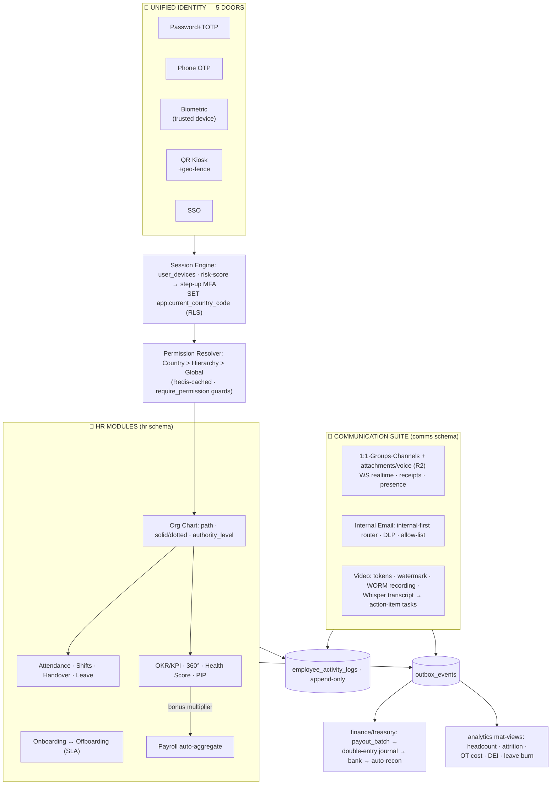

> **Layered circuit (see §2.1):** the `RBAC`/`SES`/router tiers above are thin entry points; the real work happens in domain service folders — `backend/services/{domain}/*` (here `hr`, `comms`, `core`, `audit`) — which own the DB and call models in `backend/models/{domain}/*`. Routers in `backend/routers/` stay flat and P1-compliant.

### 3.2 Payroll auto-disbursement circuit
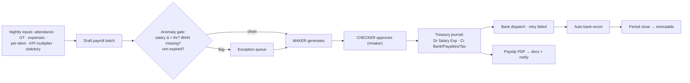

### 3.3 Employee lifecycle
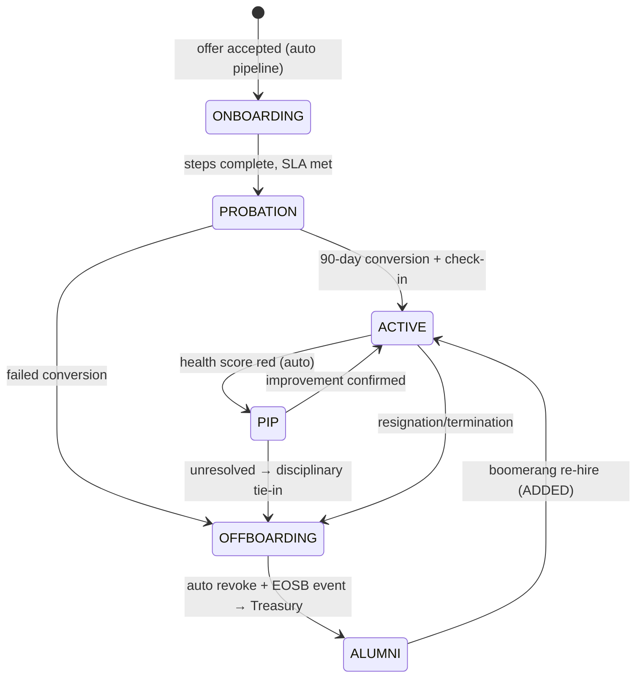

---

## Part 4 — EMS Feature Roadmap (Phases 0–14)

### **Phase 0 — Foundation Audit & Schema Alignment (Week 1)**
*   **Map existing tables to bounded schemas** per your `DATABASE_ECOSYSTEM_HANDLING_PLAN.md`: move all `employee_*`, `offices`, `org_units`, `shift_handover_*` into the `hr` schema; `internal_channels`, `direct_chat_*`, `employee_communication_threads` into `comms`.
*   **Add missing columns/tables** (gaps identified): `employee_bank_accounts` (or unify into `partner_bank_accounts` with `entity_type='employee'`), `okr_objectives`, `kpi_metrics`, `performance_reviews`, `internal_emails`, `email_folders`, `chat_attachments`, `chat_read_receipts`, `employee_activity_logs`.
*   *   **Freeze the permission catalog** into a single source-of-truth constant (`HR_PERMISSION_MAP`) consumed by both backend guards and frontend UI.

---

### **Phase 1 — Unified Login & Identity Solution (Weeks 2–3)** ⭐
A single authentication service (`auth_service.py`) with **5 login doors**, all converging on the same JWT + RLS context.

*   **Door 1 — Email/Password + TOTP MFA:** Standard web login; if `users.totp_enabled`, prompt the 6-digit code from `users.totp_secret`.
*   **Door 2 — Phone + OTP:** Send SMS/WhatsApp OTP; verify against a short-lived token; create/attach session.
*   **Door 3 — Biometric (Mobile App):** Use `employee_biometrics.fingerprint_hash` / `face_encoding`. Device must already be in `user_devices` with `is_trusted=True`; first-time biometric enrollment requires a password+OTP bootstrap.
*   **Door 4 — QR Office Kiosk (Zero-Password Attendance/Login):** Employee scans a `dynamic_qr_sessions.qr_token` at the office kiosk → backend validates token + expiry + geo-fence (`geo_fence_logs.is_within_fence`) → optional secondary biometric match to block "buddy punching" → logs `employee_attendance` *and* issues a kiosk-scoped session.
*   **Door 5 — SSO (Google/Apple/Microsoft):** For corporate staff; map the SSO `sub` claim to `users.email`, auto-provision the `employees` row on first login if HR pre-registered them.

**Session & Device Security (applies to all doors):**
*   Every login writes a `user_devices` row (device fingerprint, IP, OS, `is_trusted`). Unknown device → force MFA or block.
*   **Concurrent-session policy:** configurable per role (e.g., kiosk sessions auto-expire in 8h; mobile sessions 30 days with refresh-token rotation).
*   **On login, set RLS context:** `SET app.current_country_code = '<employee.country_code>'` so every subsequent query is country-isolated automatically.
*   **Risk scoring:** combine `geo_fence` anomaly + new device + odd hour → if risk > threshold, step-up to MFA or lock + notify manager.
*   **(ADDED)** device-fingerprint + face-liveness combo for buddy-punch detection.
*   **(ADDED)** quarterly access-recertification campaign auto-revokes unconfirmed grants.

**Login Flow (mobile example):**
1. App opens → check stored refresh token → silent refresh → if valid, go Home.
2. If expired → show biometric prompt (if enrolled + trusted device) else password/OTP.
3. On success → backend returns JWT + sets RLS + emits `employee_logged_in` event to `employee_activity_logs`.

---

### **Phase 2 — Organizational Hierarchy & Org Chart (Weeks 3–4)** ⭐
*   **`org_units` with Materialized Path:** store `path` (e.g., `/1/12/45/`) + `parent_id` for instant subtree queries ("all employees under Gulf Operations").
*   **Solid-line reporting:** `employees.reporting_manager_id` (self-FK) — the *real* chain used for approvals.
*   **Dotted-line / matrix management:** `employee_relations` with `relation_type='matrix_manager'` for project-based reporting without breaking the solid line.
*   **Authority levels:** `employees.authority_level` + `employee_roles.authority_level` — higher number = higher authority; drives approval thresholds (e.g., expense > 500 OMR needs `authority_level ≥ 3`).
*   **Leverage existing services:** `get_org_chart`, `get_user_chain`, `get_all_subordinates`, `can_manage`, `reassign_manager`, `backfill_authority_levels` — expose them via a visual, draggable **Org Chart UI** (admin can drag an employee to a new manager; system recomputes `authority_level` + `path` in one transaction).
*   **Hierarchy invariants (DB triggers):** prevent circular reporting (manager cannot be their own descendant); prevent an employee reporting to a lower authority level unless explicitly flagged as matrix.

---

### **Phase 3 — Permission & RBAC System (Weeks 4–5)** ⭐
*   **Three-layer permission model:**
    1.  **Global role** (`employee_roles.permissions` JSON) — base capabilities (e.g., `hr.leave.approve`).
    2.  **Country role** (`country_staff_assignments.role_in_country`: `country_head`, `country_manager`, `country_finance`, `country_moderator`) — overrides/scope within a country.
    3.  **Hierarchy-derived** — managers inherit approval rights over their subtree via `can_manage()`.
*   **Effective-permission resolver:** `_effective_staff_permissions(user)` merges the three layers with precedence *Country > Hierarchy > Global*, cached in Redis (invalidate on role/hierarchy change).
*   **Granular permission strings** grouped into catalogs: `hr.*`, `finance.*`, `comms.*`, `country.*`, `admin.*` — each mapped in `ADMIN_PERMISSION_MAP` / `STAFF_PERMISSION_GROUPS`.
*   **Permission Matrix UI:** a grid (rows = roles, columns = permission groups) with checkboxes; admin edits propagate via a Maker-Checker draft for sensitive permissions (`finance.ledger.approve`, `users.delete`).
*   **Backend enforcement:** every protected endpoint uses `require_permission("hr.payroll.release")` dependency that calls the resolver + checks RLS country.
*   **Sub-admins cannot grant what they don't hold** (enforced in assignment endpoint).
*   **Self-service access requests** route up the `can_manage()` chain for approval.

---

### **Phase 4 — Country-Wise Employee Management (Week 5)** ⭐
*   **RLS on every `hr`/`comms` table** keyed on `country_code` (already registered in `COUNTRY_AWARE_TABLES`).
*   **Country Staff Assignment console:** assign a `user` to a country with `role_in_country`; an employee can hold *multiple* country assignments (regional roles) — UI shows a country switcher that re-sets the RLS context.
*   **Localization per country:** salary currency (`employees.currency`), leave policy (`employee_leave_ledgers` allocations differ by country), holiday calendar (`country_holiday_calendars`), labor-law rules (notice period, EOSB formula) pulled from `country_configs`.
*   **Cross-country visibility:** only `global`/`admin` roles see the consolidated view; everyone else sees strictly their assigned countries.

---

### **Phase 5 — Admin & Sub-Admin Role Assignment (Week 6)** ⭐
*   **Role tiers:** `admin` (full) → `sub_admin` (scoped) → `country_head` → `country_manager` → `moderator` → `support` → `employee`.
*   **Delegation model:** a `sub_admin` is created by an `admin` and given a *subset* of permissions + a *subset* of countries + a *subset* of modules (e.g., "HR-only sub-admin for Oman"). A sub-admin **cannot grant a permission they don't hold** (enforced in the assignment endpoint).
*   **Maker-Checker for sensitive assignments:** assigning `finance.*` or `admin` rights creates a `pending_*` record requiring a second admin's approval.
*   **Audit every assignment:** write to `finance_audit_logs`/`admin_activity_logs` with `old_value_json`/`new_value_json` + `assigned_by`.
*   **Self-service role request:** employees can *request* elevated access; routed up the hierarchy via `can_manage()` chain for approval.

---

### **Phase 6 — Employee Lifecycle: Onboarding → Offboarding (Weeks 6–7)**
*   **Onboarding pipeline** (`onboarding_pipelines`/`onboarding_steps`): auto-create `users` + `employees`, assign `org_unit`, manager, role, country; trigger document collection (`employee_documents`), biometric enrollment, equipment assignment (`employee_assets`), ID card issuance (`physical_id_cards`), and welcome email — each step tracked with SLA.
*   **Probation tracking:** auto-alert manager at 30/60/90 days; conversion requires a performance check-in.
*   **Offboarding** (`offboarding_cases`): revoke sessions, disable `user_devices`, reclaim `employee_assets`, run exit survey, transfer ownership of their open tasks (`shift_handover_tasks`), archive chat/email per retention policy, mark `employment_status='terminated'` + `termination_date`.
*   **(ADDED)** During offboarding, final EOSB settlement is published as an event → Treasury posts the journal (no manual hand-off).

---

### **Phase 7 — Time, Attendance, Leave & Shifts (Weeks 7–8)**
*   **Attendance:** `employee_attendance` via QR-kiosk + biometric + geo-fence; flag `is_anomaly` when Haversine distance > 50m or device untrusted; manager dashboard of anomalies.
*   **Shifts:** `employee_shift_rosters` with auto-scheduling rules; **shift handover** (`shift_handover_sessions` + `shift_handover_tasks`) ensures continuity — outgoing staff must acknowledge pending tasks before clock-out.
*   **Leave:** `employee_leave_requests` routed to `reporting_manager_id`; balances enforced against `employee_leave_ledgers` (allocated/used/carried_forward); country-specific leave types.
*   **Work logs:** `employee_work_logs` with hours + geo + approval workflow → feeds utilization analytics.

---

### **Phase 8 — Internal Communication Suite (Weeks 8–10)** ⭐
Build on `direct_chat_rooms`, `direct_chat_messages`, `group_chat_rooms`/`group_chat_members`, `internal_channels`, `internal_messages`, `employee_communication_threads`.

*   **1:1 Chat:** auto-create/return a `direct_chat_room` for any two employees; messages stored with `sender_id`, `body`, `attachment_ids`, `reply_to_id`.
*   **Group Chat:** create room, add `group_chat_members`; roles (admin/member); @mentions resolve to `user_id`.
*   **Channels (Slack-style):** `internal_channels` per department/country/project (e.g., `#oman-sales`, `#finance-announcements`); public vs private; topic + pinned messages.
*   **Rich Attachments (the gap to fill):** add `chat_attachments` linking to `media_assets` — support **image, video, voice note, document**. Voice notes: record in-app → upload compressed `.ogg`/`.m4a` → store duration + waveform JSON for inline playback.
*   **Real-time delivery:** use your existing `WebSocketManager` (`broadcast_to_room`, `send_employee_update`) for new messages, typing indicators, read receipts (`chat_read_receipts`), and online presence.
*   **Message features:** reply threading, edit/delete (with audit), emoji reactions, search (full-text on `body`), forward, and **message retention** per channel policy.
*   **Privacy & compliance:** all internal chat is country-scoped; admins can place a *legal-hold* on a room (freezes deletion) for investigations; every message write logs to `communication_audit_trails`.
*   **Programming note:** auto-translate chat/channel messages AR↔EN.
*   **Programming note:** announcements with mandatory read-confirmation tracking.

---

### **Phase 9 — Internal Email System (Weeks 10–12)** ⭐
A full in-org mailbox so employees rarely leave the platform.

*   **Per-employee inbox:** `internal_emails` (sender, recipients[], cc[], subject, body_html, attachments[], folder, labels, thread_id, read_at) + `email_folders` (Inbox, Sent, Drafts, Trash, custom).
*   **Smart addressing router:** when composing, the recipient picker searches the **employee directory first**; if the address matches an internal `users.email`, the message is delivered *in-database* (instant, free, audited). Only truly external addresses are handed to `transactional_email_service` / SMTP relay.
*   **Threading:** `thread_id` + `in_reply_to` to build conversation views; auto-collapse long threads.
*   **Attachments:** reuse `media_assets` + `chat_attachments` pattern; enforce per-org size limits + virus scan hook.
*   **External relay controls:** country/role-based allow-lists for external domains; sensitive-content DLP scan (PII/keywords) before external send; mandatory BCC to compliance for certain roles.
*   **Notifications:** new internal mail → in-app badge + optional push + (configurable) external forwarding digest.
*   **Search & labels:** full-text search across subject+body; user labels/filters/rules ("auto-label invoices from finance@").
*   **Gap-fill missing endpoints:** add `POST /email/bulk`, `POST /email/from-alias`.

---

### **Phase 10 — Employee-to-Employee Logs & Activity Ledger (Week 12)** ⭐
A single append-only **collaboration/activity ledger** (`employee_activity_logs`) answering "who did what, with whom, when."

*   **Logged events:** logins, attendance scans, handovers, mentions in chat/email, document shares, file attachments, approvals given/received, profile edits, hierarchy moves, performance reviews submitted.
*   **Actor + Target + Context:** each row stores `actor_employee_id`, `target_employee_id` (the "with whom"), `action`, `entity_type`, `entity_id`, `country_code`, `metadata_json`, `ip`, `device`.
*   **Use cases:** manager "collaboration heatmap," audit/discovery (`ediscovery`), onboarding buddy tracking, and dispute resolution.
*   **Privacy:** employees see *their own* log; managers see their subtree's; HR/legal see all (gated by permission + logged access).

---

### **Phase 11 — Performance Management & HR Analytics (Weeks 13–15)** ⭐ *(Requested: "who is working good or not")*
*   **OKR/KPI framework:** `okr_objectives`/`okr_objectives` (company → department → individual, cascaded via hierarchy) + `kpi_metrics` (quantitative: sales, tickets resolved, on-time deliveries; pulled automatically from operational tables where possible).
*   **Review cycles:** `performance_reviews` with **360° inputs** — self, manager (`reporting_manager_id`), peers (from `employee_relations`/matrix), and subordinates; weighted into `employees.performance_score`.
*   **Continuous check-ins:** lightweight monthly 1:1 logs between manager and report (stored, searchable); replaces the "annual surprise review."
*   **Auto-derived signals:** combine `attendance` punctuality, `work_logs` hours, KPI attainment, leave abuse patterns, and `is_anomaly` flags into a **Performance Health Score** with red/amber/green — surfaced on the manager dashboard.
*   **Calibration & ranking:** department calibration sessions to normalize scores; flag top/bottom percentiles.
*   **PIP & recognition:** low scores auto-trigger a Performance Improvement Plan workflow (ties to `disciplinary_cases` if unresolved); high scores feed bonus multipliers + `alumni_network`/recognition badges.
*   **HR Analytics dashboards:** headcount by country/department, attrition risk model, gender/pay equity (`DEI` tab), hiring velocity, leave burn rate, overtime cost — all from **materialized views** for speed.
*   **(ADDED)** boomerang re-hire returns an offboarded employee to ACTIVE (alumni → active).

---

### **Phase 12 — Payroll & Auto Salary Disbursement (Weeks 15–17)** ⭐ *(Requested: "auto salaries")*
Wire the existing `generate_payroll_batch` / `calculate_monthly_payroll` into the Finance/Treasury engine.

*   **Payroll inputs auto-aggregated:** base `salary` + attendance (deduct unpaid absences) + overtime (`work_logs`) + approved `employee_expenses` + travel `per_diem_json` + leave encashment + **performance bonus multiplier** (from Phase 11) + statutory deductions (tax, social, EOSB accrual).
*   **Country-specific rules:** tax brackets, EOSB formula, allowances pulled from `country_configs` / `country_payout_rules`.
*   **Payslip generation:** per-employee PDF payslip with breakdown; stored in `employee_documents` (type=`payslip`) — visible only to that employee + payroll admin.
*   **Auto-disbursement pipeline:**
    1.  Payroll batch → creates one `payout_batch` grouping all employees, with line items per employee → their `employee_bank_account` (IBAN/SWIFT).
    2.  **Maker-Checker:** payroll manager *generates*, finance controller *approves* (no self-approval).
    3.  On approval → Treasury engine posts the **double-entry journal** (Salary Expense Dr / Bank & Payables Cr / Tax Payable Cr) → triggers the bank transfer (API or generated bank file).
    4.  Reconcile via the bank-reconciliation engine; flag failed transfers for retry.
*   **Immutability & audit:** once a period is paid + `fiscal_periods` closed, no edits allowed; corrections go through next-period adjustments.
*   **Employee notification:** payslip ready → in-app + email; disbursement done → SMS/email confirmation.
*   **(ADDED)** bank-detail change = verification freeze + penny-test before next payroll.

---

### **Phase 13 — Employee Self-Service Portal (ESS) (Week 17)**
*   Mobile + web portal where employees manage their *own*: profile, documents upload, leave requests, expense claims, payslips, tax forms, bank details (with change-verification freeze), shift swap requests, org-chart view of their team, performance goals, and training (`lms`).
*   Reduces HR ticket volume dramatically; every self-service action still writes to the activity ledger.

---

### **Phase 14 — Compliance, COI & Governance (Week 18)**
*   **Conflict-of-Interest engine** (`coi_reports` + `employee_relations`): auto-detect reporting lines between relatives (`employee_dependents`/`employee_relations`) or shared external interests; flag for review.
*   **Document expiry alerts:** `employee_documents`/`employee_certifications` nearing `expiry_date` → auto-notify employee + manager + block certain actions until renewed.
*   **Disciplinary workflow** (`disciplinary_cases`) with evidence attachments and hierarchy-aware approvals.
*   **Data residency & PDPL/GDPR:** PII columns encrypted at rest; right-to-access/export; retention jobs purge chat/email per policy (with legal-hold override).

---

## Part 5 — Step-by-Step Construction & Timeline

### 5.1 Step-by-Step Construction

> These construction steps are **numbered 1:1 with the EMS Phases in Part 4** (same phase numbers 0–14). The communication suite is split into Step 8 (chat) and Step 9 (email); the automation tower is delivered in the final Step 14 and detailed in Part 6.

**Phase 0 — Schema alignment & gaps.** Alembic migration (downgrade + contract tests) for gap tables: `employee_bank_accounts`, `okr_objectives`, `kpi_metrics`, `performance_reviews`, `internal_emails`, `email_folders`, `chat_attachments`, `chat_read_receipts`, `employee_activity_logs`; move `employee_*`/`org_units`/`offices`→`hr`, channels/chats→`comms`; freeze `HR_PERMISSION_MAP`; verify RLS registry. *Done when:* drift gate green + orphan-table warning zero.

**Phase 1 — Identity.** `backend/services/core/auth_service.py` 5 doors + device trust + risk scoring + RLS-on-login + kiosk attendance session. *Done when:* same person logs in via biometric (mobile) and QR-kiosk with correct country scope; unknown-device MFA test passes.

**Phase 2 — Org engine.** Materialized path + matrix relations + anti-cycle triggers + authority backfill; draggable Org Chart UI (single-transaction reassign). *Done when:* drag-reassign recomputes path/authority and approvals follow new chain.

**Phase 3 — RBAC.** Resolver + Redis cache + `require_permission` everywhere + Matrix UI + Maker-Checker sensitive grants + self-service requests + **(ADDED)** recertification campaign. *Done when:* sub-admin cannot grant beyond own set (test).

**Phase 4 — Country console.** Assignments, multi-country switcher, localization (currency/leave/holidays/EOSB from `country_configs`). *Done when:* cross-country read returns nothing without global role.

**Phase 5 — Admin & Sub-Admin delegation.** Role tiers (`admin` → `sub_admin` → `country_head` → `country_manager` → `moderator` → `support` → `employee`); delegation = a `sub_admin` created by an `admin` with a *subset* of permissions + countries + modules (e.g., "HR-only sub-admin for Oman"); Maker-Checker for sensitive assignments (`finance.*`/`admin` → `pending_*` record needing a second admin); audit every assignment to `finance_audit_logs`/`admin_activity_logs` (`old_value_json`/`new_value_json` + `assigned_by`); self-service role requests routed up `can_manage()`. *Done when:* sub-admin created with scoped permissions/countries/modules; cannot grant a permission, country, or module it doesn't hold (test).

**Phase 6 — Lifecycle.** Onboarding SLA pipeline, probation alerts, offboarding auto-revoke + task transfer + EOSB event. *Done when:* offboarding completes with zero live sessions/devices.

**Phase 7 — Time & shifts.** Anomaly detection, auto-rostering, handover gate, leave auto-approve/route + escalation SLA. *Done when:* unactioned leave auto-escalates per config.

**Phase 8 — Communication completion (chat).** Attachments + voice waveform, receipts/presence/typing WS, threading/reactions/FTS, retention + legal-hold; WORM recordings + realtime transcript + action-item tasks. *Done when:* 1:1 voice-note + image chat realtime E2E passes.

**Phase 9 — Internal email.** Internal email client + smart router + DLP + allow-list + BCC; add `POST /email/bulk`, `/email/from-alias`. *Done when:* external DLP block test passes.

**Phase 10 — Activity ledger & eDiscovery.** Append-only writer hooks across all modules; privacy-gated viewers; export. *Done when:* every Phase-1..9 action appears in ledger.

**Phase 11 — Performance.** OKR cascade, auto KPI pulls (read-only from commerce/logistics/support), 360 cycles, health score, calibration, PIP, bonus multiplier feed. *Done when:* health board matches computed signals in test fixtures.

**Phase 12 — Payroll.** Auto-aggregate → Maker-Checker → Treasury journal → bank → recon → payslips → notify; penny-test bank-change freeze. *Done when:* simulated month disburses with balanced journal + 0 recon variance.

**Phase 13 — ESS portal + mobile parity.** Self-service profile/docs/leave/expense/payslip/shift-swap/goals/LMS; kiosk mode; biometric login. *Done when:* web/mobile feature parity checklist green.

**Phase 14 — Compliance, COI & Automation close-out.** COI flags, expiry blocks, GDPR/PDPL export, retention purges with holds; **automation tower wiring** — `automation_runs` + per-job toggles + thresholds UI, HR chatbot + voice assistant (confirm-gated), analytics mat-views + attrition-risk alerts (full automation catalog in Part 6); E2E Playwright full acceptance; k6 load; update `CODEBASE_STATUS_MATRIX_DETAILED.md`. *Done when:* all acceptance criteria green; every automation shows run health (paused = explicit badge).

### 5.2 Suggested Timeline (18 weeks, 1 senior backend + 1 frontend + 0.5 DevOps)

| Weeks | Phases | Key Deliverable |
|---|---|---|
| 1 | 0 | Schema aligned, gaps added, permission catalog frozen |
| 2–3 | 1 | Unified login (5 doors) + device/MFA/RLS |
| 3–5 | 2, 3 | Draggable org chart + RBAC matrix |
| 5–6 | 4, 5 | Country scoping + sub-admin delegation |
| 6–8 | 6, 7 | Lifecycle + attendance/shifts/handover |
| 8–12 | 8, 9 | Full chat (attachments/voice) + internal email |
| 12–13 | 10 | Activity/collaboration ledger |
| 13–15 | 11 | Performance/OKR/360 + HR analytics |
| 15–17 | 12, 13 | Auto payroll disbursement + ESS portal |
| 17–18 | 14 | COI, compliance, hardening, E2E tests |

> **AI Directive:** build in Phase order on the existing skeleton; any cross-domain write bypassing outbox, any balance-style mutable HR money field, any attachment byte in DB, or any silent fallback violates this spec — STOP and ask.

---

## Part 6 — The Automation System

The EMS is "self-driving" via a set of staged automations. Every auto-action is logged as `actor=system:<job>` in `employee_activity_logs`/audit; thresholds live in `configuration` tables; runs are tracked in `automation_runs`; failures route to an explicit Exception Queue (Rule #16). Any approval (leave/expense/access/payroll) unactioned beyond a config-defined SLA auto-escalates to the next `authority_level`. *(Automation IDs 1–14 below are independent of the EMS Phase 0–14 numbering; each automation is delivered inside the phase that owns its domain.)*

| # | Automation | Trigger | Staging/Inputs | Auto action | Exception path |
|---|---|---|---|---|---|
| 1 | **Auto-onboarding** | offer accepted | pipeline steps w/ SLA | user+employee, org, role, country, docs request, biometric invite, assets, ID card, welcome mail, default channels | SLA breach → escalate to HR head |
| 2 | **Auto-attendance & anomaly** | kiosk/biometric/geo scan | haversine, device trust, scan pattern | check-in/out, late/OT compute | anomaly queue (buddy-punch, >50m, untrusted) → manager |
| 3 | **Auto-rostering & handover** | weekly cron + leave/skills | shift rules, certifications | publish rosters; block clock-out till handover acknowledged | coverage conflicts → scheduler UI |
| 4 | **Auto-leave processing** | request | ledger balance + country calendar + conflicts | auto-approve if ≤ threshold & no conflict; else route up; year-end carry-forward | abuse-pattern alerts → manager |
| 5 | **Auto-payroll & disbursement** | monthly cron | attendance/OT/expenses/KPI/deductions | draft batch → Maker-Checker → journal → bank → recon → payslips | salary-Δ > threshold / missing IBAN → hold queue |
| 6 | **Auto-performance signals** | nightly + cycle crons | operational KPIs (sales, tickets, on-time) via read-only | health score R/A/G; open 360 cycles; PIP trigger; bonus multiplier → payroll | calibration session UI |
| 7 | **Auto document/cert expiry** | daily scan | expiry_date | notify 30/14/7d; block dependent actions (e.g., shift w/o cert) | renewal escalation |
| 8 | **Auto-COI detection** | hierarchy/relations change | dependents + relations + interests graph | flag conflicting lines for review | compliance case |
| 9 | **Auto comms compliance** | message/email write | DLP rules, allow-lists, virus-scan | internal-first routing; block/quarantine external violations; auto legal-hold on case open; retention purge | DLP quarantine review |
| 10 | **Auto meeting intelligence** | recording end | Whisper transcript + translation | action items → staged tasks → confirm → assigned with due dates; RAG-index transcript | low-confidence items → review list |
| 11 | **HR chatbot + voice assistant** | NL/voice (Whisper) | handbook/policy RAG (pgvector) | answers + draft requests (leave, expense, 1:1) via confirm cards | explicit "cannot verify" mode |
| 12 | **Auto-offboarding & settlement** | termination event | asset/task/comms inventories | revoke all, transfer tasks, archive per policy, EOSB event → Treasury | unrecovered assets → case |
| 13 | **Auto access governance** | request + quarterly cron | permission catalog | route requests up chain; recertification campaign auto-revokes | manager review queue |
| 14 | **Auto HR analytics & attrition risk** | nightly | mat-views | R/A/G dashboards; attrition-risk alerts to managers | — |

---

## Part 7 — UI/UX Layout

### 7.1 Employee Workspace (default landing)
```
┌─────────────────────────────────────────────────────────────────────────┐
│ TOPBAR: [🔍 people/search] [🎙 voice] [🤖 HR bot] [country: OM ▼] [🔔2] │
├──────────────┬──────────────────────────────────────────────────────────┤
│ SIDEBAR      │ MY DAY: shift card · handover tasks (ack gate) ·         │
│ My Workspace │ approvals due · announcements (read-confirm)             │
│ Org Chart    │ KPI STRIP: attendance · health R/A/G · leave balance ·   │
│ Directory    │ pending expenses                                         │
│ Attendance   │ ──────────────────────────────────────────────────────── │
│ Shifts/Leave │ QUICK ACTIONS: leave · expense · book room · start 1:1 · │
│ Payroll      │ payslip · shift-swap                                     │
│ Performance  │ ──────────────────────────────────────────────────────── │
│ Comms Hub    │ TEAM PULSE: calendar · birthdays · recognition badges    │
│ Compliance   │ CHAT DRAWER (right): DMs · channels · voice waveforms ·  │
│ Analytics    │ presence dots                                            │
│ Automation   │                                                          │
└──────────────┴──────────────────────────────────────────────────────────┘
```

### 7.2 Admin HR Command Center (route-driven tabs, lazy-loaded)
`directory · org-chart (draggable canvas, solid/dotted lines, authority badges) · attendance (anomaly queue split-screen: scan map+device vs policy) · shifts-handover · leave (auto-approve log + escalations) · payroll control room (batch pipeline chips, maker≠checker locks, exception holds) · performance (health board, calibration, PIP) · onboarding/offboarding pipelines (SLA timers) · documents-compliance (expiry radar 30/14/7) · coi-disciplinary · comms-hub (channels admin, eDiscovery portal, audit viewer, legal-hold controls) · analytics-DEI · permission-matrix (role×group grid, sensitive = Maker-Checker draft) · country-assignments · automation-tower (per-job toggle/cron/last-run/exception counters/DLQ)`.

### 7.3 Key screens
- **Chat:** 3-pane (rooms/channels | thread | details/members); voice-note inline waveform player; attachment lightbox; pinned + search; retention badge per channel.
- **Email client:** folders left, list, reading pane; compose with **directory-first autocomplete** + internal/external chip; DLP warning banner before external send; labels/rules builder.
- **Video:** calendar scheduler; join via token; live transcript panel; action-items side panel with "assign" confirm; watermark/boardroom toggles; recording → WORM badge.
- **Org Chart:** drag-to-reassign with impact preview (subtree count, authority recompute) + single-transaction commit; matrix lines dashed.
- **Payroll Control Room:** batch list `draft→approved→dispatched→settled`; per-employee drilldown (inputs provenance: attendance/OT/KPI); approve disabled for maker.
- **UX principles:** skeleton loaders; explicit empty/error states; tabular numerals; ARIA + keyboard; density toggle; country switcher re-sets RLS; mobile = biometric login, kiosk, scan payslip, approvals push, camera expense/voice notes.

---

## Part 8 — Communication Suite: Current Implementation Status

> This part is a **status audit** of what already exists in the codebase (`core.py`, `communication.py`, `employee_models.py`, the relevant services/controllers/routers). It is complementary to the EMS roadmap (Part 4) and architecture (Parts 1–3): the roadmap *completes and governs* these tables/services.

### 8.1 Database Schema & Implementation Status

#### 8.1.1 Chat Models (`backend/models/comms/core.py`) - ✅ IMPLEMENTED
| Model | Status | Description | Location |
|-------|--------|-------------|----------|
| EntityChatThread | ✅ | Generic chat threads for entities | backend/models/comms/core.py:374 |
| EntityChatMessage | ✅ | Messages in entity threads | backend/models/comms/core.py:392 |
| DirectChatRoom | ✅ | One-on-one chat rooms | backend/models/comms/core.py:487 |
| DirectChatMessage | ✅ | Messages in direct chats | backend/models/comms/core.py:505 |
| GroupChatRoom | ✅ | Group chat rooms | backend/models/comms/core.py:526 |
| GroupChatMember | ✅ | Members in group chats | backend/models/comms/core.py:544 |
| GroupChatMessage | ✅ | Messages in group chats | backend/models/comms/core.py:564 |

#### 8.1.2 Video Models (`backend/models/comms/core.py`) - ✅ IMPLEMENTED
| Model | Status | Description | Location |
|-------|--------|-------------|----------|
| VideoRoom | ✅ | Video conference rooms | backend/models/comms/core.py:415 |
| VideoRoomParticipant | ✅ | Participants in rooms | backend/models/comms/core.py:443 |
| VideoRoomRecording | ✅ | Meeting recordings | backend/models/comms/core.py:464 |

#### 8.1.3 Email & Notification Models (`backend/models/comms/communication.py`) - ✅ IMPLEMENTED
| Model | Status | Description | Location |
|-------|--------|-------------|----------|
| Notification | ✅ | System notifications | backend/models/comms/communication.py:12 |
| TicketMessage | ✅ | Support ticket messages | backend/models/comms/communication.py:39 |
| ProxyChannel | ✅ | Masked communication channels | communication.py:78-91 |
| ProxySession | ✅ | Proxy communication sessions | communication.py:94-106 |
| ProxyMessage | ✅ | Messages through proxy | communication.py:109-122 |
| ProxyCallLog | ✅ | Call logs through proxy | communication.py:125-139 |

#### 8.1.4 Employee Communication Models (`backend/models/comms/communication.py`) - ✅ IMPLEMENTED
| Model | Status | Description | Location |
|-------|--------|-------------|----------|
| EmployeeCommunicationThread | ✅ | Employee communication threads | backend/models/comms/communication.py:207 |
| ExternalContactMasking | ✅ | Masked external contacts | backend/models/comms/communication.py:226 |
| CommunicationAuditTrail | ✅ | Audit trail for communications | backend/models/comms/communication.py:246 |
| InternalChannel | ✅ | Internal team channels | backend/models/comms/communication.py:268 |
| InternalChannelMember | ✅ | Channel members | backend/models/comms/communication.py:298 |
| InternalMessage | ✅ | Messages in internal channels | backend/models/comms/communication.py:318 |

#### 8.1.5 Employee Models (employee_models.py) - ✅ IMPLEMENTED
| Model | Status | Description |
|-------|--------|-------------|
| Employee | ✅ | Core employee profile |
| EmployeeAttendance | ✅ | Attendance tracking |
| EmployeeWorkLog | ✅ | Work hours logging |
| EmployeeLeaveRequest | ✅ | Leave management |
| EmployeeShiftRoster | ✅ | Shift scheduling |
| Office | ✅ | Office locations |
| PhysicalIDCard | ✅ | ID card management |
| EmployeeAsset | ✅ | Asset tracking |
| EmployeeDocument | ✅ | Document management |
| EmployeeCertification | ✅ | Certification tracking |
| COIReport | ✅ | Conflict of interest |
| TravelRequest | ✅ | Travel approvals |
| DisciplinaryCase | ✅ | Disciplinary tracking |
| OffboardingCase | ✅ | Offboarding workflow |

### 8.2 Backend Services — Implementation Status

#### 8.2.1 Chat System Service - ✅ IMPLEMENTED
**File:** `backend/services/comms/chat_system.py` (408 lines)
| Method | Description | Status |
|--------|-------------|--------|
| create_entity_chat() | Create chat for entity | ✅ |
| create_direct_chat() | Create 1-on-1 chat | ✅ |
| create_group_chat() | Create group chat | ✅ |
| send_message() | Send message to chat | ✅ |
| get_chat_history() | Retrieve message history | ✅ |
| mark_read() | Mark messages as read | ✅ |
| create_thread() | Create entity thread | ✅ |
| get_thread_messages() | Get thread messages | ✅ |
| list_threads() | List all threads | ✅ |

#### 8.2.2 Video Conferencing Service - ✅ IMPLEMENTED
**File:** `backend/services/comms/video_conferencing.py`
| Method | Description | Status |
|--------|-------------|--------|
| create_room() | Create video room | ✅ |
| list_rooms() | List all rooms | ✅ |
| generate_token() | Generate meeting token | ✅ |
| generate_watermark() | Add watermarks to frames | ✅ |
| _transcribe_audio() | Transcribe meeting audio | ✅ |
| _translate_text() | Translate transcripts | ✅ |
| add_transcript_segment() | Add transcript segment | ✅ |
| extract_action_items() | Extract action items | ✅ |
| get_transcript() | Gete meeting transcript | ✅ |
| start_recording() | Start recording | ✅ |
| end_room() | End meeting | ✅ |
| get_room_details() | Get room details | ✅ |

#### 8.2.3 Email Gateway Service - ✅ IMPLEMENTED
**File:** `backend/services/comms/email_gateway.py`
| Method | Description | Status |
|--------|-------------|--------|
| send_internal_email() | Send to internal users | ✅ |
| send_external_email() | Send to external parties | ✅ |
| send_from_alias() | Send from role-based alias | ✅ |
| get_email_templates() | Get available templates | ✅ |
| send_bulk_email() | Send bulk emails | ✅ |
| get_suppression_list() | Get suppressed emails | ✅ |
| track_open() | Track email opens | ✅ |
| DLPScanner.scan_content() | Scan for PII | ✅ |
| RoleBasedAliasManager.get_alias_for_role() | Get role alias | ✅ |
| get_email_history() | Get email history | ✅ NEW |

#### 8.2.4 Internal Communication Service - ✅ NEW
**File:** `backend/services/comms/internal_communication.py`
| Method | Description | Status |
|--------|-------------|--------|
| create_channel() | Create internal channel | ✅ |
| get_channel() | Get channel details | ✅ |
| list_channels() | List all channels | ✅ |
| add_member() | Add member to channel | ✅ |
| remove_member() | Remove member from channel | ✅ |
| send_message() | Send internal message | ✅ |
| get_messages() | Get channel messages | ✅ |

#### 8.2.5 External Contact Service - ✅ NEW
**File:** `backend/services/comms/external_contact.py`
| Method | Description | Status |
|--------|-------------|--------|
| create_mask() | Create contact mask | ✅ |
| get_mask() | Get mask details | ✅ |
| create_proxy_channel() | Create proxy channel | ✅ |
| send_message() | Send through proxy | ✅ |
| log_call() | Log proxy calls | ✅ |

#### 8.2.6 Communication Audit Service - ✅ NEW
**File:** `backend/services/comms/communication_audit.py`
| Method | Description | Status |
|--------|-------------|--------|
| log_event() | Log audit event | ✅ |
| get_audit_trail() | Get audit trail | ✅ |
| export_for_ediscovery() | Export for legal discovery | ✅ |

#### 8.2.7 eDiscovery Service - ✅ IMPLEMENTED
**File:** `backend/services/audit/ediscovery.py`
**Purpose:** Legal discovery and compliance for employee communications.

#### 8.2.8 Proxy Communication Service - ✅ IMPLEMENTED
**File:** `backend/services/comms/proxy_communication.py`
**Purpose:** Masked communication between employees and external parties.

### 8.3 API Endpoints — Implementation Status

#### 8.3.1 Chat Controller - ✅ IMPLEMENTED
**File:** `backend/controllers/comms/comm_controller.py` (routed via `backend/routers/comms_chat.py`)
| Method | Path | Description |
|--------|------|-------------|
| POST | /direct | Create direct chat |
| POST | /group | Create group chat |
| POST | /message | Send message |
| GET | /history/{chat_id} | Get chat history |
| GET | /threads | List threads |
| POST | /threads | Create thread |
| GET | /threads/{thread_id}/messages | Get thread messages |
| POST | /threads/{thread_id}/messages | Send thread message |
| POST | /read | Mark as read |

#### 8.3.2 Video Controller - ✅ IMPLEMENTED
**File:** `backend/controllers/core/admin_video_controller.py` (routed via `backend/routers/comms_video.py`)
| Method | Path | Description |
|--------|------|-------------|
| POST | /rooms | Create video room |
| GET | /rooms | List rooms |
| POST | /rooms/{room_id}/tokens | Generate token |
| POST | /rooms/{room_id}/recording | Start recording |
| POST | /rooms/{room_id}/end | End meeting |
| GET | /rooms/{room_id} | Get room details |

#### 8.3.3 Email Controller - ✅ IMPLEMENTED
**File:** `backend/controllers/core/email_controller.py` (routed via `backend/routers/email.py`)
| Method | Path | Description |
|--------|------|-------------|
| POST | /internal | Send internal email |
| POST | /external | Send external email |
| GET | /templates | Get templates |
| POST | /track-open | Track opens |
| GET | /history/{user_id} | ✅ NEW - Email history |

**Missing Endpoints:**
| Method | Path | Description |
|--------|------|-------------|
| POST | /bulk | Send bulk emails | ❌ |
| POST | /from-alias | Send from alias | ❌ |

#### 8.3.4 Internal Channels Controller - ✅ NEW
**File:** `backend/routers/internal_channels.py` (thin router) · controller: `backend/controllers/core/internal_channels_controller.py`
| Method | Path | Description |
|--------|------|-------------|
| POST | /api/v1/internal/channels | Create channel |
| GET | /api/v1/internal/channels | List channels |
| GET | /api/v1/internal/channels/{channel_id} | Get channel |
| POST | /api/v1/internal/channels/{channel_id}/members | Add member |
| DELETE | /api/v1/internal/channels/{channel_id}/members/{user_id} | Remove member |
| POST | /api/v1/internal/channels/{channel_id}/messages | Send message |
| GET | /api/v1/internal/channels/{channel_id}/messages | Get messages |

#### 8.3.5 Audit Trail Controller - ✅ NEW
**File:** `backend/routers/audit.py` (thin router) · controllers: `backend/controllers/comms/communication_audit_controller.py`, `backend/controllers/admin/audit_controller.py`
| Method | Path | Description |
|--------|------|-------------|
| GET | /api/v1/audit | Get audit trail |
| GET | /api/v1/audit/export | Export for eDiscovery |

### 8.4 Feature Matrix — Detailed Status

#### 8.4.1 Video Conferencing Features
| Feature | Implementation | Notes |
|---------|----------------|-------|
| Create Meeting | ✅ | create_room() exists |
| Participant Management | ✅ | VideoRoomParticipant |
| Recording | ✅ | VideoRoomRecording, start_recording() |
| Transcription | ⚠️ Partial | _transcribe_audio() exists, needs real-time |
| Action Items | ✅ | extract_action_items() |
| Watermarked Frames | ✅ | generate_watermark() |
| Token Generation | ✅ | generate_token() |
| Boardroom Mode | ✅ | is_boardroom flag |
| Country Linking | ✅ | country_code field |

#### 8.4.2 Chat Features
| Feature | Implementation | Notes |
|---------|----------------|-------|
| Direct Messaging | ✅ | DirectChatRoom |
| Group Chats | ✅ | GroupChatRoom/Member |
| Entity Threads | ✅ | EntityChatThread |
| Message History | ✅ | Pagination supported |
| Read Receipts | ✅ | read_at field |
| Encryption | ⚠️ Partial | is_encrypted flag exists |
| Country Context | ✅ | country_code field |
| Masked Communication | ⚠️ Partial | is_masked field |
| Employee Threads | ✅ | EmployeeCommunicationThread |
| Internal Channels | ✅ | InternalChannel, InternalMessage |

#### 8.4.3 Email Features
| Feature | Implementation | Notes |
|---------|----------------|-------|
| Internal Email | ✅ | send_internal_email() |
| External Email | ✅ | send_external_email() |
| Role-based Aliases | ✅ | RoleBasedAliasManager |
| DLP Scanning | ✅ | DLPScanner class |
| Bulk Email | ✅ | send_bulk_email() |
| Email Tracking | ✅ | track_open() |
| Templates | ✅ | get_email_templates() |
| Email History | ✅ | get_email_history() |

#### 8.4.4 Employee Communication Features
| Feature | Implementation | Notes |
|---------|----------------|-------|
| Shift Handover | ✅ | ShiftHandoverSession model |
| Office Communication | ⚠️ Partial | Office model exists |
| Country Communication | ⚠️ Partial | CountryCommunicationThread exists |
| External Contact Masking | ⚠️ Partial | ProxyChannel exists but not fully utilized |
| eDiscovery | ✅ | ediscovery.py exists |
| Communication Audit | ⚠️ Partial | CommunicationAuditTrail model exists |
| Internal Channels | ✅ | InternalChannel, InternalMessage |
| Proxy Communication | ✅ | ExternalContactService |

### 8.5 Missing Components & Needs

#### 8.5.1 Missing Models
All models in `backend/models/comms/communication.py` and `backend/models/comms/core.py` are implemented. No new models needed.

#### 8.5.2 Missing API Endpoints
| Endpoint | Status | Description |
|----------|--------|-------------|
| POST /api/v1/video/rooms | ✅ Implemented | Create video room |
| GET /api/v1/video/rooms | ✅ Implemented | List rooms |
| GET /api/v1/video/rooms/{id} | ✅ Implemented | Get room details |
| POST /api/v1/chat/internal | ✅ Implemented | Internal team chat |
| GET /api/v1/email/history | ✅ Implemented | Email history |
| GET /api/v1/audit | ✅ Implemented | Audit trail |
| GET /api/v1/internal/channels | ✅ Implemented | List internal channels |
| POST /api/v1/internal/channels | ✅ Implemented | Create internal channel |
| POST /api/v1/internal/channels/{id}/messages | ✅ Implemented | Send internal message |

#### 8.5.3 Missing Services
| Service | Status | Description |
|---------|--------|-------------|
| InternalCommunicationService | ✅ Implemented | Team/internal communications |
| ExternalContactService | ✅ Implemented | Masked external communication |
| CommunicationAuditService | ✅ Implemented | Audit logging |

#### 8.5.4 Missing Frontend Components
| Component | Status | Description |
|-----------|--------|-------------|
| Employee Workspace Page | ⚠️ Partial | Dedicated employee dashboard needed |
| Chat Interface | ⚠️ Partial | Needs country context |
| Video Meeting Scheduler | ⚠️ Partial | UI for scheduling meetings |
| Email Inbox/Outbox | ⚠️ Partial | Email client interface |
| eDiscovery Portal | ⚠️ Partial | Legal discovery interface |
| Internal Channels UI | ⚠️ Partial | Team channel management |
| Communication Audit UI | ⚠️ Partial | Audit trail viewer |

### 8.6 Communication-Suite Implementation Roadmap (Status)

> **Scope note:** this is an independent status-tracking breakdown for the **communication-suite modules** (the chat/video/email/internal-channel work covered by EMS Phases 8–9, plus the unified UI in Part 9). It is numbered **1–6** for readability and is **separate from the EMS Phase 0–14 numbering** used in Part 4 and Part 5.

#### Phase 1: Complete Models & Migrations (Week 1)
- [x] All models exist in `backend/models/comms/core.py` and `backend/models/comms/communication.py` (plus `backend/models/employee_models.py`)
- [x] No new models needed

#### Phase 2: API Endpoints (Week 2) ✅ COMPLETE
- [x] Chat controller exists
- [x] Video controller exists
- [x] Email controller exists
- [x] Internal channels endpoints created
- [x] Audit trail endpoints created
- [x] Email history endpoint created

#### Phase 3: Services (Week 2-3) ✅ COMPLETE
- [x] Chat system service
- [x] Video conferencing service
- [x] Email gateway service
- [x] Internal communication service
- [x] External contact service
- [x] Communication audit service

#### Phase 4: Frontend Workspace (Week 3-4)
- [ ] Create Employee Workspace page
- [ ] Build Chat interface with country context
- [ ] Build Video Meeting scheduler
- [ ] Build Email inbox/outbox
- [ ] Build eDiscovery portal
- [ ] Build Internal Channels UI
- [ ] Build Communication Audit UI

#### Phase 5: Integration (Week 5)
- [ ] Wire fraud detection into communication flows
- [ ] Connect to country staff assignments
- [ ] Implement shift handover workflow
- [ ] Add real-time WebSocket for chat

#### Phase 6: Compliance & Security (Week 6)
- [ ] Implement WORM storage for recordings
- [ ] Add GDPR-compliant data export
- [ ] Implement retention policies
- [ ] Add audit logging

### 8.7 Key Metrics & Monitoring

#### 8.7.1 Chat Metrics
- Messages per day
- Active users
- Read receipt rate
- Message latency

#### 8.7.2 Video Metrics
- Meeting duration
- Participant count
- Recording rate
- Transcription accuracy

#### 8.7.3 Email Metrics
- Emails sent/received
- Open rate
- DLP blocks
- Bounce rate

#### 8.7.4 Compliance Metrics
- eDiscovery requests fulfilled
- Audit trail completeness
- Retention policy adherence
- Masking success rate

### 8.8 Summary

**Key Technologies:**
- PostgreSQL with JSONB and advanced indexing
- Redis for caching and real-time messaging
- Python/FastAPI for backend services
- SQLAlchemy ORM for models
- WebSocket for real-time chat

**Recent Progress:**
- ✅ Created InternalCommunicationService with channels and messaging
- ✅ Created ExternalContactService for masked communication
- ✅ Created CommunicationAuditService for compliance logging
- ✅ Added internal channels API endpoints (`/api/v1/internal/channels/*`)
- ✅ Added audit trail API endpoints (`/api/v1/audit/*`)
- ✅ Added email history endpoint (`/api/v1/email/history/{user_id}`)

**Current Gaps:**
1. **Frontend Employee Workspace** - No dedicated UI
2. **Video Meeting Scheduler UI** - Meeting scheduling interface
3. **WORM Storage** - For meeting recordings compliance
4. **Real-time WebSocket for chat** - Already exists, needs enhancement

**Next Steps:**
1. Create Employee Workspace frontend page
2. Build Video Meeting scheduler UI
3. Implement WORM-compliant storage for recordings
4. Enhance WebSocket support for real-time messaging
5. Integrate fraud detection signals into communication flows

---

## Part 9 — Unified Communication UI ("Confluence" / Conversation Deck)

The reference render below is the north star: a single dark canvas, lime as the only loud color, five zones working as one instrument. Read it left‑to‑right as **navigate → choose → converse → understand**. Nothing about it is a marketing hero; it opens *mid‑work*, exactly where your users actually live.

The reason most "unified comms" pages fail is that they stack email, chat, and video as **tabs** — which is just three apps wearing a trench coat (and it's literally how `AdminCommunicationPage` ships today: `email | chat | video` silos). Confluence inverts that. There is **one inbox and one composer**; *modality is a filter, not a room*. A direct message, a group thread, an internal channel, an entity‑linked B2B chat, a country memo, an email, and a missed video call are all the same object rendered differently — which maps cleanly onto the schema you already planned: `conversations` + `conversation_messages` + `conversation_participants` with a `channel_type` enum, plus the `proxy_*` masked layer sitting on top.

Three principles govern every pixel:
- **Unified signal.** One chronological triage stream across all channels, ranked by urgency (you → mentions → DMs → groups → email → channels), so "inbox zero" means *zero*, not "zero in this one tab."
- **Modality as a filter.** The left rail switches *what kind* of thing you see; it never hides the others from search or from a contact's timeline.
- **Context travels.** The right inspector carries participants, every file ever shared in that thread, the email chain, and one‑click actions — so you never leave the conversation to go hunt for "that invoice."

### 9.1 Design Doctrine
- **Conversation is the atom.** A DM, a group channel post, an email thread, a missed video, a support ticket — all are *threads* with a `transport` badge. The rail lists threads; the stage renders them.
- **One inbox, many lenses.** The default view is a *Unified Inbox* (everything, chronological). Lenses (`All · Unread · Mentions · Email · Channels · DMs · Video · Flagged`) are chips, not pages.
- **The stage morphs, it doesn't navigate.** Opening a thread swaps the *renderer* inside the same stage shell — chat stream, email thread, video grid, or contact card — with a cross‑fade, never a route change. Muscle memory survives.
- **The right rail is contextual, not decorative.** In chat it shows members + shared files + AI summary; in email it shows the contact 360 + related orders/tickets + templates; in video it shows tiles + agenda + notes + recording; on a contact it shows *every* interaction across *every* transport.
- **The composer is universal.** One dock, one draft. A `send‑as` toggle decides whether it leaves as 💬 chat,  email, or 📱 SMS‑bridge. Same keystrokes, different pipe.
- **Keyboard‑first, density‑aware.** It plugs into your existing `useDensity` and `KeyboardShortcutsHelp`. Compact = Slack‑tight rows; expanded = airy email rows.
- **Theme‑agnostic by construction.** Colors come *only* from your tokens via classes; the structural CSS never hardcodes a hex, so light/dark “just work”.

### 9.2 Spatial Layout (the five zones + overlay layers)

```
┌───────────────────────────────────────────────────────────────────────────────────────────────┐
│  ZONE A · COMMAND BAR  [ ⌕  Search people · messages · files · rooms · emails      ⌘K ]      │
│  ◐ brand        [＋ New ▾]              ● ● ● presence stack        ◑ theme   ⤢ fullscreen   │
├────┬──────────────────────────────┬───────────────────────────────────────────┬───────────────┤
│    │  ZONE C · LIST (contextual)  │  ZONE D · CONVERSATION + COMPOSER         │ ZONE E ·      │
│ Z  │  [All][Unread][@Me][★]  🔍  │  ┌─ header: title · presence · ⋯ ─────┐   │ INSPECTOR     │
│ O  │  ┌──────────────────────┐    │  │  ▸ participants · 📹 call · 👤 info │  │ (collapsible) │
│ N  │  │ 🟢 Avatar  Name      │    │  ├────────────────────────────────────┤  │ ───────────┐ │
│ E  │  │    last message…  2m │    │  │                                    │  │ │ Details   │ │
│    │  │ 💬 glyph   ● unread  │    │  │   ◌  incoming bubble + image att.  │  │ │ Shared  ◀─┼─┐
│ B  │  └──────────────────────┘    │  │                                    │  │ │ Members   │ │ │
│    │  ┌──────────────────────┐    │  │              outgoing bubble  ◌    │  │ │ Pinned    │ │ │
│ R  │  │ Avatar  Name         │    │  │              🎙 voice‑note wave ◌  │  │ │ Chain/    │ │ │
│ A  │  │    preview…      11m │    │  │         ── video call started ──     │  │ │  Labels   │ │ │
│ I  │  └──────────────────────┘    │  │                                    │  │ │ Actions   │ │ │
│ L  │  ┌──────────────────────┐    │  │   scroll‑reveal message stream     │  │ └───────────┘ │ │
│    │  │ 🟢 Avatar  #channel  │    │  │                                    │  │  Shared files │ │
│    │  │    3 new · pinned 📌 │    │  │                                    │  │  ▢ invoice.pdf│ │
│ 64 │  └──────────────────────┘    │  │                                    │  │  ▢ spec.fig │ │ │
│ px │            ⋮                 │  ├────────────────────────────────────┤  │  ▢ clip.mp4 │ │ │
│    │                              │  │ [📎][][☺][@]  type a message…    │  │  ───────────  │ │
│ ⬡  │                              │  │  chips: 📎file  🖼img   [send ➤]   │  │  live tiles   │ │
│ ✎  │                              │  └────────────────────────────────────┘  │  [👤][👤][👤]│ │
│ ✉  │                              │                                         │  ▁▃▅ now spk  │ │
│ 📹 │                              │                                         │               │ │
│ 👥 │                              │                                         │               │ │
│ 📁 │                              │                                         │               │ │
│ @  │                              │                                         │               │ │
│ 🛡  │                              │                                         │               │ │
├────┴──────────────────────────────┴───────────────────────────────────────────┴───────────────┤
│  OVERLAYS (float above all):  ⌘K palette · 📞 incoming‑call ring · 🖼 lightbox · 🎙 recorder  │
└──────────────────────────────────────────────────────────────────────────────────────────────┘
   Zone B = modality rail      Zone C = conversation list      Zone D = active thread
   Zone E = context inspector  Zone A = global command + identity
```

**Zone legend (what each region owns):**
- **A — Command bar.** Universal search across people, messages, files, rooms, emails (the ⌘K palette). Holds brand mark, the polymorphic **New** button (its menu adapts: new chat / new group / new channel / new email / new meeting), the live presence stack of online teammates, theme toggle, density toggle.
- **B — Modality rail (icon‑only, 64px).** The *kind* selector: Unified Inbox, Direct, Groups, Channels, Email, Meet, Contacts, Files, @Mentions, Security/DLP, eDiscovery. Each carries an unread badge; the active item gets the lime pill + left accent bar.
- **C — Conversation list.** Context‑sensitive to B. Segmented filter (All / Unread / @Me / Starred) + local search. Rows show avatar, name, last line, relative time, a tiny `channel_type` glyph, presence dot, and state chips (pinned / muted / snoozed / draft / unread count).
- **D — Conversation + composer.** Header (title, participant avatars, one‑click 📹 call, 👤 info,  menu), the unified message stream, and the morphing composer. This is where email and chat *look like siblings*, not strangers.
- **E — Inspector.** Tabs: Details, **Shared** (every attachment/link/media in this thread — the file‑hunting killer), Members, Pinned, Chain/Labels (email thread + tags), Actions (schedule meeting with these people, create task, escalate, flag DLP). Below: a live participant strip when a call is active.
- **Overlays.** Command palette, incoming‑call ring sheet, attachment lightbox, hold‑to‑record voice popover, new‑conversation bottom sheet.

### 9.3 Cross‑channel workflow (the "it all connects" flow)

```
                         ┌─────────────────────────────────────────────┐
    start anywhere ───▶ │  UNIFIED INBOX  (one triage queue, ranked)  │
                         └───────────────┬─────────────────────────────┘
                                         │ open
                ┌────────────────────────┼────────────────────────┐
                ▼                        ▼                        ▼
          [ DM / Group ]           [ Email thread ]         [ Entity / B2B ]
          channel_type=            channel_type=            channel_type=
          direct|group|internal    email                    entity  (proxy_*)
                │                        │                        │
                │   one composer, modality inferred / toggled     │
                └────────────┬───────────┴────────────┬───────────┘
                             ▼                        ▼
                    escalate to 📹 VIDEO       every file → FILES hub
                    (same participants          every person → CONTACT
                     auto‑join, lobby,           timeline (all your
                     record, captions)           history with them)
                             │                        │
                             ▼                        ▼
                    recap + transcript +       relationship view feeds
                    shared files land back     supplier / B2B trust
                    in the SAME thread         (masked contacts intact)
                             │
                             ▼
                all events → communication_audit_trail  (+ DLP / legal‑hold)
```

The point of this flow: **nothing is an island.** A chat escalates to a call with one click; the call's recording, transcript, and shared files fall back into the originating thread; an email to a contact auto‑links (or creates) a contact card; a customer/supplier email sent from an entity context keeps the masked B2B proxy; and every single event is auditable. That continuity *is* the efficiency.

### 9.4 Master deck layout (the morph)

```
┌─────────────────────────────────────────────────────────────────────────────────┐
│ COMMAND BAR   [⌘K  search people, threads, messages, files…        ]  ◑ live  + │
│               lenses: (All) Unread @Mentions ✉Email #Channels ●DMs 📹Video ⚑    │
├──────────────┬──────────────────────────────────────────────┬───────────────────┤
│ RAIL  264px  │  STAGE   flex · min 460px                    │ CONTEXT  336px    │
│ ───────────  │  ┌─ thread head ──────────────────────── ⋯ ┐ │ ───────────────   │
│ ▸ INBOX  12  │  │ #oman‑sales        ● 4 online    📹  📞 │ │ ▸ PEOPLE / 360    │
│              │  └─────────────────────────────────────────┘ │   Aisha · Sales   │
│ CHANNELS     │                                              │   last seen 2m    │
│  # general   │   ┌ msg ──────────────────────── 10:24 ✓✓ ┐ │   ─ history ──   │
│  # finance   │   │ ◉  body / card / inline attachment     │ │   ✉ 3  💬 12  📹1 │
│  # oman‑ops  │   └────────────────────────────────────────┘ │                   │
│              │   ┌ msg ──────────────────────── 10:26 ✓  ┐ │ ▸ SHARED FILES    │
│ DIRECT       │   │ ◉  …                                   │ │   🖼 4  📄 2  🎙 1 │
│  ● Aisha     │   └────────────────────────────────────────┘ │                   │
│  ◐ Karim     │   ┌ typing… ──────────────────────────────┐ │ ▸ PINNED / TASKS  │
│  ○ Layla     │   └────────────────────────────────────────┘ │   ☐ send invoice  │
│              │                                              │                   │
│ MAILBOX      │   ╔═ COMPOSER DOCK (universal) ═══════════╗ │ ▸ AI · DLP · AUDIT│
│  ✉ Inbox 3   │   ║ [📎][🖼][🎙][@][#][☺]  write message… ║ │   summarize       │
│  ↗ Sent      │   ║ send‑as:  💬 chat │ ✉ email │ 📱 sms   ║ │   draft reply     │
│  ✎ Drafts    │   ╚════════════════════════════════════╝ │   🛡 DLP: clear    │
├──────────────┴──────────────────────────────────────────────┴───────────────────┤
│ STATUS DOCK   ● socket connected · Aisha is typing… · DLP ok · press ⌘/ for keys │
└─────────────────────────────────────────────────────────────────────────────────┘
```

**The morph — same shell, four renderers in the STAGE**
```
   STAGE when transport = chat            STAGE when transport = email
   ┌──────────────────────────┐          ┌──────────────────────────┐
   │ live message stream      │          │ subject + from/to chips  │
   │ (virtualized, bubbles)   │          │ threaded replies (indent)│
   │ + inline reactions       │          │ + template / forward bar │
   └──────────────────────────┘          └──────────────────────────┘
   STAGE when transport = video           STAGE when transport = contact
   ┌──────────────────────────┐          ┌──────────────────────────┐
   │ 2×2 → 3×3 tile grid that │          │ profile hero + stats     │
   │ reflows on join/leave    │          │ timeline across ALL      │
   │ + side chat + controls   │          │ transports (the 360)     │
   └──────────────────────────┘          └──────────────────────────┘
```

**Responsive collapse**
```
 TABLET (≤1024)                 MOBILE (≤640)
 ┌──────┬───────────┬──┐        ┌──────────────┐
 │ RAIL │  STAGE    │▤ │ ctx    │  STAGE       │
 │ 64px │           │ =drawer  │  (full)      │
 │icons │           │          │              │
 └─────────────────┴──┘        ├──────────────┤
  rail→icon strip,               rail→bottom sheet
  context→slide drawer           context→"info" sheet
                                   composer→sticky dock
```

### 9.5 Anatomy of each zone
- **Command bar** — global ⌘K search across people + threads + message text + files (wires to your `search_communications` eDiscovery). Lens chips filter the rail. Right cluster: live‑connection pill, presence avatar stack, `+ new` (thread / channel / room / email / contact).
- **Rail** — three stacked groups (Inbox lenses · Channels · Direct · Mailbox). Each row: avatar/`#`, title, last‑line preview, time, unread chip, transport glyph. Hover reveals `mute · pin · 📹 · ⋯`. Active row gets an animated left brand bar.
- **Stage** — header (title, presence, transport switch, `📹 call` / `📞 audio`), the renderer (see morph), and the **universal composer dock** pinned to the stage bottom.
- **Context rail** — five collapsible cards that re‑key per transport: *People/360*, *Shared files*, *Pinned & tasks*, *AI · DLP*, *Audit / eDiscovery*.
- **Status dock** — socket state, remote typing, DLP verdict, shortcut hint. Thin, always present, the heartbeat of the page.

### 9.6 Motion & micro‑interaction language
> Concrete, not vague. All respect `prefers-reduced-motion`.

- **Thread enter** — stage renderer cross‑fades (`opacity` + 6px rise, 180ms ease‑out); rail selection bar *springs* to the new row.
- **New message** — slides up with a 220ms spring; if the thread is *not* focused, its rail row flashes a 1.2s brand tint and the unread chip increments with a pop.
- **Presence** — online dot uses a 2s `pulse` ring; “typing…” renders an animated 3‑dot ellipsis in both the stream and the status dock.
- **Composer** — grows height on focus (120→ up to 40vh) with a layout transition; attach buttons stagger‑fade in.
- **Attachments** — drag‑over turns the composer into a dashed brand drop‑zone; each upload shows a radial progress ring that *ticks* into a thumbnail on completion.
- **Video grid** — tiles animate position/size with a shared‑layout morph when participants join/leave/pin (no jarring reflow).
- **Rail collapse** — width tweens 264→64px while labels fade; content never reflows horizontally (icon column is fixed‑width).
- **Ambient layer** — a *whisper*, not a blob: a 2px dot‑grid at ~4% plus a single brand radial at ~5% that drifts 40px over 24s. Disabled under reduced‑motion and on mobile. Built from `currentColor` so it inherits your theme accent.
- **Hover affordances** — row quick‑actions reveal with a 90ms stagger; buttons lift 1px with a soft token‑colored shadow.

Performance guardrails: virtualize the message stream and the rail (thousands of rows); lazy‑mount the video SDK and the context rail *per transport*; memoize thread rows; route the unified inbox through a server‑side cursor, never client‑side filter of everything.

Accessibility: `role="log"` + `aria-live="polite"` on the stream, `role="listbox/option"` on the rail, focus‑trapped modals, visible focus rings in `text-primary`, full keyboard nav.

### 9.7 The efficient workflow
1. Land on **Unified Inbox** — the day's signal, one scroll.
2. `⌘K` to jump anywhere; `j`/`k` to move the rail selection; `Enter` opens in the stage; `o` marks read.
3. Reply in the **composer**; flip `send‑as` to email when the thread needs a paper trail — *same draft, no copy‑paste*.
4. **Drag an email → right rail** to spawn a task; **drag a contact → stage** to start a thread; **drag a file → composer** to attach.
5. `v` opens a video room *from the current thread* (participants pre‑seeded); its chat and recording land back in the same thread.
6. AI card: *summarize thread*, *draft reply*, *extract action items* — each writes a pinned task. DLP verdict shows inline; a flagged send is held, not silently dropped.
7. `⌘/` opens your existing shortcuts sheet, scoped to `comms`.

**Mode matrix — what each transport shows where**
| Transport | Rail glyph | Stage renderer | Context rail emphasis |
|---|---|---|---|
| Direct chat | ● avatar | live bubble stream | People · shared files · AI |
| Group / channel | `#` | stream + reactions | Members · pinned · tasks |
| Email | ✉ | threaded mail + templates | Contact 360 · related order/ticket |
| Video room | 📹 | tile grid + side chat | Agenda · notes · recording |
| Contact | 👤 | 360 timeline | full cross‑transport history |
| B2B masked |  | masked thread | true‑contact reveal (gated) |
| Incident / war room | 🚨 | room + action items | SLA · audit · eDiscovery |

**Composer behavior matrix (one composer, modality‑aware)**
| Modality | Shows To/Cc/Subject? | Send semantics | Attachments | Masking / routing |
|---|---|---|---|---|
| Direct / Group / Channel | No | instant WebSocket | all types, voice notes | internal, in‑DB |
| Email (internal addr) | Yes (collapsible) | instant, in‑DB (no SMTP) | all types + signature | internal resolver |
| Email (external addr) | Yes | queued via relay | + DLP scan before send | SMTP relay + allow‑list |
| Entity / B2B | No (context‑bound) | instant | all types | `proxy_*` masked gateway |
| Meet invite | Yes (auto‑fill attendees) | schedules room + posts link | calendar .ics | internal/external aware |


### 9.9 Implementation Prompt (self‑contained)

> Hand this block to a designer or a UI‑building model verbatim. It is the complete spec for replacing the flat 3-tab `AdminCommunicationPage` with the single "conversation deck".

#### 9.9.1 Tech stack & reusable tokens/classes
Build with Next.js 15 App Router, React 19, TypeScript, Tailwind, framer-motion. Replace the current flat 3-tab page at `frontend/web_app/src/app/comms/communication/page.tsx` (which just swaps AdminEmailPanel / AdminChatPanel / AdminVideoPanel) with a single "conversation deck": one rail, one morphing stage, one contextual rail, one universal composer. Do NOT use page navigation between chat/email/video — swap the renderer inside the same stage shell with a cross-fade.

**Product intent.** Build *Confluence*, the unified communication workspace for the Zozi admin/employee panel. One screen absorbs direct chat, group chat, internal channels, entity‑linked (order/supplier) threads, country memos, full email, and video meetings — plus a first‑class Contacts directory and a global Attachments hub. Success metric: a user resolves a mixed email‑and‑chat thread, finds a previously shared file, and jumps on a call with the same people **without ever switching top‑level tabs**.

**Visual reference.** Match the five‑zone dark render: charcoal surfaces over a faint topographic‑mesh background (not gradient blobs), lime `#6AE022` as the sole accent, strong weight contrast between bold titles and whisper‑quiet metadata, soft layered shadows, hairline borders. Provide a full light theme via tokens.

**EXISTING TOKENS / CLASSES TO REUSE (do not invent new colors)**
- Surfaces & cards: `theme-card`, `theme-elevated`, `theme-input`, `theme-overlay`
- Borders: `border-border`
- Text: `text-text`, `text-text-muted`, `text-text-faint`
- Accent: `text-primary`, `bg-primary`, `bg-primary/10`, `border-primary/40`, `bg-brand`
- Danger/ok: `text-error`, `bg-error`, plus emerald-500 ONLY for tiny presence dots.
- Layout helpers already present: `PanelContent`, `PanelTabs`, `EnterpriseDataTable`.
- Hooks/util present: `useAuth`, `useAdminCountry`, `useDensity` (compact|balanced|expanded), `useChatWebSocket`, `WebSocketManager`, `apiFetch`, `parseJsonResponse`, `KeyboardShortcutsHelp`.
- Icons present (lucide): MessageCircle, Mail, Video, Phone, Users, Send, Paperclip, Image as ImageIcon, Mic, Hash, AtSign, Smile, CheckCheck, Pin, BellOff, Search, Plus, Shield, FileSearch, Copy, X, ChevronDown, PhoneOff, ScreenShare.

**OPTIONAL TYPE UPGRADE** — Add one CSS var `--font-display` (e.g. "Space Grotesk", fallback ui-sans-serif) and a utility `.font-display { font-family: var(--font-display); letter-spacing: -0.01em; }`. Use it ONLY for module titles, lens chips, numerals, and section eyebrows. Body text stays on the app's existing body font. If you cannot add a font, skip it — never fall back to a generic indigo/gradient "hero" look.

#### 9.9.2 Layout diagram (implement this grid)
Desktop grid (3 columns + top bar + bottom dock):
```
┌──────────────────────────────────────────────────────────────────────┐
│ COMMAND BAR  [⌘K search]  lenses chips            ●live  presence + │
├────────────┬───────────────────────────────────────┬─────────────────┤
│ RAIL 264px │ STAGE flex min 460px                  │ CONTEXT 336px   │
│  Inbox     │  thread header                        │  People/360     │
│  Channels  │  message/mail/video/contact renderer  │  Shared files   │
│  Direct    │  (virtualized stream)                 │  Pinned/tasks   │
│  Mailbox   │  ── universal composer dock ──        │  AI·DLP·Audit   │
├───────────────────────────────────────────────────┴─────────────────┤
│ STATUS DOCK  ● connected · typing… · DLP ok · ⌘/                     │
└──────────────────────────────────────────────────────────────────────┘
```
Stage renderer morphs by `thread.transport` ∈ {chat, group, email, video, contact, b2b_masked, incident} with a cross-fade; no route change. Tablet (≤1024): rail collapses to a 64px icon strip; context becomes a slide-in drawer. Mobile (≤640): rail = bottom sheet, context = "info" sheet, composer = sticky dock.

`renderTransport` returns: chat/group → virtualized bubble stream with reactions; email → subject + from/to chips + indented threaded replies + template/forward bar; video → reflowing tile grid (animate layout on join/leave) + side chat + controls (wire to existing create_video_room + /meet/[room]); contact → 360 timeline across all transports; b2b_masked → masked thread with gated true-contact reveal; incident → room + action items + SLA.

`ComposerDock` = one textarea + attach row [📎 🖼  @ # ☺] + a `send-as` segmented toggle (chat | email | sms) + send (⌘↵). Drag files onto it (data-dragover). Voice note records to a compressed blob with a waveform preview. The same draft posts to whichever pipe `send-as` selects.

#### 9.9.5 Data models & endpoints
**Data models to wire (already exist):** DirectChatRoom/Message, GroupChatMember/Message, InternalChannel/Member/Message, EntityChatMessage, CommunicationAuditTrail. Video via comm_controller.create_video_room and the /meet/[room] page. eDiscovery via search_communications(...).

**Endpoints:** Reuse existing chat/email/video/country-communication routers. ADD one aggregator:
`GET /comms/unified-inbox?lens=&cursor=&limit=` → returns a cursor-paginated, server-sorted merge of DMs, group mentions, channel posts, emails, missed videos, tickets, each as a normalized `{thread_id, transport, peer, preview, unread, updated_at}`. The rail renders THIS, not four separate lists. Real-time deltas arrive over the existing WebSocket (manager.broadcast_to_room / send_employee_update) and patch the inbox.

#### 9.9.6 Behaviors / interactions
- ⌘K global search; `j/k` move rail selection; `Enter` open; `o` mark read; `c` compose; `v` start video from active thread; `⌘/` opens KeyboardShortcutsHelp scoped to "comms".
- Drag email→context rail = create task; drag contact→stage = new thread; drag file→composer.
- Hover rail row reveals quick actions with 90ms stagger; active row animates left brand bar.
- New message: spring rise in stream; if unfocused, rail row flashes + unread chip pops.
- Presence dot pulse; remote typing shown in stream AND status dock.
- AI card: summarize / draft reply / extract tasks (tasks pin to context rail).
- DLP: inline verdict; flagged sends are HELD with a reason, never silently dropped.
- Density: compact = 36px rows, balanced = 48px, expanded = 64px (read useDensity).

#### 9.9.7 Performance / a11y
Virtualize stream + rail. Lazy-mount video SDK and the context rail per transport. Server-cursor the inbox (never client-filter everything). `role="log"`+`aria-live` on stream, `role="listbox/option"` on rail, focus-trapped modals, visible focus rings, full keyboard nav, reduced-motion honored (CSS already does).

#### 9.9.8 File tree to create/edit
- `frontend/web_app/src/app/comms/communication/page.tsx` (rewrite → the deck)
- `frontend/web_app/src/components/comms/CommShell.tsx`
- `frontend/web_app/src/components/comms/Rail/{RailGroup,RailRow,LensChips}.tsx`
- `frontend/web_app/src/components/comms/Stage/{ThreadHeader,ComposerDock,renderTransport.tsx}`
- `frontend/web_app/src/components/comms/Stage/renderers/{Chat,Email,Video,Contact,B2B,Incident}.tsx`
- `frontend/web_app/src/components/comms/Context/{ContextCard,People360,SharedFiles,Tasks,AiDlp,Audit}.tsx`
- `frontend/web_app/src/components/comms/CommandPalette.tsx` (⌘K over unified inbox + eDiscovery)
- `frontend/web_app/src/components/comms/StatusDock.tsx`
- `frontend/web_app/src/hooks/useUnifiedInbox.ts` (cursor + WS patch)
- `frontend/web_app/src/styles/comm.css` (the CSS block above; import in layout)
- backend: `backend/routers/comms_unified.py` + controller method in `backend/controllers/core/comms_unified_controller.py` for `/comms/unified-inbox`

#### 9.9.9 Acceptance criteria
1. One page, zero route changes between chat/email/video — only the stage renderer swaps.
2. Unified inbox shows DMs+channels+email+video+tickets merged, server-paginated, WS-live.
3. Composer `send-as` delivers the same draft as chat OR email OR sms-bridge.
4. Context rail re-keys per transport; contact view shows cross-transport 360 history.
5. Light AND dark themes correct with no hardcoded colors in comm.css.
6. Tablet/mobile collapses per the diagram; keyboard + reduced-motion + screen-reader pass.
7. Lighthouse/interaction: rail & stream virtualized; opening a 10k-message thread stays smooth.
8. E2E (extend existing command-center/communication specs): open inbox → open thread → reply via chat → flip send-as to email → start video from thread → verify audit log entry.

Build it as a portfolio-grade, alive workspace: layered surfaces, the ambient whisper, spring reveals, presence pulses, and strong type contrast (display face on titles/numerals, body face elsewhere). No centered hero, no equal-card grid, no indigo/aurora clichés.

### 9.10 Build order (ship in slices, not one cliff)
1. **Shell + grid + ambient** — get the three panes resizing and collapsing right.
2. **Rail + Unified Inbox endpoint** — the merged, cursor‑paginated, WS‑patched list.
3. **Stage: chat + group renderers + composer** (send‑as = chat only at first).
4. **Email renderer + send‑as = email** — the morph becomes real.
5. **Context rail** (People/360 → files → tasks → AI/DLP → audit), re‑keyed per transport.
6. **Video renderer** wired to your existing rooms; **contact 360**.
7. **Drag‑and‑drop + ⌘K + keyboard map**; density wiring.
8. **E2E + a11y + Lighthouse** pass; reduced‑motion audit.

The page you end up with won't feel like “email and chat glued together.” It will feel like a **signal deck** — one place where every conversation in the company lives, breathes, and turns into action without ever making the user think about which pipe it arrived through. That is the efficiency win, and it is the whole point.

---

## Part 10 — Definition of Done & Acceptance Criteria

*   An employee can log in via biometric on mobile *and* QR-kiosk at the office with the same identity and correct country scope.
*   A manager sees their subtree's org chart, approves leave/expenses by authority threshold, and views a performance health board.
*   Two employees exchange a 1:1 chat with a voice note and an image attachment in real time; a department channel broadcasts an announcement.
*   An employee sends an internal email that never touches SMTP; an external email passes DLP + allow-list checks.
*   At month-end, payroll auto-aggregates attendance + expenses + KPI bonus, generates payslips, and—after Maker-Checker—disburses salaries to bank accounts with a balanced double-entry journal, all reconciled automatically.
*   Every action above is captured in the activity ledger and immutable audit logs, fully country-isolated by RLS.
*   Acceptance = source "Definition of Done": biometric + kiosk login same identity/country scope; manager subtree approvals + health board; 1:1 chat with voice note + image realtime + channel broadcast; internal email never touches SMTP, external passes DLP; month-end payroll auto-aggregate → Maker-Checker → balanced journal → disbursed + reconciled; everything in activity ledger, RLS-isolated.

---

*This master document consolidates the original EMS 14-phase roadmap, the EMS+Comms master build spec, the communication-suite implementation-status audit, and the two unified-communications UI design passes ("Confluence" + the implementation prompt) into one ordered reference. All features, tables, ASCII/zone diagrams, Mermaid diagrams, CSS, JSX, endpoint contracts, and acceptance criteria from the source material are preserved.*


# _____________________________________________________________________________________________ [Communication Workspace (Chat · Email · Video · Contacts · Files) 🎗️ ]


# _____________________________________________________________________________________________ Database Work

## ZOZI ENTERPRISE DATABASE CONSTITUTION & BUILD MASTER PLAN

This document is the **Single Source of Truth** and **Binding Contract** for the ZOZI Platform Data Layer. Any AI agent or engineer MUST read this in full before generating, altering, or querying any database artifact.

---

## 1. ARCHITECTURE & FLOW DIAGRAMS

### A. Layered System & Data Flow Architecture
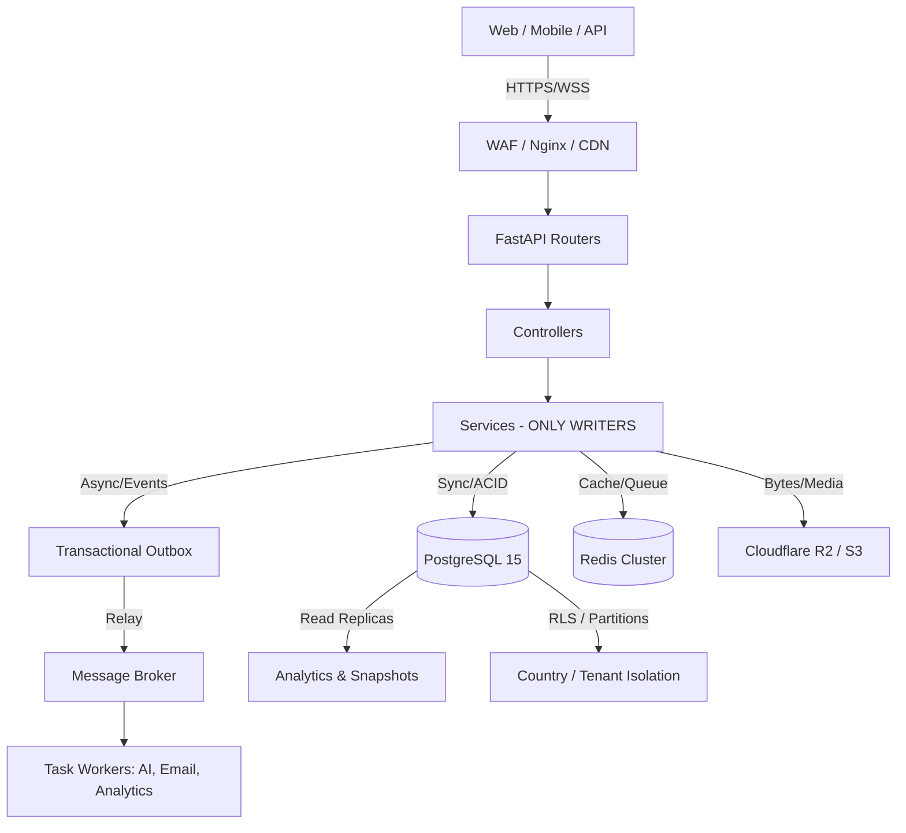

### B. Media, Storage & AI Lifecycle
```text
[Upload] -> API Validation -> S3/R2 (Original Bytes) -> DB (`media_assets` Metadata)
                 |
                 v
         [Async Workers] -> Optimize/Thumbnail/WebP -> CDN Edge
                 |
                 v
         [AI Pipeline] -> CLIP/Whisper/OCR -> `ai_embeddings` (pgvector) -> `ai_staging`
                 |
                 v
         [Explicit Commit] -> Business Tables (e.g., `products`) -> Audit Log
```

---

## 2. MASTER BULLET POINTS (The "What" & "Rules")

### 🏛️ Golden Rules & Governance
*   **Single Source of Truth:** Never duplicate transactional data; reference it. No cross-ecosystem Foreign Keys (use Events/Services).
*   **No Silent Fallbacks:** If a pipeline fails, report it explicitly. Never mask errors.
*   **Schema Changes:** **Alembic ONLY**. `Base.metadata.create_all()` is strictly forbidden in Production. Every migration requires a downgrade and contract test.
*   **Country Isolation:** 100% of country-scoped tables MUST have `country_code` and PostgreSQL Row-Level Security (RLS).
*   **Immutability:** Financial ledgers and audit logs are append-only/WORM. Never `UPDATE` posted journal entries.
*   **Config as Data:** No hardcoded business constants (commissions, fees). Use config tables.

### 🗄️ Bounded Contexts (PostgreSQL Schemas)
*   `core`: Users, roles, sessions, devices, auth.
*   `commerce`: Products, variants, categories, carts, orders.
*   `supplier`: Profiles, KYC, documents, wallets.
*   `customer`: Profiles, addresses, wishlists, points.
*   `logistics`: Partners, fleet, shipments, routes, POD.
*   `finance`: Chart of Accounts, double-entry journal, AR/AP, invoices.
*   `treasury`: Cash positions, bank reconciliation, payouts.
*   `hr`: Employees, attendance, shifts, payroll.
*   `country`: Configs, cities, tax rules, legal rules.
*   `media`: `media_assets` metadata (bytes in object storage).
*   `ai`: Embeddings, requests, results, staging tables, jobs.
*   `communication`: Chat, email, SMS, push, tickets, video rooms.
*   `audit`: WORM logs, permission audits, security logs.
*   `security`: API keys, fraud, risk, MFA, OTP.
*   `analytics`: Daily/monthly snapshots, KPIs, materialized views.
*   `configuration`: System toggles, business rules.

### 🔍 Domain-Specific "Small Details" & Data Patterns

#### 🛒 Commerce & Catalog
*   **Categories:** Materialized path (`/1/15/42/`) + `lft/rgt` for instant subtree queries.
*   **Variants:** JSONB `attributes` + GIN index + `variant_key` hash. No flat columns for color/size.
*   **Limits:** Max 20 images per product. Max 50 variants per product.

#### 💰 Finance & Treasury
*   **Ledger Chain:** CoA → Journal → Ledger → Balance → Trial Balance → P&L.
*   **Rules:** Strict double-entry. `Σdebit == Σcredit`. Period-close locking.
*   **Payouts:** Batches → Treasury Payout → Journal → Bank.

#### 💬 Communication (Chat, Email, Video Calls)
*   **Chat Tables:** `chat_threads`, `chat_messages` (Partitioned monthly by `created_at`).
*   **Chat Features:** Read receipts, typing indicators (Redis), last seen, voice notes (Max 5MB, S3 stored).
*   **Video Calls:** `video_rooms` table tracks `session_id`, `participants`, `started_at`, `ended_at`. WebRTC signaling via WebSockets; DB only stores metadata/billing.
*   **Email/SMS:** `notification_queue`, `email_messages`. Provider-agnostic. Track opens/clicks via webhooks → `email_events`. Retry logic + Dead Letter Queue (DLQ).

#### 🖼️ Media & Storage (Images, Videos, Voice, Docs)
*   **Rule:** **Metadata in DB, Bytes in Object Storage (Cloudflare R2/S3).**
*   **Images:** Original → Optimized → Thumbnail → WebP → CDN. DB stores `url`, `mime`, `hash`, `w/h`, `ai_status`.
*   **Videos:** Max 200MB. Streamed via CDN.
*   **Documents:** Supplier KYC, PDFs. Encrypted at rest in S3.
*   **Lifecycle:** Hot (CDN) → Warm (S3 Standard) → Cold (S3 Glacier/Archive) → Destroyed (after legal retention).

#### 🤖 AI, Search & Vectorization
*   **Vectorization:** `pgvector` extension. `embedding vector(1536)` on products/AI assets. HNSW indexing.
*   **Search Strategy:** Hybrid Search = Full-Text Search (`tsvector` + GIN) + Semantic (`pgvector`) + CLIP (Vision).
*   **AI Staging:** AI NEVER writes directly to business tables. Flow: `ai_upload_jobs` → `ai_staging_*` → Explicit Human/Auto Commit → `products`.
*   **Models:** Local Ollama (`phi3:mini`, `qwen2.5`, `moondream`). Vision OFF by default on VPS to save costs.

#### 📊 Analytics, Events & Audit
*   **Events (Transactional Outbox):** `outbox_events` (written in same TX as business data) → Relay → Broker → `inbox_events` (idempotency dedupe) → `event_dead_letter`.
*   **Analytics:** NEVER run live aggregates on transactional tables. Use Materialized Views (`mv_daily_sales`, `kpi_revenue`) refreshed by cron.
*   **Audit:** ONE append-only `audit_logs` table, range-partitioned monthly. `log_type` enum (activity, security, finance, api).

### ⚙️ Infrastructure, Scaling & Security
*   **Performance Targets:** Search <300ms, Product Page <200ms, Checkout <500ms, Hot-list p95 <300ms.
*   **Pooling:** PgBouncer (Transaction mode) in Prod. App pool `size=5`, `max_overflow=10`.
*   **Pagination:** Cursor-based EVERYWHERE. No `OFFSET` on large tables.
*   **Security:** TLS in transit, Encryption at rest. PII masking at app layer. WORM for financial/legal.
*   **Growth Planning:** MVP (10K products) → Scale (1M products, JSONB GIN, pgvector) → Massive (100M products, shard by country).

---

## 3. STEP-BY-STEP CONSTRUCTION GUIDE (For AI & Engineers)

*Execute these steps sequentially. Do not skip phases. Validate against the "AI Binding Contract" at every step.*

### Step 1: Foundation & Governance Setup
1.  **Initialize Alembic:** Set up `alembic/` directory. Configure `env.py` to read from `APP_ENV`.
2.  **Enforce Env Gate:** Write a startup guard in `db/database.py` that raises a fatal error if `Base.metadata.create_all()` is called when `APP_ENV != development`.
3.  **Create Schemas:** Execute `CREATE SCHEMA` for all 16 bounded contexts (`core`, `commerce`, `finance`, etc.).
4.  **Implement Mixins:** Create `db/mixins.py` with `AuditMixin` (created_at, updated_at, created_by, version), `SoftDeleteMixin` (is_deleted, deleted_at, delete_reason), and `TenantMixin` (country_code).

### Step 2: Core, Identity & Country Isolation
1.  **Build Core Tables:** `users`, `roles`, `sessions`, `devices` in the `core` schema.
2.  **Implement RLS:** Write `data/pg_rls_policies.sql`. Create the `rls_interceptor.py` middleware to `SET app.current_country_code` on every request.
3.  **Apply RLS:** Apply policies to all `TenantMixin` inherited tables. Ensure cross-country reads return 0 rows (fail-closed).
4.  **Security Tables:** Build `security` schema (api_keys, mfa, otp, blacklist).

### Step 3: Catalog, Media & Object Storage
1.  **Object Storage Setup:** Configure `boto3` with Cloudflare R2 endpoint.
2.  **Build Media Tables:** Create `media.media_assets` (metadata only: url, mime, hash, w/h, ai_status).
3.  **Build Catalog:** Create `commerce.categories` (materialized path), `commerce.products`, `commerce.product_variants` (JSONB attributes + GIN).
4.  **Implement Upload Flow:** API receives file -> uploads bytes to R2 -> saves metadata to `media_assets` -> links to product.

### Step 4: Commerce, Logistics & Event Outbox
1.  **Build Order Flow:** `commerce.orders`, `order_items`, `carts`.
2.  **Implement Transactional Outbox:** Create `outbox_events`, `inbox_events`, `event_retry_queue`, `event_dead_letter`.
3.  **Wire Services:** Ensure `OrderService` writes to `orders` AND `outbox_events` in the **exact same database transaction**.
4.  **Logistics:** Build `logistics.shipments`, `routes`, `pod` (Proof of Delivery). Link via events, not FKs.

### Step 5: Strict Finance & Ledger Implementation
1.  **Build Ledger:** Create `finance.accounts` (CoA), `finance.journal_entries`, `finance.journal_entry_lines`.
2.  **Enforce Immutability:** Write a PostgreSQL Trigger that raises an exception on `UPDATE` or `DELETE` to `journal_entry_lines`.
3.  **Build Ledger Service:** Create `finance_ledger_service.py`. This is the **ONLY** service allowed to insert into journal tables. Ensure `Σdebit == Σcredit` before commit.
4.  **Treasury:** Build `treasury.payout_batches`, `cash_positions`.

### Step 6: Communication (Chat, Video, Notifications)
1.  **Build Chat:** Create `communication.chat_threads`, `chat_messages`. Apply **Monthly Range Partitioning** on `chat_messages.created_at`.
2.  **Video Calls:** Create `communication.video_rooms` for session metadata. Integrate WebSocket router for WebRTC signaling.
3.  **Notifications:** Build `communication.notification_queue`, `email_messages`, `push_logs`. Implement retry logic and DLQ routing.
4.  **Presence:** Configure Redis to handle ephemeral "typing" and "online" states (do not store in Postgres).

### Step 7: AI, Vectorization & Search
1.  **Enable Extensions:** Run `CREATE EXTENSION vector; CREATE EXTENSION pg_trgm; CREATE EXTENSION btree_gin;`
2.  **Build AI Tables:** Create `ai.ai_requests`, `ai.ai_embeddings` (using `vector(1536)`), `ai.ai_staging_products`.
3.  **Implement Hybrid Search:** Create generated `tsvector` columns for text search. Build search service combining `tsvector` (BM25) + `pgvector` (Cosine similarity).
4.  **AI Commit Flow:** Build the explicit commit pipeline from `ai_staging` to `commerce.products`, logging costs/jobs in `ai.ai_upload_jobs`.

### Step 8: Analytics, Archiving & Scaling
1.  **Materialized Views:** Create `analytics.mv_daily_sales`, `kpi_revenue`, etc. Set up cron jobs for `REFRESH MATERIALIZED VIEW CONCURRENTLY`.
2.  **Audit Logs:** Create `audit.audit_logs` with **Monthly Range Partitioning**.
3.  **Archive Strategy:** Write scripts to detach partitions older than retention periods (e.g., 180 days for logs, 7 days for OTP) and move to cold storage.
4.  **Indexing:** Apply composite indexes `(country_code, created_at)`, `(status, due_date)`. Add GIN indexes to all JSONB columns.

### Step 9: Production Hardening & CI/CD Gates
1.  **Drift Gate:** Add `alembic check` to CI pipeline. Fail build if models != migrations.
2.  **Contract Tests:** Write `test_database.py` assertions for every migration (verifying exact schema shape, RLS policies, and index existence).
3.  **Performance Testing:** Run `EXPLAIN ANALYZE` gates in CI. Block PRs if hot-list queries exceed 300ms or use sequential scans.
4.  **Data Dictionary:** Execute `generate_data_dictionary.py` in CI to auto-generate `GENERATED_DATA_DICTIONARY.md` and `docs/erd/` on every merge.
5.  **Prod Checklist Validation:** Verify Backup/Restore, PgBouncer config, Read Replicas, and WAF rules before final deployment.

---
**⚠️ AI AGENT DIRECTIVE:** You are now bound by this constitution. If a user requests a feature that violates these rules (e.g., "Add a foreign key from orders to finance_ledger" or "Store user profile pictures as bytea in the users table"), you MUST refuse the request, cite the specific violated rule (e.g., *Rule #7: Cross-ecosystem = services/events*, or *ADR-010: Media bytes in object storage*), and propose the architecturally correct alternative.

# _____________________________________________________________________________________________ Database Work.

# _____________________________________________________________________________________________ Making Fast Application System

	Based on your logs, the smoking gun is this line: **`[Fast Refresh] done in 5604ms`**. A 5+ second reload time means your development environment is struggling to process the massive codebase. Additionally, running a 260-table monolithic application introduces compounding slowdowns.

	Here is a prioritized, step-by-step guide to making your application blazing fast again, categorized by immediate fixes and long-term optimizations.

	---

	### 🚨 1. The #1 Suspect: Windows File System + Docker/Next.js
	Your logs show the path: `D:\Projects\10- E-COMMERCE WEBSITE\zozi\...`
	**Next.js (Webpack) and Docker are notoriously slow when watching files on the Windows NTFS drive.** Every file change triggers a massive, slow scan.

	**Immediate Solutions:**
	*   **Move to WSL2 (Highly Recommended):** Move your entire `zozi` folder into the Linux subsystem (e.g., `\\wsl$\Ubuntu\home\user\zozi`). File I/O and Next.js HMR will instantly become **5x to 10x faster**.
	*   **If you must stay on Windows:** Add this to your `next.config.js` to stop Webpack from watching unnecessary files:
		```javascript
		module.exports = {
		webpack: (config, { isServer }) => {
			if (!isServer) {
			config.watchOptions = {
				...config.watchOptions,
				poll: 1000,
				ignored: ['**/node_modules/**', '**/.git/**', '**/dist/**', '**/coverage/**'],
			};
			}
			return config;
		},
		}
		```

	---

	### ⚡ 2. Frontend (Next.js) Speedups
	Your frontend is bundling too much code on every change.

	*   **Enable Turbopack (Next.js 14+):** Turbopack is written in Rust and is exponentially faster than Webpack for development.
		*   Change your `package.json` script: `"dev": "next dev --turbo"`
	*   **Dynamic Imports (Code Splitting):** Don't load heavy components (like Maps, large Charts, or the AI Image Editor) on initial page load. Load them only when needed.
		```tsx
		import dynamic from 'next/dynamic';
		const HeavyMapComponent = dynamic(() => import('@/components/HeavyMap'), { ssr: false, loading: () => <p>Loading...</p> });
		```
	*   **Disable ESLint during Dev:** ESLint runs on every save and can add seconds to HMR. Disable it in dev mode:
		```javascript
		// next.config.js
		module.exports = {
		eslint: { ignoreDuringBuilds: process.env.NODE_ENV === 'development' },
		}
		```

	---

	### 🚀 3. Backend (FastAPI) Speedups
	With 260 tables, FastAPI can take seconds just to start up and validate Pydantic models.

	*   **Upgrade to Pydantic V2:** If you are still on Pydantic V1, upgrade immediately (`pip install "pydantic>=2.0"`). Pydantic V2 (powered by Rust) is **5x to 50x faster** at data validation.
	*   **Lazy-Load Routers:** Do not import all 20+ routers at the top of `main.py`. Import them inside the `lifespan` context or use a dynamic registration loop to reduce initial memory load and startup time.
	*   **Disable Docs in Production:** Ensure `docs_url=None` and `redoc_url=None` in your `FastAPI()` initialization for production, as generating the OpenAPI schema for 260 tables is expensive.

	---

	### 🗄️ 4. Database (PostgreSQL) Optimizations
	A massive schema leads to slow queries, which makes the whole app feel sluggish.

	*   **Fix N+1 Queries:** With 260 tables, it's easy to accidentally trigger dozens of queries per request. Use SQLAlchemy's `selectinload` or `joinedload` to fetch relationships in a single query.
		*   *Bad:* `order.customer.address` (triggers 3 queries)
		*   *Good:* `db.query(Order).options(selectinload(Order.customer).selectinload(Customer.address)).first()`
	*   **Ensure Critical Indexes Exist:** Verify that every foreign key, `country_code`, `status`, and `created_at` column has an index. Your logs show you are adding GIN indexes for JSONB, which is excellent—keep doing that.
	*   **Use Materialized Views for Dashboards:** The Command Center and Analytics pages are likely running complex `JOIN`s across 10+ tables. Create a `materialized view` that aggregates this data and refresh it every 5 minutes via a background cron job, rather than calculating it on every page load.

	---

	### 🐳 5. Docker Compose Optimizations
	If you are running this via `docker-compose up`, file syncing is a major bottleneck.

	*   **Use `cached` or `delegated` volume mounts:** Tell Docker that the container's view of the files is authoritative for reading, which speeds up I/O.
		```yaml
		volumes:
		- ./frontend/web_app:/app:cached  # Add :cached for Mac/Windows
		- ./backend:/app:cached
		```
	*   **Increase Docker Resources:** Ensure Docker Desktop is allocated at least **4 CPUs** and **8GB of RAM**.

	---

	### 🛠️ Action Plan: Do This Right Now
	1. **Move the project to WSL2** (if on Windows) or ensure you are not running it from a synced network drive.
	2. Update `package.json` to use `"dev": "next dev --turbo"`.
	3. Run `npm run dev` and watch the `[Fast Refresh]` time drop from ~5000ms to **< 500ms**.
	4. Check your FastAPI logs: if startup takes > 3 seconds, review your Pydantic models and router imports.

	If you implement just the **WSL2 move** and **Turbopack**, you will see an immediate, dramatic improvement in your development speed.

# _____________________________________________________________________________________________ Making Fast Application System

# _____________________________________________________________________________________________ Frontend/web_app UIUX AUDIT

## UI and UX of the web_app:

1. Read the codebase in detail and list down all the file and Function for UI and UX of the web_app.
2. UI and UX of the web_app is mis-match accross all the pages, button, widgets, font, theme, color, panel, glossy look accross all the pages. 
3. Panel Pages, Login/Signup Page of `Admin`, `Supplier` and `Logistic Partner` needs to be attention to be similar.
4. Light theme need attention to be look glossy and attractive and better look.
5. Dark theme as well for similar accross to all the pages and panels.
6. Need complete audit and review of the UI and UX of all the pages and panels and make it more attractive, user friendly and glossy look and similar accross to all the pages and panels and also make sure all the functions are working properly.
7. All three panels `Admin`, `Supplier` and `Logistic Partner` will be handle 1000s of queries and request at a time so according to that you can use below intelligently: 
    -  alert and notification system.
    -  tabs and filters system, search and sorting system. 
    -  color coding system for the status and priority and etc but under the theme, not extra colors.
    -  complete integrated dashborad system for the panels to manage and track all the queries and request efficiently and effectively.
    - and make changes of improvement what you feel better to have in the Ui and UX to manage and track 1000s of queries and request at a time. 
8. You don't need to make big changes.
9. Make a complete plan, checkpoint, test before implementation and after implementation and start to work on it.
10. You have to be careful while working on the UI and UX our website is already 80% complete already.


## Audit of UI and UX of the web_app:

### Phase 1: Analysis
1. Audit all pages in `frontend/web_app` and document current UI/UX inconsistencies
2. Identify mismatches across: buttons, widgets, fonts, themes, colors, spacing, and visual effects
3. Compare Login/Signup and Panel designs for `Admin`, `Supplier`, and `Logistic Partner` - highlight alignment gaps

### Phase 2: Design System Definition
4. Create a unified design system with consistent theme variables (light and dark modes)
5. Define standardized components: buttons, cards, inputs, modals, notifications, and panels
6. Establish typography, spacing, color palette, and glossy visual effects guidelines

### Phase 3: Implementation Strategy
7. For high-volume query/request management across all panels, implement:
    - Smart alert and notification system with priority levels
    - Advanced filters, search, and sorting functionality
    - Color-coded status indicators (using theme-aware palette, no extra colors)
    - Integrated dashboard with real-time analytics and query tracking
    - Responsive layout optimizations for handling concurrent operations
8. Minimize disruption: target incremental refinements, not full redesigns
9. Create migration checkpoints to prevent breaking existing functionality

### Phase 4: Execution & Validation
10. Establish QA checkpoints (pre-implementation, mid-sprint, post-implementation)
11. Test all functionality across light/dark themes on each updated page
12. Verify performance under load and ensure consistency across all three panels
13. Proceed carefully—preserve the 80% completion; focus on polish and consistency


Frontend/web_app

make a plan. there is a range of inconsistancy in all over the system of styling, color, component, and layout.
1. check all the panels, supplier, logistic, admin for buttons color, design, layout and etc to make it consistant. specially lime green color buttons, it must be follow same color of system color.
2. Slider of the Panel is not working properly of all panels, need to fix it and inconsistant the buttons and is not responsive
3. all the popup and dropdown are not consistant.
4. Product card are not responsive buttons, text, font, currency and everything is not responsive.
5. make everything faster and responsive
6. read more in detail all the frontend/web_app and find more problem of the frontend.
7. The system is loading very slow and not responsive. optimize the frontend/web_app performance.
8. there are a range of problems of frontend in the panels, pages, tab, widget consistancy which are still not solved.
9. remove the hardcode and do not write new hardcode
10. improve all the st

do the complete audit and investigation and resolve all problem correctly.

# _____________________________________________________________________________________________ Frontend/web_app UIUX AUDIT

# _____________________________________________________________________________________________ Frontend/mobile_app UIUX AUDIT

## Mobile App Audit, Alignment & Enhancement

### Phase 1: Codebase Analysis
1. List all files, folder structure, pages, components, and functions in `frontend/mobile_app` and `frontend/shared`
2. Document UI/UX framework, state management, authentication, API integration, and navigation
3. Audit all existing functionality: features, bugs, performance issues, and incomplete implementations
4. Update `CODEBASE_STATUS_MATRIX_DETAILED.md` with mobile app current status

### Phase 2: Web-to-Mobile Feature Mapping
5. Create comprehensive inventory of all `frontend/web_app` pages, components, functions, and features
6. Map each web_app feature to corresponding mobile_app implementation status (Complete/Partial/Missing/Broken)
7. Identify gaps: missing pages, missing functions, incomplete features, and non-working functions
8. Document UI/UX differences and usability issues specific to mobile

### Phase 3: Bug Fixing & Core Stabilization
9. Reproduce, document, and fix all identified bugs and issues in mobile_app
10. Test core functionality: authentication, API calls, state persistence, offline handling, navigation flow
11. Verify error handling, validation, and user feedback across all screens
12. Test on multiple device sizes (phone, tablet), orientations, and OS versions

### Phase 4: Feature Implementation & Alignment
13. Implement all missing pages and features from web_app (prioritize by business criticality)
14. Ensure functional parity: test each implemented feature against web_app equivalent
15. Implement missing API integrations and backend connections
16. Verify all components integrate properly with `frontend/shared` components

### Phase 5: UI/UX Enhancement & Consistency
17. Audit UI consistency: typography, spacing, colors, button styles, icons, and theme application
18. Redesign basic/outdated UI elements to match modern mobile standards
19. Implement responsive design patterns for varied screen sizes
20. Apply unified design system across light/dark themes for mobile platform
21. Enhance navigation patterns, gestures, loading states, and error screens

### Phase 6: Performance & Reliability Testing
22. Profile app performance: startup time, memory usage, navigation speed, API response time
23. Optimize: lazy loading, image optimization, state management, network requests
24. Test offline functionality, network reconnection handling, and data sync
25. Conduct load testing and stress testing on critical features

### Phase 7: End-to-End Testing
26. Create comprehensive test matrix covering all pages, functions, and user flows
27. Test on real devices (not just emulators): iOS and Android, various OS versions
28. Perform UAT (User Acceptance Testing) across all three user types: Customer, Supplier, Logistic Partner
29. Test payment flows, order management, notifications, and authentication workflows
30. Verify all backend API calls work correctly and handle errors gracefully

### Phase 8: Security & Data Validation
31. Audit security: credentials storage, API authentication, data encryption, sensitive data handling
32. Validate input handling on all forms and user inputs
33. Test permission requests (camera, location, notifications, storage)
34. Verify secure session management and logout functionality

### Phase 9: Documentation & Readiness
35. Document all implemented features, known limitations, and known issues
36. Create user guides for mobile app functionality
37. Update developer documentation with mobile-specific implementation details
38. Prepare release notes and deployment checklist

### Testing Checkpoints:
- **Pre-Implementation**: Document current issues, create test cases database
- **Mid-Implementation**: Test features as implemented, verify API integration
- **Post-Implementation**: Full regression testing, device compatibility testing, performance validation
- **Final Release**: UAT sign-off, production readiness check, backup and rollback plan

### Success Criteria:
- All web_app features functional in mobile_app (or documented as intentional omissions)
- No critical bugs; all P0 and P1 issues resolved
- Performance metrics met (startup < 3s, navigation < 500ms, API calls < 2s)
- UI/UX consistent across all screens and themes
- All three user roles (Customer, Supplier, Logistic Partner) fully functional with complete workflows
- Test coverage > 80% on critical user flows


	## Mobile Screen:

	`http://localhost:19006/home` and `http://localhost:19006/products` both have same objective.
		keep the `http://localhost:19006/products` and remove complete `http://localhost:19006/home` 
		but `http://localhost:19006/products` needs some changes
		Header: 
			1. Make a complete Header with the theme lime color with same shades, both side slider button is fine and place of button and in middle ZOZI logo.
			2. Search+Filter bar needs to be complete copy from the web_app because I love that style of Search + Filter bar and also keep at top at middle. 
			3. banner will component will come.
		Footer:
			1. Color will be the theme lime color with same shades, 
			2. Buttons will be looks glossy according to the theme Dark & Light.
			3. remove the search button, home button because Home Screen no longer needed, Search Bar is at upside in header.

	Read the code of the header, banner, and footer and make the changes according below. and read the html code for your reference. 

	1. the header top needs to cover too come at down the  search+filter bar and half banner.
	2. the footer needs to be color lime green
	3. remove extra search bar you just added and we need original search bar which we have same as in web_app


	- banner data is comming too much, and mobile banner will be allowed to design from the Admin seperately becasue of it has low space and customer will not like crowed banner. so make the arragement accordingly. 
	- Footer needs to be lime green as same as it header and also footer needs to folllow the system styling.
	- complete mobile application is not following the theme color, theme setting. it is not consistent with the website theme. so check and fix.
	- Product card size is inconsistent and also not responsive.
	- Take exact color scheme of the web_app into the mobile_app of lime and yellow gradient, I need same.
	- http://localhost:8081/products | shift the `search+filter` bar to upward more to be fit into/inside of the header section and also align into one line and also do the the copy of style of web_app.
	- Search+Filter bar needs size adjustment properly to fit into one row. and according to the web_app search bar we have some thin border which is not coming into mobile_app search bar. if you need you can remove the text from it.
	- http://localhost:8081/products/** is not following the style of the application.
	- Login Screen | have 2 ZOZI logos. 
	- Footer | is also must be lime green color as same as system theme color.
	- Font | use better font.
	- http://localhost:8081/edit-profile | have error check and resolve it and test also.
	- Range of things are coming double which have to resolve, so do the audit of doubling and resolve the doubling issue
	- application is running very slow, make it faster properly. 

shift up the search+filter bar, remove search text from search button.

1. `http://localhost:8081/addresses` is the part of profile so remove that.
2. `My Order` and `Notification` is the Family Feature of My Account. right ? so shift that into right side.
3. copy the color of Sign-In button and use that in all button everywhere becasue that is the theme color button.
4. fix the icons in all over the application
5. Search+Filter is not working and remove the text. add the animation when anyone press it will show the text, according to that we will get space. and reduce the size of icon in search bar.
6. Coupon is comming in 2 place.
7. Flash Sale scren has error, so fix that.
8. Notification Screen have some animation proper. fix that.
9. there a range of animation problem which you have to understand and enhance
10. banner size need to be reduce. 	- banner data is comming too much, and mobile banner will be allowed to design from the Admin seperately becasue of it has low space and customer will not like crowed banner. so make the arragement accordingly. banner is not sliding up while scrolling.
11. Footer needs to be lime green as same as it header and also footer needs to folllow the system styling.
12. Languague should open one more slider for list of selection
13. Seeting UIUX is not cool, make it better.
14. Profile have again notification, my order, offers & Coupons, setting, AI chatbot and etc which is repeating. 


---

	### 📱 Mobile App Frontend Fixes (Zozi)
		- **Banner Management**
		- Mobile banners must be designed separately in Admin (smaller space, avoid crowding).
		- Reduce banner data load; optimize for mobile UX.

		- **Theme & Styling**
		- Footer must be lime green (same as header) and follow system styling.
		- Entire mobile app must consistently follow website theme colors (lime + yellow gradient).
		- Product card sizes must be consistent and responsive.
		- Fonts should be improved for readability and modern look.

		- **Search & Filter**
		- On `/products`, shift search+filter bar upward into header section.
		- Align search+filter bar into one row; copy exact style from web_app.
		- Add thin border styling (same as web_app); remove extra text if needed.
		- Ensure `/products/**` pages follow application style.

		- **Screens Consistency**
		- Login screen currently shows **two Zozi logos** → keep only one.
		- Header must be copied and consistent across all screens.
		- Footer must be lime green everywhere (system theme color).

		- **Profile & Error Handling**
		- `/edit-profile` has errors → fix and test thoroughly.
		- Audit and resolve **duplicate/double rendering issues** across app.

		- **Performance**
		- App is running slow → optimize performance (lazy loading, caching, API response times).
		- Ensure smooth navigation and responsiveness across devices.

---
	do the audit and investiagation of all screens of the mobile_app and backend and start connect and make better UIUX of th mobile_app.
	there is a range of screen are not live


# _____________________________________________________________________________________________ Frontend/mobile_app UIUX AUDIT

# _____________________________________________________________________________________________ [Order Tracker & Order Management]

## ZOZI ORDER TRACKER & ORDER MANAGEMENT — BINDING BUILD SPEC

> Scope: Customer → Supplier → Logistic Partner → Customer delivery loop, with Admin oversight. This spec is **constitution-compliant** (`01_DATABASE.md`): events over cross-FKs, media bytes in R2, config-as-data, RLS `country_code`, audit-everything, **no silent/hardcoded fallbacks**.

---

## 1. DETAILED BULLET POINTS

### 1.1 Non-negotiables
- **One order, one identity:** every order gets a unique Order ID + signed QR token at placement; the QR is the physical "passport" of the parcel across all hands.
- **Single source of truth for status:** status lives only in DB; every change is a server-side validated transition (config-driven state machine, **not** UI logic) written to `shipment_events` + published as an outbox event.
- **No hardcoded fallbacks:** if QR service / location service / signature capture is unavailable, the system reports an explicit error mode and offers the *audited alternate path* (request→confirm). Never auto-succeed, never fake a scan.
- **Universal visibility:** the same order + same timeline is visible to **Customer, Supplier, Logistic Partner, Admin** — each with role-scoped actions.
- **Proof at every handover:** pickup = QR scan *or* supplier-confirmed request; delivery = e-signature *or* customer-confirmed request; packaging = packed-parcel photo. All proofs are media files (bytes in R2, metadata in DB).
- **Admin is the referee:** Admin can correct any wrongly-set status and cancel any wrong order — always with mandatory reason + audit log + notification to all parties.

### 1.2 Canonical lifecycle — EXACTLY as defined (order → delivery)
1. **`PENDING`** — Customer places order (payment/COD). Location captured (GPS + IP-geo service). Order appears on Supplier page (new-order alert), Customer "My Orders", Admin. Not shown to logistics yet.
2. **`PROCESSING`** — Supplier sees and accepts the order; starts processing. Visible on Supplier / Customer / Admin pages.
3. **`PREPARED`** — Supplier finishes packing: prints the parcel sheet, applies tamper seal + QR label, logs weight/dimensions, **uploads photo of the packed parcel**. Status flips to `PREPARED` and the order **flashes on ALL logistic partner pages** as available for pick-up.
4. **`PICKING UP`** — One logistic partner confirms pick-up. From this moment the order is **removed from every other logistic partner's page** and visible only to the claiming partner (plus Supplier/Customer/Admin).
   - Logistic partner **may cancel the pick-up** at this stage (any reason, **before** picked/shipped) → order returns to `PREPARED` and re-flashes to all partners.
5. **`PICKED FROM SUPPLIER`** — physical handover, verified by **either** path:
   - **Path A:** logistic partner **scans the parcel QR** in-app at handover; **or**
   - **Path B:** logistic sends a pick-up request → supplier gets notified → supplier confirms the handover.
6. **Transit (logistic-only sub-statuses, allowed only between `PICKED` and `DELIVERED`):**
   - `LOGISTIC RECEIVED` (hub receives from rider) → `DISTRIBUTION CHECKPOINT` (reaches distribution center) → `OUT FOR DELIVERY` / *In Transit / Delivering to Customer* (rider out, live GPS on).
   - Exceptions: `SHIPMENT DELAYED` (problem, resumes later), `SHIPMENT RESCHEDULED` (new slot), `SHIPMENT FAILED` (unresolvable → must **return parcel to supplier** → `SHIPMENT CANCELLED`), `SHIPMENT RETURNED` (customer rejects at door → return to supplier → cancel/refund).
7. **`DELIVERED`** — final handover, verified by **either** path:
   - **Path A:** logistic takes the customer's **e-signature** on the app; **or**
   - **Path B:** logistic sends a delivery request → customer gets notified → customer confirms receipt.
8. **`CANCELLED`** — customer cancels mid-process (before pick-up completes), or Admin cancels a wrong order. Visible everywhere.
9. **Post-delivery:** Returns / Replacement window opens (see §1.5).

### 1.3 Status & transition rules (who may do what)
- **Supplier:** `PENDING→PROCESSING→PREPARED`; confirm pick-up request (Path B); confirm return receipt.
- **Logistic partner:** claim `PREPARED→PICKING UP`; cancel own claim; scan QR / request pick-up; all transit sub-statuses; request delivery confirmation.
- **Customer:** cancel (early stages); confirm delivery (Path B); reject at door (`SHIPMENT RETURNED`); request return/replacement.
- **Admin:** **override/correct any status** (mandatory reason), **cancel any order**, resolve disputes, view everything.
- Transition matrix stored in **`configuration.order_status_rules`** (config-as-data) — server enforces it; illegal transitions rejected with explicit error.

### 1.4 Packaging & printing material
- **Supplier packages by default** (fastest); standardized: tamper-proof seal + QR label + optional weight/dimensions. Optional future **Packaging Manager** role (central hub) — reserved, config-switchable, no schema redesign later.
- **"Print Parcel Sheet" button on the Supplier order page** generates a one-page sheet containing:
  - Customer Name · Contact Number · Full Location **+ Latitude/Longitude** · Landmark
  - Order Items List (qty, variant attributes) · Invoice · Order Number · **QR code**
  - Payment method + **COD amount to collect** (if COD) · Supplier return address · Tamper-seal ID · Print timestamp
- Label payload served by a **first-class endpoint** (`/orders/{id}/label`) returning structured JSON + printable PDF/HTML; QR encodes a signed token URL resolved server-side (role + status checked on every scan).

### 1.5 Returns & replacements (part of tracking, not an afterthought)
- Customer requests **Return** or **Replacement** from My Orders within a configurable window (`order_status_rules`/config), with reason + optional photos.
- Admin (or auto-policy) approves → **reverse shipment** created and tracked with the same engine: `RETURN_REQUESTED → RETURN_APPROVED → RETURN_IN_TRANSIT (reverse pick-up) → RETURNED_TO_SUPPLIER (inspection)`.
- Outcome: **Refund** posted only through the finance **ledger service** (never ad-hoc), or **Replacement** = new order linked via `original_order_uuid`, dispatched through the identical tracking flow.

### 1.6 Panel visibility matrix
| Status | Customer | Supplier | Claiming Logistic | Other Logistics | Admin |
|---|---|---|---|---|---|
| PENDING / PROCESSING | ✅ timeline | ✅ queue | — | — | ✅ |
| PREPARED | ✅ | ✅ | ✅ **flashing pick-up board** | ✅ flashing | ✅ |
| PICKING UP → OUT FOR DELIVERY | ✅ live + GPS | ✅ | ✅ own order only | ❌ **hidden** | ✅ |
| DELIVERED / CANCELLED / SHIPMENT CANCELLED / RETURNED | ✅ | ✅ | ✅ history | ❌ | ✅ |

### 1.7 Database additions (constitution-compliant)
- `commerce.packages`: 1:1 to order · `qr_token_hash` · weight/dimensions · `tamper_seal_id` · `packed_photo_media_id` · `packaged_by/at`.
- `logistics.shipments`: claiming partner, claim/cancel timestamps, current sub-status.
- `logistics.shipment_events`: **monthly range-partitioned** · `order_uuid`, `actor_role`, `status`, lat/lng, notes, `media_ref` (photo/signature), idempotency key.
- `logistics.proof_of_delivery`: method (`qr_scan | supplier_confirm | e_signature | customer_confirm`), `signature_media_id`, confirmer.
- `commerce.return_requests` (+ replacement link) · `configuration.order_status_rules`.
- All tables: `country_code` + RLS, audit mixins, soft-delete; **media bytes in R2**, metadata in `media_assets`.

### 1.8 Events, notifications & reconciliation
- Every status change → same-transaction `outbox_events` write → WS push + push notification + email (key transitions) to the 4 panels; UI shows explicit error state if feed unavailable (no silent zeros).
- **Reconciliation engine (restored, country-aware):**
  - `COD:` Delivered → rider collects cash → **Logistic remits → ZOZI Treasury → Supplier payout (− commission)**
  - `Card:` Gateway → **Treasury → Supplier payout (− commission)** and **Treasury → Logistic delivery fee**
  - Nightly reconciliation cron with variance alerting; order referenced by `order_uuid` data column + events (no cross-ecosystem FK).
- **Location service:** small Python sidecar resolving IP→geo (GeoIP DB) merged with device GPS; stored on order with accuracy; failure → explicit "pin manually" mode, never silent.
- **Admin ecosystem wiring:** staff/employees+permissions merged hierarchy; unified Communication tab (video/chat/email); unified Moderator/Tickets/Disputes; Command Center + Analytics merged; Payments/Payouts, Finance CoA + Treasury wired; commission engine restored; full Admin CRUD.

### 1.9 Surfaces & sign-off
- Implement identically in **web_app** (Customer/Admin/Supplier/Logistic panels) and **mobile_app** (scan, signature, GPS, claim board).
- **E2E test matrix:** golden path (place→process→pack+photo+print→claim→QR scan→transit sub-statuses→e-sign→delivered); pick-up cancel; delayed/rescheduled; failed→return→cancelled; door-reject→returned; customer cancel; admin override/cancel; return & replacement; visibility assertions (flash at PREPARED, hide at PICKING UP); no-fallback assertions; COD reconciliation run.
- After all green → update `documents/CODEBASE_STATUS_MATRIX_DETAILED.md` section-by-section.

---

## 2. DIAGRAMS

### 2.1 End-to-end flow (swim-lane, handovers & proofs)
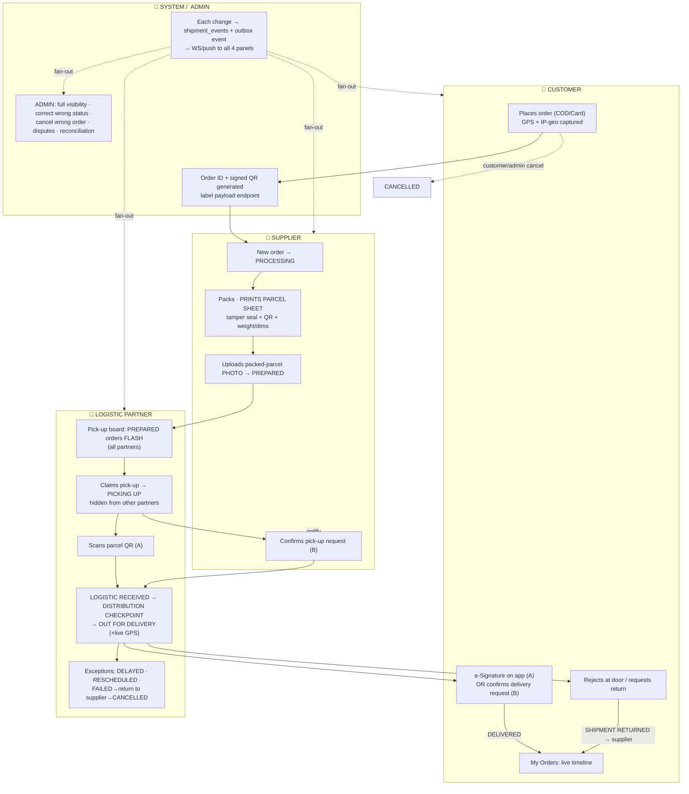

### 2.2 Status state-machine (guards = roles; proofs required)
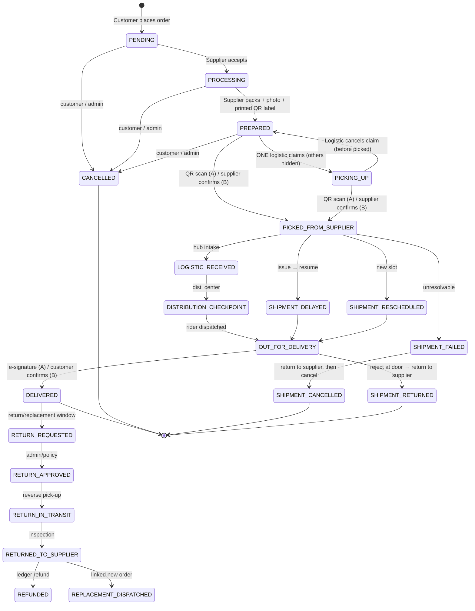

### 2.3 Money flow (reconciliation)
```
COD :  DELIVERED → rider collects cash → LOGISTIC remits → ZOZI TREASURY → SUPPLIER payout (− commission)
CARD:  Gateway → ZOZI TREASURY → ├─ SUPPLIER payout (− commission)   └─ LOGISTIC delivery fee
```

---

## 3. STEP-BY-STEP CONSTRUCTION POINTS

**Step 1 — Schema & state machine.** Alembic migration (with downgrade + contract test) creating `packages`, `shipments`, `shipment_events` (monthly-partitioned), `proof_of_delivery`, `return_requests`, `order_status_rules`; add `country_code`+RLS + audit mixins; seed the transition matrix as config data. *Done when:* illegal transition rejected in test; drift gate green.

**Step 2 — Placement, location & QR.** Order creation writes `delivery_lat/lng` (GPS + IP-geo sidecar; explicit manual-pin mode on failure); generate signed QR token + `/orders/{id}/label` payload endpoint (all print fields). *Done when:* label renders with QR + COD amount; scan token resolves server-side with role/status checks.

**Step 3 — Supplier workflow.** Order queue → accept (`PROCESSING`) → pack → **Print Parcel Sheet** button → upload packed photo (bytes→R2) → `PREPARED` + outbox event. *Done when:* photo missing blocks `PREPARED` with explicit error.

**Step 4 — Logistic claim & handover.** Flashing pick-up board for all partners at `PREPARED`; claim → `PICKING UP` (row-level visibility filter hides from others); claim-cancel returns to `PREPARED`; Path A QR scan + Path B request/confirm → `PICKED FROM SUPPLIER` (idempotent, double-scan rejected). *Done when:* visibility assertions pass.

**Step 5 — Transit & exceptions.** Transit sub-statuses with GPS trail; DELAYED/RESCHEDULED/FAILED; FAILED enforces return-to-supplier before `SHIPMENT CANCELLED`; door-reject → `SHIPMENT RETURNED`. *Done when:* each exception path leaves a full audited trail.

**Step 6 — Delivery proof.** In-app e-signature capture (PNG→R2) or customer confirm request → `DELIVERED` + `proof_of_delivery` row + COD flag for reconciliation. *Done when:* both paths produce POD record.

**Step 7 — Returns/replacements & money.** RMA flow → reverse shipment → inspection → ledger-only refund or linked replacement order; wire reconciliation entries (COD & Card paths) + nightly variance cron. *Done when:* COD run reconciles Order→Logistic→Treasury→Supplier with zero variance.

**Step 8 — Admin controls & panels.** Status-override + cancel-with-reason (audit + notify); disputes/communication/command-center merges; finance/treasury/commission wiring; build timeline/boards/scan/signature/print UIs in **web_app and mobile_app** with loading + empty + explicit-error states. *Done when:* parity check web vs mobile passes.

**Step 9 — E2E test & close-out.** Run the full §1.9 matrix (golden + all exception paths + no-fallback checks) on clean Postgres via Alembic; load-test hot lists (p95 < 300ms); then update `CODEBASE_STATUS_MATRIX_DETAILED.md` section-by-section. *Done when:* every row green and matrix committed.

> **AI Directive:** build strictly in this order; any request that bypasses the state machine, skips proof artifacts, stores media bytes in the DB, or adds a silent fallback MUST be refused and corrected per this spec and Appendix A of `01_DATABASE.md`.

# _____________________________________________________________________________________________ [Order Tracker & Order Management]

# _____________________________________________________________________________________________ [Customer Return Policy]

## Return Policy Flow

This document describes the implemented return policy flow in Zozi from supplier setup to customer request, review, resolution, and refund or replacement handling.

## 1. Policy Source of Truth

- Return policy is product-specific, not a single site-wide period.
- Each product can define a return window in days.
- Supplier profiles can define a maximum return window; the current default is 30 days.
- The platform minimum is 10 days.
- If a product has no explicit return window, the order-level flow falls back to 10 days.
- Return requests are accepted only after the order has been delivered.
- One return request can exist per order.
- Request intent must be either return or replacement.
- Only completed return requests trigger an automatic refund.
- Replacement requests are tracked, but they do not auto-refund.

## 2. Roles and Surfaces

| Role | Main Surfaces | What They Do |
| --- | --- | --- |
| Customer | Web order detail and tracking pages, mobile returns and tracking screens, help and chatbot copy | Submit and track a return or replacement request |
| Supplier | Supplier products page, return window editor, supplier returns queue | Set product-level windows and review supplier-owned items |
| Admin / Support | Admin returns queue | Approve, reject, complete, and add resolution notes |
| Backend | Returns and supplier product routes | Enforce policy rules and persist workflow state |

## 3. End-to-End Flow

### Step 1: Supplier sets the product policy

- During product create or update, the supplier can set the product return window.
- The supplier products page exposes a dedicated Return Window editor.
- The editor prevents values below 10 days.
- The backend route validates the submitted value again.
- The product return window cannot exceed the supplier profile maximum.

### Step 2: Product is published

- Product detail pages now show the actual per-product return window instead of a generic returns badge.
- Customer-facing help and chatbot copy now avoids fixed site-wide day promises.
- Customers are directed to the product detail and order pages for eligibility.
- The backend policy remains product-specific and is the source of truth.

### Step 3: Customer places an order

- The customer checks out normally.
- Return eligibility does not begin until the order is delivered.

### Step 4: Delivery is confirmed

- The system marks the order as delivered when fulfillment is complete.
- Return requests are blocked before delivery.
- For multi-shipment orders, delivery is resolved from shipment state, not a single row only.

### Step 5: Customer opens the return flow

- The customer opens order detail or order tracking.
- The customer chooses return or replacement and submits a reason.
- Web order detail only allows the return action when the order is delivered.
- The request is tied to the customer who owns the order.

### Step 6: Backend validates the request

- The order must exist and belong to the current customer.
- The order must be delivered.
- A return request must not already exist for the order.
- The request must be within the product return window measured from delivery.
- The request intent must be valid.

### Step 7: Request record is created

- A ReturnRequest row is created with status pending.
- Supplier review state is initialized for each supplier in the order.
- Timestamps are stored on creation and later updates.
- Audit logging records the creation event.
- A return-created email is queued.

### Step 8: Supplier review

- Supplier review is per supplier, not per order item in isolation.
- The supplier queue shows only the items the supplier owns.
- The supplier can set a decision of pending, approved, rejected, or restocked.
- Restocked updates can restore inventory for supplier-owned items.
- The review state is stored as JSON on the order-level return request.

### Step 9: Admin or support resolution

- Admin and support can list, inspect, and update return requests.
- Allowed status values are pending, approved, rejected, and completed.
- Resolution notes can be attached.
- The workflow stores a resolved timestamp for final outcomes.
- Bulk update support exists for queue operations.

### Step 10: Completion outcome

- If the intent is return and the request is completed, the system attempts an automatic refund.
- Stripe payments use the payment intent refund path.
- Tap payments use the Tap refund endpoint.
- The order status is updated to refunded after a successful refund.
- Refund ledger entries and customer notifications are written.
- If the intent is replacement and the request is completed, the workflow is marked complete without a refund.
- Replacement completion triggers a customer notification only.

### Step 11: Customer visibility

- The customer can review the return request from tracking and return history.
- Status updates remain visible in both web and mobile surfaces.
- Refund status is shown where the payment provider and finance records are available.

## 4. Data Stored

- ReturnRequest: order_id, user_id, intent, reason, status, resolution_notes, supplier_review_state, created_at, updated_at, resolved_at
- Order and shipment data: used to determine delivery and eligibility
- Notification rows: used for return created, return updated, refund issued, and replacement completed messages
- Refund ledger rows: used for payment reconciliation and finance reporting
- Audit log rows: used for traceability and moderation history

## 5. Key Validation Rules

- Return requests are customer-owned.
- Return requests are delivered-only.
- Return deadlines are calculated from the delivery date plus the product window.
- The platform minimum is 10 days.
- Supplier return window settings are capped by the supplier profile maximum.
- Duplicate return requests for the same order are blocked.
- Replacement intent is supported, but it does not trigger the same refund behavior as a return.

## 6. Current Implementation Notes

- The backend is the authoritative policy source.
- Supplier max return windows are now enforced consistently across create, update, and bulk-upload flows.
- Major customer-facing help and chatbot copy now aligns with the product-specific policy model.
- Replacement is modeled and tracked, but there is no separate replacement shipment workflow yet.
- Return policy analytics and deeper dispute automation are still planned items rather than fully implemented behavior.

## 7. Key Files

- [backend/controllers/returns_controller.py](../backend/controllers/returns_controller.py)
- [backend/controllers/products_controller.py](../backend/controllers/products_controller.py)
- [backend/routers/supplier.py](../backend/routers/supplier.py)
- [backend/db/models.py](../backend/db/models.py)
- [backend/db/schemas.py](../backend/db/schemas.py)
- [frontend/web_app/src/app/orders/[id]/page.tsx](../frontend/web_app/src/app/orders/[id]/page.tsx)
- [frontend/web_app/src/app/supplier/products/page.tsx](../frontend/web_app/src/app/supplier/products/page.tsx)
- [frontend/mobile_app/app/returns.tsx](../frontend/mobile_app/app/returns.tsx)
- [frontend/mobile_app/app/help.tsx](../frontend/mobile_app/app/help.tsx)
- [frontend/shared/src/i18n.ts](../frontend/shared/src/i18n.ts)
- [frontend/shared/src/returnsApi.ts](../frontend/shared/src/returnsApi.ts)

# _____________________________________________________________________________________________ [Customer Return Policy]


# _____________________________________________________________________________________________ products/xxxx : product page layout of web_app
### products/xxxx : product page layout of web_app:
		• **Top navigation bar** - Zozi logo, search, and user account icons
		• **Left sidebar** - "All photos" thumbnail gallery for product images
		• **Main product image** - Large centered photo display area with zoom capability
		• **Product details section** (top right) - Title "Designer Watch", star rating (4.8), price (Rs 37,844.83 with 29% discount), supplier description, quantity selector, and green "Add to Cart" button
		• **Supplier Details** (middle right) - Information about the seller with member since date and approval status
		• **Review section** (bottom left) - "Type your review" input area for customers
		• **Public reviews** (bottom right) - Shows "(0)" indicating no reviews yet
		• **Right sidebar** - "You may also like" product recommendations
		• **Bottom chat button** - Yellow floating chat support button

# _____________________________________________________________________________________________ products/xxxx : product page layout of web_app

# _____________________________________________________________________________________________ Admin Finance ERP System
### Admin Panel -> Finance Page:
	Read in detail backend and frontend in detail for the improvement and enhancement of http://localhost:3000/admin/finance.
	1. The Feature and tab needs to be modify and extent to actual and complete EPR level of Chart of Account, Payments, Other Sales, expenses, receivable, payeble, and etc. we have very basic system right now which needs more enhanced system.
	2. Put more automations to handle the large oraganization, like scanning the bills and record into expense,auto  bank reconciliation, Mapping System, and etc
	3. Make a dynamic Frontend System of Finance according to complete Accounts and Finance Management.
	4. Keep in mind System is running very slow, so write & modify the code to make it faster to handle 1000s of users at a time.
	5. Do the sample transaction.
	6. for admin keep the CRUD operations and admin can allow the access to any employee or sub-admin
	7. DO the complete audit of the system and according to you add more feature and finance related fucntions and tab and functionality.
	8. test each and everything in detail.

	---

# _____________________________________________________________________________________________ Admin Finance ERP System

# _____________________________________________________________________________________________ Admin Finance ERP System

For **ZoZI**, I would avoid building a full ERP like SAP or Oracle at the beginning. Build a **marketplace finance engine** that can later expand into a complete accounting system.

---

	# Accounts & Finance Roadmap

	## Phase 1 – Core Accounting

	* [ ] Chart of Accounts (COA)
	* [ ] Account Groups
	* [ ] Fiscal Year
	* [ ] Accounting Periods
	* [ ] Journal Entries
	* [ ] General Ledger (GL)
	* [ ] Trial Balance
	* [ ] Balance Sheet
	* [ ] Income Statement
	* [ ] Cash Flow Statement

	---

	## Phase 2 – Treasury & Banking

	* [ ] Bank Accounts
	* [ ] Cash Accounts
	* [ ] Bank Transactions
	* [ ] Bank Reconciliation
	* [ ] Payment Methods
	* [ ] Payment Gateway Transactions
	* [ ] Payment Gateway Reconciliation

	---

	## Phase 3 – Marketplace Finance

	* [ ] Commission Engine
	* [ ] Commission Rules
	* [ ] Supplier Settlement
	* [ ] Supplier Payout
	* [ ] Customer Refund
	* [ ] Refund Reconciliation
	* [ ] COD Reconciliation
	* [ ] Logistics Settlement
	* [ ] Platform Revenue Ledger

	---

	## Phase 4 – Receivables & Payables

	* [ ] Accounts Receivable (AR)
	* [ ] Customer Receipts
	* [ ] Accounts Payable (AP)
	* [ ] Supplier Payments
	* [ ] Outstanding Balance
	* [ ] Aging Reports

	---

	## Phase 5 – Expense Management

	* [ ] Expense Categories
	* [ ] Expense Entry
	* [ ] Expense Approval
	* [ ] Recurring Expenses
	* [ ] Employee Reimbursement

	---

	## Phase 6 – Tax

	* [ ] Tax Configuration
	* [ ] Tax Rates
	* [ ] Tax Calculation
	* [ ] Tax Ledger
	* [ ] Tax Reports

	---

	## Phase 7 – Budgeting

	* [ ] Annual Budget
	* [ ] Department Budget
	* [ ] Budget vs Actual
	* [ ] Forecast

	---

	## Phase 8 – Fixed Assets

	* [ ] Asset Register
	* [ ] Asset Categories
	* [ ] Asset Depreciation
	* [ ] Asset Disposal

	---

	## Phase 9 – Financial Reports

	* [ ] Profit & Loss
	* [ ] Balance Sheet
	* [ ] Cash Flow
	* [ ] Trial Balance
	* [ ] General Ledger
	* [ ] Journal Report
	* [ ] Supplier Statement
	* [ ] Customer Statement
	* [ ] Bank Statement
	* [ ] Commission Report

	---

	## Phase 10 – Audit & Compliance

	* [ ] Audit Log
	* [ ] Approval Workflow
	* [ ] Document Attachment
	* [ ] Financial Notes
	* [ ] Year-End Closing
	* [ ] Period Lock

	---

	# Marketplace-Specific Modules (Highest Priority)

	* [ ] Commission Engine
	* [ ] Settlement Engine
	* [ ] Payout Engine
	* [ ] Refund Engine
	* [ ] COD Engine
	* [ ] Wallet/Ledger Engine (if introduced)
	* [ ] Revenue Recognition
	* [ ] Chargeback Management
	* [ ] Payment Failure Handling

	---

	# Automation

	* [ ] Auto Journal Posting
	* [ ] Auto Commission Calculation
	* [ ] Auto Supplier Settlement
	* [ ] Auto Payout Generation
	* [ ] Auto Refund Posting
	* [ ] Auto Tax Calculation
	* [ ] Auto Bank Reconciliation
	* [ ] Auto Financial Reports
	* [ ] Scheduled Month-End Closing

	---

	# Nice-to-Have (Future)

	* [ ] Multi-Currency Accounting
	* [ ] Inter-Country Consolidation
	* [ ] Cost Centers
	* [ ] Profit Centers
	* [ ] Project Accounting
	* [ ] Loan Management
	* [ ] Investor Capital Ledger
	* [ ] Financial KPI Dashboard
	* [ ] AI Financial Insights
	* [ ] AI Anomaly Detection

	## My Recommendation

	Before adding more finance features, ensure these **10 core engines** are complete and robust:

	1. ✅ Chart of Accounts (COA)
	2. ✅ General Ledger (GL)
	3. ✅ Journal Engine
	4. ✅ Commission Engine
	5. ✅ Settlement Engine
	6. ✅ Payout Engine
	7. ✅ Bank Reconciliation Engine
	8. ✅ Tax Engine
	9. ✅ Financial Reporting Engine
	10. ✅ Audit & Period Closing Engine

	These provide a solid accounting foundation for ZoZI while remaining scalable as the platform grows into a multi-country marketplace.


# _____________________________________________________________________________________________ Admin Finance ERP System


# _____________________________________________________________________________________________ [ADMIN FINANCE & TEASURY SYSTEM ERP]

## ZOZI FINANCE · TREASURY · AUTOMATION — MASTER BUILD SPEC

> Binding addendum to `01_DATABASE.md` (finance domain → future `03_FINANCE.md`). All rules below inherit the constitution: **Alembic-only schema changes, event-driven writes, AI outputs staged → explicit commit (ADR-007), config-as-data, RLS `country_code`, media bytes in R2, immutable ledger, no silent fallbacks.**

---

## 1. BULLET POINTS — EXTRACTED + ENHANCED

### 1.1 Non-negotiable mandates
- **Event-based double-entry truth:** never `UPDATE` a balance column; balances = sums of immutable `journal_entry_lines`; `SUM(Dr) == SUM(Cr)` enforced at DB level (trigger + service check); posted entries immutable; reversals only via counter-entries.
- **Money math:** Python `Decimal` + Postgres `NUMERIC(16,4)` everywhere; **no floats** (Penny-Rounding law).
- **Event-driven ledger:** Orders/Logistics/Payments publish outbox events (`OrderDelivered`, `RefundApproved`…); only `TreasuryService`/`GeneralLedgerService` write to the GL (ADR-006/014).
- **75% zero-touch automation:** routines auto-run; humans work only the **Exception Queue**.
- **Triple-Verification for every auto-post:** ① rule/logic match ② AI confidence ≥ 95% (threshold config-driven) ③ GL/sub-ledger cross-reference; any fail → Exception Queue, never a guess.
- **Maker-Checker:** manual journals & payout batches live in `pending_journal_entries`/`payout_batches(draft)` until a *second, distinct* user with approve rights posts; checker ≠ maker enforced.
- **Period-close locking:** `fiscal_periods.is_closed` rejects back-dated postings at DB level.
- **Shadow-mode cutover:** new ledger runs parallel to legacy `wallet_balance`; nightly drift cron; cutover only at 0 variance; legacy killed after.
- **Orphan Detector cron (03:00):** any `delivered/paid` order or payout without a journal entry → Critical alert to Finance Command Center.
- **(ADDED) Automation staging law:** every AI/OCR/parsed result lands in a staging table first and is committed explicitly — auto-post *is* the commit step, logged as `actor=system:<automation>` in `finance_audit_logs`.
- **(ADDED) Idempotency law:** every automation run/line carries an idempotency key (`inbox_events`), e.g. `bankrec:{import_id}:{line_id}` — retries can never double-post.
- **(ADDED) Kill-switch law:** each automation has an independent pause toggle; paused/failed states show explicit badges — never silent stoppage (Rule #16).

### 1.2 Four-tier data architecture (schema)
- **Tier 1 CoA:** `account_groups` (1000–6000 hierarchy) · `accounts` (code, `normal_side`, currency) · `account_balances` (locked materialized cache).
- **Tier 2 Immutable Ledger:** `journal_entries` (header: date, `reference_type/id`, currency, fx_rate, status draft/posted/reversed) · `journal_entry_lines` (account, side, amount>0, cost-center, entity) · `pending_journal_entries` · `fiscal_periods`.
- **Tier 3 Treasury:** `treasury_accounts` (buckets: `cash_operating`, `cash_gateway_settlement`, `reserve_supplier_payable`, `reserve_logistics_payable`, `reserve_refund`, `reserve_vat`, `reserve_commission`, `receivable_customer`) · `treasury_transactions` · `cash_position_snapshots` · `gateway_settlement_schedules` (T+2/T+7) · `cash_flow_forecasts` · `exchange_rates`.
- **Tier 4 Sub-ledgers & Automation:** `ar_invoices`/`ar_ledger_entries` · `ap_bills`/`ap_ledger_entries` · `commission_ledger_entries` · `payout_rules/batches/batch_items/payouts` · `bank_statement_imports/lines` · `bank_mapping_rules` · `scanned_expenses` · `accruals` · `vat_remittances` · `fixed_assets` · `finance_audit_logs` · **(ADDED)** `automation_runs`, `exception_queue`, `report_definitions`, `purchase_orders/grn/landed_costs`, `loans/investments/schedules`.
- GCC CoA seeded idempotently (1010 Cash Op · 1020 Gateway Clearing · 1030 COD Receivable · 2010 Supplier Payables · 2020 Logistics Payables · 2040 VAT Payable · 2060 Deferred Revenue · 4010 Commission Revenue · 6010 Gateway Fees …); **GMV ≠ revenue** — only commission/markups/SaaS are revenue.

### 1.3 Double-entry matrix (auto-posted per event)
| Event | Debit | Credit |
|---|---|---|
| Card payment | 1020 Gateway Clearing | 2060 Deferred Revenue |
| Gateway settles | 1010 Cash Op + 6010 Gateway Fee | 1020 Clearing |
| Delivered (card) | 2060 Deferred Rev | 2010 Supplier Pay + 2020 Logistics Pay + 4010 Commission Rev + 2040 VAT |
| Delivered (COD) | 1030 COD Receivable | same 4-way split |
| Logistics remits COD | 1010 Cash Op | 1030 COD Receivable |
| Supplier payout | 2010 Supplier Pay | 1010 Cash Op |
| Refund | Rev/Deferred + payables reversed | 1010/1020 cash out |
| Month-end FX reval | 6060 FX Loss (or reverse) | FX asset/AR/AP accounts |

### 1.4 Treasury engine
- Real-time cash position (event-refreshed `account_balances` + snapshots EOD/hourly); **Free Cash = cash − reserves** (VAT/supplier/refund reserves can never be spent accidentally).
- Gateway settlement tracking (webhook + CSV auto-match vs `1020`), COD remittance engine vs `1030`, reserve transfers (Maker-Checker), 30/60/90 cash-flow forecast (ML over open AR/AP + payout schedules + historical refund rate), month-end FX revaluation auto-posts.

### 1.5 🤖 THE AUTOMATION SYSTEM (detail — the core ask)
| # | Automation | Trigger | Staging target | Auto-post condition | Exception path |
|---|---|---|---|---|---|
| 1 | **OCR expense & asset capture** (auto-expense) | camera/upload/`finance@` email; bytes→R2 | `scanned_expenses` (vendor, date, amount, VAT, per-field confidence) + pgvector embed | conf ≥95% **+ duplicate check (hash+vendor+amount+date)** + ≤ auto-limit → drafts AP bill *or* `fixed_assets` card | split-screen review (original vs fields) |
| 2 | **Email-to-Ledger inbox** | IMAP watcher on `finance@zozi.com` | `scanned_expenses` / `gateway_settlement_schedules` | template/vendor match ≥95% | queue; original email kept as immutable artifact |
| 3 | **Auto bank reconciliation** | statement CSV/API upload (daily) | `bank_statement_lines` | amount exact + ref match + date ±3d (configurable) + conf ≥95% → `is_reconciled` | split-screen match UI, bulk resolve |
| 4 | **Auto supplier payouts (scheduler)** | nightly cron 02:00 | `payout_batches(draft)` from `commission_ledger_entries` + `payout_rules` | generation is auto; **dispatch always Maker-Checker**; supplier gets secure SMS/email pre-review link | payout exception list (mismatched balances, KYC holds) |
| 5 | **Auto-accrual & reversal** | month-end 23:59 / day-1 cron | `accruals` | rule-based (no AI gate) | review list |
| 6 | **Depreciation run** | monthly cron | draft JEs from `fixed_assets` (straight-line/declining; disposal gain/loss) | schedule config valid | asset exception list |
| 7 | **FX revaluation** | month-end cron | draft JEs | rate source present (timestamped `exchange_rates`) | manual rate entry screen |
| 8 | **VAT remittance** | continuous aggregation + month-end | `vat_remittances` (output−input) | arithmetic exact | ZATCA/FTA CSV export wizard + review |
| 9 | **Orphan detector** | daily 03:00 | alerts only | n/a | Critical alert, Command Center |
| 10 | **Voice-to-text finance ops** | mic (admin web/mobile) → Whisper STT (EN `phi3`/AR `qwen2.5`) | intent draft card | **never auto-posts** — confirm card → maker-checker if posting | explicit "STT unavailable" mode, manual entry |
| 11 | **Finance chatbot (vectorized)** | NL query; RAG over CoA+ledger+docs via `ai_embeddings` (pgvector) | `ai_staging_journals` | user taps **Confirm** (+checker above threshold) | explicit "cannot verify" answer, cites sources |
| 12 | **Import & Purchase automation** | PO/GRN/vendor-invoice events | `ap_bills(draft)` | **3-way match** PO↔GRN↔Invoice within tolerance + **landed-cost auto-allocation** (customs/freight/insurance → asset/COGS value) | match-exception queue |
| 13 | **Loans & Investments** | wizard field-selection (principal, rate, term, method) | `schedules` (effective-interest amortization / valuation) | schedule cron posts interest/valuation JEs | manual review list |
| 14 | **Wholesale / B2B revenue** | bulk-order dispatch on terms | `ar_invoices` + `ar_ledger_entries` (net-30, credit limits, IFRS-15 deferred amortization) | credit check passes | credit-hold queue + **auto dunning cadence** (emails day 3/7/14, late-fee per config) |

**Automation governance (ADDED hardening):** `configuration.automation_rules` holds every threshold (confidence %, auto-post caps, date variance, 3-way-match tolerance, dunning cadence) — editable in UI, versioned, audited; `automation_runs` logs each run (job, started, status, posted/exception counts, error) powering the Control Tower; DLQ via `event_dead_letter`; local Ollama `moondream` for vision when available, explicit degraded-queue mode when not (ADR-015, Rule #16).

### 1.6 Security · RBAC · Performance · Testing
- Granular perms (`finance.ap.post`, `finance.ledger.approve`, `finance.reconciliation`…) via `require_finance_permission`; delegated roles (AP Clerk / Treasury Analyst); append-only `finance_audit_logs` (actor incl. `system:*`, old/new JSON, IP).
- N+1 eradication (`selectinload/joinedload`); composite indexes `(country_code, created_at)`, `(status, due_date)`, `(entity_type, entity_id)`; dashboards/reports served from **materialized views + read replicas**; cursor pagination; Decimal-only.
- Tests: **Chaos Monkey** (1000 checkouts + 500 payouts, zero deadlocks, Dr==Cr), **Penny Rounding**, **Time-Travel Audit** (replay journals to reconstruct any past date), **malformed-automation tests** (bad CSV/OCR → Exception Queue, never crash), E2E Playwright (CSV→AI map→draft→approve→trial balance), k6 load.

---

## 2. DIAGRAMS

### 2.1 Master automation & ledger pipeline
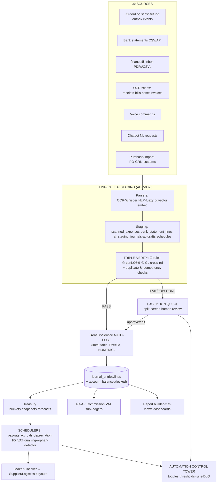

### 2.2 Money circuit (order → treasury → payout; same circuit as Order Tracker)
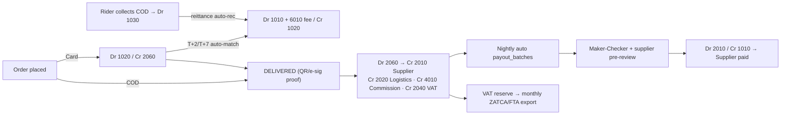

### 2.3 Automation item lifecycle
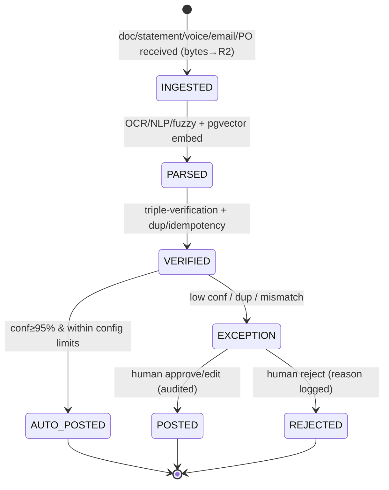

---

## 3. STEP-BY-STEP CONSTRUCTION

**Phase 0 — Governance.** Freeze mandates §1.1; define RBAC matrix; create `configuration.automation_rules` + `automation_runs` + `exception_queue` designs. *Done when:* thresholds & roles signed off (ADR log updated).

**Phase 1 — Schema & seeds.** One Alembic migration set (downgrade + contract tests) for the 4 tiers + automation tables; immutable-ledger DB trigger; seed GCC CoA, treasury buckets, fiscal periods. *Done when:* drift gate green; trial-balance endpoint returns seeded zeros balanced.

**Phase 2 — Core engines.** `GeneralLedgerService.post_journal_entry()` (Dr==Cr abort, `SELECT … FOR UPDATE` on `account_balances`) + `TreasuryService` (position, snapshots, forecasts, settlements). *Done when:* Penny-Rounding + Time-Travel unit tests pass.

**Phase 3 — Shadow mode & cutover.** Inject GL into payments/orders/payouts controllers in shadow; nightly drift cron legacy-vs-ledger; at 0 variance kill legacy wallet writes; wire gateway webhook auto-match + COD remittance engine. *Done when:* 7 clean drift-free nights.

**Phase 4 — Automation Wave 1 (documents & money-in).** OCR auto-expense/asset pipeline; Email-to-Ledger; auto bank rec; orphan detector. *Done when:* malformed-file tests land 100% in Exception Queue; ≥95%-conf fixtures auto-post.

**Phase 5 — Automation Wave 2 (schedulers).** Nightly payout batch generator + supplier pre-review links + Maker-Checker dispatch; accrual/reversal; depreciation; FX reval; VAT aggregation/export; dunning cadence. *Done when:* one full simulated month closes with zero manual routine posts.

**Phase 6 — Voice & chatbot.** Whisper STT service + intent parser (confirm-gated); RAG chatbot over CoA/ledger/docs with draft-journal cards. *Done when:* voice→draft→approve E2E passes; degraded-mode test shows explicit errors only.

**Phase 7 — Advanced ERP modules.** AR/AP aging + approvals; Import & Purchase 3-way match + landed cost; Loans & Investments wizards + schedule crons; Wholesale/B2B credit, AR invoicing, IFRS-15 recognition. *Done when:* 3-way-match tolerance tests + amortization math tests pass.

**Phase 8 — Report builder & analytics.** `report_definitions` (JSONB fields/filters/group-by) + preview + save + scheduled email/CSV/PDF; heavy reports on materialized views/read replicas. *Done when:* admin builds, saves, schedules a custom P&L-by-cost-center with no code.

**Phase 9 — Command Center UI (web + mobile parity).** Build per §4; lazy-loaded routes; skeletons; WS live ticks. *Done when:* Playwright E2E full lifecycle green on both apps.

**Phase 10 — Hardening & close-out.** Chaos Monkey, load (k6), security (RLS fail-closed per country), restore drills; update `CODEBASE_STATUS_MATRIX_DETAILED.md` section-by-section. *Done when:* all gates green + sign-off.

---

## 4. UI/UX LAYOUT — FINANCE COMMAND CENTER

### 4.1 Route-driven sidebar (`/admin/finance?section=…`, lazy-loaded)
```
📊 Command Center (dashboard+analytics merged)   🏦 Treasury (cash·banks·reconciliation·gateway)
📒 Ledger (CoA tree·journals·trial balance·pending)  🤝 Settlements (commissions·payouts·COD·refunds)
💰 Receivables (invoices·receipts·aging·dunning)     🏗 Purchasing (PO·GRN·imports·landed cost)
🏢 Payables (bills·payments·aging·OCR dropzone)      🏛 Assets & Capital (fixed assets·loans·investments)
🧾 Tax & Compliance (VAT·WHT·period close)           📑 Reports (builder·saved·scheduled)
🤖 Automation Tower (controls·exception queue·audit)
```
**Topbar:** global hybrid search (FTS+vector) · 🎙 voice · 🤖 chatbot drawer · country switcher (RLS) · 🔔 exception-count bell.

### 4.2 Key screens
- **Dashboard:** KPI card row (Free Cash, Locked Reserves, MTD Net Revenue, Pending Payouts, VAT Due, Exceptions) with skeleton loaders + sparklines; 30/60/90 cash-flow chart; AP/AR aging bars; live GMV tick (WS).
- **Exception Queue (the human inbox):** left = prioritized list (source icon, confidence chip, amount); right = **split-screen**: original PDF/image (R2 viewer) | extracted fields (per-field confidence) | suggested GL lines; actions Approve / Edit / Reject (reason) with keyboard shortcuts; bulk-resolve.
- **OCR Dropzone (Payables + mobile camera):** drag-drop → side-by-side original vs extracted → "Post to AP" / "Register Asset"; duplicate-invoice warning banner.
- **Reconciliation (Treasury):** bank line left ↔ suggested GL matches right with confidence chips; auto-match toggle + threshold slider; one-click & bulk reconcile; exception filter.
- **Payout Control Room (Settlements):** batch pipeline chips `draft→pending→approved→dispatched→settled`; maker notes; **Approve disabled for the maker**; dispatch → bank API/CSV; supplier pre-review status column.
- **Report Builder:** drag fields (CoA ranges, dimensions: country/supplier/cost-center/period) + filter builder + group-by → live preview grid → Save / Schedule (daily/weekly/monthly email) / Export CSV·PDF.
- **Automation Control Tower:** card per automation (OCR, bank-rec, payouts, accruals, depreciation, FX, VAT, dunning, orphan, voice, chatbot) with ON/OFF toggle, cron, last-run, posted/exception counters, threshold sliders, "View DLQ"; paused = explicit badge.
- **Chatbot drawer & Voice chip:** suggested prompts ("Why did VAT jump?", "Draft rent accrual"); every actionable answer is a **confirm card** (→ maker-checker above limits); transcript chip editable before intent parse.
- **UX principles:** sub-200ms first paint via materialized views + server components; tabular numerals; sticky headers; ARIA + keyboard nav; empty/loading/error states never silent zeros; mobile app = supplier invoice submit, logistics remittance upload, approver push-approvals, camera OCR.

> **AI Directive:** implement in Phase order; any automation that posts without staging+triple-verify, any balance `UPDATE`, any float math, or any silent fallback violates this spec and Appendix A — STOP and ask.

# _____________________________________________________________________________________________ [ADMIN FINANCE & TEASURY SYSTEM ERP]

# _____________________________________________________________________________________________ [ADMIN PAYMENT GATEWAY MANAGEMENT]

## Payment Gateway Management

## Current Scope

The admin payment hub now supports two classes of providers:

- Live checkout adapters: `stripe`, `tap`, `paytabs`
- Managed provider templates: `paypal`, `hyperpay`, `omannet`, plus arbitrary custom providers

Every gateway record can store:

- Provider code and kind
- API/public/secret credentials
- Merchant identifier
- Base/test/webhook URLs
- Supported currencies
- Gateway fee and payout fee rules
- Whether fees are passed to the customer
- Settlement cycle: `daily`, `weekly`, or `monthly`
- Last test status and test message

## Checkout and Order Flow

- Checkout reads `/payments/methods` and renders fee-aware totals for the live adapters.
- Orders persist gateway fee snapshots on creation:
  - `payment_gateway_code`
  - `payment_gateway_fee_amount`
  - `payment_customer_total_amount`
  - `payment_gateway_fee_passed_to_customer`
- Stripe, Tap, and PayTabs charge the customer-payable total when the fee is configured to be passed through.

## Payout and Settlement Flow

- Finance quote preview uses the configured gateway fee profile.
- If `pass_fee_to_customer=false`, supplier payout estimates are reduced by the gateway fee.
- Supplier settlements now deduct the saved gateway fee allocation when the fee is not passed through.
- Settlement eligibility now respects the gateway record's `settlement_cycle`:
  - `daily` -> 1 day
  - `weekly` -> 7 days
  - `monthly` -> 30 days

## Provider Extension Path

To add the next real payment adapter:

1. Add provider defaults to `backend/controllers/payments_controller.py`
2. Add create/confirm/webhook or callback routes in `backend/routers/payments.py`
3. Wire checkout UI in `frontend/web_app/src/app/checkout/page.tsx`
4. Add gateway-management and order-flow tests under `backend/tests/`
5. Update this document with the new provider's runtime behavior

Managed templates can already store credentials and run sandbox connectivity checks, but they require provider-specific transaction logic before they can drive live checkout.


-----------------------------------------------------------------------------------------

now we have to discuss the payment gateway integration.
we need a unified system which will easily attached with any payment gateway easily 

---------------------------------------------------------------------------------------------------------
---------------------------------------------------------------------------------------------------------


Based on the forensic analysis of your codebase, I have excellent news: **You have already built 80% of this unified system.** 

Your backend already contains a brilliant **Payment Orchestrator Architecture** consisting of:
1. `BasePaymentGateway` (The abstract contract)
2. `PaymentGatewayRegistry` (The auto-discovery engine)
3. `PaymentEngine` (The central router)
4. `PaymentGatewayConnection` (The database model for credentials and fees)
5. Live Adapters for Stripe, Tap, Thawani, PayTabs, Mada, and STC Pay.

However, to make it truly **"Plug-and-Play"**—where a developer or admin can attach *any* new local gateway (e.g., JazzCash in Pakistan, Fawry in Egypt, or a new crypto processor) in under an hour without rewriting core logic—we need to standardize the missing 20%. 

Here is the **CTO-Level Master Plan** to finalize the **Zozi Universal Payment Connector**.

---

### 🏛️ Phase 1: The "Universal Adapter" Contract Standardization
To make adding a new gateway easy, every gateway must speak the exact same internal language. We must strictly enforce the `BasePaymentGateway` contract so that the `PaymentEngine` never needs to know *which* gateway it is talking to.

**The 5 Mandatory Methods Every Adapter Must Implement:**
1. **`authorize_and_capture()`**: Handles the actual charge. Must return a standardized `PaymentResult` (Success, Failed, or Requires_3DS/Redirect).
2. **`process_refund()`**: Handles full or partial refunds. Must return a `RefundResult`.
3. **`verify_webhook_signature()`**: The cryptographic security gate. Takes the raw HTTP body and headers, and returns `True/False`.
4. **`normalize_webhook_payload()`**: Translates the gateway's specific JSON (e.g., Stripe's `payment_intent.succeeded`) into Zozi’s internal `ZoziPaymentEvent` schema.
5. **`test_connection()`**: Pings the gateway's sandbox API to verify API keys are valid before the Admin enables it.

*Strategic Upgrade:* Create a **`GenericRESTAdapter`**. For simple gateways that don't have a Python SDK, the Admin can input the `Charge URL`, `Auth Headers`, and `JSON Payload Template` directly into the Admin UI. The `GenericRESTAdapter` uses these DB-stored templates to make the HTTP request, meaning **you can add basic gateways without writing any new Python code.**

---

### 🔄 Phase 2: The Universal Webhook Normalizer
The biggest headache in multi-gateway systems is that every provider sends webhooks in a completely different format. 

**The Plan:**
1. Create a single internal Pydantic model called `ZoziPaymentEvent`.
   * `zozi_order_id` (Extracted from metadata)
   * `gateway_transaction_id` (The provider's reference)
   * `status` (Enum: `PAID`, `FAILED`, `REFUNDED`, `CHARGEBACK`)
   * `amount_captured` (Decimal)
   * `gateway_fee_deducted` (Decimal)
2. **The Translation Layer:** Inside every adapter (e.g., `TapAdapter`, `StripeAdapter`), write a `translate_webhook()` function. 
3. **The Result:** The `PaymentEngine` and the `Treasury Ledger` *only* ever interact with `ZoziPaymentEvent`. If you add a new gateway tomorrow, the Treasury Engine doesn't need a single line of code changed, because the new adapter handles the translation.

---

### ⚙️ Phase 3: The Admin "Gateway Wizard" UI (No-Code Setup)
Your codebase already has the UI for managing `fee_percent`, `fixed_fee_amount`, and `settlement_cycle`. We need to expand this into a full "Gateway Onboarding Wizard" inside the Country Ledger.

**The 4-Step Admin Wizard:**
1. **Selection & Feasibility:** The Admin selects a country (e.g., Saudi Arabia). The system's *Algorithmic Heuristic Engine* suggests the best gateways (e.g., Tap, Mada, HyperPay) based on regional feasibility scores.
2. **Credential Vault:** The Admin inputs the `Public Key`, `Secret Key`, and `Webhook Secret`. 
   * *Security:* These are immediately encrypted via AES-256 (KMS) before being saved to the `PaymentGatewayConnection` table. They are never logged or returned to the frontend in plain text.
3. **Fee & Routing Rules:** The Admin defines:
   * *Who pays the fee?* (Toggle: `pass_fee_to_customer` or `absorb_by_supplier`).
   * *Routing Logic:* "If Cart > $500, route to Gateway A. If Cart < $500, route to Gateway B."
4. **The "Sandbox Test" Button:** The Admin clicks "Test Connection". The backend uses the `test_connection()` method to charge $1.00 to a test card and immediately refunds it. If successful, the "Enable for Checkout" toggle unlocks.

---

### 🛡️ Phase 4: Smart Routing & Fallback Engine (High Availability)
If Tap Payments goes down in Oman, checkout shouldn't fail. The Unified System must include an automatic fallback mechanism.

**The Plan:**
1. **Priority Tiers:** Allow the Admin to assign gateways to Tiers (Tier 1: Primary, Tier 2: Fallback).
2. **Health Monitoring:** The `PaymentEngine` tracks the success rate of every gateway over a rolling 1-hour window.
3. **Auto-Degradation:** If Tier 1's success rate drops below 85% (due to gateway downtime or bank network issues), the `PaymentEngine` automatically stops offering it at checkout and routes all traffic to Tier 2.
4. **Alerting:** The system fires an alert to the Command Center: *"⚠️ Thawani success rate dropped to 60%. Traffic automatically rerouted to Stripe."*

---

### 📝 Phase 5: The Developer Playbook (How to add a new gateway)
To ensure your engineering team can easily attach *any* gateway in the future, we will document a strict **4-Step Playbook**:

*   **Step 1: Create the File.** Create `backend/services/gateways/new_gateway.py`. Inherit from `BasePaymentGateway`.
*   **Step 2: Implement the 5 Methods.** Map the new gateway's API to `authorize_and_capture`, `process_refund`, `verify_webhook`, etc.
*   **Step 3: Auto-Discovery.** Because of your existing `PaymentGatewayRegistry` (which uses `pkgutil` to scan the folder), the new gateway is *automatically* registered the moment the server restarts. No manual imports required.
*   **Step 4: Admin Config.** Add the gateway's logo and setup instructions to the frontend `GatewayWizard` component.

---

### 🗺️ Execution Roadmap

| Phase | Action Item | Target Completion |
| :--- | :--- | :--- |
| **Week 1** | **Standardize Webhooks:** Build the `ZoziPaymentEvent` normalizer and update Stripe/Tap/Thawani adapters to use it. | High Priority |
| **Week 2** | **Security Hardening:** Implement AES-256 encryption for the `secret_key` and `webhook_secret` fields in the `PaymentGatewayConnection` DB model. | High Priority |
| **Week 3** | **Smart Routing:** Build the Health Monitor and Tier-based Fallback logic inside the `PaymentEngine`. | Medium Priority |
| **Week 4** | **The Generic REST Adapter:** Build the template-based adapter so Admins can connect simple REST-based gateways without developer intervention. | Low Priority (Future) |

### Summary
Your foundation (`PaymentEngine` + `Registry`) is already enterprise-grade. By enforcing the **Universal Webhook Normalizer**, adding **AES-256 Credential Encryption**, and building the **Smart Routing Fallback**, you will have a truly "Plug-and-Play" Payment Connector. You will be able to expand into new GCC or Asian markets and integrate their local payment gateways in days, not months.

**Shall we begin by designing the exact Pydantic schema for the `ZoziPaymentEvent` (The Universal Webhook Normalizer), or should we map out the AES-256 Encryption logic for the Admin Credential Vault first?**

---------------------------------------------------------------------------------------------------------
---------------------------------------------------------------------------------------------------------


designing the exact Pydantic schema for the ZoziPaymentEvent (The Universal Webhook Normalizer) and map out the AES-256 Encryption logic for the Admin Credential Vault


---------------------------------------------------------------------------------------------------------
---------------------------------------------------------------------------------------------------------


This is the definitive, CTO-level architectural blueprint for the **Universal Webhook Normalizer** and the **AES-256 Credential Vault**. 

By standardizing the internal event schema and cryptographically locking down gateway secrets, you decouple your core business logic from third-party API quirks and ensure that a database breach yields zero usable financial keys.

Here is the complete, code-free design and step-by-step implementation plan.

---

### 🏛️ PART 1: The `ZoziPaymentEvent` (Universal Webhook Normalizer)

#### 1. The Architectural Concept
Every payment gateway (Stripe, Tap, Thawani, PayTabs) sends webhooks in completely different formats, using different naming conventions and nested structures. If your Order Controller and Treasury Engine try to parse these individually, the codebase becomes a fragile, unmaintainable mess.

The `ZoziPaymentEvent` acts as a **Universal Translator**. 
1. The raw HTTP webhook hits the FastAPI router.
2. The specific Gateway Adapter (e.g., `TapAdapter`) verifies the cryptographic signature.
3. The Adapter translates the raw JSON into the strict `ZoziPaymentEvent` schema.
4. **From this point forward, the Zozi backend only interacts with the `ZoziPaymentEvent`.** The Order Controller and Treasury Ledger never need to know what "Tap" or "Stripe" JSON looks like.

#### 2. Schema Architecture (The Data Dictionary)
The schema must be strictly typed, using `Decimal` for all financial figures to prevent floating-point rounding errors in the Treasury Ledger.

| Field Category | Field Name | Data Type | Description & Purpose |
| :--- | :--- | :--- | :--- |
| **Metadata** | `provider_code` | String | e.g., "stripe", "tap", "thawani". |
| | `gateway_event_id` | String | The unique ID assigned by the gateway. Used for **Strict Idempotency** (preventing double-processing). |
| | `event_type` | Enum | Normalized internal event type (e.g., `PAYMENT_CAPTURED`, `REFUND_SUCCEEDED`, `CHARGEBACK_OPENED`). |
| | `environment` | Enum | `sandbox` or `live`. Prevents sandbox webhooks from triggering live order fulfillment. |
| | `timestamp` | DateTime | Exact time the event occurred at the gateway (UTC). |
| **Identifiers** | `zozi_order_id` | UUID/String | Extracted from the gateway's `metadata` field during checkout. Links the payment back to the Zozi DB. |
| | `gateway_transaction_id` | String | The gateway's internal reference (e.g., Stripe `pi_123`, Tap `ch_123`). |
| | `gateway_customer_id` | String | The tokenized customer ID at the gateway (for future recurring charges). |
| **Financials** | `gross_amount` | Decimal | The total amount charged to the customer. |
| | `currency` | String | ISO currency code (e.g., "SAR", "OMR"). |
| | `gateway_fee` | Decimal | **Crucial for Treasury:** The exact fee deducted by the gateway. Maps to GL `5010 Payment Gateway Fees`. |
| | `net_settlement` | Decimal | `gross_amount` minus `gateway_fee`. The exact amount that will hit the Zozi Bank Account. |
| **Risk & Fraud** | `fraud_score` | Integer | Gateway's internal risk score (0-100). |
| | `three_ds_status` | Enum | `passed`, `failed`, `attempted`, `not_required`. |
| | `avs_result` | Enum | Address Verification System match status. |
| **Forensics** | `raw_payload` | JSON | The exact, unmodified raw HTTP body. Stored for audit trails and dispute resolution. |

#### 3. Step-by-Step Implementation Plan

*   **Step 1: Define the Internal Enums & Contracts**
    *   Define the strict `ZoziEventStatus` enum. Map every gateway's specific statuses to this internal enum (e.g., Stripe's `payment_intent.succeeded` and Tap's `CHARGE_SUCCESS` both map to `ZoziEventStatus.PAYMENT_CAPTURED`).
*   **Step 2: Build the Adapter Translation Layer**
    *   Update the `BasePaymentGateway` abstract class. Add a mandatory `normalize_webhook(raw_body, headers) -> ZoziPaymentEvent` method.
    *   Force every adapter developer to write the mapping logic. If a gateway does not provide the `gateway_fee` in the webhook, the adapter must calculate it based on the `PaymentGatewayConnection` fee configuration stored in the DB.
*   **Step 3: Implement the Idempotency Gate**
    *   Before processing the `ZoziPaymentEvent`, the Webhook Router queries the `ProcessedWebhookEvent` table using the `gateway_event_id`. 
    *   If it exists, the router immediately returns HTTP 200 and halts. This prevents gateways from retrying and causing double-fulfillment.
*   **Step 4: Wire to the Treasury Engine**
    *   Create a dispatcher that listens for `ZoziPaymentEvent`.
    *   If `event_type == PAYMENT_CAPTURED`: Trigger the Treasury Service to Debit `1020 Gateway Clearing` and Credit `2060 Deferred Revenue`. Simultaneously, record the `gateway_fee` as an Expense.
*   **Step 5: Implement the "Ghost Order" Reconciliation**
    *   Build a nightly cron job that compares `Orders` marked as "Paid" against `ZoziPaymentEvents` received. If an order is marked paid but no `PAYMENT_CAPTURED` event exists in the normalized ledger, trigger a Critical Fraud Alert.

---

### 🏛️ PART 2: AES-256-GCM Admin Credential Vault

#### 1. The Architectural Concept
Payment gateway Secret Keys and Webhook Secrets are the "keys to the kingdom." If a hacker gains read-access to your PostgreSQL database, they must not be able to read these keys. 

We will implement **Transparent Application-Level Encryption** using **AES-256-GCM** (Galois/Counter Mode). GCM is mandatory because it provides both *confidentiality* (encryption) and *integrity* (tamper-evidence). If a rogue DBA tries to manually alter a ciphertext in the database, the decryption process will mathematically fail and throw an error, preventing the application from using a corrupted key.

#### 2. Cryptographic Architecture
*   **The Master Encryption Key (MEK):** A 256-bit key generated once. It is **never** stored in the database or committed to Git. It is injected into the FastAPI application at startup via a secure Environment Variable, AWS KMS, or HashiCorp Vault.
*   **The Nonce (IV):** A unique, random 12-byte initialization vector generated for *every single encryption operation*. Never reuse a nonce with the same MEK.
*   **The Authentication Tag:** A 16-byte cryptographic checksum generated by GCM to prove the data hasn't been tampered with.
*   **The Database Payload Structure:** The database column will store a single concatenated string formatted as: 
    `[Version Prefix]$[Base64 Nonce]$[Base64 Ciphertext]$[Base64 Auth Tag]`
    *(Example: `v1$a1b2c3...$x9y8z7...$f1g2h3...`)*. The version prefix allows for future key rotation.

#### 3. Step-by-Step Implementation Plan

*   **Step 1: Secure Key Injection & Initialization**
    *   Configure the FastAPI `settings.py` to load the `ZOZI_VAULT_MASTER_KEY` from the environment. 
    *   Implement a startup check: If the key is missing or not exactly 32 bytes (256 bits), the application must **refuse to boot**. This prevents the app from accidentally running in an unencrypted state.
*   **Step 2: Build the `VaultService` (The Cryptographic Engine)**
    *   Create a centralized service with two methods: `encrypt_secret(plaintext)` and `decrypt_secret(payload)`.
    *   **Encrypt Flow:** Generate random 12-byte Nonce $\rightarrow$ Initialize AES-256-GCM with MEK and Nonce $\rightarrow$ Encrypt Plaintext $\rightarrow$ Extract Ciphertext and Auth Tag $\rightarrow$ Concatenate and return the formatted string.
    *   **Decrypt Flow:** Split the string by `$` $\rightarrow$ Decode Base64 $\rightarrow$ Initialize GCM $\rightarrow$ Decrypt and Verify. If verification fails (tampering detected), throw a `CriticalSecurityException`.
*   **Step 3: Transparent SQLAlchemy Integration (TypeDecorator)**
    *   Do not force developers to manually call `VaultService.encrypt()` everywhere. 
    *   Create a custom SQLAlchemy `TypeDecorator` named `EncryptedString`. 
    *   Map the `secret_key` and `webhook_secret` columns in the `PaymentGatewayConnection` model to this custom type.
    *   *Result:* When the backend saves a new gateway config, SQLAlchemy automatically intercepts the plaintext, encrypts it, and saves the ciphertext. When the `PaymentEngine` reads the config to process a checkout, SQLAlchemy automatically decrypts it in memory. The business logic remains completely clean.
*   **Step 4: Memory Wiping & Zero-Logging**
    *   Ensure that the `raw_payload` of webhooks and the decrypted `secret_keys` are **never** written to application logs (e.g., standard `logger.info()`).
    *   Implement log-filtering middleware that uses Regex to detect and mask strings matching the patterns of Stripe (`sk_live_...`) or Tap (`sk_...`) keys before they hit the console or ELK stack.
*   **Step 5: The Key Rotation Strategy (Future-Proofing)**
    *   Because we included the `v1$` prefix in the database payload, we can support key rotation.
    *   If the MEK is compromised or needs routine rotation, inject a *new* MEK (`ZOZI_VAULT_MASTER_KEY_V2`).
    *   Update the `decrypt_secret` logic: If the payload starts with `v1$`, decrypt using the old MEK, immediately re-encrypt using the V2 MEK, and update the database row to `v2$`. This allows seamless, zero-downtime background rotation.

---

### 🛡️ Summary of the Security Posture

By implementing these two architectures, the Zozi Payment Orchestrator achieves **Enterprise Fintech Status**:

1.  **Normalization:** The business logic is entirely insulated from third-party API changes. If Tap Payments updates their webhook JSON structure next year, you only update the `TapAdapter` translation layer. The Order Controller, Treasury Ledger, and Customer Emails require **zero changes**.
2.  **Vaulting:** Even if an attacker executes a successful SQL Injection or steals a database backup, the `PaymentGatewayConnection` table yields only useless, mathematically locked ciphertext. Without the MEK (which resides in a separate, highly secured KMS/Vault environment), the attacker cannot issue refunds, steal funds, or spoof webhooks.

**Next Step:** 
map out the **Smart Routing & Fallback Engine** (how the system automatically switches from Tap to Stripe if Tap's API latency spikes), or should we design the **Admin "Gateway Onboarding Wizard" UI flow** for the Country Ledger.


# _____________________________________________________________________________________________ [ADMIN PAYMENT GATEWAY MANAGEMENT]


# _____________________________________________________________________________________________ [PAYMENT SYSTEM]

## Payment Management System | Cash on Delivery | Pay by Card | Payout System of Supplier and Logistic Partner:

let's get back to cash management system of the ZOZI website.
There is 2 ways to payment "Cash on Delivery" and "Pay by Card"

- "Cash On Delivery" will receive by the Logistic Partner which is last end.
- "Pay by Card" will receive by the Zozi Management.

Now the point is how we will manage efficiently and track cash appropriately ?

Every Order have 4 components:
    1. Product Price.
    2. Delivery Charges. - which have 2 changes Pick-Up Charges and Drop-Off Charges. 
    3. VAT - 5% of the Product Price and Delivery Charges.
    4. ZOZI Service Charges - 10% to 20% of the Product Price.


## Problem 1: 
    When Logistic Partner receive cash on delivery from the customer then how Zozi Management will ask the Delivery Charges from the Logistic Partner and Logistic Partner never pay it back to the Zozi Management becasue it is their charges to keep with them.

## Problem 2: 
    How can we reconcile Management automatically and Payout System will work automatically for the Supplier and Logistic Partner based on the order completion and delivery.

## Problem 3:
    If the customer will order for Product A, B and C from Supplier A, B, and C.
    - `Supplier A` is located `City 1` and `Logistic Partner 1` will pick up the order from `City 1`.
    - `Supplier B` is located `City 2` and `Logistic Partner 2` will pick up the order from `City 2`.
    - `Supplier C` is located `City 3` and `Logistic Partner 3` will pick up the order from `City 3`.
    - Pick-up Charges of `City 1`, `City 2` and `City 3` 
    - Drop-off Charges of `City 4` which is customer location.
    - How it will be manage full process and how we will manage the reconciliation and payout system for the Supplier and Logistic Partner based on the order completion and delivery ?

## Problem 4:
    How we will manage the refund process for the customer and how it will be reflect to the Supplier and Logistic Partner based on the order cancellation and refund process ?

## Problem 5:
    How to reconcile with Bank System -> Supplier Payout -> Logistic Partner Payout -> Cash on Delivery Reconciliation -> Pay by Card Reconciliation -> Refund Reconciliation -> Payout Reconciliation -> etc.

## Problem 6:
    Product Wise, Category Wise, Weight Wise, Distance Wise.
    How we will manage the charges and payment management system for the different product, category, weight and distance ?

What will be complete ecosystem of the payment management system for the ZOZI website and how it will be manage and track efficiently and automatically with the help of technology and how we will manage the reconciliation process for the Zozi Management, Supplier and Logistic Partner.

## Some suggestions for the payment management system:
    1. Suggestion of Hybrid Model: `flat fees for in‑city, distance + weight for inter‑city.` is nice
    2. `Allow product/category overrides for bulky or fragile items` this suggestion also nice.
    3. Ensure logistics partner revenue is tied to actual effort (weight + distance), making it profitable and sustainable.

### 🏗️ Functional Flow
1. **Logistic Partner Profile Page** → Add a new tab called **“Delivery Settings.”**  
2. Inside the tab, logistics partners can manage:
- **Country** (where they operate)  
- **Pickup City** + **Pickup Charges**  
- **Delivery City** + **Delivery Charges**  
- **Approval Status** (admin must approve before charges go live)  
- **Action** (edit/delete/update)  

3. When a customer places an order:
- The system checks the supplier’s city and customer’s city.  
- It pulls the **pickup + delivery charges** from the logistics partner’s table.  
- These charges are added to the cart and reflected in the order summary.  

4. In **Order Management System**:
- Each order shows the logistics partner assigned, pickup/delivery charges, and approval status.  
- These values flow into the **payout calculation** for the logistics partner.

---

### 💵 Payout System Integration
- **Data Source:** The charges table you design.  
- **Calculation:**  
- For each completed order → `Pickup Charges + Delivery Charges`.  
- Weekly/Monthly → Sum all completed orders for that partner.  
- **Settlement:** Generate payout statement → push to finance → transfer to partner’s bank.  

---

### 📊 Suggested Table Schema
| Country | Pickup City | Pickup Charges (OMR) | Delivery City | Delivery Charges (OMR) | Action | Approval Status |
|---------|-------------|-----------------------|---------------|-------------------------|--------|-----------------|
| Oman    | Muscat      | 1.500                 | Sohar         | 2.000                   | Edit   | Approved        |
| Oman    | Muscat      | 1.000                 | Nizwa         | 2.500                   | Edit   | Pending         |

---

### ⚙️ Design Notes
- **Approval Workflow:** Admin must approve new charges before they affect customer carts.  
- **Audit Trail:** Log who updated charges and when.  
- **Flexibility:** Allow partners to set multiple city pairs (Muscat → Sohar, Muscat → Nizwa, etc.).  
- **API Hook:** Cart system queries this table in real time to calculate delivery fees.  

---

- Logistic Partner Bank Account Details should be entered in the Logistic Partner Panel at Profile Page and it should be reflect to the payment management system and also for the payout system of the Logistic Partner.

- Logistic Partner should be able to see the payment status and Payout status in the Logistic Partner panel Payout page and Order page also to verify which order is paid and which order is not paid and also for the payout status to verify which payout is completed and which payout is pending and etc.


Cash on Delivery System : 
    Customer         -> Logistic Partner 
    Logistic Partner -> Admin Management
    Admin Management -> Supplier

Pay by Card System : 
    Customer         -> Admin Management
    Admin Management -> Supplier
    Admin Management -> Logistic Partner

    Parties         |  Particular                 | Product/Services    | VAT (5%)    | Payment Gateway (2.5%) | Total Charges
    Supplier        | (Product cost)              | OMR 3.000           | OMR 0.1500  | OMR 0.0787             | OMR 3.2250
    Logistic Partner| (Pickup + Delivery Charges) | OMR 1.750           | OMR 0.0875  | OMR 0.0438             | OMR 1.8813
    Admin Management| (Zozi Service Charges 15%)  | OMR 0.450           | OMR 0.0225  | OMR 0.0113             | OMR 0.4840
    Total           |                             | OMR 5.200           | OMR 0.2600  | OMR 0.1301             | OMR 5.5901

    Customer will pay total OMR 5.5901


## Supplier Payout System:
    - when the order is delivered and completed - after 10 days of the order completion the payment will be automatically transfer to the supplier bank account and also reflect in the supplier panel payout page and order page for the payment status and payout status. in both cases of `Cash on Delivery` and `Pay by Card` - Admin have to give to 

    - 

1. Supplier Panel :
    - Discount Allowed by the Supplier on the Product to Product and it should be on supplier/product/.
    - Supplier Bank Account Details should be entered in the supplier/profile Page and it should be reflect to the payment management system and also for the payout system of the supplier.
    - Supplier should be able to see the payment status and Payout status in the Supplier panel Payout page and Order page also to verify which order is paid and which order is not paid and also for the payout status to verify which payout is completed and which payout is pending and etc.


- Admin and Supplier Panel:
    - Admin going to charge the commission from the supplier and it is still not yet configure properly.
    - When supplier will send the application to the zozi and there is 2 option for the commission setup.
        1. Supplier Based Commission - in this case the supplier will pay the fixed commission for all the products which is going to be sold from that supplier.
        2. Product Based Commission - in this case the supplier will pay the different commission for different products which is going to be sold from that supplier.
    
- Admin Panel -> Payments gateways - have redesign with removing all unnecessary items and easy to integration for Admin to add new payment gateway and also make it more efficient and scalable.

- Admin Panel -> Finance Page: 
    - Redesign the finance page [remove all the unnecessary widget and reduce the clutter] 
    - Shift the Zozi bank account into [Bank Account Page] and also test and ensure connection of bank is working.
    - I can't understand what is happening in the Finance Page and how ? review properly because it is not undertandable the cycle. 
    - it should be connected with the order place 
        - `Pay by Card` - Order Delivered to Customer -> Collection Received from Customer -> Share of Zozi Admin keep -> Check Payment to Supplier Period -> Payout Sent to Supplier and Logistic Partner Delivery Settlement and Payout Sent to Logistic Partner. Right now nothing is cleared. 
        - `Cash on Delivery` - Order Delivered to Customer -> Collection Received by Logistic Partner {share of VAT + ADMIN Commission + Supplier Share} -> Received to Zozi Keep -> Check Payment to Supplier Period -> Payout Sent to Supplier. Right now nothing is cleared.
        - So make sure to review the complete cycle of the collection and payout system.
        - Bank Verification of Supplier and Logistic Partner is not correctly presented.
    
- Supplier Panel -> Profile Page: will have page to enter the bank account details which will be reflected to the payment management system and also for the payout system of the supplier.

- Logistic Partner Panel -> Profile Page: will have page to enter the bank account details which will be reflected to the payment management system and also for the payout system of the Logistic Partner.

- Right now the Commission Comprehensive system is also in the available which will help to wire with the finance and payout system.

- test complete cycle of the collection and payout system for both `Pay by Card` and `Cash on Delivery` and make sure it is working properly and also make sure it is efficient, secure, scalable, reliable, maintainable and well documented as well.

## Audit Cash Management and Payment Management Cycle

- List down all the File and Function of `frontend/web_app`, `frontend/mobile_app`, `backend`, `backend API`, `Database setup` for `Cash and Payment Management Cycle` in detail and test all the files and update the `CODEBASE_STATUS_MATRIX_DETAILED.md` because this the document from which we are following for completing the project.

- Investigate and Audit in detial and Review each and every element of the `Cash and Payment Management Cycle` and findout what are actually the problems and issues in the `Cash and Payment Management Cycle` and list down all the problems and issues in detail and start to work on it one by one and make sure all the functions are working properly in the `Cash and Payment Management Cycle` and also make sure it is efficient, secure, scalable, reliable, maintainable and well documented as well.

- The Target ressult `Cash and Payment Management Cycle` should be:
    - Admin Panel : Admin will put the Bank Account details and updated Bank Statement. 
        - it will automatically start the `payout system` and also for the `reconciliation process` and also for the refund process and etc.
        - Logistic Partner will receive the cash on delivery from the customer and then it will automatically start the `reconciliation process` for the cash on delivery and also for the payout system for the logistic partner and also for the refund process and etc.
        - Supplier will receive the payment from the Zozi Management for the order completion and delivery and then it will automatically start the `reconciliation process` for the payment and also for the payout system for the supplier and also for the refund process and etc.
    - Customer Panel : Customer will make the payment by card and then it will automatically start the `reconciliation process` for the pay by card and also for the refund process and etc.
    - Reconciliation Process : it will automatically reconcile with the Bank System -> Supplier Payout -> Logistic Partner Payout -> Cash on Delivery Reconciliation -> Pay by Card Reconciliation -> Refund Reconciliation -> Payout Reconciliation -> etc.
    - Payout System : it will automatically payout to the Supplier and Logistic Partner based on the order completion and delivery and also based on the cash on delivery and pay by card and also based on the refund process and etc.
    - Refund Process : it will automatically manage the refund process for the customer and also for the Supplier and Logistic Partner based on the order cancellation and refund process and also based on the cash on delivery and pay by card and also based on the reconciliation process and etc.

- Test everything for the `Cash and Payment Management Cycle` and make sure all the functions are working properly in the `Cash and Payment Management Cycle` and also make sure it is efficient, secure, scalable, reliable, maintainable and well documented as well.

- Potential Problem: 
    - How it will connect with real bank account even if I give you real bank account details ?

# _____________________________________________________________________________________________ [PAYMENT SYSTEM]

# _____________________________________________________________________________________________ Cash Management & Payment Management Cycle
## Audit Cash Management and Payment Management Cycle

- List down all the File and Function of `frontend/web_app`, `frontend/mobile_app`, `backend`, `backend API`, `Database setup` for `Cash and Payment Management Cycle` in detail and test all the files and update the `CODEBASE_STATUS_MATRIX_DETAILED.md` because this the document from which we are following for completing the project.

- Investigate and Audit in detial and Review each and every element of the `Cash and Payment Management Cycle` and findout what are actually the problems and issues in the `Cash and Payment Management Cycle` and list down all the problems and issues in detail and start to work on it one by one and make sure all the functions are working properly in the `Cash and Payment Management Cycle` and also make sure it is efficient, secure, scalable, reliable, maintainable and well documented as well.

- The Target ressult `Cash and Payment Management Cycle` should be:
    - Admin Panel : Admin will put the Bank Account details and updated Bank Statement. 
        - it will automatically start the `payout system` and also for the `reconciliation process` and also for the refund process and etc.
        - Logistic Partner will receive the cash on delivery from the customer and then it will automatically start the `reconciliation process` for the cash on delivery and also for the payout system for the logistic partner and also for the refund process and etc.
        - Supplier will receive the payment from the Zozi Management for the order completion and delivery and then it will automatically start the `reconciliation process` for the payment and also for the payout system for the supplier and also for the refund process and etc.
    - Customer Panel : Customer will make the payment by card and then it will automatically start the `reconciliation process` for the pay by card and also for the refund process and etc.
    - Reconciliation Process : it will automatically reconcile with the Bank System -> Supplier Payout -> Logistic Partner Payout -> Cash on Delivery Reconciliation -> Pay by Card Reconciliation -> Refund Reconciliation -> Payout Reconciliation -> etc.
    - Payout System : it will automatically payout to the Supplier and Logistic Partner based on the order completion and delivery and also based on the cash on delivery and pay by card and also based on the refund process and etc.
    - Refund Process : it will automatically manage the refund process for the customer and also for the Supplier and Logistic Partner based on the order cancellation and refund process and also based on the cash on delivery and pay by card and also based on the reconciliation process and etc.

- Test everything for the `Cash and Payment Management Cycle` and make sure all the functions are working properly in the `Cash and Payment Management Cycle` and also make sure it is efficient, secure, scalable, reliable, maintainable and well documented as well.

- Potential Problem: 
    - How it will connect with real bank account even if I give you real bank account details ?

# _____________________________________________________________________________________________ Cash Management & Payment Management Cycle

# _____________________________________________________________________________________________ [Promotion]


### Promotion Engine Overview
A single, modular promotion engine that supports **tiered order discounts**, **referral points**, **campaign coupons**, **supplier-funded promotions**, **buy-one-get-one (BOGO)**, **flash sales**, and **loyalty programs**. It is deterministic, auditable, scalable, and easy for Admins to configure and monitor. Promotions are separate from commission and logistics and recorded in a **Promotion Ledger**. The engine uses a rules-based architecture for flexibility and real-time application at checkout.

### Implementation Status (April 2026)
The following parts are now implemented in code:

- **Admin Promotion Builder panel** in web admin (`/admin/promotions?section=builder`) with:
  - master ON/OFF controls
  - stacking mode control
  - numeric controls (points, caps, delays)
  - percentage controls (max discount percent)
  - amount controls (max discount amount)
  - tier CRUD editor (add/edit/delete/toggle/sort)
  - live discount preview calculator
- **Backend Promotion Builder APIs** under `/admin/promotions/*`:
  - `GET /admin/promotions/config`
  - `PUT /admin/promotions/config`
  - `GET /admin/promotions/tiers`
  - `POST /admin/promotions/tiers`
  - `PUT /admin/promotions/tiers/{tier_id}`
  - `DELETE /admin/promotions/tiers/{tier_id}`
  - `POST /admin/promotions/preview`
- **Persistence models**:
  - `promotion_engine_configs`
  - `promotion_order_tiers`
  - `promotion_ledger_entries`
- **Checkout integration (phase 1)**:
  - order-tier discount is applied server-side during order pricing when `engine_enabled=true` and `allow_order_tier_discounts=true`
  - order-tier application writes to `promotion_ledger_entries`
  - default config keeps engine **OFF** to avoid behavior regressions until Admin enables it

Current scope is **order-tier engine + admin controls**. Product/category coupon unification, referral awarding workflow, supplier co-funding split accounting, and full promotion line-item breakdown in checkout response are planned next phases.

**Key Principles**
- **Modularity**: Each promotion type is a pluggable module.
- **Determinism**: Consistent application across all orders.
- **Auditability**: Full ledger for every application.
- **Scalability**: Handles high-volume orders with caching and async processing.
- **Integration**: Works with inventory, shipping, and payment systems.

---

### Engine Architecture
The promotion engine is built as a microservice within the backend, using Python with FastAPI for APIs. It consists of:

- **Rules Engine**: Uses a custom rules evaluator (inspired by Drools) to apply promotions based on conditions.
- **Promotion Evaluator**: Core service that takes cart/order data and applies eligible promotions in precedence order.
- **Ledger Service**: Records all applications immutably.
- **Fraud Detection Module**: Integrates with ML models for anomaly detection.
- **Admin API**: RESTful endpoints for CRUD on promotions.
- **Customer API**: Endpoints for applying coupons, redeeming points.

**Data Flow**
1. Cart/Order data sent to evaluator.
2. Fetch active promotions from DB/cache.
3. Evaluate rules in precedence order.
4. Apply stacking/best-only logic.
5. Calculate final discount.
6. Record in ledger.
7. Return applied promotions to frontend.

**Caching**: Redis for active promotions and user points balance.
**Async Processing**: Background jobs for ledger writes and fraud checks.

---

### Promotion Rules and Priority
| **Rule Level** | **Applies To** | **Precedence** | **Notes** |
|---|---|---:|---|
| **Product Coupon** | Specific SKU | 1 (highest) | Overrides category and order-level promotions |
| **Category Coupon** | Product category | 2 | Applies when no product coupon |
| **BOGO** | Buy X get Y free | 3 | Applies to qualifying items |
| **Flash Sale** | Time-limited discounts | 4 | Highest discount wins |
| **Order Tier Discount** | Order value thresholds | 5 | Applies once per order; stack rules configurable |
| **Referral Reward** | Referrer and Referee | 6 | Applied after order validation |
| **Supplier Promotion** | Supplier-funded discounts | 7 | Can override or co-fund other promotions |
| **Loyalty Program** | Points-based rewards | 8 | Cumulative benefits |
| **Global Coupon** | Sitewide campaigns | 9 (fallback) | Lowest precedence |

**Application logic**: Evaluate in precedence order; allow either **stacking** (multiple promotions combined) or **best-only** (apply the single best discount) — Admin chooses per campaign. For conflicting promotions, use precedence; for BOGO, apply to cheapest qualifying item first.

---

### Order Tier Discounts (Your thresholds tuned)
| **Order Value** | **Discount** |
|---:|---:|
| 10 OMR ≤ order < 25 OMR | **0.500 OMR** off |
| 25 OMR ≤ order < 50 OMR | **1.500 OMR** off |
| 50 OMR ≤ order < 100 OMR | **4.000 OMR** off |
| order ≥ 100 OMR | **Custom % or fixed** (Admin sets) |

**Rules**
- Discount is applied at checkout after coupons but before taxes/shipping.  
- Discounts are **non‑refundable** unless Admin reverses.  
- Admin can set whether discounts are **visible** to customers as "You saved X" or shown as line item.

---

### BOGO Promotions
**Types**
- Buy 1 Get 1 Free (B1G1)
- Buy 2 Get 1 Free (B2G1)
- Custom ratios

**Rules**
- Applies to specific products or categories.
- Free item is the cheapest qualifying item.
- Can stack with other promotions if allowed.
- Inventory check: Ensure free item is in stock.

**Example**: Buy any 2 items from category "Electronics", get the cheaper one free.

---

### Flash Sales
**Features**
- Time-limited discounts (e.g., 1 hour, 24 hours).
- High discount percentages (up to 70%).
- Limited stock or quantity.

**Rules**
- Countdown timer on product pages.
- Automatic end when time expires or stock depleted.
- No stacking with other discounts unless specified.
- Notification via email/SMS to subscribers.

**Example**: 50% off all laptops for the next 2 hours.

---

### Referral Points System
| **Event** | **Points** | **Conversion** |
|---|---:|---:|
| Successful referral (referee completes first paid order) | **100 points** to referrer; **100 points** to referee | **1,000 points = 1 OMR** redeemable on purchases |
| Points expiry | Configurable (recommend 12 months) | Points expire if unused |
| Max monthly reward cap | Configurable (recommend 20 referrals/month) | Prevents abuse |

**Redemption rules**
- Points can be used as partial payment at checkout.  
- Minimum redemption threshold: **1,000 points** (1 OMR).  
- Points cannot be converted to cash; only applied to orders.  
- Points ledger records `event_id`, `user_id`, `points`, `source`, `expiry_date`.

---

### Loyalty Program
**Tiers**
- Bronze: 0-500 points
- Silver: 501-1000 points
- Gold: 1001+ points

**Benefits**
- Bronze: 5% extra points on purchases
- Silver: 10% extra points + free shipping on orders >50 OMR
- Gold: 15% extra points + priority support

**Rules**
- Points earned on every purchase (1 point per 1 OMR spent).
- Tier upgrades automatic.
- Annual reset or cumulative.

---

### Fraud Prevention and Safeguards
| **Risk** | **Mitigation** |
|---|---|
| Fake accounts to claim referral | Require email + phone verification; first order must clear payment and not be refunded within X days |
| Self-referral using multiple accounts | Block same IP/device patterns; require unique payment method for referee; ML-based clustering |
| Coupon stacking abuse | Admin sets stacking rules per campaign; default: best-only for order-tier discounts |
| Points farming | Cap points per referrer per month; flag unusual referral velocity for review; anomaly detection |
| Supplier collusion | Supplier-funded promotions require signed agreement and audit trail |
| Flash sale bots | Rate limiting, CAPTCHA, stock depletion checks |
| BOGO manipulation | Limit to one per customer; inventory validation |

**Advanced Safeguards**
- **ML Models**: Train on historical data to detect fraudulent patterns (e.g., unusual referral networks).
- **Real-time Monitoring**: Alerts for high-volume coupon redemptions.
- **IP Geolocation**: Block VPNs or suspicious locations.
- **Device Fingerprinting**: Track device IDs for multi-account detection.

**Verification steps**: Payment confirmation, shipping address uniqueness, KYC for high-value redemptions, behavioral analysis.

---

### UI Elements and Admin Controls
**Customer Dashboard**
- **Referral Card**: shows referral code/link, share buttons, referrals count, points balance, next reward milestone.  
- **Rewards History**: list of earned and redeemed points with expiry.  
- **Available Coupons**: active coupons and expiry.

**Admin Dashboard**
- **Promotion Builder**: create product/category/order/referral/supplier promotions; set stacking rules; set effective dates.  
- **Tier Editor**: edit order thresholds and discount amounts.  
- **Points Manager**: view points ledger, adjust points, set expiry policy.  
- **Fraud Monitor**: alerts, flagged accounts, IP/device clustering.  
- **Campaign Analytics**: conversion, CAC, LTV uplift, referral ROI.

**Checkout UX**
- Show applied promotions line-by-line; show points applied and remaining balance; show final payable amount.

---

### Promotion Ledger Schema (essential fields)
`promotion_id`, `type`, `applied_to`, `user_id`, `order_id`, `discount_amount`, `points_awarded`, `points_redeemed`, `source`, `stacking_flag`, `created_at`, `expires_at`, `admin_id`, `adjusted_flag`.

---

### Technical Implementation Details

**Database Schema**
- **promotions** table: Stores promotion definitions (id, type, rules JSON, active, dates).
- **promotion_applications** table: Ledger entries (as above).
- **user_points** table: Current points balance per user.
- **points_transactions** table: Detailed points history.

**APIs**
- `POST /promotions/apply`: Apply promotions to cart/order.
- `GET /promotions/active`: List active promotions for user.
- `POST /admin/promotions`: Create/update promotions.
- `POST /points/redeem`: Redeem points.

**Integration Points**
- **Checkout Service**: Calls promotion engine before payment.
- **Order Service**: Updates ledger post-order.
- **Inventory Service**: Checks stock for BOGO/flash sales.
- **Notification Service**: Sends alerts for flash sales, points expiry.

**Testing**
- Unit tests for rules engine.
- Integration tests with mock carts.
- Load testing for high-traffic flash sales.
- A/B testing framework for campaign optimization.

**Performance**
- Cache active promotions in Redis.
- Async ledger writes using Celery.
- Horizontal scaling for peak times.

---

### KPIs and Measurement
- **Referral Conversion Rate** = referees who complete first purchase / referral clicks.  
- **Cost per Acquisition (CPA)** from referrals = total referral cost / new customers.  
- **Average Order Value (AOV)** uplift from promotions.  
- **Redemption Rate** of points.  
- **Fraud Rate** = flagged events / total referral events.  
- **ROI** per campaign = incremental gross margin from referred orders − promotion cost.

---

### Campaign Examples and Playbook
**Welcome Boost**
- New user gets **100 points** + **10% off first order** (max 10 OMR). Points unlock after first paid order clears.

**Order Tier Nudge**
- Show “Spend 15 OMR more to get 4 OMR off” banner; use A/B test to tune thresholds.

**Referral Sprint**
- Limited 30‑day campaign: referrer gets **2 OMR** for each successful referral (instead of 1 OMR) for first 100 referrers; cap 10 per user.

**Supplier Co‑funded Promo**
- Supplier pays 50% of discount for a 2‑week campaign; Admin sets supplier share and ledger records supplier contribution.

---

### Rollout Plan (90/180/360)
**Phase 1: Core Engine (0–90 days)**
- Implement rules engine, order tier discounts, referral points, basic coupons.
- Build ledger, fraud checks (basic).
- Integrate with checkout.
- Pilot to 1,000 users; monitor KPIs.

**Phase 2: Advanced Features (90–180 days)**
- Add BOGO, flash sales, loyalty program, supplier co-funding.
- Enhance fraud prevention with ML.
- Admin dashboard full build.
- Scale to 10,000 users; A/B test promotions.

**Phase 3: Optimization & Scale (180–360 days)**
- Real-time analytics, automated campaign optimization.
- Full integration with inventory/shipping.
- Global expansion support.
- Enterprise features: bulk promotions, API for partners.

**Dependencies**
- Backend team for engine development.
- Data team for ML fraud detection.
- QA for extensive testing.
- Marketing for campaign design.

---

### Final Recommendations
- Use **dual incentives**: small immediate discount for referee + points/cashback for referrer.  
- Keep **order-tier discounts** simple and visible to nudge AOV.  
- Enforce **strong verification** for referral rewards to prevent abuse.  
- Track everything in **Promotion Ledger** for auditability and supplier reconciliation.  
- Start with a **small pilot** and iterate using KPI-driven A/B tests.

---


### Promotion Builder Settings for Admin

**Purpose** Configure, launch, and audit promotions (order tiers, coupons, referral points, supplier co‑funding) from one builder.

#### Builder Layout and Controls
- **Campaign Name** — text; required.  
- **Campaign Type** — dropdown: *Order Tier Discount; Product Coupon; Category Coupon; Referral Bonus; Supplier Co‑funded*.  
- **Status** — toggle: *Draft / Active / Paused / Ended*.  
- **Effective Dates** — start date; end date; timezone.  
- **Audience** — dropdown: *All customers; New customers only; Specific segments (by tag)*.  
- **Stacking Rule** — radio: *Best Only; Stack All; Custom (select allowed types)*.  
- **Max Uses** — numeric per user; global cap.  
- **Fraud Controls** — toggles: *Require phone verification; Block same IP/device; Minimum payment method uniqueness*.  
- **Notes** — free text for audit reason.

#### Discount Configuration Fields
- **Discount Type** — radio: *Fixed amount; Percentage; Points*.  
- **Value** — numeric (e.g., 4.00 OMR or 10%).  
- **Apply To** — dropdown: *Order total; Specific SKU; Category; Shipping*.  
- **Min Order Value** — numeric threshold.  
- **Combinable With** — checkboxes for coupon, referral, supplier co‑funded.  
- **Supplier Contribution** — numeric % or fixed amount (for supplier‑funded campaigns).  
- **Preview** — live calculator showing sample orders and resulting discount.

#### Referral Points Configuration
- **Points per Event** — e.g., 100 points for successful referral.  
- **Referrer Reward** — choose: *Points; Fixed credit; Coupon*.  
- **Referee Reward** — choose: *Points; Discount on first order*.  
- **Points Conversion** — e.g., 1,000 points = 1 OMR.  
- **Redemption Rules** — min points to redeem; partial redemption allowed toggle.  
- **Expiry** — points validity in months.  
- **Monthly Cap** — max referrals rewarded per referrer.  
- **Verification Delay** — days to wait before awarding (to avoid refunds abuse).

#### Order Tier Editor (preconfigured thresholds)
- **Tier Rows** editable:
  - **Tier Name** — e.g., Tier A.  
  - **Min Order** — 10 OMR.  
  - **Max Order** — 24.99 OMR.  
  - **Discount** — 0.50 OMR.  
  - **Stacking Allowed** — yes/no.  
- **Default Tiers** (editable):  
  - 10–24.99 OMR → **0.50 OMR** off.  
  - 25–49.99 OMR → **1.50 OMR** off.  
  - 50–99.99 OMR → **4.00 OMR** off.  
  - ≥100 OMR → admin sets % or fixed.

#### Coupon Builder Quick Options
- **Code** — auto‑generate or custom.  
- **Single Use / Multi Use** toggle.  
- **Auto Apply** toggle for targeted campaigns.  
- **Visibility** — show on product pages or hidden.

---

### Promotion Ledger and Data Model

**Purpose** Immutable record of every promotion application for audit, finance reconciliation, and fraud review.

**Essential Fields**
- **promotion_id**  
- **campaign_name**  
- **type** (order_tier, coupon, referral, supplier_cofund)  
- **user_id**  
- **order_id**  
- **discount_amount** (OMR)  
- **points_awarded**  
- **points_redeemed**  
- **supplier_contribution** (OMR)  
- **stacking_flag** (true/false)  
- **applied_rules** (JSON summary)  
- **created_at**  
- **expires_at**  
- **admin_id**  
- **fraud_flag** (enum: none, pending, confirmed)  
- **adjusted_flag** (true/false) and **adjustment_reason**

**Operational Notes**
- Every promotion application writes one ledger row.  
- Supplier contributions are recorded separately for reconciliation.  
- Points ledger is a related table with `event_id`, `user_id`, `points`, `source`, `expiry_date`.

---

### Checkout Flow and UX

**Order Calculation Sequence**
1. Validate coupons and product/category rules.  
2. Apply **Product Coupon** if present.  
3. Apply **Category Coupon** if no product coupon.  
4. Apply **Order Tier Discount**.  
5. Apply **Referral Reward** (if referee).  
6. Apply **Points Redemption** (user choice).  
7. Apply **Supplier Co‑funding** adjustments.  
8. Show final payable amount, line items: *Subtotal; Discounts (line by line); Points used; Shipping; Taxes; Total*.

**Customer UI Elements**
- **Referral Card** (prominent in account and checkout): shows code, share buttons, points balance, progress to next tier.  
- **Savings Banner**: “You saved 4.00 OMR on this order” with breakdown.  
- **Points Redemption Widget**: slider or input to choose points to apply.  
- **Promotion Preview**: before checkout show “If you add X OMR more, you’ll unlock Y discount.”

---

### Fraud Prevention Rules

**Automated Checks**
- Require phone verification for referee before awarding.  
- Delay awarding referral reward until first order is non‑refunded for `n` days.  
- Block rewards for same IP/device clusters beyond threshold.  
- Flag rapid referral velocity for manual review.

**Manual Controls**
- Admin can quarantine suspicious rewards and reverse ledger entries.  
- Reports for unusual patterns: high refunds among referees, many referrals from same device.

---

### Customer Facing Referral Card Copy

**Header** Invite friends, earn rewards  
**Body** Share your code **`MHD123`**. When a friend makes their first purchase using your code, you both get **100 points** and the friend gets **10% off** their first order.  
**CTA Buttons** Share via WhatsApp; Share via SMS; Copy Code  
**Progress** You have **300 points**. Redeem at checkout. **1,000 points = 1 OMR**.  
**Footer** Points expire in 12 months. Max 20 rewarded referrals per month.

---

### Campaign Examples and Templates

**Welcome Boost Template**
- **Type** Referral + Order Tier  
- **Referrer** 100 points per successful referral.  
- **Referee** 10% off first order (max 10 OMR).  
- **Verification** Phone + payment confirmation; 7‑day hold for refunds.

**AOV Nudge Template**
- **Type** Order Tier  
- **Message** “Add 15 OMR more to save 4.00 OMR.”  
- **Stacking** Best Only.  
- **Target** Users with AOV in bottom 30%.

**Referral Sprint Template**
- **Type** Referral (time‑limited)  
- **Referrer** 2 OMR credit for first 10 referrals in 30 days.  
- **Cap** 10 per user.  
- **Fraud** stricter verification.

**Supplier Co‑funded Template**
- **Type** Supplier Co‑funded Coupon  
- **Split** Supplier pays 50% of discount; ZoZi pays 50%.  
- **Ledger** Record supplier contribution per order for reconciliation.

---

### KPIs to Monitor

- **Referral Conversion Rate** = referees who complete first purchase / referral clicks.  
- **Cost per Acquisition from Referrals** = total referral cost / new customers.  
- **AOV Uplift** from promotions.  
- **Points Redemption Rate** = points redeemed / points issued.  
- **Fraud Rate** = flagged events / total referral events.  
- **Supplier ROI** on co‑funded promotions.

---

### Rollout Plan

**Phase 1 Pilot (0–30 days)**  
- Implement referral code generation, points ledger, order tier discounts, basic fraud checks.  
- Soft launch to 1,000 users.

**Phase 2 Scale (30–60 days)**  
- Add supplier co‑funding, stacking rules, admin analytics, and automated fraud quarantines.

**Phase 3 Optimize (60–90 days)**  
- A/B test thresholds and messages, introduce tiered referral bonuses, automate supplier reconciliation.

---

### Future Enhancements
- **AI-Driven Personalization**: Use customer data to auto-suggest promotions.
- **Omnichannel Support**: Apply promotions across web, mobile, in-store.
- **Blockchain for Ledger**: Immutable records using blockchain for high-security audits.
- **Dynamic Pricing**: Adjust prices based on demand and promotions.
- **Gamification**: Turn loyalty into a game with badges, levels.
- **Sustainability Promotions**: Discounts for eco-friendly purchases.

---


# _____________________________________________________________________________________________ [Promotion]


# _____________________________________________________________________________________________ [Discount Management]

## Discount System

Discounts are customer-facing savings applied at checkout. The system supports **coupon codes** (percentage or fixed-amount), which are country-scoped and admin-managed.

---

## Architecture

```
frontend/web_app/src/app/admin/promotions/CouponsPanel.tsx
        │
        â–¼
apiFetch("/admin/promotions/coupons")
        │
        â–¼
backend/routers/coupons.py          ← public validate + admin CRUD
backend/routers/admin_promotions.py ← country-admin CRUD (/admin/{code}/promotions/coupons)
        │
        â–¼
backend/controllers/coupons_controller.py  ← validation + CRUD helpers
backend/controllers/promotion_controller.py ← order-tier preview + ledger
        │
        â–¼
backend/models/payments.py   ← Coupon, CouponUsage
```

---

## Database Model (`backend/models/payments.py`)

### Coupon (`coupons` table)

| Column | Type | Notes |
|--------|------|-------|
| `id` | PK | |
| `code` | String unique | Uppercase-normalized |
| `discount_type` | String `default="percentage"` | `"percentage"` or `"fixed"` |
| `discount_value` | Numeric(5,2) | Percent (0-100) or fixed amount |
| `minimum_order` / `min_order` | Numeric(10,2) | Alias-compatible read |
| `maximum_discount` / `max_uses` | Numeric/Integer | Optional caps |
| `usage_limit` / `usage_count` | Integer | Tracked usage |
| `starts_at` / `expires_at` | DateTime | Validity window |
| `is_active` | Boolean | Soft active flag |
| `is_deleted` | Boolean `default=False` | Soft-delete |
| `deleted_at` | DateTime | |
| `deleted_by_id` | FK users.id | |
| `country_code` | String(10) FK `country_configs.code` | Nullable → global; set → country-only |
| `created_at` | DateTime | |

### CouponUsage (`coupons_usage` table)

| Column | Type | Notes |
|--------|------|-------|
| `id` | PK | |
| `coupon_id` | FK coupons.id | One use per row |
| `user_id` | FK users.id | Customer who used it |
| `order_id` | FK orders.id | Order where redeemed |
| `discount_amount` | Numeric | Amount taken at time of use |
| `created_at` | DateTime | |

A coupon with usage history **cannot be hard-deleted**; archive/disable instead.

---

## Backend Routes

### Public

| Method | Path | Description |
|--------|------|-------------|
| POST | `/validate` | Validate coupon + return discount quote |

### Admin (global, no country prefix)

`backend/routers/coupons.py`

| Method | Path | Description |
|--------|------|-------------|
| GET | `/` | List all coupons |
| POST | `/` | Create coupon (no country_code via this route) |
| DELETE | `/{coupon_id}` | Hard-delete (fails if usage exists) |

### Admin (country-scoped)

`backend/routers/admin_promotions.py`

| Method | Path | Description |
|--------|------|-------------|
| GET | `/admin/{code}/promotions/coupons` | List coupons filtered by country |
| GET | `/promotions/coupons?country=X` | Same via query param |
| POST | `/admin/{code}/promotions/coupons` | Create coupon scoped to country |
| POST | `/coupons/{id}/archive` | Soft-archive |
| POST | `/coupons/{id}/restore` | Restore archived |
| POST | `/coupons/bulk-archive` | Bulk archive |
| POST | `/coupons/bulk-restore` | Bulk restore |

---

## Coupon Validation Flow (`controllers/coupons_controller.py`)

1. Normalize code: `code.strip().upper()`
2. Look up by code where `is_active=True`
3. Check expiry (`expires_at < now` → 410 Gone)
4. Check usage count vs limit
5. Check `minimum_order` against order total
6. Calculate discount:
   - **percentage**: `total × discount_value / 100`
   - **fixed**: `min(discount_value, total)`
7. Cap at `maximum_discount` if set
8. Return `{valid, discount_amount, new_total, coupon}`

---

## Soft-Delete / Archive Pattern

- `is_deleted = True`, `is_active = False`
- `deleted_at = utcnow()`, `deleted_by_id = admin.id`
- List endpoints default to `is_deleted == False`
- `include_deleted=true` query param reveals all
- **Hard delete is blocked** if `CouponUsage` rows exist

---

## Country Scoping

- `country_code = None` → coupon is **global** (visible in all countries)
- `country_code = "AE"` → coupon is only valid/visible for UAE
- Admin lists accept `?country=*` (all) or `?country=AE` (filter)
- Country-router path: `/admin/{code}/promotions/coupons` — the `{code}` is the scope, not the coupon's country; the coupon's `country_code` is set from the path's `code` on creation

---

## Frontend

**Component**: `CouponsPanel.tsx`

- Uses `useAdminCountry()` to get `selectedCountry`
- API base: `/admin/promotions/coupons` (global route with country query)
- Displays code, discount type, value, min order, usage, expiry, status
- Form supports: code, type (percentage/fixed), value, max discount, min order, usage limit, start/end dates, active toggle
- Archive / restore actions via dedicated API endpoints
- Status badges: active, inactive, archived, expired

---

## Key Business Rules

- Codes are always normalized to **UPPERCASE** on creation
- A coupon code must be **globally unique** across all countries
- Expired coupons return HTTP 410
- Hard delete requires zero usage records
- Order-tier discounts and coupon discounts can stack (governed by `PromotionEngineConfig.stacking_mode`)
---

## Country & Supplier Management (consolidated)

### Country scoping (country to country)
- `Coupon.country_code` is a **nullable FK** to `country_configs.code`. `NULL` = global (every country); a specific code = country-only.
- Admin CRUD lives in `backend/routers/coupons.py` (public validate + admin) and `backend/routers/admin_promotions.py` (`/admin/{code}/promotions/coupons`), which enforces country access via `enforce_country_access`. An admin assigned to a country manages that country's coupons; the coupon's `country_code` is set from the route path.
- This same country-to-country pattern is shared by **Flash Sales** (`FlashSale.country_code`) and **Banners** (`Banner.country_code`).

### Supplier-wise management
- `Coupon` currently has **no `supplier_id`** column. Supplier-level discount control is achieved today through **Flash Sales**: each `FlashSale` carries `product_ids` (JSON); products are supplier-owned, so the supplier scope is derived from the product set. The promotion engine flag `allow_supplier_promotions` also gates supplier promotions.
- To support per-supplier coupon codes, add a nullable `supplier_id` to `Coupon` (model column + migration). The router/controller already forward arbitrary fields through `model_dump(exclude_none=True)`, so no other code change is required.

### Discount application & stacking
- Validation + stacking happen in `coupons_controller.validate_coupon` and `promotion_controller` (order-tier preview + ledger). Combined-discount caps are enforced by `PromotionEngineConfig.max_combined_discount_percent` / `_amount` and `stacking_mode` (`best_only` | `stack_all` | `custom`).

### Banner integration
- Banners drive a global animated **background effect** tied to the banner's celebration/season/occasion (see `document/PROMOTION.md` - Banner Canvas System). Coupon/promotion pages inherit that atmosphere automatically because `BannerCarousel` sets the effect store on mount.

---

## Discount System — Addendum: Country & Supplier Management

> Companion to `document/DISCOUNT_SYSTEM.md`. Appended here because the main doc was file-locked at edit time.

## Country scoping (country to country)
- `Coupon.country_code` is a nullable FK to `country_configs.code`. `NULL` = global (every country); a specific code = country-only.
- Admin CRUD lives in `backend/routers/coupons.py` (public validate + admin) and `backend/routers/admin_promotions.py` (`/admin/{code}/promotions/coupons`), which enforces country access via `enforce_country_access`. This lets an admin manage discounts per assigned country.

## Supplier-wise
- `Coupon` currently has **no `supplier_id`** column. Supplier-level discount control is achieved today through **Flash Sales** (each `FlashSale` carries `product_ids`; products are supplier-owned, so the supplier scope is derived from the product set) and via the promotion engine flag `allow_supplier_promotions`.
- To support per-supplier coupon codes, add a nullable `supplier_id` to `Coupon` (model column + migration). The router/controller already forward arbitrary fields through `model_dump(exclude_none=True)`, so no other code change is required.

## Discount application & stacking
- Validation + stacking happen in `coupons_controller.validate_coupon` and `promotion_controller` (order-tier preview + ledger). Combined-discount caps are enforced by `PromotionEngineConfig.max_combined_discount_percent` / `_amount` and `stacking_mode` (`best_only` | `stack_all` | `custom`).


# _____________________________________________________________________________________________ [Discount Management]


# _____________________________________________________________________________________________ [Banner]

## Banner · Promotion · Flash-Sales · Discount — Code & Setup Reference

Single consolidated reference for the four subsystems. The two companion docs
(`document/DISCOUNT_SYSTEM.md`, `document/PROMOTION.md`) hold the long-form
prose; this file is the **code & setup** extraction.

---

## 0. Requirements (as implemented)

- **Banner** is managed by the admin team / employees.
- Banners are **country-wise**: each banner can target one country or be global.
- Banners use a **complete canvas system**: admin/employee can add any shape
  (rectangle, ellipse, text, image, video, button), drag it anywhere (inside or
  outside the banner), resize from 8 handles, rotate, recolor, set opacity,
  border-radius, font, and wire buttons to a CTA URL. The whole scene is stored
  as `layout_json`.
- Banner is rendered on the **product (main) page after the header and before
  the search bar** (`products/page.tsx`), and on the home hero.
- **Background effect animation** is tied to the banner / celebration / season /
  occasion and is chosen inside the banner canvas; `BannerCarousel` pushes it to
  the global `effectStore` which drives `BackgroundEffect.tsx`.
- **Promotion / Flash-Sales / Discount** are country-to-country and
  supplier-wise (flash sales via `product_ids`; coupons can add `supplier_id`).

---

## 1. Banner — Backend

### 1.1 Model (`backend/models/payments.py` → `Banner`)

```python
class Banner(Base):
    __tablename__ = "banners"
    id = Column(Integer, primary_key=True, index=True)
    title = Column(String, nullable=False)
    subtitle = Column(String, nullable=True)
    image_url = Column(String, nullable=True)
    link = Column(String, nullable=True)
    banner_type = Column(String, default="hero")
    is_active = Column(Boolean, default=True)
    is_deleted = Column(Boolean, default=False)
    deleted_at = Column(DateTime, nullable=True)
    deleted_by_id = Column(Integer, ForeignKey("users.id"), nullable=True)
    sort_order = Column(Integer, default=0)
    bg_color = Column(String, nullable=True)
    text_color = Column(String, nullable=True)
    subtitle_color = Column(String, nullable=True)
    btn_bg_color = Column(String, nullable=True)
    btn_text_color = Column(String, nullable=True)
    badge_text = Column(String, nullable=True)
    badge_color = Column(String, nullable=True)
    effect = Column(String, nullable=True)          # balloons|poppers|ramadan|eid|christmas|diwali|newyear|aurora|""
    video_url = Column(String, nullable=True)
    cta_label = Column(String, nullable=True)
    cta_url = Column(String, nullable=True)
    starts_at = Column(DateTime, nullable=True)
    ends_at = Column(DateTime, nullable=True)
    created_by = Column(Integer, ForeignKey("users.id"), nullable=True)
    country_code = Column(String(10), ForeignKey("country_configs.code"), nullable=True, index=True)
    layout_json = Column(Text, nullable=True)        # <-- free-form canvas (JSON string)
    created_at = Column(DateTime, default=_utcnow)
    updated_at = Column(DateTime, default=_utcnow, onupdate=_utcnow)
    country = relationship("CountryConfig", foreign_keys=[country_code])
```

DB migration (SQLite): `ALTER TABLE banners ADD COLUMN layout_json TEXT;`

### 1.2 Controller (`backend/controllers/banner_controller.py`)

`BannerCreate` / `BannerUpdate` gained `layout_json: Optional[str] = None`.
`_banner_to_dict` now returns `"layout_json": banner.layout_json`.
`create_banner` passes `layout_json=payload.layout_json`.

Country-aware read:

```python
def get_banners(db, banner_type=None, active_only=False, country_code=None):
    q = db.query(Banner)
    if country_code:
        q = q.filter(or_(Banner.country_code == country_code, Banner.country_code == None))
    ...
```

### 1.3 Router (`backend/routers/banners.py`)

```python
@router.get("", response_model=list[dict])
def list_banners(request: Request, position: Optional[str] = Query(None), db: Session = Depends(get_db)):
    country = getattr(request.state, "country_code", None)
    return get_banners(db, banner_type=position, active_only=True, country_code=country)
```

Admin CRUD: `POST /banners`, `PUT /banners/{id}`, `DELETE /banners/{id}`,
`POST /banners/{id}/image`. Country-admin routes live in
`backend/routers/admin_promotions.py` (`/admin/{code}/promotions/banners`).

---

## 2. Banner — Frontend Canvas

### 2.1 `components/BannerCanvasEditor.tsx` (NEW)

A complete free-form editor. Exports:

- `BannerCanvasEditor` — interactive editor (`value: BannerLayout | null`, `onChange`).
- `BannerCanvasView` — read-only renderer used by the carousel.
- `renderCanvasElement` — shared element renderer.
- Types: `BannerLayout`, `CanvasElement`, `CanvasEffect`.

`BannerLayout` shape:

```ts
interface BannerLayout {
  bg: { color: string; gradientFrom: string; gradientVia: string; gradientTo: string; imageUrl: string; videoUrl: string };
  effect: "" | "balloons" | "poppers" | "ramadan" | "eid" | "christmas" | "diwali" | "newyear" | "aurora";
  elements: CanvasElement[];
}
interface CanvasElement {
  id: string; type: "rect" | "ellipse" | "text" | "image" | "button" | "video";
  x: number; y: number; w: number; h: number; rotation: number; z: number;
  fill: string; stroke: string; strokeWidth: number; borderRadius: number; opacity: number;
  content?: string; textColor?: string; fontSize?: number; fontWeight?: number;
  src?: string; ctaUrl?: string;
}
```

Editor features: toolbar to add rect / ellipse / text / image / button / video;
drag-to-move (pointer capture); 8 resize handles; rotate; opacity; border-radius;
color pickers for fill / text / border; per-element image & video URL; button CTA
URL; layer front/back; delete. A Background & Effect section sets the bg color,
3-stop gradient, background image/video URL, and the celebration/season effect.
All coordinates are **percentages**, so the canvas is fully responsive.

### 2.2 `components/BannerCarousel.tsx`

Parses `banner.layout_json`; if present renders `<BannerCanvasView layout={layout} />`
(full canvas) instead of the legacy image/video block, and pushes
`banner.effect` (== `layout.effect`) to the global `effectStore`. Falls back to
the simple title/subtitle/badge/CTA overlay for banners without a saved canvas.

### 2.3 `app/admin/dashboard/tabs/BannerTab.tsx`

Embeds `<BannerCanvasEditor>` and persists `layout_json` on save (and sets
`banner.effect` from `layout.effect`). Keeps title/subtitle/badge/CTA/country
fields for the legacy overlay. Loads countries from `GET /countries` for the
per-country dropdown. New banners start from `DEFAULT_LAYOUT`; legacy banners
build a starter layout from their `bg_color`/`effect`.

### 2.4 Placement

`app/products/page.tsx` (after header, before `FilterSearchBar`):

```tsx
<BannerCarousel position="product" className="mb-6" />
```

`app/HomeClient.tsx` (hero):

```tsx
<BannerCarousel position="hero" />
```

`app/layout.tsx` mounts `<BackgroundEffect />` globally (driven by `effectStore`).

---

## 3. Promotion System (`backend/controllers/promotion_controller.py`,
`flash_sale_controller.py`; `app/admin/promotions/*`)

- `PromotionEngineConfig` singleton: engine switches, `stacking_mode`, combined-
  discount caps, points config.
- `PromotionOrderTier`: order-value bands → automatic discount (seeded: A–D).
- `FlashSale` / `FlashSaleItem`: time-boxed campaigns with `discount_pct`,
  `product_ids` (JSON), `country_code` (nullable → global).
- `FlashSalesPanel.tsx` uses `useAdminCountry()`; country routes under
  `/admin/{code}/promotions/flash-sales`.

### 3.1 Country & Supplier

| Scope | Field | Effect |
|-------|-------|--------|
| Global | `country_code = NULL` | visible in every country |
| Country | `country_code = "AE"` | only that country |
| Supplier (flash sale) | `product_ids` (supplier-owned products) | supplier-wise via product set |

To add per-supplier coupons: add nullable `supplier_id` to `Coupon` (model +
migration); routers/controllers forward it via `model_dump(exclude_none=True)`.

---

## 4. Discount System (`backend/controllers/coupons_controller.py`;
`routers/coupons.py`, `routers/admin_promotions.py`; `CouponsPanel.tsx`)

- `Coupon` (`coupons` table): `code` (UPPERCASE unique), `discount_type`
  (`percentage`|`fixed`), `discount_value`, `minimum_order`, `maximum_discount`,
  `usage_limit`/`usage_count`, `starts_at`/`expires_at`, `is_active`,
  `is_deleted`, `country_code`. `CouponUsage` tracks each redemption.
- Validation: normalize → active → expiry → usage cap → min order → compute → cap.
- Country scoping identical to Flash Sales (see §3.1). Admin routes:
  `/admin/{code}/promotions/coupons`.
- Soft-archive/restore; hard-delete blocked when `CouponUsage` exists.

---

## 5. Background Effects (celebration / season / occasion)

`effectStore` (`lib/effectStore.ts`) holds the active `effect`. `BannerCarousel`
calls `setEffect(banner.effect)` on the active banner and resets to `"none"` on
unmount. `BackgroundEffect.tsx` (fixed, `zIndex:0`, `pointer-events:none`) renders
balloons, poppers/confetti, ramadan, eid, christmas (snow), diwali (diyas),
newyear (sparklers), aurora. Effects are selected **inside the banner canvas**
(`BannerCanvasEditor` → Background & Effect dropdown), so the animated backdrop
always matches the banner's celebration/season/occasion.

---

## 6. Router Mounts (`backend/main.py`)

| Router | Prefix |
|--------|--------|
| `coupons` | `/coupons` |
| `banners` | `/banners` (public list + admin CRUD) |
| `flash_sales` | `/flash-sales` |
| `admin_promotions` | `/admin/promotions` + `/admin/{code}/promotions/...` (country router) |
| `admin_banners` | `/admin` |

---

## 7. Quick Endpoint Reference

| Method | Path | Purpose |
|--------|------|---------|
| GET | `/banners?position=product` | Country-aware public banner list |
| GET | `/admin/banners` | Admin list (all) |
| POST | `/admin/banners` | Create banner (incl. `layout_json`) |
| PUT | `/admin/banners/{id}` | Update banner (incl. `layout_json`) |
| POST | `/banners/{id}/image` | Upload banner image |
| DELETE | `/admin/banners/{id}` | Delete banner |
| GET | `/countries` | Country list for targeting |
| POST | `/validate` | Validate coupon |
| GET/POST | `/admin/{code}/promotions/coupons` | Country coupons |
| GET/POST | `/admin/{code}/promotions/flash-sales` | Country flash sales |
| GET/POST | `/admin/{code}/promotions/banners` | Country banners |


# _____________________________________________________________________________________________ [Banner]

# _____________________________________________________________________________________________ [Email System]

## Email System Audit

## Scope

This document tracks the current email-system implementation across `frontend/web_app`, `frontend/mobile_app`, `backend`, backend API routes, database setup, tests, and the runtime email configuration slice that was just implemented.

## Current Status

- Working now:
  - customer email verification and resend flows
  - password reset email flow
  - newsletter subscribe, unsubscribe, and preference management
  - admin email templates and campaign management
  - A/B subject testing and campaign recipient analytics primitives
  - DB-backed runtime email provider configuration with hot-reload and admin test-send API
  - Resend webhook verification, delivery event persistence, and suppression handling
  - transactional milestone emails for order creation, payment, refund, return, and shipment updates
- Implemented backend gaps closed in this pass:
  - runtime provider selection without restart
  - purpose-specific sender identity mapping
  - admin API to read, update, and test email configuration
  - Alembic-backed persistence for runtime email config
  - delivery event and suppression tables plus Resend webhook ingestion
- Still missing:
  - mobile admin UI for provider settings and test-send
  - richer suppression management/reporting UI
  - deeper transactional coverage for additional finance/logistics edge cases

## Backend Inventory

### Core Models and Database Setup

| File | Key email models / setup | Notes |
| --- | --- | --- |
| `backend/db/models.py` | `EmailVerificationToken`, `PasswordResetToken`, `NewsletterSubscriber`, `EmailTemplate`, `EmailCampaign`, `CampaignRecipient`, `EmailProviderConfig` | `EmailProviderConfig` is the runtime source of truth for admin-managed provider credentials, sender addresses, and delivery mode. |
| `backend/db/schemas.py` | `EmailProviderConfigUpdate`, `EmailProviderConfigSchema`, `EmailTestSendRequest`, newsletter/template/campaign schemas | Runtime config responses intentionally expose only capability flags, not secrets. |
| `backend/alembic/versions/78b323427448_add_email_marketing_models.py` | newsletter, template, campaign, recipient schema | Existing email marketing schema migration. |
| `backend/alembic/versions/g1h2i3j4k5l6_add_email_ab_and_gps_fields.py` | A/B subject-line campaign fields | Adds `subject_b`, `ab_test_enabled`, `ab_winner_variant`. |
| `backend/alembic/versions/y4z5a6b7c8d9_add_email_provider_runtime_config.py` | runtime provider config table | New migration for hot-reload provider settings and sender identities. |
| `backend/db/seed.py` | seeded email templates | Seeds welcome, flash-sale, new-arrivals, and abandoned-cart templates. |

### Controllers and Service Layer

| File | Key functions | Notes |
| --- | --- | --- |
| `backend/controllers/email_controller.py` | `subscribe_to_newsletter`, `unsubscribe_from_newsletter`, `unsubscribe_with_token`, `get_newsletter_preferences`, `update_newsletter_preferences`, template CRUD, campaign CRUD, `queue_email_campaign_send`, `get_campaign_analytics`, `track_email_open`, `track_email_click`, `get_email_provider_config`, `update_email_provider_config`, `send_test_email_message` | Central email domain controller for newsletter, campaign, analytics, and runtime provider management. |
| `backend/controllers/auth_controller.py` | registration verification send flow, resend verification flow, forgot-password and reset-password email flow | Auth is the main transactional-email entrypoint currently wired end-to-end. |
| `backend/utils/email_service.py` | `send_email`, `send_verification_email`, `send_password_reset_email`, `send_newsletter_welcome_email`, `send_promotional_campaign_email`, `get_email_delivery_status`, `get_email_sender_address`, `refresh_email_runtime_config_cache`, `invalidate_email_runtime_config_cache` | Resolves live transport from DB config first, env config second, preview fallback last. Supports sender purposes: default, promotional, transactional, notification, alert, verification, login_verification, password_reset. |
| `backend/utils/config.py` | email transport settings, `customer_email_verification_mode` | Still provides bootstrap defaults and verification gating behavior. |
| `backend/utils/background_jobs.py` | background job registry used by campaign send queue | Campaign sending remains background-job driven. |

### API Surface

| File | Routes / usage |
| --- | --- |
| `backend/routers/email.py` | `GET /email/config/runtime`, `PUT /email/config/runtime`, `POST /email/config/test-send`, `POST /email/webhooks/resend`, newsletter endpoints, template CRUD routes, campaign CRUD routes, campaign send, analytics, open tracking, click tracking |
| `backend/routers/auth.py` | verify-email, resend-verification, forgot-password, reset-password routes that trigger email delivery |

### Tests

| File | Coverage |
| --- | --- |
| `backend/tests/test_email_runtime_config.py` | admin runtime config read/update, SMTP validation, non-admin rejection, hot-reload test-send path |
| `backend/tests/test_email_webhooks_and_transactional_flows.py` | Resend webhook verification + suppression persistence, order/payment/refund email hooks, return milestone emails, shipment update emails |
| `backend/tests/test_email_campaigns.py` | campaign CRUD, delivery queueing, analytics behavior |
| `backend/tests/test_email_ab.py` | A/B subject testing flows |
| `backend/tests/test_auth.py` | verification, resend, password reset, and auth gating interactions |
| `backend/tests/test_startup_schema_bootstrap.py` | startup/Alembic schema bootstrap safety |

## Frontend Web Inventory

| File | Key UI responsibility | Current state |
| --- | --- | --- |
| `frontend/web_app/src/app/admin/email/page.tsx` | admin email dashboard entrypoint | Covers overview, campaign management, template management, and a delivery-settings tab. |
| `frontend/web_app/src/components/admin/EmailProviderConfigManager.tsx` | runtime provider config form, sender mapping, test-send | New web admin UI for `GET/PUT /email/config/runtime` and `POST /email/config/test-send`. |
| `frontend/web_app/src/components/admin/EmailCampaignManager.tsx` | campaign list, send, status, analytics affordances | Uses campaign API but does not expose runtime provider status or test-send. |
| `frontend/web_app/src/components/admin/EmailTemplateManager.tsx` | template CRUD and editing | Template management exists; no visual builder. |
| `frontend/web_app/src/components/admin/CreateCampaignForm.tsx` | campaign draft creation UI | Supports subject, template, audience, and A/B subject inputs. |
| `frontend/web_app/src/app/verify-email/page.tsx` | verification landing page | Consumes auth verify-email flow. |
| `frontend/web_app/src/app/forgot-password/page.tsx` | forgot-password request form | Sends password-reset request. |
| `frontend/web_app/src/app/reset-password/page.tsx` | password reset completion form | Completes token-based reset flow. |
| `frontend/web_app/src/app/newsletter/page.tsx` | newsletter landing surface | Customer-facing newsletter entrypoint. |
| `frontend/web_app/src/app/newsletter/preferences/page.tsx` | newsletter preference management | Uses newsletter preference APIs. |
| `frontend/web_app/src/app/newsletter/unsubscribe/page.tsx` | unsubscribe confirmation flow | Browser landing for unsubscribe links. |
| `frontend/web_app/src/components/NewsletterSignup.tsx` | reusable signup component | Public newsletter subscription UI. |
| `frontend/shared/src/adminPermissions.ts` | `canAccessAdminEmailManagement()` | Admin-only gating for current email admin UI. |

## Frontend Mobile Inventory

| File | Key UI responsibility | Current state |
| --- | --- | --- |
| `frontend/mobile_app/app/admin/email.tsx` | mobile admin email dashboard | Mirrors campaigns/templates surfaces; no provider-config form yet. |
| `frontend/mobile_app/app/(auth)/verify-email.tsx` | verification flow screen | Mobile verification landing. |
| `frontend/mobile_app/app/(auth)/forgot-password.tsx` | forgot-password request form | Triggers reset email flow. |
| `frontend/mobile_app/app/(auth)/reset-password.tsx` | password reset completion | Token-based reset on mobile. |
| `frontend/mobile_app/app/edit-profile.tsx` | resend verification action and status | Shows email verification state to signed-in users. |
| `frontend/mobile_app/app/change-password.tsx` | authenticated password change | Separate from token-based reset flow. |
| `frontend/mobile_app/components/NewsletterSignup.tsx` | reusable newsletter signup UI | Mobile newsletter opt-in surface. |

## File and Function Summary by Responsibility

### Verification and Account Recovery

- `backend/controllers/auth_controller.py`: account verification send, resend verification, forgot-password, reset-password
- `backend/utils/email_service.py`: delivery helpers used by auth
- `backend/db/models.py`: `EmailVerificationToken`, `PasswordResetToken`
- `frontend/web_app/src/app/verify-email/page.tsx`: verify-email page
- `frontend/web_app/src/app/forgot-password/page.tsx`: forgot-password page
- `frontend/web_app/src/app/reset-password/page.tsx`: reset-password page
- `frontend/mobile_app/app/(auth)/verify-email.tsx`: mobile verify-email screen
- `frontend/mobile_app/app/(auth)/forgot-password.tsx`: mobile forgot-password screen
- `frontend/mobile_app/app/(auth)/reset-password.tsx`: mobile reset-password screen

### Newsletter and Subscription Preferences

- `backend/controllers/email_controller.py`: newsletter subscribe, unsubscribe, preference read/update
- `backend/routers/email.py`: public and authenticated newsletter routes
- `backend/db/models.py`: `NewsletterSubscriber`
- `frontend/web_app/src/components/NewsletterSignup.tsx`: signup widget
- `frontend/web_app/src/app/newsletter/preferences/page.tsx`: preference management
- `frontend/web_app/src/app/newsletter/unsubscribe/page.tsx`: unsubscribe confirmation
- `frontend/mobile_app/components/NewsletterSignup.tsx`: mobile signup widget

### Admin Campaigns and Templates

- `backend/controllers/email_controller.py`: template CRUD, campaign CRUD, analytics, send queue
- `backend/routers/email.py`: template/campaign admin routes
- `backend/db/models.py`: `EmailTemplate`, `EmailCampaign`, `CampaignRecipient`
- `frontend/web_app/src/app/admin/email/page.tsx`: admin dashboard shell
- `frontend/web_app/src/components/admin/EmailCampaignManager.tsx`: web campaign management
- `frontend/web_app/src/components/admin/EmailTemplateManager.tsx`: web template management
- `frontend/web_app/src/components/admin/CreateCampaignForm.tsx`: web campaign composer
- `frontend/mobile_app/app/admin/email.tsx`: mobile admin campaign/template management

### Runtime Provider Configuration

- `backend/db/models.py`: `EmailProviderConfig`
- `backend/db/models.py`: `EmailSuppression`, `EmailDeliveryEvent`
- `backend/db/schemas.py`: `EmailProviderConfigUpdate`, `EmailProviderConfigSchema`, `EmailTestSendRequest`
- `backend/controllers/email_controller.py`: runtime config read/update/test-send logic
- `backend/routers/email.py`: `GET /email/config/runtime`, `PUT /email/config/runtime`, `POST /email/config/test-send`, `POST /email/webhooks/resend`
- `backend/utils/email_service.py`: runtime transport resolution, sender-purpose mapping, suppression enforcement, outbound delivery event recording
- `backend/services/email_event_service.py`: Svix verification, Resend webhook processing, suppression upsert logic, delivery event persistence
- `backend/services/transactional_email_service.py`: order/payment/refund/return/shipment milestone emails
- `frontend/web_app/src/components/admin/EmailProviderConfigManager.tsx`: web admin client for runtime config/test-send routes
- Frontend status: web admin UI exists; mobile admin parity is still pending

## Known Gaps

- No mobile admin screen yet for SMTP/Resend credentials, sender-address mapping, or test-send
- No suppression-list management UI yet for support/admin operations
- No rich template builder or variable-preview tooling
- Broader lifecycle transactional coverage for finance/logistics exception scenarios is still incomplete
- Existing open/click tracking primitives are only partial until campaign HTML/link rewriting is consistently injected end-to-end

## Recommended Next Steps

1. Build the web admin provider-config UI against `GET/PUT /email/config/runtime` and `POST /email/config/test-send`.
2. Add the same provider-config and test-send surface to mobile admin if parity is required.
3. Add admin visibility and release controls for suppression records and delivery events.
4. Expand transactional email triggers for invoices, finance exceptions, and deeper logistics exception handling.

# _____________________________________________________________________________________________ [Email System]


# _____________________________________________________________________________________________ [ADVANCED SMART SEARCH · FILTER · SORT BAR — IMPLEMENTATION]

## 0. Objective - ADVANCED SMART SEARCH · FILTER · SORT BAR — IMPLEMENTATION
Build the **Advanced Smart Filtering · Sorting · Searching Bar** for the ZOZI customer storefront by **reusing and extending** what already exists — **not** by creating a new component or a new look. The bar must support **text (AI-parsed) + image + voice** search, **combined faceted filtering** (Category + Price + Rating + Supplier together), be **fully wired to the database**, and meet a **<300ms p95** latency budget.

## 1. Ground rules (non-negotiable)
- **Reuse, do not redesign.** Use the existing `FilterSearchBar` (web) and `ProductSearchFilterBar` (mobile) and the system theme: `glass-search`, `glass-dropdown`, theme tokens (`surface0/1/2`, `text/textMuted`, `glass.border`), the density system, and **RTL/i18n** (Arabic strings already exist — preserve them).
- **Keep the exact bar look** below. Only its *placement* changes (centered in the header after the ZOZI logo). Do **not** restyle the component itself.
- **Hybrid search, not vector-only.** Keep PostgreSQL FTS/ILIKE for lexical; **add** pgvector for semantic; **add** CLIP for visual. Fuse with Reciprocal Rank Fusion (RRF).
- **One search brain.** Voice and image must funnel into the **existing** NLP query parser (`parsed`: brand/color/size/price/min_rating/quality/sort/has_video) — do **not** build a second parser.
- **Read before you change.** Read every file listed in Step 1 in full before editing anything.
- **No hardcoded fallbacks** that silently mask a broken pipeline.

### Bar layout (preserve exactly)
```
┌────────────┬───────┬────────┬──────────┬───────────────────────────┬────────┬────────┐   ┌─────────────┐
│     🛍️     │  🏷️  │   ⭐   │    🏪   │                           │   📷  │   🎙️   │   │     🔍      │
│ Categories │ Price │ Rating │ Supplier │   AI search input space   │ image  │ voice  │   │   Search    │
└────────────┴───────┴────────┴──────────┴───────────────────────────┴────────┴────────┘   └─────────────┘
        └──────────── combined facets (apply together) ────────────┘   └─ new builds ─┘
```

---

## 2. Architecture (corrected request flow)
```
┌─ Frontend (reuse FilterSearchBar / ProductSearchFilterBar) ─────────────┐
│  Category·Price·Rating·Supplier·[AI text]·📷 image·🎙 voice·🔍         │
│  debounced input · cursor pagination · RTL · renders grid + facet counts│
└───────────────┬─────────────────────────────────────────────────────────┘
                │ GET /search/filtered   POST /search/by-image   POST /search/voice
                ▼
┌─ routers/search.py  (entry · validation · rate-limit) ───────────────────┐
└───────────────┬──────────────────────────────────────────────────────────┘
                ▼
┌─ controllers / AdvancedFilterService + AdvancedSearchEngine ────────────────┐
│   voice → Whisper/Web-Speech → text ─┐                                      │
│   image → CLIP embedding ────────────┼─► HYBRID RETRIEVAL ─► RRF merge      │
│   text  → existing NLP parser ───────┘     ├─ lexical: PostgreSQL FTS/ILIKE │
│                                            └─ semantic: pgvector (text+CLIP)│
│   then: SQL WHERE (category·price·rating·supplier·stock) → sort → cursor    │
│   providers/ = embeddings + CLIP + Whisper (+ optional LLM re-rank)         │
└───────────────┬─────────────────────────────────────────────────────────────┘
                ▼
   database (products + pgvector index + facet-count materialized views)
                ▲
   Redis cache (popular queries + warm facets) sits in front of the service
```
> Note the direction: **frontend → router → service → (providers + database) → JSON → frontend**. Routers are the entry point, not a step after the database.

---

## 3. Step-by-step implementation

### `# ____ STEP 1 — RECON (read in full before any edit) ____`
- Frontend: `FilterSearchBar.tsx`, `ProductSearchFilterBar.tsx`, the products page (`searchProducts` client + URL-param state: `search, category, sort, minPrice, maxPrice, brand, color, supplier, minRating, trending, newArrivals`), the web `Header`, the mobile `HeaderBar`, `themeStore`, translations (EN/AR search keys).
- Backend: `routers/search.py` (`/search/advanced`, `/search/filtered`, `/search/fuzzy`, `/search/predict`, `/search/trending`), `services/advanced_filter_service.py`, `AdvancedSearchEngine`, `AISearchService` (NLP `parsed` dict, `expand_query` synonyms, `_build_postgres_tsquery`, `_build_postgres_search_document`, `_database_supports_postgres_fts`, `get_autocomplete_suggestions`, fuzzy `get_close_matches`), the chatbot NL search (`_extract_search_keywords`) as the reference parser, and `providers/`.
- **Output:** a short note confirming current behavior + the exact response shape of `/search/filtered` today. **Do not change code yet.**

### `# ____ STEP 2 — RELOCATE BAR TO HEADER (no restyle) ____`
- Move the existing bar into the global header, centered **after the ZOZI logo**, on web.
- **Reconcile mobile:** the mobile `HeaderBar` is intentionally tall and currently states *"the search lives in ProductSearchFilterBar, not here."* Decide one source of truth (recommended: keep `ProductSearchFilterBar` as the bar, mount it inside/under the header region) so you do **not** render two search bars or break the lime header layout.
- **Done when:** one bar, correct position, identical styling, LTR + RTL, all three densities.

### `# ____ STEP 3 — HYBRID SEARCH CORE (backend) ____`
- Keep the lexical path (PostgreSQL FTS + ILIKE) as-is.
- Add a semantic path: embed the parsed query → nearest-neighbor over `products.embedding` (pgvector).
- Fuse lexical + semantic with **Reciprocal Rank Fusion**; then apply hard filters as SQL `WHERE` (category, min/max price, min rating, supplier, in_stock, brand, color, size, has_video); then `sort` (`relevance|price_asc|price_desc|rating|newest`); then **cursor pagination**.
- Extend the **existing** parser (do not replace): add multi-item parsing so *"black blouse with black pant"* yields two product intents.
- **Done when:** exact brand/price queries still resolve lexically; fuzzy/typo queries improve via semantic; combined filters apply simultaneously.
```
lexical hits  ─┐
               ├─► RRF score = Σ 1/(k + rank_i)  ─► filter WHERE ─► sort ─► cursor page
semantic hits ─┘
```

### `# ____ STEP 4 — AI PROVIDERS (`backend/providers`) ____`
- Add an **embedding provider** (text → vector) and a **CLIP provider** (image+text → shared vector space) and a **Whisper provider** (audio → text). CPU-friendly, quantized models; lazy-load; cache the model in memory.
- All providers behind a single interface with graceful degradation: if semantic/visual is unavailable, fall back to lexical **and report `mode: "lexical"`** (never silent zeros).
- **Done when:** providers return vectors/transcripts and are unit-tested with a tiny fixture.

### `# ____ STEP 5 — IMAGE SEARCH (new build) ____`
- `POST /search/by-image` (multipart `file`): validate type/size → CLIP-embed → nearest-neighbor in pgvector → same response shape as `/search/filtered`.
- Wire the existing 📷 `onImageSearch` handler (currently a stub: `searchImageSoon: "AI image search coming soon!"`) to this endpoint with an upload progress + preview state.
- Add **rate limiting + abuse guards** (this is a cost surface).
- **Done when:** uploading a product photo returns visually similar products.

### `# ____ STEP 6 — VOICE SEARCH (new build, reuses parser) ____`
- 🎙 → browser **Web Speech API** (fallback: `POST /search/voice` → Whisper) → **text** → feed the **existing** NLP parser → call `/search/filtered`.
- Show listening state + interim transcript; respect RTL/Arabic locale.
- **Done when:** *"Do you have black blouse with black pant"* → transcript → lists black blouses **and** black pants.

### `# ____ STEP 7 — FACETED COUNTS + CACHE + INDEXES ____`
- Return **facet counts** that reflect the *current* filter state (count per category/brand/price-range/supplier given the other active filters).
- Back hot facets with **materialized views** refreshed on a cron (≈15 min) + a **Redis** cache for popular query+filter combos (invalidate on product write).
- DB: enable `pgvector`; add `products.embedding vector(N)`; create an **HNSW/IVFFlat** index; add composite indexes `(category, is_active, is_deleted)`, `(price)`, `(supplier_id)`, and a GIN index on `attributes_json`.
- **Done when:** facet chips show live counts; repeated popular queries served from cache < 300ms.

### `# ____ STEP 8 — FRONTEND WIRING ____`
- Debounce the input; drive results via cursor pagination ("Load More"); render the grid + facet chips; keep `glass-dropdown` panels floating (existing `z-[999]` fix); preserve URL-param sync and supplier-storefront redirect on exact supplier match.
- Show `mode` (lexical/semantic/visual/hybrid) subtly for debugging; show `corrected_query`/`suggestions`.
- **Done when:** Category + Price + Rating + Supplier apply **together** and update counts without a full reload; works LTR/RTL, light/dark, all densities.

### `# ____ STEP 9 — PERFORMANCE GUARDRAILS ____`
- Enforce **<300ms p95** with Redis warm; cap candidate set before RRF; paginate; lazy-load providers; rate-limit image/voice.
- **Done when:** a load test (k6/Locust) holds p95 < 300ms at target concurrency.

---

## 4. Endpoint contract (agree first, build to it)
```
GET  /search/filtered
     ?q=&category=&brand=&color=&size=&min_price=&max_price=&min_rating=
     &supplier=&sort=&has_video=&in_stock=&cursor=&limit=
POST /search/by-image      (multipart: file)        → same response shape
POST /search/voice         (audio | {text})         → { transcript } then client calls /search/filtered

Response:
{
  "products": [ ... ],
  "total": 1234,
  "next_cursor": "...",
  "facets": { "categories":[{"label":"T-Shirts","count":123}], "brands":[...], "price_ranges":[...], "suppliers":[...] },
  "suggestions": ["t-shirt", "t-shirts men"],
  "corrected_query": "t-shirt",
  "mode": "hybrid"          // lexical | semantic | visual | hybrid
}
```

---

## 5. Testing
- **Backend** → `D:\Projects\10- E-COMMERCE WEBSITE\zozi\backend\tests`
  - lexical exact (brand/price), semantic fuzzy/typo, image (CLIP), voice→parser, **combined filters**, multi-item voice query, empty/no-results, facet-count correctness, rate-limit, provider-fallback (`mode:"lexical"`).
- **Frontend Playwright e2e** → place specs where your `playwright.config.ts` `testDir` points (existing specs live in `frontend/web_app/e2e/`, e.g. `command-center.spec.ts`); **Jest/component tests** → `D:\Projects\10- E-COMMERCE WEBSITE\zozi\frontend\web_app\__tests__`.
  - bar renders in header after logo; combined filter updates grid + counts; image upload returns similar products; voice query returns results; **RTL** render; light/dark; densities; debounce + load-more.
- Run both suites to green before proceeding.

## 6. Acceptance criteria
- "Do you have T-shirt" returns T-shirts via the **existing** parser (no rebuild).
- Voice "black blouse with black pant" → returns black blouses **and** black pants.
- Uploaded photo → visually similar products (CLIP + pgvector).
- Category + Price + Rating + Supplier apply **simultaneously** and update **facet counts**.
- Exact brand/price queries still resolve via lexical FTS (precision not degraded by vectors).
- Bar correct in **LTR & RTL**, light & dark, all three densities; one bar only (no duplicate on mobile).
- p95 < 300ms with Redis warm; backend + Playwright suites green.

## 7. Definition of done
- All steps green; no silent fallbacks; providers degrade gracefully with `mode` reported.
- Update `documents/CODEBASE_STATUS_MATRIX.md` (search/filter/sort rows → Implemented + verified, with the new endpoints, providers, pgvector migration, and test evidence) **only after** suites pass.

# _____________________________________________________________________________________________ [ADVANCED SMART SEARCH · FILTER · SORT BAR — IMPLEMENTATION]


# _____________________________________________________________________________________________ [ADVANCED FILTERS · AI SEARCH · VIDEO COMMERCE — MASTER BUILD SPEC]

## ZOZI DISCOVERY LAYER — ADVANCED FILTERS · AI SEARCH · VIDEO COMMERCE — MASTER BUILD SPEC

> Binding addendum to `01_DATABASE.md` (commerce/media/ai/analytics schemas → future `02_SEARCH.md`). Inherits the constitution: **hybrid search = FTS + pgvector + CLIP (ADR-013), JSONB variants + GIN (ADR-004), materialized-path categories (ADR-005), media bytes in R2 + CDN (ADR-010), snapshots/mat-views never live aggregates (ADR-008), AI staged→commit (ADR-007), RLS `country_code`, config-as-data, cursor pagination, p95 < 300ms, no silent fallbacks (`mode:"lexical"`).**

### 0. Corrections to the supplied draft (constitution alignment)
- **Elasticsearch ≠ source of truth:** Postgres-native hybrid (tsvector+GIN / pgvector HNSW / CLIP) is the engine; a dedicated OpenSearch cluster appears **only at the Massive scale stage** as an event-synced read-model (never a second truth).
- `OFFSET` pagination → **cursor pagination**; `float` prices → **NUMERIC/Decimal**; sync `views_count` UPDATE → **async batched counters** (Redis INCR → flush); live facet aggregates → **`mv_facet_counts` + Redis**; add `country_code`+RLS to every new table; processing on **Celery/ARQ**, never in request path.

---

## 1. BULLET POINTS — EXTRACTED + ENHANCED

### 1.1 Feature 1 — Advanced Faceted Filters (Amazon-style)
- **Config-driven facets:** `product_filter_metadata` (category_id, filter_name, type `range|multi_select|single_select|boolean`, display_order, is_active) + `product_filter_options` (value, display, count, sort) — per-category dynamic rails; editable in admin, versioned, audited.
- **Data columns:** `products.filter_attributes` **JSONB + GIN**; variant attrs JSONB + `variant_key`; generated `search_vector tsvector` + GIN; partial index `WHERE is_deleted=false AND is_active=true`; composite `(country_code, created_at)`, `(supplier_id, is_active)`.
- **Facet set:** price (min/max/avg + **histogram buckets (ADDED)**), brands w/ counts, rating distribution, dynamic attributes, availability, shipping options, country-aware promotions.
- **Disjunctive faceting (ADDED):** each facet's counts ignore its own selection so options never self-hide; zero-count options auto-hidden, trending options auto-promoted.
- **API:** `GET /search/filters?category_id&search_query` (counts respect active query) · `POST /search/advanced` (sorts: relevance/price↑↓/rating/newest) · **filter state URL-synced** for shareability + SEO (ADDED).
- **Frontend:** desktop left rail / mobile bottom-sheet; active-filter **chips + clear-all**; dual price slider over histogram; star "≥N & up"; skeleton loaders; result-count tick per toggle.

### 1.2 Feature 2 — Google-style AI Search
- **Query parser:** intent classification (`product | compare | recommendation | reviews`) + entity extraction ("under 100 OMR" → max_price, "4+ stars" → min_rating, brand dictionary, attribute:value pairs); parsed filters surface as **removable understanding chips** (ADDED).
- **Retrieval:** hybrid RRF fusion — lexical `tsvector` (boosts `name^3 brand^2 description^2 tags`, fuzziness AUTO) + semantic `pgvector` HNSW + CLIP image match; synonym expansion with decaying boost; **did-you-mean via `pg_trgm` (AR+EN) (ADDED)**.
- **Autocomplete & trending:** completion suggest + Redis sorted-set of popular queries + trigram fallback; trending from `search_events` with recency decay, **per country (RLS)**; voice input (Whisper) (ADDED).
- **AI NER:** local models (`qwen2.5` AR/EN, `phi3`) for brand/category/attribute; spaCy-style rules as fast path; **(ADDED) LLM fallback only with explicit confidence, else `mode:"lexical"` — never silent.**
- **Analytics loop:** every query/click/zero-result/abandon → outbox events → `search_analytics` snapshots; powers auto-tuning (§1.5).

### 1.3 Feature 3 — Video Commerce (row-first, hybrid desktop)
- **Schema:** `product_videos` (product_id, urls, thumbnail, duration, type `demo|unboxing|review|lifestyle`, title, views, is_featured, `upload_status pending|processing|ready|failed`) + batched `video_events` (view/complete/pause/skip, watch_duration, device) — **monthly partitioned (ADDED)**; `products.video_count`.
- **Processing (queue, never request path):** validate ≤100MB + mime; transcode H.264/AAC ≤720p crf23 faststart, trim ≤30s; **(ADDED) HLS adaptive renditions**; thumbs @10/50/90% + WebP poster; **Whisper captions AR/EN (accessibility condition)**; watermark; CDN publish; explicit `failed` + reason + retry/DLQ.
- **Placement verdict (adopted):** **mobile-first horizontal snap-row** after banner/search (GCC 85%+ mobile; native scroll; above fold; lazy-independent) + **desktop hybrid**: optional right rail (related videos · recently viewed · cross-sell) ≥1024px only.
- **Playback rules:** lazy via IntersectionObserver (`preload=none` + poster); auto-play **muted**, one-at-a-time; show 1.5 cards (scroll affordance); snap points; duration badge; tap→sound; **user disable toggle persisted**; **Save-Data/slow-conn → poster image fallback**; captions toggle; RTL-safe.
- **Recommendation strategy:** same product → same category/brand/tag-overlap → **(ADDED) pgvector video-embedding similarity + co-view graph + trending decay**, country-scoped; featured flag curated by merchandising automation.
- **Pros honored / cons mitigated:** engagement & conversion ↑ vs bandwidth/storage/load → CDN + lazy + short clips + HLS + disable + fallback (all conditions from analysis enforced as code rules).

### 1.4 🤖 AUTOMATION SYSTEM (detail — the core ask)
| # | Automation | Trigger | Staging/Inputs | Auto action | Exception path |
|---|---|---|---|---|---|
| 1 | **Auto catalog enrichment** | supplier upload | CLIP/moondream tags, alt-text, category suggest, attribute extraction, text+image embeddings | `ai_staging_products` → commit to `products/filter_attributes/embedding` | low-conf → merchandiser queue |
| 2 | **Auto facet/count refresh** | write events + cron 15min | product/stock/price events | invalidate Redis + refresh `mv_facet_counts`; hide zeros; promote trending options | variance alert |
| 3 | **Auto synonym & redirect mining** | nightly | zero-result + reformulated queries + search_events | draft synonyms/redirects; auto-apply ≥ conf threshold | review list |
| 4 | **Auto search-rank tuning** | nightly + A/B harness | CTR/abandon/conversion per query class | adjust boost weights **inside guarded bands**; flag regressions | rollback + alert |
| 5 | **Auto video pipeline** | upload | R2 original | transcode/thumbs/captions/watermark/CDN; status transitions; retry+DLQ | explicit `failed` + reason UI |
| 6 | **Auto video recs & trending** | events + cron | embeddings + co-view + watch-time | recency-decayed trending per country; personalized rail | cold-start → curated featured |
| 7 | **Auto merchandising** | schedules + CTR | banner calendar, row CTR | banner on/off; row re-rank; recently-viewed; cross-sell/upsell slots | manual override pin |
| 8 | **Auto accessibility & localization** | media commit | Whisper/CLIP outputs | captions, alt-text, AR translation (qwen2.5), RTL checks, did-you-mean AR | editor queue |
| 9 | **Auto integrity/spam guard** | event stream | view/review patterns | bot-view filtering, review spam, fake-engagement scrub, price/stock anomaly | exception queue |
| 10 | **Auto SEO** | product change | metadata | meta titles/descriptions, JSON-LD, sitemap + canonical filtered URLs | — |
| 11 | **Auto cache invalidation** | price/stock writes | events | Redis purge + stampede guards; warm top-N facet pages | explicit stale-badge if lag |
| 12 | **Auto KPI watchdog** | hourly | metrics snapshots | compare vs targets (filter use >40%, search success >85%, video engage >60%, load <3s, 3G <5s) → report/alert | regression ticket auto-created |

### 1.5 Scale ladder & testing
- MVP: FTS + GIN + Redis → Growth: mat-views + replica + PgBouncer → Scale: JSONB GIN + pgvector + partition `video_events` → Massive: country shard + dedicated search read-model.
- Tests: contract per migration; `EXPLAIN ANALYZE` CI gate on products/search queries; k6 hot-list p95 <300ms; A/B filter & video placements; Lighthouse + 3G throttle; accessibility audit (captions/ARIA/RTL); spam-fixture tests; update `CODEBASE_STATUS_MATRIX_DETAILED.md`.

---

## 2. DIAGRAMS

### 2.1 Discovery architecture (search + filters + learning loop)
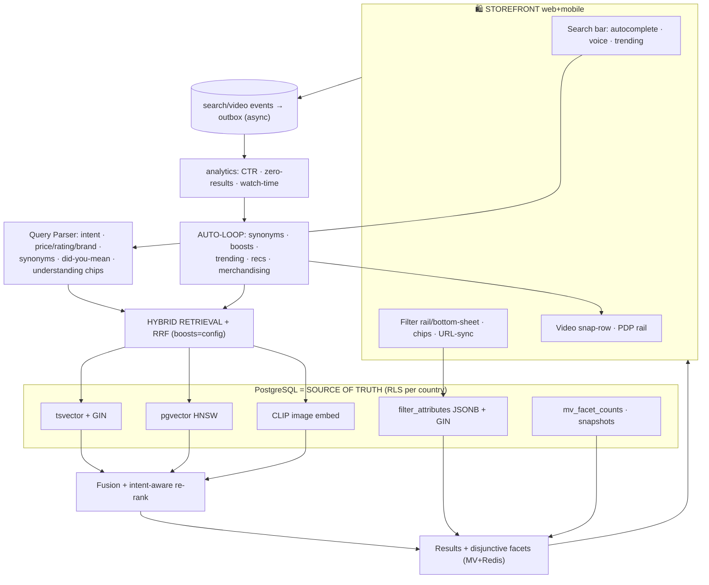

### 2.2 Video pipeline & recommendation circuit
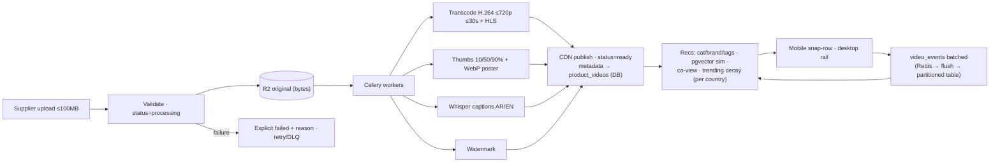

### 2.3 Video status lifecycle
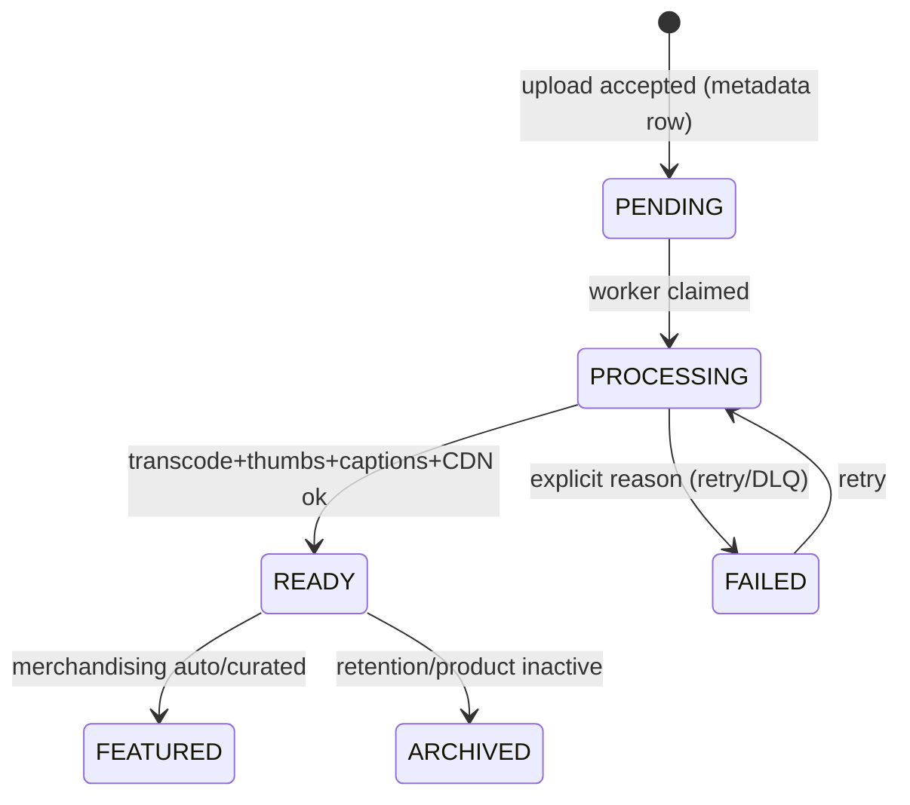

---

## 3. STEP-BY-STEP CONSTRUCTION

**Phase 0 — Schema & config.** Alembic (downgrade + contract tests): `product_filter_metadata/options`, `products.filter_attributes`+GIN, generated `search_vector`, `products.embedding vector`, `product_videos`, `video_events`+`search_events` (monthly partitions), config tables (synonyms, boosts, thresholds, facet defs); RLS on all; Redis keyspace plan. *Done when:* drift gate green; EXPLAIN shows index-only scans on hot facets.

**Phase 1 — Facet foundation.** Backfill `filter_attributes` from variants; build `mv_facet_counts` + cron + event invalidation; stampede-guarded cache. *Done when:* facet API < 50ms warm on 1M-product fixture.

**Phase 2 — Filter engine.** Service (disjunctive counts, JSONB apply, sorts) + endpoints + cursor pagination; URL-state sync. *Done when:* p95 < 300ms; multi-facet combo test green.

**Phase 3 — Hybrid search.** RRF fusion + parser + autocomplete + trending + did-you-mean + voice; explicit `mode:"lexical"` degradation; search events → outbox. *Done when:* zero-result rate baseline captured; fallback test shows explicit mode only.

**Phase 4 — AI enrichment & tuning loop.** Staging→commit enrichment; synonym mining; guarded boost tuner + A/B harness; audit every auto-change. *Done when:* nightly loop runs 7 clean nights with audit trail.

**Phase 5 — Video pipeline.** Upload validation → R2 → workers (transcode/HLS/thumbs/captions/watermark) → CDN → status; batched analytics; recommendation engine. *Done when:* upload→READY < 5 min; captions present on 100% of ready videos.

**Phase 6 — Storefront UI.** Filter rail/bottom-sheet + chips; search dropdown w/ understanding chips; video snap-row (mobile) + desktop rail; lazy-load, disable toggle, save-data fallback; RTL/AR; skeletons. *Done when:* Lighthouse ≥ target + 3G < 5s test passes on web + mobile apps.

**Phase 7 — Merchandising & SEO automation.** Banner scheduler, row re-rank, recently-viewed, cross-sell, JSON-LD/sitemaps. *Done when:* KPI watchdog dashboard live with all 12 automations reporting health.

**Phase 8 — Validate & close-out.** A/B (row vs sidebar vs hybrid), k6 load, accessibility + spam fixtures, E2E Playwright (search→filter→video→PDP→cart); update `CODEBASE_STATUS_MATRIX_DETAILED.md`. *Done when:* all success metrics (§1.5) instrumented and green.

---

## 4. UI/UX LAYOUT

### 4.1 PLP / Home (mobile-first hybrid)
```
MOBILE (<768px)                          DESKTOP (>1024px)
┌──────────────────────────┐   ┌───────────────┬──────────────────────────┬──────────────┐
│ Banner (auto-scheduled)  │   │ FILTER RAIL   │ Banner + Search + voice  │ RIGHT RAIL   │
│ Search + voice + chips   │   │ price hist    ├──────────────────────────┤ related vids │
│ [▶▶ VIDEO SNAP-ROW 1.5]  │   │ brands(counts)│ [▶▶ HORIZONTAL VIDEO ROW]│ recently seen│
│ Chips: under-100 × 4★ ×  │   │ attrs groups  ├──────────────────────────┤ cross-sell   │
│ 2-col grid · infinite    │   │ ≥4★ · in-stock│ PRODUCT GRID (cursor)    │              │
│ [Filters] bottom-sheet   │   │ clear-all     │                          │              │
└──────────────────────────┘   └───────────────┴──────────────────────────┴──────────────┘
```

### 4.2 Key screens
- **Search dropdown:** suggestions w/ thumbnails + trending tag; understanding chips ("under 100 OMR ×", "brand: Samsung ×"); did-you-mean banner; empty state = remove-filter suggestions + synonyms (never silent zero).
- **PDP:** gallery with video tab + captions; desktop right rail "You may also like (video)"; mobile row below fold; add-to-cart sticky; save-data → posters.
- **Supplier Video Studio:** upload w/ live validation; processing timeline (transcode→thumbs→captions→CDN); caption editor; thumbnail picker; analytics (views, watch-time, completion, attributed conversions); explicit failure cards w/ retry.
- **Admin Merchandising Console:** facet metadata manager (per-category rails, order, types); synonym/redirect manager w/ confidence slider; boost tuner + A/B dashboard; featured-video approval queue; trending controls; **KPI watchdog** vs targets (filter use >40% · search success >85% · video engage >60% · load <3s · 3G <5s) with auto-tickets on regression.
- **UX principles:** one muted autoplay; disable toggle persisted per user; captions default-on when sound off; skeletons + explicit stale badges; ARIA/keyboard; RTL-first Arabic; tabular price numerals; density toggle.

> **AI Directive:** build in Phase order; any live aggregate in a request path, any media byte in DB, any OFFSET on large tables, any sync counter UPDATE, or any silent search fallback violates this spec and Appendix A — STOP and ask.

# _____________________________________________________________________________________________ [ADVANCED FILTERS · AI SEARCH · VIDEO COMMERCE — MASTER BUILD SPEC]

# _____________________________________________________________________________________________ [ADMIN COMMAND CENTER]

## ZOZI UNIFIED OPERATIONS COMMAND CENTER — MASTER BUILD SPEC

> Binding addendum to `01_DATABASE.md` (analytics/audit/comms/country schemas → future `10_ANALYTICS.md` + `08_COUNTRY.md`). Inherits the constitution: **analytics never live-aggregate on request path (ADR-008 → 4-tier strategy), financial truth only from the double-entry ledger (ADR-006), RLS `country_code` everywhere, events via outbox (ADR-014), config-as-data, AI staged→commit, append-only audit, no silent fallbacks (explicit `degraded` flags), p95 < 300ms, cursor pagination, Alembic-only.**

### 0. Prime directives (from founder notes)
- **Merge Command Center + Analytics into ONE "Single Window"** — they currently replicate/complement each other; **read all existing dashboard/analytics code in detail before merging**; delete the duplicate page after cutover.
- **Dashboard ≠ Command Center:** *every employee* gets a **limited personal dashboard**; *Admin* gets the **full Command Center**; Admin may **grant Command Center access to others with limited, zone-scoped, country-scoped rights** (Maker-Checker for sensitive zones like Treasury/Fraud).
- Dynamic, modern, glanceable UI: one-glance organizational health; widgets over tables; traffic-light semantics; deep-link every number to its filtered workspace.

---

## 1. BULLET POINTS — EXTRACTED + ENHANCED

### 1.1 Access & visibility model
- Same URL for all; UI + data auto-shaped by **role layer (Global > Country > Hierarchy)** + RLS: CEO/Global Admin = aggregated global; Country Head = identical UI filtered to assigned countries (metrics, chats, escalations, roster); Employee = personal KPIs only.
- **Zone-level permission strings** (`cc.treasury.view`, `cc.fraud.view`, `cc.workforce.view`…) in the frozen permission catalog; assignment audited in `admin_change_audit_logs`; sensitive grants = Maker-Checker.
- **(ADDED) Data-freshness badge per widget** (tier + last-updated + `degraded` flag) — transparency, never fake-live.
- **(ADDED) Alert-fatigue control:** dedupe/aggregate repeats; quiet-hours per tier (Tier-3 always breaks through).

### 1.2 Metric inventory → 4-Tier data strategy
| Zone / Metrics | Tier |
|---|---|
| **Z1 Heartbeat:** today's orders/GMV/revenue, active users (buying vs window-shopping: session + >3 views + no cart 10min), live fleet (companies vs individuals, active shipments, delayed, failed), employees working, system issues | **T1** WS/Redis PubSub 2–5s (`/ws/admin/telemetry`) |
| **Z2 Treasury:** available/locked/operating cash, supplier & logistics payables, refund reserve, VAT liability (+remittance countdown), commission reserve, pending payouts, refunds, disputes | **T3** instant SQL on `account_balances` (1010/2010/2020/2040…) — *never order sums* |
| **Z3 Growth:** revenue trend 30d, country-wise sales map, category/product trends, top searches + zero-results, gender split, signups, CLV **(ADDED)**, cash-runway forecast **(ADDED)** | **T2** Redis 5-min cron + **T4** nightly MVs (`daily_trend_aggregates`) |
| **Z4 Workforce/Ops:** on-duty roster (QR/geo), performance tickers (tickets/hr, moderation approve-rate, payouts processed), bottlenecks (KYC pending, moderation queue, stuck orders, returns), shift handovers, grievances | **T1+T2** |
| **Z5 External Intel:** Market Radar news ticker, regulatory shield (ZATCA/PDPL/VAT countdowns), FX ticker + margin alerts, supply-chain alerts, competitor price index, sentiment/NPS pulse, PR crisis radar | **T2** + news pipeline |
| **Z6 Engine Room & Fraud:** API p95/p99, error rate, CPU/mem, DB conns/replication lag/disk, Redis hit/eviction, gateway success heatmap (auto-reroute <85%), CDN health by region, live attack map, chargeback velocity (>1% critical), ATO radar (reset spikes, supplier bank-change) | **T1** Prometheus/Grafana/Loki embed + fraud engine |
- Partner health MVs: `supplier_health_scores` (cancellation/return/KYC-expiry), `logistics_sla_alerts`. New tracking tables: `search_logs`, `user_sessions`, `system_health_events`.

### 1.3 Human Operations layer (the "active cockpit")
- **Broadcasts:** Global (Admin) vs Local (Country Head) color-coded dismissible banners; read-confirmation tracking **(ADDED)**.
- **Shift handover logs:** mandatory end-of-shift digital sign-off (unresolved criticals, pending approvals, glitches); incoming shift must acknowledge; **(ADDED) block clock-out until filed** (ties to EMS handover gate).
- **Escalation Siren:** Tier-1 Country Manager (2h ack timer) → Tier-2 Country Head/Finance (in-alert Approve/Block) → Tier-3 Admin/CTO (SMS/email fallback + red flash); every ack/action → append-only audit ("alert 14:00, acked 14:05, no action").
- **War-Room chat:** entity-attached threads (click "Failed Deliveries" → the exact chat about that batch); @mentions deep-link to the exact screen with action button ready; auto-translate AR↔EN.
- **Safe Box:** supplier grievances vs staff + anonymous whistleblower channel → visible **only** Global Admin/Compliance (bypasses local heads); SLA-penalty tracker requiring Admin sign-off.
- **(ADDED) Follow-the-sun handoff view:** auto-highlights which country shift is handing over now.

### 1.4 News & Market Intelligence pipeline
- `news_sources` (name, url, type `rss|api|scrape`, category `market|logistics|regulatory|ecommerce|internal`, `target_audience admin_only|supplier|public`, fetch_interval, is_active, api_key_required) + `news_articles` (external_id, **SHA256 content_hash dedupe**, title/summary/content, url, image_url, published/fetched_at, country_code nullable, `ai_sentiment`, `ai_tags` JSONB, `is_published`).
- Async fetchers (feedparser/httpx/newspaper3k) on 15-min cron with per-source `last_fetched` in Redis; sanitize (strip HTML/trackers, UTC normalize); **AI enrichment staged**: entity→country/module map, sentiment, relevance score **<40 discarded**; PubSub → WS ticker; audience routing: Admin Market Radar / Supplier Insights / Public SEO blog; moderation queue + `flush-now` + publish toggle; auto-publish only ≥ confidence threshold **(ADDED, ADR-007)**.
- **Regulatory Shield:** ZATCA Phase-2 e-invoicing success ticker, PDPL/GDPR audit countdown + encryption %, VAT filing countdowns **linked to ledger `2040`**; T-7/T-3/T-1 alerts **(ADDED)**.
- **What-If Simulation Engine:** commission/SLA/promo-ROI simulators read **snapshots only**, outputs labeled "projection — not truth", never write to ledger **(ADDED guardrail)**; launched via Ctrl+K.

### 1.5 Decision Engine & monitoring
- Anomaly rules (config-driven): delayed >5% active → red; zero-search spike → "Alert Procurement" + stock check; VAT > threshold + due ≤4d → "Generate Tax Report"; gateway <85% → auto-reroute + badge; every alert carries a **deep-link action button** into the pre-filtered workspace.
- Monitoring embed (Zone 6): app p95/p99, error rate, CPU/mem; DB conns/slow-query/replication-lag/disk; Redis mem/hit/eviction; business (orders/hr, conversion, signups); alerts: error >1%, resp >3s, CPU >80%, disk >85%, gateway fail >5%.

### 1.6 Country Control Plane (integrated, not siloed)
- Normalized schema: split `country_configs` → basics/economics/tax/legal + `country_cities`, `country_category_tax_rates`, `country_config_versions` (draft→approve→publish→rollback), `country_feature_flags`, `country_staff_assignments`.
- **Heuristic Orchestrator:** RestCountries/WorldBank/GeoDB/Nager.Date fetchers, 48h Redis cache, **explicit `degraded` flags** (Rule #16); gateway ranking 0–100; commission-tier generator; KYC-tier auto-assign; logistics model recommender; restricted-category auto-tag; **source-transparency badges** in UI.
- **Ghost-Row Ledger UI** (no modals): inline expandable create row, 600ms debounced auto-map search, 17-tab workspace, inline editors within algorithmic bounds, masked keys + "Test Connection".
- **Downstream auto-wiring:** checkout gateways, supplier KYC fields, moderation blocks, payout holds/minimums, ETA holiday-skip — all read country config live (no deploys).
- Cross-border detection (`cross_country_customer_records`), dynamic currency/tax swap, deep localization (Eastern Arabic numerals, Hijri, RTL logical CSS, dynamic address builder); draft-to-publish safety net; localized legal PDF generation; immutable financial edit audit with mandatory reason; data-residency KMS + export redaction; geospatial maps (cities, shops/warehouses, partner GPS, parcel tracking).

### 1.7 🤖 AUTOMATION SYSTEM (detail — the core ask)
| # | Automation | Trigger | Auto action | Exception path |
|---|---|---|---|---|
| 1 | **Metric aggregation** | crons 5min + nightly | T2 Redis JSON + T4 MV refresh; drift vs T3 ledger checked | variance alert |
| 2 | **Live telemetry push** | outbox events | PubSub → WS heartbeat increments | explicit stale badge on lag |
| 3 | **Escalation engine** | alert raise | tier timers → auto-escalate → SMS/email T3; ack audit | missed-SLA → performance flag |
| 4 | **News flush & enrich** | 15-min cron | fetch→dedupe→sanitize→AI tag/sentiment→route by audience | moderation queue; `degraded` source badge |
| 5 | **Gateway health & reroute** | webhook stream | per-country success heatmap; <85% auto-reroute + banner | manual freeze button |
| 6 | **Fraud watch** | event stream | attack map, chargeback >1% critical, ATO radar (bank-change) | Tier-2/3 queue |
| 7 | **Decision-engine anomalies** | rules cron | deep-link action cards (procurement, tax report, SLA breach) | dismiss-with-reason logged |
| 8 | **Handover enforcement** | shift end | block clock-out till log filed; incoming ack required | manager override logged |
| 9 | **Broadcast targeting** | publish | global/local routing + read-confirm tracking | non-readers → reminder ping |
| 10 | **Regulatory countdowns** | daily | VAT from ledger; ZATCA/PDPL timers T-7/3/1 | compliance queue |
| 11 | **Sentiment & PR radar** | scrape cron | sentiment score, NPS pulse, viral-traction alert | PR queue |
| 12 | **What-If sims** | Ctrl+K request | snapshot-only projection models | labeled "not truth" |
| 13 | **Auto digests** | daily 07:00 **(ADDED)** | CEO briefing assembled from zones → email/chat; country digests | — |
| 14 | **Dashboard personalization** | role login **(ADDED)** | zone/widget layout per role; saved layouts; compare-mode (today vs yesterday) | admin-published defaults |
| 15 | **Country orchestrator** | new-country search | auto-map heuristics → **draft** → publish approval | degraded flags per source |
| 16 | **KPI watchdog** | hourly | targets vs actuals (load <500ms, alert MTTA, ack SLA) → auto-tickets | regression alerts |

---

## 2. DIAGRAMS

### 2.1 Single-Window data architecture (4 tiers → zones → actions)
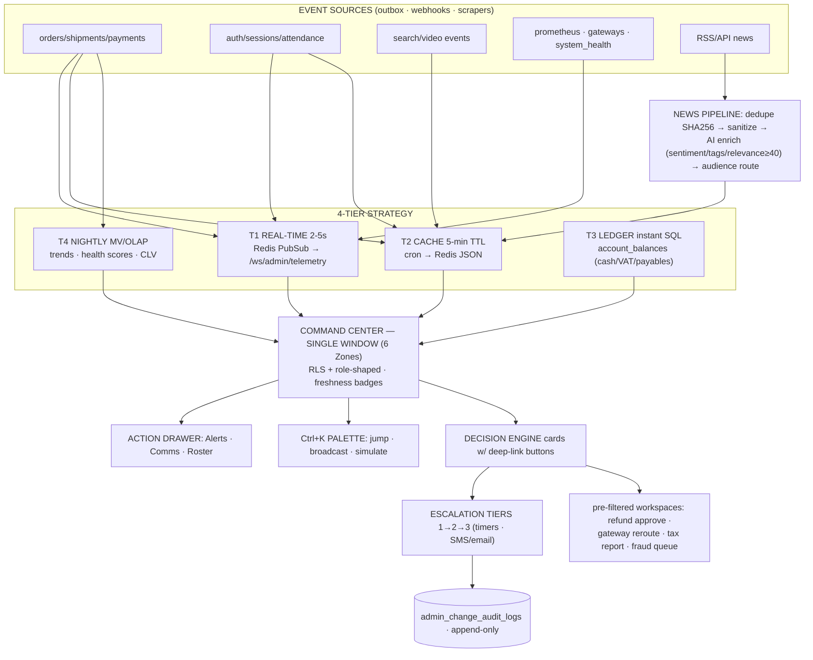

### 2.2 Escalation lifecycle
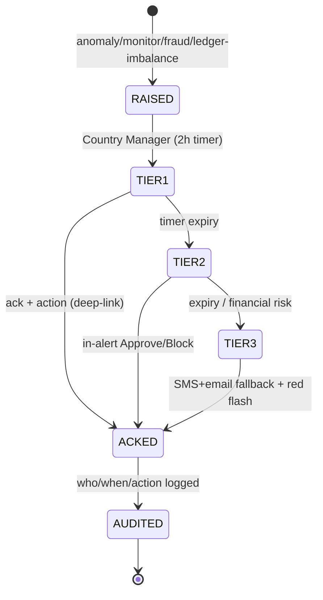

### 2.3 News → surfaces routing
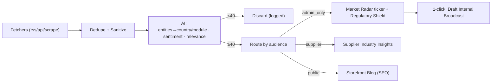

---

## 3. STEP-BY-STEP CONSTRUCTION

**Phase 0 — Audit & freeze.** Read *all* existing Command Center/Dashboard/Analytics code; map duplicates; define unified zone taxonomy + widget catalog; freeze permission strings (`cc.*`) + alert thresholds in config tables. *Done when:* duplicate-feature map signed off; old routes listed for deletion.

**Phase 1 — Schema & MVs.** Alembic (downgrade + contract tests): `search_logs`, `user_sessions`, `system_health_events`, `news_sources/articles`, `escalations`, `broadcasts(+read_confirms)`, `shift_handover_logs`, `grievances`; MVs `supplier_health_scores`, `logistics_sla_alerts`, `daily_trend_aggregates`; RLS + indexes on all. *Done when:* drift gate green.

**Phase 2 — Tier services.** Cron cache jobs (T2) + WS telemetry channel (T1) hooked to order/shipment/auth events; T3 ledger reader; gateway-health monitor + reroute hook; freshness/degraded metadata on every payload. *Done when:* dashboard API < 500ms with 50+ metrics; zero raw-table aggregates in request path.

**Phase 3 — Unified frontend.** Build 6-zone Single Window + Action Drawer + Ctrl+K; role variants (employee-limited / country-filtered / global); **delete old Analytics page**; skeletons, traffic-lights, sparklines, compare-mode, annotations **(ADDED)**, RTL/AR. *Done when:* Playwright E2E on all three role views; Lighthouse green.

**Phase 4 — Human Ops.** Broadcasts + read-confirm; handover enforcement; escalation matrix with timers + audit; entity-attached war-room chat + translate; Safe Box; penalty tracker. *Done when:* unacked Tier-1 auto-escalates in test; every ack audited.

**Phase 5 — News & Shield.** Ingestion workers + dedupe + AI enrichment + routing; Market Radar ticker; Regulatory countdowns wired to ledger VAT; moderation queue + flush-now. *Done when:* 7 clean cron nights; duplicate wire stories deduped 100%.

**Phase 6 — Engine Room & Fraud.** Prometheus/Grafana/Loki embeds; attack map; chargeback/ATO alerts; CDN-by-region health. *Done when:* all 5 infra alert rules fire correctly in chaos test.

**Phase 7 — Decision & Simulation.** Anomaly rule engine + deep-link action cards; What-If simulators (snapshot-only, labeled projections). *Done when:* each card lands on the pre-filtered workspace with action ready.

**Phase 8 — Country Plane wiring.** Ghost-row + 17-tab workspace; orchestrator with degraded flags; downstream syncs (checkout/KYC/moderation/payouts/ETA); localization + residency + legal PDFs; geospatial maps. *Done when:* adding a country changes checkout/KYC/payout behavior with zero deploys.

**Phase 9 — Watchdog, digests & hardening.** KPI watchdog + auto-tickets; daily auto-digests; alert-fatigue controls; load test (k6) on dashboard; security (RLS fail-closed per zone). *Done when:* MTTA/ack-SLA baselines met.

**Phase 10 — Close-out.** Full E2E (CEO/CountryHead/Employee views), heuristics Pytest, schema-drift gate, update `CODEBASE_STATUS_MATRIX_DETAILED.md`. *Done when:* old duplicate pages removed and matrix green.

---

## 4. UI/UX LAYOUT — THE SINGLE WINDOW

```
┌──────────────────────────────────────────────────────────────────────────────┐
│ TOPBAR: [Ctrl+K palette] [country ctx ▼] [ tier-badged] [broadcast ▾]      │
│ [BANNER: global/local notices — color-coded, dismissible, read-tracked]      │
├───────────────────────────────────────────────────────────────┬──────────────┤
│ Z1 HEARTBEAT (live): Orders·GMV·Rev·Buying-vs-Window·Fleet map │ ACTION       │
│ Z2 TREASURY: cash waterfall·liability dials·VAT countdown·     │ DRAWER       │
│    gateway heatmap            │ Z3 GROWTH: country map·trends· │ [Alerts▸timers]│
│                                │  intent radar·gender·CLV       │ [Comms▸war-room]│
│ Z4 WORKFORCE: roster·tickers·bottlenecks·handover·safe-box     │ [Roster▸perf]│
│ Z5 INTEL: Market Radar ticker·Regulatory Shield·FX·sentiment   │              │
│ Z6 ENGINE ROOM: traffic-lights·infra·attack map·chargeback     │              │
└───────────────────────────────────────────────────────────────┴──────────────┘
```
- **Role variants:** Employee = personal KPIs + team roster + announcements only; Country Head = full zones, country-filtered, no global Treasury/Fraud unless granted; Admin/CEO = global + grant management.
- **Widget grammar:** every card = value + spark/dial + traffic-light + freshness badge + click→filtered workspace; skeletons on load; explicit stale/degraded badges; compare toggle; admin-pinnable annotations ("Ramadan sale start").
- **Palette examples:** "Show Gateway Health KSA", "Simulate 2% commission drop", "Broadcast maintenance OM", "Pending KYC Saudi".
- **Mobile:** condensed heartbeat + tier-3 alerts + drawer; push digests; tap→deep-link.
- **Principles:** glance-first (no 30-query page loads), action-over-observation (every alert has a button), audit-everything, RTL-first Arabic, ARIA/keyboard, density toggle.

> **AI Directive:** implement in Phase order; any dashboard query that live-aggregates transactional tables, any financial widget not sourced from the ledger, any cross-country leak, any un-audited alert/ack, or any silent degraded path violates this spec and Appendix A — STOP and ask.

# _____________________________________________________________________________________________ [ADMIN COMMAND CENTER]

# _____________________________________________________________________________________________ [Country Intelligence & Auto-Research Feature 🎗️ ]

## Country Intelligence & Auto-Research Feature

Status: Design Reference
Scope: A single-page "Country Dynamics" feature that automatically researches any country in the world from the internet and presents a complete, e-commerce-ready intelligence profile — currency, tax, payments, logistics, consumer behavior, competition, risk, and AI-generated strategy — that can later be fed into the Country Onboarding workflow (see companion document: `COUNTRY_ADMIN_ONBOARDING_SYSTEM.md`).

---

## 1) Overview

This feature lets a non-technical operator type any country name (e.g. "India", "Brazil", "Nigeria") and instantly receive a comprehensive, structured research report covering 20 modules of market intelligence. It is built on a **100% free tech stack**: live public APIs, web search, news RSS, and an optional local open-source LLM for qualitative deep research.

It is the **"understanding" side of the coin**. The companion document covers the **"operating" side** — turning that understanding into a live, configurable country inside the platform.

### Why this exists
Rapid expansion means we will evaluate many countries quickly. Before committing engineering effort to launch a country, we need a fast, repeatable way to answer:
- Is this market worth entering?
- What tax, payment, and logistics model does it require?
- What do consumers expect (COD, wallets, free shipping, languages)?
- What are the legal, fraud, and competitive risks?
- What product mix and entry strategy should we use?

This feature answers all of that from one input field, with free data sources and confidence/verification flags on every uncertain data point.

---

## 2) How It Works (End-to-End Flow)

1. **Input:** Operator enters a country name in the Country Intelligence page (single search field).
2. **Resolve basics:** `REST Countries API` returns official name, ISO codes, capital, currency, languages, calling code, region, flag, coordinates.
3. **Enrich economy:** `World Bank Open Data API` returns latest available GDP, GDP per capita (PPP), inflation, unemployment, literacy, internet users %, urbanization, Gini, etc.
4. **Enrich exchange rate:** `Frankfurter (ECB)` with `open.er-api.com` fallback for live USD conversion.
5. **Enrich cities:** `GeoNames` (free account) preferred; `CountriesNow API` fallback; capital city final fallback.
6. **Context summary:** `Wikipedia API` returns a country overview extract.
7. **Current news:** `Google News RSS` filtered to economy/ecommerce/tax/consumer/payments for the last 24 hours.
8. **Web evidence (optional):** `DuckDuckGo` search surfaces current-year tax, payment-gateway, and regulatory details.
9. **Deep qualitative research (optional):** A local `Ollama` LLM (e.g. `llama3.1` / `llama3.2:3b`) writes the narrative modules — psychology, mindset, community behavior, gateway landscape, regulations, marketing channels, strategic recommendations.
10. **Confidence tagging:** Every qualitative field is returned with `confidence` (`high|medium|low`), `verification_notes`, and `sources` so the system can flag uncertain data for official verification.
11. **Output:**
    - **JSON report** for system integration (country config seeding).
    - **Markdown report** for human reading.
    - **Single-page dashboard** with stat cards, charts, timelines, alerts, and map overlays.

> Important: "Latest" is handled as much as technically possible (live APIs, news RSS, current-year web evidence, latest World Bank data). But tax, law, payment gateways, and regulations change quickly — hence the `confidence`, `verification_notes`, and `sources` fields.

If Ollama is not installed, the script still works: it collects facts, economic data, news, and web evidence, but marks deep qualitative modules as needing AI or manual review.

---

## 3) Free Data Source Stack

| Purpose | Free Source |
|---------|-------------|
| Country basics, currency, language, country code | REST Countries API |
| Latest economic indicators | World Bank Open Data API |
| Latest exchange rates | Frankfurter ECB API + open.er-api fallback |
| Cities | CountriesNow API + optional GeoNames free account |
| Country summary/context | Wikipedia API |
| Latest news of the day | Google News RSS |
| Latest web evidence for tax, payments, rules, behavior | DuckDuckGo search (optional, free) |
| Deep qualitative research (psychology, mindset, gateways, regulations, strategy) | Local free Ollama LLM, no paid key |

Setup:
- `pip install requests duckduckgo-search`
- Optional GeoNames: create free account, set `GEONAMES_USERNAME`.
- Optional Ollama: install from ollama.com, `ollama pull llama3.1` (or `llama3.2:3b` for low RAM).

---

## 4) The 20-Module Intelligence Framework

Every country report is structured into 20 modules. Each module lists the specific data points collected, an e-commerce example, and the recommended presentation format. Below is the full master blueprint.

### 🗂️ MODULE 1: COUNTRY IDENTITY & BASICS

| # | Data Point | Example | Presentation |
|---|-----------|---------|--------------|
| 1.1 | Official Country Name | Republic of India | Header / Title |
| 1.2 | Common/Short Name | India | Searchable tag |
| 1.3 | Country Code (ISO Alpha-2) | IN | Badge/Chip |
| 1.4 | Country Code (ISO Alpha-3) | IND | Badge/Chip |
| 1.5 | Numeric Code | 356 | Hidden field |
| 1.6 | Capital City | New Delhi | Info card |
| 1.7 | Flag (Emoji + Image URL) | 🇮🇳 | Icon |
| 1.8 | Region / Continent | Asia > Southern Asia | Breadcrumb |
| 1.9 | Total Area (km²) | 3,287,263 | Stat card |
| 1.10 | Time Zones | UTC+5:30 | Dropdown selector |
| 1.11 | Calling Code | +91 | Input prefix |
| 1.12 | Google Maps Link | URL | Button |
| 1.13 | Government Type | Federal Parliamentary Republic | Tag |
| 1.14 | Independence / Founding Year | 1947 | Timeline |

---

### 🗂️ MODULE 2: DEMOGRAPHICS & POPULATION

| # | Data Point | Example | Presentation |
|---|-----------|---------|--------------|
| 2.1 | Total Population | 1.44 Billion | Big stat card |
| 2.2 | Population Growth Rate | 0.8% / year | Trend arrow ↑↓ |
| 2.3 | Median Age | 28.7 years | Gauge chart |
| 2.4 | Age Distribution (0-14, 15-64, 65+) | 25%, 68%, 7% | Pie chart |
| 2.5 | Urban vs Rural Split | 35% Urban / 65% Rural | Donut chart |
| 2.6 | Gender Ratio | 1.08 M : 1 F | Bar chart |
| 2.7 | Literacy Rate | 77.7% | Progress bar |
| 2.8 | Top 10 Cities (by population) | Mumbai, Delhi, Bangalore... | Ranked table |
| 2.9 | Top 5 E-commerce Ready Cities | Bangalore, Mumbai, Delhi, Hyderabad, Pune | Highlighted cards with reasoning |
| 2.10 | Ethnic / Racial Composition | Diverse, 2000+ ethnic groups | Tag cloud |
| 2.11 | Religious Composition | Hindu 79%, Muslim 14%, etc. | Pie chart |
| 2.12 | Expatriate / Foreign Worker % | 0.5% | Stat card |

---

### 🗂️ MODULE 3: ECONOMY & WEALTH

| # | Data Point | Example | Presentation |
|---|-----------|---------|--------------|
| 3.1 | GDP (Nominal) | $3.94 Trillion | Stat card |
| 3.2 | GDP Per Capita (PPP) | $9,183 | Stat card |
| 3.3 | GDP Growth Rate | 6.5% | Trend line |
| 3.4 | Inflation Rate | 5.1% | Warning indicator |
| 3.5 | Unemployment Rate | 7.2% | Gauge |
| 3.6 | Income Distribution (Gini Coefficient) | 35.7 | Scale bar |
| 3.7 | Middle Class Size (% of pop) | ~30% (400M people) | Highlighted stat |
| 3.8 | Average Monthly Salary | $600 USD | Stat card |
| 3.9 | Average Disposable Income | $250-$400/month | Range slider visual |
| 3.10 | Poverty Rate | 10.5% | Alert badge |
| 3.11 | Wealth Tiers Breakdown | Ultra-rich 1%, Upper-middle 10%, Middle 30%, Lower 59% | Stacked bar |
| 3.12 | Currency Name | Indian Rupee | Text |
| 3.13 | Currency Code (ISO) | INR | Badge |
| 3.14 | Currency Symbol | ₹ | Icon |
| 3.15 | Exchange Rate (vs USD) | 1 USD = 83.2 INR | Live ticker |
| 3.16 | Currency Stability (1yr trend) | Depreciating ~3%/yr | Sparkline |
| 3.17 | Foreign Exchange Controls | Partial restrictions | Alert tag |

---

### 🗂️ MODULE 4: TAX SYSTEM & DUTIES

| # | Data Point | Example | Presentation |
|---|-----------|---------|--------------|
| 4.1 | Tax System Type | GST (Goods & Services Tax) | Tag |
| 4.2 | Standard Tax Rate | 18% | Big stat |
| 4.3 | Tax Slabs / Tiers | 0%, 5%, 12%, 18%, 28% | Tiered table |
| 4.4 | Tax on Digital Goods | 18% | Info card |
| 4.5 | Tax on Physical Goods | 5%-28% (category-based) | Category table |
| 4.6 | Import / Customs Duty | 10%-30% (varies by HS code) | Range table |
| 4.7 | Customs Threshold (De Minimis) | ₹50,000 (~$600) | Alert box |
| 4.8 | Who Pays Duty? (DDP vs DDU) | Customer pays at door (DDU common) | Flow diagram |
| 4.9 | Tax Registration Requirement | GSTIN needed for >₹40L turnover | Checklist |
| 4.10 | Foreign Company Tax Obligation | Need local entity or agent | Alert box |
| 4.11 | Withholding Tax on Cross-border | 10%-20% | Info card |
| 4.12 | Tax Filing Frequency | Monthly / Quarterly | Calendar icon |
| 4.13 | Tax Authority Name | Central Board of Direct Taxes (CBDT) | Link |
| 4.14 | Free Trade Agreements | ASEAN, SAFTA, bilateral deals | Tag list |

---

### 🗂️ MODULE 5: CONSUMER PSYCHOLOGY & MINDSET

| # | Data Point | Example | Presentation |
|---|-----------|---------|--------------|
| 5.1 | General Mindset Toward Online Shopping | "Trust but verify" – growing but cautious | Narrative card |
| 5.2 | Price Sensitivity Level | HIGH (8/10) | Rating scale |
| 5.3 | Brand Loyalty Level | MEDIUM – switch for discounts | Rating scale |
| 5.4 | Status / Prestige Buying | YES – luxury brands signal success | Tag |
| 5.5 | Family Influence on Purchases | VERY HIGH – joint family decisions | Rating scale |
| 5.6 | Peer / Social Proof Influence | HIGH – reviews & word-of-mouth critical | Rating scale |
| 5.7 | FOMO (Fear of Missing Out) Factor | HIGH during sales events | Rating scale |
| 5.8 | Trust in Foreign Brands | MEDIUM – prefer known global names | Gauge |
| 5.9 | Trust in New/Unknown Brands | LOW – need heavy social proof | Gauge |
| 5.10 | Bargaining / Negotiation Culture | YES – expect discounts, coupons | Tag |
| 5.11 | Impulse vs Planned Buying Ratio | 40% impulse / 60% planned | Pie chart |
| 5.12 | Research Before Purchase | HIGH – compare 3-5 sites before buying | Info card |
| 5.13 | Emotional vs Rational Buying | 60% emotional / 40% rational | Split bar |
| 5.14 | Attitude Toward "Made in [Country]" | Patriotic buying trend (e.g., "Make in India") | Tag |
| 5.15 | Generational Differences | Gen-Z: digital-first; 40+: prefer COD | Comparison table |

---

### 🗂️ MODULE 6: CONSUMPTION PREFERENCES

| # | Data Point | Example | Presentation |
|---|-----------|---------|--------------|
| 6.1 | Top 10 Product Categories (by demand) | Electronics, Fashion, Grocery, Beauty... | Ranked list |
| 6.2 | Average Order Value (AOV) | $25-$45 | Stat card |
| 6.3 | Quality vs Price Priority | Price-first for mass; Quality for premium | Split view |
| 6.4 | Sustainability / Eco-consciousness | LOW-MEDIUM (growing in metros) | Gauge |
| 6.5 | Preference for Local vs International | Mixed – local for food, intl for tech | Comparison |
| 6.6 | Size / Fit Preferences | Specific to body types, modest wear in some regions | Info card |
| 6.7 | Color / Design Preferences | Bright colors, gold accents, cultural motifs | Visual palette |
| 6.8 | Packaging Expectations | Gift wrapping important during festivals | Tag |
| 6.9 | Subscription / Repeat Purchase Rate | LOW – prefer one-time buys | Stat |
| 6.10 | Bulk / Wholesale Buying Culture | HIGH – family-size packs preferred | Tag |
| 6.11 | Seasonal Product Demand | Winter wear (North), AC/fans (South), etc. | Calendar heatmap |
| 6.12 | Halal / Kosher / Vegetarian Requirements | 30%+ vegetarian; Halal important for Muslim segment | Alert tags |
| 6.13 | Prohibited / Restricted Products | Alcohol banned in some states; beef restrictions | Red alert box |

---

### 🗂️ MODULE 7: SHOPPING SEASONALITY & EVENTS

| # | Data Point | Example | Presentation |
|---|-----------|---------|--------------|
| 7.1 | Major Shopping Festivals | Diwali, Holi, Eid, Christmas | Calendar timeline |
| 7.2 | E-commerce Specific Sales Events | Big Billion Days (Flipkart), Great Indian Festival (Amazon) | Highlighted cards |
| 7.3 | Global Sales Events Participation | Black Friday, Cyber Monday, 11.11 | Tags |
| 7.4 | Payday Shopping Cycles | 1st-5th of month (salary week) | Recurring highlight |
| 7.5 | Wedding Season Impact | Oct-Feb: massive gold, clothing, gift demand | Seasonal banner |
| 7.6 | Back-to-School Season | April-June (varies by state) | Calendar tag |
| 7.7 | Religious Fasting Periods | Ramadan, Navratri – altered buying patterns | Alert |
| 7.8 | Monsoon / Weather Impact | Jun-Sep: indoor shopping spikes, logistics delays | Weather icon |
| 7.9 | Peak Shopping Hours | 8 PM - 12 AM (post-work browsing) | Clock visual |
| 7.10 | Peak Shopping Days | Weekends, Sunday highest | Bar chart |

---

### 🗂️ MODULE 8: DIGITAL LANDSCAPE & INTERNET

| # | Data Point | Example | Presentation |
|---|-----------|---------|--------------|
| 8.1 | Internet Penetration Rate | 52% (750M+ users) | Progress bar |
| 8.2 | Mobile vs Desktop Split | 85% Mobile / 15% Desktop | Donut chart |
| 8.3 | Average Internet Speed | 60 Mbps (mobile) | Gauge |
| 8.4 | Smartphone Penetration | 45%+ and growing | Stat card |
| 8.5 | Dominant OS (Android vs iOS) | Android 95% / iOS 5% | Pie chart |
| 8.6 | Top Social Media Platforms | YouTube, WhatsApp, Instagram, Facebook | Ranked icons |
| 8.7 | Social Media Usage (hrs/day) | 2.5 hours average | Stat card |
| 8.8 | E-commerce App Preferences | Flipkart, Amazon, Meesho, Myntra | Ranked list |
| 8.9 | Search Engine Preference | Google 98% | Stat |
| 8.10 | Email Open / Engagement Rate | LOW – WhatsApp preferred for communication | Alert |
| 8.11 | Video Commerce / Live Shopping | Growing – YouTube, Instagram Live | Trend tag |
| 8.12 | AI / Chatbot Acceptance | MEDIUM – prefer human support | Gauge |

---

### 🗂️ MODULE 9: PAYMENT INFRASTRUCTURE

| # | Data Point | Example | Presentation |
|---|-----------|---------|--------------|
| 9.1 | Most Popular Payment Method | UPI (Unified Payments Interface) | #1 Highlighted card |
| 9.2 | Top 5 Payment Gateways | Razorpay, PayU, CCAvenue, PhonePe, Paytm | Ranked list |
| 9.3 | Credit/Debit Card Penetration | 35% of adults | Stat card |
| 9.4 | Digital Wallet Usage | PhonePe, Google Pay, Paytm – VERY HIGH | Tag cloud |
| 9.5 | Cash on Delivery (COD) % | 40-50% of e-commerce orders | Big alert stat |
| 9.6 | Bank Transfer / Net Banking | 15% of transactions | Stat |
| 9.7 | Buy Now Pay Later (BNPL) | Growing – Simpl, LazyPay, Amazon Pay Later | Trend tag |
| 9.8 | EMI / Installment Culture | VERY HIGH – "No Cost EMI" expected | Highlighted |
| 9.9 | International Card Acceptance | Visa, Mastercard accepted; Amex limited | Tag list |
| 9.10 | Cryptocurrency Status | Banned / Restricted / Taxed | Alert badge |
| 9.11 | Average Transaction Value | $15-$30 online | Stat card |
| 9.12 | Payment Failure Rate | 5-8% (UPI much lower) | Warning indicator |
| 9.13 | Refund Processing Time | 5-7 business days expected | Info card |
| 9.14 | Currency Conversion Fees | 2-3.5% on international cards | Info card |

---

### 🗂️ MODULE 10: LOGISTICS & SHIPPING

| # | Data Point | Example | Presentation |
|---|-----------|---------|--------------|
| 10.1 | Top Courier / Logistics Companies | Delhivery, BlueDart, DTDC, India Post | Ranked list |
| 10.2 | Average Delivery Time (Metro) | 1-3 days | Stat card |
| 10.3 | Average Delivery Time (Rural) | 5-10 days | Stat card |
| 10.4 | Shipping Cost Expectation | FREE shipping expected (subsidized) | Alert |
| 10.5 | Free Shipping Threshold | Orders above ₹499-₹999 | Info card |
| 10.6 | Same-Day / Next-Day Availability | Metro cities only | Tag |
| 10.7 | Last-Mile Delivery Quality | MEDIUM – address issues in rural areas | Gauge |
| 10.8 | Package Tracking Expectation | MANDATORY – real-time tracking expected | Alert |
| 10.9 | COD Availability by Region | Urban: Yes; Remote: Limited | Map overlay |
| 10.10 | Return Pickup Service | Expected – doorstep pickup for returns | Info card |
| 10.11 | Customs Clearance Time (Imports) | 3-7 days | Stat card |
| 10.12 | Warehousing Hubs | Mumbai, Delhi NCR, Bangalore, Hyderabad | Map pins |
| 10.13 | Packaging Regulations | Plastic ban in some states; eco-packaging push | Alert |

---

### 🗂️ MODULE 11: LEGAL, RULES & REGULATIONS

| # | Data Point | Example | Presentation |
|---|-----------|---------|--------------|
| 11.1 | E-commerce Registration Requirement | FDI rules, local entity needed for marketplace | Checklist |
| 11.2 | Consumer Protection Law | Consumer Protection Act 2019 | Info card |
| 11.3 | Mandatory Return/Refund Window | 7-10 days (platform dependent) | Stat card |
| 11.4 | Data Privacy Law | Digital Personal Data Protection Act (DPDP) 2023 | Alert card |
| 11.5 | Data Localization Requirement | Critical data must stay in-country | Red alert |
| 11.6 | Cookie / Tracking Consent Rules | Consent-based (similar to GDPR) | Info card |
| 11.7 | Advertising Standards / Restrictions | No misleading claims; ASCI guidelines | Checklist |
| 11.8 | Product Labeling Requirements | MRP, manufacturing date, FSSAI (food), BIS (electronics) | Checklist |
| 11.9 | Prohibited / Restricted Items for Sale | Alcohol, tobacco, weapons, certain drugs | Red alert box |
| 11.10 | Intellectual Property / Trademark Laws | Trademark Act 1999; strict on counterfeits | Info card |
| 11.11 | Anti-Trust / Competition Law | Competition Act 2002 – no predatory pricing | Alert |
| 11.12 | GST Invoice Requirements | Mandatory GSTIN on all invoices | Checklist |
| 11.13 | Foreign Exchange Regulations (FEMA) | RBI guidelines on cross-border payments | Alert |
| 11.14 | Age Verification Requirements | 18+ for certain products (alcohol, tobacco) | Tag |
| 11.15 | Environmental / E-Waste Regulations | E-waste management rules apply to electronics | Info card |

---

### 🗂️ MODULE 12: LANGUAGE & COMMUNICATION

| # | Data Point | Example | Presentation |
|---|-----------|---------|--------------|
| 12.1 | Official Language(s) | Hindi, English | Tag badges |
| 12.2 | Regional / State Languages | Tamil, Telugu, Bengali, Marathi, etc. (22 scheduled) | Expandable list |
| 12.3 | Primary E-commerce Language | English + Hindi (Hinglish) | Highlighted |
| 12.4 | Localization Requirement | Product descriptions in 5+ languages for reach | Checklist |
| 12.5 | Script / Writing System | Devanagari, Tamil, Bengali scripts | Visual samples |
| 12.6 | Number / Date Format | DD/MM/YYYY; Indian numbering (Lakh, Crore) | Info card |
| 12.7 | Measurement System | Metric (kg, cm, liters) | Tag |
| 12.8 | Customer Support Language Expectation | Hindi + English minimum; regional preferred | Alert |
| 12.9 | RTL (Right-to-Left) Requirement | No (but YES for Arabic/Urdu markets) | Boolean flag |
| 12.10 | Tone / Formality in Communication | Formal with elders; casual with Gen-Z | Info card |

---

### 🗂️ MODULE 13: COMMUNITY & SOCIAL STRUCTURE

| # | Data Point | Example | Presentation |
|---|-----------|---------|--------------|
| 13.1 | Family Structure | Joint family common; nuclear growing in cities | Info card |
| 13.2 | Decision-Making Unit | Family / household (not individual) | Tag |
| 13.3 | Caste / Class Sensitivity | Sensitive topic – avoid in marketing | Red alert |
| 13.4 | Gender Roles in Purchasing | Women: household, fashion; Men: electronics, auto | Info card |
| 13.5 | Community / Group Buying Culture | WhatsApp groups for deals; community buying | Tag |
| 13.6 | Influencer / Celebrity Impact | VERY HIGH – Bollywood, cricket stars, YouTubers | Rating |
| 13.7 | Religious / Cultural Sensitivities | Avoid beef imagery, respect festivals, modesty norms | Red alert box |
| 13.8 | Festival Gifting Culture | Diwali, Raksha Bandhan – massive gifting demand | Highlighted |
| 13.9 | Trust in Word-of-Mouth | EXTREMELY HIGH – personal recommendations > ads | Rating |
| 13.10 | Review / Rating Culture | Growing – read reviews but write fewer | Gauge |

---

### 🗂️ MODULE 14: MARKETING & ADVERTISING LANDSCAPE

| # | Data Point | Example | Presentation |
|---|-----------|---------|--------------|
| 14.1 | Most Effective Ad Channel | YouTube video ads, Instagram Reels | Ranked list |
| 14.2 | Influencer Marketing Effectiveness | HIGH – micro-influencers (10K-100K) best ROI | Rating |
| 14.3 | Email Marketing Effectiveness | LOW – 2-5% open rate | Warning |
| 14.4 | WhatsApp Marketing | VERY HIGH – primary communication channel | Highlighted |
| 14.5 | SMS Marketing | MEDIUM – OTP + offers still work | Tag |
| 14.6 | TV / Traditional Media Impact | Still HIGH in Tier 2/3 cities | Info card |
| 14.7 | Affiliate Marketing Maturity | Growing – CouponDunia, GoPaisa | Tag |
| 14.8 | SEO / Organic Search Behavior | Google search in English + Hindi | Info card |
| 14.9 | Ad Spend Per Capita | $3-$5 annually | Stat card |
| 14.10 | Best Time to Run Ads | 7 PM - 11 PM; Weekends | Clock visual |
| 14.11 | Content Format Preference | Short video (Reels/Shorts) > Images > Text | Ranked |
| 14.12 | Loyalty / Rewards Program Response | HIGH – cashback, points, coupons loved | Tag |

---

### 🗂️ MODULE 15: COMPETITION & MARKET LANDSCAPE

| # | Data Point | Example | Presentation |
|---|-----------|---------|--------------|
| 15.1 | Top 5 E-commerce Platforms | Amazon, Flipkart, Meesho, Myntra, Nykaa | Ranked cards |
| 15.2 | Market Share Breakdown | Amazon 30%, Flipkart 28%, Others 42% | Pie chart |
| 15.3 | Niche / Vertical Players | Nykaa (beauty), PharmEasy (health), BigBasket (grocery) | Tag list |
| 15.4 | Social Commerce Platforms | Meesho, Instagram Shopping, WhatsApp Business | Tags |
| 15.5 | D2C Brand Ecosystem | Growing – Mamaearth, boAt, Sugar | Info card |
| 15.6 | Price Comparison Behavior | HIGH – use PriceDekho, MySmartPrice | Alert |
| 15.7 | Market Entry Barriers | FDI restrictions, local competition, logistics | Checklist |
| 15.8 | White Space / Untapped Niches | Tier 3 cities, vernacular commerce, B2B | Opportunity cards |

---

### 🗂️ MODULE 16: CUSTOMER SERVICE EXPECTATIONS

| # | Data Point | Example | Presentation |
|---|-----------|---------|--------------|
| 16.1 | Preferred Support Channel | WhatsApp > Phone > Email > Chat | Ranked list |
| 16.2 | Expected Response Time | < 2 hours (WhatsApp); < 24 hrs (email) | SLA card |
| 16.3 | Language for Support | Hindi + English minimum | Tag |
| 16.4 | Return / Refund Expectation | 7-10 day no-questions return | Info card |
| 16.5 | Compensation Culture | Expect discount/coupon for inconvenience | Tag |
| 16.6 | Social Media Complaint Behavior | HIGH – public shaming on Twitter/X common | Alert |
| 16.7 | Warranty / Guarantee Expectation | 1-year standard for electronics | Info card |
| 16.8 | After-Sales Service Importance | VERY HIGH – installation, setup support | Rating |

---

### 🗂️ MODULE 17: TECHNOLOGY & INFRASTRUCTURE

| # | Data Point | Example | Presentation |
|---|-----------|---------|--------------|
| 17.1 | Cloud / Hosting Regulations | Data must be stored in-country (for some sectors) | Alert |
| 17.2 | CDN / Server Location Recommendation | Mumbai, Delhi, Bangalore data centers | Map pins |
| 17.3 | App Store Preferences | Google Play dominant (95%+) | Stat |
| 17.4 | PWA vs Native App Preference | App preferred; PWA for low-storage users | Info card |
| 17.5 | Browser Usage | Chrome 90%+, Safari 5% | Pie chart |
| 17.6 | Screen Size / Resolution Common | 6.1"-6.7" smartphones dominant | Info card |
| 17.7 | Low-Bandwidth Optimization Need | YES – 40%+ on 3G/4G in rural | Alert |
| 17.8 | UPI / API Integration Standards | NPCI guidelines for UPI | Technical doc link |

---

### 🗂️ MODULE 18: NEWS & CURRENT CONTEXT

| # | Data Point | Example | Presentation |
|---|-----------|---------|--------------|
| 18.1 | Current Economic News | Inflation trends, RBI rate decisions | News feed card |
| 18.2 | Political Stability | Stable / Election year / Unrest | Status badge (🟢🟡🔴) |
| 18.3 | Recent Regulatory Changes | New e-commerce rules, tax amendments | Alert feed |
| 18.4 | Natural Disasters / Disruptions | Monsoon floods, pandemic impact | Warning banner |
| 18.5 | Consumer Sentiment Index | Optimistic / Cautious / Pessimistic | Gauge |
| 18.6 | Trending Products / Viral Items | Current viral product categories | Trending tags |
| 18.7 | Exchange Rate Volatility (Current) | Stable / Volatile | Sparkline |

---

### 🗂️ MODULE 19: RISK & COMPLIANCE MATRIX

| # | Data Point | Example | Presentation |
|---|-----------|---------|--------------|
| 19.1 | Fraud / Chargeback Rate | MEDIUM-HIGH (COD rejections 15-20%) | Risk meter |
| 19.2 | Counterfeit Product Prevalence | HIGH in fashion, electronics | Alert |
| 19.3 | Cybersecurity Threat Level | MEDIUM | Risk badge |
| 19.4 | Sanctions / Trade Restrictions | None / Partial / Full | Status badge |
| 19.5 | Political Risk to Business | LOW / MEDIUM / HIGH | Traffic light |
| 19.6 | Currency Risk (Repatriation) | LOW – freely convertible | Tag |
| 19.7 | Legal Dispute Resolution | Arbitration preferred; slow courts | Info card |

---

### 🗂️ MODULE 20: STRATEGIC RECOMMENDATIONS (AI-Generated)

| # | Data Point | Example | Presentation |
|---|-----------|---------|--------------|
| 20.1 | Market Entry Strategy | Start with Metro cities → expand Tier 2 | Roadmap |
| 20.2 | Pricing Strategy | Competitive + heavy discounting initially | Info card |
| 20.3 | Recommended Product Mix | Fashion + Electronics + Beauty first | Priority list |
| 20.4 | Recommended Payment Stack | UPI + COD + Cards + BNPL | Checklist |
| 20.5 | Recommended Marketing Mix | 60% Social, 20% Influencer, 10% SEO, 10% Email | Pie chart |
| 20.6 | Localization Priority | Hindi → Tamil → Telugu → Bengali | Ordered list |
| 20.7 | Key Success Factors | Free shipping, COD, fast delivery, WhatsApp support | Checklist |
| 20.8 | Key Risks to Mitigate | COD rejection, returns, regulatory changes | Alert list |
| 20.9 | Estimated Time to Profitability | 18-24 months | Timeline |
| 20.10 | Recommended Budget Allocation | Marketing 40%, Logistics 25%, Tech 20%, Ops 15% | Pie chart |


### Module Priority Summary
- Critical (🔴): Identity, Demographics, Economy, Tax, Psychology, Digital, Payments, Logistics, Legal.
- High (🟡): Seasonality, Language, Community, Marketing, Competition, Customer Service, Risk.
- Medium (🟢): Technology, News, Strategic Recommendations.

Total: 20 modules × ~200+ data points.

---

## 5) Presentation Format Guide (Single-Page Dashboard)

### UI Element Usage
| Element | Use For |
|---------|---------|
| Stat Cards (big number + label) | Population, GDP, Tax Rate, AOV |
| Gauge / Progress Bars | Internet penetration, Price sensitivity, Trust levels |
| Pie / Donut Charts | Age distribution, Payment split, Market share |
| Ranked Lists | Top cities, Top payment methods, Top categories |
| Traffic Light Badges (🟢🟡🔴) | Risk levels, Political stability, Compliance status |
| Alert Boxes (Red/Yellow) | Legal restrictions, COD %, Data localization |
| Calendar / Timeline | Shopping festivals, Seasons, Peak hours |
| Comparison Tables | Urban vs Rural, Gen-Z vs 40+, Local vs Foreign |
| Checklists | Compliance requirements, Registration steps |
| Map Overlays | Warehouse hubs, Delivery zones, City targeting |
| Trend Sparklines | Currency, GDP growth, Inflation |
| Tag Clouds / Chips | Languages, Platforms, Product categories |
| Narrative Cards | Psychology, Mindset, Cultural notes |

### Backend / Database JSON Structure
```json
{
  "country_code": "IN",
  "modules": {
    "identity": { }, "demographics": { }, "economy": { },
    "tax": { }, "psychology": { }, "consumption": { },
    "seasonality": { }, "digital": { }, "payments": { },
    "logistics": { }, "legal": { }, "language": { },
    "community": { }, "marketing": { }, "competition": { },
    "customer_service": { }, "technology": { }, "news": { },
    "risk": { }, "strategy": { }
  },
  "last_updated": "2026-07-25",
  "data_sources": ["REST Countries API", "World Bank", "OpenAI Research"]
}
```

### E-commerce System Integration Mapping
| Data Point | System Use |
|------------|------------|
| Currency + Exchange Rate | Dynamic pricing, checkout display |
| Tax Slabs | Cart tax calculation |
| Payment Methods | Checkout gateway selection |
| COD % | Enable/disable COD option |
| Language | UI localization, product descriptions |
| Cities | Shipping zone configuration |
| Return Window | Return policy display |
| Prohibited Items | Product listing filters |
| Peak Hours | Ad scheduling, server scaling |
| Size Preferences | Size chart localization |
| Festival Calendar | Automated sale campaigns |

---

## 6) Worked Example: Pakistan Market Gap Analysis

The Pakistan research (see `PAKISTAN_MARKET_PROBLEM.md`) is a real example of this feature's output translated into action. It demonstrates how country intelligence drives strategy.

### Key Gaps Identified
1. **Trust & Returns** — COD dominates 55-65% of orders but with 12-18% return/refusal rates (fashion up to 25%, electronics ~10%). Customers fear scams, fakes, slow refunds.
2. **Supplier Cash-Flow & Payouts** — sellers on Daraz/social commerce wait weeks for payouts; small shops lack working capital.
3. **Tier-2/3 City Coverage** — Karachi/Lahore/Islamabad ≈66% of orders; 200+ other cities ≈24%, underserved with weak logistics and trust.
4. **Payment Infrastructure** — mobile wallets (JazzCash + Easypaisa) exceed card share 3-4x; many stores lack native wallet flows.
5. **Conversion & Abandonment** — cart abandonment ~72% from hidden fees, poor mobile UX, distrust.
6. **Social Commerce Fragmentation** — up to 35% of sales via Facebook/Instagram/WhatsApp, unstructured and scam-prone.
7. **Product-Category Gaps** — Fashion (~30%, highest returns/counterfeit), Electronics (~22%, warranty disputes), Beauty (~12%, fastest growing, halal/indie underserved), Home (~10%), Groceries (~8%), Books (~5%), Other (~13%).

### Strategic USP (derived by the feature)
"Trust Delivered — Transparent pricing, verified fulfillment, and instant supplier payouts." Position as a trust-first marketplace for underserved cities and suppliers, NOT a head-on Daraz competitor. Wallet-first checkout, FastPay (24-48h payouts), True Final Price Guarantee, local verified shop networks.

### Returns Reduction Playbook (30-90 days)
- **Root causes:** product mismatch, counterfeits, poor info, hidden costs, slow refunds, transit damage, COD/impulse, weak warranties, social fraud.
- **Product controls:** tight SKU curation, verified suppliers only, grading/certification.
- **UX controls:** True Final Price, size/fit tools, high-quality visuals, variant clarity.
- **Trust signals:** Verified Dispatch Video, seller transparency, escrow/wallet hold.
- **Fulfillment:** standardized packaging, QC at pickup, transit insurance.
- **Policy:** clear short returns window, fast refunds/instant credit, replacement-first, local pickup.
- **Supplier incentives:** FastPay conditional on verified dispatch + low disputes; chargebacks for avoidable returns; quality bonus.
- **Experiments:** True Final Price A/B (+8-15% conversion), Verified Dispatch Pilot (-30-50% returns), Size Guidance Widget (-25% size returns), Replacement-First SLA (-40% refunds), COD Reduction Campaign (+20-30% prepaid), Packaging Upgrade (-50% damage).

### QC Pipeline (applies to Pakistan & Oman)
Pre-Dispatch QC → In-Transit Protection → Post-Delivery Verification → Returns Intake & Grading → Refurbish/Certify/Resell, with SOPs, KPIs, supplier scorecards, and a 30-day pilot plan.

This example shows how the auto-research feature produces not just data, but a prioritized, executable market-entry and operations plan — exactly what feeds the Country Onboarding wizard.

---

## 7) Output Formats Produced

- **JSON** — normalized 20-module structure with `confidence`, `verification_notes`, `sources` on qualitative fields; ideal for seeding `country_configs` during onboarding.
- **Markdown** — human-readable narrative report.
- **Single-page dashboard** — the operator-facing UI with all presentation elements above.

### Qualitative Module Schema (returned by Ollama / flagged for review)
Modules 4, 5, 6, 7, 8, 9, 10, 11, 12, 13, 14, 15, 16, 17, 18, 19, 20 each return a structured object with domain fields plus `confidence`, `verification_notes`, and `sources`. Example keys: `tax_system_overview`, `standard_tax_percentage`, `tax_slabs`; `price_sensitivity_1_to_10`, `brand_loyalty_1_to_10`; `most_popular_payment_method`, `top_payment_gateways`, `cod_percentage`; `market_entry_strategy`, `recommended_product_mix`, `recommended_payment_stack`.

---

## 8) Research Engine Internals (Script Architecture)

The reference implementation is `free_country_ecommerce_research.py`, a single self-contained Python script (class `FreeEcommerceCountryResearch`). It is the engine behind the single-page feature and can run locally or server-side.

### 8.1 Method Pipeline
| Method | Responsibility |
|--------|----------------|
| `fetch_basic()` | Resolves country via REST Countries API (fullText first, fallback to partial match); extracts name, codes, capital, currency, calling code, region, flag, languages, maps, coordinates. |
| `worldbank_latest(indicator)` | Fetches the newest available year for a World Bank indicator (iterates 1960→current year, keeps highest-year non-null value). |
| `fetch_economy()` | Pulls ~11 indicators (population, urbanization, literacy, internet users %, GDP, GDP/capita PPP, growth, inflation, unemployment, Gini, debt, current account) + currency + live exchange rate. |
| `fetch_exchange(code)` | Frankfurter ECB primary; `open.er-api.com` fallback; fixed 1.0 for USD. |
| `fetch_cities()` | GeoNames (if username) → CountriesNow API → capital-city fallback; sorted by population. |
| `fetch_wikipedia()` | Wikipedia REST summary (with search fallback) for narrative context. |
| `fetch_news()` | Google News RSS filtered to economy/ecommerce/tax/consumer/payments; tries last-1-day first, falls back to broader query. |
| `fetch_web_evidence()` | DuckDuckGo search per qualitative module (recent-month window) for tax/payments/rules/behavior; compacted to title/href/snippet. |
| `build_ai_input()` | Assembles basic facts, demographics, economy, news titles, and compacted web evidence into the AI payload. |
| `build_prompt()` | Wraps facts + `AI_SCHEMA` into a strict "return ONLY valid JSON" instruction; truncates >90k chars. |
| `generate_ai_modules()` | Calls local Ollama `/api/chat` (temperature 0.2, num_ctx 8192, `format: json`); selects installed model automatically; parses JSON robustly. |
| `placeholder_modules()` | If Ollama is unavailable, marks each qualitative module `raw_evidence_only` or `needs_local_ai_or_manual_research` with `confidence: low`. |
| `apply_ai_modules()` | Merges AI output (or placeholders + raw evidence) into the final report. |
| `build_meta()` | Records generation time, resolved name, freshness (exchange date, World Bank latest years, news count, evidence module count), data sources, and a disclaimer. |
| `write_markdown()` | Emits a human-readable markdown report (per-module JSON blocks). |
| `run()` | Orchestrates the full sequence and writes both JSON + Markdown files. |

### 8.2 Web-Evidence Query Map
Each qualitative module is backed by targeted DuckDuckGo queries (e.g. `"{country} ecommerce tax VAT GST rate {year}"`, `"{country} import duty de minimis threshold ecommerce {year}"`, `"{country} popular payment gateways digital wallets COD {year}"`, `"{country} top ecommerce marketplaces market share {year}"`). Queries use `timelimit="m"` (recent month) with a retry without the limit on failure.

### 8.3 Ollama Prompt Guardrails
The AI is explicitly instructed:
- Use only provided facts, latest news titles, and web evidence.
- **Do not invent exact legal or tax numbers** — use `"unknown"` for missing fields.
- Mention uncertainty in `verification_notes` unless evidence clearly supports a number.
- Return ONLY valid JSON (no markdown, no comments, no trailing commas).
- Low temperature (0.2) for factual consistency; 8k context window.

### 8.4 Model Auto-Selection
If the requested `OLLAMA_MODEL` isn't installed, the engine matches by base name (e.g. `llama3`) or falls back to the first available local model. Recommended: `llama3.1`; low-RAM alternative `llama3.2:3b`.

### 8.5 Report Module Structure
```
meta
module_01_country_identity      (+ wikipedia_summary)
module_02_demographics
module_03_economy_wealth
module_04_tax_duties
module_05_consumer_psychology
module_06_consumption_preferences
module_07_shopping_seasonality
module_08_digital_landscape
module_09_payment_infrastructure
module_10_logistics_shipping
module_11_legal_regulations
module_12_language_communication
module_13_community_social
module_14_marketing_advertising
module_15_competition
module_16_customer_service
module_17_technology_infrastructure
module_18_news_current_context   (+ latest_news_rss)
module_19_risk_compliance
module_20_strategic_recommendations
appendix_web_evidence
```

### 8.6 How "Latest" Is Achieved
| Data Type | Freshness Method |
|-----------|-----------------|
| Country code, currency, language | REST Countries |
| Population, GDP, inflation, unemployment | World Bank latest available year |
| Exchange rate | Frankfurter ECB latest business day, fallback open.er-api |
| News | Google News RSS, tries last 1 day first |
| Tax, payments, rules | DuckDuckGo search evidence from recent month |
| AI analysis | Uses collected latest evidence + current date |

---

## 9) Production Safety & Verification Logic

This feature is a research aid, not an authority. For a production commerce system, never blindly use AI-generated legal/tax/payment values.

### 9.1 Confidence Decision Tree
```
If confidence = high AND source is official:
    use directly

If confidence = medium:
    use as default but flag for review

If confidence = low:
    require manual verification before enabling
    checkout, tax, shipping, or payment rules
```

### 9.2 Recommended System Usage (field → action)
| Report Field | E-commerce Use |
|--------------|----------------|
| `currency_code` | Set checkout currency |
| `exchange_rate_usd` | Convert prices |
| `module_04_tax_duties` | Configure tax rules |
| `module_09_payment_infrastructure` | Show/hide payment gateways |
| `module_09...cod_percentage` | Enable/disable COD |
| `module_10_logistics_shipping` | Configure shipping zones and couriers |
| `module_11_legal_regulations` | Show return/privacy/tax-invoice rules |
| `module_12_language_communication` | Localize website language |
| `module_07_shopping_seasonality` | Schedule campaigns |
| `module_05_consumer_psychology` | Adjust UI, discounts, trust badges |
| `module_19_risk_compliance` | Trigger fraud-review rules |
| `module_20_strategic_recommendations` | Admin market-entry insights |

### 9.3 Official Sources for Higher Accuracy
For critical production data, verify against per-country official sources: tax authority, customs authority, central bank, payment-gateway documentation, government consumer-protection agency, official statistics bureau, and legal compliance database. The free automated engine is the systematic foundation; official verification closes the remaining gap before publish.

---

## 10) Relationship to the Companion Feature

The intelligence produced here is the **input** to `COUNTRY_ADMIN_ONBOARDING_SYSTEM.md`:
- Research modules 3 (currency/exchange), 4 (tax), 9 (payments), 10 (logistics), 11 (legal KYC), 19 (risk) map directly to `country_configs` fields and the heuristic engine's defaults.
- The Onboarding Wizard can auto-populate a new country's configuration package from this JSON, then route it through draft → approve → publish.
- Confidence flags tell the admin which values must be verified by compliance before publishing.

---

## 11) Operating Principles
- Any country in the world can be researched with one input — no code changes.
- All data sources are free; no paid API key required for core operation.
- Uncertainty is explicit: never present unverified tax/law/gateway data as final.
- Output is both human-readable and machine-actionable (JSON → onboarding seed).


# _____________________________________________________________________________________________ [Country Intelligence & Auto-Research Feature 🎗️ ]


# _____________________________________________________________________________________________ [ Multi-Country Admin Onboarding & Management System 🎗️ ]

## Multi-Country Admin Onboarding & Management System

Status: In Progress / Partially Implemented
Scope: The operating "control plane" that lets any country be launched and run as a configuration package through admin-managed workflows — with full isolation and country-scoped management of employees, country heads, suppliers, customers, accounts, finance, banners, promotions, commissions, auto-tax detection, treasury, logistics, payment gateways, and reconciliation. Works hand-in-hand with the Country Intelligence feature (see companion document `COUNTRY_INTELLIGENCE_AUTO_RESEARCH.md`), which supplies the research data used to seed each new country.

---

## 1) The Two Sides of One Coin

| | Country Intelligence (companion doc) | Country Admin System (this doc) |
|---|---|---|
| Question | "Should we enter this country, and what does it look like?" | "How do we launch and operate this country safely?" |
| Output | Read-only research profile (20 modules) | Live, configurable country in the platform |
| Owner | Strategy / expansion team | Admin + Country Head + country staff |
| Data flow | Research → JSON → seeds onboarding | Config package → publish → runtime |

This document is the operating side. The goal is to make launching a new country a **configuration-and-approval action**, not a code deployment.

---

## 2) Universal Architecture

### 2.1 Shared Runtime (single code path)
- Country context middleware with validated fallback (resolves country from JWT → staff assignment → IP → header).
- Tax service using country config rows (type, rate, inclusivity, category overrides).
- Logistics service using country logistics mode and rules.
- Commission resolution with country-category overrides.
- Product listing filtered by request country context.

### 2.2 Admin Control Plane (single control surface)
- Country config CRUD with validation guardrails.
- Draft → Approve → Publish → Rollback lifecycle.
- Version history and immutable audit logs.
- Preview endpoints (before publish) for tax/logistics/commission outcomes.

### 2.3 Country Configuration Package (data only)
- Identity: country code, name, timezone, currency.
- Tax: type/rate/name, inclusivity, reduced/exempt category maps.
- Logistics: model + rates/zone payloads.
- Commissions: category defaults and optional overrides.
- Payments + feature flags + emergency toggles.

### 2.4 Admin-First Principle
Daily country operations (tax, logistics rules, payment methods, feature toggles, commission defaults, visibility) are admin-managed. Code changes are required only for new platform capabilities, not for normal market updates.

---

## 3) Unified Data Model

### 3.1 Core Entity: `country_configs` (Master Table)
Implemented in `backend/models/countries.py`. Key fields:
- **Identity:** `code`, `name`, `official_name`, `alpha3`, `capital`, `region`, `subregion`, `flag_url`, `phone_code`, `language`, `timezone`, `date_format`, `status`, `is_active`, `is_deleted`, `is_default`.
- **Economy:** `population`, `internet_penetration_pct`, `gdp_per_capita_usd`, `urbanization_pct`, `mobile_subs_per_100`, `exchange_rate_to_usd`.
- **Currency:** `currency`, `currency_symbol`, `currency_name`.
- **Tax:** `tax_type` (VAT/GST/etc.), `tax_rate`, `tax_name`, `tax_inclusive`.
- **Payments/Logistics:** `payment_methods_json`, `payment_gateways_json`, `logistics_providers_json`.
- **Fraud/Compliance:** `fraud_risk_tier`, `data_residency_tier`.
- **COD:** `cod_enabled`, `cod_max_amount`, `cod_verification_required`, `cod_remittance_days`.
- Relationships: `CountryCommunication`, `CountryGatewayCredentials`, `TaxRule`, `ShippingRule`, `PayoutRule`, `CountryCity`.

### 3.2 Normalized Supporting Tables (in `country_enhancements.py`)
- `CountryCity` — normalized cities with `country_code` FK, `population`, `is_capital`, lat/lng, postal prefix.
- `CountryCategoryTaxRate` — per-category tax rates.
- `CountryStaffAssignment` — links user ↔ country ↔ role.
- `CountryCommunicationThread` — internal/external comms linked to a country.
- `CrossCountryCustomerSession` — tracks customers shopping across countries (model exists; table not yet created).

### 3.3 Required Data-Model Changes (backfill existing global tables)
| Table | Add Column | Purpose |
|-------|------------|---------|
| `suppliers` | `country_code` FK | Country isolation |
| `products` | `country_code` FK | Country catalog |
| `orders` | `country_code` FK | Order segregation |
| `banners` | `country_code` FK | Banner per country |
| `promotions` | `country_code` FK | Promo per country |
| `logistics_partners` | `country_code` FK | Partner per country |
| `payouts` | `country_code` FK | Payout per country |
| `employees` | ✅ exists | Already has `country_code` |
| `users` | `default_country_code` | Default context |
| `country_staff_assignments` | ✅ exists | Link staff ↔ country ↔ role |

---

## 4) Country-Scoped Sub-Systems (the "everything separated by country" requirement)

Each of the following must operate per-country with isolated data and its own admin surface:

### 4.1 Employees & Staff Management
- Refactor `/employees` → `/admin/{countryCode}/employees`; remove hardcoded `/countries/OM/` paths.
- Link `Employee.country_code` → `CountryStaffAssignment`.
- Geo-fenced check-in using `Employee.geo_check_in` + `Office.geo_fence_radius_meters` per country.
- Country head, sub-admin, manager, finance, moderator roles scoped to assigned countries.

### 4.2 Country Head & Hierarchy
- A Country Head owns one or more assigned countries and can configure, manage suppliers/products/orders/banners, but not cross-country.
- Hierarchy: Global Admin → Sub-Admin → Country Head → Country Manager / Country Finance / Country Moderator.
- Staff transfer/reassignment between countries with audit trail.

### 4.3 Supplier Management
- `GET/POST/PUT/DELETE /admin/{cc}/suppliers`, `/suppliers/{id}/verify`, `/suppliers/{id}/kyc`.
- KYC tiers via `SupplierKYCRequirement` per country (heuristic engine estimates documents by GDP tier).
- Supplier scorecards, FastPay conditional payouts, chargebacks for avoidable returns.

### 4.4 Customer Management
- `GET /admin/{cc}/customers`, `/customers/{id}/orders`, `/customers/reconcile`.
- Order history, delivery reconciliation, cross-country session tracking via `CrossCountryCustomerSession`.

### 4.5 Banner & Promotion Management
- `GET/POST/PUT/DELETE /admin/{cc}/banners`, `/admin/{cc}/promotions` with country-scoped scheduling.
- Use `CountryFeatureFlag` for promo types; festival calendars drive automated campaigns.

### 4.6 Product & Supplier Management
- `GET/POST/PUT/DELETE /admin/{cc}/products`, `/products/{id}/supplier-link`.
- Supplier assignment, category commissions per country, prohibited-item filters from research.

### 4.7 Logistic Partner Management
- `GET/POST/PUT/DELETE /admin/{cc}/logistics-partners`, `/logistics-partners/{id}/zones`, `/logistics-partners/{id}/payouts`.
- Uses `CountryLogisticsZone`, `LogisticsPartnerKYCRequirement`, shared logistics service (per-km, fixed, zone modes).

### 4.8 Payment Gateway System
- `GET/POST/PUT/DELETE /admin/{cc}/payment-gateways`, `/payment-gateways/test`.
- Credentials vault via `CountryGatewayCredentials` + `CountryGatewayConfig`.
- Gateway Registry service (currently missing) ranks feasible gateways.

### 4.9 Accounts, Finance & Treasury
- `CountryPayoutRule`, `settlement_hold_days`, minimum payout, schedule, batch size.
- COD reconciliation: `GET /admin/{cc}/cod-reconciliation`, `POST /admin/{cc}/cod-reconciliation/settle`.
- Order reconciliation & customer/delivery reconciliation: cross-reference logistics + orders.
- Multi-currency settlement and treasury per country.

### 4.10 Auto-Tax Detection
- Universal tax service computes tax from `country_configs` + `CountryCategoryTaxRate` + `CountryTaxRule`.
- Standard/reduced/exempt/inclusive handling; auto-applied at checkout; preview before publish.

### 4.11 Commission System
- Category defaults by country; country-category overrides checked before global rates.
- Value commissions (tier-based) and category commissions managed per country.

### 4.12 Feature Flags & Safety Switches
- Per-country and per-audience rollout toggles.
- Per-country checkout/order/payment kill switches (emergency).

### 4.13 Localization
- Language, currency, date/number format, RTL, calendar, numerals, branding per country (`CountryLocalization`).
- Missing tab — needs implementation.

### 4.14 Analytics
- Per-country performance dashboard; cross-country comparison (`/admin/analytics/cross-country`).
- Missing tab — needs implementation.

---

## 5) The Algorithmic Heuristic Engine

Implemented in `backend/services/country_heuristic_engine.py` (`generate_ecommerce_defaults()`). It proposes sensible defaults for a new country so onboarding is near one-click.

### 5.1 Payment Gateway Ranking (0-100)
| Component | Points |
|-----------|--------|
| Region Match | 40 |
| Currency Match | 25 |
| Internet Penetration | 15 |
| Fee Competitiveness (inverse) | 10 |
| Setup Speed (inverse) | 10 |

Supported gateways include Thawani, Stripe, Tap, HyperPay, PayTabs, Mada, OmanNet, STC Pay, PayPal, Tabby, Klarna (12 profiles).

### 5.2 Commission Tiers (by category, adjusted by GDP/region)
| Category | Min% | Max% | Suggested% |
|----------|------|------|------------|
| electronics | 4 | 8 | 6.0 |
| fashion | 12 | 22 | 17.0 |
| groceries | 2 | 6 | 4.0 |
| beauty | 10 | 18 | 14.0 |
| automotive | 5 | 10 | 7.0 |

Adjustments: Emerging (GDP < $10K) ×0.85; Developing ($10K-$40K) ×1.0; Developed (>$40K) ×1.10; GCC/Middle East +5%.

### 5.3 KYC Rules by GDP Tier
- Basic (<$10K): National ID, Phone OTP.
- Standard ($10K-$40K): ID, Commercial Reg, Bank Letter.
- Strict (>$40K or GCC/EU/NA): + VAT Cert, Trade License, Passport.

### 5.4 COD Reliance by Internet Penetration
<40% → 80%; 40-60% → 60%; 60-80% → 35%; >80% → 15%.

### 5.5 Payout Settings
>$30K → min $50, weekly, batch 100; >$10K → min $20, weekly, batch 50; ≤$10K → min $10, biweekly, batch 25.

### 5.6 Logistics Model
>$30K & >10M pop → hub_and_spoke; >$10K & >5M → hybrid; ≤$10K & ≤5M → point_to_point.

### 5.7 Fraud Risk Scoring
>$30K & >80% & GCC/EU/NA → low; >$10K & >50% → medium; ≤$10K & ≤50% → high.

> Gateway Registry service and the Redis-cached auto-populate API endpoint are referenced but not yet implemented.

---

## 6) Admin Workflow & Lifecycle

### 6.1 States
Draft → Approve → Publish → Rollback, with version history and immutable audit logs.

### 6.2 Approval Policy
- Tax and commission publish requires finance/compliance approver roles.
- Logistics and payments publish requires operations approver role.
- All publish/rollback actions are audited.

### 6.3 Safety
- Preview endpoints let admins validate tax/logistics/commission outcomes before publishing.
- Rollback target: under 5 minutes.
- `CountryConfigVersion` records each published configuration for audit and cloning.

### 6.4 Admin Ownership Matrix
Admin-manageable controls (no code deploy required):
- **Tax profile:** type, rate, inclusivity, exemptions, reduced rates.
- **Logistics profile:** base/per-km/min charge/surcharge and delivery zones (where zone model is used).
- **Commission profile:** category defaults by country.
- **Payments profile:** enabled methods and fallback order.
- **Feature flags:** rollout toggles by country and audience.
- **Safety switches:** per-country checkout/order/payment kill switches.

Approval policy:
- Tax and commission publish requires finance/compliance approver roles.
- Logistics and payments publish requires operations approver role.
- All publish/rollback actions are audited.

This is the concrete control list behind the 3-layer RBAC in section 8 and the "admin-first" principle in section 2.4.

### 6.5 Current Implementation Scope
**Completed foundation:**
- Country control-plane tables and seeded baseline data.
- Universal tax service and country context middleware.
- Admin countries API workflow (draft, approve, publish, rollback).
- Country-aware order tax/currency logic and commission-country overrides.
- Product region fallback from resolved request country.

**In-progress universalization:**
- Consolidate country logistics formulas into shared logistics service.
- Remove Oman-only naming from router/controller payloads.
- Ensure middleware defaults and API payloads are not hardcoded to any specific country.

### 6.6 Country Onboarding Wizard (advanced)
`/admin/countries/new` → auto-populate from research (Country Intelligence JSON or `country_curated.py`) → create all default configs (tax, logistics, KYC, gateways) → route through draft/approve/publish. Supports country cloning (A → B with modifications).

---

## 7) Data Isolation & Security (RLS)

### 7.1 Current Gap
`country_rls.py` / `rls_interceptor.py` set only thread-local context — no enforced PostgreSQL RLS policies. Country managers can currently see ALL countries' suppliers, orders, products, banners, employees. This must be fixed.

### 7.2 Required Implementation
- Enable RLS on `suppliers`, `products`, `orders`, `banners`, `promotions`, `employees`, `logistics_partners`, `payouts`:
  ```sql
  ALTER TABLE suppliers ENABLE ROW LEVEL SECURITY;
  CREATE POLICY supplier_country_isolation ON suppliers
    USING (country_code = current_setting('app.current_country_code'));
  ```
- `CountryContextMiddleware` sets `request.state.country_code` from: JWT claim → staff assignment → IP detection → header.
- All `/admin/*` routers accept `country_code` path param and call `enforce_country_access(code, request, db)`.
- Frontend `apiFetchWithCountry()` injects `X-Country-Code` header from React context.
- `AuditTrailService` tags every change with `country_code` and enforces it in RLS.
- Super-admin global view via `/admin/global/...` or `?country=all`.

---

## 8) Role-Based Access Control (3-Layer Permissions)

Permissions must be open and in the Admin's hand: Admin creates categories and grants permission to Sub-Admin, who grants permission to Employees. Three layers.

### 8.1 Roles
Global: `admin`, `sub_admin`. Country-scoped: `country_head`, `country_manager`, `country_finance`, `country_moderator`, `country_operations`.

### 8.2 Target Permission Matrix
| Permission | Admin | Sub-Admin | Country Head | Country Manager | Country Finance | Country Moderator |
|------------|-------|-----------|--------------|-----------------|-----------------|-------------------|
| All Countries | ✅ | ❌ | ❌ | ❌ | ❌ | ❌ |
| Assigned Countries Only | ✅ | ✅ | ✅ | ✅ | ✅ | ✅ |
| Configure Country | ✅ | ✅ | ✅ | ❌ | ❌ | ❌ |
| Manage Suppliers | ✅ | ✅ | ✅ | ✅ | ❌ | ✅ |
| Manage Products | ✅ | ✅ | ✅ | ✅ | ❌ | ✅ |
| Manage Orders | ✅ | ✅ | ✅ | ✅ | ✅ | ✅ |
| Manage Banners/Promos | ✅ | ✅ | ✅ | ✅ | ❌ | ✅ |
| Manage Logistics | ✅ | ✅ | ✅ | ❌ | ❌ | ❌ |
| Payment Gateways | ✅ | ✅ | ✅ | ❌ | ✅ | ❌ |
| COD/Finance Recon | ✅ | ✅ | ✅ | ❌ | ✅ | ❌ |
| Staff Assignment | ✅ | ✅ | ✅ | ❌ | ❌ | ❌ |
| View Analytics | ✅ | ✅ | ✅ | ✅ | ✅ | ✅ |
| Audit Trail | ✅ | ✅ | ✅ | ✅ | ✅ | ❌ |

### 8.3 Implementation
- Extend `ADMIN_PERMISSION_MAP` to include `country_code` dimension: `{ role: { country_code: [permissions] } }`.
- On `CountryStaffAssignment` create/update, auto-sync permissions into the user's JWT claims.
- Frontend `useCountryPermission(permission, countryCode)` hook wraps admin components.
- Country selector in `AdminLayout` shows only assigned countries.

---

## 9) Frontend Tab Matrix (Country Ledger UI)

| Tab | Route | Component | API Endpoint | Status |
|-----|-------|-----------|--------------|--------|
| Overview | `/admin/countries/:code` | CountryOverview | `GET /country/{code}` | ✅ |
| Tax & VAT | `/admin/countries/:code/tax` | TaxConfig | `GET /country/{code}/tax` | ✅ |
| Logistics | `/admin/countries/:code/logistics` | LogisticsConfig | `GET /country/{code}/logistics` | ✅ |
| Gateways | `/admin/countries/:code/gateways` | GatewayList | `GET /country/{code}/gateways` | ✅ |
| KYC | `/admin/countries/:code/kyc` | KYCRequirements | `GET /country/{code}/kyc` | ✅ |
| Payouts | `/admin/countries/:code/payouts` | PayoutConfig | `GET /country/{code}/payouts` | ✅ |
| Commissions | `/admin/countries/:code/commissions` | CommissionConfig | `GET /country/{code}/commissions` | ✅ |
| Analytics | `/admin/countries/:code/analytics` | CountryAnalytics | `GET /country/{code}/analytics` | ❌ Missing |
| Localization | `/admin/countries/:code/localization` | LocalizationConfig | `GET /country/{code}/localization` | ❌ Missing |
| Regions & Cities | — | — | — | ⚠️ Partial (JSON blob) |
| Interactive Map | — | CountryMapView | — | ✅ |
| Supplier KYC | — | — | — | ✅ |
| Staff Assignments | — | — | — | ✅ |
| Communications | — | — | — | ⚠️ Partial |
| Promotions | — | — | — | ✅ |
| Feature Flags | — | — | — | ✅ |
| Version History | — | — | — | ✅ |

Plus per-country operational pages under `/admin/{cc}/...`: suppliers, customers, banners, promotions, products, logistics-partners, employees, payment-gateways, finance/cod-reconciliation, finance/reconciliation.

---

## 10) Cross-System Integration Points
- **Fraud Detection:** `fraud_risk_tier` feeds `calculate_score()`; high-risk countries get higher base scores.
- **Chat/Video/Email:** `CountryCommunicationThread` links comms to countries; internal channels per country; audit service logs country-specific events.
- **Employee Management:** `CountryStaffAssignment` enforces country-level access via RLS; shift handover can be country-specific.
- **Treasury/Finance:** payout rules, COD settlement, reconciliation all country-scoped.

---

## 11) Implementation Roadmap

### PHASE 1: Foundation — Multi-Country Architecture (Week 1-2)
1.1 RLS policies on all isolated tables keyed by `country_code`.
1.2 `CountryContextMiddleware` (JWT → staff → IP → header).
1.3 Scope all `/admin/*` routers with `enforce_country_access()`.
1.4 Frontend `apiFetchWithCountry()` injecting `X-Country-Code`.
1.5 Country selector in `AdminLayout` (assigned countries only).

### PHASE 2: Country Admin Dashboard — Full Segregation (Week 2-4)
2.1 Supplier Management (KYC, verification, tiers).
2.2 Customer Management (orders, delivery recon).
2.3 Banner & Promotion Management (country-scoped scheduling).
2.4 Product & Supplier Management (supplier linking, category commissions).
2.5 Logistic Partner Management (zones, payouts).
2.6 Employee Management (country-scoped CRUD).
2.7 Payment Gateway System (credentials vault).
2.8 COD & Order Reconciliation.
2.9 Customer/Delivery Reconciliation.
2.10 Move remaining config tabs to per-country pages.

### PHASE 3: RBAC & Permissions (Country-Dimensional) (Week 3-4)
3.1 Permission matrix with `country_code` dimension.
3.2 Staff assignment → JWT permission sync.
3.3 Country-specific roles.
3.4 Frontend `useCountryPermission` guards.
3.5 Per-country audit trail.

### PHASE 4: IP/Geo Intelligence & Automation (Week 4-5)
4.1 IP → country auto-routing for sessions.
4.2 Geo-fenced employee check-in.
4.3 Country-specific compliance (data residency, PDPL/GDPR).
4.4 Multi-currency & auto-tax at checkout.

### PHASE 5: Advanced Features (Week 5-6)
5.1 Country Onboarding Wizard (research → auto-populate → publish).
5.2 Cross-Country Analytics.
5.3 Staff transfer/reassignment.
5.4 Country cloning.
5.5 White-label theming (RTL, numerals, branding).

### Phase Backlog Priorities
- **P0:** RLS + context middleware + API client + selector; Analytics tab; Supplier/Product/Banner per-country.
- **P1:** Cross-country customer table; Auto-populate API; Internal channels; Audit trail API; Localization tab.
- **P2:** Gateway Registry; Alembic migrations; Enhanced city management.

### Implementation Priority Matrix (effort vs impact)
| Priority | Component | Effort | Impact |
|----------|-----------|--------|--------|
| P0 | Analytics Tab UI | Medium | High |
| P0 | Localization Tab UI | Low | Medium |
| P1 | Cross-Country Customer Records table | Low | Medium |
| P1 | Auto-populate API endpoint | Medium | High |
| P1 | Internal Channels API | Low | High |
| P1 | Audit Trail API | Low | High |
| P2 | Gateway Registry service | Medium | High |
| P2 | Alembic migrations | Low | High |
| P3 | Enhanced city management | Medium | Medium |

---

## 12) Implementation Stages & Universal Test Matrix

### 12.1 Detailed Implementation Stages
These stages operationalize the roadmap (section 11) with explicit tasks, tests, and exit criteria.

**Stage A: Runtime Unification**
- Tasks: keep all country logistics formulas in `backend/services/logistics_partner_pricing.py`; keep tax logic centralized in `backend/services/tax_service.py`; ensure middleware resolves country generically from active configs; remove hardcoded country-only route naming from countries APIs.
- Stage tests: unit tests for country resolution and delivery calculation helpers; API tests for country workflow endpoints using non-OM/PK country codes.
- Exit criteria: a new country code works without service-layer code changes.

**Stage B: Order + Product + Commission Runtime**
- Tasks: orders use universal country tax resolution and currency from country config/user preference; product listing defaults to request country context when explicit region filter is absent; commission engine checks country-category overrides before global category rates.
- Stage tests: regression tests for orders/products/commission; targeted test for country-specific commission override behavior.
- Exit criteria: country-aware totals and listing isolation are deterministic.

**Stage C: Admin Workflow Safety**
- Tasks: keep draft/approve/publish/rollback flow universal for all countries; keep payload schema country-neutral (`delivery_zones` vs country-specific naming); keep preview endpoints for publish confidence.
- Stage tests: admin flow tests (create draft, approve, publish, rollback); audit log assertions for each lifecycle action.
- Exit criteria: admin can safely control country behavior with rollback under 5 minutes.

**Stage D: Browser Assurance**
- Tasks: run role login and admin browser flows using Playwright; validate API+UI behavior after backend universalization.
- Stage tests: Playwright auth role smoke; Playwright admin data operations/workspace smoke.
- Exit criteria: browser validation passes for critical role flows.

### 12.2 Universal Test Matrix
**Backend**
- Country middleware: header/query/user-preference fallback order; configurable default-country behavior.
- Tax service: standard/reduced/exempt/inclusive cases; arbitrary active country code support.
- Logistics service: generic per-km country quote; legacy Pakistan helper compatibility in shared service.
- Country admin workflow: tax/logistics/commission/ops draft→approve→publish; version listing and rollback behavior.

**Browser (Playwright)**
- Auth role login smoke.
- Core customer/admin smoke for runtime sanity.
- Admin operations smoke for configuration UX health.

---

## 13) Key Metrics & Monitoring

| Metric | Target | Description |
|--------|--------|-------------|
| Gateway Success Rate | > 95% | Payment gateway integration success |
| KYC Approval Rate | > 80% | Percentage of suppliers approved |
| COD Conversion | Variable | By country internet penetration |
| Country Coverage | > 90% | Countries with complete config |

---

## 14) Launch Gates (Universal)
1. **Data readiness** — country configs exist for target launch countries.
2. **Functional correctness** — tax/logistics/commission outputs match approved examples.
3. **Security & isolation** — server-side country resolution prevents cross-country leakage (RLS enforced).
4. **Operational readiness** — admin publish/rollback and audits verified.
5. **Browser confidence** — critical role-based browser smoke tests pass (Playwright).

---

## 15) Critical Problems To Resolve (Current State)
1. No enforced RLS — country managers see all countries' data.
2. Employee system not country-aware (hardcoded `/countries/OM/` paths).
3. Incomplete country admin dashboard (tabs are config-only; missing Supplier/Customer/Product/Banner management).
4. Banner/Promotion/Supplier systems not country-segregated.
5. IP/country detection not integrated with RBAC.
6. Fragmented role system (no country dimension in permission evaluation).
7. No enforced country-level feature flags.
8. Payment gateway / logistics / COD not country-scoped with management APIs.

---

## 16) Operating Rule
Any new country must launch by configuration package through admin workflows. No branch-specific runtime logic should be introduced for a single country when a shared service extension can satisfy the requirement.

---

## 17) Connection to Companion Feature
The Country Intelligence auto-research feature (`COUNTRY_INTELLIGENCE_AUTO_RESEARCH.md`) supplies the 20-module JSON that seeds `country_configs` during onboarding — currency, tax, payments, logistics, legal KYC, and risk feed directly into the heuristic engine and the draft configuration package. Research confidence flags tell compliance which values must be verified before publish.


# _____________________________________________________________________________________________ [ Multi-Country Admin Onboarding & Management System 🎗️ ]


# _____________________________________________________________________________________________ [AI Provider System]

`D:\Projects\10- E-COMMERCE WEBSITE\zozi\backend\providers\**` we need all the AI provider into this folder 
	- image bg removal, 
	- image to text ( for product image reading and description, tag, product name identify, finding variant for particular product ), 
	- voice to text ( For Product adding variant, quantity and etc )
	- ocr system ( for scan the bills and recipt for expenses and assets )
	- voice to text ( For finance for doing task )
	- chatbot ( for chatbot for vactorization of product and chating with the customer )
	- advance search engine + filtering using AI and vectorization.
	- IP address detection system for customer location and country  detection and also 
	- Map and location provider system.
	- country details search AI work and system.
	- AI analysis for Admin analytics

---

Read complete system, find the files in the complete `backend` folder shift all relevant files and if you didn't get any file you can create files. for image bg removal, i need all the model below 
	"D:\Projects\10- E-COMMERCE WEBSITE\zozi\Working_API\zozi_ai_image_service\br_13.py"
	"D:\Projects\10- E-COMMERCE WEBSITE\zozi\Working_API\zozi_ai_image_service\br_05.py"
	"D:\Projects\10- E-COMMERCE WEBSITE\zozi\Working_API\zozi_ai_image_service\br_06.py"
	"D:\Projects\10- E-COMMERCE WEBSITE\zozi\Working_API\zozi_ai_image_service\br_08.py"
	"D:\Projects\10- E-COMMERCE WEBSITE\zozi\Working_API\zozi_ai_image_service\br_11.py"
	"D:\Projects\10- E-COMMERCE WEBSITE\zozi\Working_API\zozi_ai_image_service\br_12.py"

and for image to text detection, you can take reference from below
	"D:\Projects\10- E-COMMERCE WEBSITE\zozi\Working_API\zozi_ai_upload_session\zozi_variant_config.json"
	"D:\Projects\10- E-COMMERCE WEBSITE\zozi\Working_API\zozi_ai_upload_session\upload_auto_05.py"

---

- `D:\Projects\10- E-COMMERCE WEBSITE\zozi\backend\providers\**` read all the models and test them properly,
- keep the test files into the `D:\Projects\10- E-COMMERCE WEBSITE\zozi\backend\tests\_test_provider\**`, 
- keep the reference of the test into the files for future reference `D:\Projects\10- E-COMMERCE WEBSITE\zozi\backend\providers\**`
- ensure all the `providers/**` AI models are working 100% coreectly.
- update 2 times each test file for ensuring all the `providers` are working and providing correct information and result.

---

- all the models must be `light-weight` with better result because we are integrate into website where 1000s of user will use at a time & VPS can't handle heavy models. 
- use the concurrent and mult-threads system where you feel it will help to manage 1000s of users.
- Use the images of products from `D:\Projects\10- E-COMMERCE WEBSITE\zozi\image` for test and perform test in detail.
- Keep all the result of test into `D:\Projects\10- E-COMMERCE WEBSITE\zozi\provider_test`

---


# _____________________________________________________________________________________________ [AI Provider System]


# _____________________________________________________________________________________________ [Details of COUNTRY NEEDED]

## 📋 Complete Country Research Data Framework for E-Commerce

Below is the **exhaustive master list** of every data point you need, organized by module, with the recommended **presentation format** for each.

---

## 🗂️ MODULE 1: COUNTRY IDENTITY & BASICS

| # | Data Point | Example | Presentation |
|---|-----------|---------|--------------|
| 1.1 | Official Country Name | Republic of India | Header / Title |
| 1.2 | Common/Short Name | India | Searchable tag |
| 1.3 | Country Code (ISO Alpha-2) | IN | Badge/Chip |
| 1.4 | Country Code (ISO Alpha-3) | IND | Badge/Chip |
| 1.5 | Numeric Code | 356 | Hidden field |
| 1.6 | Capital City | New Delhi | Info card |
| 1.7 | Flag (Emoji + Image URL) | 🇮🇳 | Icon |
| 1.8 | Region / Continent | Asia > Southern Asia | Breadcrumb |
| 1.9 | Total Area (km²) | 3,287,263 | Stat card |
| 1.10 | Time Zones | UTC+5:30 | Dropdown selector |
| 1.11 | Calling Code | +91 | Input prefix |
| 1.12 | Google Maps Link | URL | Button |
| 1.13 | Government Type | Federal Parliamentary Republic | Tag |
| 1.14 | Independence / Founding Year | 1947 | Timeline |

---

## 🗂️ MODULE 2: DEMOGRAPHICS & POPULATION

| # | Data Point | Example | Presentation |
|---|-----------|---------|--------------|
| 2.1 | Total Population | 1.44 Billion | Big stat card |
| 2.2 | Population Growth Rate | 0.8% / year | Trend arrow ↑↓ |
| 2.3 | Median Age | 28.7 years | Gauge chart |
| 2.4 | Age Distribution (0-14, 15-64, 65+) | 25%, 68%, 7% | Pie chart |
| 2.5 | Urban vs Rural Split | 35% Urban / 65% Rural | Donut chart |
| 2.6 | Gender Ratio | 1.08 M : 1 F | Bar chart |
| 2.7 | Literacy Rate | 77.7% | Progress bar |
| 2.8 | Top 10 Cities (by population) | Mumbai, Delhi, Bangalore... | Ranked table |
| 2.9 | Top 5 E-commerce Ready Cities | Bangalore, Mumbai, Delhi, Hyderabad, Pune | Highlighted cards with reasoning |
| 2.10 | Ethnic / Racial Composition | Diverse, 2000+ ethnic groups | Tag cloud |
| 2.11 | Religious Composition | Hindu 79%, Muslim 14%, etc. | Pie chart |
| 2.12 | Expatriate / Foreign Worker % | 0.5% | Stat card |

---

## 🗂️ MODULE 3: ECONOMY & WEALTH

| # | Data Point | Example | Presentation |
|---|-----------|---------|--------------|
| 3.1 | GDP (Nominal) | $3.94 Trillion | Stat card |
| 3.2 | GDP Per Capita (PPP) | $9,183 | Stat card |
| 3.3 | GDP Growth Rate | 6.5% | Trend line |
| 3.4 | Inflation Rate | 5.1% | Warning indicator |
| 3.5 | Unemployment Rate | 7.2% | Gauge |
| 3.6 | Income Distribution (Gini Coefficient) | 35.7 | Scale bar |
| 3.7 | Middle Class Size (% of pop) | ~30% (400M people) | Highlighted stat |
| 3.8 | Average Monthly Salary | $600 USD | Stat card |
| 3.9 | Average Disposable Income | $250-$400/month | Range slider visual |
| 3.10 | Poverty Rate | 10.5% | Alert badge |
| 3.11 | Wealth Tiers Breakdown | Ultra-rich 1%, Upper-middle 10%, Middle 30%, Lower 59% | Stacked bar |
| 3.12 | Currency Name | Indian Rupee | Text |
| 3.13 | Currency Code (ISO) | INR | Badge |
| 3.14 | Currency Symbol | ₹ | Icon |
| 3.15 | Exchange Rate (vs USD) | 1 USD = 83.2 INR | Live ticker |
| 3.16 | Currency Stability (1yr trend) | Depreciating ~3%/yr | Sparkline |
| 3.17 | Foreign Exchange Controls | Partial restrictions | Alert tag |

---

## 🗂️ MODULE 4: TAX SYSTEM & DUTIES

| # | Data Point | Example | Presentation |
|---|-----------|---------|--------------|
| 4.1 | Tax System Type | GST (Goods & Services Tax) | Tag |
| 4.2 | Standard Tax Rate | 18% | Big stat |
| 4.3 | Tax Slabs / Tiers | 0%, 5%, 12%, 18%, 28% | Tiered table |
| 4.4 | Tax on Digital Goods | 18% | Info card |
| 4.5 | Tax on Physical Goods | 5%-28% (category-based) | Category table |
| 4.6 | Import / Customs Duty | 10%-30% (varies by HS code) | Range table |
| 4.7 | Customs Threshold (De Minimis) | ₹50,000 (~$600) | Alert box |
| 4.8 | Who Pays Duty? (DDP vs DDU) | Customer pays at door (DDU common) | Flow diagram |
| 4.9 | Tax Registration Requirement | GSTIN needed for >₹40L turnover | Checklist |
| 4.10 | Foreign Company Tax Obligation | Need local entity or agent | Alert box |
| 4.11 | Withholding Tax on Cross-border | 10%-20% | Info card |
| 4.12 | Tax Filing Frequency | Monthly / Quarterly | Calendar icon |
| 4.13 | Tax Authority Name | Central Board of Direct Taxes (CBDT) | Link |
| 4.14 | Free Trade Agreements | ASEAN, SAFTA, bilateral deals | Tag list |

---

## 🗂️ MODULE 5: CONSUMER PSYCHOLOGY & MINDSET

| # | Data Point | Example | Presentation |
|---|-----------|---------|--------------|
| 5.1 | General Mindset Toward Online Shopping | "Trust but verify" – growing but cautious | Narrative card |
| 5.2 | Price Sensitivity Level | HIGH (8/10) | Rating scale |
| 5.3 | Brand Loyalty Level | MEDIUM – switch for discounts | Rating scale |
| 5.4 | Status / Prestige Buying | YES – luxury brands signal success | Tag |
| 5.5 | Family Influence on Purchases | VERY HIGH – joint family decisions | Rating scale |
| 5.6 | Peer / Social Proof Influence | HIGH – reviews & word-of-mouth critical | Rating scale |
| 5.7 | FOMO (Fear of Missing Out) Factor | HIGH during sales events | Rating scale |
| 5.8 | Trust in Foreign Brands | MEDIUM – prefer known global names | Gauge |
| 5.9 | Trust in New/Unknown Brands | LOW – need heavy social proof | Gauge |
| 5.10 | Bargaining / Negotiation Culture | YES – expect discounts, coupons | Tag |
| 5.11 | Impulse vs Planned Buying Ratio | 40% impulse / 60% planned | Pie chart |
| 5.12 | Research Before Purchase | HIGH – compare 3-5 sites before buying | Info card |
| 5.13 | Emotional vs Rational Buying | 60% emotional / 40% rational | Split bar |
| 5.14 | Attitude Toward "Made in [Country]" | Patriotic buying trend (e.g., "Make in India") | Tag |
| 5.15 | Generational Differences | Gen-Z: digital-first; 40+: prefer COD | Comparison table |

---

## 🗂️ MODULE 6: CONSUMPTION PREFERENCES

| # | Data Point | Example | Presentation |
|---|-----------|---------|--------------|
| 6.1 | Top 10 Product Categories (by demand) | Electronics, Fashion, Grocery, Beauty... | Ranked list |
| 6.2 | Average Order Value (AOV) | $25-$45 | Stat card |
| 6.3 | Quality vs Price Priority | Price-first for mass; Quality for premium | Split view |
| 6.4 | Sustainability / Eco-consciousness | LOW-MEDIUM (growing in metros) | Gauge |
| 6.5 | Preference for Local vs International | Mixed – local for food, intl for tech | Comparison |
| 6.6 | Size / Fit Preferences | Specific to body types, modest wear in some regions | Info card |
| 6.7 | Color / Design Preferences | Bright colors, gold accents, cultural motifs | Visual palette |
| 6.8 | Packaging Expectations | Gift wrapping important during festivals | Tag |
| 6.9 | Subscription / Repeat Purchase Rate | LOW – prefer one-time buys | Stat |
| 6.10 | Bulk / Wholesale Buying Culture | HIGH – family-size packs preferred | Tag |
| 6.11 | Seasonal Product Demand | Winter wear (North), AC/fans (South), etc. | Calendar heatmap |
| 6.12 | Halal / Kosher / Vegetarian Requirements | 30%+ vegetarian; Halal important for Muslim segment | Alert tags |
| 6.13 | Prohibited / Restricted Products | Alcohol banned in some states; beef restrictions | Red alert box |

---

## 🗂️ MODULE 7: SHOPPING SEASONALITY & EVENTS

| # | Data Point | Example | Presentation |
|---|-----------|---------|--------------|
| 7.1 | Major Shopping Festivals | Diwali, Holi, Eid, Christmas | Calendar timeline |
| 7.2 | E-commerce Specific Sales Events | Big Billion Days (Flipkart), Great Indian Festival (Amazon) | Highlighted cards |
| 7.3 | Global Sales Events Participation | Black Friday, Cyber Monday, 11.11 | Tags |
| 7.4 | Payday Shopping Cycles | 1st-5th of month (salary week) | Recurring highlight |
| 7.5 | Wedding Season Impact | Oct-Feb: massive gold, clothing, gift demand | Seasonal banner |
| 7.6 | Back-to-School Season | April-June (varies by state) | Calendar tag |
| 7.7 | Religious Fasting Periods | Ramadan, Navratri – altered buying patterns | Alert |
| 7.8 | Monsoon / Weather Impact | Jun-Sep: indoor shopping spikes, logistics delays | Weather icon |
| 7.9 | Peak Shopping Hours | 8 PM - 12 AM (post-work browsing) | Clock visual |
| 7.10 | Peak Shopping Days | Weekends, Sunday highest | Bar chart |

---

## 🗂️ MODULE 8: DIGITAL LANDSCAPE & INTERNET

| # | Data Point | Example | Presentation |
|---|-----------|---------|--------------|
| 8.1 | Internet Penetration Rate | 52% (750M+ users) | Progress bar |
| 8.2 | Mobile vs Desktop Split | 85% Mobile / 15% Desktop | Donut chart |
| 8.3 | Average Internet Speed | 60 Mbps (mobile) | Gauge |
| 8.4 | Smartphone Penetration | 45%+ and growing | Stat card |
| 8.5 | Dominant OS (Android vs iOS) | Android 95% / iOS 5% | Pie chart |
| 8.6 | Top Social Media Platforms | YouTube, WhatsApp, Instagram, Facebook | Ranked icons |
| 8.7 | Social Media Usage (hrs/day) | 2.5 hours average | Stat card |
| 8.8 | E-commerce App Preferences | Flipkart, Amazon, Meesho, Myntra | Ranked list |
| 8.9 | Search Engine Preference | Google 98% | Stat |
| 8.10 | Email Open / Engagement Rate | LOW – WhatsApp preferred for communication | Alert |
| 8.11 | Video Commerce / Live Shopping | Growing – YouTube, Instagram Live | Trend tag |
| 8.12 | AI / Chatbot Acceptance | MEDIUM – prefer human support | Gauge |

---

## 🗂️ MODULE 9: PAYMENT INFRASTRUCTURE

| # | Data Point | Example | Presentation |
|---|-----------|---------|--------------|
| 9.1 | Most Popular Payment Method | UPI (Unified Payments Interface) | #1 Highlighted card |
| 9.2 | Top 5 Payment Gateways | Razorpay, PayU, CCAvenue, PhonePe, Paytm | Ranked list |
| 9.3 | Credit/Debit Card Penetration | 35% of adults | Stat card |
| 9.4 | Digital Wallet Usage | PhonePe, Google Pay, Paytm – VERY HIGH | Tag cloud |
| 9.5 | Cash on Delivery (COD) % | 40-50% of e-commerce orders | Big alert stat |
| 9.6 | Bank Transfer / Net Banking | 15% of transactions | Stat |
| 9.7 | Buy Now Pay Later (BNPL) | Growing – Simpl, LazyPay, Amazon Pay Later | Trend tag |
| 9.8 | EMI / Installment Culture | VERY HIGH – "No Cost EMI" expected | Highlighted |
| 9.9 | International Card Acceptance | Visa, Mastercard accepted; Amex limited | Tag list |
| 9.10 | Cryptocurrency Status | Banned / Restricted / Taxed | Alert badge |
| 9.11 | Average Transaction Value | $15-$30 online | Stat card |
| 9.12 | Payment Failure Rate | 5-8% (UPI much lower) | Warning indicator |
| 9.13 | Refund Processing Time | 5-7 business days expected | Info card |
| 9.14 | Currency Conversion Fees | 2-3.5% on international cards | Info card |

---

## 🗂️ MODULE 10: LOGISTICS & SHIPPING

| # | Data Point | Example | Presentation |
|---|-----------|---------|--------------|
| 10.1 | Top Courier / Logistics Companies | Delhivery, BlueDart, DTDC, India Post | Ranked list |
| 10.2 | Average Delivery Time (Metro) | 1-3 days | Stat card |
| 10.3 | Average Delivery Time (Rural) | 5-10 days | Stat card |
| 10.4 | Shipping Cost Expectation | FREE shipping expected (subsidized) | Alert |
| 10.5 | Free Shipping Threshold | Orders above ₹499-₹999 | Info card |
| 10.6 | Same-Day / Next-Day Availability | Metro cities only | Tag |
| 10.7 | Last-Mile Delivery Quality | MEDIUM – address issues in rural areas | Gauge |
| 10.8 | Package Tracking Expectation | MANDATORY – real-time tracking expected | Alert |
| 10.9 | COD Availability by Region | Urban: Yes; Remote: Limited | Map overlay |
| 10.10 | Return Pickup Service | Expected – doorstep pickup for returns | Info card |
| 10.11 | Customs Clearance Time (Imports) | 3-7 days | Stat card |
| 10.12 | Warehousing Hubs | Mumbai, Delhi NCR, Bangalore, Hyderabad | Map pins |
| 10.13 | Packaging Regulations | Plastic ban in some states; eco-packaging push | Alert |

---

## 🗂️ MODULE 11: LEGAL, RULES & REGULATIONS

| # | Data Point | Example | Presentation |
|---|-----------|---------|--------------|
| 11.1 | E-commerce Registration Requirement | FDI rules, local entity needed for marketplace | Checklist |
| 11.2 | Consumer Protection Law | Consumer Protection Act 2019 | Info card |
| 11.3 | Mandatory Return/Refund Window | 7-10 days (platform dependent) | Stat card |
| 11.4 | Data Privacy Law | Digital Personal Data Protection Act (DPDP) 2023 | Alert card |
| 11.5 | Data Localization Requirement | Critical data must stay in-country | Red alert |
| 11.6 | Cookie / Tracking Consent Rules | Consent-based (similar to GDPR) | Info card |
| 11.7 | Advertising Standards / Restrictions | No misleading claims; ASCI guidelines | Checklist |
| 11.8 | Product Labeling Requirements | MRP, manufacturing date, FSSAI (food), BIS (electronics) | Checklist |
| 11.9 | Prohibited / Restricted Items for Sale | Alcohol, tobacco, weapons, certain drugs | Red alert box |
| 11.10 | Intellectual Property / Trademark Laws | Trademark Act 1999; strict on counterfeits | Info card |
| 11.11 | Anti-Trust / Competition Law | Competition Act 2002 – no predatory pricing | Alert |
| 11.12 | GST Invoice Requirements | Mandatory GSTIN on all invoices | Checklist |
| 11.13 | Foreign Exchange Regulations (FEMA) | RBI guidelines on cross-border payments | Alert |
| 11.14 | Age Verification Requirements | 18+ for certain products (alcohol, tobacco) | Tag |
| 11.15 | Environmental / E-Waste Regulations | E-waste management rules apply to electronics | Info card |

---

## 🗂️ MODULE 12: LANGUAGE & COMMUNICATION

| # | Data Point | Example | Presentation |
|---|-----------|---------|--------------|
| 12.1 | Official Language(s) | Hindi, English | Tag badges |
| 12.2 | Regional / State Languages | Tamil, Telugu, Bengali, Marathi, etc. (22 scheduled) | Expandable list |
| 12.3 | Primary E-commerce Language | English + Hindi (Hinglish) | Highlighted |
| 12.4 | Localization Requirement | Product descriptions in 5+ languages for reach | Checklist |
| 12.5 | Script / Writing System | Devanagari, Tamil, Bengali scripts | Visual samples |
| 12.6 | Number / Date Format | DD/MM/YYYY; Indian numbering (Lakh, Crore) | Info card |
| 12.7 | Measurement System | Metric (kg, cm, liters) | Tag |
| 12.8 | Customer Support Language Expectation | Hindi + English minimum; regional preferred | Alert |
| 12.9 | RTL (Right-to-Left) Requirement | No (but YES for Arabic/Urdu markets) | Boolean flag |
| 12.10 | Tone / Formality in Communication | Formal with elders; casual with Gen-Z | Info card |

---

## 🗂️ MODULE 13: COMMUNITY & SOCIAL STRUCTURE

| # | Data Point | Example | Presentation |
|---|-----------|---------|--------------|
| 13.1 | Family Structure | Joint family common; nuclear growing in cities | Info card |
| 13.2 | Decision-Making Unit | Family / household (not individual) | Tag |
| 13.3 | Caste / Class Sensitivity | Sensitive topic – avoid in marketing | Red alert |
| 13.4 | Gender Roles in Purchasing | Women: household, fashion; Men: electronics, auto | Info card |
| 13.5 | Community / Group Buying Culture | WhatsApp groups for deals; community buying | Tag |
| 13.6 | Influencer / Celebrity Impact | VERY HIGH – Bollywood, cricket stars, YouTubers | Rating |
| 13.7 | Religious / Cultural Sensitivities | Avoid beef imagery, respect festivals, modesty norms | Red alert box |
| 13.8 | Festival Gifting Culture | Diwali, Raksha Bandhan – massive gifting demand | Highlighted |
| 13.9 | Trust in Word-of-Mouth | EXTREMELY HIGH – personal recommendations > ads | Rating |
| 13.10 | Review / Rating Culture | Growing – read reviews but write fewer | Gauge |

---

## 🗂️ MODULE 14: MARKETING & ADVERTISING LANDSCAPE

| # | Data Point | Example | Presentation |
|---|-----------|---------|--------------|
| 14.1 | Most Effective Ad Channel | YouTube video ads, Instagram Reels | Ranked list |
| 14.2 | Influencer Marketing Effectiveness | HIGH – micro-influencers (10K-100K) best ROI | Rating |
| 14.3 | Email Marketing Effectiveness | LOW – 2-5% open rate | Warning |
| 14.4 | WhatsApp Marketing | VERY HIGH – primary communication channel | Highlighted |
| 14.5 | SMS Marketing | MEDIUM – OTP + offers still work | Tag |
| 14.6 | TV / Traditional Media Impact | Still HIGH in Tier 2/3 cities | Info card |
| 14.7 | Affiliate Marketing Maturity | Growing – CouponDunia, GoPaisa | Tag |
| 14.8 | SEO / Organic Search Behavior | Google search in English + Hindi | Info card |
| 14.9 | Ad Spend Per Capita | $3-$5 annually | Stat card |
| 14.10 | Best Time to Run Ads | 7 PM - 11 PM; Weekends | Clock visual |
| 14.11 | Content Format Preference | Short video (Reels/Shorts) > Images > Text | Ranked |
| 14.12 | Loyalty / Rewards Program Response | HIGH – cashback, points, coupons loved | Tag |

---

## 🗂️ MODULE 15: COMPETITION & MARKET LANDSCAPE

| # | Data Point | Example | Presentation |
|---|-----------|---------|--------------|
| 15.1 | Top 5 E-commerce Platforms | Amazon, Flipkart, Meesho, Myntra, Nykaa | Ranked cards |
| 15.2 | Market Share Breakdown | Amazon 30%, Flipkart 28%, Others 42% | Pie chart |
| 15.3 | Niche / Vertical Players | Nykaa (beauty), PharmEasy (health), BigBasket (grocery) | Tag list |
| 15.4 | Social Commerce Platforms | Meesho, Instagram Shopping, WhatsApp Business | Tags |
| 15.5 | D2C Brand Ecosystem | Growing – Mamaearth, boAt, Sugar | Info card |
| 15.6 | Price Comparison Behavior | HIGH – use PriceDekho, MySmartPrice | Alert |
| 15.7 | Market Entry Barriers | FDI restrictions, local competition, logistics | Checklist |
| 15.8 | White Space / Untapped Niches | Tier 3 cities, vernacular commerce, B2B | Opportunity cards |

---

## 🗂️ MODULE 16: CUSTOMER SERVICE EXPECTATIONS

| # | Data Point | Example | Presentation |
|---|-----------|---------|--------------|
| 16.1 | Preferred Support Channel | WhatsApp > Phone > Email > Chat | Ranked list |
| 16.2 | Expected Response Time | < 2 hours (WhatsApp); < 24 hrs (email) | SLA card |
| 16.3 | Language for Support | Hindi + English minimum | Tag |
| 16.4 | Return / Refund Expectation | 7-10 day no-questions return | Info card |
| 16.5 | Compensation Culture | Expect discount/coupon for inconvenience | Tag |
| 16.6 | Social Media Complaint Behavior | HIGH – public shaming on Twitter/X common | Alert |
| 16.7 | Warranty / Guarantee Expectation | 1-year standard for electronics | Info card |
| 16.8 | After-Sales Service Importance | VERY HIGH – installation, setup support | Rating |

---

## 🗂️ MODULE 17: TECHNOLOGY & INFRASTRUCTURE

| # | Data Point | Example | Presentation |
|---|-----------|---------|--------------|
| 17.1 | Cloud / Hosting Regulations | Data must be stored in-country (for some sectors) | Alert |
| 17.2 | CDN / Server Location Recommendation | Mumbai, Delhi, Bangalore data centers | Map pins |
| 17.3 | App Store Preferences | Google Play dominant (95%+) | Stat |
| 17.4 | PWA vs Native App Preference | App preferred; PWA for low-storage users | Info card |
| 17.5 | Browser Usage | Chrome 90%+, Safari 5% | Pie chart |
| 17.6 | Screen Size / Resolution Common | 6.1"-6.7" smartphones dominant | Info card |
| 17.7 | Low-Bandwidth Optimization Need | YES – 40%+ on 3G/4G in rural | Alert |
| 17.8 | UPI / API Integration Standards | NPCI guidelines for UPI | Technical doc link |

---

## 🗂️ MODULE 18: NEWS & CURRENT CONTEXT

| # | Data Point | Example | Presentation |
|---|-----------|---------|--------------|
| 18.1 | Current Economic News | Inflation trends, RBI rate decisions | News feed card |
| 18.2 | Political Stability | Stable / Election year / Unrest | Status badge (🟢🟡🔴) |
| 18.3 | Recent Regulatory Changes | New e-commerce rules, tax amendments | Alert feed |
| 18.4 | Natural Disasters / Disruptions | Monsoon floods, pandemic impact | Warning banner |
| 18.5 | Consumer Sentiment Index | Optimistic / Cautious / Pessimistic | Gauge |
| 18.6 | Trending Products / Viral Items | Current viral product categories | Trending tags |
| 18.7 | Exchange Rate Volatility (Current) | Stable / Volatile | Sparkline |

---

## 🗂️ MODULE 19: RISK & COMPLIANCE MATRIX

| # | Data Point | Example | Presentation |
|---|-----------|---------|--------------|
| 19.1 | Fraud / Chargeback Rate | MEDIUM-HIGH (COD rejections 15-20%) | Risk meter |
| 19.2 | Counterfeit Product Prevalence | HIGH in fashion, electronics | Alert |
| 19.3 | Cybersecurity Threat Level | MEDIUM | Risk badge |
| 19.4 | Sanctions / Trade Restrictions | None / Partial / Full | Status badge |
| 19.5 | Political Risk to Business | LOW / MEDIUM / HIGH | Traffic light |
| 19.6 | Currency Risk (Repatriation) | LOW – freely convertible | Tag |
| 19.7 | Legal Dispute Resolution | Arbitration preferred; slow courts | Info card |

---

## 🗂️ MODULE 20: STRATEGIC RECOMMENDATIONS (AI-Generated)

| # | Data Point | Example | Presentation |
|---|-----------|---------|--------------|
| 20.1 | Market Entry Strategy | Start with Metro cities → expand Tier 2 | Roadmap |
| 20.2 | Pricing Strategy | Competitive + heavy discounting initially | Info card |
| 20.3 | Recommended Product Mix | Fashion + Electronics + Beauty first | Priority list |
| 20.4 | Recommended Payment Stack | UPI + COD + Cards + BNPL | Checklist |
| 20.5 | Recommended Marketing Mix | 60% Social, 20% Influencer, 10% SEO, 10% Email | Pie chart |
| 20.6 | Localization Priority | Hindi → Tamil → Telugu → Bengali | Ordered list |
| 20.7 | Key Success Factors | Free shipping, COD, fast delivery, WhatsApp support | Checklist |
| 20.8 | Key Risks to Mitigate | COD rejection, returns, regulatory changes | Alert list |
| 20.9 | Estimated Time to Profitability | 18-24 months | Timeline |
| 20.10 | Recommended Budget Allocation | Marketing 40%, Logistics 25%, Tech 20%, Ops 15% | Pie chart |

---

## 🎨 PRESENTATION FORMAT GUIDE

### For Backend / Database (JSON Structure)
```
{
  "country_code": "IN",
  "modules": {
    "identity": { ... },
    "demographics": { ... },
    "economy": { ... },
    "tax": { ... },
    "psychology": { ... },
    "consumption": { ... },
    "seasonality": { ... },
    "digital": { ... },
    "payments": { ... },
    "logistics": { ... },
    "legal": { ... },
    "language": { ... },
    "community": { ... },
    "marketing": { ... },
    "competition": { ... },
    "customer_service": { ... },
    "technology": { ... },
    "news": { ... },
    "risk": { ... },
    "strategy": { ... }
  },
  "last_updated": "2026-07-25",
  "data_sources": ["REST Countries API", "World Bank", "OpenAI Research"]
}
```

### For Admin Dashboard (UI Presentation)

| Element | Use For |
|---------|---------|
| **Stat Cards** (big number + label) | Population, GDP, Tax Rate, AOV |
| **Gauge / Progress Bars** | Internet penetration, Price sensitivity, Trust levels |
| **Pie / Donut Charts** | Age distribution, Payment split, Market share |
| **Ranked Lists** | Top cities, Top payment methods, Top categories |
| **Traffic Light Badges** (🟢🟡🔴) | Risk levels, Political stability, Compliance status |
| **Alert Boxes** (Red/Yellow) | Legal restrictions, COD %, Data localization |
| **Calendar / Timeline** | Shopping festivals, Seasons, Peak hours |
| **Comparison Tables** | Urban vs Rural, Gen-Z vs 40+, Local vs Foreign |
| **Checklists** | Compliance requirements, Registration steps |
| **Map Overlays** | Warehouse hubs, Delivery zones, City targeting |
| **Trend Sparklines** | Currency, GDP growth, Inflation |
| **Tag Clouds / Chips** | Languages, Platforms, Product categories |
| **Narrative Cards** | Psychology, Mindset, Cultural notes |

### For E-commerce System Integration

| Data Point | System Use |
|-----------|------------|
| Currency + Exchange Rate | Dynamic pricing, checkout display |
| Tax Slabs | Cart tax calculation |
| Payment Methods | Checkout gateway selection |
| COD % | Enable/disable COD option |
| Language | UI localization, product descriptions |
| Cities | Shipping zone configuration |
| Return Window | Return policy display |
| Prohibited Items | Product listing filters |
| Peak Hours | Ad scheduling, server scaling |
| Size Preferences | Size chart localization |
| Festival Calendar | Automated sale campaigns |

---

## 📊 SUMMARY: 20 MODULES × ~200+ DATA POINTS

| Module | Data Points | Priority |
|--------|------------|----------|
| 1. Country Identity | 14 | 🔴 Critical |
| 2. Demographics | 12 | 🔴 Critical |
| 3. Economy & Wealth | 17 | 🔴 Critical |
| 4. Tax & Duties | 14 | 🔴 Critical |
| 5. Consumer Psychology | 15 | 🔴 Critical |
| 6. Consumption Preferences | 13 | 🔴 Critical |
| 7. Shopping Seasonality | 10 | 🟡 High |
| 8. Digital Landscape | 12 | 🔴 Critical |
| 9. Payment Infrastructure | 14 | 🔴 Critical |
| 10. Logistics & Shipping | 13 | 🔴 Critical |
| 11. Legal & Regulations | 15 | 🔴 Critical |
| 12. Language & Communication | 10 | 🟡 High |
| 13. Community & Social | 10 | 🟡 High |
| 14. Marketing Landscape | 12 | 🟡 High |
| 15. Competition | 8 | 🟡 High |
| 16. Customer Service | 8 | 🟡 High |
| 17. Technology | 8 | 🟢 Medium |
| 18. News & Context | 7 | 🟢 Medium |
| 19. Risk & Compliance | 7 | 🟡 High |
| 20. Strategic Recommendations | 10 | 🟢 Medium |

---

This is your **complete master blueprint**. You can now feed this exact structure into the Python script's AI prompt to generate a fully populated JSON report for any country, and build your e-commerce admin dashboard around these 20 modules. Want me to update the Python script to cover **all 20 modules** in the API prompt?


# _____________________________________________________________________________________________ [Details of COUNTRY NEEDED]


# _____________________________________________________________________________________________ Automation List

---

	# 1. Workflow Automation Engine (Highest Priority)

	* [ ] Visual workflow builder
	* [ ] Trigger → Condition → Action
	* [ ] Manual approval step
	* [ ] Parallel workflow support
	* [ ] Scheduled workflow support
	* [ ] Workflow versioning

	---

	# 2. Event Engine

	* [ ] Event publisher
	* [ ] Event subscriber
	* [ ] Event queue
	* [ ] Retry mechanism
	* [ ] Dead-letter queue
	* [ ] Event monitoring

	---

	# 3. Notification Engine

	* [ ] Email
	* [ ] SMS
	* [ ] WhatsApp
	* [ ] Push notification
	* [ ] In-app notification
	* [ ] Notification templates
	* [ ] Retry failed notifications

	---

	# 4. Scheduled Jobs Engine

	* [ ] Cron jobs
	* [ ] Recurring jobs
	* [ ] Delayed jobs
	* [ ] One-time jobs
	* [ ] Job history
	* [ ] Job monitoring

	---

	# 5. Approval Engine

	* [ ] Single approval
	* [ ] Multi-level approval
	* [ ] Auto approval rules
	* [ ] Escalation
	* [ ] Approval history

	---

	# 6. Rule Engine

	* [ ] Business rules
	* [ ] Country rules
	* [ ] Supplier rules
	* [ ] Customer rules
	* [ ] Promotion rules
	* [ ] Logistics rules

	---

	# 7. Assignment Engine

	* [ ] Delivery assignment
	* [ ] Support ticket assignment
	* [ ] Complaint assignment
	* [ ] Task assignment
	* [ ] Load balancing

	---

	# 8. Reminder Engine

	* [ ] Payment reminders
	* [ ] KYC reminders
	* [ ] Expiry reminders
	* [ ] Follow-up reminders
	* [ ] Renewal reminders

	---

	# 9. Escalation Engine

	* [ ] SLA monitoring
	* [ ] Auto escalation
	* [ ] Escalation levels
	* [ ] Manager notification

	---

	# 10. Finance Automation

	* [ ] Auto journal posting
	* [ ] Auto commission calculation
	* [ ] Auto settlement
	* [ ] Auto payout
	* [ ] Auto reconciliation
	* [ ] Auto refund posting

	---

	# 11. Inventory Automation

	* [ ] Stock updates
	* [ ] Low stock alerts
	* [ ] Out-of-stock handling
	* [ ] Auto stock reservation
	* [ ] Inventory synchronization

	---

	# 12. Order Automation

	* [ ] Order validation
	* [ ] Supplier routing
	* [ ] Split order handling
	* [ ] Order status updates
	* [ ] Return workflow

	---

	# 13. Logistics Automation

	* [ ] Delivery assignment
	* [ ] Route optimization
	* [ ] Pickup scheduling
	* [ ] Delivery tracking
	* [ ] POD verification
	* [ ] COD reconciliation

	---

	# 14. AI Automation

	* [ ] Product description generation
	* [ ] Product categorization
	* [ ] Image optimization
	* [ ] Duplicate detection
	* [ ] Content moderation

	---

	# 15. Data Automation

	* [ ] Import jobs
	* [ ] Export jobs
	* [ ] Data cleanup
	* [ ] Archive old records
	* [ ] Backup verification

	---

	# 16. Security Automation

	* [ ] Login monitoring
	* [ ] Suspicious activity detection
	* [ ] Account lock
	* [ ] Session cleanup
	* [ ] API monitoring

	---

	# 17. Customer Automation

	* [ ] Welcome journey
	* [ ] Cart abandonment
	* [ ] Review requests
	* [ ] Loyalty rewards
	* [ ] Re-engagement campaigns

	---

	# 18. Supplier Automation

	* [ ] KYC workflow
	* [ ] Store approval
	* [ ] Product approval
	* [ ] Performance alerts
	* [ ] Payout notifications

	---

	# 19. Admin Automation

	* [ ] Dashboard alerts
	* [ ] Health monitoring
	* [ ] Error reporting
	* [ ] Daily summary
	* [ ] Weekly summary

	---

	# 20. Monitoring & Recovery

	* [ ] Automation logs
	* [ ] Failure alerts
	* [ ] Retry queue
	* [ ] Execution history
	* [ ] Performance metrics

	---

	## Platform-Level Suggestions (High Value)

	* [ ] Central Automation Dashboard
	* [ ] Global Automation Settings
	* [ ] Enable/Disable per automation
	* [ ] Execution priority
	* [ ] Dependency management
	* [ ] Dry-run/Test mode
	* [ ] Audit trail
	* [ ] Version control
	* [ ] Role-based permissions
	* [ ] API-triggered automations

	---

	## Priority Order

	1. Workflow Engine
	2. Event Engine
	3. Rule Engine
	4. Notification Engine
	5. Scheduled Jobs Engine
		6. Finance Automation
	7. Order Automation
	8. Logistics Automation
	9. Inventory Automation
	10. Approval Engine
	11. Assignment Engine
	12. Monitoring & Recovery
	13. AI Automation
	14. Security Automation
	15. Customer & Supplier Automation

	This order gives you a reusable automation foundation before implementing feature-specific workflows, reducing duplicated logic across the platform.

# _____________________________________________________________________________________________ Automation List


# _____________________________________________________________________________________________ Supplier Product Upload

### Supplier/ upload product 
	http://localhost:3000/supplier/products/add
	Supplier-Panel/ Upload Product Page:

	Automation should take place more rather then typing.

	Supplier/ upload product 
		1. Popup of image file upload or capture, [ Once Supplier will upload the image one by one and video or capture ] then
		2. Popup will have icon of [ Mic ~ for voice Detail, 
								Magic Photo Editing Icon ~ for Photo Editing ]
			2a. if Supplier will press on `Mic` then 
				Voice recognition and distribution of data according to the voice note will be handle. 
				Suppose, Supplier said : "A T-shirt - 4 color = blue, yellow, black, white, having print [I love Oman] "
					Then system will handle everything from here by automation 
						Description: automatic detected
						Tag: automatic detected
						Name of product: automatic
						Cloth Fabric : ask by supplier by popup - [giving all kind of cloths which can be able for ticking anyone]
						Quantity: ask by supplier by popup 
							1st popup : 
											Blue S = [ ? ], 
											Blue M = [ ? ],
											Blue L = [ ? ],
											Blue XL = [ ? ],
							2nd popup : 
											Yellow S = [ ? ], 
												Yellow M = [ ? ],
											Yellow L = [ ? ],
											Yellow XL = [ ? ],
							
						Total Quantity: System will detect by itself
						Price: Popup will come and Supplier will enter.	
			
					Popup: for verification of all details then at bottom there is 3 button [ Edit Details, Upload, Edit Images]
						if Supplier selects `Edit Detail` 
							then he can edit by himself
						if Supplier selects `Upload` 
							then upload product and give finish message `Thank You to using ZOZI`
						if Supplier selects `Edit Images` then Popup appear of canvas of Image Editing.
							all the option will be appear on it of the Canvas 
								When the supplier will satisfy then he will press 'Done' button
									Popup: for verification of all details then at bottom there is 3 button [ Edit Details, Upload, Edit Images]
										Supplier will press `Upload` and Finish everything and upload will process.

			2b. if Supplier will press on `Magic Photo Editing` then 
				all the option will be appear on it of the Canvas 
					when supplier will done `Edit Photo` then 
						automatically detected and there is also option of voice details.
							Description: 	automatic detected
							Tag: 		automatic detected
							Name of product: automatic detected
							Color: 		automatic-detected 
								Popup appeared for more color to select, and type also

							Cloth Fabric : ask by supplier by popup - [giving all kind of cloths which can be able for ticking anyone]
							Quantity: ask by supplier by popup 
							1st popup : 
											Blue S = [ ? ], 
											Blue M = [ ? ],
											Blue L = [ ? ],
											Blue XL = [ ? ],
							2nd popup : 
											Yellow S = [ ? ], 
												Yellow M = [ ? ],
											Yellow L = [ ? ],
											Yellow XL = [ ? ],
							
						Total Quantity: System will detect by itself
						Price: Popup will come and Supplier will enter.	
			
					Popup: for verification of all details then at bottom there is 3 button [ Edit Details, Upload, Edit Images]
						if Supplier selects `Edit Detail` 
							then he can edit by himself
						if Supplier selects `Upload` 
							then upload product and give finish message `Thank You to using ZOZI`
						if Supplier selects `Edit Images` then Popup appear of canvas of Image Editing.
							all the option will be appear on it of the Canvas 
								When the supplier will satisfy then he will press 'Done' button
									Popup: for verification of all details then at bottom there is 3 button [ Edit Details, Upload, Edit Images]
										Supplier will press `Upload` and Finish everything and upload will process.
				


## Implementation Plan: ZOZI Supplier Product Upload — Speed-First Redesign

## Goal
Re-engineer the supplier product-upload flow into a modal-popup-driven, automation-first 5-step system
that completes a full product upload (including BG removal, AI analysis, all variant quantity fills,
and publish) **in under 30 seconds** for an experienced supplier.

---

## Overview of the Two Processes

| | Process A — Photo-First | Process B — Voice-First |
|---|---|---|
| Step 1 | Upload / Capture image | Upload / Capture image |
| Step 2 | BG Removal (auto-select best model) | BG Removal (auto-select best model) |
| Step 3 | AI detect → auto-fill all fields | 🎤 Voice note → NLP parse → auto-fill |
| Step 4 | Variant-per-color quantity popups | Variant-per-color quantity popups |
| Step 5 | Verify popup → Publish | Verify popup → Publish |

---

## Design Principles
- **Zero typing** wherever automation can fill it (name, description, tags, category, color).
- **Modal-popup-driven** — every step is a focused bottom-sheet / center modal, not a multi-page wizard.
- **Parallel processing** — BG removal fires simultaneously with AI analysis; both finish before Step 3.
- **Quantity popups per color** — one popup per color, looping through colors, each showing all sizes.
- **Universal variant support** — driven by `zozi_variant_config.json`: apparel (color/size), electronics
  (storage/RAM), beauty (volume/scent), jewelry (karat/plating), etc.

---

## Step-by-Step UI Flow

```
[ADD PRODUCT button]
        ↓
┌─────────────────────────────────────────────────────────────────┐
│  MODAL 1 — MEDIA UPLOAD                                         │
│  [ 📷 Take Photo ]  [ 🗂️ Upload File ]                          │
│  ┌────────────────┐                                             │
│  │  image preview │  (thumbnail once selected)                  │
│  └────────────────┘                                             │
│  [ 🎤 Voice Note ]  [ ✨ Magic Editing ]                         │
│                             [Next →]                            │
└─────────────────────────────────────────────────────────────────┘
        ↓ (Next fires PARALLEL: bg-removal + AI-analyze)
┌─────────────────────────────────────────────────────────────────┐
│  MODAL 2A — PROCESSING (spinner)                                │
│  "Removing background…  ████████░░  80%"                        │
│  "Analyzing product…    ████░░░░░░  40%"                        │
│  (both run in parallel — typical total: 5-8 s)                 │
└─────────────────────────────────────────────────────────────────┘
        ↓ AI fills everything automatically
┌─────────────────────────────────────────────────────────────────┐
│  MODAL 2B — PHOTO EDITING CANVAS (optional, tap ✨)             │
│  [ br05 Clean ][ br06 Geo ][ br08 Prod ][ br11 Gap ]           │
│  [ Sharpen ][ Denoise ][ White Balance ][ Auto Light ]          │
│  [ Done ✓ ]                                                     │
└─────────────────────────────────────────────────────────────────┘
        ↓
┌─────────────────────────────────────────────────────────────────┐
│  MODAL 3 — AI RESULTS + FIELD REVIEW                            │
│  Name:        [Auto-filled ✓]  [edit]                           │
│  Description: [Auto-filled ✓]  [edit]                           │
│  Category:    [Auto-filled ✓]  [change ▾]                       │
│  Tags:        [chip][chip][chip]  [+ add]                       │
│  Color(s):    [🔵 Blue][🟡 Yellow][➕ Add color]               │
│  Fabric/Type: [tap chips: Cotton / Polyester / Leather…]        │
│  Price:       [ OMR _____ ]  (AI suggests 5.000)               │
│                         [Next: Set Quantities →]                │
└─────────────────────────────────────────────────────────────────┘
        ↓ (one popup per color, cycling)
┌─────────────────────────────────────────────────────────────────┐
│  MODAL 4A — QUANTITY: 🔵 BLUE                (1 of 4)           │
│  S  [____]   M  [____]   L  [____]   XL [____]                 │
│  XXL [____]  (only sizes relevant to category shown)            │
│  [ Fill All = 50 ]              [Next Color →]                  │
└─────────────────────────────────────────────────────────────────┘
│  MODAL 4B — QUANTITY: 🟡 YELLOW              (2 of 4)           │
│  …same layout…                  [Next Color →]                  │
└─────────────────────────────────────────────────────────────────┘
        ↓ (electronics: storage×RAM instead; beauty: volume/scent, etc.)
┌─────────────────────────────────────────────────────────────────┐
│  MODAL 5 — FINAL REVIEW & PUBLISH                               │
│  ┌──────────┐   Product: "Blue T-Shirt I Love Oman"             │
│  │ image ✓  │   Category: Clothing → T-Shirts                   │
│  └──────────┘   Colors: Blue, Yellow, Black, White              │
│                 Sizes: S, M, L, XL   Total Stock: 320           │
│                 Price: 5.000 OMR                                 │
│  [ ✏️ Edit Details ] [ 🖼️ Edit Images ] [ ✅ Publish ]          │
│        ↓ on Publish                                             │
│  "✅ Published! Thank you for using ZOZI"                       │
└─────────────────────────────────────────────────────────────────┘
```

---

## Files to Create / Modify

### Frontend — New Components

---

#### [NEW] `src/components/supplier/upload/UploadModal.tsx`
Single-entry modal covering Step 1 (file/camera input + Voice/Edit buttons).
- Accepts `onImage(file)`, `onVoice()`, `onEdit()` callbacks.
- Native `capture="environment"` for mobile camera.
- Drag-and-drop zone for desktop.

#### [NEW] `src/components/supplier/upload/ProcessingModal.tsx`
Dual progress-bar overlay shown during parallel BG removal + AI analysis.
- Two `<progress>` bars driven by SSE or polling.
- Auto-closes when both complete; passes results up.

#### [NEW] `src/components/supplier/upload/PhotoEditModal.tsx`
Full-screen canvas panel (already partially exists as `PhotoEditorModal.tsx` — refactor/extend).
- Integrates all 6 BG models (br05–br13) as one-tap buttons.
- Image tool strip (sharpen, denoise, white balance, etc.).
- "Done ✓" closes and returns processed blob.

#### [NEW] `src/components/supplier/upload/AIResultsModal.tsx`
Step 3 field-review modal.
- Shows all AI-filled fields as editable inline items.
- Color chip selector (auto-detected + add more).
- Fabric/material chip grid (from `zozi_variant_config.json` categories).
- Price input with AI-suggested value pre-filled.
- "Next: Set Quantities →" button.

#### [NEW] `src/components/supplier/upload/QuantityModal.tsx`
Step 4 cycling quantity popup.
- Props: `colorName`, `colorIndex`, `totalColors`, `sizes[]`, `onComplete(qty: Record<size, number>)`.
- "Fill All = 50" shortcut button.
- Keyboard-friendly: Tab moves between size inputs, Enter advances to next color.
- For non-apparel: renders relevant variant axes (storage×RAM, volume, etc.).

#### [NEW] `src/components/supplier/upload/VerifyPublishModal.tsx`
Step 5 final review.
- Product image thumbnail + all details.
- Total stock auto-calculated.
- Three buttons: Edit Details → re-opens AIResultsModal; Edit Images → re-opens PhotoEditModal; Publish → POST + success screen.

#### [NEW] `src/components/supplier/upload/VoiceModal.tsx`
Dedicated voice-recording bottom sheet (Step 3 voice path).
- Waveform animation while recording.
- NLP parse result displayed as editable chips before confirming.

---

### Frontend — Core Logic

#### [NEW] `src/lib/uploadOrchestrator.ts`
Central state machine managing the entire 5-step flow.
```typescript
type UploadPhase =
  | 'idle' | 'media' | 'processing' | 'photo_edit'
  | 'ai_results' | 'quantity' | 'verify' | 'done';
```
- Fires parallel `Promise.all([removeBg(), analyzeImage()])` at end of Step 1.
- Caches results so re-opening any modal is instant.
- Tracks current color index for quantity loop.
- Computes `totalStock` reactively.

#### [MODIFY] `src/lib/variantEngine.ts`
Add `getVariantAxesForCategory(category, subcategory)` that reads the embedded
`zozi_variant_config.json` to return the correct variant axes and their default options
for every supported product type. This replaces the current hardcoded arrays.

#### [NEW] `src/lib/variantConfig.ts`
Typed wrapper around `zozi_variant_config.json` — exposes:
- `getAxesForCategory(cat, subcat)` → `VariantAxis[]`
- `getDefaultOptions(axisKey)` → `string[]`
- `detectAxesFromVoice(voiceResult)` → `VariantAxis[]`
- `getMaterialOptions(productType)` → `string[]`

#### [MODIFY] `src/lib/wizardStore.ts`
Add upload orchestrator state:
- `uploadPhase: UploadPhase`
- `currentColorIndex: number`
- `quantityMap: Record<color, Record<size, number>>`
- `detectedAxes: VariantAxis[]`

---

### Frontend — Page Update

#### [MODIFY] `src/app/supplier/products/add/page.tsx`
Replace the current inline two-column layout with a single **"Add Product" button**
that opens `UploadModal`. All subsequent steps are driven by the orchestrator modals,
not the scrollable page layout.

---

### Backend — AI & BG Removal

#### [MODIFY] `backend/routers/suppliers/supplier.py`
- `/supplier/upload/remove-background` — already exists ✓ (no change needed)
- `/supplier/upload/ai-analyze` — already exists ✓ (no change needed)
- `/supplier/upload/voice-transcribe` — already exists ✓

New endpoint needed:
#### `POST /supplier/upload/analyze-parallel`
Accepts multipart with `image` field. Runs BG removal **and** AI analysis in parallel
(using `asyncio.gather`) and returns combined JSON:
```json
{
  "bg_removed_url": "...",
  "name": "...", "category": "...", "tags": [...],
  "colors": [...], "variants": {...}, "price_suggestion": 5.0
}
```
This single call replaces two sequential round-trips, cutting Step 2 time by ~40%.

---

### Backend — Variant Config Integration

#### [NEW] `backend/services/suppliers/variant_config_service.py`
Loads `zozi_variant_config.json` at startup and exposes:
- `get_axes_for_category(category, subcategory)` — returns applicable axes
- `get_material_options(product_type)` — chips for the fabric/material picker

#### [NEW] `GET /supplier/upload/variant-axes?category=clothing&subcategory=t-shirts`
Returns the correct axes + default options for the frontend to render quantity modals
correctly for any product type (apparel, electronics, beauty, jewelry, etc.).

---

### Playwright Test Suite

#### [NEW] `backend/tests/playwright/conftest.py`
- `login_as_supplier` fixture (re-uses token for session).
- `backend_url` fixture reading from env.
- `cleanup_product(id)` fixture calling `DELETE /supplier/products/{id}`.

#### [NEW] `backend/tests/playwright/test_upload_flow.py`
Tests **both** Process A (photo) and Process B (voice):
```
test_photo_upload_flow   — uploads image_04.jpg, bg removal, AI fill, qty, publish
test_voice_upload_flow   — uploads image_05.jpg, voice transcribe, field fill, publish
test_all_category_axes   — verifies correct axes rendered for clothing/electronics/beauty/jewelry
```

#### [MODIFY] `backend/requirements.txt`
Add `playwright>=1.40.0` and `pytest-playwright>=0.4.0`.

#### [NEW] `backend/scripts/run_playwright_tests.py`
```python
subprocess.run(["playwright", "install", "chromium"])
subprocess.run(["pytest", "tests/playwright/", "-v", "--headed=false"])
```

---

## Speed Budget (target ≤ 30 s total)

| Step | Action | Time |
|---|---|---|
| 1 | Image selected | < 1 s |
| 2 | Parallel BG removal + AI analysis | 5–8 s |
| 3 | Review AI fields (pre-filled, just glance) | 3–5 s |
| 4 | Quantity popups × N colors (Fill All = 50) | 2 s × N colors |
| 5 | Verify + Publish click + server response | 2–3 s |
| **Total (2 colors)** | | **~18 s** |
| **Total (4 colors)** | | **~26 s** |

> [!IMPORTANT]
> The "Fill All = 50" button on each quantity popup fills all size inputs at once — a supplier
> with 4 colors can complete Step 4 in 4 × 1 tap = 4 seconds total.

---

## Verification Plan

### Automated Tests
```bash
cd backend
python scripts/run_playwright_tests.py
```
- All 3 test cases pass (exit 0).
- Product appears in `GET /supplier/products` after publish.
- Product is deleted by cleanup fixture.

### Manual Verification
- Open `http://localhost:3000/supplier/products/add`.
- Click "Add Product" → modal appears (Step 1).
- Upload `D:\Projects\10- E-COMMERCE WEBSITE\zozi\image\image_04.jpg`.
- Confirm processing modal shows dual progress bars.
- Confirm AI fills name, category, tags, colors automatically.
- Fill quantities via color popups using "Fill All = 50".
- Publish → "Thank you for using ZOZI" screen appears.
- Navigate to `/supplier/products` → product visible in list.


┌─ Upload ──────────────────────────────────────────┐
│  Drag-and-drop or file picker (JPG/PNG/WebP)      │
│  Validates type + size (10 MB max)                 │
└────────────────────────┬──────────────────────────┘
                         │
┌─ Category Selector ───────────────────────────────┐
│  Clothing │ Electronics │ Beauty │ Not specified   │
│  └── Drives "Best" badge per strategy             │
└────────────────────────┬──────────────────────────┘
                         │
┌─ "Run All 6" ─────────────────────────────────────┐
│  Parallel Promise.all → 6× POST /remove-background │
│  Each: 120s timeout, timing tracked per strategy   │
│  Results: { blob, url, timing, error? }            │
└────────────────────────┬──────────────────────────┘
                         │
┌─ View Modes ──────────────────────────────────────┐
│  [Grid] [Side-by-side] [Diff]                     │
│                                                    │
│  ┌─ Grid (default) ────── 3 cols ──────────────┐ │
│  │  ┌──────────┐ ┌──────────┐ ┌──────────┐      │ │
│  │  │ Clean·05 │ │ Geom·06  │ │ Prod·08  │      │ │
│  │  │  Ⓡ Best  │ │ 2,341ms  │ │  ERROR   │      │ │
│  │  │ Δ 12.3%  │ │ Δ 8.1%   │ │  ...     │      │ │
│  │  └──────────┘ └──────────┘ └──────────┘      │ │
│  │  ┌──────────┐ ┌──────────┐ ┌──────────┐      │ │
│  │  │ Gaps·11  │ │ Mkt·12   │ │ Lite·13  │      │ │
│  │  │ ...      │ │ ...      │ │ ...      │      │ │
│  │  └──────────┘ └──────────┘ └──────────┘      │ │
│  └──────────────────────────────────────────────┘ │
└────────────────────────┬──────────────────────────┘
                         │
┌─ RGBA Diff Engine ─────────────────────────────────┐
│  Canvas-based pixel comparison:                    │
│  🟢 Green  = identical pixels                     │
│  🔴 Red    = RGB differs                          │
│  🔵 Blue   = alpha differs                        │
│  🟡 Yellow = both differ                          │
│                                                    │
│  Threshold: >8 intensity steps = "differs"        │
│  Metrics: Δ total %, RGB %, alpha %               │
└────────────────────────┬──────────────────────────┘
                         │
┌─ Expandable Cards ────────────────────────────────┐
│  Click ▶ on any strategy to reveal:               │
│  ┌─ Original │ Result │ Diff ──── 3-up view ──┐  │
│  │   [img]   │ [img]  │ [canvas diff overlay] │  │
│  └─────────────────────────────────────────────┘  │
│  Plus: Legend popup explaining color coding       │
└───────────────────────────────────────────────────┘

# _____________________________________________________________________________________________ Supplier Product Upload

# _____________________________________________________________________________________________ [SUPPLIER COMMISSION STRUCTURE]

## Commission System Blueprint

## Purpose

This document defines the canonical Zozi commission model for:

- Admin management in the Admin Panel Commission page
- Commission calculation during order processing
- Supplier settlement and payout calculation in Finance
- Immutable auditability through a dedicated commission ledger

The target model is deterministic, category-aware, badge-backed, and finance-safe.

## Executive Summary

Zozi uses a single hybrid commission model:

1. Admin override
2. Category rate
3. Badge rate
4. Global default
5. Low-value cap

This keeps the system predictable for Admins, understandable for suppliers, and safe for payout calculations.

## Canonical Algorithm

### Rate Resolution Order

For each supplier order item, resolve the commission rate `r` in this order:

1. If an active supplier-level admin override exists, use that rate.
2. Else if an active category rate exists for the product category, use that rate.
3. Else use the supplier badge tier rate.
4. Else use the global default rate.

### Commission Formula

Percentage commission before cap:

$$
C_{pct} = r \times order\_value
$$

Low-value cap rule:

$$
If\ order\_value < LowValueThreshold,\ then\ C = \min(C_{pct}, FixedCap)
$$

Recommended defaults:

- `LowValueThreshold = 5.00 OMR`
- `FixedCap = 0.500 OMR`

### Canonical Precedence Summary

Admin override -> Category rate -> Badge rate -> Global default -> Low-value cap

## Default Category Rates

All the System should not be fixed and should be editable by the Admin in commision page but the recommended starting rates by category are:

| Category | Default Rate | Rationale |
|---|---:|---|
| Electronics | 8% | High ticket, margin-sensitive |
| Fashion | 14% | Mid margin, promotion-friendly |
| Accessories | 14% | Similar to fashion |
| Furniture | 8% | High ticket, margin-sensitive |
| Beauty | 12% | Mid margin, frequent campaigns |
| Sports | 12% | Mid margin |
| Home and Living | 10% | Mixed margin profile |
| Books | 6% | Low margin, price-sensitive |
| Baby and Kids | 12% | Stable mid margin |
| Automotive | 8% | High ticket, lower percentage needed |
| Crafts | 18% | Higher margin, lower volume |
| Grocery | 5% | Very low margin |

Global fallback rate when no category rule and no badge rule apply:

- `15%`

## Badge Tiers And Supplier Fees

Suppliers pay for badge access. Badge fees and badge commission rates are finance-managed and market-configurable.

| Badge | Setup Fee | Recurring Fee | Commission | Benefits |
|---|---:|---:|---:|---|
| None | 0.000 OMR | 0.000 OMR | 16% | Basic listing, monthly payouts |
| Bronze | 25.000 OMR | 0.000 OMR | 15% | Standard listing, basic analytics |
| Silver | 50.000 OMR | 5.000 OMR/month | 12% | Priority placement, weekly payouts |
| Gold | 100.000 OMR | 10.000 OMR/month | 10% | Featured promos, advanced analytics |
| Platinum | 200.000 OMR | 20.000 OMR/month | 8% | Next-day payouts, account manager |
| Membership | Custom | Custom | Custom | Negotiated benefits and rates |

### Badge Qualification Reference

- Bronze: verified supplier baseline
- Silver: `>= 50` fulfilled orders or `>= 2,000 OMR/month`
- Gold: `>= 200` fulfilled orders or `>= 10,000 OMR/month`
- Platinum: `>= 500` fulfilled orders or `>= 25,000 OMR/month`

Badge qualification is policy data. Badge fees are commercial data. Both are editable by Finance Admins.

## Margin Protection Rule

Margin protection is optional and should only auto-apply when Zozi has a reliable estimated supplier margin input.

Recommended policy:

- If estimated supplier margin is below `10%`, prefer a lower category rate or a negotiated fixed-fee arrangement.
- If no margin data source exists, Finance Admins should manage exceptions with category rates or supplier overrides instead of automatic enforcement.

This keeps the rule honest. A toggle without margin data should not pretend to make a real financial decision.

## Admin Panel Design

### Page Goal

The Admin Panel Commission page must let Finance Admins manage the full commission system without needing direct database access.

### Top-Level Tabs

1. Global Rate
2. Category Rates
3. Supplier Overrides
4. Badge Tiers
5. Preview Calculator

### Required Sections

#### Global Rate

- Global default rate
- Low-value threshold
- Fixed cap amount
- Fixed cap enabled toggle
- Margin protection toggle
- Margin threshold

#### Category Rates

- Inline editable category table
- Rate
- Active toggle
- Notes

#### Supplier Overrides

- Supplier search/list
- Current effective supplier baseline
- Manual override entry
- Reason or note

#### Badge Tiers

- Badge name
- Commission rate
- Setup fee
- Recurring fee
- Recurring interval
- Benefits
- Qualification thresholds

#### Preview Calculator

- Supplier ID
- Order value
- Category slug
- Output applied rate
- Output calculation method
- Output cap usage
- Output ledger preview summary

### Operational Visibility

The page should also expose:

- Recent commission ledger entries
- Recent audit activity for commission changes

This is necessary for Finance Admins to validate live behavior after changing rates.

## Commission Ledger Requirements

Commission calculation must persist immutable records at order-item level.

### Required Fields - for example:

- `ledger_id`
- `order_id`
- `order_item_id`
- `supplier_id`
- `product_id`
- `category_slug`
- `badge_level`
- `global_default_rate`
- `category_rate`
- `badge_rate`
- `override_rate`
- `applied_rate`
- `calculation_method`
- `order_value`
- `commission_pct`
- `cap_applied`
- `commission_amount`
- `low_value_threshold_used`
- `fixed_cap_used`
- `override_flag`
- `currency`
- `created_at`

### Adjustment Rule

Disputes must be handled as adjustments with auditability. Finance operations must never silently erase commission history.

## Order System Integration

### Trigger Point

The commission engine runs when ledger entries are created for confirmed orders.

### Calculation Scope

- Resolve commission per order item
- Persist one commission ledger row per order item
- Aggregate item commissions into supplier-facing transaction ledger totals

### Finance Safety

The supplier transaction ledger must store the blended effective commission rate for the supplier slice of the order, not an arbitrary single item rate.

That ensures:

- Transaction ledger displays are honest
- Supplier settlements show the true realized commission percentage
- Payout decisions use the same totals Finance sees in Admin

## Finance And Payout Integration

Supplier payouts must be derived from the same transaction ledger and settlement records created during order finance processing.

### Supplier Settlement Logic

For each delivered order supplier slice:

- Gross amount = product subtotal minus discount share
- Commission deducted = actual commission total from transaction ledger
- VAT on commission = policy VAT rate applied to commission
- Net amount = gross minus commission minus any allocated gateway fee deductions

### Finance Page Expectations

The Finance page should show:

- Transaction ledger rows
- Supplier settlements
- Commission amount deducted
- Effective commission rate snapshot
- Net supplier payable amount

This keeps the Commission page and Finance page aligned.

## Billing For Badge Purchases

Suppliers pay badge fees as part of their commercial plan.

### Required Flow

1. Supplier selects badge plan
2. Supplier pays setup fee and recurring fee if applicable
3. System records badge billing event
4. Badge becomes active after approval or verification
5. Badge commission rate becomes part of commission resolution when no higher-priority rule exists

### Finance Rules

- Badge fees are supplier-borne
- Refunds or manual adjustments must be logged
- Badge billing should appear in supplier billing history or statements

## Governance Rules

- Only Finance Admins may change commission rules
- Every change must include a reason or note where applicable
- Every change must produce an audit log entry
- Category rates should be reviewed quarterly
- Badge fees and tier benefits should be reviewed by market

## KPI Monitoring

Monitor at minimum:

- Average commission percentage
- Supplier churn
- Supplier badge upgrades
- Commission disputes per 1,000 orders
- Category margin impact
- Price competitiveness against key competitors

## Example Calculations

- Electronics order `500 OMR` at `8%` -> `40 OMR`
- Grocery order `2.50 OMR` at `5%` -> `0.125 OMR`
- Books order `4.00 OMR` at `6%` -> `0.240 OMR`
- Accessories order `20 OMR`, Silver supplier `12%`, category `14%` -> category wins -> `2.800 OMR`
- Micro order `1.00 OMR`, Bronze supplier `15%` -> `0.150 OMR`, cap not binding

## Rollout Checklist

1. Seed global config, category rates, and badge tiers.
2. Verify commission API endpoints.
3. Validate Admin Commission page editing flow.
4. Confirm order confirmation creates commission ledger rows.
5. Confirm delivered orders create supplier settlements with correct commission totals.
6. Pilot with a limited supplier cohort and review KPIs.

## Final Recommendation

Zozi should operate a category-first commission engine with badge-backed supplier incentives, admin override control, immutable commission ledgering, and payout-safe finance integration.

That is the correct balance of competitiveness, operational control, and financial traceability.


# _____________________________________________________________________________________________ [SUPPLIER COMMISSION STRUCTURE]


# _____________________________________________________________________________________________ Logistic Panel

## Logistic Panel | Profile Page | Cities - Countries and Charges Management which will be reflect to customer order and cart system:

- Read the codebase in detail and list down all the file and Function for Logistic Panel.

- Read the Supplier Panel Profile Page code for your reference and make the Logistic Panel Profile Page in detail with all the necessary functions and UI/UX and test it properly backend and frontend both.

- Logistic Panel should have the option to manage cities, countries and charges which will be reflect to customer order and cart system and that will be reflect into all the order management system. implement it and test it properly backend and frontend both.

- Admin Panel will have for approval to accept the Logistic Partner Charges and Cities and Countries management and also for the approval of Logistic Partner Profile. 

- http://localhost:3000/logistics-partner/ 

- this is very tricky and important part of the system so please make sure to implement it properly and test it properly backend and frontend both and verifiy Order and Cart System reflection becasue it is linked with the `location` and `GPS system` becasue it is wokring cities and countries. Admin must to accept the charges which is giving by the logistic partner then it should be complete the process and reflect to the order and cart system. if admin reject the charges then it should not be reflect to the order and cart system. and also logistic partner profile must be approved by admin then only it should be visible to the customers and also in the search result when customer search for logistic partner.

- according to `ORDER_MANAGEMENT.md` system when the Supplier will complete preperation of the order means point number 3 and 4. if the Admin reject the logistic partner changes then it should not be flash the order in the partner shipment page `http://localhost:3000/logistics-partner/shipments`.

- make a complete plan, checkpoint, test before implementation and after implementation and start to work on it.


# _____________________________________________________________________________________________ Logistic Panel


# _____________________________________________________________________________________________ Inbox 
┌─────────────────────────────────────────────────────────────┐
│  UnifiedInboxBridge (new)                                   │
│  ┌─────────────────────┐    ┌──────────────────────────┐    │
│  │ useUnifiedInbox()   │    │ useThreadMessages()      │    │
│  │ → /comms/unified-   │    │ → /chat/threads/{id}/    │    │
│  │   inbox?lens=...    │    │   messages               │    │
│  └────────┬────────────┘    └────────┬─────────────────┘    │
│           │                          │                      │
│     setThreads(items)          setMessages(items)           │
│           │                          │                      │
│     ┌─────▼──────────────────────────▼──────┐               │
│     │         CommShell Context             │               │
│     │  (threads, messages, activeThread)    │               │
│     └─────┬─────────────────────┬───────────┘               │
│           │                     │                           │
│     ┌─────▼──────┐        ┌─────▼──────┐                    │
│     │  Rail      │        │  Stage     │                    │
│     │  (threads) │        │  (messages)│                    │
│     └────────────┘        └────────────┘                    │
│                                                             │
│  Loading/error via CSS classes + MutationObserver           │
│  → .comm-threads-loading, .comm-threads-error               │
│  → .comm-messages-loading, .comm-messages-error             │
│                                                             │
│  Retry via: window.dispatchEvent(new CustomEvent(           │
│               'comm-refetch'))                              │
└─────────────────────────────────────────────────────────────┘

# _____________________________________________________________________________________________ Inbox 


