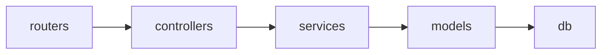

Below is the practical usage guide for your current `system_architecture_audit.py`, and exactly what you get from each usage mode.

---

# 1. Basic command-line usage

## A. Simple local audit

```bash
python backend/scripts/system_architecture_audit.py --no-fail --show-intended
```

### What you get

- Full architecture audit printed in terminal
- RED / YELLOW / GREEN findings
- Damage hotlist
- Domain-wise findings:
  - repo
  - backend
  - database
  - security
  - frontend
  - docs
  - infra
- Architecture metrics
- Intended target structure printed
- Markdown report written to:

```text
REPO_LAYOUT_AUDIT_REPORT.md
```

### When to use

Use this for normal local inspection.

`--no-fail` means the script will not return a failing exit code even if RED issues exist.

---

## B. Strict audit with CI failure behavior

```bash
python backend/scripts/system_architecture_audit.py
```

### What you get

Same as above, but:

- if any RED violation exists, the script exits with code `1`
- if no RED violation exists, it exits with code `0`

### When to use

Use this when you want the audit to act as a gate.

Example:

- pre-commit hook
- CI pipeline
- automated architecture enforcement

---

# 2. CI usage

## A. Minimal CI gate

```bash
python backend/scripts/system_architecture_audit.py --ci
```

### What you get

In CI mode, the script automatically creates:

```text
out/governance/audit.json
out/governance/metrics.json
.governance/architecture_trend.json
```

It also:

- writes the normal Markdown report
- writes registry files unless disabled
- prints full stdout report
- exits non-zero if RED findings exist

### When to use

Use this in GitHub Actions, GitLab CI, Jenkins, etc.

Example:

```yaml
- name: Architecture audit
  run: python backend/scripts/system_architecture_audit.py --ci
```

---

## B. CI gate but do not fail pipeline

```bash
python backend/scripts/system_architecture_audit.py --ci --no-fail
```

### What you get

Same CI artifacts, but the script always exits with code `0`.

### When to use

Use this when you want to collect architecture reports without blocking the pipeline.

Good for:

- early adoption
- monitoring architecture debt
- reporting only

---

# 3. First-time baseline usage

When using trend reporting for the first time, run:

```bash
python backend/scripts/system_architecture_audit.py --ci --update-trend --show-intended
```

### What you get

It creates the initial trend baseline:

```text
.governance/architecture_trend.json
```

This stores:

- RED count
- YELLOW count
- debt score
- rule counts
- module count
- edge count
- layer counts
- top fan-in modules
- top fan-out modules
- frontend metrics
- auto-discovery summary

### Why this matters

Next time you run the audit, it can compare:

```text
old audit → new audit
```

and tell you:

- architecture improved
- architecture degraded
- which rule counts increased
- which rule counts decreased

---

# 4. Trend comparison usage

After a baseline exists, run:

```bash
python backend/scripts/system_architecture_audit.py --ci
```

or:

```bash
python backend/scripts/system_architecture_audit.py --trend-file .governance/architecture_trend.json
```

### What you get

A trend section like:

```text
ARCHITECTURE TREND
RED: 18 -> 12
YEL: 96 -> 81
DEBT SCORE: 4230 -> 3110

Regressions:
  +2   DG    5 -> 7

Improvements:
  -4   S1    8 -> 4
  -10  F4    22 -> 12
```

### What this tells you

You can see:

- whether architecture debt is increasing or decreasing
- which rule categories are getting worse
- which cleanup efforts worked
- whether new violations were introduced

---

# 5. Update trend baseline

```bash
python backend/scripts/system_architecture_audit.py --ci --update-trend
```

### What you get

It overwrites:

```text
.governance/architecture_trend.json
```

with the latest audit summary.

### When to use

Use this after:

- a major cleanup
- a refactor
- a migration
- accepting a new architecture baseline

Do not use this casually, because it becomes your new comparison point.

---

# 6. JSON output usage

## A. Default JSON output

```bash
python backend/scripts/system_architecture_audit.py --json out/audit.json
```

### What you get

A machine-readable JSON file:

```text
out/audit.json
```

It contains:

```json
{
  "summary": {
    "red": 10,
    "yellow": 80,
    "green": 12,
    "debt_score": 2650,
    "modules": 430,
    "edges": 1900
  },
  "findings": [
    {
      "sev": "VIOLATION",
      "code": "DG",
      "domain": "backend",
      "path": "backend/controllers/chat_controller.py",
      "line": 42,
      "message": "forbidden dependency edge...",
      "intended": "..."
    }
  ]
}
```

### When to use

Use this for:

- CI dashboards
- custom reporting
- architecture tracking over time
- integration with other tools
- AI-assisted cleanup

---

## B. CI JSON output

```bash
python backend/scripts/system_architecture_audit.py --ci
```

### What you get

Automatically writes:

```text
out/governance/audit.json
```

---

# 7. Metrics JSON usage

```bash
python backend/scripts/system_architecture_audit.py --metrics-json out/metrics.json
```

### What you get

A detailed module-level metrics file:

```text
out/metrics.json
```

It includes:

- module name
- fan-in
- fan-out
- instability score

Example:

```json
{
  "module": "services.orders.order_service",
  "fan_in": 24,
  "fan_out": 6,
  "instability": 0.2
}
```

### What this tells you

You can identify:

- god modules
- over-used utilities
- unstable modules
- highly coupled modules
- dead modules
- core architectural hotspots

### When to use

Use this when you want to answer questions like:

- Which service is too heavily depended on?
- Which module has too many outgoing dependencies?
- Which module is unstable?
- Which module should be split?
- Which module may be dead?

---

# 8. Markdown report usage

By default, the script writes:

```text
REPO_LAYOUT_AUDIT_REPORT.md
```

You can change the path:

```bash
python backend/scripts/system_architecture_audit.py --out out/architecture_report.md
```

### What you get

A human-readable report containing:

- scorecard
- rule counts
- damage hotlist
- architecture metrics
- top fan-in modules
- top fan-out modules
- frontend metrics
- auto-discovery summary
- domain-wise findings
- intended target structure

### When to use

Use this for:

- sharing with team
- attaching to PRs
- architecture review
- documentation snapshots
- cleanup planning

Important:

This report is generated output. It should usually be gitignored.

---

# 9. Registry output usage

Unless disabled, the script writes:

```text
.governance/architecture_registry.json
```

### What you get

This is the most important generated architecture model.

It contains:

- all detected modules
- layers
- domains
- domain confidence
- fan-in
- fan-out
- instability
- dead module flags
- entrypoint flags
- legal edges
- illegal edges
- features
- domains
- triage modules

### Why this is useful

This file becomes a machine-readable architecture model.

You can use it to:

- generate graphs
- generate dashboards
- detect ownership gaps
- find illegal dependencies
- find triage modules
- find flat-folder disease
- track architecture evolution

---

# 10. CODEOWNERS output usage

The script also writes:

```text
CODEOWNERS
```

### What you get

A generated ownership file based on discovered domains.

Example:

```text
backend/services/finance/   @zozi/finance
backend/models/finance/     @zozi/finance
backend/routers/admin/      @zozi/platform
```

### What this gives you

It helps connect architecture to ownership.

You can later customize owners by creating:

```text
.governance/owners.json
```

Example:

```json
{
  "finance": {
    "owner": "@zozi/finance"
  },
  "orders": {
    "owner": "@zozi/orders"
  },
  "catalog": {
    "owner": "@zozi/catalog"
  }
}
```

Then rerun the audit.

---

# 11. Mermaid graph output usage

The script writes:

```text
.governance/architecture_graph.mmd
```

### What you get

A dependency graph in Mermaid format.

Example:



### What this gives you

You can visualize:

- layer dependencies
- domain dependencies
- illegal dependency directions
- architectural drift

### When to use

Use this for:

- architecture documentation
- team discussions
- PR reviews
- refactor planning
- onboarding

---

# 12. Auto-policy usage

The script writes:

```text
.governance/zozi_auto_policy.json
```

### What you get

It learns and stores:

- discovered backend domains
- discovered frontend features
- discovered top-level backend packages
- discovered cross-domain dependencies
- discovered feature names

### What this gives you

It allows the auditor to learn your architecture over time without you manually maintaining YAML.

It can detect:

- new domain appeared
- new feature appeared
- new cross-domain dependency appeared
- new top-level backend package appeared

### Example findings

```text
AUTO3  new backend domain detected
AUTO6  new cross-domain dependency learned
AUTO8  new top-level backend package detected
AUTO10 new feature detected
```

---

# 13. Reset auto-policy usage

If the learned policy becomes stale or wrong:

```bash
python backend/scripts/system_architecture_audit.py --reset-auto-policy --ci
```

### What you get

It deletes the old:

```text
.governance/zozi_auto_policy.json
```

and creates a fresh baseline.

### When to use

Use this after:

- major refactoring
- deleting many modules
- renaming domains
- moving folders
- changing architecture direction

---

# 14. Disable auto-policy usage

If you do not want learning:

```bash
python backend/scripts/system_architecture_audit.py --no-auto-policy
```

### What you get

The audit runs normally but does not read or write:

```text
.governance/zozi_auto_policy.json
```

### When to use

Use this if you want a pure static audit with no learned state.

---

# 15. Disable registry output usage

If you do not want generated registry files:

```bash
python backend/scripts/system_architecture_audit.py --no-registry
```

### What you get

It skips writing:

```text
.governance/architecture_registry.json
CODEOWNERS
.governance/architecture_graph.mmd
```

### When to use

Use this if you only want:

- terminal output
- Markdown report
- JSON findings

and you do not want architecture registry artifacts.

---

# 16. Disable Markdown report usage

```bash
python backend/scripts/system_architecture_audit.py --no-write
```

### What you get

It prints the audit to terminal but does not write:

```text
REPO_LAYOUT_AUDIT_REPORT.md
```

### When to use

Use this for:

- quick inspection
- CI logs
- temporary checks

---

# 17. Specify repository root manually

```bash
python backend/scripts/system_architecture_audit.py --root /path/to/zozi
```

### What you get

It audits the given repository root instead of auto-detecting.

### When to use

Use this when:

- you are running from the wrong directory
- auto-detection fails
- you are scripting the audit
- you have multiple checkouts

---

# 18. Specify rules directory manually

```bash
python backend/scripts/system_architecture_audit.py --rules-dir documents/scope
```

or:

```bash
python backend/scripts/system_architecture_audit.py --rules-dir governance
```

### What you get

It tries to load rules from:

```text
repo_structure.yaml
layer_rules.yaml
governance.yaml
```

inside that directory.

### What happens if YAML does not exist

The script still works using embedded fallback rules.

So YAML is optional.

---

# 19. Show intended target structure

```bash
python backend/scripts/system_architecture_audit.py --show-intended
```

### What you get

It prints the intended clean target structure.

Example:

```text
backend/
  routers/
    admin/
    supplier/
    customer/
    public/
    webhooks/

  controllers/
    finance/
    orders/
    catalog/

  services/
    finance/
    treasury/
    orders/
    catalog/
    supplier/
    logistics/
    comms/
    hr/
    ai/

  models/
    finance/
    orders/
    catalog/
```

### Why this is useful

It reminds you what the architecture should become.

It turns the audit from:

```text
this is wrong
```

into:

```text
this is wrong → move it here
```

---

# 20. Full recommended local command

For normal development, use:

```bash
python backend/scripts/system_architecture_audit.py --no-fail --show-intended
```

### What you get

- full audit
- intended structure
- report file
- registry files
- terminal output
- no pipeline failure

---

# 21. Full recommended CI command

For CI, use:

```bash
python backend/scripts/system_architecture_audit.py --ci
```

### What you get

- strict gate
- JSON output
- metrics output
- trend comparison
- registry output
- Markdown report
- failure on RED violations

---

# 22. Full artifact generation command

If you want everything:

```bash
python backend/scripts/system_architecture_audit.py \
  --ci \
  --show-intended \
  --json out/governance/audit.json \
  --metrics-json out/governance/metrics.json \
  --trend-file .governance/architecture_trend.json \
  --out out/governance/audit_report.md
```

On Windows PowerShell:

```powershell
python backend/scripts/system_architecture_audit.py `
  --ci `
  --show-intended `
  --json out/governance/audit.json `
  --metrics-json out/governance/metrics.json `
  --trend-file .governance/architecture_trend.json `
  --out out/governance/audit_report.md
```

### What you get

Everything:

- terminal audit
- Markdown report
- JSON findings
- module metrics
- trend comparison
- architecture registry
- CODEOWNERS
- Mermaid graph
- auto-policy learning

---

# 23. What each generated file means

| File | What it is | What you get from it |
|---|---|---|
| `REPO_LAYOUT_AUDIT_REPORT.md` | Human-readable audit report | Easy-to-read findings, hotlist, metrics |
| `out/governance/audit.json` | Machine-readable findings | CI integration, dashboards, custom tooling |
| `out/governance/metrics.json` | Module-level metrics | Fan-in, fan-out, instability, hotspots |
| `.governance/architecture_trend.json` | Trend baseline | Compare architecture health over time |
| `.governance/architecture_registry.json` | Canonical architecture model | Modules, domains, edges, illegal edges, features |
| `.governance/zozi_auto_policy.json` | Learned architecture policy | Auto-discovered domains, features, dependencies |
| `.governance/architecture_graph.mmd` | Mermaid dependency graph | Visual architecture graph |
| `CODEOWNERS` | Generated ownership file | Maps domains to owners |

---

# 24. What insights you get from the audit

## A. Structure insights

You will know:

- which files are in the wrong place
- which folders are flat
- which packages are missing
- which folders should be domain folders
- which folders should be surface folders
- which scratch files should be deleted
- which artifacts should not be committed

Example findings:

```text
S1  services/ is flat
M2  models/ is flat
S3  routers/controllers flat
P3  module at backend root
F4  committed cache/build artifact
```

---

## B. Layer violation insights

You will know when a layer breaks the architecture.

Example:

```text
controller imports database
service imports router
model imports controller
provider imports service
```

Example findings:

```text
DG   forbidden dependency edge
W1   controller writes to DB
Q1   controller reads DB directly
R1   APIRouter outside routers/
```

---

## C. Circular dependency insights

You will detect cycles like:

```text
orders -> payments -> inventory -> orders
```

Example findings:

```text
DG2 circular module dependency
DG2 circular domain dependency
```

---

## D. Domain ownership insights

If domain policy exists, you will detect:

```text
finance imports hr internals
orders imports supplier internals
catalog imports comms internals
```

Example finding:

```text
DG3 cross-domain import violates ownership
```

Without explicit YAML, the script still learns domain edges through auto-policy.

---

## E. Dead module insights

You will detect modules that appear unused.

Example:

```text
A2 module has no inbound imports and is not an obvious entrypoint
```

This helps you find:

- unused services
- unused controllers
- unused utilities
- abandoned experiments
- dead providers

---

## F. Architecture hotspot insights

You will detect modules with dangerous coupling.

Example:

```text
A1 architecture hotspot: fan_in=48, fan_out=31, instability=0.39
```

This helps you find:

- god modules
- over-imported utilities
- unstable modules
- modules that need splitting

---

## G. Duplicate name insights

You will detect:

- duplicate module file names
- duplicate class names

Example:

```text
D1 same module name in multiple dirs
D3 class name defined in multiple modules
```

This helps prevent:

- import confusion
- wrong module imported
- duplicated logic
- unclear ownership

---

## H. Security insights

You will detect:

- secret files on disk
- hardcoded secret-like literals
- dangerous execution patterns
- unsafe deserialization
- shell injection risk
- debug mode hardcoded
- dangerous CORS configuration

Example findings:

```text
F5   secret material on disk
SEC2 possible hardcoded secret/token
SEC3 dangerous dynamic execution
SEC4 insecure runtime setting
```

---

## I. Performance insights

You will detect:

- blocking calls inside async functions
- possible query inside loop
- N+1 risk

Example findings:

```text
PERF1 blocking call inside async function
PERF2 possible DB query inside loop
```

---

## J. Code quality insights

You will detect:

- bare except
- swallowed exceptions
- TODO/FIXME debt
- oversized files
- oversized functions
- print statements in app code

Example findings:

```text
QUAL1 weak exception handling
QUAL2 TODO/FIXME debt
QUAL3 oversized file/function
QUAL4 print/debug output
```

---

## K. Database insights

You will detect:

- models outside `models/`
- second migrations home
- Alembic diagnostics in wrong place
- models missing schema declaration
- multiple Alembic heads

Example findings:

```text
M1  ORM model outside models/
G1  second migrations home
DB1 model missing __table_args__
DB2 multiple Alembic heads
```

---

## L. Frontend insights

You will detect:

- missing workspace package.json
- frontend scratch scripts
- flat frontend folders
- oversized frontend folders
- cross-workspace relative imports
- console/debugger statements

Example findings:

```text
FE1 missing frontend workspace file
FE2 frontend scratch script
FE3 frontend flat folder
FE4 cross-workspace relative import
FE5 frontend folder too large
FE6 console/debugger statement
```

---

# 25. What the debt score means

The script produces:

```text
ARCHITECTURE DEBT SCORE
```

Example:

```text
ARCHITECTURE DEBT SCORE: 4820
```

### What it means

Higher score = worse architecture health.

It increases with:

- RED violations
- YELLOW advisories
- dependency violations
- cycles
- cross-domain leaks
- security issues
- performance smells
- frontend scaling issues
- config issues

### What to do with it

Track it over time.

Good trend:

```text
4820 → 4100 → 3200 → 2100
```

Bad trend:

```text
2100 → 2900 → 4100
```

---

# 26. Exit code behavior

| Command | Behavior |
|---|---|
| `python backend/scripts/system_architecture_audit.py` | Fails if RED findings exist |
| `python backend/scripts/system_architecture_audit.py --no-fail` | Always exits 0 |
| `python backend/scripts/system_architecture_audit.py --ci` | Fails if RED findings exist |
| `python backend/scripts/system_architecture_audit.py --ci --no-fail` | Always exits 0 |

---

# 27. Recommended workflow

## Step 1: First baseline

Run:

```bash
python backend/scripts/system_architecture_audit.py --ci --update-trend --show-intended
```

This creates your starting point.

---

## Step 2: Review report

Open:

```text
REPO_LAYOUT_AUDIT_REPORT.md
```

or:

```text
out/governance/audit_report.md
```

Focus first on:

1. RED findings
2. Damage hotlist
3. DG violations
4. W1 controller DB writes
5. M1 model misplacement
6. G1 duplicate migrations
7. F5 secrets
8. S1/M2 flat folders

---

## Step 3: Fix RED issues first

Do not try to fix everything at once.

Fix in this order:

1. secrets
2. forbidden dependency edges
3. controller DB writes
4. ghost backend
5. duplicate migrations
6. models outside models
7. flat service/model folders
8. dead modules
9. performance smells
10. quality smells

---

## Step 4: Rerun audit

```bash
python backend/scripts/system_architecture_audit.py --ci
```

Check whether:

- RED count decreased
- debt score decreased
- trend shows improvement

---

## Step 5: Update baseline after major cleanup

```bash
python backend/scripts/system_architecture_audit.py --ci --update-trend
```

---

# 28. Simple usage cheat sheet

| Goal | Command |
|---|---|
| Quick local audit | `python backend/scripts/system_architecture_audit.py --no-fail --show-intended` |
| Strict audit | `python backend/scripts/system_architecture_audit.py` |
| CI audit | `python backend/scripts/system_architecture_audit.py --ci` |
| CI without failure | `python backend/scripts/system_architecture_audit.py --ci --no-fail` |
| Create trend baseline | `python backend/scripts/system_architecture_audit.py --ci --update-trend` |
| Compare trend | `python backend/scripts/system_architecture_audit.py --ci` |
| Write JSON | `python backend/scripts/system_architecture_audit.py --json out/audit.json` |
| Write metrics | `python backend/scripts/system_architecture_audit.py --metrics-json out/metrics.json` |
| Skip report file | `python backend/scripts/system_architecture_audit.py --no-write` |
| Skip registry | `python backend/scripts/system_architecture_audit.py --no-registry` |
| Reset learned policy | `python backend/scripts/system_architecture_audit.py --reset-auto-policy --ci` |
| Disable learning | `python backend/scripts/system_architecture_audit.py --no-auto-policy` |
| Specify repo root | `python backend/scripts/system_architecture_audit.py --root /path/to/repo` |
| Specify rules dir | `python backend/scripts/system_architecture_audit.py --rules-dir documents/scope` |

---

# 29. What you get overall

If you use this regularly, you get:

1. A mechanical architecture enforcer
2. A dependency graph validator
3. A structure cleanup planner
4. A security smell detector
5. A performance smell detector
6. A frontend scaling checker
7. A database structure checker
8. A dead-code detector
9. A coupling hotspot detector
10. A trend tracker
11. A generated architecture registry
12. A generated ownership file
13. A generated dependency graph
14. A CI gate to stop future drift

In short:

```text
Without this script:
  architecture drift is discovered late, usually after damage.

With this script:
  architecture drift is detected immediately and can be blocked in CI.
```